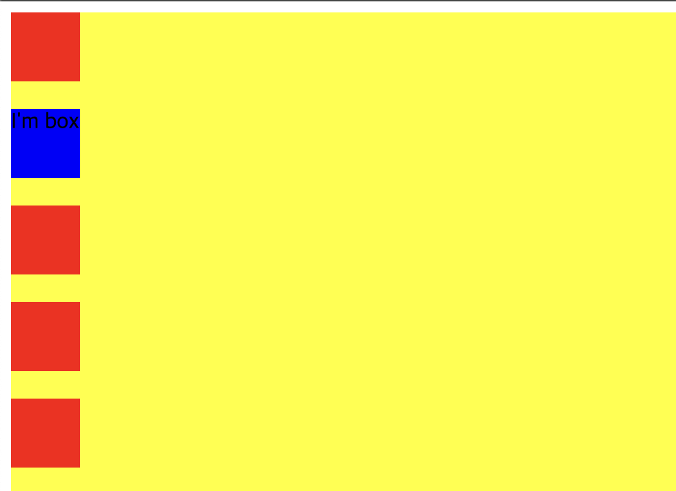
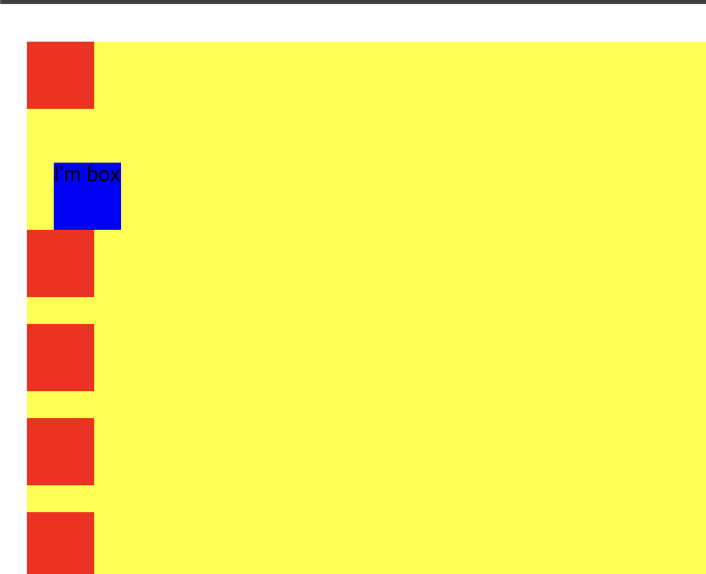
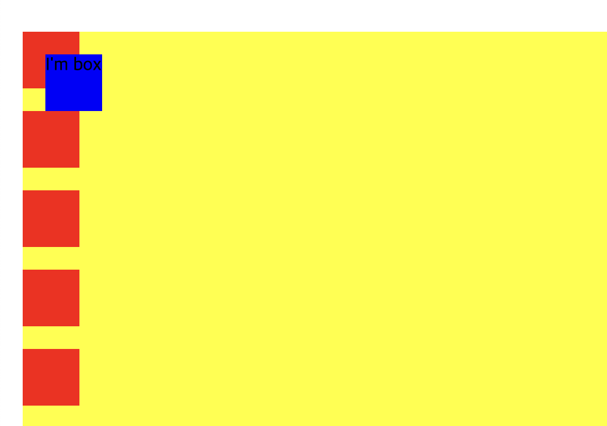
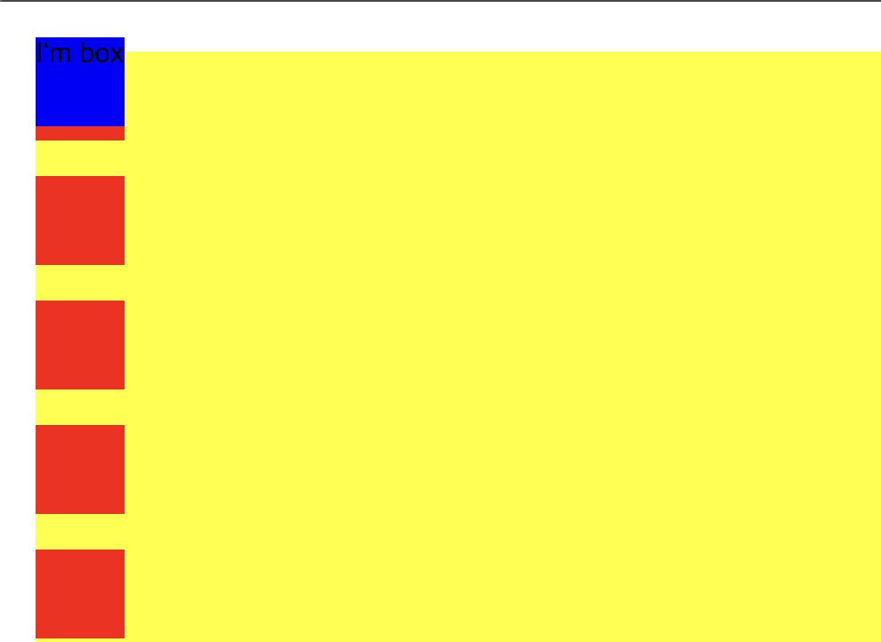
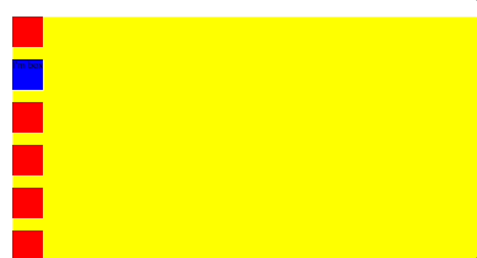
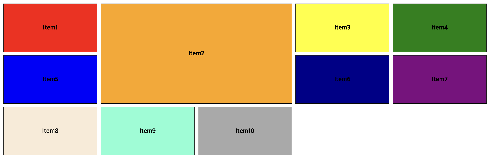
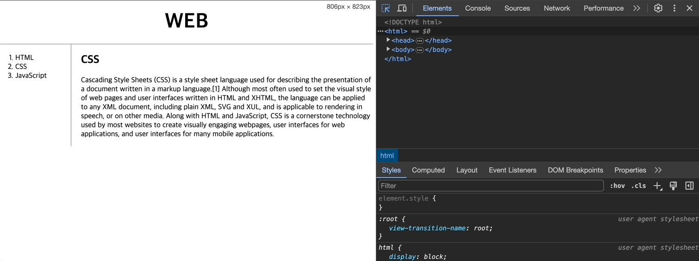

# CSS

[💬 시작하기 전에](#-시작하기-전에)<br>
[📍 Selector](#-selector)<br>
[📍 Display & Position](#-display--position)<br>
[📍 Flex Box](#-flex-box)<br>
[📍 Box Model](#-box-model)<br>
[📍 Grid Model](#-grid-model)<br>
[📍 Media Query](#-media-query)<br>
<br>

## 💬 시작하기 전에..

이전에 참가했던 국비교육을 통해서 HTML, CSS, JS를 배웠으나 해당 교육은 프론트엔드를 중점으로 하는 수업이 아니었기 때문에 간단하게 배웠었다!<br>
그래서 정말 간단한 CSS 지식과 부트스트랩 사용 방법만 알고 있었다. 물론 정말 유용하고 도움이 되는 경험이지만 내가 원하는 목표에는 조금 부족했다<br>
내가 원하는 목표는

1. CSS를 정말 자유롭게 사용하기
2. 그리드와 position을 자유롭게 사용하기
3. 미디어쿼리 사용하기

이다.

이러한 목표를 달성하기 위해서 **생활코딩, 드림코딩**님의 CSS 강의를 선택하여 듣기로 했다.

<br>

## 📍 Selector

선택자는 다음의 문서를 통해서 참고하면 된다!

[W3Schools의 Selector](https://www.w3schools.com/cssref/css_selectors.php)

<br>

## 📍 Display & Position

### 📖 Display

```css
/* displayPosition.html */
div,
span {
  width: 80px;
  height: 80px;
  margin: 20px;
}

div {
  background-color: aquamarine;
  display: inline-block; /*inline 만 하면 보이지 않는다. -> 안의 콘텐츠 크기만을 본다! // inline-block: 콘텐츠 크기 보단 이를 상자처럼..*/
}

span {
  background-color: pink;
  display: block;
}
```

- `inline` : 안의 콘텐츠 크기만을 중점적으로
- `inline-block` : 콘텐츠라기 보단 이를 상자처럼 여기는 대신, inline에 맞게 한 줄 안에 표현
- `block` : 상자. 한 줄에 하나씩 배치


<br>

### 📖 Position

```css
/* displayPosition.html */

/* static */
div {
  width: 50px;
  height: 50px;
  margin-bottom: 20px;
  background-color: red;
}

.container {
  background-color: yellow;
  left: 20px;
  top: 20px;
  position: static;
}

/* relative */
div {
  width: 50px;
  height: 50px;
  margin-bottom: 20px;
  background-color: red;
}

.container {
  background-color: yellow;
  left: 20px;
  top: 20px;
  position: relative;
}

.box {
  background-color: blue;
  left: 20px;
  top: 20px;
  position: relative;
}

/* absolute */
.box {
  background-color: blue;
  left: 20px;
  top: 20px;
  position: absolute;
}

/* fixed */
.box {
  background-color: blue;
  left: 20px;
  top: 20px;
  position: fixed;
}

/* sticky */
.box {
  background-color: blue;
  left: 20px;
  top: 20px;
  position: sticky;
}
```

- position은 기본값으로 `static`이다.
- `static` : html에 정의된 순서대로 브라우저 상에 자연스럽게 보여짐.
- `relative` : 원래 있어야하는 자리(`static`)에서 옮겨가는 것. &rarr; 원래 아이템이 존재하는 위치에서 상대적으로 위치 변경이 이뤄졌다.
- `absolute` : 해당 아이템이 담겨있는 곳(상자) 안에서 위치 변경이 이뤄짐.
- `fixed` : 해당 아이템이 담겨있는 상자 안에서 완전히 벗어나, window 안에서 움직임.
- `sticky` : 원래있던 자리에 있으면서 스크롤링을 되어도 없어지지 않고 원래 있는 자리에 그대로 붙어있다.

<table align="center" style="text-align:center">
  <thead>
    <tr>
      <td>staic</td>
      <td>relative</td>
      <td>absolute</td>
      <td>fixed</td>
      <td>sticky</td>
    </tr>
  </thead>
  <tbody>
    <tr>
      <td></td>
      <td></td>
      <td></td>
      <td></td>
      <td></td>
    </tr>
  </tbody>
</table>

<br>

## 📍 Flex Box

Flex는 다음의 링크를 통해서 공부했습니다! &rarr; 🔗 [JSbin](https://jsbin.com/?html,output)

- flex box에는 박스에 지정하는 속성값이 있고 box안의 item에 지정되는 속성값이 있다.
- main axis(중심축)와 cross axis(반대축)이 있다. &rarr; 설정하는 대로 바뀐다.

```css
/* flexbox.html */
.container {
  background: beige;
  height: 100vh; /*부모에 상관없이 해당 아이템을 보이는 뷰포트의 100%로 쓰겠다는 의미*/
  display: flex;
  flex-direction: row;
  flex-wrap: nowrap;
  flex-flow: column nowrap;
}
```

- `flex-direction` : 중심축 및 방향 설정.
  - `flex-direction: row;` : 중심축은 수평축(x)왼->오. 만약 `row-reverse`로 하면 오->왼 방향이 된다.
  - `flex-direction:column;` : 중심축을 수직축(y)이 되고 위->아래 방향. `column-reverse`면 아래->위 방향
- `flex-wrap` : 기본값은 `nowrap`.
  - `wrap` : 아이템이 한 줄에 꽉 차면 자동으로 다음 줄로 넘어감
  - `wrap-reverse` : 반대로 wrapping
- `flex-flow`는 위의 명령을 한꺼번에 할 수 있는 장치이다.

<br>

```css
.container {
  background: beige;
  height: 100vh;
  display: flex;
  flex-direction: row;
  flex-wrap: wrap;

  justify-content: space-between;

  align-items: center;

  align-content: space-between; /* 반대축의 아이템*/
}
```

- `justify-content` : 중심축에서 아이템들을 어떻게 배치할 것 인가
  - `flex-start` : 기본값. 왼->오 혹은 위->아래
  - `flex-end` : 아이템들의 순서는 유지하되 오른쪽으로 배치. 만약 column이 중심축이면 아래로 배치
  - `center` : 가운데
  - `space-around` : 박스를 둘러싸게 공간(space)를 넣어줌.
  - `space-evenly` : 똑같은 간격
  - `space-between` : 아이템을 가장 왼쪽과 가장 오른쪽은 화면에 맞게 배치하되 중간에만 간격을 줌.
- `align-content` : 반대축에서 아이템들을 어떻게 배치할 것인가.
  - justify-content에 들어간 속성을 사용 가능하다.
- `align-items` : 아이템의 개별 요소에 대한 설정
  - `center` : 해당 아이템들을 반대축에서 중심에 두고 싶다.
  - `baseline` : 아이템간의 텍스트의 위치가 변했을 때, 이를 균등하게 보여짐. 즉, 아이템 간의 텍스트들을 정렬

<br>

```css
.container {
  padding-top: 100px;
  background: beige;
  height: 100vh;
  display: flex;
}

.item {
  width: 40px;
  height: 40px;
  border: 1px solid black;
}

.item1 {
  background: #ef9a9a;
  order: 2;
}
.item2 {
  background: #f48fb1;
  order: 1;
}
.item3 {
  background: #ce93d8;
  order: 3;
}
```

- `order` : 개별 아이템의 순서를 직접 지정할 수 있다.
- 위의 css 코드를 해설하면, 순서는 다음과 같이 나올 것이다.
- 아이템2 &rarr; 아이템1 &rarr; 아이템3

<br>

```css
.container {
  padding-top: 100px;
  background: beige;
  height: 100vh;
  display: flex;
}

.item {
  width: 40px;
  height: 40px;
  border: 1px solid black;
}

.item1 {
  background: #ef9a9a;
  flex-grow: 1;

  flex-shrink: 2;

  flex-basis: 60%;

  align-self: center;
}
.item2 {
  background: #f48fb1;
  flex-shrink: 1;
  flex-basis: 30%;
}
.item3 {
  background: #ce93d8;
  flex-shrink: 1;
  flex-basis: 10%;
}
```

- `flex-grow` : 기본값 0. 아이템2,3은 자신의 고유한 사이즈인 40\*40을 지키지만 아이템1은 flex-grow:1로 했기 때문에 해당 박스를 채운다.
  - `item1{flex-grow:2;}, item2{flex-grow:1;}, item3{flex-grow:1;}`로 한다면 아이템1이 아이템2,3에 비해 2배로 채운다는 의미
- `flex-shrink` : 컨테이너가 점점 작아졌을 때 어떻게 행동할 것인가 기본값은 0.
  - 자신의 고유한 사이즈에서 더 작아질때 아이템1이 아이템2,3에 비해서 2배 더 작게 줄어든다. &rarr; 더 많이 줄어듦.
- `flex-basis` : 아이템들이 공간을 얼마나 차지해야하는지 세부적으로 설정. 기본은 auto &rarr; grow, shrink에 지정된 것에 맞춰 아이템들이 변형
  - 아이템1, 2, 3는 지정된 퍼센트에 맞게 공간을 차지한다. 이는 화면크기를 늘리든 줄이든 같은 퍼센트를 차지함.
- `align-self` : 컨테이너에서 지정된 것에서 벗어나서 아이템별로 아이템 정렬

🔗 [CSS-TRICKS | flexbox](https://css-tricks.com/snippets/css/a-guide-to-flexbox/)

<br>

## 📍 Box Model

```html
<!-- box.html -->
<style>
  h1 {
    border: 2px solid blue;
    display: inline; /*이렇게 하면 block -> inline으로 된다. 기본값을 변경!*/
  }
  a {
    border: 2px solid blue;
  }
</style>
```

1. `<h1>`은 화면 전체를 사용한다. &rarr; **block level element**
2. `<a>`는 자기 콘텐츠 크기 만큼의 부피를 사용한다. &rarr; **inline level element**
3. 이것들은 기본값일 뿐, 언제든지 CSS를 통해서 변경이 가능하다.

하지만 위의 CSS 파일은 중복되어있는데 이것을 중복이 되지 않게끔 조정을 한다면

```css
h1,
a {
  border: 2px solid blue;
}
```

로 변경이 가능하다.

### 📖 padding & margin

```css
h1 {
  border: 2px solid blue;
  padding: 20px; /* 콘텐츠와 border 사이의 간격*/
  margin: 20px; /* 요소 간의 간격*/
  width: 100px; /* 가로(너비) 길이를 100px로 변경 */
}
```

<br>


<br>

## 📍 Grid Model

```html
<!-- grid.html -->
<!DOCTYPE html>
<html lang="en">
  <head>
    <meta charset="UTF-8" />
    <meta name="viewport" content="width=device-width, initial-scale=1.0" />
    <title>Document</title>
    <style>
      #grid {
        border: 5px solid pink;
        display: grid;
        grid-template-columns: 150px 1fr; /*navigation은 150픽셀, article은 나머지를 다 차지*/
      }
      div {
        border: 5px solid gray;
      }
    </style>
  </head>
  <body>
    <!-- 두 요소를 나란히 배치하고 싶다? 그러면 두 요소를 감싸는 부모 요소 생성 후 나란히~ -->
    <div id="grid">
      <div>NAVIGATION</div>
      <div>ARTICLE</div>
    </div>
  </body>
</html>
```

<br>


### 📖 (+) Grid

- 부모 컨테이너에 `display:grid;` 라고 지정해줘야 하고. 그 안의 자식요소들은 grid cell이 된다.
- 부모 컨테이너(grid)
  - grid의 전체적인 모양과 사이즈에 대해 템플릿 지정 가능.
  - `grid-template-columns` : 몇 개의 column(가로)을 가질 수 있고, column의 사이즈
  - `grid-template-rows` : 몇 개의 row(세로)가 있고 사이즈는 어떻게 되는지
  - `grid-template-areas`,`gap(column-gap, row-gap)`
- 자식 요소(grid cell)
  - 얼만큼 차지할 것인지, grid안에서도 어떤 셀에 표기가 될 것인지, 몇개의 셀을 차지하는지 지정 가능.
  - `grid-column-start`, `grid-column-end` &rarr; 가로 몇 번째 셀부터 몇 번째 셀까지 보여줄 것인지 지정
  - `grid-row-start`, `grid-row-end` &rarr; 세로로 어디부터 어디까지 보여줄 것인지 지정
  - `grid-area`

<br>

#### 1. 부모 컨테이너(grid)

```css
.container {
  display: grid;
  grid-template-columns: repeat(5, 1fr);

  /* grid-template-rows: 100px 200px repeat(2,100px);  이렇게하거나 혹은*/
  grid-auto-rows: minmax(150px, auto);

  padding: 10px;
  gap: 10px;
}
```

- `repeat(5,10%);` = 5개의 grid, 사용가능한 화면의 10%
- `repeat(3,1fr)` : 사용가능한 너비를 3개로 나눠서 비율로 나눔
- `grid-auto-rows` : 몇 줄인지는 모르겠으나 개수에 상관없이 줄당 150px씩 &rarr; 단 안에 콘텐츠가 있을 수 있으니 `minmax()`를 이용
  - `minmax(150px, auto)` : 최소 150px ~ 자동으로 늘어나게
- `gap` : 셀 사이의 갭 &rarr; `column-gap, row-gap`을 사용할 수도 있다.

<br>

#### 2. 자식 요소(grid cell)

```css
.item2{
    grid-column-start: 2;
    grid-column-end: 4;
    grid-row-start: 1;
    grid-row-end: 3;
}

/* 이렇게 수정 가능 */
.item2 {
  grid-column: 2 / 4;
  grid-row: 1 / 3;
}

/* 혹은 */
.item2 {
  grid-column: 2 / span 2; /*2번째 줄에서 시작하되, 2개의 셀을 차지할거다~*/
  grid-row: 1 / 3;
}
```

- grid line을 통한 범위 지정
- column(가로) 기준
  - 제일 왼쪽에서부터 : 1 &rarr; 2 &rarr; 3 &rarr; ... 
  - 제일 오른쪽에서부터 : -1 &rarr; -2 &rarr; -3 &rarr; ...
- row(세로) 기준
  - 제일 위에서부터 : 1 &rarr; 2 &rarr; 3 &rarr; ...
  - 제일 아래서부터 : -1 &rarr; -2 &rarr; -3 &rarr; ...

**결과** 



<br>

#### `grid-area` 사용하기

```css
body {
  padding: 5rem;
  background-color: black;
}

.container {
  display: grid;
  grid-template-columns: repeat(3, 1fr);
  grid-auto-rows: 150px;
  gap: 1rem;

  grid-template-areas: /* 영역 설정!! */
    "a a a"
    "b c c"
    "b d g"
    "e f g";
}

.image {
  /* 이미지가 부모 컨테이너의 100% 너비와 높이를 가지도로고 함 */
  width: 100%;
  height: 100%;

  object-fit: cover;
}

.image1{
    grid-area: a; /* image1은 grid-template-areas에 a라고 표시되어 있는 곳에 위치해라. */
}

.image2{
    grid-area: b;
}

.image3{
    grid-area: c;
}

.image4{
    grid-area: d;
}

.image5{
    grid-area: e;
}

.image6{
    grid-area: f;
}

.image7{
    grid-area: g;
}
```

**결과**


<br>

### 📖 Box Model과 Grid Model 적용

```html
<!-- index.html -->
<!DOCTYPE html>
<html>
  <head>
    <title>WEB - CSS</title>
    <meta charset="utf-8" />
    <style>
      body {
        margin: 0;
      }
      a {
        color: black;
        text-decoration: none;
      }
      h1 {
        font-size: 45px;
        text-align: center;
        border-bottom: 1px solid gray;
        margin: 0;
        padding: 20px;
      }
      ol {
        border-right: 1px solid gray;
        width: 100px;
        margin: 0;
        padding: 20px;
      }
      #grid {
        display: grid;
        grid-template-columns: 150px 1fr;
      }
      #grid ol {
        padding-left: 33px;
      }
      #article {
        padding-left: 25px;
      }
    </style>
  </head>
  <body>
    <h1><a href="index.html">WEB</a></h1>
    <div id="grid">
      <ol>
        <li><a href="1.html">HTML</a></li>
        <li><a href="2.html">CSS</a></li>
        <li><a href="3.html">JavaScript</a></li>
      </ol>
      <div id="article">
        <h2>CSS</h2>
        <p>
          Cascading Style Sheets (CSS) is a style sheet language used for
          describing the presentation of a document written in a markup
          language.[1] Although most often used to set the visual style of web
          pages and user interfaces written in HTML and XHTML, the language can
          be applied to any XML document, including plain XML, SVG and XUL, and
          is applicable to rendering in speech, or on other media. Along with
          HTML and JavaScript, CSS is a cornerstone technology used by most
          websites to create visually engaging webpages, user interfaces for web
          applications, and user interfaces for many mobile applications.
        </p>
      </div>
    </div>
  </body>
</html>
```

<br>


<br>

## 📍 Media Query

```css
/* mediaQuery.html */

div {
  border: 5px solid aquamarine;
  font-size: 50px;
}

/*screen width > 800 이면 안보이게*/
@media (min-width: 800px) {
  div {
    display: none;
  }
}

/*screen width < 800 이면 안보이게*/
@media (max-width: 800px) {
  div {
    display: none;
  }
}
```

<br>

### 📖 Media Query 적용

```css
/* index.html*/

@media (max-width: 800px) {
  #grid {
    display: block;
  }
  ol {
    border: none;
  }
  h1 {
    border: none;
  }
}
```

<br>



## <br><br>

### 더 알아보기

🔗 [MDN CSS](https://developer.mozilla.org/ko/docs/Learn/CSS)
