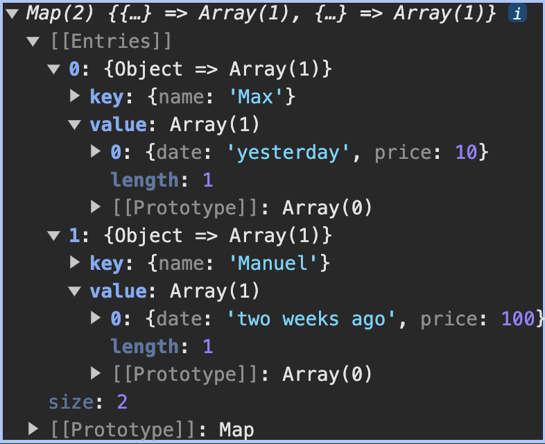
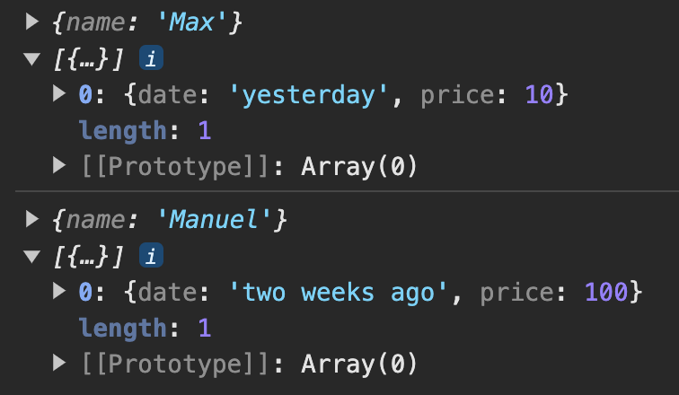

# 배열 & 반복

[📌 반복과 유사 배열 객체](#📌-반복과-유사-배열-객체)<br>
[📌 배열 생성하기](#📌-배열-생성하기)<br>
[📌 forEach() 메서드](#📌-반복문-대안--foreach-메서드)<br>
[📌 map()으로 데이터 변환하기](#📌-map으로-데이터-변환하기)<br>
[📌 sort()와 reverse()](#📌-sort와-reverse)<br>
[📌 filter()로 배열 필터링하기](#📌-filter로-배열-필터링하기)<br>
[🔥 `reduce()` 메서드 🔥](#🔥-reduce-메서드-🔥)<br>
[📌 배열 & 문자열 - split(), join()](#📌-배열--문자열---split-join)<br>
[📌 분산 연산자 (...)](#📌-분산-연산자)<br>
[📌 배열 구조 분해 이해하기](#📌-배열-구조-분해-이해하기)<br>

## 📌 반복과 유사 배열 객체

- Iterable : for-of 반복문을 사용할 수 있는 것.
- JavaScript의 모든 Iterable이 배열은 아니다. &rarr; 예시 : NodeList, String, Map, Set
- 유사 배열 객체(Array-like Object)
  - 기술적 : 길이(length) 프로퍼티가 있고 아이템에 엑세스하기 위해 인덱스를 사용한다.
  - 모든 유사 배열 객체가 배열은 아니다. &rarr; 예시 : NodeList, String
    <br>

## 📌 배열 생성하기

```javascript
const moreNumbers = new Array(5);
console.log(moreNumbers); //[empty × 5]

const moreNumbers2 = Array(5); // 위와 같은 동작으로 배열이 생성됨
```

- `Array(5)`처럼 단일 숫자만을 넣게 되면 만들어질 배열에 대한 길이로 표시되며, 단일 숫자가 있는 배열 대신 그 길이 만큼의 빈 배열이 생성된다.

```javascript
const yetMoreNumbers = Array.of(1, 2);
console.log(yetMoreNumbers);
```

- 전역에서 사용 가능한 배열 객체에 대한 특별한 메서드.

```javascript
const moreNumbers = Array.from("Hi!"); // 이터러블이나 유사배열객체가 들어간다.
console.log(moreNumbers); // ['H', 'i', '!']
```

<br>

### 📖 배열에는 어떤 데이터를 저장할 수 있을까?

- 숫자, 문자열, 객체를 저장할 수 있다.
- 동일한 유형의 배열도 가능하다는 것도 알고 있자!
  ```javascript
  const hobbies = ["Cooking", "Sports"];
  const personalData = [30, "Max", { moreDetail: [] }];
  ```
- 중첩 배열이나 다차원 배열도 가능하다.
  ```javascript
  const analyticsData = [
    [1, 1.6],
    [-5.4, 2.1],
  ];
  for (const data of analyticsData) {
    for (const dataPoint of data) {
      console.log(dataPoint); // 1, 1.6, -5.4, 2.1
    }
  }
  ```
  <br>

### 📖 `push(), pop(), unshift(), shift()` - 배열 추가 & 제거하기

```javascript
const hobbies = ["Sports", "Cooking"];
hobbies.push("Reading");
console.log(hobbies); // ['Sports', 'Cooking', 'Reading']
hobbies.unshift("Coding");
console.log(hobbies); // ['Coding', 'Sports', 'Cooking', 'Reading']

hobbies.pop();
console.log(hobbies); // ['Coding', 'Sports', 'Cooking']
hobbies.shift();
console.log(hobbies); // ['Sports', 'Cooking']
```

- `push()` : 항상 배열의 마지막에 새 요소를 추가한다.
- `unshift()` : 맨 앞의 첫번째 요소로 추가가 됨. 모든 요소를 오른쪽 끝으로 보냄.
- `pop()` : 배열의 마지막 요소 삭제. 또한 삭제된 요소를 반환한다.
- `shift()` : 배열의 모든 요소를 왼쪽으로 한 자리 이동. 따라서 첫번째 요소가 삭제
- `unshift()`와 `shift()`는 배열의 모든 요소에 영향을 미치며 모든 요소를 이동시킨다. 단, `push(), pop()`보다는 좀 느리다.

```javascript
hobbies[1] = "Coding";
console.log(hobbies); // ['Sports', 'Coding'] => Cooking에서 Coding으로 변환.
hobbies[5] = "Reading";
console.log(hobbies); // ['Sports', 'Coding', empty x 3, 'Reading']
```

<br>

### 📖 `splice()` 메서드

```javascript
hobbies.splice(0, 0); // 아무것도 삭제하지 않음.
hobbies.splice(0, 0, "Good Food"); // 삭제된 값의 위치에 삽입될 item이라는 인수를 원하는 만큼 추가할 수 있다.
console.log(hobbies); // ['Good Food', 'Sports', 'Coding']

hobbies.splice(1, 0, "Good Food");
console.log(hobbies); // ['Sports', 'Good Food', 'Coding']
const removedItem = hobbies.splice(0, 1); // 삭제된 값을 리턴해서 저장.
console.log(hobbies); // ['Good Food', 'Coding']

console.log(hobbies); // ['Sports', 'Good Food', 'Coding']
hobbies.splice(-1, 1); // 마지막 삭제
console.log(hobbies); // ['Sports', 'Good Food']
```

- `splice()` : 시작 인덱스, 삭제하려는 항목의 수

<br>

### 📖 범위 선택하기 & `slice()`로 복제 생성하기

```javascript
const testResults = [1, 5.3, 1.5, 10.99, -5, 10];
console.log(testResults.slice()); // 배열 복사하는 방법 1

const testResults = [1, 5.3, 1.5, 10.99, -5, 10];
const storedResults = testResults; // 동일한 주소.
testResults.push(5.3);
console.log(storedResults, testResults); // [1, 5.3, 1.5, 10.99, -5, 10, 5.3], [1, 5.3, 1.5, 10.99, -5, 10, 5.3]

const testResults = [1, 5.3, 1.5, 10.99, -5, 10];
const storedResults = testResults.slice(); //
testResults.push(5.3);
console.log(storedResults, testResults); // [1, 5.3, 1.5, 10.99, -5, 10], [1, 5.3, 1.5, 10.99, -5, 10, 5.3]
// storedResults와 testResults의 값이 다른 것을 볼 수 있다.
```

- `testResults.slice()`를 하면 기본의 배열을 기반으로 새 배열을 반환한다.

```javascript
const testResults = [1, 5.3, 1.5, 10.99, -5, 10];
const storedResults = testResults.slice(0, 2);
console.log(storedResults, testResults); // [1, 5.3], [1, 5.3, 1.5, 10.99, -5, 10]

const testResults = [1, 5.3, 1.5, 10.99, -5, 10];
const storedResults = testResults.slice(-3, -1);
console.log(storedResults, testResults); // [10.99, -5], [1, 5.3, 1.5, 10.99, -5, 10]

const testResults = [1, 5.3, 1.5, 10.99, -5, 10];
const storedResults = testResults.slice(2);
console.log(storedResults, testResults); // [1.5, 10.99, -5, 10], [1, 5.3, 1.5, 10.99, -5, 10]
```

- `slice()` : 시작, 끝 인덱스 번호 &rarr; **시작은 포함이 되고 끝은 포함되지 않는다.**

<br>

### 📖 `concat()`으로 배열에 배열 추가하기

```javascript
const testResults = [1, 5.3, 1.5, 10.99, -5, 10];
const storedResults = testResults.concat([3.99, 2]);
testResults.push(5.3);
console.log(storedResults, testResults);
// [1, 5.3, 1.5, 10.99, -5, 10, 3.99, 2], [1, 5.3, 1.5, 10.99, -5, 10, 5.3]
```

- `concat()` : 배열의 끝에 요소를 추가해서 연결할 수 있도록 한다. 각각의 숫자나 항목이 아니라 한 배열이나 여러 배열을 취한다. &rarr; 메모리의 새로운 주소를 반환
- `concat()`은 배열의 데이터를 기존의 배열과 합칠 떄 유용.

<br>

### 📖 `indexOf()` & `lastIndexOf()`로 인덱스 회수하기

```javascript
const testResults = [1, 5.3, 1.5, 10.99, -5, 10];
const storedResults = testResults.concat([3.99, 2]);
testResults.push(5.3);
console.log(storedResults, testResults);
// [1, 5.3, 1.5, 10.99, -5, 10, 3.99, 2], [1, 5.3, 1.5, 10.99, -5, 10, 5.3]
console.log(testResults.indexof(1.5, 2)); // 1.5를 찾는데, 2번 인덱스 또는 그 이후의 요소만 검색하도록 함.
console.log(testResults.indexof(1.5)); // 2

const testResults = [1, 5.3, 1.5, 10.99, 1.5, -5, 10];
const storedResults = testResults.concat([3.99, 2]);
testResults.push(5.3);
console.log(storedResults, testResults);
// [1, 5.3, 1.5, 10.99, -5, 10, 3.99, 2], [1, 5.3, 1.5, 10.99, -5, 10, 5.3]
console.log(testResults.lastIndexOf(1.5)); // 4

const personData = [{ name: "Max" }, { name: "Manuel" }];
console.log(personData.indexOf({ name: "Manuel" })); // -1 => 주소값이 다르니까..
```

- `indexOf()` : 첫번째 매칭되는 인덱스 값을 리턴.
- `lastIndexOf()` : 마지막부터 검색
- 만약 -1을 리턴한다면 그것은 어떤 요소를 찾지 못했을 때 반환되는 값이다.
- `indexOf()`와 `lastIndexOf()`은 참조값(객체)은 다루지 않는다.

<br>

### 📖 `find()`와 `findIndex()`

1. `find()`

   ```javascript
   const personData = [{ name: "Max" }, { name: "Manuel" }];
   const manuel = personData.find((person, idx, persons) => {
     return person.name === "Manuel"; // Manuel이란 이름의 객체를 찾는다면 true, 아니면 false를 반환.
   });
   console.log(manuel); // {name:'Manuel'}

   const personData = [{ name: "Max" }, { name: "Manuel" }];
   const manuel = personData.find((person, idx, persons) => {
     return person.name === "Manuel"; // Manuel이란 이름의 객체를 찾는다면 true, 아니면 false를 반환.
   });
   manuel.name = "Anna";
   console.log(manuel, personData); // {name:'Anna'}, {name:'Max', name:'Anna'}
   // 동일한 객체의 동일한 참조값으로  작업하고 있기 때문에 복사를 생성하지 않는다.
   ```

   - `find()` : 모든 실제 배열에서도 사용할 수 있다. 다른 함수를 취하는 인수를 가진다. **배열의 객체와 동일한 객체를 반환하여 복사하거나 하지 않는다.**
   - 첫번째 인수 : 배열의 단일 객체
   - 해당 단일 요소의 인덱스
   - 전체 배열

2. `findIndex()`

   ```javascript
   const personData = [{ name: "Max" }, { name: "Manuel" }];
   const maxIndex = personData.findIndex((person, idx, persons) => {
     return person.name === "Max";
   });
   console.log(maxIndex); // 0
   ```

   - `findIndex()` : 배열에서 일치하는 항목을 반환하는 것이 아니라 해당 항목의 인덱스를 반환하는 것이 차이점이다.

<br>

### 📖 `includes()` 메서드

- 원시값이 가장 유용한 메서드이다. 그저 배열의 일부인지 확인하고 싶을 때 사용.

```javascript
const testResults = [1, 5.3, 1.5, 10.99, -5, 10];

console.log(testResults.includes(10.99)); // true
console.log(testResults.indexOf(10.99) !== -1); // true
```

<br>

## 📌 반복문 대안 : `forEach()` 메서드

```javascript
const prices = [10.99, 5.99, 3.99, 6.59];
const tax = 0.19;
const taxAdjustedPrices = [];

// for (const price of prices){
//     taxAdjustedPrices.push(price * (1 + tax));
// }

prices.forEach((price, idx, prices) => {
  const priceObj = { index: idx, taxAdjustedPrice: price * (1 + tax) };
  taxAdjustedPrices.push(priceObj);
});
console.log(taxAdjustedPrices);
// 0 : index:0, taxAdjustedPrice:13.0781 ...
```

- `forEach()`의 인수
  - value
  - index
  - array

<br>

## 📌 `map()`으로 데이터 변환하기

```javascript
const prices = [10.99, 5.99, 3.99, 6.59];
const tax = 0.19;

const taxAdjustedPrices = prices.map((price, idx, prices) => {
  const priceObj = { index: idx, taxAdjustedPrice: price * (1 + tax) };
  return priceObj;
});
console.log(prices, taxAdjustedPrices);
// [10.99, 5.99, 3.99, 6.59]
// 0:
//   index : 0
//   taxAdjustedPrice : 13.0781
// ...
```

- `map()` : 배열을 취하고 이런 형식의 배열에서 모든 항목에 함수를 실행한다. 또한 해당 함수는 배열의 각 요소에 관해 전환 가능한 새 요소를 반환해야 한다.
- prices는 값이 동일하지만 taxAdjustedPrices는 `map()`으로 가격이 전환된다.
- 배열 전환에는 `map()` 메서드가 유용하다. 왜냐하면 요소를 변경하기 쉽고 변경된 요소를 기반으로 새로운 배열을 얻기도 매우 쉽기 때문

[map 함수 더 자세히 보기](https://developer.mozilla.org/ko/docs/Web/JavaScript/Reference/Global_Objects/Array/map)

<br>

## 📌 `sort()`와 `reverse()`

```javascript
const prices = [10.99, 5.99, 3.99, 6.59];
const tax = 0.19;

const taxAdjustedPrices = prices.map((price, idx, prices) => {
  const priceObj = { index: idx, taxAdjustedPrice: price * (1 + tax) };
  return priceObj;
});

// 1번
const sortedPrices = prices.sort();
console.log(sortedPrices); // 10.99, 3.99, 5.99, 6.59

// 2번
const sortedPrices = prices.sort((a, b) => {
  if (a > b) {
    return 1;
  } else if (a === b) {
    return 0;
  } else {
    return -1;
  }
});
console.log(sortedPrices); // 3.99, 5.99, 6.59, 10.99
console.log(sortedPrices.reverse()); // 10.99, 6.59, 5.99, 3.99
```

- `sort()` : 전체를 문자열로 변환 &rarr; 문자열 논리로 정렬
- `reverse()` : 배열을 반전

[sort() 함수 더 자세히 알아보기](https://developer.mozilla.org/ko/docs/Web/JavaScript/Reference/Global_Objects/Array/sort)

<br>

## 📌 `filter()`로 배열 필터링하기

```javascript
const filteredArray = prices.filter((price, idx, prices) => {
  return price > 6; // 6보다 큰 항목은 그대로 유지. 그렇지 않으면 새롭게 생성된 배열에서 삭제된다.
});
console.log(filteredArray); // [10.99, 6.59]
```

- `filter()`의 인수

  - value
  - index
  - array

- `filter`함수는 true/false를 반환한다.
  - true : 현재 실행된 함수의 항목이 새로 생성된 배열에 저장된다.
  - false : true와는 다르게 삭제된다.

[filter() 함수 더 알아보기](https://developer.mozilla.org/ko/docs/Web/JavaScript/Reference/Global_Objects/Array/filter)

### 📖 (+) 화살표 함수

```javascript
const filteredArray = prices.filter((price) => price > 6); // 화살표 함수로 짧고 간결하게 만들기.
console.log(filteredArray); // [10.99, 6.59]
```

<br>

## 🔥 `reduce()` 메서드 🔥

```javascript
const prices = [10.99, 5.99, 3.99, 6.59];

// let sum = 0;
// prices.forEach((price) => {
//     sum += price
// });
// console.log(sum)

const sum = prices.reduce((prevValue, curValue, curIndex, prices) => {
  // prevValue는 두번째 인수로 설정한 0 값임. 설정되어있지 않으면 undefined
  // curValue 해당 배열의 첫번째 요소.
  return prevValue + curValue;
}, 0); // 0부터 시작
console.log(sum); // 위에서 forEach를 사용한 값과 동일.

// => 화살표함수로 줄이기
const sum = prices.reduce((prev, cur) => prev + cur, 0);
console.log(sum);
```

- `reduce()` : 배열을 더 단순한 값으로 줄인다. 예를 들어, 숫자의 배열을 숫자의 총합을 줄임. 주로 배열을 단일 숫자나 단일 문자열로 줄임.
- `reduce()`의 인수

  - callbackfn
    - previousValue \*\*
    - currentValue \*\*
    - currentIndex
    - array
  - 시작하려는 초깃값

- 위의 코드 설명
  1. prevValue = 0, curValue = 10.99
  2. 배열의 두번째 요소에서 실행. prevValue = 10.99, curValue = 5.99
  3. ...

### 📖 메서드 체인 형성하기

```javascript
// 방법 1
const originalArray = [{ price: 10.99 }, { price: 5.99 }, { prcie: 29.99 }];
const transformedArray = originalArray.map((obj) => obj.price);
const sum = transformedArray.reduce((sumVal, curVal) => sumVal + curVal, 0); // => 46.97

// 방법 2
const originalArray = [{ price: 10.99 }, { price: 5.99 }, { prcie: 29.99 }];
const sum = originalArray
  .map((obj) => obj.price)
  .reduce((sumVal, curVal) => sumVal + curVal, 0); // => 46.97
```

<br>

## 📌 배열 & 문자열 - `split(), join()`

```javascript
// split()
const data = "new york;10.99;2000";
const transformedData = data.split(";");
console.log(transformedData); // ['new york', '10.99', '2000']

// join()
const nameFragments = ["Max", "Schwarz"];
// 아무것도 안넣었을 때
const name = nameFragments.join();
console.log(name); //Max,Schwarz

// 구분자를 넣었을 때
const name = nameFragments.join(" ");
console.log(name); //Max Schwarz
```

- `split()` : 여러 조각의 배열로 나눔. 인자로는 구분자(seperator)를 넣음. 두번째 인자는 만들어질 요소의 개수를 제한하는 인자인데 이는 선택적인 요소이다.
- `join()` : 구분자를 이용해서 요소를 합칠 때 사용. 항상 문자열로 생성.

<br>

## 📌 분산 연산자 (...)

1. 배열의 모든 요소를 꺼내 개별 요소의 리스트로 변환

```javascript
const copiedNameFragments = [...nameFragments]; // 새로운 배열
nameFragments.push("Mr");
console.log(nameFragments, copiedNameFragments); // ['Max', 'Schwarz', 'Mr'], ['Max', 'Schwarz']
```

2. 개별 값의 리스트를 요구하는 어떤 함수나 메서드를 사용할 경우에 전개구문은 배열의 값을 꺼낼 때 유용하다.

```javascript
console.log(Math.min(...prices)); // 3.99
```

3. 메모리 공간의 주소를 복사. 객체를 해당 메모리 공간에 추가..

```javascript
const persons = [
  { name: "Max", age: 30 },
  { name: "Manuel", age: 31 },
];
const copiedPersons = [...persons]; // 주소를 복사해 새로운 배열을 만듦.
persons.push({ name: "Anna", age: 29 });
console.log(persons, copiedPersons);
// (3) [{...}, {...}, {...}]
// (2) [{...}, {...}]

persons[0].age = 31;
console.log(persons, copiedPersons);
// persons와 copiedPersons의 Max의 나이가 31로 변경.

// =========================
// 원본 배열의 모든 객체를 새로운 객체로 매핑.
// 메모리에 새로운 공간을 차지
// map()이 이미 새 배열을 반환하기 때문에 []는 필요없음
const persons = [
  { name: "Max", age: 30, hobbies: [] },
  { name: "Manuel", age: 31 },
];
const copiedPersons = persons.map((person) => ({
  name: person.name,
  age: person.age,
  hobbies: [...persons.hobbies],
}));
```

<br>

## 📌 배열 구조 분해 이해하기

```javascript
const nameData = ["Max", "Schwarz", "Mr", 30];
// const firstName = nameData[0];
// const lastName = nameData[1];

const [firstName, lastName, ...otherInfo] = nameData; // Rest operator
console.log(firstName, lastName, otherInfo); // Max Schwarz ["Mr", 30]
```

<br>

## 📌 Maps & Sets

### 📖 개요

1. Arrays

   - Store (nested) data of any kind and length, 중첩된 데이터도 가질 수 있는데 종류, 길이 자료형 상관없다.
   - Iterable이고 많은 특별한 배열 메서드를 사용할 수 있다.
   - 요소의 순서가 보장된다. 중복도 허용하고 0에서부터 인덱스가 시작하여 요소에 접근이 가능하다.

2. Sets

   - Store (nested) data of any kind and length
   - Iterable이고 몇 개의 특별한 set 메서드를 사용 가능하다. 배열 메서드는 sets에서 지원하지 않는다.
   - 요소의 순서가 보장되지 않는다. 중복도 허용하지 않고 인덱스를 기반으로 접근하지 않는다.

3. Maps
   - Store key-value data of any kind and length, and key values are allowed.
   - Iterable이고 특별한 map 메서드를 사용한다.
   - 순서가 보장이 되고 중복된 키는 허용되지 않지만 Maps에서 값은 중복될 수 있다. 그리고 키를 이용해 값에 접근한다.

<br>

### 📖 Sets

Set은 데이터 구조로 고유한 값을 관리할 때 유용하다.

```javascript
const ids = new Set([1, 2, 3]); // 어떤 Iterable도 가능. 배열, 또다른 Set, 노드리스트 등
console.log(ids.has(1));

for (const entry of ids.entries()) {
  console.log(entry);
  //(2) [1, 1]
  //(2) [2, 2]
  //(2) [3, 3]
}
// => ids의 값을 변경한 뒤 다시 확인해보자!
const ids = new Set(["Hi", "from", "set!"]);
for (const entry of ids.entries()) {
  console.log(entry[0]);
  //(2) ['Hi', 'Hi']
  //(2) ['from', 'from']
  //(2) ['set!', 'set!']
}

if (ids.has("Hi")) {
  ids.delete("Hi");
}
console.log(ids); //
```

- `has()` : 데이터 저장소로부터 어떤 값을 포함하고 있는지 아닌지를 알려줌 &rarr; true/false 반환
- `entries()` : Iterable을 반환. &rarr; for문에서 사용가능하다.
  - 리턴된 값을 보면, 값이 두 개씩 반환되었다. &rarr; entry 당 2개의 요소.
- `delete()` : Set에서 요소 삭제

[Set 더 자세히 알아보기](https://developer.mozilla.org/en-US/docs/Web/JavaScript/Reference/Global_Objects/Set)

<br>

### 📖 Maps

```javascript
const person1 = { name: "Max" };
const person2 = { name: "Manuel" };

const personData = new Map([[person1, [{ date: "yesterday", price: 10 }]]]);
console.log(personData);
// Map(1) {{…} => Array(1)}
// [[Entries]]
// 0: {Object => Array(1)}
// key: {name: 'Max'}
// value: Array(1)
//     0: {date: 'yesterday', price: 10}
//     length: 1
//     [[Prototype]]: Array(0)
// size: 1

console.log(personData.get(person1));
//[{…}]
//0:
//    date: "yesterday"
//    price: 10
//    [[Prototype]]: Object
//length: 1
//[[Prototype]]: Array(0)

//========================== Map의 set() ==========================
personData.set(person2, [{ date: "two weeks ago", price: 100 }]);
console.log(personData);

//========================== Map의 entries() ==========================
for (const entry of personData.entries()) {
  console.log(entry);
}

//========================== Map의 배열구조 분해 이용 ==========================
for (const [key, value] of personData.entries()) {
  console.log(key, value);
}
```

<table>
<tr>
<td>
<figure style="text-align: center;">
<figcaption>Map의 set()</figcaption>
<br>
</figure>
</td>
<td>
<figure style="text-align: center;">
<figcaption>Map의 entries()</figcaption>
<br>
</figure>
</td>
<td>
<figure style="text-align: center;">
<figcaption>Map의 배열구조분해</figcaption>
<br>
</figure>
</td>
</tr>
</table>

```javascript
for (const key of personData.keys()) {
  console.log(key);
}
// {name: 'Max'}
// {name: 'Manuel'}


for (const value of personData.values()) {
  console.log(value);
} // value값만 나옴.

console.log(personData.size) // 2 => Maps안에 키-쌍이 2개 있기 때문
```

<br>

[Map 더 자세히 알아보기](https://developer.mozilla.org/ko/docs/Web/JavaScript/Reference/Global_Objects/Map)

<br>

### 📖 Maps vs. 객체
1. Maps
   - 어떤 값, 자료형이라도 키로 사용할 수 있다. 객체, 문자열, 숫자 등을 키로 사용 가능
   - 큰 데이터에서의 성능이 객체보다 좋다.
   - 데이터를 자주 추가하거나 삭제할 때 더 좋은 성능을 지닌다.

2. Objects
   - 문자열, 숫자, 심볼형만 키로 사용가능 &rarr; 유연성이 떨어짐
   - 작거나 중간 크기의 데이터에 적합
   - 일반적으로 더 쉽고 빠르게 만들 수 있다. 