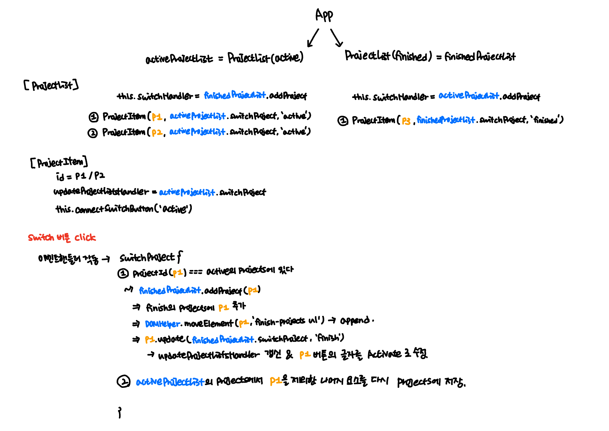

# Practice: Object-Oriented Programming
[📌]()<br>
<br>

## 📌 Demo -1

```javascript
class Tooptip {}

class DOMHelper {
  static clearEventListener(element) {
    const clonedElement = element.cloneNode(true);
    element.replaceWith(clonedElement); // 기존의 이벤트 리스너를 버리고 가비지 컬렉팅
    return clonedElement;
  }

  static moveElement(elementId, newDestinationSelector) {
    const element = document.getElementById(elementId);
    const destinationElement = document.querySelector(newDestinationSelector);
    destinationElement.append(element);
  }
}

class ProjectItem {
  constructor(id, updateProjectListsFunction,type) {
    this.id = id;
    this.updateProjectListsHandler = updateProjectListsFunction;
    // console.log(this.updateProjectListsHandler); // => projectList의 switchProject 메서드
    this.connectMoreInfoButton();
    this.connectSwitchButton(type);
  }

  connectMoreInfoButton() {}

  connectSwitchButton(type) {
    const projectItemElement = document.getElementById(this.id);
    let switchBtn = projectItemElement.querySelector("button:last-of-type");
      switchBtn = DOMHelper.clearEventListener(switchBtn); // 기존의 이벤트 리스너 삭제 후 새로 생성.
      switchBtn.textContent = type === 'active' ? 'Finished' : 'Activate';
    switchBtn.addEventListener(
      "click",
      this.updateProjectListsHandler.bind(null, this.id)
    ); // id를 전달해야함.
  }

  update(updateProjectListsFn, type) {
    this.updateProjectListsHandler = updateProjectListsFn;
    this.connectSwitchButton(type);
  }
}

class ProjectList {
  projects = [];

  constructor(type) {
    this.type = type;

    const prjItems = document.querySelectorAll(`#${type}-projects li`);
    for (const prjItem of prjItems) {
      this.projects.push(
        new ProjectItem(prjItem.id, this.switchProject.bind(this), this.type)
      );
    }
    console.log(this.projects);
  }

  setSwitchHandlerFunction(switchHandlerFunction) {
    this.switchHandler = switchHandlerFunction;
    //   console.log(switchHandlerFunction); // addProject()가 넘어오는데 서로 반대 List의 결과값이 넘어오는 것임
  }

  addProject(project) {
    this.projects.push(project);
    DOMHelper.moveElement(project.id, `#${this.type}-projects ul`);
    project.update(this.switchProject.bind(this), this.type);
    // 위치를 바꾼 뒤, 또 바꾸려고 할 때 오류 발생. 이를 해결하기 위해 update 메서드 추가
    // 인스턴스가 전환이 되니깐
  }

  switchProject(projectId) {
    // 방법 1
    // const projectIdx = this.projects.findIndex(p => p.id === projectId);
    // this.projects.splice(projectIdx, 1);

    // 방법 2
    this.switchHandler(this.projects.find((p) => p.id === projectId));
    this.projects = this.projects.filter((p) => p.id !== projectId);
    // 해당 함수가 참인 값을 리턴. 따라서 p.id가 projectId와 일치하지 않는 애들이 다시 this.projects에 저장
  }
}

class App {
  static init() {
    const activeProjectList = new ProjectList("active");
    const finishedProjectList = new ProjectList("finished");
    // console.log(activeProjectList, finishedProjectList);
    activeProjectList.setSwitchHandlerFunction(
      finishedProjectList.addProject.bind(finishedProjectList)
    );
    // bind(finishedProjectList) : activeProjectList의 setSwitchHandlerFunction을 통해 switchHandler 동작.
    // 이때, switchHandler(this.projects...)의 this를 변경할 필요가 있다.
    finishedProjectList.setSwitchHandlerFunction(
      activeProjectList.addProject.bind(activeProjectList)
    );
  }
}

App.init();
```

### 📖 로직 설명

1. **App** 에서 static 메서드를 이용해 실행 &rarr; `new ProjectList('active')`와 `new ProjectList('finished')`를 통해 각각 activeProjectList와 finishedProjectList 생성
2. **App** 에서 `setSwitchHandlerFunction`을 통해 각각의 ProjectList의 `this.switchHandler`에 서로 반대되는 `addProject()`를 할당.
3. **ProjectList** 에서 ProjectItem 생성
4. **ProjectItem** 에서 생성자를 통해 id, `this.updateProjectHandler` 할당 및 `this.connectSwitchButton(type)` 실행
5. 동작
   1. Active에서 p1의 Finished 버튼을 클릭
   2. 이벤트 핸들러 동작
      1. `activeProjectList.switchProject()` 실행
         1. projectId(p1)이 active의 projects 배열 안에 있는지 확인 <br>&rarr; `finishedProjectList.addProject(p1)` 실행 <br>&rarr; finish의 projects에 p1 추가. <br>&rarr; `DOMHelper.moveElement(p1, 'finished-projects ul')`을 이용해 append <br>&rarr; `p1.update()`을 통해 p1의 updateProjectHandler 업데이트 및 p1의 버튼의 text를 Activate로 변경
         2. `activateProjectList`의 projects에서 p1을 제외한 모든 요소를 다시 projects 배열에 저장. (업데이트)