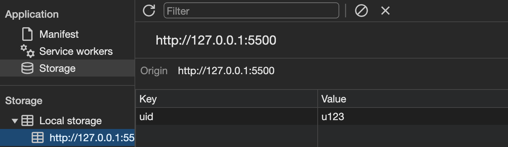
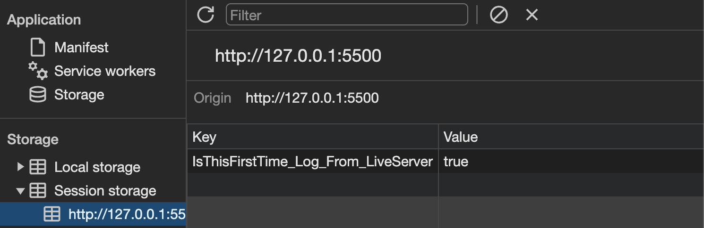
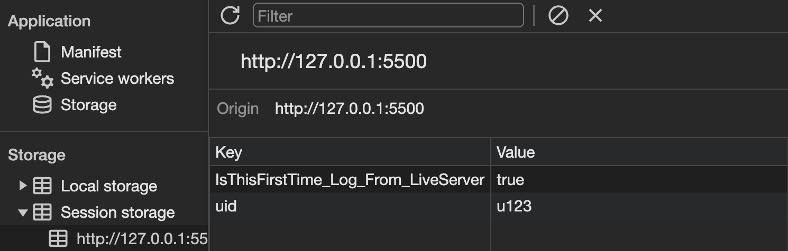
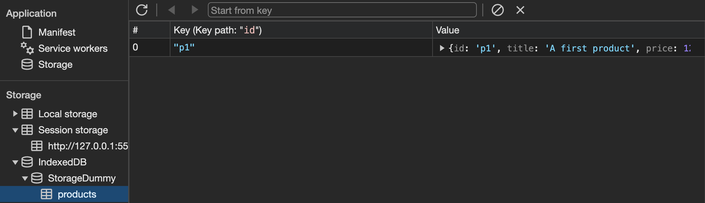

# Browser Storage

[📌 Servere Storage vs. Browser Storage](#-servere-storage-vs-browser-storage)<br>
[📌 로컬 스토리지 vs. 세션 스토리지](#-로컬-스토리지-vs-세션-스토리지)<br>
[📌 쿠키](#-쿠키)<br>
[📌 IndexedDB](#📌-indexeddb)<br>
<br>

## 📌 Servere Storage vs. Browser Storage

- 웹페이지가 제공될 때 보통 Browser와 Server가 상호작용한다.
- 웹페이지는 브라우저에서 작동되지만 서버로부터 제공되고 웹 애플리케이션 대부분도 서버와 통신하는데 JavaScript를 통해 뒤에서 통신하거나 기본 브랄우저 동작을 사용한다.
- 서버는 데이터를 저장할 수 있는 서버 측 데이터베이스가 있고 브라우저 또한 스토리지 메커니즘이 여러 개 있다.

<br>

1. Server

- 서버 측 데이터베이스는 보통 중요한 데이터를 저장한다. &rarr; **Store essential & persistent data**
- 보통 사용자의 컴퓨터에서 저장. 따라서 개발자(서비스 제공자)들도 해당 데이터에 접근하기 힘들다.

2. Browser

- 브라우저 스토리지는 매우 제한적.
- **Store temparary, convenience data**
- 주로 3가지의 종류가 있다.
  1. localStorage, sessionStorage
  2. Cookies
  3. IndexedDB

<br>

### 📖 LocalStorage vs. Cookies vs. IndexedDB

1. LocalStorage, SessionStorage

   - 단순히 키-값 저장소 &rarr; JavaScript 객체처럼 파일에 저장.
   - 보통 사용자 설정이나 기본 사용자 데이터를 관리한다.
   - 브라우저에서 작동하는 JavaScript코드만 로컬 스토리지와 통신 가능하다.
   - **사용하기 쉽고 다용도로 쓰이지만 복잡한 데이터는 다루기가 힘들다.**

2. Cookies

   - 키-값 이지만 몇 개의 config option들이 있다.
   - 기본 설정, 세션 ID 등을 관리하는데 사용한다. &rarr; Manage user preferences or basic user-data.
   - JavaScript로 엑세스하고 지울 수 있다. (로컬스토리지 처럼)
   - 발신 HttpRequest와 함께 서버로 전송된다. 따라서 로컬/세션 스토리지와는 다르게 서버에서 읽을 수 있다.
   - **로컬 스토리지보다 사용하기에 약간 더 투박하다. 활용도는 높다. 복잡한 데이터에는 다루기 힘들다.**

3. IndexedDB
   - 상대적으로 섬세, 클라이언트 측 데이터베이스이다.
   - 브라우저에 빌트인 되어있고 복잡한 쿼리를 사용할 수 있다.
   - 복잡한 데이터도 관리할 수 있다. &rarr; Manage complex data your web app needs
   - JavaScript로 엑세스 및 삭제 가능.
   - 다른 스토리지들 처럼 사용자하는 항상 모든 데이터를 설정에 있는 버튼으로 삭제 가능. 따라서 해당 스토리지들에게 너무 많은 의존은 하지 말자.
   - **약간 더 투박하다. 복잡하지만 중요하지 않은 데이터. 성능도 괜찮다..!**

<br>

## 📌 로컬 스토리지 vs. 세션 스토리지

1. 로컬 스토리지 : 기본 데이터를 저장하는 키-값 스토리지

```javascript
const storeBtn = document.getElementById("store-btn");
const retrBtn = document.getElementById("retrieve-btn");

const userId = "u123";
const user = {
  name: "Taemin",
  age: 32,
  hobbies: ["Dancing", "Playing with his cats"],
};

storeBtn.addEventListener("click", () => {
  localStorage.setItem("uid", userId);
  localStorage.setItem("user", JSON.stringify(user));
});

retrBtn.addEventListener("click", () => {
  const extractedId = localStorage.getItem("uid");
  const extractedUser = JSON.parse(localStorage.getItem("user"));
  console.log(extractedUser);
  if (extractedId) {
    console.log("Got the id - " + extractedId);
  } else {
    console.log("Could not find id");
  }
});
```



<br>

2. 세션 스토리지

```javascript
storeBtn.addEventListener("click", () => {
  sessionStorage.setItem("uid", userId);
});

retrBtn.addEventListener("click", () => {
  const extractedId = sessionStorage.getItem("uid");
});
```

- STORE 버튼 누르기 전
  

<br>

- STORE 버튼 누르기 후
  

<br>

> 브라우저에서 페이지가 열러있는 동안 남아있고 페이지를 새로 고침해도 활성화된 탭에 있는 한 데이터가 남아있게 되며 애플리케이션이 실행 중인 탭이나 전체 탭을 닫거나 전체 브라우저를 닫으면 세션 스토리지가 삭제된다. 그에 반면하여 로컬 스토리지는 삭제되지 않는다. 공간 부족 등의 이유로 사용자가 수동으로 삭제하거나 브라우저가 삭제하지 않는 한 데이터는 남아있게 된다.

<br>

## 📌 쿠키

```javascript
// ===== 쿠키
const storeBtn = document.getElementById("store-btn");
const retrBtn = document.getElementById("retrieve-btn");

storeBtn.addEventListener("click", () => {
  const userId = "u123";
  document.cookie = `uid=${userId}`; // 오버라이딩이 아니라 추가하는 것임!
});

retrBtn.addEventListener("click", () => {
  console.log(document.cookie); // 저장된 모든 쿠키 데이터에 엑세스
});
```

<br>

### 📖 쿠키로 작업하기

```javascript
// ===== 쿠키
const storeBtn = document.getElementById("store-btn");
const retrBtn = document.getElementById("retrieve-btn");

storeBtn.addEventListener("click", () => {
  const userId = "u123";
  const user = { name: "Taemin", age: 32 };
  document.cookie = `uid=${userId}`; // 오버라이딩이 아니라 추가하는 것임!
  document.cookie = `user=${JSON.stringify(user)}`;
});

retrBtn.addEventListener("click", () => {
  console.log(document.cookie.split(";")); // 저장된 모든 쿠키 데이터에 엑세스
  //document.cookie => uid=u123; user={"name":"Taemin","age":32};
  //document.cookie.split(';') =>
  //['uid=u123', ' user={"name":"Taemin","age":32}']
  //0: "uid=u123"
  //1: " user={\"name\":\"Taemin\",\"age\":32}"
});
```

이렇게도 만들 수 있다.

```javascript
retrBtn.addEventListener("click", () => {
  const cookieData = document.cookie.split(";");
  const data = cookieData.map((i) => {
    return i.trim();
  });
  console.log(data[1].split("=")[1]); //user value
});
```

<br>

- 쿠키의 장점

  1. 만료되도록 설정 가능. `expires=날짜`로도 할 수 있다.

  ```javascript
  storeBtn.addEventListener("click", () => {
    const userId = "u123";
    const user = { name: "Taemin", age: 32 };
    document.cookie = `uid=${userId}; max-age=2`; // 만료시간 설정. 반드시 '초'로 작성해야한다. 이 경우, 만료가 2초.
    document.cookie = `user=${JSON.stringify(user)}`;
  });
  ```

  2. 요청과 함께 서버에 보낼 수 있다.

<br>

## 📌 IndexedDB

```javascript
// === indexedDB
const storeBtn = document.getElementById("store-btn");
const retrBtn = document.getElementById("retrieve-btn");

const dbRequest = indexedDB.open("StorageDummy", 1); // 기존에 없었다면 데이터베이스 생성, 있었다면 데이터베이스와 연결.

dbRequest.onupgradeneeded = function (e) {
  const db = e.target.result; // 만들어진 데이터베이스에 접근

  const objStore = db.createObjectStore("products", { keyPath: "id" }); // 해당 데이터는 잃어버려도 되는 데이터 & 사용자 경험을 높이기 위해 필요한 데이터를 저장하는 것.

  objStore.transaction.oncomplete = function (e) {
    const productsStore = db
      .transaction("products", "readwrite")
      .objectStore("products"); // transaction(객체 저장소의 이름, 저장소에 접근할 때 사용하는 모드)
    productsStore.add({
      id: "p1",
      title: "A first product",
      price: 12.99,
      tags: ["Expensive", "Luxury", "Exclusive"],
    });
  }; // 객체 저장소의 생성이 끝나면 트리거 될 것.
};

dbRequest.onerror = function (e) {
  console.log("ERROR");
};

storeBtn.addEventListener("click", () => {});

retrBtn.addEventListener("click", () => {});
```



<br>

### 📖 IndexedDB로 작업하기

```javascript
// === indexedDB
const storeBtn = document.getElementById("store-btn");
const retrBtn = document.getElementById("retrieve-btn");

let db;
const dbRequest = indexedDB.open("StorageDummy", 1);

dbRequest.onsuccess = function (e) {
  db = e.target.result;
};

dbRequest.onupgradeneeded = function (e) {
  // 데이터베이스가 처음 만들어졌을 때 혹은 버전이 변경되었을 때 작동.
  db = e.target.result;

  const objStore = db.createObjectStore("products", { keyPath: "id" });

  objStore.transaction.oncomplete = function (e) {
    const productsStore = db
      .transaction("products", "readwrite")
      .objectStore("products");
    productsStore.add({
      id: "p1",
      title: "A second product",
      price: 12.99,
      tags: ["Expensive", "Luxury", "Exclusive"],
    });
  };
};

dbRequest.onerror = function (e) {
  console.log("ERROR");
};

storeBtn.addEventListener("click", () => {
  if (!db) {
    return;
  }
  const productsStore = db
    .transaction("products", "readwrite")
    .objectStore("products");
  productsStore.add({
    id: "p2",
    title: "A second product",
    price: 122.99,
    tags: ["Expensive", "Luxury"],
  });
});

retrBtn.addEventListener("click", () => {
  const productsStore = db
    .transaction("products", "readwrite")
    .objectStore("products");
  const request = productsStore.get("p2"); // 조회하고 싶은 키. 그리고 얘는 request 객체를 줌

  request.onsuccess = function () {
    console.log(request.result);
  };
});
```

<br>
<br>

### 더 알아보기

🔗 [로컬&세션 스토리지](https://developer.mozilla.org/en-US/docs/Web/API/Window/localStorage)<br>
🔗 [JS에서의 쿠키](https://developer.mozilla.org/en-US/docs/Web/API/Document/cookie)<br>
🔗 [IndexedDB](https://developer.mozilla.org/en-US/docs/Web/API/IndexedDB_API/Using_IndexedDB)<br>
