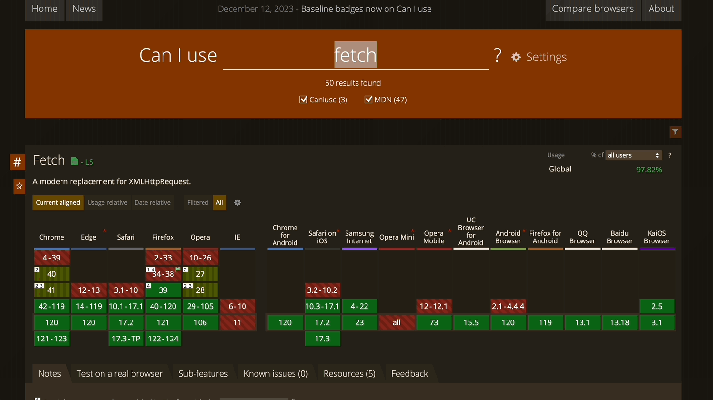

# Browser Support

[📌 JavaScript 기능에 대한 브라우저 지원 여부](#-javascript-기능에-대한-브라우저-지원-여부)<br>
[📌 기능 탐지 + 폴백 코드](#-기능-탐지--폴백-코드)<br>
[📌 폴리필(Polyfills)](#-폴리필polyfills)<br>
[📌 코드 트랜스파일링](#-코드-트랜스파일링)<br>
<br>

## 📌 JavaScript 기능에 대한 브라우저 지원 여부

브라우저가 자바스크립트의 기능에 대해서 지원하는지 여부를 판단하기 위한 자료
1. MDN &rarr; 브라우저 지원 표
2. caniuse.com &rarr; 시장 점유율도 알 수 있다.
3. Google &rarr; stackoverflow를 통해서 추가적인 정보..
4. ES6/JS Compat Table

<br>

### 📖 필요한 지원 판단하기

모든 브라우저와 모든 브라우저의 버전에서 기능이 작동하도록 하기는 힘들다! 따라서 전략적으로 선택할 필요가 있다~ &rarr; **시장 분석 필요**

1. 타겟 선정의 중요성.
2. 시장을 분석해서 어떤 사용자에게 서비스를 제공할 것인지 판단.
3. 전부를 만족시킬 수 없다는 것을 인식하고 있자.
4. 주 타겟층을 분석해서 그들에게 맞는 서비스와 기능을 제공하도록 하자.

<br>

## 📌 기능 탐지 + 폴백 코드

어떠한 기능을 사용하고자 할 때, 그 기능을 사용할 수 있다면 해당 코드와 특징을 사용한다. 만약 기능을 사용할 수 없는 곳이라면 폴백 코드를 실행하거나 오류 메시지를 나타낸다.

1. start
```javascript
const button = document.querySelector("button");
const textParagraph = document.querySelector("p");

button.addEventListener("click", () => {
  const text = textParagraph.textContent;
  navigator.clipboard
    .writeText(text)
    .then((result) => {
      console.log(result);
    })
    .catch((err) => {
      console.log(err);
    }); //navigator.clipboard.writeText(text)가 프로미스 제공
});

// COPY 버튼을 누르면 undefined가 나오지만 cmd+v를 누르면 해당 텍스트가 복사된 것을 알 수 있다.
```

<br>

2. 기능 탐지 + 폴백 코드

```javascript
button.addEventListener("click", () => {
  const text = textParagraph.textContent;
  if (navigator.clipboard) { // undefined 이면 falsy => if 안의 코드는 지원되는 브라우저에서만 실행이 될 것.
    navigator.clipboard
      .writeText(text)
      .then((result) => {
        console.log(result);
      })
      .catch((err) => {
        console.log(err);
      }); 
  } else {  // 폴백 코드
    alert('Feature not available, plz copy manually!')
  }
});
```

<br>

## 📌 폴리필(Polyfills)

- 폴리필(polyfill) : 브라우저에서 누락된 기능을 추가해주는 타사 JavaScript 패키지.
- 폴리필 찾기
  1. caniuse.com 이용하기
    
  2. 구글에 검색

<br>

## 📌 코드 트랜스파일링

🔗 [참고 블로그](https://onlydev.tistory.com/163)<br>
🔗 [gitbook](https://yamoo9.gitbook.io/webpack/babel/babel-cli-configure)<br>

`const`,`let`,arrow function과 같은 것은 인식이 되지 않고 브라우저(JavaScript 엔진)가 알지 못하는 상황이므로 만약 이를 지원하지 않는 브라우저를 이용했을 때 해당 키워드를 감지하면 충돌이 될 것이다. 그래도 코드를 작동하고자 한다면 **트랜스파일링** 이용!

- Transpilation : 최신코드를 구형코드로 변환.
- 수동으로 이뤄지는 작동되는 것이 아니라 도구를 사용한다. (ex. [Babel](https://babeljs.io/docs/usage))
- 해당 도구를 사용하면 최신 JavaScript 언어 기능을 사용한 브라우저 코드를 배포할 수 있게 된다.
- 즉, const, let 대신 var를 쓰거나 화살표함수 대신 일반 함수를 사용.

<br>

### 📖 트랜스파일러 적용하기 
1. 설치 : `npm i -D @babel/core @babel/cli @babel/preset-env` (babel 사용.)
2. babel.config.json 생성 후 코드 작성
```json
{
  "presets": [
    [
      "@babel/preset-env",
      {
        "targets": {
          "edge": "17",
          "firefox": "60",
          "chrome": "67",
          "safari": "11.1"
        },
        "useBuiltIns": "usage",
        "corejs": "3.6.5"
      }
    ]
  ]
}
```
3. `npm run build` &rarr; assets/scripts/app.js 생성됨

*참고 `npx browserslist` 프로젝트 루트 위치에서 해당 명령어를 실행하면 프로젝트가 지원하는 브라우저 목록이 출력됨*

```.browserslistrc
not dead // 아직까지 살아있는 브라우저를 의미.
```