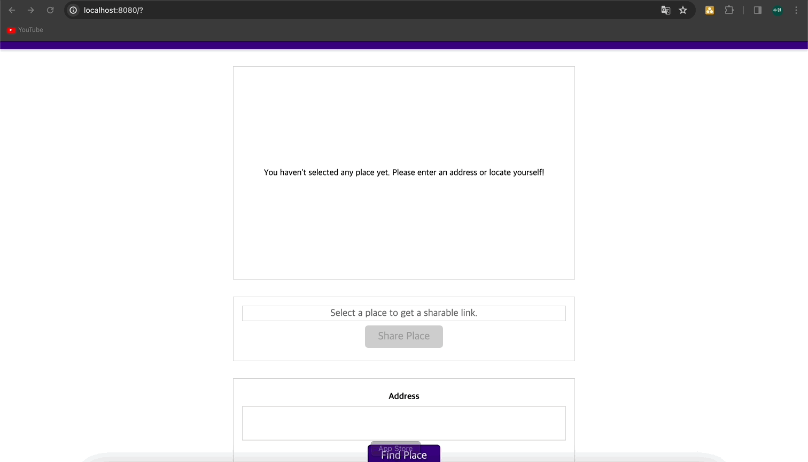
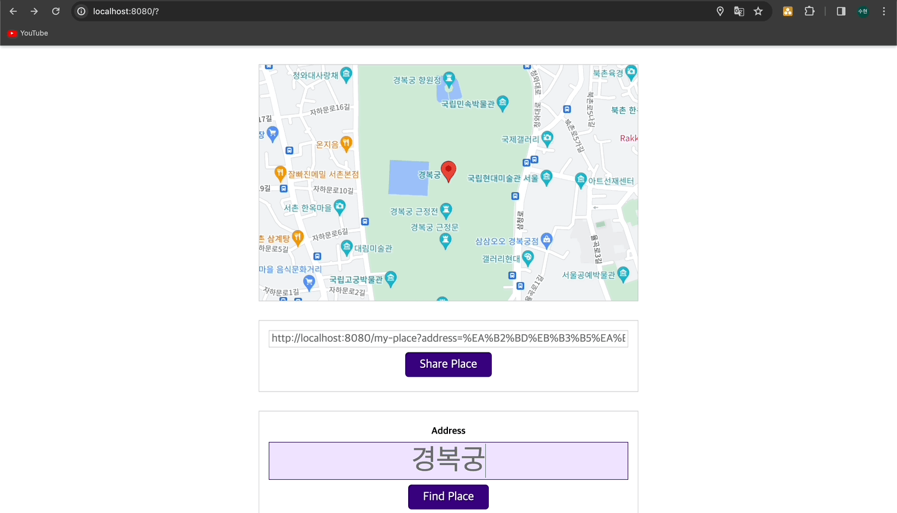

# Practice

[📌 myPlace 어플리케이션](#-myplace-어플리케이션)<br>
[📌 결과](#-결과)<br>
<br>

## 📌 myPlace 어플리케이션

### 📖 DOM 엑세스 + 사용자 위치 얻기

```javascript
// src/SharePlace.js
class PlaceFinder {
  constructor() {
    const addressForm = document.querySelector("form");
    const locateUserBtn = document.getElementById("locate-btn");

    locateUserBtn.addEventListener("click", this.locateUserHandler);
    addressForm.addEventListener("submit", this.findAddressHandler);
  }

  locateUserHandler() {
    if (!navigator.geolocation) {
      alert(
        "현재 브라우저에서 위치 특성을 이용할 수 없습니다. - 최신 브라우저를 사용하거나 직접 주소를 입력해주세요."
      );
      return;
    }
    navigator.geolocation.getCurrentPosition(
      (successResult) => {
        console.log(successResult);
        const userLoccation = {
          lat: successResult.coords.latitude, // 위도
          lug: successResult.coords.longitude, // 경도
        }; // User의 좌표
        console.log(userLoccation);
      },
      (error) => {
        alert("위치를 파악할 수 없습니다. 직접 주소를 입력해주세요.");
      }
    );
  }

  findAddressHandler() {}
}

new PlaceFinder();
```

<br>

### 📖 피드백 추가하기 (모달 이용)

1. dist/index.html

```html
<!-- 모달의 배경과 컨테이너를 작업 -->
<template id="modal-template">
  <div class="backdrop"></div>
  <div class="modal"></div>
</template>
<!-- 모달에 들어갈 콘텐츠 작업용 -->
<template id="loading-modal-content">
  <div class="modal__content centered">
    <div class="lds-dual-ring"></div>
  </div>
</template>
```

<br>

2. src/UI/Modal.js

```javascript
export class Modal {
  constructor(contentId, fallbackText) {
    this.fallbackText = fallbackText;
    this.contentTemplateEl = document.getElementById(contentId);
    this.modalTemplateEl = document.getElementById("modal-template");
  }

  show() {
    if ("content" in document.createElement("template")) {
      // IE이면 undefined라서 해당 조건문 통과하지 못함.
      const modalElements = document.importNode(
        this.modalTemplateEl.content,
        true
      ); // importNode => 템플릿 콘텐츠를 사용해서 노드를 생성하는 방법.
      // 이렇게 하면 modal-template 안의 두개의 div에 접근가능.
      const modalElement = modalElements.querySelector(".modal");
      const backdropElement = modalElements.querySelector(".backdrop");
      const contentElement = document.importNode(
        this.contentTemplateEl.content,
        true
      ); // 실제 콘텐츠에 접속 가능

      modalElement.appendChild(contentElement);
      document.body.insertAdjacentElement("afterbegin", modalElement); // 본문 시작부에 추가하겠다.
      document.body.insertAdjacentElement("afterbegin", backdropElement);
    } else {
      // fallback code
      alert(this.fallbackText);
    }
  }

  hide() {}
}
```

<br>

3. src/SharePlace.js

```javascript
import { Modal } from "./UI/Model.js";

class PlaceFinder {
  constructor() {}

  locateUserHandler() {
    if (!navigator.geolocation) {
      alert(
        "현재 브라우저에서 위치 특성을 이용할 수 없습니다. - 최신 브라우저를 사용하거나 직접 주소를 입력해주세요."
      );
      return;
    }
    const modal = new Modal(
      "loading-modal-content",
      "loading location.. plz wait!"
    );
    modal.show();
    (successResult) => {
      modal.hide();
    },
      (error) => {
        modal.hide();
      };
  }

  findAddressHandler() {}
}
```

<br>

### 📖 모달 숨기기

1. src/UI/Modal.js

```javascript
export class Modal {
  constructor(contentId, fallbackText) {}

  show() {
    if ("content" in document.createElement("template")) {
      this.modalElement = modalElements.querySelector(".modal"); // this.hide()에서도 쓸 수 있도록 this로 변경
      this.backdropElement = modalElements.querySelector(".backdrop");

      this.modalElement.appendChild(contentElement);
      document.body.insertAdjacentElement("afterbegin", this.modalElement);
      document.body.insertAdjacentElement("afterbegin", this.backdropElement);
    } else {
    }
  }

  hide() {
    if (this.modalElement) {
      document.body.removeChild(this.modalElement); // 최신브라우저라면 this.modalElement.remove();
      document.body.removeChild(this.backdropElement);
      this.modalElement = null; // 가비지 컬렉터가 메모리를 회수하기 위함.
      this.backdropElement = null;
    }
  }
}
```

<br>

### 📖 Google Maps를 이용해 맵 렌더링하기

🔗 [Google Maps - JavaScript API docs](https://developers.google.com/maps/documentation/javascript?_gl=1*l00zc6*_ga*MTY0OTc1NjE5NC4xNzA0NDQxNTQx*_ga_NRWSTWS78N*MTcwNDQ0MTU0MS4xLjEuMTcwNDQ0MTU2Ny4wLjAuMA..&hl=ko)

1. src/UI/Map.js

```javascript
export class Map {
  constructor(coords) {
    // this.coordinates = coords;
    this.render(coords);
  }

  render(coordinates) {
    if (!google) {
      alert("지도 라이브러리를 로드할 수 없습니다. 다시 시도해주세요.");
      return;
    }

    const map = new google.maps.Map(document.getElementById("map"), {
      center: coordinates,
      zoom: 16,
    }); // 전역 google 변수

    new google.maps.Marker({
      position: coordinates,
      map: map,
    }); // Google Maps에게 마커를 해당 map에 배치하라고 알림.
  }
}
```

<br>

2. src/SharePlace.js

```javascript
import { Map } from "./UI/Map.js";
class PlaceFinder {
  constructor() {
    locateUserBtn.addEventListener("click", this.locateUserHandler.bind(this));
    addressForm.addEventListener("submit", this.findAddressHandler.bind(this));
  }
  selectPlace(coordinates) {
    if (this.map) {
      this.map.render(coordinates);
    } else {
      this.map = new Map(coordinates);
    }
  }

  locateUserHandler() {
    if (!navigator.geolocation) {
      alert(
        "현재 브라우저에서 위치 특성을 이용할 수 없습니다. - 최신 브라우저를 사용하거나 직접 주소를 입력해주세요."
      );
      return;
    }
    const modal = new Modal(
      "loading-modal-content",
      "loading location.. plz wait!"
    );
    modal.show();
    navigator.geolocation.getCurrentPosition(
      (successResult) => {
        modal.hide();
        console.log(successResult);
        const userLocation = {
          lat: successResult.coords.latitude,
          lng: successResult.coords.longitude,
        };
        this.selectPlace(userLocation); //
      },
      (error) => {
        modal.hide();
        alert("위치를 파악할 수 없습니다. 직접 주소를 입력해주세요.");
      }
    );
  }
}
```

<br>

### 📖 주소 찾기 & 좌표 얻기

🔗 [Google Geocoding API](https://developers.google.com/maps/documentation/geocoding/overview?hl=ko)

1. src/Utility/Location.js

```javascript
const GOOGLE_API_KEY = "YOUR_KEY";

export async function getCoordsFromAddress(address) {
  const urlAddress = encodeURI(address); // url에 적합하게 address 변경
  const response = await fetch(
    `https://maps.googleapis.com/maps/api/geocode/json?address=${urlAddress}&key=${GOOGLE_API_KEY}`
  );

  if (!response.ok) {
    throw new Error("좌표를 패치하는데 실패했습니다. 다시 시도하세요.");
  }
  const data = await response.json();

  if (data.error_message) {
    // 200 상태 코드로 실패했을 때 그걸 알려주는 오류 메시지
    throw new Error(data.error_message);
  }

  const coordinates = data.results[0].geometry.location;
  return coordinates;
}
```

<br>

### 📖 사용자 입력을 좌표로 변환하기

1. src/SharePlace.js

```javascript
async findAddressHandler(event) {
    event.preventDefault();
    const address = event.target.querySelector("input").value;
    if (!address || address.trim().length === 0) {
      alert("유효하지 않은 주소입니다. 다시 입력해주세요.");
      return;
    }
    const modal = new Modal(
      "loading-modal-content",
      "loading location.. plz wait!"
    );
    modal.show();
    try {
      const coordinates = await getCoordsFromAddress(address); // async, await을 사용했기 때문에 Promise를 반환..
      this.selectPlace(coordinates);
    } catch (err) {
      alert(err.message);
    }
    modal.hide();
  }
```

<br>

### 📖 공유 장소 링크 생성하기

1. src/Utility/Location.js

```javascript
export async function getAddressFromCoords(coords) {
  const response = await fetch(
    `https://maps.googleapis.com/maps/api/geocode/json?latlng=${coords.lat},${coords.lng}&key=${GOOGLE_API_KEY}`
  );

  if (!response.ok) {
    throw new Error("주소를 패치하는데 실패했습니다. 다시 시도하세요.");
  }
  const data = await response.json();

  if (data.error_message) {
    // 200 상태 코드로 실패했을 때 그걸 알려주는 오류 메시지
    throw new Error(data.error_message);
  }

  const address = data.results[0].formatted_address;
  return address;
}
```

<br>

2. src/SharePlace.js

```javascript
import {
  getCoordsFromAddress,
  getAddressFromCoords,
} from "./Utility/Location.js";

class PlaceFinder {
  constructor() {
    this.shareBtn = document.getElementById("share-btn");
    // this.shareBtn.addEventListener("click");
  }

  selectPlace(coordinates, address) {
    if (this.map) {
      this.map.render(coordinates);
    } else {
      this.map = new Map(coordinates);
    }

    this.shareBtn.disabled = false; // disabled를 false로 함으로써 이제 클릭을 할 수 있게 함.
    const sharedLinkInputElement = document.getElementById("share-link");
    sharedLinkInputElement.value = `${
      location.origin
    }/my-place?address=${encodeURI(address)}&lat=${coordinates.lat}&lng=${
      coordinates.lng
    }`; // location.origin: 현재 도메인
  }

  locateUserHandler() {
    navigator.geolocation.getCurrentPosition(
      async (successResult) => {
        console.log(successResult);
        const coordinate = {
          lat: successResult.coords.latitude,
          lng: successResult.coords.longitude,
        };
        const address = await getAddressFromCoords(coordinate); // coords -> address
        modal.hide();
        this.selectPlace(coordinate, address); // address 추가
      },
      (error) => {
        modal.hide();
        alert("위치를 파악할 수 없습니다. 직접 주소를 입력해주세요.");
      }
    );
  }

  async findAddressHandler(event) {
    event.preventDefault();
    const address = event.target.querySelector("input").value;
    if (!address || address.trim().length === 0) {
      alert("유효하지 않은 주소입니다. 다시 입력해주세요.");
      return;
    }
    const modal = new Modal(
      "loading-modal-content",
      "loading location.. plz wait!"
    );
    modal.show();
    try {
      const coordinates = await getCoordsFromAddress(address);
      this.selectPlace(coordinates, address); // address 추가
    } catch (err) {
      alert(err.message);
    }
    modal.hide();
  }
}
```

<br>

### 📖 링크를 클립보드에 복사하기

1. src/SharePlace.js

```javascript
class PlaceFinder {
  constructor() {
    this.shareBtn.addEventListener("click", this.sharePlaceHandler);
  }

  sharePlaceHandler() {
    const sharedLinkInputElement = document.getElementById("share-link");

    if (!navigator.clipboard) {
      sharedLinkInputElement.select(); // select : select 이벤트를 트리거하는 건 전체 콘텐츠를 선택하고 마킹한다. => cmd+c 를 통해 복사할 수 있게..
      return;
    }
    navigator.clipboard
      .writeText(sharedLinkInputElement.value)
      .then(() => {
        alert("클립보드에 복사되었습니다!");
      })
      .catch((err) => {
        console.log(err);
        sharedLinkInputElement.select();
      });
  }
}
```

<br>

### 📖 공유 장소 화면에 렌더링하기

1. src/MyPlace.js

```javascript
import { Map } from "./UI/Map.js";

class LoadedPlace {
  constructor(coordinates, address) {
    new Map(coordinates);
    const headerTitleEl = document.querySelector("header h1");
    headerTitleEl.textContent = address;
  }
}

const url = new URL(location.href); // location.href -> 브라우저에서 로드된 현재 위치. 현재 url
const queryParams = url.searchParams; // ?뒤에 있는 값들을 키-값 형식으로 queryParams에 저장.
const coords = {
  lat: parseFloat(queryParams.get("lat")),
  lng: +queryParams.get("lng"),
};
const address = queryParams.get("address");
new LoadedPlace(coords, address);
```

<br>

## 📌 결과

- 현위치 탐색
  

- 검색 후 클립보드 복사 &rarr; myplace/index.html
  
