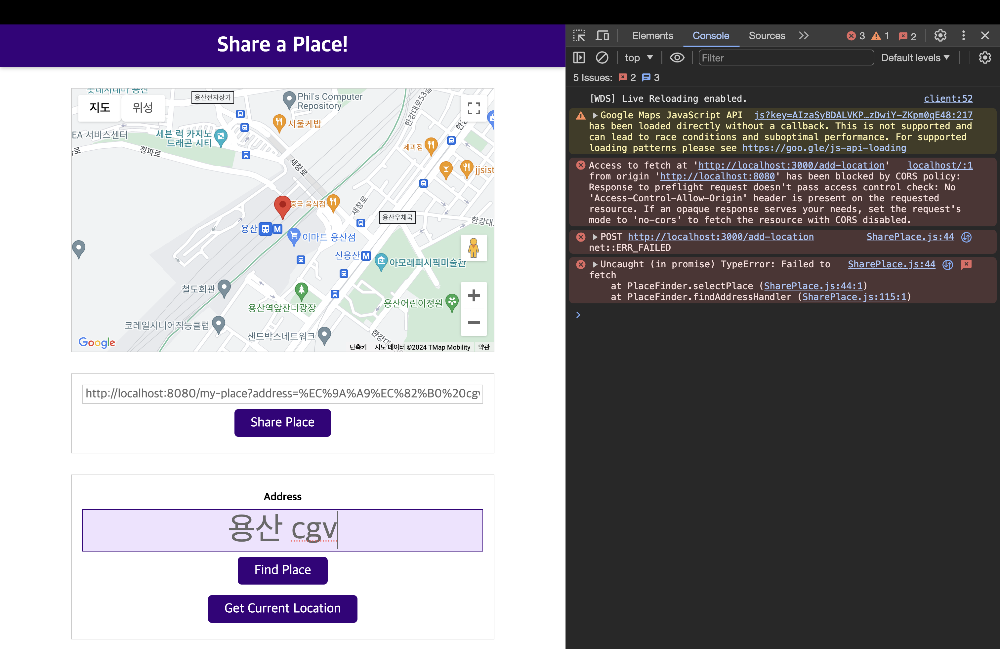

# An Introduction of Node.js

[📌 모듈 & 파일 엑세스 이해하기](#-모듈--파일-엑세스-이해하기)<br>
[📌 HTTP](#-http)<br>
[📌 Express.js](#-expressjs)<br>
[📌 템플릿 & EJS 이용하기](#-템플릿--ejs-이용하기)<br>
[📌 프로젝트 향상시키기](#-프로젝트-향상시키기)<br>
<br>

## 📌 모듈 & 파일 엑세스 이해하기

```javascript
const fs = require("fs");

fs.readFile("Taemin.txt", (err, data) => {
  if (err) {
    console.log(err);
    return;
  }
  console.log(data.toString()); // name=Taemin
});

// fs.writeFile('Taemin.txt', 'name=Taemin', err => {
//     if (err) {
//         console.log(err)
//     } else {
//         console.log('Wrote to file')
//     }
// });
```

<br>

## 📌 HTTP

```javascript
const http = require("http");

const server = http.createServer((request, response) => {
  response.setHeader("Content-Type", "text/html");
  response.write("<h1>hello there!</h1>");
  response.end(); // 데이터에 응답 추가가 끝났음을 node.js에 알려서 응답을 닫고 보냄.
});

server.listen(3000); // 서버를 시작하여 들어오는 요청을 리스닝.
```

1. `http.createServer`는 requestListener라는 인수를 요청 &rarr; 이는 들어오는 모든 요청을 트리거하는 함수이다.

   1. request : nodejs로 들어오는 요청을 반영하고 요청의 일부인 헤더와 요청의 일부가 될 수 있는 데이터 등이 있다.
   2. response : nodejs에서 전달되며 다시 보내는 응답을 구성하려 사용할 수 있고 결국 다시 보내기 위해 사용할 수 있는 객체이다.

2. `setHeader`의 `text/html`은 html로 분석한다. &rarr; 렌더링
3. `setHeader`의 `text/plain`은 일반적인 텍스트로 html로 분석하지 않는다.

<br>

```javascript
const http = require("http");

const server = http.createServer((request, response) => {
  let body = [];
  request.on("data", (chunk) => {
    // 이벤트가 발생할 때 실행
    body.push(chunk);
  });
  request.on("end", () => {
    // 이벤트가 발생할 때 실행
    body = Buffer.concat(body).toString();
    console.log(body);
    let userName = "Unknown user";
    if (body) {
      userName = body.split("=")[1];
    }
    response.setHeader("Content-Type", "text/html");
    response.write(
      `<h1>Hi ${userName}</h1><form method="POST" action="/"><input name="username" type="text"><button type="submit">Send</button></form>`
    );
    response.end(); // 데이터에 응답 추가가 끝났음을 node.js에 알려서 응답을 닫고 보냄.
  });
});
// 기본은 GET, method="POST"로 설정해서 포스트 요청을 보낼 수 있다.
// action="/" : 브라우저에 어떤 url로 http 요청을 보낼지..

server.listen(3000); // 서버를 시작하여 들어오는 요청을 리스닝.
```


<br>

## 📌 Express.js

### 📖 기초

1. `npm init`
2. `npm install express --save`

- express는 미들웨어 기반 프레임워크
- express는 여러 다른 함수들을 통해 들어오는 요청을 전달하는 역할을 한다. 함수들은 모든 요청을 수신하고 무언가를 할 수 있는데, 각 함수들은 요청을 중지하거나 응답을 보낼 수 있다.
- 미들웨어는 단순히 함수로 요청을 받고 무언가를 실행.

  ```javascript
  const express = require("express");
  const app = express();

  app.use((req, res, next) => {
    res.setHeader("Content-Type", "text/html");
    next();
  });

  app.use((req, res, next) => {
    res.send("<h1>Hello world</h1>");
  });

  app.listen(3000);
  ```

- `app.use`를 통해 미들웨어를 등록 가능. use 메서드는 인자로 함수를 받는다.
- `req` : createServer 함수의 request와 비슷하거나 같지만 조금 더 풍부해진 기능 -> `res`(response)도 마찬가지.
- `next()` : express.js에게 아직 작업이 완료되지 않았다고 이야기함. 대신, 다음 인라인 미들웨어로 이동하여 req,res,next를 인자로 받는다.
- 두번째 미들웨어에서는 next();를 호출하지 않는데 응답과 요청 작업이 완료되었기 때문

<br>

### 📖 데이터 추출하기

1. `npm install body-parser --save`

   ```javascript
   const express = require("express");
   const bodyParser = require("body-parser");
   const app = express();

   app.use(bodyParser.urlencoded({ extended: false }));

   app.use((req, res, next) => {
     res.setHeader("Content-Type", "text/html");
     next();
   });

   app.use((req, res, next) => {
     const userName = req.body.username || "Unknown User"; // input name="username"이니까
     res.send(
       `<h1>Hi ${userName}</h1><form method="POST" action="/"><input name="username" type="text"><button type="submit">Send</button></form>`
     );
   });

   app.listen(3000);
   ```

- `app.use(bodyParser)` : 기본 미들웨어로 추가가 됨.
  - 들어오는 body, 요청 body를 분석하고 추출함.
  - 분석된 body를 req 객체의 body 필드에 보냄.

<br>

## 📌 템플릿 & EJS 이용하기

1. `npm install --save ejs`
2. views/index.ejs
   `html
    <!DOCTYPE html>
    <html lang="en">
    <head>
        <meta charset="UTF-8" />
        <meta name="viewport" content="width=device-width, initial-scale=1.0" />
        <title>NodeJS Demo</title>
    </head>
    <body>
        <h1>Hello <%= user %></h1>
        <form method="POST" action="/">
        <input name="username" type="text" /><button type="submit">Send</button>
        </form>
    </body>
    </html>
    `
   <br>

3. app.js

   ```javascript
   const express = require("express");
   const bodyParser = require("body-parser");
   const app = express();

   app.set("view engine", "ejs"); // 뷰와 템플릿을 분석하는 엔진이 ejs라고 알림.
   app.set("views", "views"); // 뷰 폴더 지정

   app.use(bodyParser.urlencoded({ extended: false }));

   app.use((req, res, next) => {
     res.setHeader("Content-Type", "text/html");
     next();
   });

   app.use((req, res, next) => {
     const userName = req.body.username || "Unknown User"; // input name="username"이니까
     res.render("index", {
       user: userName,
     }); // view 이름, 전체 프로퍼티가 있는 객체 (또는 해당 템플릿에 제공하고자 하는 전체 데이터가 있는 객체)
   });

   app.listen(3000);
   ```

<br>

## 📌 프로젝트 향상시키기

### 📖 기본 REST 경로 추가하기

1. 26_NodeJS/app.js

```javascript
const express = require("express");
const bodyParser = require("body-parser");
const locationRoutes = require("./routes/location"); // 파일 확장자는 적지 않음.

const app = express();

app.use(bodyParser.json());

app.use(locationRoutes); // express router가 express 어플리케이션에 등록할 수 있는 미들웨어

app.listen(3000);
```

<br>

2. 26_NodeJS/routes/location.js

```javascript
const express = require("express");

const router = express.Router();

const locationStorage = {
  locations: [],
};

router.post("/add-location", (req, res, next) => {
  locationStorage.locations.push({
    id: Math.random(),
    address: req.body.address,
    coords: { lat: req.body.lat, lng: req.body.lng },
  });
  res.json({ message: "Stored Location" });
}); // 오직 이 주소로 post 요청이 들어와야만 해당 함수에 입력될 수 있다.

router.get("/location", (req, res, next) => {});

module.exports = router;
```

<br>

3. 23_Practice/src/SharePlace.js

```javascript
selectPlace(coordinates, address) {

    fetch("http://localhost:3000/add-location", {
      method: "POST",
      body: JSON.stringify({
        address: address,
        lat: coordinates.lat,
        lng: coordinates.lng,
      }),
      headers: {
        "Content-Type": "application/json",
      },
    })
      .then((response) => {
        return response.json();
      })
      .then((data) => {
        console.log(data);
      });

  }
```

4. 23_Practice에서 `npm run build:dev` 실행 후, 브라우저 'localhost:8080'에 접속

<br>

**결과 : CORS (교차 출처 요청 정책) 오류 발생**


<br>

### 📖 CORS (교차 출처 요청 정책) 이해하기

- CORS(Cross-Origin Resource Sharing) : 기술적으로 다른 두 개의 서버를 사용. 기본적으로 브라우저들은 교차 출처 요청을 막는다. 출처가 같고 도메인이 같은 요청만 승인된다.
- 이러한 교차 출처 요청이 괜찮다는 신호를 보낼 필요가 있다.

1. 26_NodeJS/app.js

```javascript
app.use((req, res, next) => {
  res.setHeader("Access-Control-Allow-Origin", "*"); // 요청을 보내고자 하는 모든 서버를 허용
  res.setHeader("Access-Control-Allow-Method", "POST, GET, OPTIONS"); // Post, get 요청만 공용으로 노출시키길 원함.
  res.setHeader("Access-Control-Allow-Headers", "Content-Type"); // 클라이언트가 보낼만한 헤더를 정의
  next();
});
```
