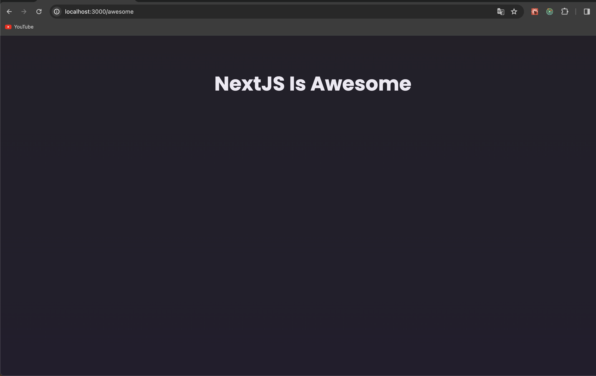

# Next.js 시작하기

[📌 NextJS 소개](#-nextjs-소개)<br>
<br>

## 📌 NextJS 소개

### 📖 NextJS란 무엇이며, 왜 사용하는 걸까?

- NextJS는 리액트 프레임워크이며 리액트에 빌드된다.
- NextJS는 풀스택 리액트 프레임워크이기 때문에 리액트로 풀스택 어플리케이션을 만드는 과정을 단순화 시켜준다.
- 리액트를 기반으로 구축한 다음 리액트로 풀스택 어플리케이션을 구축하는 과정을 대폭 간소화한다.

<br>

### 📖 NextJS 주요기능 및 장점

1. 리액트로 풀스택 어플리케이션을 만들 수 있다.
   - 프론트엔드와 백엔드를 혼합해서 한 프로젝트에서 한 프로그래밍 언어인 자바스크립트를 사용하며, 하나의 프레임워크(라이브러리)인 리액트를 이용하여 복잡한 어플리케이션을 만들 수 있다.
2. 파일 시스템을 사용해서 경롤르 설정할 수 있다.
   - 다양한 폴더와 파일을 설치하여 사용자가 방문할 수 있는 경로로 매핑한다.
   - 코드 기반 환경설정 또는 패키지가 추가로 필요하지 않다는 것이 장점이다.
3. NextJS가 페이지에 보이는 모든 내용을 렌더링한다.

<br>

## 📌 첫 번째 NextJS 앱 만들기

🔗 [NextJS Docs](https://nextjs.org)

- 설치 : `npx create-next-app@latest`

### 📖 NextJS vs. 리액트만 사용

- 리액트를 기본적으로 클라이언트 사이드 자바스크립트 라이브러리이다. 즉, 브라우저에서 실행되고 브라우저에서 페이지를 수정 및 조정할 수 있다.
  - 페이지가 로딩된 후에도 수정이 가능함을 의미한다. 로딩 후에도 새로운 페이지를 열 필요 없이 페이지를 업데이트할 수 있다.
  - 그러나 단점은 검색 엔진 크롤러 등이 실제 페이지 내용을 첫 방문에서 볼 수 없다는 것이다.
- NextJS는 클라이언트 사이드 어플리케이션이 아니다. 대신, 풀스택 어플리케이션이 생기는 것이며 NextJS 프로젝트에는 클라이언트에서 실행되는 코드가 있고 서버에서 실행되는 코드도 많다.
  - NextJS는 클라이언트와 서버를 매끄럽게 연결하므로 리액트를 이용해 풀스택 앱을 만들 수 있다.

<br>

### 📖 첫 번째 앱 편집하기

- app 폴더에서 폴더와 파일을 추가해 경로를 추가할 수 있다.
- app/awesome/page.js 생성 &rarr; 파일 이름은 반드시 page여야 하며, 폴더명과 page.js 파일이 합쳐져야 NextJS에서 신규 경로가 생성된다.

```js
// app/awesome/page.js
export default function AwesomePage() {
  return (
    <main>
      <h1>NextJS Is Awesome</h1>
    </main>
  );
}
```



<br>

### 📖 Pages Router vs. App Router

NextJS 앱을 만들기 위해서 두 가지의 방법이 있다.

1. Pages Router

   - 더 오래된 방식. 다년간 사용된 방식으로 안정적인 방법이다.
   - 기능이 다양한 풀스택 앱을 리액트와 NextJS로 만든다.

2. App Router

   - NextJS 앱을 만들기 위한 비교적 새로운 방식.
   - 안정적인 편으로 인식이 되고 있으나 아직 버그가 있다.
   - 가장 최신의 방식으로, 리액트 서버 컴포넌트 또는 Server Actions와 같은 최신 기능을 사용할 수 있다.

어떤 방식을 선택해도 풀스택 어플리케이션을 만드는 것이라서 페이지가 서버에 렌더링 되고 파일시스템으로 경로를 설정한다.
