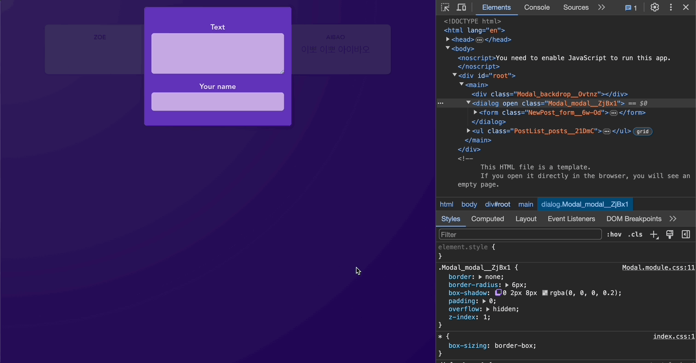

# React 복습하기

[📌 React 복습하기](#-react-복습하기)<br>
<br>

## 📌 React 복습하기

### 📖 리액트 프로젝트 생성하기

- 설치 : `npx create-react-app .`

### 📖 리액트와 컴포넌트

#### 💎 커스텀 컴포넌트 만들어보기

```jsx
// components/Post.jsx
export default function Post() {
  return (
    <div>
      <p>Zoe</p>
      <p>react.js is awesome!</p>
    </div>
  );
}

// App.jsx
import Post from "./components/Post";

function App() {
  return (
    <>
      <h1>Hello World!</h1>
      <Post />
    </>
  );
}

export default App;
```

<br>

#### 💎 동적인 값 출력하기

```jsx
// components/Post.jsx
const names = ["Zoe", "Fubao"];

export default function Post() {
  const chosenName = Math.random() > 0.5 ? names[0] : names[1];
  return (
    <div>
      <p>{chosenName}</p>
      <p>react.js is awesome!</p>
    </div>
  );
}
```

<br>

#### 💎 컴포넌트 재사용하기, CSS 스타일 적용하기

```jsx
// components/Post.jsx
import styles from "./Post.module.css";

export default function Post({ author, body }) {
  return (
    <div className={styles.post}>
      <p className={styles.author}>{author}</p>
      <p className={styles.text}>{body}</p>
    </div>
  );
}

// App.jsx
import Post from "./components/Post";

function App() {
  return (
    <main>
      <Post author="Zoe" body="React.js is awesome!" />
      <Post author="Fubao" body="Check out the full course" />
    </main>
  );
}

export default App;
```

<br>

#### 💎 다른 컴포넌트 만들어보기

```jsx
// components/PostList.jsx
import Post from "./Post";
import styles from "./PostList.module.css";

export default function PostList() {
  return (
    <ul className={styles.posts}>
      <Post author="Zoe" body="React.js is awesome!" />
      <Post author="Fubao" body="Check out the full course" />
      <Post author="Aibao" body="이뽀 이뽀 아이바오" />
    </ul>
  );
}
```

<br>

#### 💎 상태(state) 이용하기 - modal

```jsx
// components/NewPost.jsx
import classes from "./NewPost.module.css";

function NewPost({ onChange }) {
  return (
    <form className={classes.form}>
      <p>
        <label htmlFor="body">Text</label>
        <textarea id="body" required rows={3} onChange={onChange} />
      </p>
      <p>
        <label htmlFor="name">Your name</label>
        <input type="text" id="name" required />
      </p>
    </form>
  );
}

export default NewPost;


// components/Modal.jsx
import styles from "./Modal.module.css";

export default function Modal({ children, onClose }) {
  return (
    <>
      <div className={styles.backdrop} onClick={onClose} />
      <dialog open className={styles.modal}>
        {children}
      </dialog>
    </>
  );
}


// components/PostList.jsx
import Post from "./Post";
import styles from "./PostList.module.css";
import NewPost from "./NewPost";
import Modal from "./Modal";
import { useState } from "react";

export default function PostList() {
  const [enteredBody, setEnteredBody] = useState("");
  const [modalVisible, setModalVisible] = useState(true);

  function changeBodyHandler(event) {
    setEnteredBody(event.target.value);
  }

  function hideModalHandler() {
    setModalVisible(false);
  }

  return (
    <>
      {modalVisible && (
        <Modal onClose={hideModalHandler} visible={modalVisible}>
          <NewPost onChange={changeBodyHandler} />
        </Modal>
      )}
      <ul className={styles.posts}>
        <Post author="Zoe" body={enteredBody} />
        <Post author="Fubao" body="Check out the full course" />
        <Post author="Aibao" body="이뽀 이뽀 아이바오" />
      </ul>
    </>
  );
}
```



<br>

#### 💎 공유 헤더 추가 및 상태 관리 추가

```jsx
// components/MainHeader.jsx
import { MdPostAdd, MdMessage } from "react-icons/md";

import classes from "./MainHeader.module.css";

function MainHeader({ onCreatePost }) {
  return (
    <header className={classes.header}>
      <h1 className={classes.logo}>
        <MdMessage />
        React Poster
      </h1>
      <p>
        <button className={classes.button} onClick={onCreatePost}>
          <MdPostAdd size={18} />
          New Post
        </button>
      </p>
    </header>
  );
}

export default MainHeader;


// components/PostList.jsx
import Post from "./Post";
import styles from "./PostList.module.css";
import NewPost from "./NewPost";
import Modal from "./Modal";
import { useState } from "react";

export default function PostList({ isPosting, onHideModal }) {
  const [enteredBody, setEnteredBody] = useState("");

  function changeBodyHandler(event) {
    setEnteredBody(event.target.value);
  }

  return (
    <>
      {isPosting && (
        <Modal onClose={onHideModal}>
          <NewPost onChange={changeBodyHandler} />
        </Modal>
      )}
      <ul className={styles.posts}>
        <Post author="Zoe" body={enteredBody} />
        <Post author="Fubao" body="Check out the full course" />
        <Post author="Aibao" body="이뽀 이뽀 아이바오" />
      </ul>
    </>
  );
}


// App.jsx
import { useState } from "react";
import MainHeader from "./components/MainHeader";
import PostList from "./components/PostList";

function App() {
  const [modalVisible, setModalVisible] = useState(false);

  function hideModalHandler() {
    setModalVisible(false);
  }
  function showModalHandler() {
    setModalVisible(true);
  }
  return (
    <>
      <MainHeader onCreatePost={showModalHandler} />
      <main>
        <PostList isPosting={modalVisible} onHideModal={hideModalHandler} />
      </main>
    </>
  );
}

export default App;
```

<br>

#### 💎 양식 관리 - 버튼 추가, 제출 처리

```jsx
// components/PostList.jsx
import Post from "./Post";
import styles from "./PostList.module.css";
import NewPost from "./NewPost";
import Modal from "./Modal";

export default function PostList({ isPosting, onHideModal }) {
  return (
    <>
      {isPosting && (
        <Modal onClose={onHideModal}>
          <NewPost onCancle={onHideModal} />
        </Modal>
      )}
      <ul className={styles.posts}>
        <Post author="Fubao" body="Check out the full course" />
        <Post author="Aibao" body="이뽀 이뽀 아이바오" />
      </ul>
    </>
  );
}


// components/NewPost.jsx
import classes from "./NewPost.module.css";
import { useState } from "react";

function NewPost({ onCancle }) {
  const [enteredBody, setEnteredBody] = useState("");
  const [enteredAuthor, setEnteredAuthor] = useState("");

  function changeBodyHandler(event) {
    setEnteredBody(event.target.value);
  }

  function changeAuthorHandler(event) {
    setEnteredAuthor(event.target.value);
  }

  function submitHanler(event) {
    event.preventDefault();
    const postData = {
      body: enteredBody,
      author: enteredAuthor,
    };
  }

  return (
    <form className={classes.form} onSubmit={submitHanler}>
      <p>
        <label htmlFor="body">Text</label>
        <textarea id="body" required rows={3} onChange={changeBodyHandler} />
      </p>
      <p>
        <label htmlFor="name">Your name</label>
        <input type="text" id="name" required onChange={changeAuthorHandler} />
      </p>
      <p className={classes.actions}>
        <button type="button" onClick={onCancle}>
          취소
        </button>
        <button type="submit">제출</button>
      </p>
    </form>
  );
}

export default NewPost;
```

<br>

#### 💎
