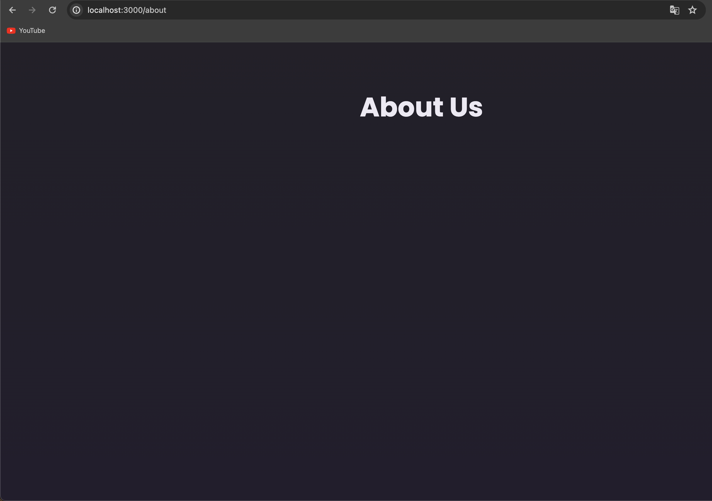

# NextJS 핵심

[📌 NextJS 핵심](#-nextjs-핵심)<br>
<br>

## 📌 NextJS 핵심

### 📖 파일 기반 라우팅과 리액트 서버 컴포넌트의 이해

- app 폴더에서 다양한 페이지를 설정한다.
- page.js는 layout.js와 마찬가지로 보호된 파일명이다. &rarr; 페이지를 렌더링해야한다고 말하는 역할.
- page.js는 서버에 실행이 된다. 해당 js 파일에 `console.log('...')`를 사용하면 서버의 터미널에서 실행된다.
- 즉 일반적인 리액트 컴포넌트지만 NextJS에서 서버 컴포너느로 취급받고 서버에서 실행되는 특별한 대우를 받는 것이다. 그런 후에 JSX코드가 유선으로 브라우저에 전달되어 HTML로서 렌더링 되는 것이다.

<br>

### 📖 파일 시스템을 통한 추가 경로 추가

- 파일명을 통해 NextJS에게 페이지로 만들고 싶다고 전달한다.
- app 디렉토리에 새로운 폴더를 추가함으로써 라우트로 취급하는 새로운 경로를 만들 수 있다. &rarr; app/about/page.js 생성

```js
// app/about/page.js
export default function AboutPage() {
  return (
    <main>
      <h1>About Us</h1>
    </main>
  );
}
```



<br>

### 📖 페이지 간 이동

```js
// app/page.js
export default function Home() {
  return (
    <main>
      
      <h1>Welcome to this NextJS Course!</h1>
      <p>🔥 Let&apos;s get started! 🔥</p>
      <p>
        <a href="/about">About Us</a>
      </p>
    </main>
  );
}
```

- 위처럼 `<a>` 태그를 사용하면 리액트에서 이용하는 것처럼 단일 페이지 어플리케이션이 아니게 된다.
- 따라서 `Link`라는 특별한 컴포넌트를 사용한다. 이 컴포넌트를 NextJS 프레임워크에서 제공하며 내부 링크가 필요할 경우 앵커 요소 대신 사용해야한다.

```js
import Link from "next/link";

export default function Home() {
  return (
    <main>
      
      <h1>Welcome to this NextJS Course!</h1>
      <p>🔥 Let&apos;s get started! 🔥</p>
      <p>
        <Link href="/about">About Us</Link>
      </p>
    </main>
  );
}
```

- Link 컴포넌트를 사용함에 따라 항상 동일한 상태가 유지되며 페이지를 벗어나는 것이 아니고 새로운 페이지를 로딩하는 것이 아니라는 것이 증명된다.
- 화면 뒤에서 Next 페이지의 내용이 서버에 렌더링 되고 클라이언트로 보내져 클라이언트 사이드 자바스크립트 코드가 처리해서 화면에 보이는 것을 업데이트 하는 것이다.

<br>

### 📖 페이지 및 레이아웃 작업하기

- page.js 파일이 페이지의 내용을 정의한다면, layout.js는 파일은 하나 또는 그 이상의 페이지를 감싸는 껍데기를 정의한다. 즉, 페이지가 렌더링되는 레이아웃을 의미한다.
- 모든 Next 프로젝트는 최소 하나의 Root layout.js 파일이 필요하다.
- 만약 app/about/layout.js를 생성한다면 이 파일은 about 폴더의 페이지와 중첩된 폴더에만 적용이 된다.

```js
// app/layout.js
import "./globals.css";

export const metadata = {
  title: "NextJS Course App",
  description: "Your first NextJS app!",
};

export default function RootLayout({ children }) {
  return (
    <html lang="en">
      <body>{children}</body>
    </html>
  );
}
```

- 리액트에서 모든 컴포넌트가 사용할 수 있는 표준 children 속성을 이 컴포넌트가 사용해 body 태그 사이에 내용을 추가한다. &rarr; children은 활성화된 page.js 파일의 내용을 의미한다.
- 리액트 컴포넌트에서 자주 사용하지 않는 요소이지만 Next 프로젝트의 Root 레이아웃은 웹사이트의 일반적인 HTML 뼈대를 잡기 위해 필수이다.
- head 요소는 렌더링 되지 않는다. 대신 다른 방식으로 데이터를 불러오는데 메타데이터라는 특별한 변수(상수)를 불러옴으로써 데이터를 덧붙인다.
- 이러한 메타데이터는 특정 레이아웃에 포함된 모든 페이지에 적용된다. &rarr; 즉 head에 들어가는 모든 내용은 메타데이터에 의해 설정되거나 NextJS로 인해 이면에서 자동으로 설정된다.

<br>

### 📖 보호된 파일명, 커스텀 컴포넌트 및 NextJS 프로젝트 정리 방법

- globals.css를 layout.js에 임포트함으로써 전체 프로젝트에 스타일을 적용
- app/icon이라는 이름의 이미지를 넣으면 NextJS에서 favicon으로 사용하게 된다.

```js
// app/header.js
export default function Header() {
  return (
    <>
      
      <h1>Welcome to this NextJS Course!</h1>
    </>
  );
}


// app/page.js
import Link from "next/link";
import Header from "@/components/header"; // @ : root 프로젝트를 조회

export default function Home() {
  return (
    <main>
      <Header />
      <p>🔥 Let&apos;s get started! 🔥</p>
      <p>
        <Link href="/about">About Us</Link>
      </p>
    </main>
  );
}
```

- header를 커스텀 컴포넌트로 사용하여 렌더링할 수도 있다.

🔗 [Project Organization and File Colocation](https://nextjs.org/docs/app/building-your-application/routing/colocation)

```json
{
  "compilerOptions": {
    "paths": {
      "@/*": ["./*"]
    }
  }
}
```

- @에 관한 기능 &rarr; 임포트 경로 단순화

<br>

### 📖 보호된 파일명

> 아래의 파일명들은 app/폴더 내부에서 생성된 때만 보호된다. app/폴더 외부에서 생성될 경우 이 파일명들을 특별한 방식으로 처리하지 않는다.

- page.js : 신규 페이지 생성 (ex. app/about/page.js &rarr; your-domain/about )
- layout.js : 형제 및 중첩 페이지를 감싸는 신규 레이아웃 생성
- not-found.js : 'Not Found' 오류에 대한 폴백 페이지(형재 또는 중첩 페이지 또는 레이아웃에서 전달된)
- error.js : 기타 오류에 대한 폴백 페이지(형재 또는 중첩 페이지 또는 레이아웃에서 전달된)
- loading.js : 형제 또는 중첩페이지(또는 레이아웃)가 데이터를 가져오는 동안 표시되는 폴백 페이지
- route.js : API 경로 생성(즉, JSX 코드가 아닌 데이터를 반환하는 페이지, ex: JSON 형식)

🔗 [File Conventions](https://nextjs.org/docs/app/api-reference/file-conventions)

<br>

### 📖 동적 경로 환경설정 및 경로 매개변수 사용 방법

- 만약 블로그를 작성하고 싶다면 각 블로그 페이지를 표현하기 위한 폴더를 일일히 생성할 수는 없다. 이때 필요한 것이 동적 라우트!
- 다양한 페이지와 다양한 블로그 게시물을 렌더링하기 위한 동적 라우트.
- NextJS에서는 대괄호를 사용한 중첩 폴더를 추가해 만들 수 있다.
- 대괄호는 NextJS에게 어떠한 경로 분할을 원하지만 다만 아직 정확한 값을 모른다고 하는 것이다. 임의의 값 slug 식별자는 경로에 값이 실릴 때 정확한 값에 접근할 수 있도록 한다.
- NextJS의 prop 중 params는 동적 라우트에 임의로 넣은 모든 이름이 있는 객체의 키(?)를 의미한다. ex. 'your-domain/blog/post-1' 이면, params는 post-1

```js
// app/blog/page.js
import Link from "next/link";

export default function BlogPage() {
  return (
    <main>
      <h1>The Blog</h1>
      <p>
        <Link href="/blog/post-1">Post 1</Link>
      </p>
      <p>
        <Link href="/blog/post-2">Post 2</Link>
      </p>
    </main>
  );
}

// app/blog/[slug]/page.js
export default function BlogPostPage({ params }) {
  return (
    <main>
      <h1>Blog Post</h1>
      <p>{params.slug}</p>
    </main>
  );
}
```


