# 프로젝트 : Foodies 앱

[📌 연습문제](#-연습문제)<br>
[📌 어플리케이션 구현하기](#-어플리케이션-구현하기)<br>
<br>

## 📌 연습문제

- 신규 라우트 3개 만들기 : '/meals', '/meals/share', '/community'

```js
// app/meals/page.js
export default function MealsPage() {
  return <h1>Meals Page</h1>;
}

// app/meals/share/page.js
export default function ShareMealPage() {
  return <h1>Share Page</h1>;
}

// app/community/page.js
export default function CommunityPage() {
  return <h1>Community</h1>;
}

// app/meals/[mealSlug]/page.js
export default function MealDetailPage({ params }) {
  return <h1>Meal Details {params.mealSlug}</h1>;
}
```

<br>

## 📌 어플리케이션 구현하기

### 📖 레이아웃 개념 다시보기

```js
// app/meals/layout.js
export default function MealsLayout({ children }) {
  return (
    <>
      <p>Meals Layout</p>
      {children}
    </>
  );
}
```

- children을 통해 중첩 레이아웃 또는 페이지에 접근할 수 있다.
- 이 말인 즉, 중첩 레이아웃이 있어도 root 레이아웃의 children 속성을 받아들여 감싸진 내용을 출력한다.
- 감싸진 내용에는 페이지와 기타 레이아웃(중첩 레이아웃)을 포함한다.


<br>

### 📖 레이아웃에 커스텀 컴포넌트 추가

```js
import Link from "next/link";
import Image from "next/image";
import logoImg from "@/assets/logo.png";
import styles from "./main-header.module.css";

export default function MainHeader() {
  return (
    <header className={styles.header}>
      <Link href="/" className={styles.logo}>
        <Image src={logoImg} alt="A plate with food on it" priority />
        NextLevel Food
      </Link>

      <nav className={styles.nav}>
        <ul>
          <li>
            <Link href="/meals">Browse Meals</Link>
          </li>
          <li>
            <Link href="/community">Foodies Community</Link>
          </li>
        </ul>
      </nav>
    </header>
  );
}
```

- `<Image>` : 더 최적화된 방법으로 이미지를 출력.
  - 페이지에서 실제로 보이는 경우에만 이미지가 표시되도록 이미지를 지연 로딩하여 구현.
  - 대응적인 이미지를 설정하는 프로세스 등을 단순화한다.
  - Next.js에 의해 생성된 `logoImg` 객체는 이미지를 임포트할 떄 최적화된 방법으로 image 컴포넌트를 띄울수 있도록 하는 유용한 정보를 포함하므로 `src={logoImg.src}`가 아니라 `src={logoImg}`로 작성했다.
  - `priority` 속성을 추가하여 이미지가 깜빡임 없이 우선적으로 로딩되도록 함.
  - 🔗 [NextJS | `<Image>`](https://nextjs.org/docs/app/api-reference/components/image)

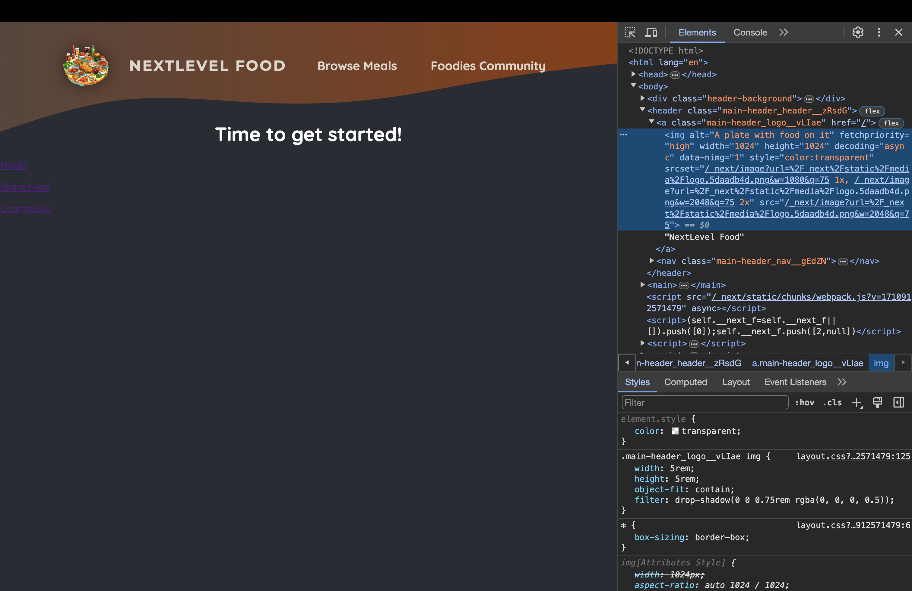

<br>

### 📖 기타 커스텀 컴포넌트 사용

```js
// components/main-header/main-header-background.js
import styles from "./main-header-background.module.css";

export default function MainHeaderBackground() {
  return (
    <div className={styles["header-background"]}>
      <svg xmlns="http://www.w3.org/2000/svg" viewBox="0 0 1440 320">
        <defs>
          <linearGradient id="gradient" x1="0%" y1="0%" x2="100%" y2="0%">
            <stop
              offset="0%"
              style={{ stopColor: "#59453c", stopOpacity: "1" }}
            />
            <stop
              offset="100%"
              style={{ stopColor: "#8f3a09", stopOpacity: "1" }}
            />
          </linearGradient>
        </defs>
        <path
          fill="url(#gradient)"
          d="M0,256L48,240C96,224,192,192,288,181.3C384,171,480,181,576,186.7C672,192,768,192,864,181.3C960,171,1056,149,1152,133.3C1248,117,1344,107,1392,101.3L1440,96L1440,0L1392,0C1344,0,1248,0,1152,0C1056,0,960,0,864,0C768,0,672,0,576,0C480,0,384,0,288,0C192,0,96,0,48,0L0,0Z"
        ></path>
      </svg>
    </div>
  );
}

// components/main-header/main-header.js
import Link from "next/link";
import Image from "next/image";
import logoImg from "@/assets/logo.png";
import styles from "./main-header.module.css";
import MainHeaderBackground from "./main-header-background";

export default function MainHeader() {
  return (
    <>
      <MainHeaderBackground />
      <header className={styles.header}>
        <Link href="/" className={styles.logo}>
          <Image src={logoImg} alt="A plate with food on it" priority />
          NextLevel Food
        </Link>

        <nav className={styles.nav}>
          <ul>
            <li>
              <Link href="/meals">Browse Meals</Link>
            </li>
            <li>
              <Link href="/community">Foodies Community</Link>
            </li>
          </ul>
        </nav>
      </header>
    </>
  );
}
```

<br>

### 📖 시작 페이지 내용 채우기

```js
// app/page.js
import Link from "next/link";
import styles from "./page.module.css";
import ImageSlideshow from "@/components/images/image-slideshow";

export default function Home() {
  return (
    <>
      <header className={styles.header}>
        {/* 이미지 슬라이드쇼 */}
        <div className={styles.slideshow}>
          <ImageSlideshow />
        </div>
        <div>
          <div className={styles.hero}>
            <h1>NextLevel Food for NextLevel Foodies</h1>
            <p>Taste & share food from all over the world.</p>
          </div>
          <div className={styles.cta}>
            <Link href="/community">Join the Comminity</Link>
            <Link href="/meals">Explore Meals</Link>
          </div>
        </div>
      </header>
      <main>
        <section className={styles.section}>
          <h2>How it works</h2>
          <p>
            NextLevel Food is a platform for foodies to share their favorite
            recipes with the world. It&apos;s a place to discover new dishes,
            and to connect with other food lovers.
          </p>
          <p>
            NextLevel Food is a place to discover new dishes, and to connect
            with other food lovers.
          </p>
        </section>

        <section className={styles.section}>
          <h2>Why NextLevel Food?</h2>
          <p>
            NextLevel Food is a platform for foodies to share their favorite
            recipes with the world. It&apos;s a place to discover new dishes,
            and to connect with other food lovers.
          </p>
          <p>
            NextLevel Food is a place to discover new dishes, and to connect
            with other food lovers.
          </p>
        </section>
      </main>
    </>
  );
}


// components/images/image-slideshow.js
import { useEffect, useState } from "react";
import Image from "next/image";

import burgerImg from "@/assets/burger.jpg";
import curryImg from "@/assets/curry.jpg";
import dumplingsImg from "@/assets/dumplings.jpg";
import macncheeseImg from "@/assets/macncheese.jpg";
import pizzaImg from "@/assets/pizza.jpg";
import schnitzelImg from "@/assets/schnitzel.jpg";
import tomatoSaladImg from "@/assets/tomato-salad.jpg";
import classes from "./image-slideshow.module.css";

const images = [
  { image: burgerImg, alt: "A delicious, juicy burger" },
  { image: curryImg, alt: "A delicious, spicy curry" },
  { image: dumplingsImg, alt: "Steamed dumplings" },
  { image: macncheeseImg, alt: "Mac and cheese" },
  { image: pizzaImg, alt: "A delicious pizza" },
  { image: schnitzelImg, alt: "A delicious schnitzel" },
  { image: tomatoSaladImg, alt: "A delicious tomato salad" },
];

export default function ImageSlideshow() {
  const [currentImageIndex, setCurrentImageIndex] = useState(0);

  useEffect(() => {
    //   이미지 인덱스를 5초마다 변경하고 슬라이드쇼처럼 보이기 위함.
    const interval = setInterval(() => {
      setCurrentImageIndex((prevIndex) =>
        prevIndex < images.length - 1 ? prevIndex + 1 : 0
      );
    }, 5000);

    return () => clearInterval(interval);
  }, []);

  return (
    <div className={classes.slideshow}>
      {images.map((image, index) => (
        <Image
          key={index}
          src={image.image}
          className={index === currentImageIndex ? classes.active : ""}
          alt={image.alt}
        />
      ))}
    </div>
  );
}
```

- `useState`를 필요로하는 컴포넌트를 가지고 있으며 이는 클라이언트 컴포넌트에서만 작동한다는 오류가 발생.
  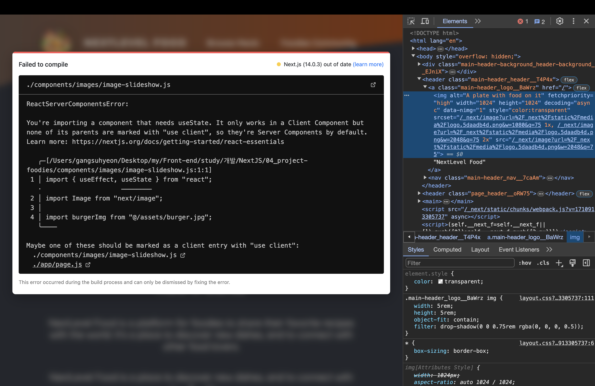

<br>

#### 💎 리액트 서버 컴포넌트 vs. 클라이언트 컴포넌트

- Next.js 뿐만 아니라 리액트 또한 대부분의 리액트 앱에서 자체적으로 구분이 있다.
  > 리액트는 기본적으로 클라이언트 컴포넌트를 사용하고 있다. 리액트는 순수한 클라이언트 사이드 라이브러리로 브라우저에서 클라이언트 측에서 코드를 실행한다.
- Next.js에서는 풀스택 프레임워크이므로 이러한 특성이 변경된다. 따라서 코드가 백엔드에서도 실행된다.
  > 기본적으로 Next.js 프로젝트에서 가지고 있는 리액트 컴포넌트들은 그것들이 페이지인지, 레이아웃인지, 기본 컴포넌트인지에 상관없이 오직 서버에서만 렌더링된다. 이것이 리액트 서버 컴포넌트라고 불리는 이유이다.

<br><br>

1. 리액트 서버 컴포넌트 (RSC)

   - 기본적으로 모든 리액트 컴포넌트는 서버에서만 렌더링 된다.
   - 그래서 컴포넌트에 `console.log`를 사용하면 브라우저의 콘솔에는 뜨지 않고 서버(백엔드)의 콘솔에 표시되는 것이다.
   - The backend executes the server component functions and hence derives the to-be-rendered HTML code.
   - The client-side receives and renders the to-be-rendered HTML code
     > 서버 컴포넌트를 사용하면 다운로드해야 하는 클라이언트 측의 자바스크립트 코드가 줄어들 수 있어 웹 사이트의 성능을 향상시킬 수 있다. 그리고 이것은 검색 엔진 최적화에도 좋다.
   - 웹 검색 크롤러들은 완성 콘텐츠를 포함하는 페이지를 볼 수 있기 때문이다.

2. 클라이언트 컴포넌트
   - 페이지의 소스 코드를 보면 본질적으로 비어있는 것을 볼 수 있다. 왜냐하면 모든 내용은 클라이언트 측 코드와 클라이언트 측 컴포넌트의 도움으로, 클라이언트 측에서 생성되고 채워지기 때문이다.
   - Next.js에서 클라이언트 컴포넌트를 만들 수 있다. 그러한 컴포넌트들은 서버에서 사전 렌더링 되는 것들이고 잠재적으로는 클라이언트에 렌더링될 수 있다.
   - 만약 Next.js에서 클라이언트 컴포넌트를 만들고자 한다면 컴포넌트를 잡고있는 파일 위에 특별한 지시어(use Client)를 사용해야한다.

```js
// components/images/image-slideshow.js
"use client"; // useState, useEffect와 같은 리액트 훅과 이벤트 트리거를 사용하기 위함

import { useEffect, useState } from "react";
import Image from "next/image";

import burgerImg from "@/assets/burger.jpg";
import curryImg from "@/assets/curry.jpg";
import dumplingsImg from "@/assets/dumplings.jpg";
import macncheeseImg from "@/assets/macncheese.jpg";
import pizzaImg from "@/assets/pizza.jpg";
import schnitzelImg from "@/assets/schnitzel.jpg";
import tomatoSaladImg from "@/assets/tomato-salad.jpg";
import classes from "./image-slideshow.module.css";

const images = [
  { image: burgerImg, alt: "A delicious, juicy burger" },
  { image: curryImg, alt: "A delicious, spicy curry" },
  { image: dumplingsImg, alt: "Steamed dumplings" },
  { image: macncheeseImg, alt: "Mac and cheese" },
  { image: pizzaImg, alt: "A delicious pizza" },
  { image: schnitzelImg, alt: "A delicious schnitzel" },
  { image: tomatoSaladImg, alt: "A delicious tomato salad" },
];

export default function ImageSlideshow() {
  const [currentImageIndex, setCurrentImageIndex] = useState(0);

  useEffect(() => {
    //   이미지 인덱스를 5초마다 변경하고 슬라이드쇼처럼 보이기 위함.
    const interval = setInterval(() => {
      setCurrentImageIndex((prevIndex) =>
        prevIndex < images.length - 1 ? prevIndex + 1 : 0
      );
    }, 5000);

    return () => clearInterval(interval);
  }, []);

  return (
    <div className={classes.slideshow}>
      {images.map((image, index) => (
        <Image
          key={index}
          src={image.image}
          className={index === currentImageIndex ? classes.active : ""}
          alt={image.alt}
        />
      ))}
    </div>
  );
}
```

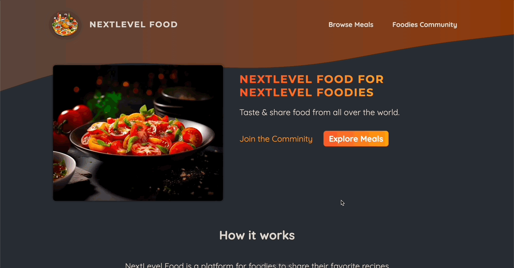

<br>

### 📖 클라이언트 컴포넌트의 효율적 사용

- 필요한 컴포넌트만 클라이언트 컴포넌트로 변환하여 대부분의 컴포넌트가 서버 컴포넌트로 유지되고 대부분의 컴포넌트에서 서버 컴포넌트의 이점을 잃지 않도록 하려면 컴포넌트 트리를 가능한 아래로 내려가서 `use client`를 추가하는 것이 좋다.

```js
// components/main-header/nav-link.js
"use client";

import Link from "next/link";
import { usePathname } from "next/navigation";
import styles from "./nav-link.module.css";

export default function NavLink({ href, children }) {
  const path = usePathname();

  return (
    <Link
      href={href}
      className={
        path.startsWith(href) ? `${styles.link} ${styles.active}` : styles.link
      }
    >
      {children}
    </Link>
  );
}
```

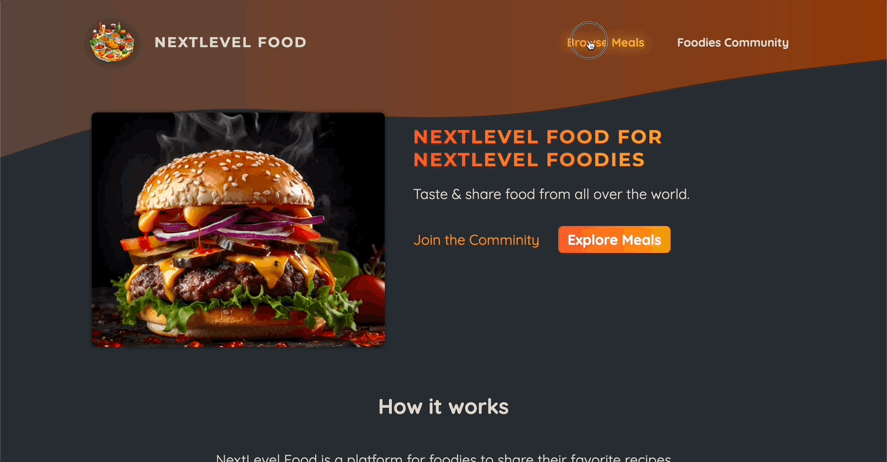

<br>

### 📖 Meals 페이지

```js
// app/meals/page.js
import Link from "next/link";
import styles from "./page.module.css";
import MealsGrid from "@/components/meals/meals-grid";

export default function MealsPage() {
  return (
    <>
      <header className={styles.header}>
        <h1>
          Delicious meals, created
          <span className={styles.highlight}> by you</span>
        </h1>
        <p>
          Choose your favorite recipe and cook it yourself. It is easy and fun!
        </p>
        <p className={styles.cta}>
          <Link href="/meals/share">Share Your Favorite Recipe</Link>
        </p>
      </header>
      <main className={styles.main}>
        <MealsGrid meals={[]} />
      </main>
    </>
  );
}


// components/meals/meals-grid.js
import MealItem from "./meal-item";
import styles from "./meals-grid.module.css";

export default function MealsGrid({ meals }) {
  return (
    <ul className={styles.meals}>
      {meals.map((meal) => (
        <li key={meal.id}>
          <MealItem {...meal} />
        </li>
      ))}
    </ul>
  );
}


// components/meals/meal-item.js
import Link from "next/link";
import Image from "next/image";

import classes from "./meal-item.module.css";

export default function MealItem({ title, slug, image, summary, creator }) {
  return (
    <article className={classes.meal}>
      <header>
        <div className={classes.image}>
          {/* fill : Next.js에게 가능한 공간을 부모 컴포넌트에 의해 정의된 이미지들로 채워야 함을 알려준다. */}
          <Image src={image} alt={title} fill />
        </div>
        <div className={classes.headerText}>
          <h2>{title}</h2>
          <p>by {creator}</p>
        </div>
      </header>
      <div className={classes.content}>
        <p className={classes.summary}>{summary}</p>
        <div className={classes.actions}>
          <Link href={`/meals/${slug}`}>View Details</Link>
        </div>
      </div>
    </article>
  );
}
```

- [Next.js | `<Image fill>`](https://nextjs.org/docs/app/api-reference/components/image#fill)

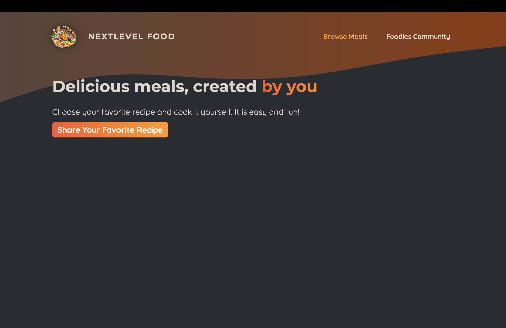

<br>

### 📖 SQLite 데이터베이스 설정

- 설치 : `npm install better-sqlite3`
- initdb.js 작성

```js
const sql = require("better-sqlite3");
const db = sql("meals.db");

const dummyMeals = [
  {
    title: "Juicy Cheese Burger",
    slug: "juicy-cheese-burger",
    image: "/images/burger.jpg",
    summary:
      "A mouth-watering burger with a juicy beef patty and melted cheese, served in a soft bun.",
    instructions: `
      1. Prepare the patty:
         Mix 200g of ground beef with salt and pepper. Form into a patty.

      2. Cook the patty:
         Heat a pan with a bit of oil. Cook the patty for 2-3 minutes each side, until browned.

      3. Assemble the burger:
         Toast the burger bun halves. Place lettuce and tomato on the bottom half. Add the cooked patty and top with a slice of cheese.

      4. Serve:
         Complete the assembly with the top bun and serve hot.
    `,
    creator: "John Doe",
    creator_email: "johndoe@example.com",
  },
  {
    title: "Spicy Curry",
    slug: "spicy-curry",
    image: "/images/curry.jpg",
    summary:
      "A rich and spicy curry, infused with exotic spices and creamy coconut milk.",
    instructions: `
      1. Chop vegetables:
         Cut your choice of vegetables into bite-sized pieces.

      2. Sauté vegetables:
         In a pan with oil, sauté the vegetables until they start to soften.

      3. Add curry paste:
         Stir in 2 tablespoons of curry paste and cook for another minute.

      4. Simmer with coconut milk:
         Pour in 500ml of coconut milk and bring to a simmer. Let it cook for about 15 minutes.

      5. Serve:
         Enjoy this creamy curry with rice or bread.
    `,
    creator: "Max Schwarz",
    creator_email: "max@example.com",
  },
  {
    title: "Homemade Dumplings",
    slug: "homemade-dumplings",
    image: "/images/dumplings.jpg",
    summary:
      "Tender dumplings filled with savory meat and vegetables, steamed to perfection.",
    instructions: `
      1. Prepare the filling:
         Mix minced meat, shredded vegetables, and spices.

      2. Fill the dumplings:
         Place a spoonful of filling in the center of each dumpling wrapper. Wet the edges and fold to seal.

      3. Steam the dumplings:
         Arrange dumplings in a steamer. Steam for about 10 minutes.

      4. Serve:
         Enjoy these dumplings hot, with a dipping sauce of your choice.
    `,
    creator: "Emily Chen",
    creator_email: "emilychen@example.com",
  },
  {
    title: "Classic Mac n Cheese",
    slug: "classic-mac-n-cheese",
    image: "/images/macncheese.jpg",
    summary:
      "Creamy and cheesy macaroni, a comforting classic that's always a crowd-pleaser.",
    instructions: `
      1. Cook the macaroni:
         Boil macaroni according to package instructions until al dente.

      2. Prepare cheese sauce:
         In a saucepan, melt butter, add flour, and gradually whisk in milk until thickened. Stir in grated cheese until melted.

      3. Combine:
         Mix the cheese sauce with the drained macaroni.

      4. Bake:
         Transfer to a baking dish, top with breadcrumbs, and bake until golden.

      5. Serve:
         Serve hot, garnished with parsley if desired.
    `,
    creator: "Laura Smith",
    creator_email: "laurasmith@example.com",
  },
  {
    title: "Authentic Pizza",
    slug: "authentic-pizza",
    image: "/images/pizza.jpg",
    summary:
      "Hand-tossed pizza with a tangy tomato sauce, fresh toppings, and melted cheese.",
    instructions: `
      1. Prepare the dough:
         Knead pizza dough and let it rise until doubled in size.

      2. Shape and add toppings:
         Roll out the dough, spread tomato sauce, and add your favorite toppings and cheese.

      3. Bake the pizza:
         Bake in a preheated oven at 220°C for about 15-20 minutes.

      4. Serve:
         Slice hot and enjoy with a sprinkle of basil leaves.
    `,
    creator: "Mario Rossi",
    creator_email: "mariorossi@example.com",
  },
  {
    title: "Wiener Schnitzel",
    slug: "wiener-schnitzel",
    image: "/images/schnitzel.jpg",
    summary:
      "Crispy, golden-brown breaded veal cutlet, a classic Austrian dish.",
    instructions: `
      1. Prepare the veal:
         Pound veal cutlets to an even thickness.

      2. Bread the veal:
         Coat each cutlet in flour, dip in beaten eggs, and then in breadcrumbs.

      3. Fry the schnitzel:
      Heat oil in a pan and fry each schnitzel until golden brown on both sides.

      4. Serve:
      Serve hot with a slice of lemon and a side of potato salad or greens.
 `,
    creator: "Franz Huber",
    creator_email: "franzhuber@example.com",
  },
  {
    title: "Fresh Tomato Salad",
    slug: "fresh-tomato-salad",
    image: "/images/tomato-salad.jpg",
    summary:
      "A light and refreshing salad with ripe tomatoes, fresh basil, and a tangy vinaigrette.",
    instructions: `
      1. Prepare the tomatoes:
        Slice fresh tomatoes and arrange them on a plate.
    
      2. Add herbs and seasoning:
         Sprinkle chopped basil, salt, and pepper over the tomatoes.
    
      3. Dress the salad:
         Drizzle with olive oil and balsamic vinegar.
    
      4. Serve:
         Enjoy this simple, flavorful salad as a side dish or light meal.
    `,
    creator: "Sophia Green",
    creator_email: "sophiagreen@example.com",
  },
];

// 테이블 생성
db.prepare(
  `
   CREATE TABLE IF NOT EXISTS meals (
       id INTEGER PRIMARY KEY AUTOINCREMENT,
       slug TEXT NOT NULL UNIQUE,
       title TEXT NOT NULL,
       image TEXT NOT NULL,
       summary TEXT NOT NULL,
       instructions TEXT NOT NULL,
       creator TEXT NOT NULL,
       creator_email TEXT NOT NULL
    )
`
).run();

// 데이터베이스에 여러 데이터를 입력하기 위함
async function initData() {
  const stmt = db.prepare(`
      INSERT INTO meals VALUES (
         null,
         @slug,
         @title,
         @image,
         @summary,
         @instructions,
         @creator,
         @creator_email
      )
   `);

  for (const meal of dummyMeals) {
    stmt.run(meal);
  }
}

initData();
```

- initdb.js 실행 : `node initdb.js` &rarr; meals.db 생성됨

<br>

### 📖 DB에서 데이터 불러오기

```js
// lib/meals.js
import sql from "better-sqlite3";

const db = sql("meals.db");

export async function getMeals() {
  await new Promise((resolve) => setTimeout(resolve, 2000)); // 임의의 딜레이 발생
  return db.prepare(`SELECT * FROM meals`).all();
}

// app/meals/page.js
import Link from "next/link";
import styles from "./page.module.css";
import MealsGrid from "@/components/meals/meals-grid";
import { getMeals } from "@/lib/meals";

export default async function MealsPage() {
  const meals = await getMeals();
  return (
    <>
      <header className={styles.header}>
        <h1>
          Delicious meals, created
          <span className={styles.highlight}> by you</span>
        </h1>
        <p>
          Choose your favorite recipe and cook it yourself. It is easy and fun!
        </p>
        <p className={styles.cta}>
          <Link href="/meals/share">Share Your Favorite Recipe</Link>
        </p>
      </header>
      <main className={styles.main}>
        <MealsGrid meals={meals} />
      </main>
    </>
  );
}
```

- `getMeals()`

  - `all` : prepare안에 작성한 명령문을 통해 가져올 모든 데이터를 fetch할 때 사용.
  - 만약 하나의 데이터만 가져오고 싶다면 `get`을 사용하면 됨.
    - 해당 함수를 async로 선언(?)함으로써 Promise를 사용할 것임을 알 수 있고 자체적으로 딜레이(차후에 로딩)를 발생시킨 후, db 데이터를 프로미스로 리턴

- page.js에서 `getMeals()`를 불러오는데 리턴되는 것이 프로미스이므로 `await`을 사용하였다.


<br>

### 📖 로딩 페이지 추가

- Next.js는 유저가 들어갔던 페이지를 모두 캐싱한다. (해당 페이지의 데이터까지)
- 따라서 새로고침할 때만 페이지가 다시 설계되는 것이다.
- 그러므로 로딩될 때의 페이지를 작성하는 것이 유저 경험에도 좋다!

```js
// app/meals/loading.js
import styles from "./loading.module.css";

export default function MealsLoadingPage() {
  return <p className={styles.loading}>Fetching Meals...</p>;
}
```


<br>

### 📖 Suspense & Streamed Response를 이용한 세분화 로딩 상태 관리

- meals 패이지에서 데이터를 불러오는 `<MealsGrid>`를 제외한 부분은 로딩되는 데이터와는 무관하다. 따라서 로딩할 때 데이터를 불러오는 부분을 제외한 텍스트가 바로 보이면 좋다.
- `Suspense`는 리액트에서 제공되는 컴포넌트로 일부 데이터 또는 리소스가 불러올 때까지 로딩 상태를 처리하고 대체 컨텐츠를 표시할 수 있다.

```js
// app/meals/page.js
import { Suspense } from "react";
import Link from "next/link";
import styles from "./page.module.css";
import MealsGrid from "@/components/meals/meals-grid";
import { getMeals } from "@/lib/meals";

async function Meals() {
  const meals = await getMeals();
  return <MealsGrid meals={meals} />;
}

export default function MealsPage() {
  return (
    <>
      <header className={styles.header}>
        <h1>
          Delicious meals, created
          <span className={styles.highlight}> by you</span>
        </h1>
        <p>
          Choose your favorite recipe and cook it yourself. It is easy and fun!
        </p>
        <p className={styles.cta}>
          <Link href="/meals/share">Share Your Favorite Recipe</Link>
        </p>
      </header>
      <main className={styles.main}>
        <Suspense
          fallback={<p className={styles.loading}>Fetching Meals...</p>}
        >
          <Meals />
        </Suspense>
      </main>
    </>
  );
}
```

- 기존에 로딩 페이지로 사용한 loading.js와 loading.module.css는 더이상 사용하지 않는다. 따라서 loading-out.js로 이름 변경(Next.js가 감지 못하도록..)

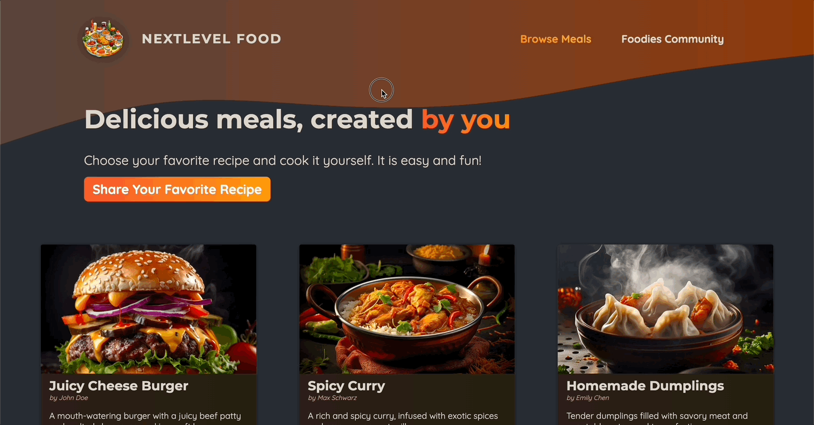

<br>

### 📖 오류 처리 방법

- 에러 페이지는 error 파일과 같은 폴더에 있거나 중첩된 페이지나 레이아웃에서 발생한 에러만 처리한다.
- 따라서 Root(app 폴더)에 작성하여 어떤 페이지에서 작성한 에러도 잡을 수 있도록 할 수 있다.

```js
// app/meals/error.js
"use client";
export default function MealsErrorPage({ error }) {
  return (
    <main className="error">
      <h1>오류가 발생했습니다!</h1>
      <p>{error.message}</p>
    </main>
  );
}
```

<br>

### 📖 'Not Found' 상태 처리 방법

```js
// app/not-found.js
export default function NotFoundPage({ error }) {
  return (
    <main className="not-found">
      <h1>Not Found</h1>
      <p>요청한 페이지 혹은 리소스를 찾을 수 없습니다.</p>
    </main>
  );
}
```

<br>

### 📖 동적 경로와 경로 매개 변수를 활용한 Meals 세부내용 로딩 및 렌더링

```js
// lib/meals.js
export function getMeal(slug) {
  return db.prepare("SELECT * FROM meals WHERE slug = ?").get(slug);
}

// app/meals/[mealSlug]/page.js
import { getMeal } from "@/lib/meals";
import styles from "./page.module.css";
import Image from "next/image";

export default function MealDetailPage({ params }) {
  const meal = getMeal(params.mealSlug);
  meal.instructions = meal.instructions.replace(/\n/g, "<br />");

  return (
    <>
      <header className={styles.header}>
        <div className={styles.image}>
          <Image src={meal.image} fill />
        </div>
        <div className={styles.headerText}>
          <h1>{meal.title}</h1>
          <p className={styles.creator}>
            by <a href={`mailto:${meal.creator_email}`}>{meal.creator}</a>
          </p>
          <p className={styles.summary}>{meal.summary}</p>
        </div>
      </header>
      <main>
        <p
          className={styles.instructions}
          dangerouslySetInnerHTML={{ __html: meal.instructions }}
        ></p>
      </main>
    </>
  );
}
```

- `dangerouslySetInnerHTML` : 컨텐츠를 HTML로 출력시키면 크로스 사이트 스크립트(XSS) 공격에 노출될 수 있다. [참고](https://ko.legacy.reactjs.org/docs/dom-elements.html#dangerouslysetinnerhtml)

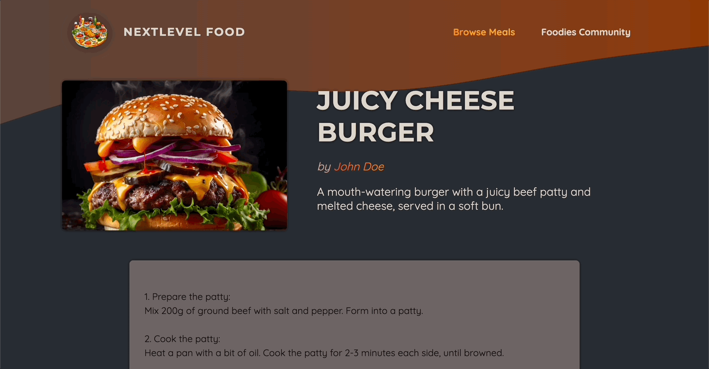

<br>

### 📖 개별 Meals에 대한 Not Found 오류 전송

```js
// app/meals/[mealSlug]/page.js
import { getMeal } from "@/lib/meals";
import styles from "./page.module.css";
import Image from "next/image";

import { notFound } from "next/navigation";

export default function MealDetailPage({ params }) {
  const meal = getMeal(params.mealSlug);

  if (!meal) {
    notFound();
  }

  meal.instructions = meal.instructions.replace(/\n/g, "<br />");

  return (
    <>
      <header className={styles.header}>
        <div className={styles.image}>
          <Image src={meal.image} fill />
        </div>
        <div className={styles.headerText}>
          <h1>{meal.title}</h1>
          <p className={styles.creator}>
            by <a href={`mailto:${meal.creator_email}`}>{meal.creator}</a>
          </p>
          <p className={styles.summary}>{meal.summary}</p>
        </div>
      </header>
      <main>
        <p
          className={styles.instructions}
          dangerouslySetInnerHTML={{ __html: meal.instructions }}
        ></p>
      </main>
    </>
  );
}
```

- `notFound` : 해당 컴포넌트가 실행되는 것을 멈추고 가장 가까운 not-found나 오류화면을 보여준다.

<br>

### 📖 'Share Meal' 양식 사용에 대한 기초

```js
// app/meals/share/page.js
import classes from "./page.module.css";

export default function ShareMealPage() {
  return (
    <>
      <header className={classes.header}>
        <h1>
          Share your <span className={classes.highlight}>favorite meal</span>
        </h1>
        <p>Or any other meal you feel needs sharing!</p>
      </header>
      <main className={classes.main}>
        <form className={classes.form}>
          <div className={classes.row}>
            <p>
              <label htmlFor="name">Your name</label>
              <input type="text" id="name" name="name" required />
            </p>
            <p>
              <label htmlFor="email">Your email</label>
              <input type="email" id="email" name="email" required />
            </p>
          </div>
          <p>
            <label htmlFor="title">Title</label>
            <input type="text" id="title" name="title" required />
          </p>
          <p>
            <label htmlFor="summary">Short Summary</label>
            <input type="text" id="summary" name="summary" required />
          </p>
          <p>
            <label htmlFor="instructions">Instructions</label>
            <textarea
              id="instructions"
              name="instructions"
              rows="10"
              required
            ></textarea>
          </p>
          IMAGE PICKER
          <p className={classes.actions}>
            <button type="submit">Share Meal</button>
          </p>
        </form>
      </main>
    </>
  );
}
```

<br>

### 📖 커스텀 이미지 피커(선택 도구) 입력 컴포넌트에 대한 기초

```js
// components/meals/image-picker.js
"use client";

import { useRef } from "react";
import styles from "./image-picker.module.css";

export default function ImagePicker({ label, name }) {
  const imageInputRef = useRef();

  function handlePickClick() {
    imageInputRef.current.click();
  }

  return (
    <div className={styles.picker}>
      <label htmlFor={name}>{label}</label>
      <div className={styles.controls}>
        <input
          className={styles.input}
          type="file"
          id={name}
          accept="image/png, image/jpeg"
          name={name}
          ref={imageInputRef}
        />
        <button
          className={styles.button}
          type="button"
          onClick={handlePickClick}
        >
          Pick an Image
        </button>
      </div>
    </div>
  );
}


// app/meals/share/page.js
import ImagePicker from "@/components/meals/image-picker";
import classes from "./page.module.css";

export default function ShareMealPage() {
  return (
    <>
      <header className={classes.header}>
        <h1>
          Share your <span className={classes.highlight}>favorite meal</span>
        </h1>
        <p>Or any other meal you feel needs sharing!</p>
      </header>
      <main className={classes.main}>
        <form className={classes.form}>
          <div className={classes.row}>
            <p>
              <label htmlFor="name">Your name</label>
              <input type="text" id="name" name="name" required />
            </p>
            <p>
              <label htmlFor="email">Your email</label>
              <input type="email" id="email" name="email" required />
            </p>
          </div>
          <p>
            <label htmlFor="title">Title</label>
            <input type="text" id="title" name="title" required />
          </p>
          <p>
            <label htmlFor="summary">Short Summary</label>
            <input type="text" id="summary" name="summary" required />
          </p>
          <p>
            <label htmlFor="instructions">Instructions</label>
            <textarea
              id="instructions"
              name="instructions"
              rows="10"
              required
            ></textarea>
          </p>
          <ImagePicker />
          <p className={classes.actions}>
            <button type="submit">Share Meal</button>
          </p>
        </form>
      </main>
    </>
  );
}
```

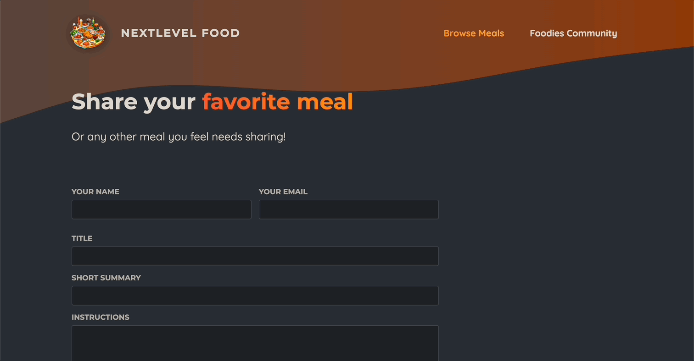

<br>

### 📖 Picker에 이미지 미리보기 추가

```js
// components/meals/image-picker.js
"use client";

import { useRef, useState } from "react";
import styles from "./image-picker.module.css";
import Image from "next/image";

export default function ImagePicker({ label, name }) {
  const [pickedImage, setPickedImage] = useState();
  const imageInputRef = useRef();

  function handlePickClick() {
    imageInputRef.current.click();
  }

  function handleImageChange(event) {
    const file = event.target.files[0];

    if (!file) {
      setPickedImage(null);
      return;
    }
    const fileReader = new FileReader();

    fileReader.onload = () => {
      setPickedImage(fileReader.result);
    };

    fileReader.readAsDataURL(file); // 아무것도 반환하지 않는다. 대신, fileReader 객체에 있는 load 속성에 값을 지정하는것으로 생성되는 DataURL을 얻게된다.
  }

  return (
    <div className={styles.picker}>
      <label htmlFor={name}>{label}</label>
      <div className={styles.controls}>
        <div className={styles.preview}>
          {!pickedImage && <p>No image picked yet.</p>}
          {pickedImage && (
            <Image
              src={pickedImage}
              alt="The image selected by the user."
              fill
            />
          )}
        </div>
        <input
          className={styles.input}
          type="file"
          id={name}
          accept="image/png, image/jpeg"
          name={name}
          ref={imageInputRef}
          onChange={handleImageChange}
          required
        />
        <button
          className={styles.button}
          type="button"
          onClick={handlePickClick}
        >
          Pick an Image
        </button>
      </div>
    </div>
  );
}
```

🔗 [MDN | FileReader](https://developer.mozilla.org/ko/docs/Web/API/FileReader)

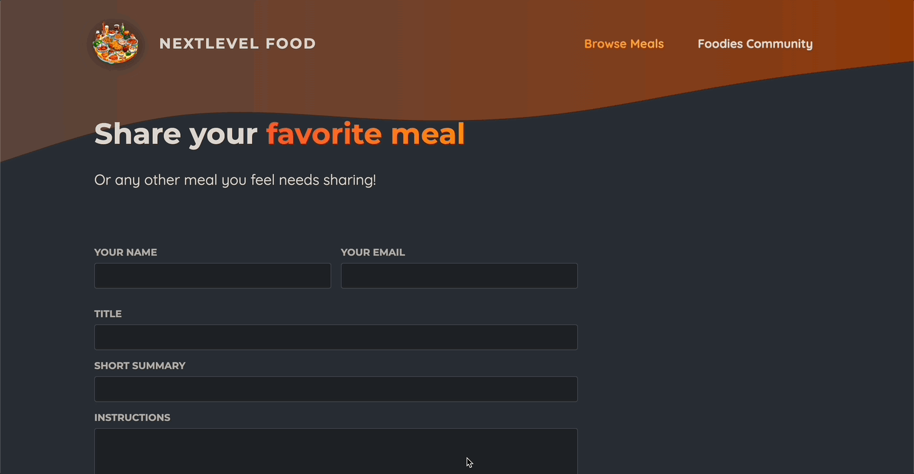

<br>

### 📖 양식 제출 처리를 위한 서버 액션 소개 및 사용방법

```js
// app/meals/share/page.js
import ImagePicker from "@/components/meals/image-picker";
import classes from "./page.module.css";

export default function ShareMealPage() {
  async function shareMeal(formData) {
    // 이 함수를 클라이언트 쪽이 아닌 서버 측에서 실행된다. 또한 이 함수는 자동적으로 제출된 폼 데이터를 받는다.
    "use server";

    const meal = {
      title: formData.get("title"),
      creator_email: formData.get("email"),
      summary: formData.get("summary"),
      image: formData.get("image"),
      instructions: formData.get("instructions"),
      creator: formData.get("name"),
    };

    console.log(meal);
  }

  return (
    <>
      <header className={classes.header}>
        <h1>
          Share your <span className={classes.highlight}>favorite meal</span>
        </h1>
        <p>Or any other meal you feel needs sharing!</p>
      </header>
      <main className={classes.main}>
        <form className={classes.form} action={shareMeal}>
          <div className={classes.row}>
            <p>
              <label htmlFor="name">Your name</label>
              <input type="text" id="name" name="name" required />
            </p>
            <p>
              <label htmlFor="email">Your email</label>
              <input type="email" id="email" name="email" required />
            </p>
          </div>
          <p>
            <label htmlFor="title">Title</label>
            <input type="text" id="title" name="title" required />
          </p>
          <p>
            <label htmlFor="summary">Short Summary</label>
            <input type="text" id="summary" name="summary" required />
          </p>
          <p>
            <label htmlFor="instructions">Instructions</label>
            <textarea
              id="instructions"
              name="instructions"
              rows="10"
              required
            ></textarea>
          </p>
          <ImagePicker name="image" label="Your image" />
          <p className={classes.actions}>
            <button type="submit">Share Meal</button>
          </p>
        </form>
      </main>
    </>
  );
}
```

- 풀스택 어플리케이션을 이미 사용하므로 데이터를 수집하여 서버에 보내는 대신 다른 방식을 사용한다.
- `'use server'` : Server Action이라는 것을 생성하는데 오직 서버에서만 실행될 수 있게 보장해주는 기능이다.
  - 컴포넌트의 기본 설정이 서버 컴포넌트인 것과 같이 이것도 오직 서버에서만 사용하도록 한다.
  - Server Action으로 바꾸기 위해서는 `async` 키워도 또한 붙여야 한다.
- 이러한 기능을 통해 Server Action을 가지고 form의 action 속성에 값으로 할당할 수 있다.
- 만약 form이 제출되면 NextJS가 자동으로 요청을 생성하여 웹사이트를 제공하는 NextJS 서버로 보내게 된다.

<br>

### 📖 개별 파일에 서버 액션 저장

```js
// lib/action.js
"use server";

export async function shareMeal(formData) {
  const meal = {
    title: formData.get("title"),
    creator_email: formData.get("email"),
    summary: formData.get("summary"),
    image: formData.get("image"),
    instructions: formData.get("instructions"),
    creator: formData.get("name"),
  };

  console.log(meal);
}

// app/meals/share/page.js
("use client");

import ImagePicker from "@/components/meals/image-picker";
import classes from "./page.module.css";
import { shareMeal } from "@/lib/action";

export default function ShareMealPage() {
  return (
    <>
      <header className={classes.header}>
        <h1>
          Share your <span className={classes.highlight}>favorite meal</span>
        </h1>
        <p>Or any other meal you feel needs sharing!</p>
      </header>
      <main className={classes.main}>
        <form className={classes.form} action={shareMeal}>
          <div className={classes.row}>
            <p>
              <label htmlFor="name">Your name</label>
              <input type="text" id="name" name="name" required />
            </p>
            <p>
              <label htmlFor="email">Your email</label>
              <input type="email" id="email" name="email" required />
            </p>
          </div>
          <p>
            <label htmlFor="title">Title</label>
            <input type="text" id="title" name="title" required />
          </p>
          <p>
            <label htmlFor="summary">Short Summary</label>
            <input type="text" id="summary" name="summary" required />
          </p>
          <p>
            <label htmlFor="instructions">Instructions</label>
            <textarea
              id="instructions"
              name="instructions"
              rows="10"
              required
            ></textarea>
          </p>
          <ImagePicker name="image" label="Your image" />
          <p className={classes.actions}>
            <button type="submit">Share Meal</button>
          </p>
        </form>
      </main>
    </>
  );
}
```

<br>

### 📖 XSS 보호를 위한 Slug 생성 및 유저 입력 무결 처리하기

- 패키지 설치 : `npm install slugify xss` &rarr; instructions의 경우 HTML을 그대로 표현하므로 XSS에 취약하다. 따라서 xss도 설치

```js
// lib/meals.js
import sql from "better-sqlite3";
import slugify from "slugify";
import xss from "xss";

const db = sql("meals.db");

// ...

export function saveMeal(meal) {
  meal.slug = slugify(meal.title, { lower: true });
  meal.instructions = xss(meal.instructions); // instructions 검열
}
```

<br>

### 📖 업로드된 이미지 저장 및 데이터베이스에 데이터 저장

```js
// lib/meals.js
import fs from "node:fs"; // 파일시스템 이용

import sql from "better-sqlite3";
import slugify from "slugify";
import xss from "xss";

const db = sql("meals.db");

//...

export async function saveMeal(meal) {
  meal.slug = slugify(meal.title, { lower: true });
  meal.instructions = xss(meal.instructions); // instructions 검열

  const extension = meal.image.name.split(".").pop(); // 마지막 요소. 즉 확장자 받음
  const fileName = `${meal.slug}.${extension}`;

  const stream = fs.createWriteStream(`public/images/${fileName}`);
  const bufferedImage = await meal.image.arrayBuffer(); // arrayBuffer함수가 프로미스를 반환 -> 버퍼로 변환됨.. 따라서 await 키워드 사용

  stream.write(Buffer.from(bufferedImage), (error) => {
    // write(저장할 chunk, 저장한 후 진행하는 코드(폴백))

    if (error) {
      // 에러가 있다면 에러에 대한 동작
      throw new Error("이미지를 저장하는데 실패했습니다.");
    }
  }); // chunk : 이미지를 버퍼로..

  meal.image = `/images/${fileName}`; // 모든 이미지에 관한 요청은 자동적으로 public 폴더로 보내짐

  // 데이터베이스에 저장하기
  db.prepare(
    `
    INSERT INTO meals
     (title, summary, instructions, creator, creator_email, image, slug)
     VALUES (
       @title,
       @summary,
       @instructions,
       @creator,
       @creator_email,
       @image,
       @slug
     )
  `
  ).run(meal);
}

// lib/action.js
("use server");

import { redirect } from "next/dist/server/api-utils";
import { saveMeal } from "./meals";

export async function shareMeal(formData) {
  const meal = {
    title: formData.get("title"),
    creator_email: formData.get("email"),
    summary: formData.get("summary"),
    image: formData.get("image"),
    instructions: formData.get("instructions"),
    creator: formData.get("name"),
  };

  await saveMeal(meal);
  redirect("/meals");
}
```

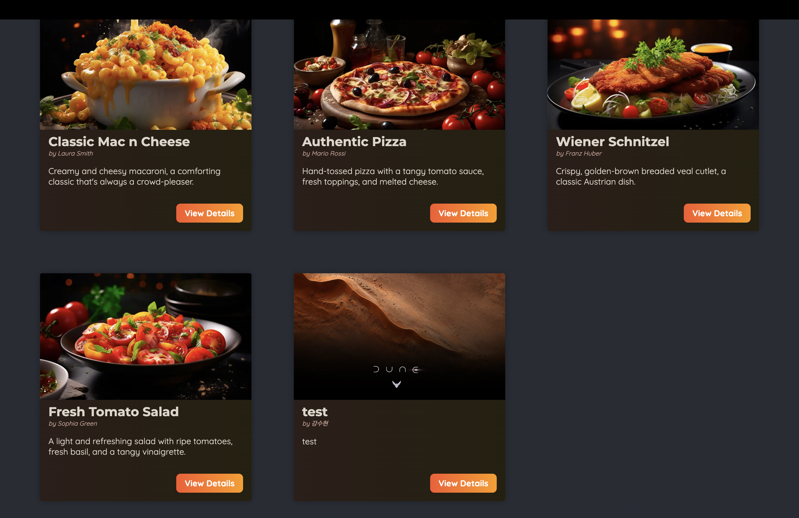

<br>

### 📖 useFOrmStatus를 이용한 양식 제출 상태 관리

```js
// components/meals/meals-form-submit.js
"use client";

import { useFormStatus } from "react-dom";
export default function MealsFormSubmit() {
  const { pending } = useFormStatus();

  return (
    <button type="submit" disabled={pending}>
      {pending ? "Submitting..." : "Share Meal"}
    </button>
  );
}


// app/meals/share/page.js
"use client";

import ImagePicker from "@/components/meals/image-picker";
import classes from "./page.module.css";
import { shareMeal } from "@/lib/action";
import MealsFormSubmit from "@/components/meals/meals-form-submit";

export default function ShareMealPage() {
  return (
    <>
      <header className={classes.header}>
        <h1>
          Share your <span className={classes.highlight}>favorite meal</span>
        </h1>
        <p>Or any other meal you feel needs sharing!</p>
      </header>
      <main className={classes.main}>
        <form className={classes.form} action={shareMeal}>
          <div className={classes.row}>
            <p>
              <label htmlFor="name">Your name</label>
              <input type="text" id="name" name="name" required />
            </p>
            <p>
              <label htmlFor="email">Your email</label>
              <input type="email" id="email" name="email" required />
            </p>
          </div>
          <p>
            <label htmlFor="title">Title</label>
            <input type="text" id="title" name="title" required />
          </p>
          <p>
            <label htmlFor="summary">Short Summary</label>
            <input type="text" id="summary" name="summary" required />
          </p>
          <p>
            <label htmlFor="instructions">Instructions</label>
            <textarea
              id="instructions"
              name="instructions"
              rows="10"
              required
            ></textarea>
          </p>
          <ImagePicker name="image" label="Your image" />
          <p className={classes.actions}>
            <MealsFormSubmit />
          </p>
        </form>
      </main>
    </>
  );
}

```

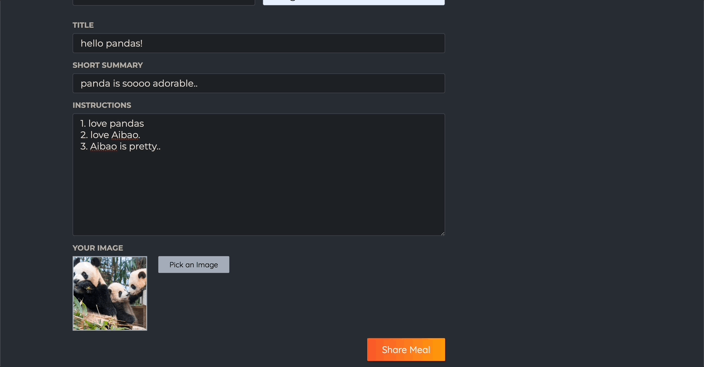

<br>

### 📖 서버 사이드 입력 유효성 확인 추가 방법

- required 속성을 통해서 일차적으로 유효성 검사를 하고 있지만 부족하다.
- 현재는 간단하게 유효성 검사를 했지만 차후에는 서드파티 패키지를 사용하는 등 더 자세히 해야한다.

```js
// lib/action.js
"use server";

import { redirect } from "next/navigation";
import { saveMeal } from "./meals";

function isInvalidText(text) {
  return !text || text.trim() === "";
}

export async function shareMeal(formData) {
  const meal = {
    title: formData.get("title"),
    creator_email: formData.get("email"),
    summary: formData.get("summary"),
    image: formData.get("image"),
    instructions: formData.get("instructions"),
    creator: formData.get("name"),
  };

  if (
    isInvalidText(meal.title) ||
    isInvalidText(meal.summary) ||
    isInvalidText(meal.instructions) ||
    isInvalidText(meal.creator) ||
    isInvalidText(meal.creator_email) ||
    !meal.creator_email.instructions("@") ||
    !meal.image ||
    meal.image.size === 0
  ) {
    throw new Error("Invalid Input");
  }

  await saveMeal(meal);
  redirect("/meals");
}
```

<br>

### 📖 서버 행동 응답 및 useFormState 작업

- 위처럼 하면 작성했던 모든 데이터가 지워진다.
- 만약 작성했던 데이터를 남겨두고 싶다면..?

```js
// lib/action.js
"use server";

import { redirect } from "next/navigation";
import { saveMeal } from "./meals";

function isInvalidText(text) {
  return !text || text.trim() === "";
}

// shareMeal(prevState, formData)로 변경
export async function shareMeal(prevState, formData) {
  const meal = {
    title: formData.get("title"),
    creator_email: formData.get("email"),
    summary: formData.get("summary"),
    image: formData.get("image"),
    instructions: formData.get("instructions"),
    creator: formData.get("name"),
  };

  if (
    isInvalidText(meal.title) ||
    isInvalidText(meal.summary) ||
    isInvalidText(meal.instructions) ||
    isInvalidText(meal.creator) ||
    isInvalidText(meal.creator_email) ||
    !meal.creator_email.instructions("@") ||
    !meal.image ||
    meal.image.size === 0
  ) {
    // 직렬화 가능한 것으로 리턴.
    return {
      message: "Invalid input.",
    };
  }

  await saveMeal(meal);
  redirect("/meals");
}

// app/meals/share/page.js
("use client");

import { useFormState } from "react-dom"; // 추가
import ImagePicker from "@/components/meals/image-picker";
import classes from "./page.module.css";
import { shareMeal } from "@/lib/action";
import MealsFormSubmit from "@/components/meals/meals-form-submit";

export default function ShareMealPage() {
  const [state, formAction] = useFormState(shareMeal, { message: null }); // 추가

  return (
    <>
      <header className={classes.header}>
        <h1>
          Share your <span className={classes.highlight}>favorite meal</span>
        </h1>
        <p>Or any other meal you feel needs sharing!</p>
      </header>
      <main className={classes.main}>
        <form className={classes.form} action={formAction}>
          <div className={classes.row}>
            <p>
              <label htmlFor="name">Your name</label>
              <input type="text" id="name" name="name" required />
            </p>
            <p>
              <label htmlFor="email">Your email</label>
              <input type="email" id="email" name="email" required />
            </p>
          </div>
          <p>
            <label htmlFor="title">Title</label>
            <input type="text" id="title" name="title" required />
          </p>
          <p>
            <label htmlFor="summary">Short Summary</label>
            <input type="text" id="summary" name="summary" required />
          </p>
          <p>
            <label htmlFor="instructions">Instructions</label>
            <textarea
              id="instructions"
              name="instructions"
              rows="10"
              required
            ></textarea>
          </p>
          <ImagePicker name="image" label="Your image" />
          {/* 추가 */}
          {state.message && <p>{state.message}</p>}
          <p className={classes.actions}>
            <MealsFormSubmit />
          </p>
        </form>
      </main>
    </>
  );
}
```

- `useFormState` 훅은 리액트의 `useState` 훅과 약간 비슷하게 동작한다.
- `useFormState` 훅은 Server Actions를 통해 제출될 form을 사용하는 페이지나 컴포넌트의 상태를 관리한다.
- `useFormState(arg1, arg2)`
  1. arg1 : form이 제출될 때 동작하는 실제 Server Action
  2. arg2 : 컴포넌트의 초기 상태. Server Action이 동작하기 전이나 response가 돌아오기 전에 useFormState가 반환할 초기 값.
- `useFormState`의 반환값은 `useState`처럼 두개의 요소로 되어있다.
  1. 해당 컴포넌트의 현재 상태 혹은 현재 response. 즉, Server Action으로부터 받은 가장 최근의 응답 또는 초기 상태.
  2. formAction : form의 action 속성에 값으로 설정

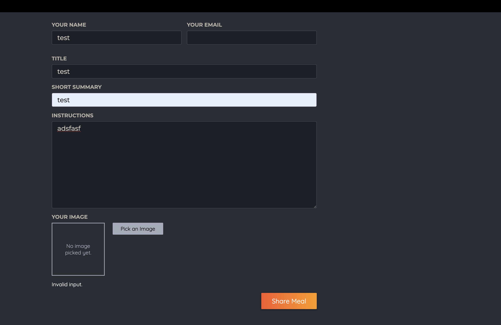

<br>

### 📖 NextJS 캐싱 구축 및 이해

- 개발환경에서 배포환경으로 변경하기 위해 `npm run build` 실행 &rarr; `npm start`로 배포 서버 실행
- 이제 개발 환경 서버가 아닌 배포 환경 서버로 열리게 된다.
- NextJS는 꽤 공격적인 캐싱을 하고 배포 환경을 위해 앱을 준비할 때 그리고 동작할 때 거치는 추가 단계가 하나 있다.
- 해당 단계는 개발 환경 서버에서 테스트할 때는 보지 못했던 것으로 **`npm run build`를 실행하면 NextJS는 실제로 앱에서 사전 생성될 수 있는 모든 페이지를 모두 사전 렌더링하고 생성하여 기본적으로는 동적 웹페이지가 아니게 된다.**

> NextJS는 모든 페이지를 사전 렌더링 함으로써 배포된 직후부터 모든 페이지가 동작할 수 있게 한다. &rarr; 웹 사이트에 처음 방문해도 렌더링을 기다릴 필요 없이 즉시 완성된 페이지를 볼 수 있다. (빌드 프로세스에서 모든 데이터를 불러오고 렌더링한다.)

- NextJS는 사전 렌더링된 페이지들을 캐싱하여 모든 방문자에게 제공한다. &rarr; 새롭게 데이터가 추가 되었을 때 반영되지 않을 수 있다는 단점이 존재.

<br>

### 📖 캐시 유효성 재확인 트리거

- 새로운 음식 데이터를 등록할 때마다 NextJS에게 캐시의 전체나 일부를 비워야 한다고 명령할 필요가 있다.
- `revalidatePath('/meals')` : NextJS가 특정 path(경로)에 속하는 캐시의 유효성 재검사를 하게 한다. &rarr; 기본값으로 설정한 path만 검사한다. 중첩된 path는 재검사 하지 않는다.
  - 만약 `revalidatePath('/meals', 'page')`을 사용한다면 두번째 인수의 기본값은 page로 이 path의 해당 페이지만 재검사하겠다는 뜻이 된다.
  - 만약 `revalidatePath('/meals', 'layout')`을 사용한다면 두번째 인수의 기본값은 layout으로 재검사되는 것은 layout이다. &rarr; 중첩된 페이지를 포함하므로 중첩된 모든 페이지를 재검사 한다.
- 'revalidate'는 간단히 말해 NextJS가 해당 페이지에 연관된 캐시를 비우는 것을 의미한다.(ex. 캐싱된 페이지)

**_만약 모든 페이지의 캐시를 재검사 하고싶다면... `revalidatePath('/', 'layout')`_**

<br>

### 📖 로컬 Filesystem에 파일 저장 금지

- 'The requested resource isn't a valid image for /images/dune-part-two.jpg received text/html; charset=utf-8' 라는 오류가 발생하면서 작성한 새로운 데이터에 사진이 뜨지 않는다.
- 현재 public/images 폴더에 저장을 하고있다. 따라서 이미지가 보이지 않는다.
- 개발 환경에서는 해당 폴더에 접근이 가능하지만, 배포 환경에서는 .next 폴더에 복사가 되고 .next 폴더를 사용하게 된다.

  🔗 [Next.js | Static Assets in public](https://nextjs.org/docs/app/building-your-application/optimizing/static-assets)
  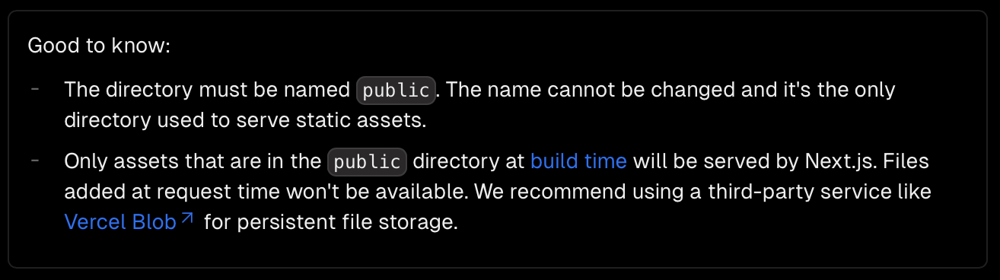
  위의 사진 처럼 Vercel blob(혹은 AWS S3)을 사용하는 것을 추천하고 있다.

<br>

### 📖 업로드된 이미지를 클라우드에 저장하기(AWS S3)

- 업로드된 파일(또는 런타임에 생성된 기타 파일)을 로컬 파일 시스템에 저장하는 것은 이상적이지 않다. 대신 AWS S3 같은 클라우드 파일 저장소를 통해 파일을 저장하는 것이 좋다.
- AWS S3는 환경설정에 따라 파일을 저장하고 제공할 수 있는 AWS 서비스이다.

<br>

#### 💎 1. AWS 계정 만들기

#### 💎 2. S3 버킷 생성 : S3 콘솔로 이동하여 버킷 생성

- 버킷 : 파일을 저장할 수 있는 용기 (이미지를 포함한 모든 파일 저장 가능.)
- 버킷은 전세계적으로 고유한 이름이어야한다. &rarr; zoekangdev-nextjs-demo-users-image 으로 설정

#### 💎 3. 더미 이미지 파일 업로드

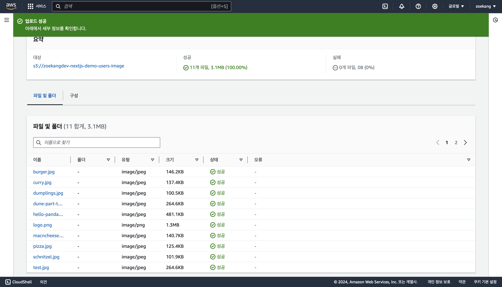

#### 💎 4. 이미지를 제공할 버킷 환경 설정

- 기본 설정 : lock down. 그 안의 파일이 보호되고 다른 사람이 접근 불가능.
- 우리의 목적은 모든 사람이 이미지를 볼 수 있도록 하는 것이므로 permission(권한) 탭 &rarr; 공용 액세스 차단(block public access)을 편집 &rarr; 액세스 차단 체크박스 비활성화 &rarr; 저장
  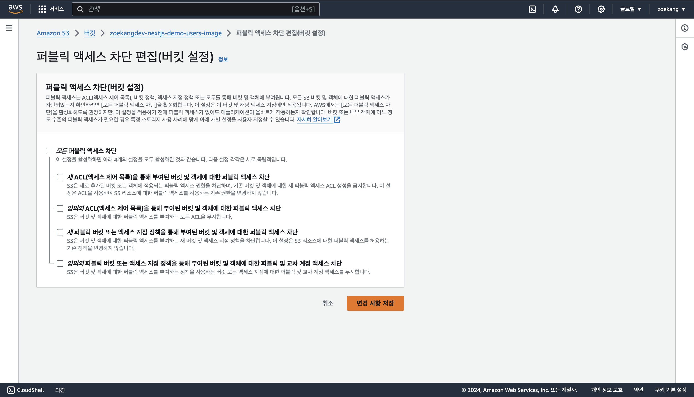
- 버킷 정책 작성
  ```json
  {
    "Version": "2012-10-17",
    "Statement": [
      {
        "Sid": "PublicRead",
        "Effect": "Allow",
        "Principal": "*",
        "Action": ["s3:GetObject", "s3:GetObjectVersion"],
        "Resource": ["arn:aws:s3:::zoekangdev-nextjs-demo-users-image/*"]
      }
    ]
  }
  ```
- 해당 버킷에는 공개적으로 공유하고 싶지 않은 파일은 추가해선 안된다.

#### 💎 5. S3 이미지를 사용하기 위한 NextJS 코드 업데이트

- public/images 폴더 삭제하여 public/ 만 남도록 한다.
- .next 폴더 삭제
- initdb.js 파일 업데이트하여 데이터베이스 편집 : `image: '/images/burger.jpg'` &rarr; `image: 'burger.jpg`
- components/meals/meal-item.js 편집
  ```js
  <Image
    src={`https://zoekangdev-nextjs-demo-users-image.s3.ap-northeast-2.amazonaws.com/${image}`}
    alt={title}
    fill
  />
  ```
- app/meals/[mealSlug]/page.js 편집
  ```js
  <Image
    src={`https://zoekangdev-nextjs-demo-users-image.s3.ap-northeast-2.amazonaws.com/${meal.image}`}
    alt={meal.title}
    fill
  />
  ```
- 기존의 데이터베이스인 meals.db 삭제 &rarr; `node initdb.js` 실행하여 데이터베이스 업그레이드
- 다음과 같은 오류가 발생
  > Invalid src prop (https://zoekangdev-nextjs-demo-users-image.s3.ap-northeast-2.amazonaws.com/burger.jpg) on `next/image`, hostname "zoekangdev-nextjs-demo-users-image.s3.ap-northeast-2.amazonaws.com" is not configured under images in your `next.config.js` See more info: https://nextjs.org/docs/messages/next-image-unconfigured-host

#### 💎 6. 이미지 소스로 S3 허용

- 위의 오류는 NextJS가 기본적으로 `<Image>` 컴포넌트를 사용할 때 외부 URL을 허용하지 않기 때문에 발생하는 것이다.
- 오류를 해결하기 위해 URL을 명시적으로 허용해야한다.
- next.config.js 편집
  ```js
  const nextConfig = {
    images: {
      remotePatterns: [
        {
          protocol: "https",
          hostname:
            "zoekangdev-nextjs-demo-users-image.s3.ap-northeast-2.amazonaws.com",
          port: "",
          pathname: "/**",
        },
      ],
    },
  };
  ```
- `remotePatternsconfig`을 통해 특정 S3 URL을 이미지의 유효한 소스로 사용 가능하게 되었다.
  

#### 💎 7. 업로드된 이미지를 S3에 저장

- 유저가 생성한 이미지 데이터를 S3에 포워딩(forward). 이는 AWS에서 제공하는 패키지인 '@aws-sdk/client-s3'를 통해 가능하다.
- 설치 : `npm install @aws-sdk/client-s3`
- lib/meals.js 편집
  ```js
  // 가장 상단에 추가
  import { S3 } from "@aws-sdk/client-s3";
  const s3 = new S3({
    region: "ap-northeast-2",
  });
  ```
- `saveMeal()` 편집

  ```js
  export async function saveMeal(meal) {
    meal.slug = slugify(meal.title, { lower: true });
    meal.instructions = xss(meal.instructions); // instructions 검열

    const extension = meal.image.name.split(".").pop(); // 마지막 요소. 즉 확장자 받음
    const fileName = `${meal.slug}.${extension}`;

    const bufferedImage = await meal.image.arrayBuffer(); // arrayBuffer함수가 프로미스를 반환 -> 버퍼로 변환됨.. 따라서 await 키워드 사용

    s3.putObject({
      Bucket: "zoekangdev-nextjs-demo-users-image",
      Key: fileName,
      Body: Buffer.from(bufferedImage),
      ContentType: meal.image.type,
    });

    meal.image = fileName; // 모든 이미지에 관한 요청은 자동적으로 public 폴더로 보내짐

    // 데이터베이스에 저장하기
    db.prepare(
      `
    INSERT INTO meals
     (title, summary, instructions, creator, creator_email, image, slug)
     VALUES (
       @title,
       @summary,
       @instructions,
       @creator,
       @creator_email,
       @image,
       @slug
     )
  `
    ).run(meal);
  }
  ```

#### 💎 8. NextJS 백엔드 AWS 접근 권한 부여

- 버킷의 내용을 모두에게 제공하도록 S3를 설정했으나 모든 사람이 버킷에 작성하거나 버킷 내용을 변경할 수 있도록 설정하지 않았고, 또 설정해서도 안된다. 그러나 현재 앱은 이것을 하려고 한다..
- 앱에 권한을 부여하려면 앱에 대한 AWS 접근 키를 설정해야한다.
- 루트 NextJS 프로젝트에 .env.local 파일을 추가 &rarr; NextJS에 의해 자동으로 읽히고 거기에 설정된 환경 변수를 앱의 백엔드 부분에서 사용할 수 있게 된다. [참고](https://nextjs.org/docs/app/building-your-application/configuring/environment-variables)
- .env.local 파일에 두 개의 키-값 쌍을 추가.
  ```
  AWS_ACCESS_KEY_ID=<your aws access key>
  AWS_SECRET_ACCESS_KEY=<your aws secret access key>
  ```
  - 해당 접근 코드는 AWS 콘솔 내부에서 얻을 수 있다. 계정 이름 클릭 후 '보안 자격 증명' 클릭
  - 접근 키 부분으로 스크롤하여 새로운 접근 키 생성. 해당 내용은 공유하면 안된다.


