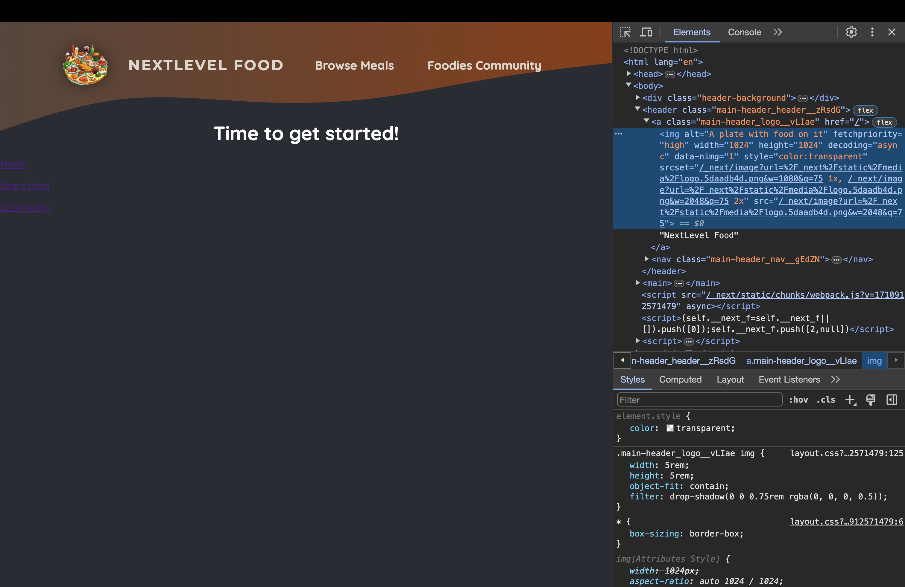
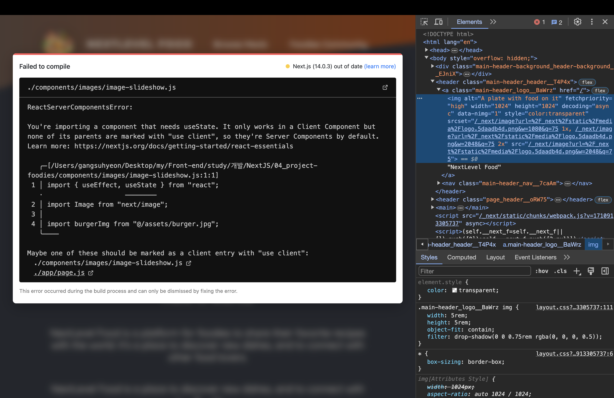
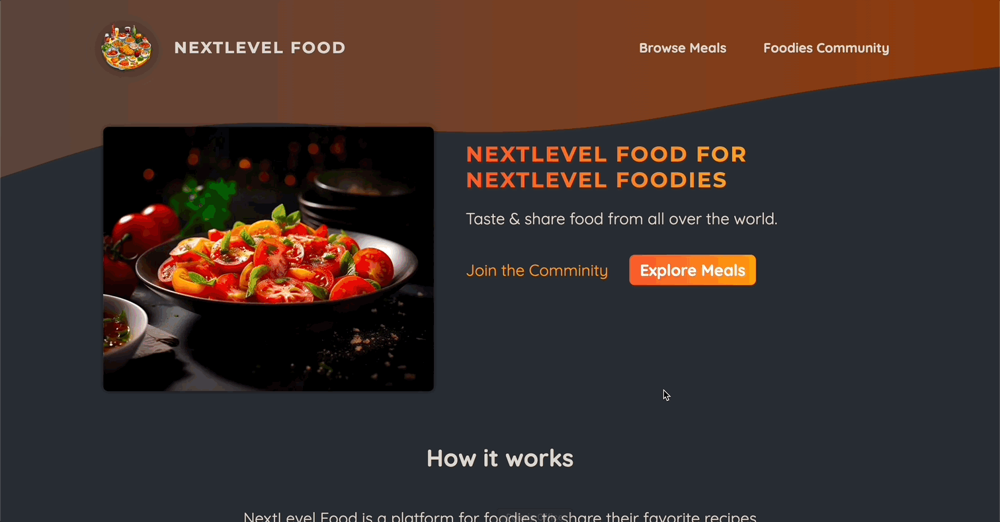
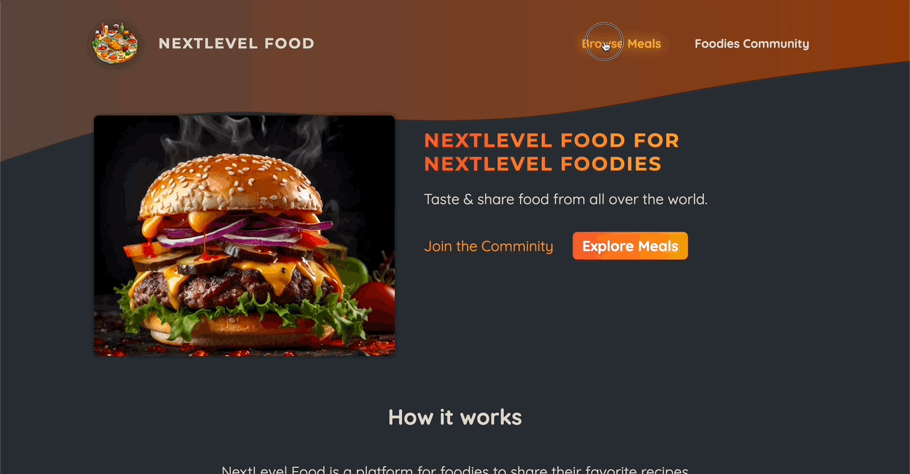
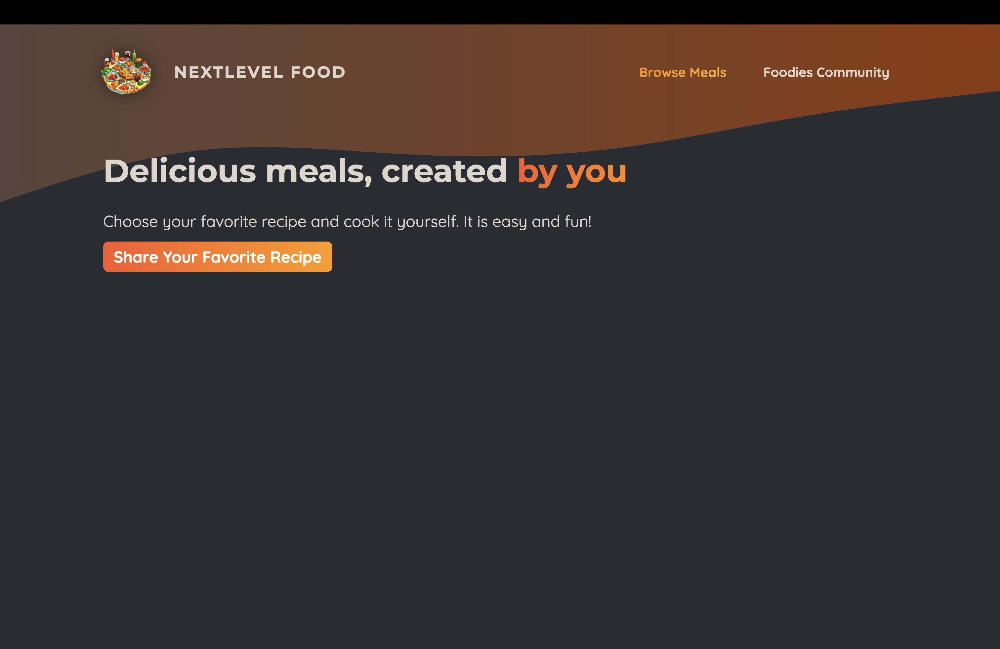

# 프로젝트 : Foodies 앱

[📌 연습문제](#-연습문제)<br>
[📌 어플리케이션 구현하기](#-어플리케이션-구현하기)<br>
<br>

## 📌 연습문제

- 신규 라우트 3개 만들기 : '/meals', '/meals/share', '/community'

```js
// app/meals/page.js
export default function MealsPage() {
  return <h1>Meals Page</h1>;
}

// app/meals/share/page.js
export default function ShareMealPage() {
  return <h1>Share Page</h1>;
}

// app/community/page.js
export default function CommunityPage() {
  return <h1>Community</h1>;
}

// app/meals/[mealSlug]/page.js
export default function MealDetailPage({ params }) {
  return <h1>Meal Details {params.mealSlug}</h1>;
}
```

<br>

## 📌 어플리케이션 구현하기

### 📖 레이아웃 개념 다시보기

```js
// app/meals/layout.js
export default function MealsLayout({ children }) {
  return (
    <>
      <p>Meals Layout</p>
      {children}
    </>
  );
}
```

- children을 통해 중첩 레이아웃 또는 페이지에 접근할 수 있다.
- 이 말인 즉, 중첩 레이아웃이 있어도 root 레이아웃의 children 속성을 받아들여 감싸진 내용을 출력한다.
- 감싸진 내용에는 페이지와 기타 레이아웃(중첩 레이아웃)을 포함한다.


<br>

### 📖 레이아웃에 커스텀 컴포넌트 추가

```js
import Link from "next/link";
import Image from "next/image";
import logoImg from "@/assets/logo.png";
import styles from "./main-header.module.css";

export default function MainHeader() {
  return (
    <header className={styles.header}>
      <Link href="/" className={styles.logo}>
        <Image src={logoImg} alt="A plate with food on it" priority />
        NextLevel Food
      </Link>

      <nav className={styles.nav}>
        <ul>
          <li>
            <Link href="/meals">Browse Meals</Link>
          </li>
          <li>
            <Link href="/community">Foodies Community</Link>
          </li>
        </ul>
      </nav>
    </header>
  );
}
```

- `<Image>` : 더 최적화된 방법으로 이미지를 출력.
  - 페이지에서 실제로 보이는 경우에만 이미지가 표시되도록 이미지를 지연 로딩하여 구현.
  - 대응적인 이미지를 설정하는 프로세스 등을 단순화한다.
  - Next.js에 의해 생성된 `logoImg` 객체는 이미지를 임포트할 떄 최적화된 방법으로 image 컴포넌트를 띄울수 있도록 하는 유용한 정보를 포함하므로 `src={logoImg.src}`가 아니라 `src={logoImg}`로 작성했다.
  - `priority` 속성을 추가하여 이미지가 깜빡임 없이 우선적으로 로딩되도록 함.
  - 🔗 [NextJS | `<Image>`](https://nextjs.org/docs/app/api-reference/components/image)



<br>

### 📖 기타 커스텀 컴포넌트 사용

```js
// components/main-header/main-header-background.js
import styles from "./main-header-background.module.css";

export default function MainHeaderBackground() {
  return (
    <div className={styles["header-background"]}>
      <svg xmlns="http://www.w3.org/2000/svg" viewBox="0 0 1440 320">
        <defs>
          <linearGradient id="gradient" x1="0%" y1="0%" x2="100%" y2="0%">
            <stop
              offset="0%"
              style={{ stopColor: "#59453c", stopOpacity: "1" }}
            />
            <stop
              offset="100%"
              style={{ stopColor: "#8f3a09", stopOpacity: "1" }}
            />
          </linearGradient>
        </defs>
        <path
          fill="url(#gradient)"
          d="M0,256L48,240C96,224,192,192,288,181.3C384,171,480,181,576,186.7C672,192,768,192,864,181.3C960,171,1056,149,1152,133.3C1248,117,1344,107,1392,101.3L1440,96L1440,0L1392,0C1344,0,1248,0,1152,0C1056,0,960,0,864,0C768,0,672,0,576,0C480,0,384,0,288,0C192,0,96,0,48,0L0,0Z"
        ></path>
      </svg>
    </div>
  );
}

// components/main-header/main-header.js
import Link from "next/link";
import Image from "next/image";
import logoImg from "@/assets/logo.png";
import styles from "./main-header.module.css";
import MainHeaderBackground from "./main-header-background";

export default function MainHeader() {
  return (
    <>
      <MainHeaderBackground />
      <header className={styles.header}>
        <Link href="/" className={styles.logo}>
          <Image src={logoImg} alt="A plate with food on it" priority />
          NextLevel Food
        </Link>

        <nav className={styles.nav}>
          <ul>
            <li>
              <Link href="/meals">Browse Meals</Link>
            </li>
            <li>
              <Link href="/community">Foodies Community</Link>
            </li>
          </ul>
        </nav>
      </header>
    </>
  );
}
```

<br>

### 📖 시작 페이지 내용 채우기

```js
// app/page.js
import Link from "next/link";
import styles from "./page.module.css";
import ImageSlideshow from "@/components/images/image-slideshow";

export default function Home() {
  return (
    <>
      <header className={styles.header}>
        {/* 이미지 슬라이드쇼 */}
        <div className={styles.slideshow}>
          <ImageSlideshow />
        </div>
        <div>
          <div className={styles.hero}>
            <h1>NextLevel Food for NextLevel Foodies</h1>
            <p>Taste & share food from all over the world.</p>
          </div>
          <div className={styles.cta}>
            <Link href="/community">Join the Comminity</Link>
            <Link href="/meals">Explore Meals</Link>
          </div>
        </div>
      </header>
      <main>
        <section className={styles.section}>
          <h2>How it works</h2>
          <p>
            NextLevel Food is a platform for foodies to share their favorite
            recipes with the world. It&apos;s a place to discover new dishes,
            and to connect with other food lovers.
          </p>
          <p>
            NextLevel Food is a place to discover new dishes, and to connect
            with other food lovers.
          </p>
        </section>

        <section className={styles.section}>
          <h2>Why NextLevel Food?</h2>
          <p>
            NextLevel Food is a platform for foodies to share their favorite
            recipes with the world. It&apos;s a place to discover new dishes,
            and to connect with other food lovers.
          </p>
          <p>
            NextLevel Food is a place to discover new dishes, and to connect
            with other food lovers.
          </p>
        </section>
      </main>
    </>
  );
}


// components/images/image-slideshow.js
import { useEffect, useState } from "react";
import Image from "next/image";

import burgerImg from "@/assets/burger.jpg";
import curryImg from "@/assets/curry.jpg";
import dumplingsImg from "@/assets/dumplings.jpg";
import macncheeseImg from "@/assets/macncheese.jpg";
import pizzaImg from "@/assets/pizza.jpg";
import schnitzelImg from "@/assets/schnitzel.jpg";
import tomatoSaladImg from "@/assets/tomato-salad.jpg";
import classes from "./image-slideshow.module.css";

const images = [
  { image: burgerImg, alt: "A delicious, juicy burger" },
  { image: curryImg, alt: "A delicious, spicy curry" },
  { image: dumplingsImg, alt: "Steamed dumplings" },
  { image: macncheeseImg, alt: "Mac and cheese" },
  { image: pizzaImg, alt: "A delicious pizza" },
  { image: schnitzelImg, alt: "A delicious schnitzel" },
  { image: tomatoSaladImg, alt: "A delicious tomato salad" },
];

export default function ImageSlideshow() {
  const [currentImageIndex, setCurrentImageIndex] = useState(0);

  useEffect(() => {
    //   이미지 인덱스를 5초마다 변경하고 슬라이드쇼처럼 보이기 위함.
    const interval = setInterval(() => {
      setCurrentImageIndex((prevIndex) =>
        prevIndex < images.length - 1 ? prevIndex + 1 : 0
      );
    }, 5000);

    return () => clearInterval(interval);
  }, []);

  return (
    <div className={classes.slideshow}>
      {images.map((image, index) => (
        <Image
          key={index}
          src={image.image}
          className={index === currentImageIndex ? classes.active : ""}
          alt={image.alt}
        />
      ))}
    </div>
  );
}
```

- `useState`를 필요로하는 컴포넌트를 가지고 있으며 이는 클라이언트 컴포넌트에서만 작동한다는 오류가 발생.
  

<br>

#### 💎 리액트 서버 컴포넌트 vs. 클라이언트 컴포넌트

- Next.js 뿐만 아니라 리액트 또한 대부분의 리액트 앱에서 자체적으로 구분이 있다.
  > 리액트는 기본적으로 클라이언트 컴포넌트를 사용하고 있다. 리액트는 순수한 클라이언트 사이드 라이브러리로 브라우저에서 클라이언트 측에서 코드를 실행한다.
- Next.js에서는 풀스택 프레임워크이므로 이러한 특성이 변경된다. 따라서 코드가 백엔드에서도 실행된다.
  > 기본적으로 Next.js 프로젝트에서 가지고 있는 리액트 컴포넌트들은 그것들이 페이지인지, 레이아웃인지, 기본 컴포넌트인지에 상관없이 오직 서버에서만 렌더링된다. 이것이 리액트 서버 컴포넌트라고 불리는 이유이다.

<br><br>

1. 리액트 서버 컴포넌트 (RSC)

   - 기본적으로 모든 리액트 컴포넌트는 서버에서만 렌더링 된다.
   - 그래서 컴포넌트에 `console.log`를 사용하면 브라우저의 콘솔에는 뜨지 않고 서버(백엔드)의 콘솔에 표시되는 것이다.
   - The backend executes the server component functions and hence derives the to-be-rendered HTML code.
   - The client-side receives and renders the to-be-rendered HTML code
     > 서버 컴포넌트를 사용하면 다운로드해야 하는 클라이언트 측의 자바스크립트 코드가 줄어들 수 있어 웹 사이트의 성능을 향상시킬 수 있다. 그리고 이것은 검색 엔진 최적화에도 좋다.
   - 웹 검색 크롤러들은 완성 콘텐츠를 포함하는 페이지를 볼 수 있기 때문이다.

2. 클라이언트 컴포넌트
   - 페이지의 소스 코드를 보면 본질적으로 비어있는 것을 볼 수 있다. 왜냐하면 모든 내용은 클라이언트 측 코드와 클라이언트 측 컴포넌트의 도움으로, 클라이언트 측에서 생성되고 채워지기 때문이다.
   - Next.js에서 클라이언트 컴포넌트를 만들 수 있다. 그러한 컴포넌트들은 서버에서 사전 렌더링 되는 것들이고 잠재적으로는 클라이언트에 렌더링될 수 있다.
   - 만약 Next.js에서 클라이언트 컴포넌트를 만들고자 한다면 컴포넌트를 잡고있는 파일 위에 특별한 지시어(use Client)를 사용해야한다.

```js
// components/images/image-slideshow.js
"use client"; // useState, useEffect와 같은 리액트 훅과 이벤트 트리거를 사용하기 위함

import { useEffect, useState } from "react";
import Image from "next/image";

import burgerImg from "@/assets/burger.jpg";
import curryImg from "@/assets/curry.jpg";
import dumplingsImg from "@/assets/dumplings.jpg";
import macncheeseImg from "@/assets/macncheese.jpg";
import pizzaImg from "@/assets/pizza.jpg";
import schnitzelImg from "@/assets/schnitzel.jpg";
import tomatoSaladImg from "@/assets/tomato-salad.jpg";
import classes from "./image-slideshow.module.css";

const images = [
  { image: burgerImg, alt: "A delicious, juicy burger" },
  { image: curryImg, alt: "A delicious, spicy curry" },
  { image: dumplingsImg, alt: "Steamed dumplings" },
  { image: macncheeseImg, alt: "Mac and cheese" },
  { image: pizzaImg, alt: "A delicious pizza" },
  { image: schnitzelImg, alt: "A delicious schnitzel" },
  { image: tomatoSaladImg, alt: "A delicious tomato salad" },
];

export default function ImageSlideshow() {
  const [currentImageIndex, setCurrentImageIndex] = useState(0);

  useEffect(() => {
    //   이미지 인덱스를 5초마다 변경하고 슬라이드쇼처럼 보이기 위함.
    const interval = setInterval(() => {
      setCurrentImageIndex((prevIndex) =>
        prevIndex < images.length - 1 ? prevIndex + 1 : 0
      );
    }, 5000);

    return () => clearInterval(interval);
  }, []);

  return (
    <div className={classes.slideshow}>
      {images.map((image, index) => (
        <Image
          key={index}
          src={image.image}
          className={index === currentImageIndex ? classes.active : ""}
          alt={image.alt}
        />
      ))}
    </div>
  );
}
```



<br>

### 📖 클라이언트 컴포넌트의 효율적 사용

- 필요한 컴포넌트만 클라이언트 컴포넌트로 변환하여 대부분의 컴포넌트가 서버 컴포넌트로 유지되고 대부분의 컴포넌트에서 서버 컴포넌트의 이점을 잃지 않도록 하려면 컴포넌트 트리를 가능한 아래로 내려가서 `use client`를 추가하는 것이 좋다.

```js
// components/main-header/nav-link.js
"use client";

import Link from "next/link";
import { usePathname } from "next/navigation";
import styles from "./nav-link.module.css";

export default function NavLink({ href, children }) {
  const path = usePathname();

  return (
    <Link
      href={href}
      className={
        path.startsWith(href) ? `${styles.link} ${styles.active}` : styles.link
      }
    >
      {children}
    </Link>
  );
}
```



<br>

### 📖 Meals 페이지

```js
// app/meals/page.js
import Link from "next/link";
import styles from "./page.module.css";
import MealsGrid from "@/components/meals/meals-grid";

export default function MealsPage() {
  return (
    <>
      <header className={styles.header}>
        <h1>
          Delicious meals, created
          <span className={styles.highlight}> by you</span>
        </h1>
        <p>
          Choose your favorite recipe and cook it yourself. It is easy and fun!
        </p>
        <p className={styles.cta}>
          <Link href="/meals/share">Share Your Favorite Recipe</Link>
        </p>
      </header>
      <main className={styles.main}>
        <MealsGrid meals={[]} />
      </main>
    </>
  );
}


// components/meals/meals-grid.js
import MealItem from "./meal-item";
import styles from "./meals-grid.module.css";

export default function MealsGrid({ meals }) {
  return (
    <ul className={styles.meals}>
      {meals.map((meal) => (
        <li key={meal.id}>
          <MealItem {...meals} />
        </li>
      ))}
    </ul>
  );
}


// components/meals/meal-item.js
import Link from "next/link";
import Image from "next/image";

import classes from "./meal-item.module.css";

export default function MealItem({ title, slug, image, summary, creator }) {
  return (
    <article className={classes.meal}>
      <header>
        <div className={classes.image}>
          {/* fill : Next.js에게 가능한 공간을 부모 컴포넌트에 의해 정의된 이미지들로 채워야 함을 알려준다. */}
          <Image src={image} alt={title} fill />
        </div>
        <div className={classes.headerText}>
          <h2>{title}</h2>
          <p>by {creator}</p>
        </div>
      </header>
      <div className={classes.content}>
        <p className={classes.summary}>{summary}</p>
        <div className={classes.actions}>
          <Link href={`/meals/${slug}`}>View Details</Link>
        </div>
      </div>
    </article>
  );
}
```

- [Next.js | `<Image fill>`](https://nextjs.org/docs/app/api-reference/components/image#fill)



<br>

### 📖 SQLite 데이터베이스 설정

- 설치 : `npm install better-sqlite3`
- initdb.js 작성

```js
const sql = require("better-sqlite3");
const db = sql("meals.db");

const dummyMeals = [
  {
    title: "Juicy Cheese Burger",
    slug: "juicy-cheese-burger",
    image: "/images/burger.jpg",
    summary:
      "A mouth-watering burger with a juicy beef patty and melted cheese, served in a soft bun.",
    instructions: `
      1. Prepare the patty:
         Mix 200g of ground beef with salt and pepper. Form into a patty.

      2. Cook the patty:
         Heat a pan with a bit of oil. Cook the patty for 2-3 minutes each side, until browned.

      3. Assemble the burger:
         Toast the burger bun halves. Place lettuce and tomato on the bottom half. Add the cooked patty and top with a slice of cheese.

      4. Serve:
         Complete the assembly with the top bun and serve hot.
    `,
    creator: "John Doe",
    creator_email: "johndoe@example.com",
  },
  {
    title: "Spicy Curry",
    slug: "spicy-curry",
    image: "/images/curry.jpg",
    summary:
      "A rich and spicy curry, infused with exotic spices and creamy coconut milk.",
    instructions: `
      1. Chop vegetables:
         Cut your choice of vegetables into bite-sized pieces.

      2. Sauté vegetables:
         In a pan with oil, sauté the vegetables until they start to soften.

      3. Add curry paste:
         Stir in 2 tablespoons of curry paste and cook for another minute.

      4. Simmer with coconut milk:
         Pour in 500ml of coconut milk and bring to a simmer. Let it cook for about 15 minutes.

      5. Serve:
         Enjoy this creamy curry with rice or bread.
    `,
    creator: "Max Schwarz",
    creator_email: "max@example.com",
  },
  {
    title: "Homemade Dumplings",
    slug: "homemade-dumplings",
    image: "/images/dumplings.jpg",
    summary:
      "Tender dumplings filled with savory meat and vegetables, steamed to perfection.",
    instructions: `
      1. Prepare the filling:
         Mix minced meat, shredded vegetables, and spices.

      2. Fill the dumplings:
         Place a spoonful of filling in the center of each dumpling wrapper. Wet the edges and fold to seal.

      3. Steam the dumplings:
         Arrange dumplings in a steamer. Steam for about 10 minutes.

      4. Serve:
         Enjoy these dumplings hot, with a dipping sauce of your choice.
    `,
    creator: "Emily Chen",
    creator_email: "emilychen@example.com",
  },
  {
    title: "Classic Mac n Cheese",
    slug: "classic-mac-n-cheese",
    image: "/images/macncheese.jpg",
    summary:
      "Creamy and cheesy macaroni, a comforting classic that's always a crowd-pleaser.",
    instructions: `
      1. Cook the macaroni:
         Boil macaroni according to package instructions until al dente.

      2. Prepare cheese sauce:
         In a saucepan, melt butter, add flour, and gradually whisk in milk until thickened. Stir in grated cheese until melted.

      3. Combine:
         Mix the cheese sauce with the drained macaroni.

      4. Bake:
         Transfer to a baking dish, top with breadcrumbs, and bake until golden.

      5. Serve:
         Serve hot, garnished with parsley if desired.
    `,
    creator: "Laura Smith",
    creator_email: "laurasmith@example.com",
  },
  {
    title: "Authentic Pizza",
    slug: "authentic-pizza",
    image: "/images/pizza.jpg",
    summary:
      "Hand-tossed pizza with a tangy tomato sauce, fresh toppings, and melted cheese.",
    instructions: `
      1. Prepare the dough:
         Knead pizza dough and let it rise until doubled in size.

      2. Shape and add toppings:
         Roll out the dough, spread tomato sauce, and add your favorite toppings and cheese.

      3. Bake the pizza:
         Bake in a preheated oven at 220°C for about 15-20 minutes.

      4. Serve:
         Slice hot and enjoy with a sprinkle of basil leaves.
    `,
    creator: "Mario Rossi",
    creator_email: "mariorossi@example.com",
  },
  {
    title: "Wiener Schnitzel",
    slug: "wiener-schnitzel",
    image: "/images/schnitzel.jpg",
    summary:
      "Crispy, golden-brown breaded veal cutlet, a classic Austrian dish.",
    instructions: `
      1. Prepare the veal:
         Pound veal cutlets to an even thickness.

      2. Bread the veal:
         Coat each cutlet in flour, dip in beaten eggs, and then in breadcrumbs.

      3. Fry the schnitzel:
      Heat oil in a pan and fry each schnitzel until golden brown on both sides.

      4. Serve:
      Serve hot with a slice of lemon and a side of potato salad or greens.
 `,
    creator: "Franz Huber",
    creator_email: "franzhuber@example.com",
  },
  {
    title: "Fresh Tomato Salad",
    slug: "fresh-tomato-salad",
    image: "/images/tomato-salad.jpg",
    summary:
      "A light and refreshing salad with ripe tomatoes, fresh basil, and a tangy vinaigrette.",
    instructions: `
      1. Prepare the tomatoes:
        Slice fresh tomatoes and arrange them on a plate.
    
      2. Add herbs and seasoning:
         Sprinkle chopped basil, salt, and pepper over the tomatoes.
    
      3. Dress the salad:
         Drizzle with olive oil and balsamic vinegar.
    
      4. Serve:
         Enjoy this simple, flavorful salad as a side dish or light meal.
    `,
    creator: "Sophia Green",
    creator_email: "sophiagreen@example.com",
  },
];

// 테이블 생성
db.prepare(
  `
   CREATE TABLE IF NOT EXISTS meals (
       id INTEGER PRIMARY KEY AUTOINCREMENT,
       slug TEXT NOT NULL UNIQUE,
       title TEXT NOT NULL,
       image TEXT NOT NULL,
       summary TEXT NOT NULL,
       instructions TEXT NOT NULL,
       creator TEXT NOT NULL,
       creator_email TEXT NOT NULL
    )
`
).run();

// 데이터베이스에 여러 데이터를 입력하기 위함
async function initData() {
  const stmt = db.prepare(`
      INSERT INTO meals VALUES (
         null,
         @slug,
         @title,
         @image,
         @summary,
         @instructions,
         @creator,
         @creator_email
      )
   `);

  for (const meal of dummyMeals) {
    stmt.run(meal);
  }
}

initData();
```

- initdb.js 실행 : `node initdb.js` &rarr; meals.db 생성됨

<br>

### 📖 DB에서 데이터 불러오기
