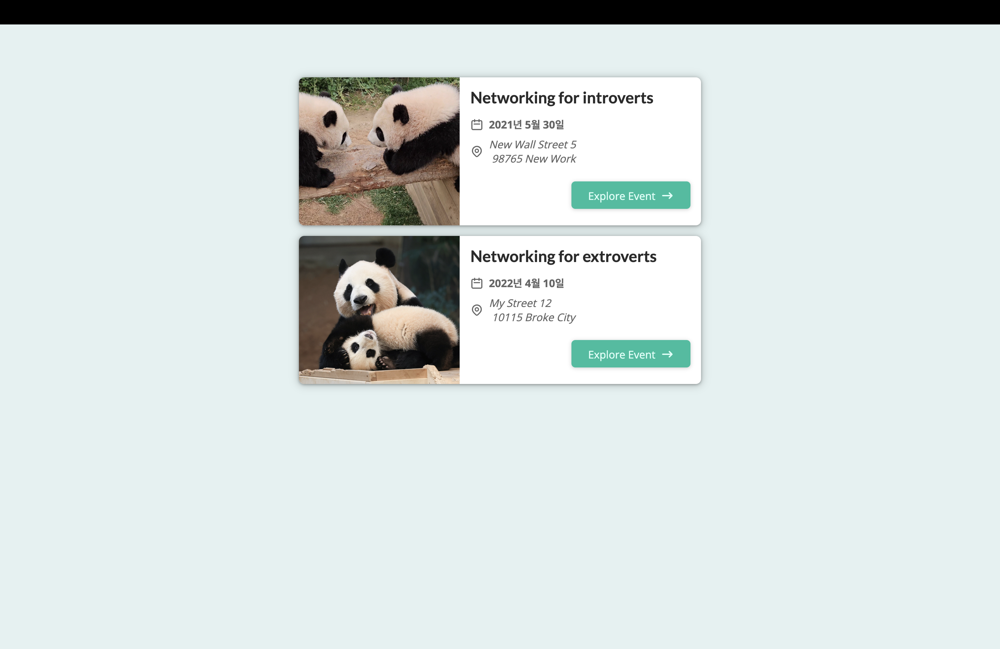
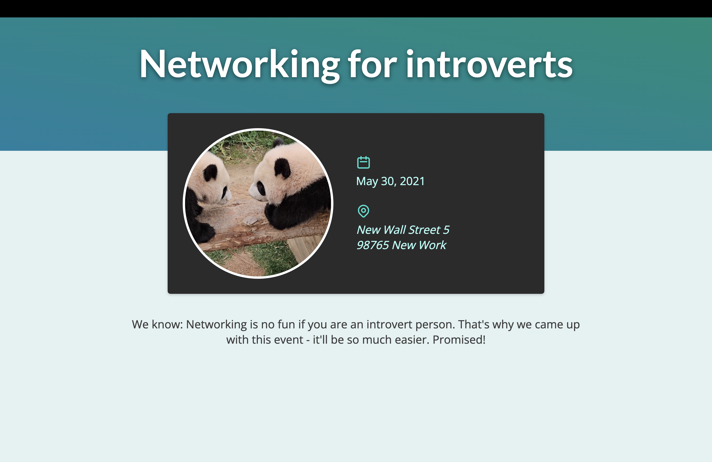
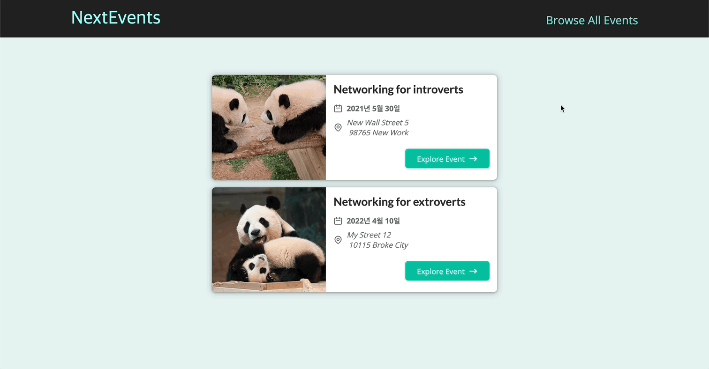

# 프로젝트 : 파일 기반 라우팅 앱

[📌 프로젝트 계획](#-프로젝트-계획)<br>
[📌 프로젝트 구현](#-프로젝트-구현)<br>
[📌 프로젝트 구현 - Event Detail (동적 라우트)](#-프로젝트-구현---event-detail-동적-라우트)<br>
[📌 일반적인 레이아웃 래퍼 컴포넌트 추가하기](#-일반적인-레이아웃-래퍼-컴포넌트-추가하기)<br>
[📌 All Events 페이지 작업하기](#-all-events-페이지-작업하기)<br>
[📌 Filtered Events 페이지 작업하기 ](#-filtered-events-페이지-작업하기)<br>
<br>

## 📌 프로젝트 계획

- '/' : 주요 이벤트 목록
- '/events' : 모든 이벤트가 표시.
- '/events/[id]' : 이벤트 디테일 페이지
- '/events/[...eventSlug]' : 필터링한 이벤트 페이지 &rarr; 조건에 부합하는 모든 이벤트가 페이지에 나타나게끔 한다.

<br>

## 📌 프로젝트 구현

### 📖 메인 페이지 설정하기

- 프로젝트 계획에 맞게 기본적인 라우트 설정을 진행하였다.
- 현재는 더미 출력값을 사용하고 있음을 참고!

```js
// pages/index.js
export default function HomePage() {
  return (
    <div>
      <h1>The Home Page</h1>
    </div>
  );
}

// pages/events/index.js
export default function EventsPage() {
  return (
    <div>
      <h1>The Events Page</h1>
    </div>
  );
}

// pages/events/[id].js
import { useRouter } from "next/router";
export default function EventDetailPage() {
  const router = useRouter();
  return (
    <div>
      <h1>The Event Detail Page - {router.query.id}</h1>
    </div>
  );
}

// pages/events/[...eventSlug].js
import { useRouter } from "next/router";
export default function FilteredEventsPage() {
  const router = useRouter();
  console.log(router.query);
  return (
    <div>
      <h1>The Filtered Events Page - {router.query.eventSlug}</h1>
    </div>
  );
}
```

<br>

### 📖 더미 데이터 & 정적 파일 추가하기

- 프로젝트의 root에 dummy-data.js 생성
- public/images/ 에 정적 파일 추가

> 이미지는 반드시 public 폴더에 저장해야한다. public 폴더는 Next.js 프로젝트에서는 특수한 역할을 한다. 해당 폴더에 저장되어 있는 이미지나 글꼴 같은 데이터들은 Next.js에서 정적 데이터로 작용하기 때문에 CSS, HTML 코드에서 참조할 수 있다.
> <br>

> public에 이미지를 저장하면 Next.js에서는 그 폴더에 저장된 모든 콘텐츠를 어플리케이션의 일부로 간주하므로 정적인 콘텐츠로 활용이 가능하고 따라서 웹 사이트의 방문자들이 보일 공공 콘텐츠를 임베드(Embed)할 때 HTML 코드에서 훨씬 수월하게 작업할 수 있게 된다.(public 폴더 밖의 파일과 폴더는 Next.js에서 접근하지 못해 방문자의 브라우저에서 불러오지 못함.)

<br>

### 📖 일반적인 React 컴포넌트 추가하기

- pages 폴더에는 각 페이지에 쓰이는 컴포넌트만 있으므로 별도의 components 폴더를 생성해서 일반적인 React 컴포넌트를 추가하는 것이 좋다.

```js
// pages/index.js
import { getFeaturedEvents } from "../dummy-data.js";
import EventList from "../components/events/event-list.js";

export default function HomePage() {
  const featuredEvents = getFeaturedEvents();
  return (
    <div>
      <ul>
        <EventList items={featuredEvents} />
      </ul>
    </div>
  );
}


// components/events/event-list.js
import EventItem from "./event-item";
import styles from "./event-list.module.css";

export default function EventList({ items }) {
  return (
    <ul className={styles.list}>
      {items.map((item) => (
        <EventItem
          key={item.id}
          title={item.title}
          image={item.image}
          date={item.date}
          location={item.location}
          id={item.id}
        />
      ))}
    </ul>
  );
}


// components/events/event-item.js
import Link from "next/link";
import styles from "./event-item.module.css";

export default function EventItem({ title, image, date, location, id }) {
  const humanReadableDate = new Date(date).toLocaleDateString("ko-KR", {
    day: "numeric",
    month: "long",
    year: "numeric",
  });

  const formattedAddress = location.replace(",", "\n");
  const exploreLink = `/events/${id}`;

  return (
    <li key={id} className={styles.item}>
      
      <div className={styles.content}>
        <div className={styles.summary}>
          <h2>{title}</h2>
          <div className={styles.date}>
            <time>{humanReadableDate}</time>
          </div>
          <div className={styles.address}>
            <address>{formattedAddress}</address>
          </div>
        </div>
        <div className={styles.actions}>
          <Link href={exploreLink}>Explore Event</Link>
        </div>
      </div>
    </li>
  );
}
```

<br>

### 📖 버튼 & 아이콘 추가하기

#### 💎 버튼

```js
// components/ui/button.js
import Link from "next/link";
import styles from "./button.module.css";

export default function Button({ children, link }) {
  return (
    <Link href={link} className={styles.btn}>
      {children}
    </Link>
  );
}

// components/events/event-item.js
import Link from "next/link";
import styles from "./event-item.module.css";
import Button from "../ui/button";

export default function EventItem({ title, image, date, location, id }) {
  const humanReadableDate = new Date(date).toLocaleDateString("ko-KR", {
    day: "numeric",
    month: "long",
    year: "numeric",
  });

  const formattedAddress = location.replace(",", "\n");
  const exploreLink = `/events/${id}`;

  return (
    <li key={id} className={styles.item}>
      
      <div className={styles.content}>
        <div className={styles.summary}>
          <h2>{title}</h2>
          <div className={styles.date}>
            <time>{humanReadableDate}</time>
          </div>
          <div className={styles.address}>
            <address>{formattedAddress}</address>
          </div>
        </div>
        <div className={styles.actions}>
          <Button link={exploreLink}>Explore Event</Button>
        </div>
      </div>
    </li>
  );
}
```

<br>

#### 💎 아이콘

```js
// components/events/event-item.js
import styles from "./event-item.module.css";
import Button from "../ui/button.js";
import DateIcon from "../icons/date-icon.js";
import AddressIcon from "../icons/address-icon.js";
import ArrowRightIcon from "../icons/arrow-right-icon.js";

export default function EventItem({ title, image, date, location, id }) {
  const humanReadableDate = new Date(date).toLocaleDateString("ko-KR", {
    day: "numeric",
    month: "long",
    year: "numeric",
  });

  const formattedAddress = location.replace(",", "\n");
  const exploreLink = `/events/${id}`;

  return (
    <li key={id} className={styles.item}>
      
      <div className={styles.content}>
        <div className={styles.summary}>
          <h2>{title}</h2>
          <div className={styles.date}>
            <DateIcon />
            <time>{humanReadableDate}</time>
          </div>
          <div className={styles.address}>
            <AddressIcon />
            <address>{formattedAddress}</address>
          </div>
        </div>
        <div className={styles.actions}>
          <Button link={exploreLink}>
            <span>Explore Event</span>
            <span className={styles.icon}>
              <ArrowRightIcon />
            </span>
          </Button>
        </div>
      </div>
    </li>
  );
}
```



<br>

## 📌 프로젝트 구현 - Event Detail (동적 라우트)

### 📖 Event Detail 페이지 추가하기 (동적 라우트)

```js
// pages/events/[id].js
import { useRouter } from "next/router";
import { getEventById } from "../../dummy-data.js";
import EventSummary from "../../components/event-detail/event-summary.js";
import EventLogistics from "../../components/event-detail/event-logistics.js";
import EventContent from "../../components/event-detail/event-content.js";

export default function EventDetailPage() {
  const router = useRouter();
  const eventId = router.query.id;
  const event = getEventById(eventId);
  if (!event) {
    return <p>No Event Found!</p>;
  }

  return (
    <>
      <EventSummary title={event.title} />
      <EventLogistics
        date={event.date}
        address={event.location}
        image={event.image}
        imageAlt={event.title}
      />
      <EventContent>
        <p>{event.description}</p>
      </EventContent>
    </>
  );
}
```



<br>

## 📌 일반적인 레이아웃 래퍼 컴포넌트 추가하기

- \_app.js에 네비게이션 추가
- \_app.js가 루트 컴포넌트로서 여러 페이지 컴포넌트가 렌더링되는 곳이다.
- Next.js는 \_app 컴포넌트를 이용해서 개발자가 만든 페이지 콘텐츠를 전달하고 페이지를 이동할 때 콘텐츠를 표시해준다.

```js
// _app.js
import Layout from "../components/layout/layout";
import "../styles/globals.css";

function MyApp({ Component, pageProps }) {
  return (
    <Layout>
      <Component {...pageProps} />
    </Layout>
  );
}

export default MyApp;


// components/layout/layout.js
import MainHeader from "./main-header.js";

export default function Layout({ children }) {
  return (
    <>
      <MainHeader />
      <main>{children}</main>
    </>
  );
}


// components/layout/main-header.js
import Link from "next/link";
import styles from "./main-header.module.css";

export default function MainHeader() {
  return (
    <header className={styles.header}>
      <div className={styles.logo}>
        <Link href="/">NextEvents</Link>
      </div>
      <nav className={styles.navigation}>
        <ul>
          <li>
            <Link href="/events">Browse All Events</Link>
          </li>
        </ul>
      </nav>
    </header>
  );
}
```



<br>

## 📌 All Events 페이지 작업하기

```js
import { getAllEvents } from "../../dummy-data.js";
import EventList from "../../components/events/event-list.js";
export default function EventsPage() {
  const events = getAllEvents();
  return (
    <div>
      <EventList items={events} />
    </div>
  );
}
```

<br>

## 📌 Filtered Events 페이지 작업하기
