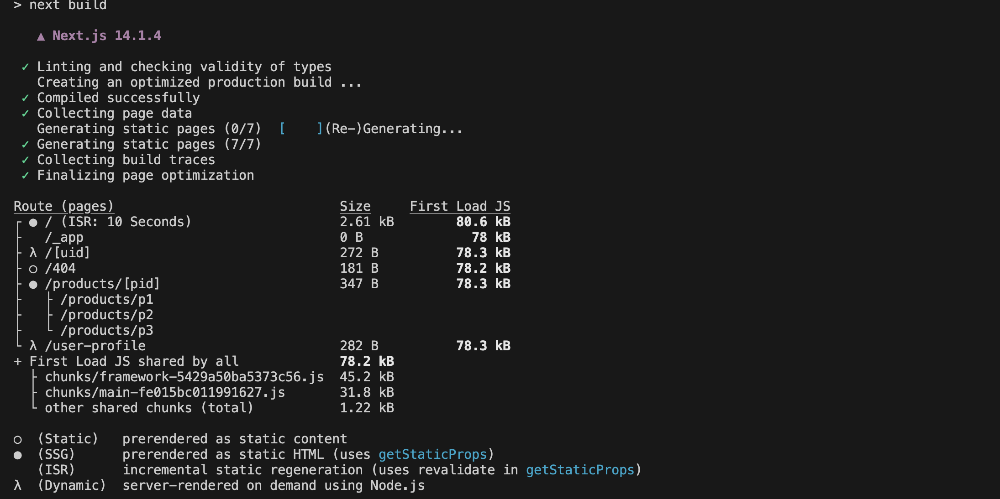

# 페이지 사전 렌더링 & 데이터 Fetching

[📌 기존 React 앱과 Next.js](#-기존-react-앱과-nextjs)<br>
[📌 Next.js의 사전 렌더링 양식 - 정적 생성(Static Generation)](#-nextjs의-사전-렌더링-양식---정적-생성static-generation)<br>
[📌 Next.js의 사전 렌더링 방식 - SSR](#-nextjs의-사전-렌더링-방식---ssr)<br>
<br>

## 📌 기존 React 앱과 Next.js

### 📖 기존 React 앱의 문제점

- 브라우저를 통해 페이지의 소스를 보면, 어디에서도 데이터를 찾아볼 수가 없다.
- 오직 리액트 어플리케이션이 렌더링되는 div만 보이게 된다.
- DOM은 자바스크립트와 리액트를 통한 렌더링이 끝나야지만 페이지에서 로딩이 된다.

> 따라서 브라우저가 처음 로딩하는 콘텐츠는 페이지 소스의 코드가 된다. &rarr; 어떤 데이터도 가지고 있지 않는다.<br>
> 백엔드 API를 이용해서 데이터를 fetching하는 실제 페이지에서는 데이터 로딩에 몇 초가 소요될 수 있어 지연이 발생한다.

- 검색엔진이 있는 앱의 경우, 콘텐츠를 구글이 알아야하는데 페이지 소스의 HTML 코드는 서버에서 클라이언트에게 데이터가 다시 전송되면서 검색 엔진은 페이지 소스의 데이터(콘텐츠가 전혀 없는 데이터)를 보게 된다.

**데이터를 fetching하는 일이 컴포넌트가 로딩된 후여야 한다. 즉 클라이언트 사이드에서 데이터를 fetching하고 화면에 렌더링된 후에 서버로 요청을 보낼 수 있다. &rarr; 사용자가 처음 페이지를 방문했을 때 서버가 클라이언트에게 재전송하는 페이지는 그 데이터를 포함하고 있지 않다는 점이 문제가 된다.**

<br>

### 📖 NextJS가 페이지를 준비하고 사전 렌더링하는 방식

- Next.js는 사전 렌더링이라는 개념을 이용해서 위의 문제를 해결을 돕는다.
- 어떠한 라우트에 요청이 전송된 경우(즉, 사용자가 해당 페이지를 방문하면) Next.js가 사전 렌더링된 페이지를 반환한다.
- 표준 리액트라면 빈 HTML 파일과 모든 자바스크립트 코드가 표시된다. 그리고 자바스크립트 코드가 실행되면 스크린에 내용이 표시된다. &rarr; 일반 DOM 구조 외에 필요한 데이터가 서버로부터 로딩될 때에는 시간이 소요될 수 있다.

> - 페이지를 다시 클라이언트로 전송된 뒤에만 데이터를 로딩하는 대신 Next.js는 페이지와 필요할 법한 모든 데이터가 있는 HTML 콘텐츠를 사전에 렌더링한다.
> - 사전에 HTML 페이지를 완성해 놓고 완전히 채워진 HTML 파일을 클라이언트(페이지의 방문자)에게 전송한다. (SEO 관점에서 좋다)

- Next.js는 사전 렌더링에 그치지 않고 포함된 자바스크립트 코드를 모두 재전송한다. 이러한 재전송을 해당 페이지에 대해 수화(hydrate)한다고 한다.
- 재전송된 자바스크립트 코드는 나중에 사전 렌더링된 페이지를 대체하고 이에 리액트가 알맞은 작업을 수행한다.

> Next.js는 페이지를 사전에 준비하는데 모든 HTML 콘텐츠를 사전에 구축하고 필요한 모든 데이터를 사전에 로딩하는 방식을 따른다. <br> **사전 렌더링은 오직 최초 로딩할 때만 영향을 미친다.** 따라서 페이지를 방문하면 로디오디는 첫번째 페이지가 사전 렌더링이 된 것이다.

- Next.js와 리액트로 구축된 페이지에서는 페이지의 수화(첫번째 렌더링이 끝나면)가 되면 다시 표준 싱글 페이지 어플리케이션으로 돌아간다. &rarr; 그때부터는 리액트가 프론트엔드에서 모든 처리를 수행한다.

<br>

#### 💎 Next.js의 두 가지 사전 렌더링 양식

1. 정적 생성(권장 양식) : 빌드 되는 동안 모든 페이지가 사전 생성된다. 따라서 프로덕션용 어플리케이션을 구축한다면 배포 전에 모든 페이지가 준비된다는 것이다.
2. 서버 사이드 렌더링(SSR) : 배포 후 요청이 서버까지 오는 바로 그떄 모든 페이지가 생성된다.

<br>

## 📌 Next.js의 사전 렌더링 양식 - 정적 생성(Static Generation)

- 일반적으로 권장되는 방식이다.
- 개념

  - 빌드하는 동안 페이지를 사전 생성한다. 사전 생성이라 함은 콘텐츠를 구성하는 모든 HTML 코드와 모든 데이터를 사전에 준비시켜 놓는다는 뜻이다.
  - 보통 서버 사이드에서만 실행되는 코드를 빌드 프로세스 동안 실행되도록 허용한다.
  - 빌드 시간 중 데이터와 페이지가 준비되는데 이때 빌드 시간은 배포 전 어플리케이션을 구축할 때를 말한다.
  - 빌드 시간 중 페이지가 사전에 구축되었기 때문에 배포되고 나면 구축된 페이지는 서버나 앱을 실행시키는 CDN을 통해서 캐시로 저장된다. &rarr; 이에 사전 구축된 페이지를 통해서 즉시 입력 요청이 실행될 수 있다.

```js
export async function getStaticProps(context){...}
```

- 페이지 컴포넌트의 내부에 있는 특수한 비동기 함수 `getStaticProps`를 사용하여 정적 생성을 한다.
- 이 함수는 보통 서버 사이드에서만 실행되는 모든 코드도 실행할 수가 있다.
- 즉 클라이언트 사이드 코드로만 제한되는 것이 아니라 특정 클라이언트 사이드 API에 액세스가 없거나 윈도우 객체에 대한 액세스가 없는 일반적으로는 서버 사이드에서 가능한 모든 코드도 실행 가능하다.
- `getStaticProps`안에 작성할 코드는 클라이언트에게 재전송되는 코드로 포함되지 않는다. 즉, 해당 함수 내에 포함하는 코드를 클라이언트는 볼 수 없다.

<br>

### 📖 Next.js는 기본적으로 사전 렌더링을 한다.

- 페이지 소스를 보면 표준 리액트 앱과는 다르게 index.js의 HTML 코드가 포함되어 있음을 볼 수 있다.
- 페이지 소스가 서버로부터 받는 실제 응답이라는 점을 기억하면, Next.js가 사전 렌더링을 기본적으로 하고 있음을 알 수 있다.

> Next.js는 동적 데이터가 없는 모든 페이지를 사전 렌더링한다.

- 이러한 사전 렌더링은 컴포넌트를 부호화하는 모든 콘텐츠를 검색 엔진이 인식하고 사용자가 웹 사이트르 처음부터 볼 수 있다는 점에서 좋다.

<br>

### 📖 페이지에 `getStaticProps` 추가하기

- `getStaticProps` 함수는 모든 페이지 파일에 추가할 수 있고 페이지에만 추가할 수 있으며 export가 되야한다.
- 그렇게 하면 Next.js가 페이지를 사전 생성할 때 사용자를 대신하여 `getStaticProps` 함수도 호출한다.
- `getStaticProps` 함수는 이 페이지가 사전 생성되어야 하는 페이지임을 Next.js에게 알려준다.
- Next.js는 기본적으로 모든 페이지를 사전 렌더링하지만 차후에 페이지를 사전 렌더링하지 않는 방식을 배움으로써 `getStaticProps`가 Mext.js에 사전 렌더링 하지 말라고 지시하지 않고 페이지를 여전히 사전 생성되도록 한다.

```js
// pages/index.js
export default function HomePage(props) {
  const { products } = props;

  return (
    <ul>
      {products.map((product) => (
        <li key={product.id}>{product.title}</li>
      ))}
    </ul>
  );
}

export async function getStaticProps() {
  return {
    props: {
      products: [{ id: "p1", title: "Product 1" }],
    },
  };
}
```

- `getStaticProps`는 props 키가 있는 객체를 항상 반환해야한다. 이 함수가 하는 일은 컴포넌트에 대한 프로퍼티를 준비하는 것이다.
- 만약 파일에 `getStaticProps` 함수가 있으면 Next.js에서 먼저 해당 함수를 실행(컴포넌트 함수에 대한 props를 준비)하고 두번째로 컴포넌트 함수를 실행한다.
- `getStaticProps` 함수에서는 원하는 코드를 제한 없이 실행가능하고 클라이언트 사이드에서는 절대 볼 수 없는 코드로 데이터를 페칭하고 HomePage 컴포넌트에 `props`를 통해 데이터를 줄 수 있다.

<br>

### 📖 서버 사이드 코드 실행하기 & Filesystem 사용하기

- Next.js는 `getStaticProps`나 기타 다른 특정 함수에서만 쓰이는 임포트를 확인하고 클라이언트 사이드 코드 번들에서는 해당 임포트를 제거한다.
- 따라서 클라이언트 사이드 코드, 즉 브라우저 측 리액트 앱 코드가 준비될 때 그 임포트는 사라진다. &rarr; Next.js가 클라이언트 사이드에서 사용되지 않음을 알고 코드는 나눈다.

```js
// pages/index.js
import fs from "fs/promises";
import path from "path";

export default function HomePage(props) {
  const { products } = props;

  return (
    <ul>
      {products.map((product) => (
        <li key={product.id}>{product.title}</li>
      ))}
    </ul>
  );
}

export async function getStaticProps() {
  const filePath = path.join(process.cwd(), "data", "dummy-backend.json"); // 해당 파일에 대한 절대 경로를 구축
  const jsonData = await fs.readFile(filePath);
  const data = JSON.parse(jsonData); // JS 객체로 변경
  return {
    props: {
      products: data.products,
    },
  };
}
```

- `process.cwd()` : 이 코드 파일의 현재 작업 디렉토리를 제공. 이때 현재 작업 디렉토리는 pages 폴더가 아니다.
  - 해당 파일이 실행될 때 Next.js가 함수를 실행하고 모든 파일이 루트 프로젝트 폴더에 있는 것처럼 취급한다.
  - 따라서 현재 작업 디렉토리는 pages 폴더가 아닌 전체 프로젝트 폴더가 된다.


<br>

### 📖 내부에서 일어나고 있는 일

- `npm run build`를 사용하는 build 스크립트는 Next.js 프로젝트를 배포할 때 실행하는 스크립트이다. build 스크립트의 `next build` 명령어가 페이지를 사전 생성한다.
- `npm run build` 명령의 출력을 포함하는 .next 폴더를 보면 server 폴더가 있다. 해당 폴더에서 사전 생성된 HTML 파일을 확인할 수 있다.
- `npm start`를 통해 프로덕션 준비 페이지를 미리 볼 수 있다.
- 페이지 소스에는 Next.js가 삽입한 스크립트 태그가 있고 필요한 데이터를 포함한다. 이는 사전 렌더링된 HTML 코드가 리액트 어플리케이션과 연결되는 수화(hydrate) 과정에 필요하다. 그리고 프리페칭한 데이터는 리액트 어플리케이션으로 전달되서 리액트 어플리케이션이 전달된 게 동적 데이터인지 어떤 종류의 데이터를 렌더링할 지 알 수 있다.

<br>

### 📖 증분 정적 생성(ISR) 활용하기

- `npm run build`를 통해서 사전 렌더링이 되는 것이기 때문에 반쪽짜리 사전 렌더링이라고 볼 수 있다.
- 페이지를 사전 생성하는 것은 꽤나 정적인 것을 구축하는 경우에는 좋은 방법이다.
- 그러나 만약 자주 바뀌는 데이터가 있는 경우, 페이지를 다시 빌드하고 다시 배포해야 한다.

#### 💎 솔루션 1

- 페이지를 사전 빌드하지만 서버에서 업데이트된 데이터 페칭을 위해 `useEffect`를 사용하는 리액트 컴포넌트에 표준 리액트 코드를 포함한다.
- 즉, 항상 사전 렌더링 된 데이터를 일부 포함해 페이지를 제공하지만 백그라운드에서 최신 데이터를 페칭해서, 그 데이터가 도착한 후에 로드된 페이지를 업데이트한다.

#### 💎 솔루션 2

- `getStaticProps`는 build 스크립트로 프로젝트를 빌드할 때 실행된다.
- Next.js는 증분 정적 생성(ISR, Incremental Static Generation)이라는 내장 기능이 있다.
- 페이지를 빌드할 때 정적으로 한 번만 생성하는 것이 아니라 배포 후에도 재배포 없이 계속 업데이트가 된다는 뜻이다.

  > 따라서 페이지를 사전 생성을 하긴 하지만 최대 X초 마다 들어오는 모든 요청에 대해 주어진 페이지를 Next.js가 재생성 하도록 할 수 있다.

- 페이지가 오래되어서 서버에서 다시 사전 생성되면 새로 생성된 페이지를 서버에 있던 오래된 기존 페이지를 대체하고 캐시되며 향후 방문자느 재생성된 페이지를 보게 된다.

```js
// pages/index.js
export async function getStaticProps() {
  console.log("(Re-)Generating...");
  const filePath = path.join(process.cwd(), "data", "dummy-backend.json"); // 해당 파일에 대한 절대 경로를 구축
  const jsonData = await fs.readFile(filePath);
  const data = JSON.parse(jsonData); // JS 객체로 변경
  return {
    props: {
      products: data.products,
    },
    revalidate: 10, // 이 페이지로 들어오는 모든 요청에 대해 마지막으로 재생성된 지 10초가 지나면 재생성되어야 한다로 Next.js에게 알림.
  };
}
```

> 들어오는 요청에 대해서 서버에서 사전 렌더링을 계속 수행할 수 있고 이를 수행하기 위해서는 `getStaticProps`에서 반환하는 객체에서 `props`를 반환할 뿐만 아니라 `revalidate`라고 하는 두번째 키도 추가하기만 하면 된다.

- `revalidate` : Next.js가 페이지를 재생성할 때까지 기다려하는 시간을 초 단위로 작성한다. 이 시간은 어플리케이션의 종류에 따라 달라질 수 있다.

<br>

### 📖 ISR: 내부에서 일어나는 일

`npm run build` 수행. ISR도 수행한다.


- Next.js는 `revalidate`가 10초로 설정되었다는 것을 인식하고 따라서 page/ 즉, 시작페이지, 인덱스 페이지가 10초마다 재생성되어야 한다는 것을 알고 있다.
- `npm run build` 후 `npm start`를 실행하여 로컬 컴퓨터에서 프로덕션 웹사이트를 볼 수 있다.
- `getStaticProps` 함수는 서버에서 다시 실행이 되는데, 브라우저에서도 아니고 빌드 프로세스 중에서도 아닌 `npm start`로 배포된 후의 서버에서 실행되는 것이다.

<br>

### 📖 `getStaticProps`와 구성 옵션 자세히 살펴보기

```js
// pages/index.js
export async function getStaticProps(context) {
  console.log("(Re-)Generating...");
  const filePath = path.join(process.cwd(), "data", "dummy-backend.json"); // 해당 파일에 대한 절대 경로를 구축
  const jsonData = await fs.readFile(filePath);
  const data = JSON.parse(jsonData); // JS 객체로 변경

  if (!data) {
    return {
      redirect: {
        destination: "/no-data",
      },
    };
  }

  if (data.products.length === 0) {
    return { notFound: true };
  }

  return {
    props: {
      products: data.products,
    },
    revalidate: 10,
  };
}
```

- `notFound` : 참 혹은 거짓의 불리언 값을 필요로 한다. 키를 true로 설정하면 페이지가 404 오류를 반환하며 일반 페이지 대신에 404 오류 페이지를 렌더링한다.
  - 데이터 fetching에 실패했을 때 404 페이지를 렌더링하는 일반적인 사용 사례(use case)이다.
- `redirect` : 페이지 콘텐츠가 컴포넌트 콘텐츠를 렌더링하지 않고 다른 페이지, 즉 다른 라우트로 리디렉션 한다.
  - 데이터 fetching에 실패할 경우 필요한 설정이다.

<br>

### 📖 동적 매개변수 작업하기

- NextJS에 의한 콘텍스트 매개변수를 사용하여 구체적인 매개변수 값을 구할 수 있다. 즉, 경로 상의 동적 세그먼트에 대한 구체적인 값을 알 수 있다.
- 컴포넌트 함수와 `getStaticProps`에서 매개변수를 추출할 때 차이점이 있다.
  - 컴포넌트 함수에서 매개변수를 추출하면 컴포넌트 내부에서 사용이 가능하다. 추출된 ID를 사용하거나 일부 백엔드 서버에 요청을 보내 거기에서 fetching하기 위해서이다. 하지만 이러한 과정은 브라우저에서만 이뤄진다.
  - `getStaticProps`로 데이터를 준비하여 페이지를 사전 렌더링하게 되면 이 경우에는 서버에서 이루어진다.
  - 서버 상에서 혹은 `getStaticProps`로 구축 과정 중에 페이지를 미리 준비하려면 매개변수로의 액세스가 필요하다. 즉, `getStaticProps` 내부의 동적 경로 세그먼트에 액세스해서 매개 변수 데이터를 통해 컴포넌트에 대한 데이터를 준비한다.

```js
// pages/[pid].js
import fs from "fs/promises";
import path from "path";

export default function ProductDetailPage(props) {
  const { loadedProduct } = props;
  return (
    <>
      <h1>{loadedProduct.title}</h1>
      <p>{loadedProduct.description}</p>
    </>
  );
}

export async function getStaticProps(context) {
  const { params } = context;
  const productId = params.pid;

  const filePath = path.join(process.cwd(), "data", "dummy-backend.json");
  const jsonData = await fs.readFile(filePath);
  const data = JSON.parse(jsonData);

  const product = data.products.find((product) => product.id === productId);

  return {
    props: {
      loadedProduct: product,
    },
  };
}
```

<br>

### 📖 동적 페이지를 위한 `getStaticPaths`의 개요

위의 코드만을 사용했을 때 다음의 에러가 발생한다.

> Error: getStaticPaths is required for dynamic SSG pages and is missing for '/[pid]'.
> Read more: https://nextjs.org/docs/messages/invalid-getstaticpaths-value

- Next.js는 기본적으로 페이지를 사전 생성하는데 동적 페이지에서는 그렇지 않다.
- 즉, 해당 페이지로 연결되는 동적 세그먼트가 있는 경우에 Next.js는 기본 동작으로 페이지를 사전 생성하지 않는다. &rarr; 왜냐하면 **이 페이지는 하나가 아니라 여러 페이지로 이루어져 있기 때문이다.**
- 상품 ID마다 서로 다른 페이지에 프레임 및 HTML 콘텐츠는 같고 데이터만 다르게 구성된다. Next.js는 사전에 동적 페이지를 위해서 얼마자 많은 페이지를 미리 생성해야하는지 알지 못하고 [pid]에 어떤 값이 지원되는지 알지 못한다.

<br>

> 동적라우트의 경우 NextJS가 더 많은 정보를 요구한다. 동적 페이지에서 어떤 인스턴스가 사전 생성되야 하는지 알려줄 수 있다. 즉, 어떤 [id] 값이 사용 가능한지, 어떤 동적 세그먼트 값을 사용할 수 있는지 알아야 한다. <br>

> &rarr; NextJS가 그 페이지의 여러 인스턴스를 사전 생성할 수 있게 된다. 이를 NextJS에 알려주려면 페이지에 추가할 다른 함수, 즉 페이지 파일에 추가할 수 있는 또 다른 함수를 사용한다. 그 함수가 바로 `getStaticPaths`이다.

```js
export async function getStaticPaths(){...} // getStaticProps처럼 page 컴포넌트 파일에서만 추가할 수 있는 함수이다.
```

<br>

### 📖 `getStaticPaths` 사용하기

```js
export async function getStaticPaths() {
  // 목적 :
  return {
    paths: [{}],
  };
}
```

- `getStaticPaths` 함수의 목적은 동적 페이지의 어떤 인스턴스를 생성할 지 NextJS에 알리는 것에 있고 기본적인 구조는 위와 같다.

```js
// pages/[pid].js
import fs from "fs/promises";
import path from "path";

export default function ProductDetailPage(props) {
  const { loadedProduct } = props;
  return (
    <>
      <h1>{loadedProduct.title}</h1>
      <p>{loadedProduct.description}</p>
    </>
  );
}

export async function getStaticProps(context) {
  const { params } = context;
  const productId = params.pid;

  const filePath = path.join(process.cwd(), "data", "dummy-backend.json");
  const jsonData = await fs.readFile(filePath);
  const data = JSON.parse(jsonData);

  const product = data.products.find((product) => product.id === productId);

  return {
    props: {
      loadedProduct: product,
    },
  };
}

export async function getStaticPaths() {
  return {
    paths: [
      { params: { pid: "p1" } },
      { params: { pid: "p2" } },
      { params: { pid: "p3" } },
    ],
    fallback: false,
  };
}
```

<br>

### 📖 `getStaticPaths`와 링크 사전 fetching : 내부에서 일어나는 일


- 위의 사진들을 통해 사전 렌더링되는 페이지는 총 6개이고, `npm start`를 통해 사전 fetching되는 데이터를 보았을 때, p1(p2/p3).json이 사전 페칭되었음을 알 수 있다.
- 즉 NextJS가 사전 페칭을 한다.
- 링크(Product 1,2,3)를 클릭하면 서버에 새로운 요청을 보내서 사전 렌더링 된 HTML 파일을 로드하는게 아니라 싱글 페이지 어플리케이션에 계속 머무른다는 것을 알 수 있다.

<br>

### 📖 대체 페이지 작업하기 - fallback 작업

- fallback 키를 사용하면 사전 생성되어야 할 페이지가 많을 때 도움이 된다.
- 모든 상품을 사전 생성하는 것이 물론 최적의 방법은 아니다. 왜냐하면 많은 페이지를 사전 생성하면 시간이 너무 오래 걸리기 때문이다.
- 또한 방문객이 거의 없는 페이지의 사전 생성은 시간과 자원의 낭비가 된다.

> `fallback: true`로 함으로써 일부 페이지만 사전 렌더링을 할 수 있다.

- `fallback: true` 를 사용하면 paths에 포함되지 않은 페이지라도(즉, pid 매개변수에 대한 배개변수 값이 없더라도) 페이지 방문 시 로딩되는 값이 유효할 수 있도록 NextJS에 요청할 수 있다. &rarr; 사전에 생성되는 것은 아니고 요청이 서버에 도달하는 순간의 시점에 생성된다.
- 이러한 방법으로 방문이 많은 페이지는 사전 생성하고 방문이 적은 페이지는 서버에 생성하는 것을 미뤄서 필요한 경우에만 사전 생성되게 할 수 있다.

> f`allback`을 사용하려면 컴포넌트 함수에서 폴백 상태를 반환할 수 있게 해줘야 한다.

```js
// pages/[pid].js
import fs from "fs/promises";
import path from "path";

export default function ProductDetailPage(props) {
  const { loadedProduct } = props;

  // fallback 상태 반환
  if (!loadedProduct) {
    return <p>Loading...</p>;
  }

  return (
    <>
      <h1>{loadedProduct.title}</h1>
      <p>{loadedProduct.description}</p>
    </>
  );
}

export async function getStaticProps(context) {
  const { params } = context;
  const productId = params.pid;

  const filePath = path.join(process.cwd(), "data", "dummy-backend.json");
  const jsonData = await fs.readFile(filePath);
  const data = JSON.parse(jsonData);

  const product = data.products.find((product) => product.id === productId);

  return {
    props: {
      loadedProduct: product,
    },
  };
}

export async function getStaticPaths() {
  return {
    paths: [{ params: { pid: "p1" } }],
    fallback: true,
  };
}
```

- 만약 `fallback: 'blocking'`로 설정할 경우, 컴포넌트 함수에서 폴백 확인을 할 필요가 없다.
- 왜냐하면 페이지가 서비스를 제공하기 전에 서버에 완전히 사전 생성되도록 NextJS가 기다릴 것이기 때문이다.
- 그렇게 되면 페이지 방문자가 응답받는 시간은 길어지지만 수신된 응답은 종료될 것이다.

<br>

### 📖 동적으로 경로 로딩하기

- 실제 작업은 데이터페이스나 파일로부터 [pid]정보를 받게 된다.

```js
// pages/[pid].js
import fs from "fs/promises";
import path from "path";

export default function ProductDetailPage(props) {
  const { loadedProduct } = props;

  if (!loadedProduct) {
    return <p>Loading...</p>;
  }

  return (
    <>
      <h1>{loadedProduct.title}</h1>
      <p>{loadedProduct.description}</p>
    </>
  );
}

// data 받아오는 코드 추출
async function getData() {
  const filePath = path.join(process.cwd(), "data", "dummy-backend.json");
  const jsonData = await fs.readFile(filePath);
  const data = JSON.parse(jsonData);

  return data;
}

export async function getStaticProps(context) {
  const { params } = context;
  const productId = params.pid;

  const data = await getData();
  const product = data.products.find((product) => product.id === productId);

  return {
    props: {
      loadedProduct: product,
    },
  };
}

export async function getStaticPaths() {
  // 동적으로 params 받아오기
  const data = await getData();

  const ids = data.products.map((product) => product.id);
  const pathWithParams = ids.map((id) => ({ params: { pid: id } }));

  return {
    paths: pathWithParams,
    fallback: false,
  };
}
```

<br>

### 📖 대체 페이지 & Not Found 페이지

```js
import fs from "fs/promises";
import path from "path";

export default function ProductDetailPage(props) {
  const { loadedProduct } = props;

  if (!loadedProduct) {
    return <p>Loading...</p>;
  }

  return (
    <>
      <h1>{loadedProduct.title}</h1>
      <p>{loadedProduct.description}</p>
    </>
  );
}

async function getData() {
  const filePath = path.join(process.cwd(), "data", "dummy-backend.json");
  const jsonData = await fs.readFile(filePath);
  const data = JSON.parse(jsonData);

  return data;
}

export async function getStaticProps(context) {
  const { params } = context;
  const productId = params.pid;

  const data = await getData();
  const product = data.products.find((product) => product.id === productId);

  // 페칭에 실패한다면 에러를 일으키는 데이터가 누락된 일반 페이지를 반환하는 대신, 페이지를 찾을 수 없다는 404 에러 페이지를 띄우도록 함.
  if (!product) {
    return { notFound: true };
  }

  return {
    props: {
      loadedProduct: product,
    },
  };
}

export async function getStaticPaths() {
  const data = await getData();

  const ids = data.products.map((product) => product.id);
  const pathWithParams = ids.map((id) => ({ params: { pid: id } }));

  return {
    paths: pathWithParams,
    fallback: true,
  };
}
```

- `getStaticPaths`에서 `fallback:true`로 설정하여 dummy-data.js 파일에서 찾을 수 없는 id에 대해서도 페이지를 렌더링할 수 있도록 한다.
- 컴포넌트 함수에서 `loadedProduct`이 없을 때 Loading... 문구가 뜨도록 한다. &rarr; 잠깐 문구가 뜨다가 static 오류 발생
- static 오류 발생을 막기 위해서 `getStaticProps` 함수에서 페칭에 실패했을 떄 오류가 있는 누락된 페이지를 리턴하는 것 대신, `notFound: true`로 설정함으로써 404 에러 페이지가 뜨도록 설정한다.

<br>

## 📌 Next.js의 사전 렌더링 방식 - SSR

### 📖 서버 사이드 렌더링(SSR)을 위한 `getServerSideProps`의 개요

- 유입되는 모든 요청에 대한 페이지를 사전 렌더링할 때가 필요하다. 따라서 매 초는 아니지만 유입되는 모든 요청에 대해서나 서버에 도달하는 특정 요청 객체에 접근할 필요가 있다. (ex. 쿠키를 추출해야하는 경우)
- NextJS는 페이지 컴포넌트 파일을 추가할 수 있는 함수를 제공한다. 이 함수는 페이지 요청이 서버에 도달할 때마다 실행되는 함수이다.
- 따라서 빌드 시간이나 매초마다 사전 생성하지 않고 서버에서만 작동하는 코드이다.
- 어플리케이션을 배포한 후 유입되는 모든 요청에 대해서만 재실행된다.

```js
export async function getServerSideProps(){...}
```

- 페이지 컴포넌트에 위의 함수가 있으면 NextJS가 해당 함수를 실행하고 해당 페이지에 대한 요청이 들어올 때마다 실행할 것이다.
- 그러므로 `getStaticProps`나 `getServerSideProps`함수 중 하나만 사용해야 한다. 두 함수가 동일한 작업을 수행해서 충돌을 일으키기 때문이다.

<br>

### 📖 서버 사이드 렌더링에 `getServerSideProps` 사용하기

```js
// pages/user-profile.js
// 이 컴포넌트 함수는 어떤 사용자가 렌더링 하는지 먼저 파악해야 하므로 사전 렌더링 불가능.
export default function UserProfilePage(props) {
  return <h1>{props.username}</h1>;
}

export async function getServerSideProps(context) {
  return { props: { username: "Zoe" } };
}
```

- `getServerSideProps`는 `getStaticProps`와 유사하다. `props`는 필수이고 `notFound, redirect`는 선택적인 키이다. 그러나 `revalidate` 키는 필요하지 않을 뿐더러 컴포넌트에 설정할 수도 없다. 왜냐하면 `getServerSideProps` 함수마다 들어오는 요청에 전부 유효성 검사를 실행하기 때문이다.
- 따라서 일정 시간이 지나도 유효성 재검사를 실행할 필요가 없는 게 항상 실행되기 때문이다.

> `getServerSideProps` 함수는 배포된 서버와 개발 서버에서만 실행이 된다. 사전에 셍성된 정적 함수는 그렇지 않다.

<br>

### 📖 `getServerSideProps`와 콘텍스트

- 해당 함수가 서버에서만 실행되는 이유는 콘텍스트 객체를 통해 알 수 있다.
- `getStaticProps` 함수의 context와 달리 매개변수(params) 객체나 덜 중요한 부분에 접근하는 것이 끝이 아니다. 요청(req) 객체 전체에도 접근할 수 있게 된다. 응답(res) 객체에 접근해서 해당 요청을 조정하거나 헤더도 추가할 수 있다.

> context 객체를 든 여러 값과 키를 얻을 수 있고 매개변수 객체에도 여전히 접근할 수 있게 되며 응답(res), 요청(req) 객체에 접근할 수 있다.

- 요청(req)과 응답(res) 객체는 공식 Node.js 기본 입력 메시지와 응답 객체이다.

🔗 [request | Node.js](https://nodejs.org/api/http.html#http_class_http_incomingmessage)<br>
🔗 [response | Node.js](https://nodejs.org/api/http.html#http_class_http_serverresponse)

- 이러한 것들은 특수 헤더나 쿠키 데이터가 필요할 때 쓰일 수 있고 요청이 들어올 때마다 함수가 실행된다는 것을 확인해서 샤젼에 생성된 정적 함수가 아니라는 것을 확인할 때 필요하다.
- 예를 들어, 매우 동적인 데이터가 있다고 하면 데이터가 매초마다 여러번 바뀌게 될 것이고 어떤 페이지를 제공하면 순식간에 구식 페이지가 된다. 이럴 때 `getServerSideProps` 함수를 사용한다.

<br>

### 📖 동적 페이지 & `getServerSideProps`

- 동적 페이지를 제공할 때 `getStaticProps`는 `getStaticPaths`와 함께 사용하여 Next.js에게 어떤 페이지의 인스턴스를 사전 생성할 것인지를 알려줘야한다. 그러나 `getServerSideProps`는 그럴 필요가 없다.

- [uid].js를 테스트하기 위해 products/[pid].js로 [pid].js 위치를 변경한다. 그렇지 않으면 두 개의 동적 세그먼트 페이지가 pages 폴더의 동일한 수준에 존재하므로 충돌이 발생한다.

```js
// pages/[uid].js
export default function UserIdPage(props) {
  return <h1>{props.id}</h1>;
}

export async function getServerSideProps(context) {
  const { params } = context;
  const userId = params.uid;

  return {
    props: { id: "userid-" + userId },
  };
}
```

> `getServerSideProps` 함수는 서버에서만 작동하므로 Next.js는 아무 페이지도 사전 생성할 필요가 없고 따라서 사전 생성할 대상이 없으니 `getStaticPaths`와 같은 함수를 통해 정보가 필요하지 않다.

<br>

### 📖 `getServerSideProps` : 내부에서 일어나는 일



- 람다 기호가 있는 페이지들(/[uid], /user-profile)은 사전 생성하지 않고 서버 측에서만 사전 렌더링이 되었다는 뜻이다.
- 두 페이지 모두 `getServerSideProps`를 사용했기 때문에 해당 페이지들이 사전 생성되지 않았다.
- `npm start`를 입력 후 '/u1'에 접속했을 때, 서버의 터미널에 `console.log(Server Side Code)`가 표현됨을 볼 수 있다.

<br>
