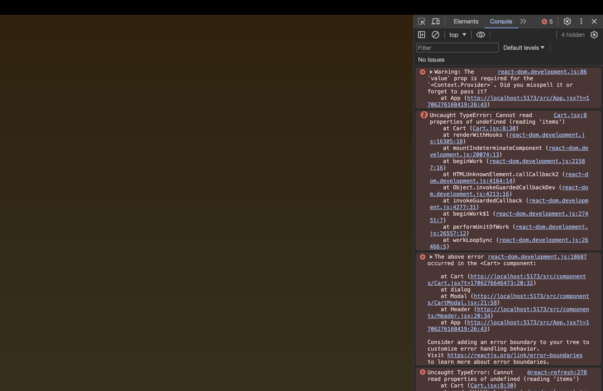

# Advanced State Management | 리액트의 컨텍스트 API & useReducer

[📌 Prop Drilling](#-prop-drilling)<br>
[📌 컨텍스트 API](#-컨텍스트-api)<br>
[📌 `useReducer` 훅 소개](#-usereducer-훅-소개)<br>
<br>

## 📌 Prop Drilling

### 📖 Prop Drilling 이해

- 여러 층의 컴포넌트를 거쳐 속성을 전달
- 대부분의 컴포넌트가 그 데이터를 직접적으로 필요하지는 않는다. &rarr; 자식 컴포넌트에 전달

<br>

### 📖 Prop Drilling 해결 방법 1: 컴포넌트 합성으로 해결하기

#### 💎 Component Composition(컴포넌트 합성)

```jsx
// App.jsx
function App() {
  return (
    <>
      <Header
        cart={shoppingCart}
        onUpdateCartItemQuantity={handleUpdateCartItemQuantity}
      />
      <Shop onAddItemToCart={handleAddItemToCart} />
    </>
  );
}

// Shop.jsx
import { DUMMY_PRODUCTS } from "../dummy-products.js";
import Product from "./Product.jsx";

export default function Shop({ onAddItemToCart }) {
  return (
    <section id="shop">
      <h2>Elegant Clothing For Everyone</h2>

      <ul id="products">
        {DUMMY_PRODUCTS.map((product) => (
          <li key={product.id}>
            <Product {...product} onAddToCart={onAddItemToCart} />
          </li>
        ))}
      </ul>
    </section>
  );
}
```

- Shop을 거쳐서 Projuct로 가기 보다는 Shop.jsx 코드를 App에서 작성할 수도 있을 것이다.

<br>

```jsx
// App.jsx
function App() {
  return (
    <>
      <Header
        cart={shoppingCart}
        onUpdateCartItemQuantity={handleUpdateCartItemQuantity}
      />
      <Shop>
        {DUMMY_PRODUCTS.map((product) => (
          <li key={product.id}>
            <Product {...product} onAddToCart={handleAddItemToCart} />
          </li>
        ))}
      </Shop>
    </>
  );
}

// Shop.jsx
export default function Shop({ children }) {
  return (
    <section id="shop">
      <h2>Elegant Clothing For Everyone</h2>

      <ul id="products">{children}</ul>
    </section>
  );
}
```

- `children` 속성을 이용하여 위처럼 작성할 수 있다.
- 하지만 이러한 방식은 모든 컴포넌트에 적용하기에는 쉽지 않다!

<br>

## 📌 컨텍스트 API

### 📖 Prop Drilling 해결 방법 2: Context API 소개

🔗 [React | Context로 데이터 깊숙이 전달하기](https://react-ko.dev/learn/passing-data-deeply-with-context)

- Context API : 리액트를 구성하는 하나의 특성이라고 할 수 있다.
- 컴포넌트나 컴포넌트 레이어 간의 데이터 공유를 용이하게 해준다.
- 컨텍스트 값을 생성하고 해당 값을 제공하고 컨텍스트를 묶어주는데, 다수의 컴포넌트 또는 앱의 모든 컴포넌트를 묶어준다.
- 장점 : state(상태)와의 연결이 쉽다. &rarr; 리액트의 상태를 컨텍스트 값에 연결하면 앱 전체에 제공되는 방식으로 사용한다.

<br>

### 📖 컨텍스트 소개 및 부여하기

1. src/store 폴더 생성 &rarr; 리액트 관습이다. &rarr; 컨텍스트 값을 파일에 저장하고 그 파일을 모으는 폴더 이름이다.
2. 다수의 컴포넌트에 사용될 데이터와 상태를 저장해두었기 때문에 이름을 store로 설정했다..!

#### 💎 src/store/shopping-cart-context.jsx

```jsx
import { createContext } from "react";

export const CartContext = createContext({
  items: [],
});
// 외부에서도 사용가능하도록 export
```

- `createContext()` : 컨텍스트 값 생성.
  - 초기값으로 사용할 특정 값을 `createContext()`에 전달하여 리액트 앱에서 이 컨텍스트로 감쌀 모든 컴포넌트에 해당 값이 전달되도록 할 수도 있다.
  - 숫자, 문자열, 객체, 배열 모두 가능하다.
- 생성된 `CartContext` 객체는 리액트에 의해서 생성되었고 `Provider` 컴포넌트를 갖고 있다. &rarr; 생성한 `{items:[]}`객체와는 약간의 차이가 있다.

<br>

#### 💎 App.jsx

- 컨텍스트를 필요로 하는 모든 컴포넌트를 담고있는 컴포넌트(App.jsx)를 찾는다.

```jsx
import { CartContext } from "./store/shopping-cart-context.jsx";

function App() {
  return (
    <CartContext.Provider>
      <Header
        cart={shoppingCart}
        onUpdateCartItemQuantity={handleUpdateCartItemQuantity}
      />
      <Shop>
        {DUMMY_PRODUCTS.map((product) => (
          <li key={product.id}>
            <Product {...product} onAddToCart={handleAddItemToCart} />
          </li>
        ))}
      </Shop>
    </CartContext.Provider>
  );
}
```

- `Provider` : 리액트가 생성한 컨텍스트 객체의 속성.
- `CartContext.Provider`가 실제로 사용하게 될 컴포넌트가 된다.

<br>

### 📖 컨텍스트 소비하기

#### 💎 Cart.jsx

- 이 컴포넌트에는 `items`라는 데이터를 사용한다. &rarr; 컨텍스트에서 설정한 그 items이다.

```jsx
import { useContext } from "react";
import { CartContext } from "../store/shopping-cart-context";

export default function Cart({ onUpdateItemQuantity }) {
  const cartCtx = useContext(CartContext); // 연결 구조 형성
  // 초기값에 items 속성을 추가했기 때문에 이 값은 items 속성을 가진 상태이다.

  const totalPrice = cartCtx.items.reduce(
    // items => cartCtx.items
    (acc, item) => acc + item.price * item.quantity,
    0
  );
  const formattedTotalPrice = `$${totalPrice.toFixed(2)}`;

  return (
    <div id="cart">
      {/*items => cartCtx.items.~~ */}
      {cartCtx.items.length === 0 && <p>No items in cart!</p>}
      {cartCtx.items.length > 0 && (
        <ul id="cart-items">
          {cartCtx.items.map((item) => {
            const formattedPrice = `$${item.price.toFixed(2)}`;

            return (
              <li key={item.id}>
                <div>
                  <span>{item.name}</span>
                  <span> ({formattedPrice})</span>
                </div>
                <div className="cart-item-actions">
                  <button onClick={() => onUpdateItemQuantity(item.id, -1)}>
                    -
                  </button>
                  <span>{item.quantity}</span>
                  <button onClick={() => onUpdateItemQuantity(item.id, 1)}>
                    +
                  </button>
                </div>
              </li>
            );
          })}
        </ul>
      )}
      <p id="cart-total-price">
        Cart Total: <strong>{formattedTotalPrice}</strong>
      </p>
    </div>
  );
}
```

- `useContext` : 리액트 훅. Cart 컴포넌트와 같은 그 어떤 컴포넌트의 함수일지라도 컨텍스트 값에 접근해 사용할 수 있도록 해준다.



- `Context.Provider`에게 `value` 속성을 전달해주지 않았다는 오류가 뜬다.

```jsx
// App.jsx
function App() {
  return (
    <CartContext.Provider value={{ items: [] }}>
      {/* ... */}
    </CartContext.Provider>
  );
}
```

- shopping-cart-context.jsx에 `{items:[]}`처럼 기본값을 설정하는 이유 : 이를 통해 더 나은 자동완성 기능을 얻을 수 있기 때문이다.
- 개발하는데 조금 더 쉽게 만들 수 있다.

---

#### 💎 Cart.jsx에서 구조분해(destructure)하기

```jsx
import { useContext } from "react";
import { CartContext } from "../store/shopping-cart-context";

export default function Cart({ onUpdateItemQuantity }) {
  const { items } = useContext(CartContext); // Destructure
}
```

- 위처럼 구조 분해를 하면, 굳이 `cartCtx.items.~`처럼 쓰지 않고 그대로 `items.~`를 사용해도 된다.

<br>

### 📖 컨텍스트와 State(상태) 연결하기

#### 💎 App.jsx

```jsx
// 이전
function App() {
  const [shoppingCart, setShoppingCart] = useState({
    items: [],
  });

  return (
    {/* value는 항상 빈 배열로 설정되어있어 고정적인 값이다. */}
    <CartContext.Provider value={{ items: [] }}>
      {/* ... */}
    </CartContext.Provider>
  );
}

// 이후
function App() {
  const [shoppingCart, setShoppingCart] = useState({
    items: [],
  });

  return (
    <CartContext.Provider value={shoppintCart}>
      {/* ... */}
    </CartContext.Provider>
  );
}
```

- 컨텍스트의 `value`에 `shoppingCart` 상태를 연결한다. &rarr; `shoppingCart` 상태와 동일한 구조를 가지므로 `value={shoppingCart}`로 지정함.
- 이것으로 컨텍스트와 상태는 연결되었으나 이렇게 상태 객체 전체를 value로 설정한다면 해당 값을 이용해서 읽을 수 잆지만 상태를 수정하려면 컨텍스트를 통해 할 수는 없다.
- 값을 읽는 것 뿐만 아니라 상태를 업데이트까지 할 수 있도록 하는 것이 컨텍스트의 이상적인 쓰임이다.

<br>

```jsx
// App.jsx
function App() {
  const ctxValue = {
    items: shoppingCart.items,
    addItemToCart: handleAddItemToCart,
    // 속성, 장바구니에 새로운 물건을 담아주는 기능을 가진 함수 => 컨텍스트를 통해 함수 자체를 노출.
  };

  return (
    <CartContext.Provider value={ctxValue}>{/* ... */}</CartContext.Provider>
  );
}
```

#### 💎 Product.jsx

```jsx
// src/store/shopping-cart-context.jsx
import { createContext } from "react";

export const CartContext = createContext({
  items: [],
  addItemToCart: () => {}, // 실제로 사용되진 않지만 자동완성 기능에 도움을 주는 용도로 가짜 함수 추가.
});


// Product.jsx 컨텍스트 적용 이전
export default function Product({ id, image, title, price, description, onAddToCart }) {
  return (
    <article className="product">
      
      <div className="product-content">
        <div>
          <h3>{title}</h3>
          <p className="product-price">${price}</p>
          <p>{description}</p>
        </div>
        <p className="product-actions">
          <button onClick={() => onAddToCart(id)}>Add to Cart</button>
        </p>
      </div>
    </article>
  );
}


// Product.jsx 컨텍스트 적용 이후
import { useContext } from "react";
import { CartContext } from "../store/shopping-cart-context.jsx";

export default function Product({ id, image, title, price, description }) {
  const {addItemToCart} = useContext(CartContext);
  // CartContext에서 addItemToCart 속성만 destructuring..

  return (
    <article className="product">
      
      <div className="product-content">
        <div>
          <h3>{title}</h3>
          <p className="product-price">${price}</p>
          <p>{description}</p>
        </div>
        <p className="product-actions">
          <button onClick={() => addItemToCart(id)}>Add to Cart</button>{/* CartContext의 addItemToCart 사용 */}
        </p>
      </div>
    </article>
  );
}
```

#### 💎 결과


<br>

### 📖 컨텍스트를 소비하는 여러가지 방법

`useContext` Hook : 컴포넌트 안의 컨텍스트에 접근할 때 일반적으로 사용된다.

- 컨텍스트의 Provider 컴포넌트는 컨텍스트 값을 필요로 하는 모든 타 컴포넌트에 값(value)를 제공하기 위해서 필요하다.
- 그러나 컨텍스트는 Provider 컴포넌트 외에도 또다른 컴포넌트를 제공한다.

  1. `Consumer` : 컨텍스트 값에 대한 액세스를 가진 JSX 코드를 묶는 데에 사용할 수 있다.

  - 특수한 자식 속성을 필요로 함. 시작과 종료 태그 사이의 자식으로서 함수를 전달한다.
  - 해당 함수는 자동적으로 처리하는 컨텍스트 값을 매개변수로 받는다.
  - 그리고 해당 Cart 컴포넌트가 출력해야 할 JSX 코드를 반환한다.

  ```jsx
  import { useContext } from "react";
  import { CartContext } from "../store/shopping-cart-context";

  export default function Cart({ onUpdateItemQuantity }) {
    const { items } = useContext(CartContext); // 연결 구조 형성

    return (
      <CartContext.Consumer>
        {(cartCtx) => {
          const totalPrice = cartCtx.items.reduce(
            (acc, item) => acc + item.price * item.quantity,
            0
          );
          const formattedTotalPrice = `$${totalPrice.toFixed(2)}`;

          return (
            <div id="cart">
              {cartCtx.items.length === 0 && <p>No items in cart!</p>}
              {cartCtx.items.length > 0 && (
                <ul id="cart-items">
                  {cartCtx.items.map((item) => {
                    const formattedPrice = `$${item.price.toFixed(2)}`;

                    return (
                      <li key={item.id}>
                        <div>
                          <span>{item.name}</span>
                          <span> ({formattedPrice})</span>
                        </div>
                        <div className="cart-item-actions">
                          <button
                            onClick={() => onUpdateItemQuantity(item.id, -1)}
                          >
                            -
                          </button>
                          <span>{item.quantity}</span>
                          <button
                            onClick={() => onUpdateItemQuantity(item.id, 1)}
                          >
                            +
                          </button>
                        </div>
                      </li>
                    );
                  })}
                </ul>
              )}
              <p id="cart-total-price">
                Cart Total: <strong>{formattedTotalPrice}</strong>
              </p>
            </div>
          );
        }}
      </CartContext.Consumer>
    );
  }
  ```

<br>

### 📖 컨텍스트 값이 바뀌면 생기는 일

- 컴포넌트의 컨텍스트 값에 접근할 때, 해당 값은 그 값에 접근하는 컴포넌트의 함수를 바꾼다. 즉 업데이트된 내부 상태가 사용되었거나 부모 컴포넌트가 다시 실행됬거나 컴포넌트 함수가 재실행되는 것 같이 리액트에 의한 재실행이 이뤄진다.
  > 컴포넌트가 useContext 훅을 사용함으로 관련 컨텍스트 값에 연결되었을 때 재실행된다.

> 정리 : 연결된 컨텍스트 값이 변경되었을 때 리액트가 컴포넌트 함수를 재실행하는 이유는 해당 컴포넌트 함수를 통해 새로운 UI를 만들어낼 수 있게 하기 위해서이다.

<br>

### 📖 전체 데모 앱에 컨텍스트 API 적용하기

🔗 [레파지토리에서 전체 데모 앱에 컨텍스트 API 적용한 코드 보기](https://github.com/Imshyeon/Develop_Study/tree/ba4f8c49a81e2a1aecef337729afa7e62aa23621/React/Complete-React/10_React-Advanced-State-Management/src)

<br>

### 📖 컨텍스트 아웃소싱 & 분리된 제공자(Provider) 컴포넌트에 State(상태) 부여

- 현재 데모 앱은 잘 동작하지만 아직 많이 무거운 상태이다.
- 조금 더 복잡한 프로젝트의 경우 한 컴포넌트에 여러개의 컨텍스트가 들어갈 가능성이 있다. 이러한 가능성은 피하는 것이 좋다.

#### 💎 src/store/shopping-cart-context.jsx

```jsx
import { createContext, useState } from "react";
import { DUMMY_PRODUCTS } from "../dummy-products";

export const CartContext = createContext({
  items: [],
  addItemToCart: () => {},
  updateItemQuantity: () => {},
});

export default function CartContextProvider({ children }) {
  // 컨텍스트 데이터를 관리하고 그 데이터를 앱에 제공하는 등 장바구니 쪽 컨텍스트와 관련.
  // 목적 : 앱 컴포넌트에 있던 모든 상태와 컨텍스트 값의 관리(management) 코드를 가져오는 것.
  const [shoppingCart, setShoppingCart] = useState({
    items: [],
  });

  function handleAddItemToCart(id) {
    setShoppingCart((prevShoppingCart) => {
      const updatedItems = [...prevShoppingCart.items];

      const existingCartItemIndex = updatedItems.findIndex(
        (cartItem) => cartItem.id === id
      );
      const existingCartItem = updatedItems[existingCartItemIndex];

      if (existingCartItem) {
        const updatedItem = {
          ...existingCartItem,
          quantity: existingCartItem.quantity + 1,
        };
        updatedItems[existingCartItemIndex] = updatedItem;
      } else {
        const product = DUMMY_PRODUCTS.find((product) => product.id === id);
        updatedItems.push({
          id: id,
          name: product.title,
          price: product.price,
          quantity: 1,
        });
      }

      return {
        items: updatedItems,
      };
    });
  }

  function handleUpdateCartItemQuantity(productId, amount) {
    setShoppingCart((prevShoppingCart) => {
      const updatedItems = [...prevShoppingCart.items];
      const updatedItemIndex = updatedItems.findIndex(
        (item) => item.id === productId
      );

      const updatedItem = {
        ...updatedItems[updatedItemIndex],
      };

      updatedItem.quantity += amount;

      if (updatedItem.quantity <= 0) {
        updatedItems.splice(updatedItemIndex, 1);
      } else {
        updatedItems[updatedItemIndex] = updatedItem;
      }

      return {
        items: updatedItems,
      };
    });
  }

  const ctxValue = {
    items: shoppingCart.items,
    addItemToCart: handleAddItemToCart,
    updateItemQuantity: handleUpdateCartItemQuantity,
  };

  return (
    <CartContext.Provider value={ctxValue}>{children}</CartContext.Provider>
  );
}
```

- 기존의 App에 있던 상태, 컨텍스트 관련 코드를 가져와 shopping-cart-context.jsx에 맞게 가볍게 코드 수정했다.

#### 💎 App.jsx

```jsx
import Header from "./components/Header.jsx";
import Shop from "./components/Shop.jsx";
import Product from "./components/Product.jsx";
import { DUMMY_PRODUCTS } from "./dummy-products.js";

import CartContextProvider from "./store/shopping-cart-context.jsx";

function App() {
  return (
    <CartContextProvider>
      <Header />
      <Shop>
        {DUMMY_PRODUCTS.map((product) => (
          <li key={product.id}>
            <Product {...product} />
          </li>
        ))}
      </Shop>
    </CartContextProvider>
  );
}

export default App;
```

- 이렇게 App.jsx는 상대적으로 가볍게 유지할 수 있다.

<br>

## 📌 `useReducer` 훅 소개

- 복잡한 리액트 앱을 만들 때는 컨텍스트가 매우 중요한 기능이 될 수 있다.
- shopping-cart-context.jsx에서 이제 상태 관리도 하게 된다. &rarr; 상태 업데이트용 함수는 아직 복잡.
- 복잡한 상태를 가진 프로젝트일 수록 상태 업데이트 함수에서 이전 상태 스냅샷을 많이 사용할 것이다. 즉, `setUpdateState((prevState)=>{})` 와 같은 함수 형태를 띌 것이다.

> `useState`같은 코드를 사용해 상태 관리를 하는 대신 `useReducer`라는 또다른 상태 관리 훅을 사용할 수 있다.

#### 💎 Reducer 란?

- 리액트 앱과 자바스크립트 프로그래밍에서 Reducer란 대개 하나 또는 그 이상의 복잡한 값을 더 단순한 형태로 만드는 함수이다.
  - `[5, 10, 100] ==reduce==> [115]`

```jsx
// Cart.jsx
const totalPrice = items.reduce(
  (acc, item) => acc + item.price * item.quantity,
  0
);
```

- `useReducer` 훅은 상태 관리의 목적을 가지로 하나 또는 그 이상의 값을 보다 단순하게 하나의 값으로 줄인다.

<br>

#### 💎 useReducer 사용을 위한 세팅

```jsx
// src/store/shopping-cart-context.jsx
import { createContext, useState, useReducer } from "react";
import { DUMMY_PRODUCTS } from "../dummy-products";

export const CartContext = createContext({
  items: [],
  addItemToCart: () => {},
  updateItemQuantity: () => {},
});

function shoppingCartReducer(state, action) {
  return state;
}

export default function CartContextProvider({ children }) {
  const [shoppingCartState, shoppingCartDispatch] = useReducer(
    shoppingCartReducer,
    {
      items: [],
    }
  );

  // const [shoppingCart, setShoppingCart] = useState({
  //   items: [],
  // });

  // ...

  const ctxValue = {
    items: shoppingCartState.items, // useReducer에서 정의한 상태(shoppingCartState) 전달.
    addItemToCart: handleAddItemToCart,
    updateItemQuantity: handleUpdateCartItemQuantity,
  };

  return (
    <CartContext.Provider value={ctxValue}>{children}</CartContext.Provider>
  );
}
```

> `const [ useReducer로 관리되는 상태, dispatch 함수] = useReducer( reducer 함수, 초기값 )`

- `useReducer`에서 받아오는 두번째 요소는 `useState`에서와 같은 상태 업데이트 함수가 아닌 dispatch 함수이다. 이는 action(액션)을 보낼 수 있는데, 보내진 액션은 추후 리듀서(reducer) 기능에 의해서 사용된다.

<br>

- `shoppingCartReducer( state(상태) , action(액션) )`
  - 컴포넌트 밖에서 함수를 정의한다. 재생성이 되지 않도록 하기 위함이다. (따로 컴포넌트로 부터 속성을 전달받지는 않는다.)
  - 액션(action)이 디스패치를 통해 보내진 후에 리액트가 shoppingCartReducer 함수를 호출할 것. &rarr; `shoppingCartDispatch`의 액션 === `shoppinCartReducer`의 `action`
  - `state`는 `useReducer`로 관리되는 상태의 최신 상태 스냅샷이다.

<br>

#### 💎 Action 보내기 & `useReducer`로 State(상태) 수정하기

```jsx
// src/store/shopping-cart-context.jsx
import { createContext, useReducer } from "react";
import { DUMMY_PRODUCTS } from "../dummy-products";

export const CartContext = createContext({
  items: [],
  addItemToCart: () => {},
  updateItemQuantity: () => {},
});

function shoppingCartReducer(state, action) {
  // type에 맞게 액션을 정의했다.
  if (action.type === "ADD_ITEM") {
    // prevShoppingCart => state
    const updatedItems = [...state.items];

    const existingCartItemIndex = updatedItems.findIndex(
      (cartItem) => cartItem.id === action.payload
    );
    const existingCartItem = updatedItems[existingCartItemIndex];

    if (existingCartItem) {
      const updatedItem = {
        ...existingCartItem,
        quantity: existingCartItem.quantity + 1,
      };
      updatedItems[existingCartItemIndex] = updatedItem;
    } else {
      const product = DUMMY_PRODUCTS.find(
        (product) => product.id === action.payload
      );
      updatedItems.push({
        id: action.payload,
        name: product.title,
        price: product.price,
        quantity: 1,
      });
    }

    return {
      // ...state,  => 현재는 필요하지 않지만 더 복잡한 상태라면 이렇게 사용가능.
      items: updatedItems,
    };
  }

  if (action.type === "UPDATE_ITEM") {
    const updatedItems = [...state.items];
    const updatedItemIndex = updatedItems.findIndex(
      (item) => item.id === action.payload.productId
    );

    const updatedItem = {
      ...updatedItems[updatedItemIndex],
    };

    updatedItem.quantity += action.payload.amount;

    if (updatedItem.quantity <= 0) {
      updatedItems.splice(updatedItemIndex, 1);
    } else {
      updatedItems[updatedItemIndex] = updatedItem;
    }

    return {
      ...state,
      items: updatedItems,
    };
  }
  return state;
}

export default function CartContextProvider({ children }) {
  const [shoppingCartState, shoppingCartDispatch] = useReducer(
    shoppingCartReducer,
    {
      items: [],
    }
  );

  function handleAddItemToCart(id) {
    shoppingCartDispatch({
      // 각각의 액션을 구분하고 리듀서 내에서 다르게 처리하기 위해 type이나 id를 전달 (숫자나 문자열로만 전달해도 가능하긴 하다..!)
      type: "ADD_ITEM", 
      // handleAddItemToCart에서 매개변수로 받는 id를 액션 오브젝트에서 payload로 설정.
      payload: id, 
    });
  }

  function handleUpdateCartItemQuantity(productId, amount) {
    shoppingCartDispatch({
      type: "UPDATE_ITEM",
      payload: {
        productId: productId,
        amount: amount,
      },
    });
  }

  const ctxValue = {
    items: shoppingCartState.items,
    addItemToCart: handleAddItemToCart,
    updateItemQuantity: handleUpdateCartItemQuantity,
  };

  return (
    <CartContext.Provider value={ctxValue}>{children}</CartContext.Provider>
  );
}
```