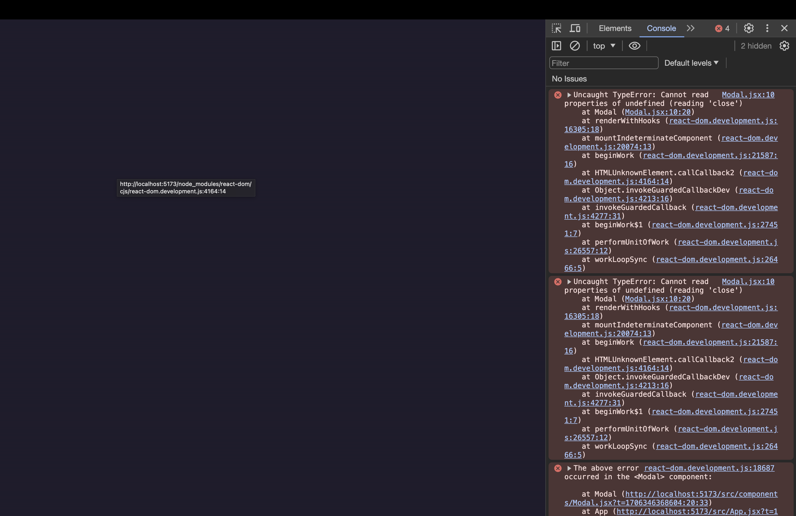

# Dealing with Side Effect | 부수 효과 다루기, `useEffect` 훅 사용하기

[📌 Side Effect(부수 효과)](#-side-effect부수-효과)<br>
[📌 `useEffect`](#📌-useeffect)<br>
<br>

## 📌 Side Effect(부수 효과)

### 📖 Side Effect(부수 효과)란 무엇인가?

- 앱이 제대로 동작하기 위해 실행되어야 하지만 현재의 컴포넌트 렌더링 과정에 직접적인 영향을 미치지는 않는 "작업"이다.

#### 💎 App.jsx | 유저의 위치 정보 받아오기

```jsx
import { sortPlacesByDistance } from "./loc.js";

function App() {
  const [availablePlaces, setAvailablePlaces] = useState([]);

  // 부수효과 => 사용자의 위치가 이 앱에 필요하긴 하지만 컴포넌트 함수의 주 목적(JSX 렌더링)과는 직접적인 관계가 없다.
  navigator.geolocation.getCurrentPosition((position) => {
    const sortedPlaces = sortPlacesByDistance(
      AVAILABLE_PLACES,
      position.coords.latitude,
      position.coords.longitude
    );
    setAvailablePlaces(sortedPlaces); // 앱 컴포넌트 재실행 -> 계속 사용자 위치 파악을 할 것이다 => 무한 루프.
  });

  return (
    <>
      {/* ... */}
      <main>
        <Places
          title="I'd like to visit ..."
          fallbackText={"Select the places you would like to visit below."}
          places={pickedPlaces}
          onSelectPlace={handleStartRemovePlace}
        />
        <Places
          title="Available Places"
          places={AVAILABLE_PLACES}
          onSelectPlace={handleSelectPlace}
        />
      </main>
    </>
  );
}
```

- 주석에서 설명했듯이, 사용자의 위치 정보를 받아오면 `useState`에 의해서 상태가 업데이트가 되고 앱 컴포넌트가 재실행된다. 컴포넌트가 재실행되면 또다시 사용자 위치 정보를 받게 되면서 무한 루프에 빠지게 된다.
- 이러한 부수 효과의 문제점을 해결하기 위해서 `useEffect` 훅을 배울 것이다.

<br>

## 📌 `useEffect`

### 📖 `useEffect`를 사용하는 Side Effect(부수 효과)

#### 💎 App.jsx

- `useEffect`의 첫 인수인 함수가 리액트로 인해 실행되는 시점은 앱 컴포넌트가 실행되고 나서 즉시 실행되지 않는다. &rarr; 앱 컴포넌트 함수의 실행이 모두 완료가 된 이후에 실행된다!

  > JSX 코드가 반환된 이후의 시점에서야 `useEffect`에 전달한 Side Effect 함수가 실행된다. &rarr; 리액트는 컴포넌트 함수의 실행이 완료된 후에 부수 효과 함수를 실행한다.

- 의존성(배열)의 값이 변화했을 경우에 한해서 `useEffect` 함수를 재실행한다.

```jsx
// App.jsx

import { useRef, useState, useEffect } from "react";
import { sortPlacesByDistance } from "./loc.js";

function App() {
  const [availablePlaces, setAvailablePlaces] = useState([]);

  useEffect(() => {
    navigator.geolocation.getCurrentPosition((position) => {
      const sortedPlaces = sortPlacesByDistance(
        AVAILABLE_PLACES,
        position.coords.latitude,
        position.coords.longitude
      );
      setAvailablePlaces(sortedPlaces);
    });
  }, []);

  return (
    <>
      {/* ... */}
      <main>
        <Places
          title="I'd like to visit ..."
          fallbackText={"Select the places you would like to visit below."}
          places={pickedPlaces}
          onSelectPlace={handleStartRemovePlace}
        />
        <Places
          title="Available Places"
          places={availablePlaces}
          fallbackText="Sorting places by distance..."
          onSelectPlace={handleSelectPlace}
        />
      </main>
    </>
  );
}
```

- `useEffect( 부수효과 코드를 감쌀 함수, dependency(의존성) 배열 )`

  - 값을 반환하지 않는다.
  - 현재 의존성이 `[]`로 비어있다. === 의존성이 없다 === 변화할 수 없다. &rarr; 리액트는 해당 Effect 함수를 재실행하지 않는다. 오직 처음으로 실행된 이후에만 딱 한번 실행된다.
  - 그렇다고 의존성 배열을 아예 작성하지 않으면 안된다. 무한루프가 실행됨.

- `<Places fallbackText="Sorting places by distance..."/>` : 아직 장소 정렬이 되지 않았을 때 사용자에게 보여 줄 fallback(대체) 텍스트이다.

#### 💎 결과


<br>

### 📖 모든 Side Effect가 `useEffect`를 사용하지 않는 이유 1

- `useEffect`의 과한 사용이나 불필요한 곳에서의 사용은 좋지 않다.
- 실행 과정에서 앱 또는 그외의 컴포넌트가 실행된 이후에 추가적인 실행이 진행되는 방식이기 때문이다!

#### 💎 App.jsx | LocalStorage에 저장하기

```jsx
import { useRef, useState, useEffect } from "react";
import { sortPlacesByDistance } from "./loc.js";

function App() {
  const [availablePlaces, setAvailablePlaces] = useState([]);

  useEffect(() => {
    // 부수 효과 1
    navigator.geolocation.getCurrentPosition((position) => {
      const sortedPlaces = sortPlacesByDistance(
        AVAILABLE_PLACES,
        position.coords.latitude,
        position.coords.longitude
      );
      setAvailablePlaces(sortedPlaces);
    });
  }, []);

  function handleSelectPlace(id) {
    setPickedPlaces((prevPickedPlaces) => {
      if (prevPickedPlaces.some((place) => place.id === id)) {
        return prevPickedPlaces;
      }
      const place = AVAILABLE_PLACES.find((place) => place.id === id);
      return [place, ...prevPickedPlaces];
    });

    // 부수 효과2
    const storedIds = JSON.parse(localStorage.getItem("selectedPlaces")) || [];
    if (storedIds.indexOf(id) === -1) {
      // 이미 해당되는 장소가 있는지 확인(indexOf) -> 없다면..(-1)
      localStorage.setItem(
        "selectedPlaces",
        JSON.stringify([id, ...storedIds])
      );
    }
  }
}
```

- 부수 효과2는 부수 효과1과는 다르게 일단 이미 함수 안에 들어와있는 코드이다. 만약 부수 효과2에 `useEffect`를 쓰는 것은 훅의 규칙을 위반하는 것이다.
  > 훅의 규칙 : 중첩된 함수나 if문 등에서 리액트 훅을 사용할 수 없다. => 컴포넌트의 root에서만 사용가능하다.
- 부수 효과2의 실행 조건은 아이템을 클릭해야지 실행된다. 그리고 상태를 업데이트하지 않으므로 무한 루프에 빠지지도 않는다.
- 따라서 이 부수효과는 사용자 상호작용이 있어야만 작동을 하기에 설령 상태가 업데이트가 되더라도 무한 루프를 만들어내지 않는다. &rarr; 모든 부수효과에 `useEffect`가 필요하지 않는다.
  > `useEffect` 훅이 필요한 경우는 무한 루프를 방지하기 위해서이거나 컴포넌트 함수가 최소 한번은 실행된 이후에 작동이 가능한 코드가 있을 때 뿐이다.

<br>

### 📖 모든 Side Effect가 `useEffect`를 사용하지 않는 이유 2

#### 💎 App.jsx | 아이템을 삭제할 때 localStorage에서도 해당 아이템(장소) 삭제하기

```jsx
import { useRef, useState, useEffect } from "react";

import Places from "./components/Places.jsx";
import { AVAILABLE_PLACES } from "./data.js";
import Modal from "./components/Modal.jsx";
import DeleteConfirmation from "./components/DeleteConfirmation.jsx";
import logoImg from "./assets/logo.png";

import { sortPlacesByDistance } from "./loc.js";

// 부수 효과 3-2
// 앱이 업데이트 될때마다 실행될 필요가 없으므로 컴포넌트 밖에서 작성됨.
const storedIds = JSON.parse(localStorage.getItem("selectedPlaces")) || [];
const storedPlaces = storedIds.map((id) =>
  AVAILABLE_PLACES.find((place) => place.id === id)
);

function App() {
  const modal = useRef();
  const selectedPlace = useRef();
  const [availablePlaces, setAvailablePlaces] = useState([]);
  const [pickedPlaces, setPickedPlaces] = useState(storedPlaces); // 부수 효과 3-2에서 리턴된 저장된 장소 데이터들을 pickedPlaces 상태에 초기화.

  /* 부수 효과 3-3

  useEffect(() => {
    const storedIds = JSON.parse(localStorage.getItem("selectedPlaces")) || [];
    const storedPlaces = storedIds.map((id) =>
      AVAILABLE_PLACES.find((place) => place.id === id)
    );
    setPickedPlaces(storedPlaces);
  }, []); 
  */

  // 부수 효과 1
  useEffect(() => {
    navigator.geolocation.getCurrentPosition((position) => {
      const sortedPlaces = sortPlacesByDistance(
        AVAILABLE_PLACES,
        position.coords.latitude,
        position.coords.longitude
      );
      setAvailablePlaces(sortedPlaces);
    });
  }, []);

  function handleStartRemovePlace(id) {
    modal.current.open();
    selectedPlace.current = id;
  }

  function handleStopRemovePlace() {
    modal.current.close();
  }

  function handleSelectPlace(id) {
    setPickedPlaces((prevPickedPlaces) => {
      if (prevPickedPlaces.some((place) => place.id === id)) {
        return prevPickedPlaces;
      }
      const place = AVAILABLE_PLACES.find((place) => place.id === id);
      return [place, ...prevPickedPlaces];
    });

    // 부수 효과 2
    const storedIds = JSON.parse(localStorage.getItem("selectedPlaces")) || [];
    if (storedIds.indexOf(id) === -1) {
      localStorage.setItem(
        "selectedPlaces",
        JSON.stringify([id, ...storedIds])
      );
    }
  }

  function handleRemovePlace() {
    setPickedPlaces((prevPickedPlaces) =>
      prevPickedPlaces.filter((place) => place.id !== selectedPlace.current)
    );
    modal.current.close();

    // 부수 효과 3-1
    const storedIds = JSON.parse(localStorage.getItem("selectedPlaces")) || [];
    localStorage.setItem(
      "selectedPlaces",
      JSON.stringify(storedIds.filter((id) => id !== selectedPlace.current))
    ); // filter : 조건문이 만족되면 삭제하고자 하는 항목이 아니다 -> true 반환 => 항목을 그대로 유지
    // 조건문이 맞지 않다면(id가 매치되면) 삭제하고자 하는 항목이다 -> false 반환 => 항목에서 배제.
  }
}
```

- 부수 효과 3은 사용자가 이미 몇 개의 장소를 선택했고 선택된 장소들 중에서 다시 몇 개의 아이템을 삭제하는 것이다.
- 부수 효과 3-1 : `localStorage`에서 id를 불러와 `filter` 함수를 통해 선택한 아이템을 삭제하는 로직이다. `filter`와 관련된 내용은 주석에 적어 놓았다.
- 부수 효과 3-2 : 부수 효과 3-1을 실행하기에 앞서 이미 선택한 장소들이 있다면 유저에게 화면을 통해서 표현을 해줘야 한다. 이를 위해 `localStorage`에 저장된 id들을 불러오고 `map` 함수를 이용해서 저장된 모든 장소들의 데이터를 불러온다. (`AVAILABLE_PLACES`와 일치하는 id를 찾고 해당 데이터를 반환.)
  - 부수 효과 3-2를 통해서 얻은 `storedPlaces`를 `pickedPlaces` 상태에 초기화한다. &rarr; 굳이 `useEffect`를 쓰지 않고도 업데이트 가능 + UI 표현 가능
- 부수 효과 3-3 : 부수 효과 3-2를 사용하지 않고 `useEffect`를 사용하여 이미 저장된 장소들을 표현한 것이다.
  - 의존성을 `[]`로 했기 때문에 초기에만 실행된다.
  - 불필요한 `useEffect`이다. &rarr; `navigator`는 `getCurrentPosition` 함수의 특성상 약간의 시간차가 발생하지만 이 부수효과 코드는 시간차 없이 즉시 실행된다. 따라서 굳이 `useEffect`를 쓰지 않아도 되며, 부수 효과 3-2처럼 작성해도 된다!

#### 💎 결과


🔗[레파지토리에서 해당 코드 보기](https://github.com/Imshyeon/Develop_Study/commit/bd9844c06502f3c765d714e719bbf4070324654d?diff=split&w=0#diff-85ce9fcc9ce30fa2ceb9041c2288dc05a5918b8e4c64f37b84fdb91a30eb753d)

<br>

### 📖 `use Effect`를 활용하는 다른 적용 사례

#### 💎 Modal.jsx | `useEffect`를 이용해 모달 열고 닫기

1. 방법 1: `useEffect` 사용하지 않고 모달 동작시키기

```jsx
// Modal.jsx

import { useRef } from "react";
import { createPortal } from "react-dom";

export default function Modal({ open, children }) {
  const dialog = useRef();

  if (open) {
    dialog.current.showModal();
  } else {
    dialog.current.close();
  }

  return createPortal(
    <dialog className="modal" ref={dialog}>
      {children}
    </dialog>,
    document.getElementById("modal")
  );
}

// App.jsx
import { useRef, useState, useEffect } from "react";
import Modal from "./components/Modal.jsx";

function App() {
  const [modalIsOpen, setModalIsOpen] = useState(false);

  function handleStartRemovePlace(id) {
    setModalIsOpen(true);
    selectedPlace.current = id;
  }

  function handleStopRemovePlace() {
    setModalIsOpen(false);
  }

  function handleRemovePlace() {
    //...
    setModalIsOpen(false)
    //...
  }

  return (
    <>
      <Modal open={modalIsOpen}>
        {/* ... */}
      </Modal>
      {/* ... */}
  );
}
```



- `showModal(), close()` 메서드를 컴포넌트 함수의 내부에서 호출하고 있으므로 오류가 발생한다.
- 이 컴포넌트가 처음을 실행될 때, `dialog` 참조는 아직 설정이 되지 않았다. &rarr; JSX 코드가 실행되기 이전이기 때문이다. 아직 연결이 안됨!
- 따라서 if문 안에서 애초에 `dialog`는 `undefined` 상태였다.

🔗 [레파지토리에서 해당 코드 보기](https://github.com/Imshyeon/Develop_Study/commit/4cef25043f7c31fa5cc4e502f466ab3b7cebe9c1)

- 따라서 `showModal(), close()` 메서드와 같은 DOM API와 속성값(혹은 상태값)이 동기화될 수 있도록 `useEffect`를 이용하여 JSX 코드 실행 이후(컴포넌트 이후 실행)로 해당 메서드들(`showModal, close`)이 실행되도록 해야한다. 그래야지 `dialog` 참조가 연결이 된다.

<br>

---

<br>

2. 방법 2 : `useEffect` 이용하기

```jsx
// Modal.jsx

import { useRef, useEffect } from "react";
import { createPortal } from "react-dom";

export default function Modal({ open, children }) {
  const dialog = useRef();

  useEffect(() => {
    if (open) {
      dialog.current.showModal();
    } else {
      dialog.current.close();
    }
  }, []);
  // 의존성 배열에 Effect 함수가 필요로 하는 의존성을 추가해야 한다.

  return createPortal(
    <dialog className="modal" ref={dialog}>
      {children}
    </dialog>,
    document.getElementById("modal")
  );
}
```

- `useEffect`를 사용하여 컴포넌트의 실행 이후로 부수 효과가 실행되도록 했다. 그러나! 해당 코드에는 의존성을 추가해야한다.

<br>

### 📖 Effect Dependencies(의존성) 이해하기

- 속성이나 상태값으로 이해할 수 있다. (**_In addition, other effect dependecies would be functions of context values that depend on or use state or props_**)
- 컴포넌트 함수를 다시 실행하도록 하는 값이다. (`useEffect`에서 사용된다면,,)
- 참조(`ref`)나 브라우저에 구축된 객체와 메서드(ex. `navigator`,..)들은 의존성을 분류되지 않는다.
- `useEffect`는 컴포넌트 함수가 다시 실행되도록 하는 의존성에 대해서만 적용되기 때문이다. &rarr; 의존성이 변경될 때마다 `useEffect`가 동작하기 때문이다.

```jsx
// Modal.jsx

import { useRef, useEffect } from "react";
import { createPortal } from "react-dom";

export default function Modal({ open, children }) {
  const dialog = useRef();

  useEffect(() => {
    if (open) {
      dialog.current.showModal();
    } else {
      dialog.current.close();
    }
  }, [open]); // open 속성을 추가하여 의존성 검사
  // 의존성 배열에 Effect 함수가 필요로 하는 의존성을 추가해야 한다.
  // Modal : open 속성 사용하여 열고 닫고를 정한다.

  return createPortal(
    <dialog className="modal" ref={dialog}>
      {children}
    </dialog>,
    document.getElementById("modal")
  );
}
```


<br>

#### (+) ESC 버튼을 통해 모달 닫기

```jsx
// App.jsx
<Modal open={modalIsOpen} onClose={handleStopRemovePlace}>
  <DeleteConfirmation
    onCancel={handleStopRemovePlace}
    onConfirm={handleRemovePlace}
  />
</Modal>;

// Modal.jsx
import { useRef, useEffect } from "react";
import { createPortal } from "react-dom";

export default function Modal({ open, children, onClose }) {
  return createPortal(
    <dialog className="modal" ref={dialog} onClose={onClose}>
      {/* onClose 속성 전달 */}
      {children}
    </dialog>,
    document.getElementById("modal")
  );
}
```

### 📖 useEffect의 도움으로 고칠 수 있는 다른 문제들

