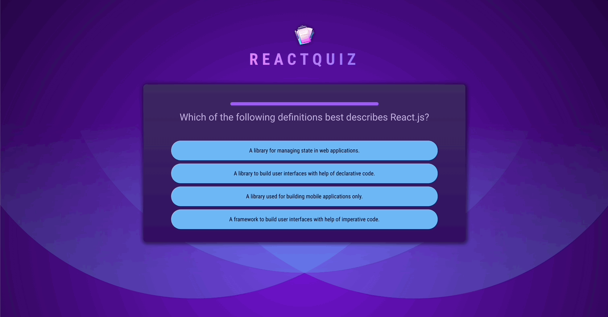
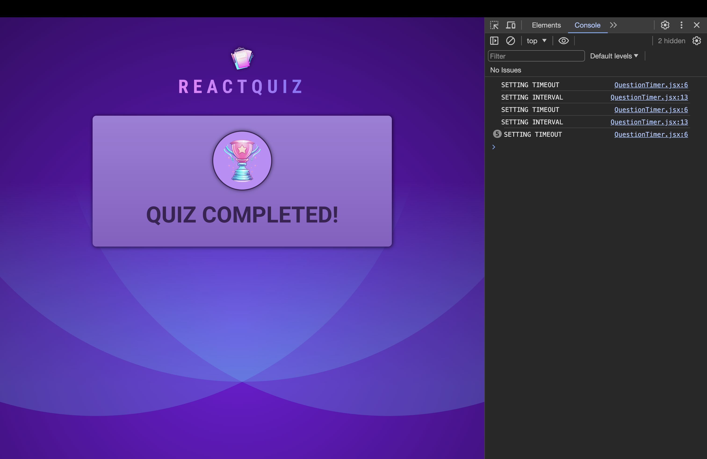
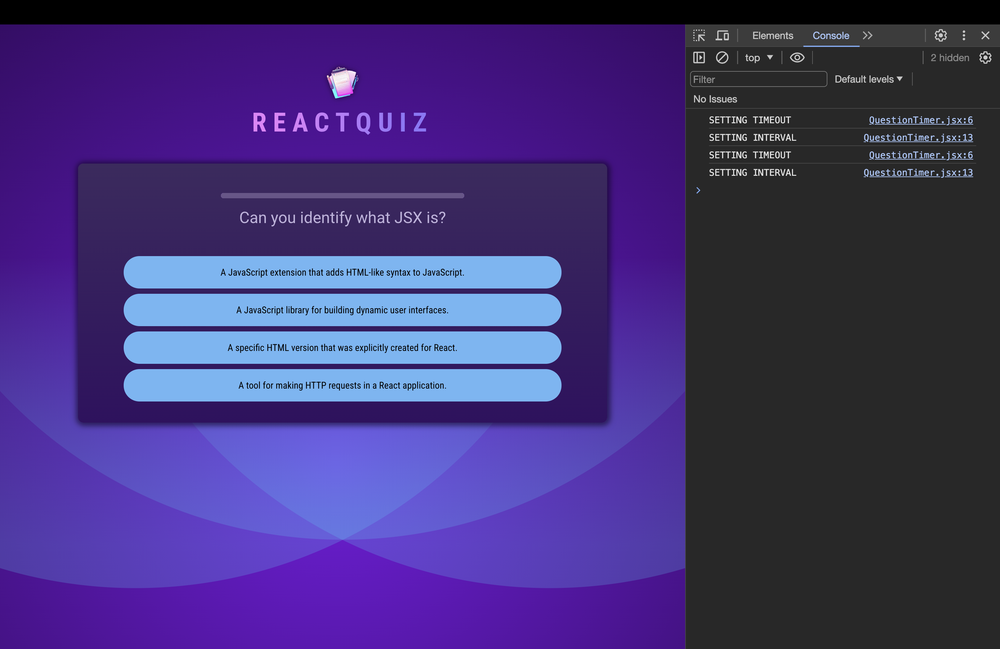
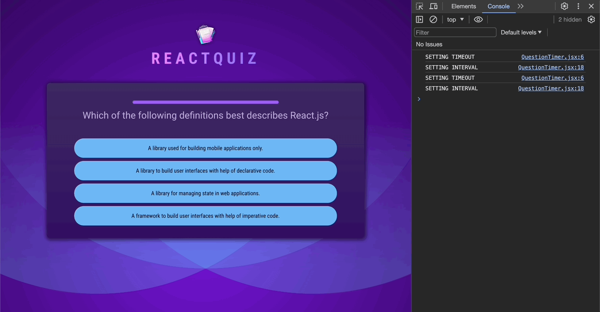
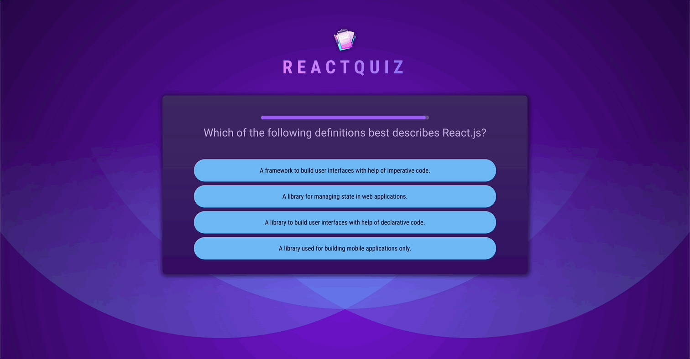

# React Practice with Effects

[📌 스스로 만들어보기](#📌-스스로-만들어보기)<br>
[📌 강사 코드](#-강사-코드)<br>
<br>

## 📌 스스로 만들어보기

### 📖 설계

#### 💎 Question.jsx

1. quizDatas.js에서 데이터를 불러온다.
2. quizDatas의 answer에 랜덤으로 id를 넣고 해당 아이디를 오름차순으로 나열한다.
3. 오름차순으로 나열된 순으로 화면에 렌더링한다. &rarr; 랜덤으로 답변의 위치를 조정함.
4. 이때, 데이터에 `isTrue` 속성을 추가하여 정답/오답을 구분할 수 있도록 하였다.

#### 💎 App.jsx

1. 퀴즈 풀고 정답/오답 기록하기

   1. 퀴즈를 풀면서 state를 변경해야한다. 해당 상태를 퀴즈에 대한 정답/오답 여부를 가려야한다.
   2. 해당 상태를 이전의 상태들을 가지고 계속 업데이트를 해야한다.
   3. 해당 상태에 대한 데이터를 컨텍스트 API를 이용한다. &rarr; prop drilling 방지

2. 풀었던 퀴즈는 나오지 않게 하기
   1. state(상태)에 해당 퀴즈의 아이디가 있는지 확인한다.
   2. 아이디가 이미 있으면 해당 문제는 건너뛴다.
   ***
   1. 처음엔 위와 같은 방법으로 했으나, 위의 방법은 로직이 끝나지도 않게 되고 이미 나왔던 문제도 계속 나오는 문제가 발생했다.
   2. 따라서 문제가 나오면 해당 문제의 아이디를 찾아서, 문제 배열을 업데이트 하는 방식(나왔던 문제 삭제)으로 변경했다.

#### 💎 Summary.jsx

1. context를 통해서 quiz정보를 받아오고 해당 정보에서 정답/오답 데이터를 가지고 연산 &rarr; 화면에 렌더링했다.

#### 💎 Question.jsx

1. 타이머 등록 -> 타이머가 끝나면 다음 문제로 넘어가고 skip으로 표현된다.
2. 의존성 배열에 아무것도 추가하지 않으면, 첫번째 skip만 되고 그 다음부터는 타이머가 동작하지 않아 skip 동작이 되지 않는다.
3. 따라서 상태에 `isSkiped` 속성을 추가하였고 skip이면 true, skip이 아니면 false로 속성값을 부여했다. &rarr; 이 속성을 의존성 배열에 추가했더니 타이머가 정상적으로 동작했다.
4. 이로써 skip, correct, incorrect에 대한 상태를 가지게 되었고 이를 이용해 Summary.jsx에 stats와 정답/오답/skip을 표시했다.

#### 💎 ProgressBar.jsx

1. Question에서 TIME 정보를 전달받고 해당 컴포넌트 안에 interval을 설정.
2. 첫 문제에서는 Progress bar가 줄어드는 것을 볼 수 있으나 두번째부터는 보이지 않았다. 콘솔로 보니 두번째부터 interval clear가 되지 않았다.
3. 따라서 progress bar에서 quiz 데이터를 받아와 해당 데이터가 변할때마다 clear 되도록 의존성 배열에 추가하였다.
4. 의존성 배열 추가로 interval clear는 되었으나 value가 다시 초기값(5000)으로 돌아오지 않고 계속 감소되었다. 따라서 interval clear하기 전에 상태를 업데이트하였다.

### 📖 결과


🔗 [레파지토리에서 코드 보기](https://github.com/Imshyeon/Develop_Study/tree/f8a3182e0fd189406d1605198c659798f4888ace/React/Complete-React/12_React-Practice-Effects)

<br>

## 📌 강사 코드

### 📖 Header.jsx

```jsx
import logoImg from "../assets/quiz-logo.png";

export default function Header() {
  return (
    <header>
      
      <h1>ReactQuiz</h1>
    </header>
  );
}
```

<br>

### 📖 Quiz.jsx

```jsx
import { useState } from "react";
import QUESTIONS from "../questions.js";

export default function Quiz() {
  const [userAnswers, setUserAnswers] = useState([]); // 답 등록
  const activeQuestionIndex = userAnswers.length;

  function handleSelectAnswer(selectedAnswer) {
    setUserAnswers((prevUserAnswers) => {
      return [...prevUserAnswers, selectedAnswer];
    });
  }

  return (
    <div id="quiz">
      <div id="question">
        <h2>{QUESTIONS[activeQuestionIndex].text}</h2>
        <ul id="answers">
          {QUESTIONS[activeQuestionIndex].answers.map((answer) => (
            <li key={answer} className="answer">
              <button onClick={() => handleSelectAnswer(answer)}>
                {answer}
              </button>
            </li>
          ))}
        </ul>
      </div>
    </div>
  );
}
```

- questions.js 파일 내의 데이터를 이용한다. 해당 데이터에서 `answers` 배열안의 첫번째 text가 문제에 대한 답이고 이를 `userAnswers` 상태에 저장/업데이트 할 것이다.
- `userAnswers`의 길이가 곧 현재 활성화 된 질문의 인덱스번호이다. &rarr; 초기에는 이 배열의 길이는 0이므로 0번째 인덱스에 접근하게 되며 0번째 인덱스의 질문이 첫번째 질문이 된다.

#### 💎 App.jsx

```jsx
import Header from "./components/Header";
import Quiz from "./components/Quiz";

function App() {
  return (
    <>
      <Header />
      <main>
        <Quiz />
      </main>
    </>
  );
}

export default App;
```

#### 💎 결과


<br>

### 📖 답변 셔플 및 퀴즈 로직 추가하기

#### 💎 Quiz.jsx

```jsx
import { useState } from "react";
import QUESTIONS from "../questions.js";
import quizComplteImg from "../assets/quiz-complete.png";

export default function Quiz() {
  const [userAnswers, setUserAnswers] = useState([]); // 답 등록
  const activeQuestionIndex = userAnswers.length;

  const quizIsComplete = activeQuestionIndex === QUESTIONS.length; // 존재하고있는 질문 양과 인덱스값이 같으면 true 반환

  function handleSelectAnswer(selectedAnswer) {
    setUserAnswers((prevUserAnswers) => {
      return [...prevUserAnswers, selectedAnswer];
    });
  }

  if (quizIsComplete) {
    return (
      <div id="summary">
        
        <h2>Quiz Completed!</h2>
      </div>
    );
  }

  // 위의 quizIsComplete와 관련된 로직 아래에 위치해야한다. 해당 부분을 먼저 검사 후 셔플을 진행 -> 화면에 렌더링하는 순서여야 함.
  // 즉 다음의 것들은 남은 질문들이 있을 때 수행되는 것이다.
  const shuffledAnswers = [...QUESTIONS[activeQuestionIndex].answers];
  shuffledAnswers.sort(() => Math.random() - 0.5);

  return (
    <div id="quiz">
      <div id="question">
        <h2>{QUESTIONS[activeQuestionIndex].text}</h2>
        <ul id="answers">
          {shuffledAnswers.map((answer) => (
            <li key={answer} className="answer">
              <button onClick={() => handleSelectAnswer(answer)}>
                {answer}
              </button>
            </li>
          ))}
        </ul>
      </div>
    </div>
  );
}
```

- `shuffledAnswers.sort(()=> Math.random() - 0.5 )`
  - 해당 배열을 수정하는 것. 새로운 배열을 추가함으로써 원본 배열을 유지.
  - `sort()` : 두 개의 요소(매개변수)가 필요하고 만약 음수를 반환하면, 해당 요소들의 위치가 바뀐다. 이에 비해 양수를 반환하면, 원래 순서를 유지한다.
  - `() => Math.random() - 0.5` ==> 반은 양수, 반은 음수로 하여 셔플할 것이다.

#### 💎 결과


<br>

### 📖 질문 타이머 추가

#### 💎 QuestionTimer.jsx

```jsx
import { useState, useEffect } from "react";
export default function QuestionTimer({ timeout, onTimeout }) {
  const [remainingTime, setRemainingTime] = useState(timeout);

  useEffect(() => {
    // onTimeout : 부모에게 넘겨서 해당 문제를 못 풀었음을 알려야함.
    setTimeout(onTimeout, timeout); // onTimeout, timeout 속성을 사용함. => 의존성이 변경되면 재실행
  }, [onTimeout, timeout]);
  // 부모 컴포넌트가 QuestionTimer의 timeout이 변경되어야 하는 지 결정하기 때문에 타이머를 초기화하고 다시 실행할 필요가 있다.

  useEffect(() => {
    setInterval(() => {
      setRemainingTime((prevRemainingTime) => prevRemainingTime - 100);
    }, 100);
  }, []);

  return <progress id="question-time" value={remainingTime} max={timeout} />;
}
```

#### 💎 Quiz.jsx

```jsx
import { useState } from "react";
import QUESTIONS from "../questions.js";
import quizComplteImg from "../assets/quiz-complete.png";
import QuestionTimer from "./QuestionTimer.jsx";

export default function Quiz() {
  const [userAnswers, setUserAnswers] = useState([]);
  const activeQuestionIndex = userAnswers.length;

  const quizIsComplete = activeQuestionIndex === QUESTIONS.length;

  function handleSelectAnswer(selectedAnswer) {
    setUserAnswers((prevUserAnswers) => {
      return [...prevUserAnswers, selectedAnswer];
    });
  }

  if (quizIsComplete) {
    return (
      <div id="summary">
        
        <h2>Quiz Completed!</h2>
      </div>
    );
  }

  const shuffledAnswers = [...QUESTIONS[activeQuestionIndex].answers];
  shuffledAnswers.sort(() => Math.random() - 0.5);

  return (
    <div id="quiz">
      <div id="question">
        {/* handleSelectAnswer(null)로 설정함으로써 해당 질문에 어떠한 답변하지 않고 넘어갔음을 상태에 알림 */}
        <QuestionTimer
          timeout={10000}
          onTimeout={() => handleSelectAnswer(null)}
        />
        <h2>{QUESTIONS[activeQuestionIndex].text}</h2>
        <ul id="answers">
          {shuffledAnswers.map((answer) => (
            <li key={answer} className="answer">
              <button onClick={() => handleSelectAnswer(answer)}>
                {answer}
              </button>
            </li>
          ))}
        </ul>
      </div>
    </div>
  );
}
```

#### 💎 결과



<br>

### 📖 Effect 의존성 & useCallback 활용법 🚨

#### 💎 QuestionTimer.jsx

```jsx
import { useState, useEffect } from "react";
export default function QuestionTimer({ timeout, onTimeout }) {
  const [remainingTime, setRemainingTime] = useState(timeout);

  useEffect(() => {
    console.log("SETTING TIMEOUT");
    setTimeout(onTimeout, timeout);
  }, [onTimeout, timeout]);

  useEffect(() => {
    console.log("SETTING INTERVAL");
    setInterval(() => {
      setRemainingTime((prevRemainingTime) => prevRemainingTime - 100);
    }, 100);
  }, []);

  return <progress id="question-time" value={remainingTime} max={timeout} />;
}
```



- 타이머에 대한 useEffect가 계속해서 실행된다는 것을 알 수 있다. &rarr; 하지만 이론상 해당 Effect 함수를 재실행되서는 안된다.
  - Quiz.jsx에서 QuestionTimer 컴포넌트는 퀴즈가 렌더링될때 한번만 렌더링되어야 한다. 그리고 그 후에 재생성되지 않는다.
  - 퀴즈 컴포넌트는 answer를 선택할 때마다 렌더링되는 것이 맞다. 그러나 QuestionTimer의 컴포넌트 인스턴스(instance)는 변경되지 않는다. 예전 JSX 코드의 일부였고 현재 새로운 JSX 코드의 일부이기 때문이다.
  - interval에 대한 Effect 함수가 다시 실행되지 않는것고 마찬가지이다.
- 타이머에 대한 Effect 함수가 재실행되는 것은 의존성과 연관있다!
  - 퀴즈 컴포넌트가 재실행될 때마다 `onTimeout={()=> handleSelectAnswer(null)}`이 재실행된다.
  - 이 부분이 타이머 재실행의 원인.

#### 💎 Quiz.jsx

```jsx
import { useState, useCallback } from "react";
import QUESTIONS from "../questions.js";
import quizComplteImg from "../assets/quiz-complete.png";
import QuestionTimer from "./QuestionTimer.jsx";

export default function Quiz() {
  const [userAnswers, setUserAnswers] = useState([]);
  const activeQuestionIndex = userAnswers.length;

  const quizIsComplete = activeQuestionIndex === QUESTIONS.length;

  const handleSelectAnswer = useCallback(function handleSelectAnswer(
    selectedAnswer
  ) {
    setUserAnswers((prevUserAnswers) => {
      return [...prevUserAnswers, selectedAnswer];
    });
  },
  []); // 여기엔 추가하지 않아도 됨.
  // handleSelectAnswer 함수에서 상태나 속성 그리고 이에 의존하는 다른 어떠한 값도 사용하고 있지 않다.
  // 상태를 업데이트하는 함수(setUserAnswers)는 추가될 필요 없다. -> 리액트가 그들이 절대 바뀌지 않도록 보장하기 때문이다.

  const handleSkipAnswer = useCallback(() => {
    handleSelectAnswer(null); // handleSelectAnswer 의존성을 사용함. => 해당 컴포넌트 함수에서 생성된 된 값이니까!
  }, [handleSelectAnswer]);

  if (quizIsComplete) {
    return (
      <div id="summary">
        
        <h2>Quiz Completed!</h2>
      </div>
    );
  }

  const shuffledAnswers = [...QUESTIONS[activeQuestionIndex].answers];
  shuffledAnswers.sort(() => Math.random() - 0.5);

  return (
    <div id="quiz">
      <div id="question">
        {/* handleSelectAnswer(null)로 설정함으로써 해당 질문에 어떠한 답변하지 않고 넘어갔음을 상태에 알림 */}
        <QuestionTimer timeout={10000} onTimeout={handleSkipAnswer} />
        <h2>{QUESTIONS[activeQuestionIndex].text}</h2>
        <ul id="answers">
          {shuffledAnswers.map((answer) => (
            <li key={answer} className="answer">
              <button onClick={() => handleSelectAnswer(answer)}>
                {answer}
              </button>
            </li>
          ))}
        </ul>
      </div>
    </div>
  );
}
```

- 타이머 업데이트하는 `onTimeout` 부분을 useCallback을 사용해야한다.
- 해당 부분은 `handleSkipAnswer` 함수로 만들었다. 또한 이 함수는 `handleSelectAnswer`을 이용해 상태를 업데이트 하므로 `handleSelectAnswer`을 의존성 추가해야 한다. &rarr; 해당 컴포넌트 함수에서 사용된 값 이니깐.
- `handleSelectAnswer`도 useCallback을 사용하되, 해당 함수는 컴포넌트에서 사용하는 상태나 속성이 없으므로 의존성을 추가하지 않는다.
  - 상태 업데이트 함수는 의존성에 추가할 필요없다. &rarr; 리액트에서 그들이 절대 바뀌지 않도록 보장하기 때문임.



- 타이머가 재생성이 되진 않지만, 타이머가 만료되도 다음 질문으로 넘어가지 않는 문제가 지속해서 발생한다.

<br>

### 📖 Effect Cleanup 함수 활용 & 컴포넌트 초기화 Key 사용법 🚨

- 콘솔을 보았을 때 SETTING INTERVAL이 두 번 작동한다는 것을 알 수 있다. &rarr; 리액트의 엄격 모드를 사용하고 있기 때문이다.
- 엄격모드는 특정한 에러를 잡아내기 위해 두 번 작동시킨다.
- 엄격모드로 인해서 interval이 두 번 생성되어 실행된다. &rarr; 더 빨리 타이머가 소진. &rarr; cleanup이 필요하다.

#### 💎 QuestionTimer.jsx

```jsx
import { useState, useEffect } from "react";
export default function QuestionTimer({ timeout, onTimeout }) {
  const [remainingTime, setRemainingTime] = useState(timeout);

  useEffect(() => {
    console.log("SETTING TIMEOUT");
    const timer = setTimeout(onTimeout, timeout);

    return () => {
      // summary에 들어가면 타이머도 사라져야 함.
      clearTimeout(timer);
    };
  }, [onTimeout, timeout]);

  useEffect(() => {
    console.log("SETTING INTERVAL");
    const interval = setInterval(() => {
      setRemainingTime((prevRemainingTime) => prevRemainingTime - 100);
    }, 100);

    return () => {
      // 클린업 함수는 Effect 함수를 다시 작동하기 전이나 컴포넌트가 DOM으로부터 삭제될 때(스크린에서 사라지면) 리액트에서 자동으로 실행됨.
      clearInterval(interval);
    };
  }, []);

  return <progress id="question-time" value={remainingTime} max={timeout} />;
}
```



- 이제 타이머가 너무 빨리 줄어들지도 않고, 해당 타이머가 끝나면 다음 문제로 넘어간다.
- 그러나 스스로 프로젝트를 만드는 과정에서 처럼 타이머와 진행표시줄이 초기화되지 않는 문제가 발생했다. &rarr; 타이머 컴포넌트가 재생성되지 않았기 때문이다.
- Quiz.jsx에서 QuestionTimer는 이전에도 DOM의 일부였고 현재도 DOM의 일부이기 때문에 바뀌지 않는다. 바뀌는 것은 오직 그 아래의 문제에 대한 정보(문제와 답변 버튼)들 뿐이다. &rarr; 그러므로 QuestionTimer는 삭제되지도 생성되지도 않는다.
- 그러나 우리는 문제가 바뀔 때마다 해당 부분이 초기화되기를 원한다!

#### 💎 Quiz.jsx

- 컴포넌트에 key를 추가함으로써 초기화될 수 있게 하자. &rarr; 🚨 스스로 만든 프로젝트에 적용 가능.
- 새로운 질문으로 교체될 때마다 타이머도 교체가 될 것이다!

```jsx
export default function Quiz() {
  return (
    <div id="quiz">
      <div id="question">
        {/* key를 부여하여 타이머도 질문이 바뀔 때마다 업데이트(초기화) 되도록 함 */}
        <QuestionTimer
          key={activeQuestionIndex}
          timeout={10000}
          onTimeout={handleSkipAnswer}
        />
        <h2>{QUESTIONS[activeQuestionIndex].text}</h2>
        <ul id="answers">
          {shuffledAnswers.map((answer) => (
            <li key={answer} className="answer">
              <button onClick={() => handleSelectAnswer(answer)}>
                {answer}
              </button>
            </li>
          ))}
        </ul>
      </div>
    </div>
  );
}
```


<br>

### 📖 선택된 답변 강조 & 추가 State 관리 🚨

#### 💎 Quiz.jsx

```jsx
import { useState, useCallback } from "react";
import QUESTIONS from "../questions.js";
import quizComplteImg from "../assets/quiz-complete.png";
import QuestionTimer from "./QuestionTimer.jsx";

export default function Quiz() {
  const [answerState, setAnswerState] = useState("");
  const [userAnswers, setUserAnswers] = useState([]);
  const activeQuestionIndex =
    answerState === "" ? userAnswers.length : userAnswers.length - 1; // 이전 질문에 머무르도록 함.
  const quizIsComplete = activeQuestionIndex === QUESTIONS.length;

  const handleSelectAnswer = useCallback(
    function handleSelectAnswer(selectedAnswer) {
      setAnswerState("answered"); // 사용자가 답변을 고른다면 해당 상태를 업데이트
      setUserAnswers((prevUserAnswers) => {
        return [...prevUserAnswers, selectedAnswer];
      });

      setTimeout(() => {
        if (selectedAnswer === QUESTIONS[activeQuestionIndex].answers[0]) {
          // 정답이면
          setAnswerState("correct");
        } else {
          // 오답이면
          setAnswerState("wrong");
        }

        setTimeout(() => {
          // 다시 답변을 초기화 함으로써 다음 질문으로 넘어가도록 함.
          setAnswerState("");
        }, 2000);
      }, 1000); // 1초 뒤에 답변에 대한 클래스 네임 추가
    },
    [activeQuestionIndex]
  ); // 현재 QUESTIONS[activeQuestionIndex].answers[0]를 사용하므로 의존성 추가 필요.
  // activeQuestionIndex 값이 변경될 때마다 재실행될 필요가 있다.

  const handleSkipAnswer = useCallback(() => {
    handleSelectAnswer(null);
  }, [handleSelectAnswer]);

  if (quizIsComplete) {
    return (
      <div id="summary">
        
        <h2>Quiz Completed!</h2>
      </div>
    );
  }

  const shuffledAnswers = [...QUESTIONS[activeQuestionIndex].answers];
  shuffledAnswers.sort(() => Math.random() - 0.5);

  return (
    <div id="quiz">
      <div id="question">
        <QuestionTimer
          key={activeQuestionIndex}
          timeout={10000}
          onTimeout={handleSkipAnswer}
        />
        <h2>{QUESTIONS[activeQuestionIndex].text}</h2>
        <ul id="answers">
          {shuffledAnswers.map((answer) => {
            // 클래스 이름 부여
            const isSelcted = userAnswers[userAnswers.length - 1] === answer;
            let cssClasses = "";
            if (answerState === "answered" && isSelcted) {
              cssClasses = "selected";
            }

            if (
              (answerState === "correct" || answerState === "wrong") &&
              isSelcted
            ) {
              cssClasses = answerState;
            }

            return (
              <li key={answer} className="answer">
                <button
                  onClick={() => handleSelectAnswer(answer)}
                  className={cssClasses}
                >
                  {answer}
                </button>
              </li>
            );
          })}
        </ul>
      </div>
    </div>
  );
}
```

- 새로운 상태를 추가한다. (`answerState`)
- 해당 상태는 초기에 빈 문자열로 되어있다. 만약 유저가 답변을 제출한 적이 없다면(첫 문제라면), activeQuestionIndex(현재 문제 인덱스)를 `userAnswers.length`로 설정한다. 그러나 만약 유저가 답변을 제출한 적이 있다면(첫 문제가 아니라면), activeQuestionIndex을 `userAnswers.length-1`로 설정하여 잠시동안 이전 문제에 머무르도록 한다.
- `handleSelectAnswer` 함수에서 상태를 업데이트한다.
  1. `setAnswerState`를 우선 `answered`로 설정한다.
  2. `setUserAnswers`를 업데이트한다.
  3. 1초 뒤에 유저가 선택한 답변(selectedAnswer)과 현재 문제에 대한 정답이 일치하다면, `setAnswerState('correct')`로 업데이트한다. 만약 일치하지 않는다면 `setAnswerState('wrong')`으로 업데이트한다.
  4. 2초 뒤, 다시 `answerState`를 빈 문자열로 추가한다. 이는 그 다음 문제로 넘어가기 위함이다.(`activeQuestionIndex` 이용함)
  5. 이때 의존성에 `activeQuestionIndex`을 추가해야한다. 해당 인덱스가 바뀔 때마다 함수를 재실행할 필요가 있기 때문이다.
- `shuffledAnswers.map()`에서 클래스를 부여하기 위한 로직을 작성한다.
  1. 만약 userAnswers에 추가된 답변이 `shuffledAnswers`의 answer 중 하나와 일치한다면 해당 답변은 `isSelected = true`가 된다.
  2. `answerState`가 `answered`이고 `isSelcted===true`라면 해당 답변 버튼의 클래스는 selected가 된다.
  3. `answerState`가 `correct`이거나 `wrong`이고 `isSelected===true`이면 해당 답변 버튼의 클래스는 `answerState`의 값이 된다.

#### 💎 결과


