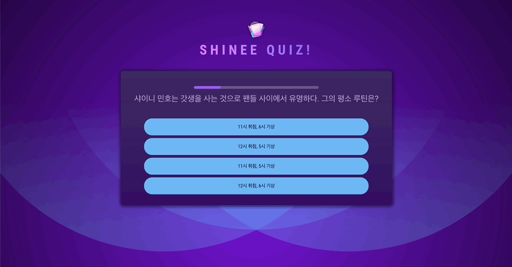
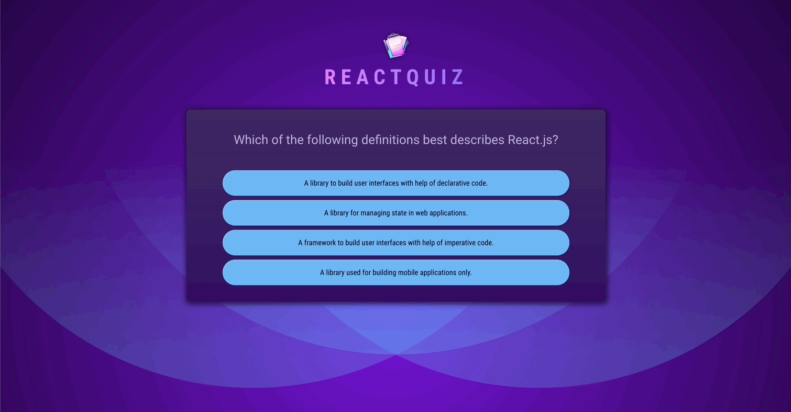
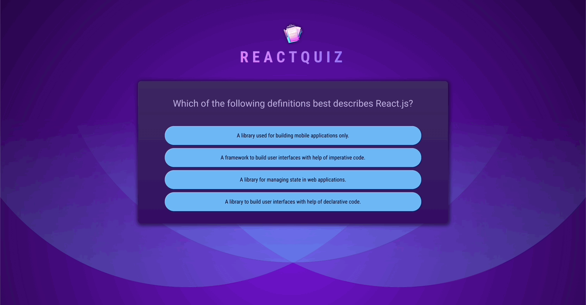

# React Practice with Effects

[📌 스스로 만들어보기](#📌-스스로-만들어보기)<br>
[📌 강사 코드](#-강사-코드)<br>
<br>

## 📌 스스로 만들어보기

### 📖 설계

#### 💎 Question.jsx

1. quizDatas.js에서 데이터를 불러온다.
2. quizDatas의 answer에 랜덤으로 id를 넣고 해당 아이디를 오름차순으로 나열한다.
3. 오름차순으로 나열된 순으로 화면에 렌더링한다. &rarr; 랜덤으로 답변의 위치를 조정함.
4. 이때, 데이터에 `isTrue` 속성을 추가하여 정답/오답을 구분할 수 있도록 하였다.

#### 💎 App.jsx

1. 퀴즈 풀고 정답/오답 기록하기

   1. 퀴즈를 풀면서 state를 변경해야한다. 해당 상태를 퀴즈에 대한 정답/오답 여부를 가려야한다.
   2. 해당 상태를 이전의 상태들을 가지고 계속 업데이트를 해야한다.
   3. 해당 상태에 대한 데이터를 컨텍스트 API를 이용한다. &rarr; prop drilling 방지

2. 풀었던 퀴즈는 나오지 않게 하기
   1. state(상태)에 해당 퀴즈의 아이디가 있는지 확인한다.
   2. 아이디가 이미 있으면 해당 문제는 건너뛴다.
   ***
   1. 처음엔 위와 같은 방법으로 했으나, 위의 방법은 로직이 끝나지도 않게 되고 이미 나왔던 문제도 계속 나오는 문제가 발생했다.
   2. 따라서 문제가 나오면 해당 문제의 아이디를 찾아서, 문제 배열을 업데이트 하는 방식(나왔던 문제 삭제)으로 변경했다.

#### 💎 Summary.jsx

1. context를 통해서 quiz정보를 받아오고 해당 정보에서 정답/오답 데이터를 가지고 연산 &rarr; 화면에 렌더링했다.

#### 💎 Question.jsx

1. 타이머 등록 -> 타이머가 끝나면 다음 문제로 넘어가고 skip으로 표현된다.
2. 의존성 배열에 아무것도 추가하지 않으면, 첫번째 skip만 되고 그 다음부터는 타이머가 동작하지 않아 skip 동작이 되지 않는다.
3. 따라서 상태에 `isSkiped` 속성을 추가하였고 skip이면 true, skip이 아니면 false로 속성값을 부여했다. &rarr; 이 속성을 의존성 배열에 추가했더니 타이머가 정상적으로 동작했다.
4. 이로써 skip, correct, incorrect에 대한 상태를 가지게 되었고 이를 이용해 Summary.jsx에 stats와 정답/오답/skip을 표시했다.

#### 💎 ProgressBar.jsx

1. Question에서 TIME 정보를 전달받고 해당 컴포넌트 안에 interval을 설정.
2. 첫 문제에서는 Progress bar가 줄어드는 것을 볼 수 있으나 두번째부터는 보이지 않았다. 콘솔로 보니 두번째부터 interval clear가 되지 않았다.
3. 따라서 progress bar에서 quiz 데이터를 받아와 해당 데이터가 변할때마다 clear 되도록 의존성 배열에 추가하였다.
4. 의존성 배열 추가로 interval clear는 되었으나 value가 다시 초기값(5000)으로 돌아오지 않고 계속 감소되었다. 따라서 interval clear하기 전에 상태를 업데이트하였다.

### 📖 결과



🔗 [레파지토리에서 코드 보기](https://github.com/Imshyeon/Develop_Study/tree/f8a3182e0fd189406d1605198c659798f4888ace/React/Complete-React/12_React-Practice-Effects)

<br>

## 📌 강사 코드

### 📖 Header.jsx

```jsx
import logoImg from "../assets/quiz-logo.png";

export default function Header() {
  return (
    <header>
      
      <h1>ReactQuiz</h1>
    </header>
  );
}
```

<br>

### 📖 Quiz.jsx

```jsx
import { useState } from "react";
import QUESTIONS from "../questions.js";

export default function Quiz() {
  const [userAnswers, setUserAnswers] = useState([]); // 답 등록
  const activeQuestionIndex = userAnswers.length;

  function handleSelectAnswer(selectedAnswer) {
    setUserAnswers((prevUserAnswers) => {
      return [...prevUserAnswers, selectedAnswer];
    });
  }

  return (
    <div id="quiz">
      <div id="question">
        <h2>{QUESTIONS[activeQuestionIndex].text}</h2>
        <ul id="answers">
          {QUESTIONS[activeQuestionIndex].answers.map((answer) => (
            <li key={answer} className="answer">
              <button onClick={() => handleSelectAnswer(answer)}>
                {answer}
              </button>
            </li>
          ))}
        </ul>
      </div>
    </div>
  );
}
```

- questions.js 파일 내의 데이터를 이용한다. 해당 데이터에서 `answers` 배열안의 첫번째 text가 문제에 대한 답이고 이를 `userAnswers` 상태에 저장/업데이트 할 것이다.
- `userAnswers`의 길이가 곧 현재 활성화 된 질문의 인덱스번호이다. &rarr; 초기에는 이 배열의 길이는 0이므로 0번째 인덱스에 접근하게 되며 0번째 인덱스의 질문이 첫번째 질문이 된다.

#### 💎 App.jsx

```jsx
import Header from "./components/Header";
import Quiz from "./components/Quiz";

function App() {
  return (
    <>
      <Header />
      <main>
        <Quiz />
      </main>
    </>
  );
}

export default App;
```

#### 💎 결과



<br>

### 📖 답변 셔플 및 퀴즈 로직 추가하기

#### 💎 Quiz.jsx

```jsx
import { useState } from "react";
import QUESTIONS from "../questions.js";
import quizComplteImg from "../assets/quiz-complete.png";

export default function Quiz() {
  const [userAnswers, setUserAnswers] = useState([]); // 답 등록
  const activeQuestionIndex = userAnswers.length;

  const quizIsComplete = activeQuestionIndex === QUESTIONS.length; // 존재하고있는 질문 양과 인덱스값이 같으면 true 반환

  function handleSelectAnswer(selectedAnswer) {
    setUserAnswers((prevUserAnswers) => {
      return [...prevUserAnswers, selectedAnswer];
    });
  }

  if (quizIsComplete) {
    return (
      <div id="summary">
        
        <h2>Quiz Completed!</h2>
      </div>
    );
  }

  // 위의 quizIsComplete와 관련된 로직 아래에 위치해야한다. 해당 부분을 먼저 검사 후 셔플을 진행 -> 화면에 렌더링하는 순서여야 함.
  const shuffledAnswers = [...QUESTIONS[activeQuestionIndex].answers];
  shuffledAnswers.sort(() => Math.random() - 0.5);

  return (
    <div id="quiz">
      <div id="question">
        <h2>{QUESTIONS[activeQuestionIndex].text}</h2>
        <ul id="answers">
          {shuffledAnswers.map((answer) => (
            <li key={answer} className="answer">
              <button onClick={() => handleSelectAnswer(answer)}>
                {answer}
              </button>
            </li>
          ))}
        </ul>
      </div>
    </div>
  );
}
```

- `shuffledAnswers.sort(()=> Math.random() - 0.5 )`
  - 해당 배열을 수정하는 것. 새로운 배열을 추가함으로써 원본 배열을 유지.
  - `sort()` : 두 개의 요소(매개변수)가 필요하고 만약 음수를 반환하면, 해당 요소들의 위치가 바뀐다. 이에 비해 양수를 반환하면, 원래 순서를 유지한다.
  - `() => Math.random() - 0.5` ==> 반은 양수, 반은 음수로 하여 셔플할 것이다.

#### 💎 결과


