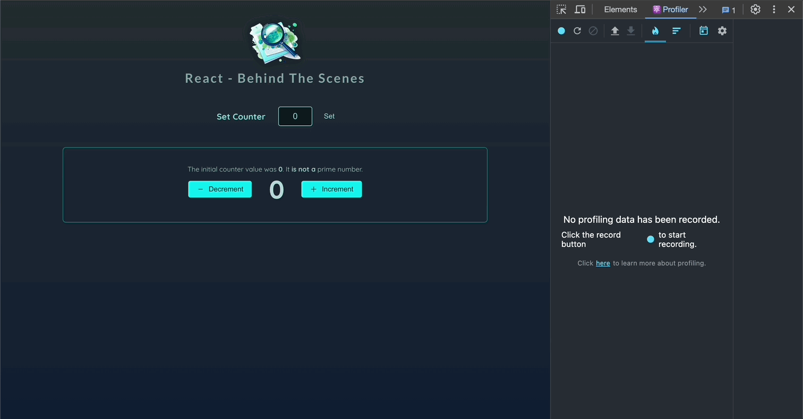
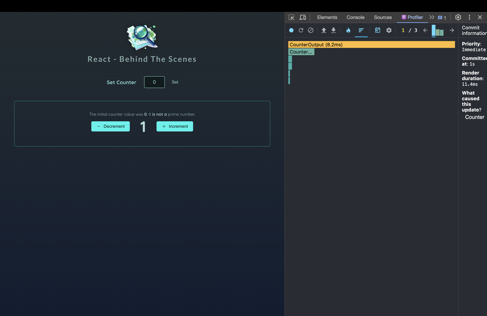
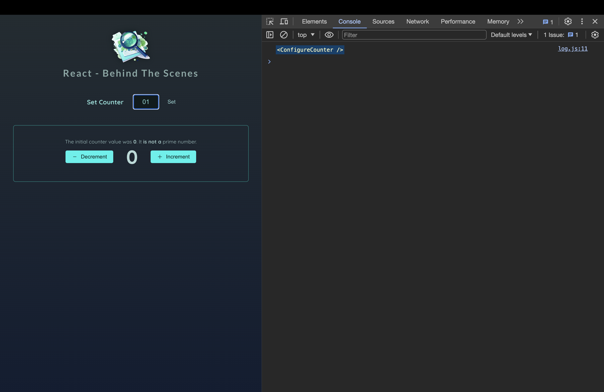
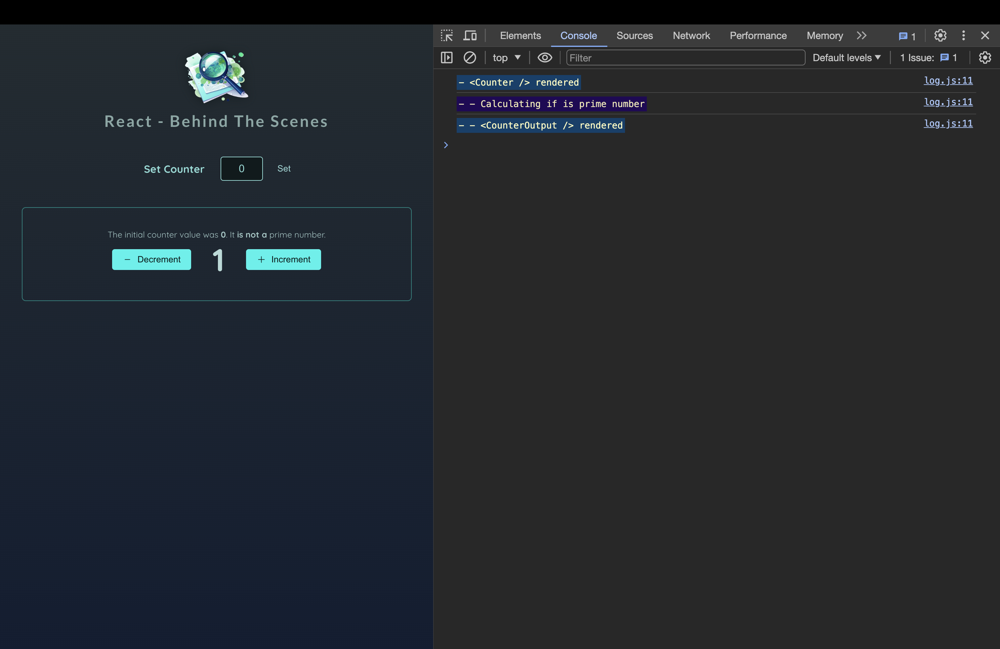
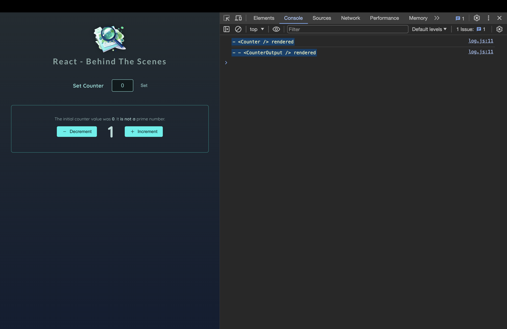
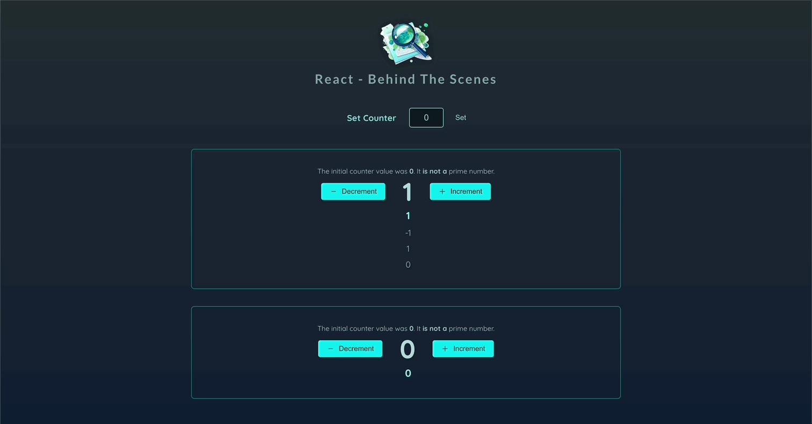

# BTS : 리액트와 최적화 테크닉

[📌 리액트는 어떻게 DOM을 업데이트 하는가?](#-리액트는-어떻게-dom을-업데이트-하는가)<br>
[📌 리액트 DevTools Profiler로 컴포넌트 함수 실행 분석하기](#-리액트-devtools-profiler로-컴포넌트-함수-실행-분석하기)<br>
[📌 재실행이 불필요한 컴포넌트 함수 실행 방지](#-재실행이-불필요한-컴포넌트-함수-실행-방지)<br>
[📌 리액트의 가상 DOM 사용하기](#-리액트의-가상-dom-사용하기)<br>
<br>

## 📌 리액트는 어떻게 DOM을 업데이트 하는가?

- 컴포넌트를 화면에 렌더링한다 === 리액트가 먼저 컴포넌트 함수들을 실행한다.
- 코드들은 순차적으로 실행한다. 만약 컴포넌트 내에 상태가 있다면, 상태는 컴포넌트에 등록. 다른 코드들을 전부 실행한다.(함수가 있다면 함수 생성) &rarr; JSX 코드 실행 &rarr;모든 컴포넌트 함수들은 렌더링될 수 있는 것들만 반환해야한다.
- JSX코드는 결과적으로 자바스크립트 코드로 변환이 되고 화면에 렌더링될 수 있는 실제 요소로 반환한다.
- JSX 코드 내에 커스텀 컴포넌트와 내장 태그(`menu`,`main`)가 있다.
- JSX 코드 내에 커스텀 컴포넌트가 있다면 리액트는 해당 컴포넌트 함수에 도달하여 그 안의 코드들을 전부 실행한다. 그 뒤에 나머지 코드를 실행한다.

<br>

> 리액트는 컴포넌트 트리를 생성한다.

- 리액트는 코드를 실행하면서 부모 컴포넌트 안에 있는 자녀 컴포넌트를 추가함으로써 결과적으로 컴포넌트 트리를 생성한다.

<br>

## 📌 리액트 DevTools Profiler로 컴포넌트 함수 실행 분석하기

- 크롬의 리액트 DevTools 확장 설치
- 개발자 창에 리액트 전용 Components, Profiler가 존재하게 된다.

### 📖 Profiler 탭

- 이 탭은 어떤 컴포넌트들이 업데이트 중이고 렌더링 중인지 알 수 있다.



- 해당 탭의 메뉴에서 불꽃 모양 버튼 &rarr; **결과를 보일때 컴포넌트 함수들이 실행된 순서가 포함되어있다. 또한 컴포넌트 함수들과의 관계도도 볼 수 있다.** - 이 프로젝트의 App이나 Header에 마우스를 올리면 **렌더링이 되지 않았다고 나온다.** &rarr; App, Header 컴포넌트 함수들이 다시 실행되지 않았기 때문이다. - Counter 컴포넌트는 렌더링 되었다. &rarr; 버튼을 클릭하여 재실행하였기 때문이다. - 컴포넌트 재평가(재실행)이 일어나면 전파하지 않는다. 그래서 리액트가 Counter 컴포넌트 함수를 재실행하는 것은 부모 컴포넌트인 App 컴포넌트에 아무런 영향을 주지 않는다.

  > 컴포넌트 재실행 : 부모 컴포넌트에는 영향이 없지만 자식 컴포넌트에는 영향을 준다
  > <br>

- 해당 탭의 메뉴에서 Rank 버튼 &rarr; **렌더링된 컴포넌트들만 볼 수 있다.**
  - 최종적으로 re-rendering 사이클에 필요한 컴포넌트들을 볼 수 있다. 이 경우에는 CounterOutput 컴포넌트이고 그 밑에는 중첩 컴포넌트들이 있다.
    

<br>

## 📌 재실행이 불필요한 컴포넌트 함수 실행 방지

- 화면에서 input에 새로운 숫자를 입력하면, 모든 컴포넌트가 재실행된다는 것을 로그를 통해 알 수 있다. &rarr; input 상태가 App 컴포넌트에 정의되어있기 떄문

### 📖 해결 방법 1 | `memo()`로 컴포넌트 함수 실행 방지하기

- `memo` : 리액트는 내장함수를 지원하기 때문에 이를 이용해 컴포넌트 함수들을 감쌀 수 있다. `memo`의 경우 불필요한 컴포넌트 함수 실행을 방지한다.
  - `memo`가 이전 속성 값과 새로받을 속성값을 살펴본다. 만약 컴포넌트 함수가 실행됐을 대 속성 값들이 완전히 동일하다면(배열과 객체가 메모리 내의 배열, 객체와 동일하다) 해당 컴포넌트 함수 실행을 `memo`가 저지한다.
  - `memo`는 오직 부모 컴포넌트에 의해 함수가 실행되었을 때만 이를 저지한다. &rarr; 컴포넌트의 속성이 변경되지 않았다면 부모 컴포넌트가 실행되도 해당 컴포넌트가 재실행될 이유가 없기 때문이다.
  - 물론 내부의 상태가 변경된다면 컴포넌트 함수는 작동한다. &rarr; 내부적인 변화는 저지하지 않음.

```jsx
import { memo } from "react";

const Counter = memo(function Counter({ prop }) {});

export default Couter;
```

- `memo`를 가지고 모든 컴포넌트를 감싸서는 안된다.
- 최대한 상위 트리에 속한 컴포넌트를 감싸라! &rarr; 최대한 상위 트리를 감싸야 그 아래에 있는 중첩 컴포넌트들 또한 재실행되지 않기 때문!
- 자주 속성이 바뀌는 컴포넌트에는 사용해선 안된다. `memo`를 가지고 속성을 체크하는 것은 성능에 영향을 준다!

<br>

### 📖 컴포넌트 함수 실행을 방지하기 위한 구조

- `memo`보다 더 강력한 방법. &rarr; 컴포넌트 분리하기
- 컴포넌트를 분리하였다면 `memo`를 없애야 한다!

#### 💎 ConfigureCounter.jsx

```jsx
import { useState } from "react";
import { log } from "../../log";

export default function ConfigureCounter({ onSet }) {
  log("<ConfigureCounter />");

  const [enteredNumber, setEnteredNumber] = useState(0);

  function handleChange(event) {
    setEnteredNumber(+event.target.value);
  }

  function handleSetClick() {
    onSet(enteredNumber);
    setEnteredNumber(0);
  }

  return (
    <section id="configure-counter">
      <h2>Set Counter</h2>
      <input type="number" onChange={handleChange} value={enteredNumber} />
      <button onClick={handleSetClick}>Set</button>
    </section>
  );
}
```

#### 💎 App.jsx

```jsx
import { useState } from "react";

import Counter from "./components/Counter/Counter.jsx";
import Header from "./components/Header.jsx";
import ConfigureCounter from "./components/Counter/ConfigureCounter.jsx";
import { log } from "./log.js";

function App() {
  log("<App /> rendered");

  const [chosenCount, setChosenCount] = useState(0);

  function handleSetCount(newCount) {
    setChosenCount(newCount);
  }

  return (
    <>
      <Header />
      <main>
        <ConfigureCounter onSet={handleSetCount} />
        <Counter initialCount={chosenCount} />
      </main>
    </>
  );
}

export default App;
```



<br>

### 📖 `useCallback()` 훅 이해하기

- IconButton.jsx에서 속성은 `children, icon, ...props`가 있다.
- `children`은 텍스트이고 이 값은 변하지 않는다.
- `icon` 속성은 Counter 속성에서 포인터(pointer, ex. `MinusIcon, PlusIcon`)를 받는다. 컴포넌트의 이름으로만 전달하고 IconButton.jsx에 와서야 JSX코드로 바뀌게 된다. &rarr; 포인터(함수들의 이름)들은 바뀌지 않는 성질을 갖는다.
- `...props`에는 나머지 속성들을 가지는데, Counter 컴포넌트에서 IconButton에게 onClick 속성을 전달한다.
  - onClick에는 함수의 포인터를 전달하는데, 해당 함수는 Counter 컴포넌트에서 생성된다.
  - 함수는 객체로 해당 컴포넌트가 재생성될 때 함수의 주소 또한 변경된다. &rarr; 새 속성 값이 된다.
  - 이렇게 함수의 포인터를 변경하는 것을 막는 훅이 바로 `useCallback`이다.

#### 💎 useCallback 이용하기

```jsx
// IconButton.jsx -> memo 사용
import { memo } from "react";
import { log } from "../../log.js";

const IconButton = memo(function IconButton({ children, icon, ...props }) {
  log("<IconButton /> rendered", 2);

  const Icon = icon;
  return (
    <button {...props} className="button">
      <Icon className="button-icon" />
      <span className="button-text">{children}</span>
    </button>
  );
});
export default IconButton;


// Counter.jsx
import { useState, memo, useCallback } from "react";

import IconButton from "../UI/IconButton.jsx";
import MinusIcon from "../UI/Icons/MinusIcon.jsx";
import PlusIcon from "../UI/Icons/PlusIcon.jsx";
import CounterOutput from "./CounterOutput.jsx";
import { log } from "../../log.js";

function isPrime(number) {
  log("Calculating if is prime number", 2, "other");
  if (number <= 1) {
    return false;
  }

  const limit = Math.sqrt(number);

  for (let i = 2; i <= limit; i++) {
    if (number % i === 0) {
      return false;
    }
  }

  return true;
}

export default function Counter({ initialCount }) {
  log("<Counter /> rendered", 1);
  const initialCountIsPrime = isPrime(initialCount);

  const [counter, setCounter] = useState(initialCount);

  const handleDecrement = useCallback(function handleDecrement() {
    setCounter((prevCounter) => prevCounter - 1);
  }, []);

  const handleIncrement = useCallback(function handleIncrement() {
    setCounter((prevCounter) => prevCounter + 1);
  }, []);

  return (
    <section className="counter">
      <p className="counter-info">
        The initial counter value was <strong>{initialCount}</strong>. It{" "}
        <strong>is {initialCountIsPrime ? "a" : "not a"}</strong> prime number.
      </p>
      <p>
        <IconButton icon={MinusIcon} onClick={handleDecrement}>
          Decrement
        </IconButton>
        <CounterOutput value={counter} />
        <IconButton icon={PlusIcon} onClick={handleIncrement}>
          Increment
        </IconButton>
      </p>
    </section>
  );
}
```

- `useCallback` : 함수의 재생성 방지를 위해 사용.
  1. memo를 사용하여 불필요한 컴포넌트 재실행을 방지하기 위해 사용.
  2. useEffect의 의존성으로 함수를 가지고 있을 때 사용된다.



Increment, Decrement 버튼을 눌러도 불필요하게 IconButton이 재실행되지 않는다.

<br>

### 📖 `useMemo()` 훅 이해하기

Counter.jsx의 `isPrime()`함수가 Increment, Decrement 버튼을 누를 때마다 재실행되는 것을 알 수 있다.(Calculation if is prime number log로 확인 가능.)

- 해당 함수는 Counter 컴포넌트의 `initialCount` 속성을 입력값으로 받고 그에 대한 리턴값을 제공한다.
- 이 값은 오로지 input에서 새로운 값을 입력하고 Set 버튼을 누를 때만 바뀌게 된다.
- 그러므로 입력값이 변하지 않는 이상 해당 함수를 굳이 실행될 필요가 없다. &rarr; `useMemo`훅을 이용해 불필요한 일반 함수의 재실행도 방지

> `memo`는 컴포넌트 함수를 감싸는데 사용하고, `useMemo`는 컴포넌트 안에 있는 일반 함수들을 감싸고 그들의 실행을 방지한다. 이 `useMemo`는 복잡한 계산이 있을 때만 사용해야 한다.

#### 💎 Counter.jsx

```jsx
import { useState, memo, useCallback, useMemo } from "react";

import IconButton from "../UI/IconButton.jsx";
import MinusIcon from "../UI/Icons/MinusIcon.jsx";
import PlusIcon from "../UI/Icons/PlusIcon.jsx";
import CounterOutput from "./CounterOutput.jsx";
import { log } from "../../log.js";

function isPrime(number) {
  log("Calculating if is prime number", 2, "other");
  if (number <= 1) {
    return false;
  }

  const limit = Math.sqrt(number);

  for (let i = 2; i <= limit; i++) {
    if (number % i === 0) {
      return false;
    }
  }

  return true;
}

const Counter = memo(function Counter({ initialCount }) {
  log("<Counter /> rendered", 1);
  const initialCountIsPrime = useMemo(
    () => isPrime(initialCount),
    [initialCount]
  );
  // 의존성이 없다면 다시 재실행하지 않음(바뀔 수 있는 의존성이 없으니까)
  // 여기서는 initialPrime이 바뀌면 해당 Memo함수가 실행되니까 의존성에 넣어줘야 한다.

  const [counter, setCounter] = useState(initialCount);

  const handleDecrement = useCallback(function handleDecrement() {
    setCounter((prevCounter) => prevCounter - 1);
  }, []);

  const handleIncrement = useCallback(function handleIncrement() {
    setCounter((prevCounter) => prevCounter + 1);
  }, []);

  return (
    <section className="counter">
      <p className="counter-info">
        The initial counter value was <strong>{initialCount}</strong>. It{" "}
        <strong>is {initialCountIsPrime ? "a" : "not a"}</strong> prime number.
      </p>
      <p>
        <IconButton icon={MinusIcon} onClick={handleDecrement}>
          Decrement
        </IconButton>
        <CounterOutput value={counter} />
        <IconButton icon={PlusIcon} onClick={handleIncrement}>
          Increment
        </IconButton>
      </p>
    </section>
  );
});
export default Counter;
```



- `useMemo`를 너무 남용해선 안된다. `memo`처럼 의존성 값 비교를 계속해서 수행하기 때문이다!

<br>

## 📌 리액트의 가상 DOM 사용하기

- 컴포넌트가 재실행됐다고해서 컴포넌트 함수가 생성한 모든 JSX 코드가 DOM으로 재삽입되지 않는다.
- 리액트가 가상 DOM을 사용해서 실제 DOM의 어떤 부분들이 업데이트되어야 하는지 찾는다. 
- 가상 DOM을 사용하면 이는 메모리 안에서만 존재하고, 실제 DOM을 사용하는 것보다 훨씬 빠르다.
- 리액트는 컴포넌트 트리를 만들고 마지막에는 렌더링되어야 하는 실제 HTML 코드를 그 컴포넌트 트리로부터 전달한다. 그리고 가상 DOM 스냅샷(snapshot)을 생성한다. 실제 DOM이 어떻게 보여져야하는지 가상으로 정의하는 것이다.
- 그 다음, 리액트는 생성됐었던 마지막 가상 DOM 스냅샷과 비교한다.(초기에는 이전 스냅샷이 없으므로 리액트는 전부 바뀐 것으로 판단한다.)
> 리액트는 트리에서 변경된 부분을 파악하고 실행된 컴포넌트 함수들만 찾는다. 그리고 업데이트된 HTML코드를 전달 &rarr; 이전 가상 DOM과 비교 &rarr; 변동사항들을 실제 DOM에 적용한다.  

<br>

### 📖 State를 관리할 때 Key의 역할

- 상태(State)는 해당 상태가 정의된 컴포넌트의 범위 내에 속해있다. &rarr; 컴포넌트를 재사용할 때마다 재생성이 된다.
- 위와 같은 특징을 통해서 상태를 가진 컴포넌트를 재활용할 수 있는 것이다.
- 리액트는 컴포넌트 트리에서 컴포넌트 타입과 위치에 의해 상태를 추적한다.(React tracks state by component type & position(of that component) in the tree.)



- 위의 사진에서, counterHistory에 -1을 선택했고 증가/감소 버튼을 누르면 선택된 -1이 계속 고정이 되는 것이 아니라 이동하는 것을 볼 수 있다.
- 이는 ComponentHistory의 컴포넌트 인스턴스 위치가 바뀌기 때문이다. (새로운 요소를 추가할 수록 선택된 요소가 아래로 내려감)
- 이러한 동작을 피하기 위해서 리액트는 키(Key)를 제공한다. 키는 리액트에서 상태를 구체적인 컴포넌트 인스턴스에 매핑할 때 고려되는 요소이다.

```jsx
// CounterHistory.jsx
export default function CounterHistory({ history }) {
  log('<CounterHistory /> rendered', 2);

  return (
    <ol>
      {history.map((count, index) => (
        <HistoryItem key={index} count={count} />
      ))}
    </ol>
  );
}
```
- 여기서 HistoryItem에 대한 key값을 index로 설정했다. 해당 인덱스를 키로 설정했기 때문에 제대로 아이템 선택이 되지 않았다. &rarr; 꼭 특정 값과 연결된 키 값을 써야한다.

#### 💎 Counter.jsx에서 특정한 키 값 설정하기

```jsx

```