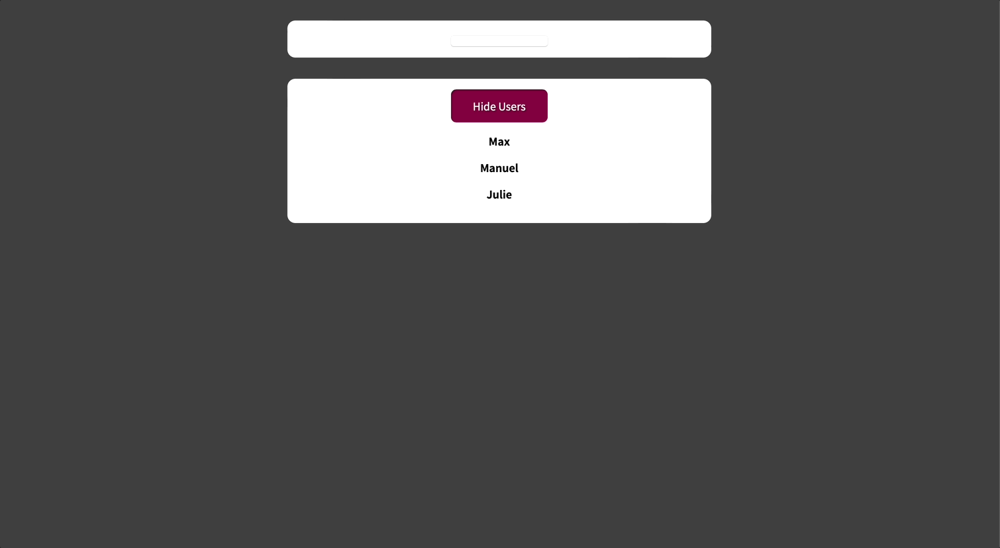

# Class-based Components

[📌 클래스 기반 컴포넌트](#-클래스-기반-컴포넌트)<br>
<br>

## 📌 클래스 기반 컴포넌트

**_이 클래스 기반 컴포넌트는 언제까지나 선택사항이고 대부분의 모던 리액트 프로젝트들은 이전에 배웠던 것처럼 함수형 컴포넌트를 구축할 것이다 리액트 훅의 영향으로 인한 것이다._**

- 클래스 기반 컴포넌트는 리액트 훅을 사용할 수 없다.
- 클래스 기반 컴포넌트는 함수형 컴포넌트와 함께 사용할 수 있다. 결론적으로 함수형/클래스 기반 둘 다 컴포넌트이다.

### 📖 클래스 기반 컴포넌트 추가하기

```jsx
// User.jsx
import { Component } from "react";
import classes from "./User.module.css";

class User extends Component {
  render() {
    // 함수형 컴포넌트에서의 반환 문장과 동일.
    return <li className={classes.user}>{this.props.name}</li>;
    // this.props : Component를 상속받은 모든 props 포함
  }
}

// 위의 클래스 기반 컴포넌트와 동일하다.
// const User = (props) => {
//   return <li className={classes.user}>{props.name}</li>;
// };

export default User;
```

<br>

### 📖 State 및 이벤트 작업하기

#### 💎 Users.js

```javascript
import { useState, Component } from "react";
import User from "./User";

import classes from "./Users.module.css";

const DUMMY_USERS = [
  { id: "u1", name: "Max" },
  { id: "u2", name: "Manuel" },
  { id: "u3", name: "Julie" },
];

class Users extends Component {
  constructor() {
    super(); // 상위 클래스를 상속받았으니까.
    // state 정의 - 항상 객체이다. 함수형에서는 숫자, 문자열, 객체 등으로 유연한 것과는 다르다.
    this.state = {
      showUsers: true,
      more: "Test",
    };
  }

  #toggleUsersHandler() {
    this.setState((curState) => {
      return { showUsers: !curState.showUsers };
    }); // 컴포넌트에서 상속받은 메서드 - 항상 객체 사용. 갱신 함수도 지원한다.
    // 리액트가 백그라운드에서 현재 존재하는 상태와 전달하려는 객체를 결합한다. -> 기존 상태를 오버라이드하지 않고 병합을 하는 방식.
  }

  render() {
    const usersList = (
      <ul>
        {DUMMY_USERS.map((user) => (
          <User key={user.id} name={user.name} />
        ))}
      </ul>
    );

    return (
      <div className={classes.users}>
        {/* 메서드 내부의 this 예약어가 코드가 평가될 시점의 동일한 값이나 동일한 내용을 갖도록 bind(this)를 통해 설정. */}
        <button onClick={this.#toggleUsersHandler.bind(this)}>
          {this.state.showUsers ? "Hide" : "Show"} Users
        </button>
        {this.state.showUsers && usersList}
      </div>
    );
  }
}

export default Users;
```

1. `constructor` 메서드 안에서 state를 정의한다. 함수형 컴포넌트에서 state는 숫자, 문자열, 객체 등으로 유연하게 초기화할 수 있었던 반면에 클래스 기반 컴포넌트는 상태를 객체로만 초기화해야한다.
2. 상태 업데이트 함수는 상속받은 `Component`에서의 `setState` 메서드를 사용한다. 해당 메서드도 객체를 받으며 오버라이드 방식이 아닌 병합하는 방식으로 업데이트를 한다. 또한 함수형 컴포넌트처럼 이전 상태를 반영하기 위한 갱신 함수도 지원한다.
3. 이벤트를 작동시킬 때 `bind` 함수를 이용해서 메서드 내부의 this 예약어가 코드가 평가될 시점과 동일한 값/내용을 갖도록 설정을 해야한다.

<br>

### 📖 컴포넌트 수명 주기 | 클래스 컴포넌트에만 해당된다.

- 클래스 컴포넌트에서는 리액트 훅을 사용할 수 없다. 대신 컴포넌트 생명 주기라는 것이 있다.
- `componentDidMount()` : `render()` 메서드와 같은 내장 함수로 리액트에서 import 해온 내장 컴포넌트를 확장하면 바로 사용 가능하다. 이 메서드를 사용하면 리액트가 컴포넌트가 마운트된 직후에 이 메서드를 호출할 것이다. &rarr; 즉 컴포넌트가 평가되고 DOM에 렌더링될 때 실행. `useEffect(..., [])`를 사용한 것과 같다.
- `componentDidUpdate()` : 컴포넌트가 갱신되면 호출된다. 상태값같은 것이 변경되면 컴포넌트가 재평가, 재렌더링되면 그떄 호출된다. 이는 `useEffect(..., [someValues])`와 같다. 의존성 배열이 변경되면 Effect 함수 실행!
- `componentWillUnmount()` : 컴포넌트가 DOM에서 삭제되기 직전에 호출되며 useEffect()에 있는 cleanup 함수와 같다. `useEffect(()=>{return ()=>{...}}, [])`. cleanup 함수는 Effect 함수가 다시 실행되기 직전에 호출되며 항상 컴포넌트가 DOM으로부터 삭제되기 전에 다시 호출한다.

#### 💎 Users.js

```javascript
render() {
    const usersList = (
      <ul>
        {this.props.users.map((user) => (
          <User key={user.id} name={user.name} />
        ))}
      </ul>
    );

    return (
      <div className={classes.users}>
        {/* 메서드 내부의 this 예약어가 코드가 평가도리 시점의 동일한 값이나 동일한 내용을 갖도록 bind(this)를 통해 설정. */}
        <button onClick={this.#toggleUsersHandler.bind(this)}>
          {this.state.showUsers ? "Hide" : "Show"} Users
        </button>
        {this.state.showUsers && usersList}
      </div>
    );
  }
```

- render() 함수에서 유저 정보를 하드코딩으로 받아오는 대신 this.props.users를 통해 받아오도록 함. 왜냐하면 UserFinder.js에서 users라는 속성을 통해 유저 정보를 전달하기 때문이다.

<br>

#### 💎 UserFinder.js

```javascript
import { Fragment, Component } from "react";

import Users from "./Users";
import classes from "./UserFinder.module.css";

const DUMMY_USERS = [
  { id: "u1", name: "Max" },
  { id: "u2", name: "Manuel" },
  { id: "u3", name: "Julie" },
];

class UserFinder extends Component {
  constructor() {
    super();
    this.state = {
      filteredUsers: DUMMY_USERS,
      searchTerm: "",
    };
  }

  componentDidUpdate(prevProps, prevState) {
    // 상태 변화로 인해 컴포넌트가 재평가되면 자동적으로 호출.
    //-> 의존성을 추가하여 의존성 배열에 있는 조건이 변화되면 그때 이 메서드 실행하도록 함.
    if (prevState.searchTerm !== this.state.searchTerm) {
      this.setState({
        filteredUsers: DUMMY_USERS.filter((user) =>
          user.name.includes(this.state.searchTerm)
        ),
      });
    }
  } // effect 함수는 의존성 배열이 변경된 경우에만 리액트에 의해 실행. -> 훨씬 간단하고 가독성이 좋다.

  #searchChangeHandler(event) {
    this.setState({
      searchTerm: event.target.value,
    });
  }

  render() {
    return (
      <Fragment>
        <div className={classes.finder}>
          <input
            type="search"
            onChange={this.#searchChangeHandler.bind(this)}
          />
        </div>
        <Users users={this.state.filteredUsers} />
      </Fragment>
    );
  }
}

export default UserFinder;
```



<br>

### 📖 클래스 컴포넌트 및 Context

#### 💎 UserFinder.js

```javascript
import { Fragment, useState, useEffect, Component } from "react";

import Users from "./Users";
import classes from "./UserFinder.module.css";

import UsersContext from "../store/users-context.js";

class UserFinder extends Component {
  // 클래스 컴포넌트는 한번에 하나의 컨텍스트만 연결 가능.
  static contextType = UsersContext; // 이 컴포넌트는 해당 컨텍스트에 접근 가능하다. 정적 프로퍼티는 한번만 설정 가능하다.

  constructor() {
    super();
    this.state = {
      filteredUsers: [],
      searchTerm: "",
    };
  }

  componentDidMount() {
    // http 요청을 보내서 받는 경우.. => 가장 처음 렌더링을 했을 때 실행. useEffect에서 의존성 배열이 빈 경우이다.
    this.setState({ filteredUsers: this.context.users });
  }

  componentDidUpdate(prevProps, prevState) {
    // 상태 변화로 인해 컴포넌트가 재평가되면 자동적으로 호출.
    //-> 의존성을 추가하여 의존성 배열에 있는 조건이 변화되면 그때 이 메서드 실행하도록 함.
    if (prevState.searchTerm !== this.state.searchTerm) {
      this.setState({
        // this.context.users를 통해서 컨텍스트에 접근
        filteredUsers: this.context.users.filter((user) =>
          user.name.includes(this.state.searchTerm)
        ),
      });
    }
  } // effect 함수는 의존성 배열이 변경된 경우에만 리액트에 의해 실행. -> 훨씬 간단하고 가독성이 좋다.

  #searchChangeHandler(event) {
    this.setState({
      searchTerm: event.target.value,
    });
  }

  render() {
    return (
      <Fragment>
        <div className={classes.finder}>
          <input
            type="search"
            onChange={this.#searchChangeHandler.bind(this)}
          />
        </div>
        <Users users={this.state.filteredUsers} />
      </Fragment>
    );
  }
}

export default UserFinder;
```

- 클래스 컴포넌트는 컨텍스트 하나만 접근 가능하다. 함수형 컴포넌트에 비해서 유연성이 떨어짐.

