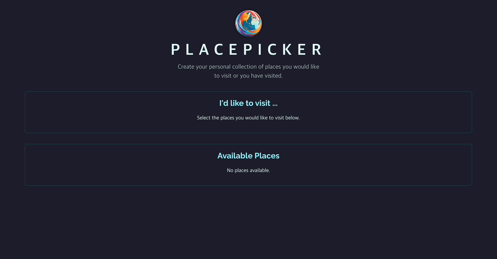
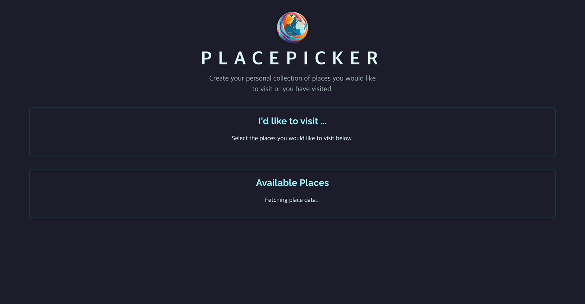
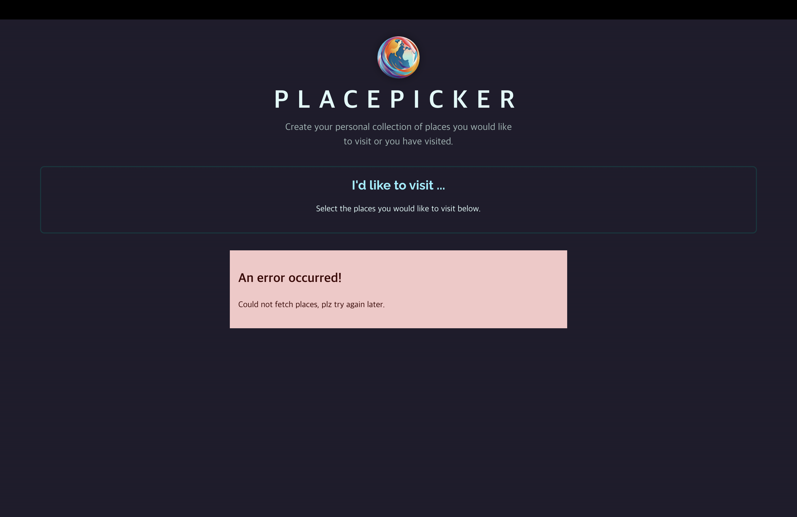
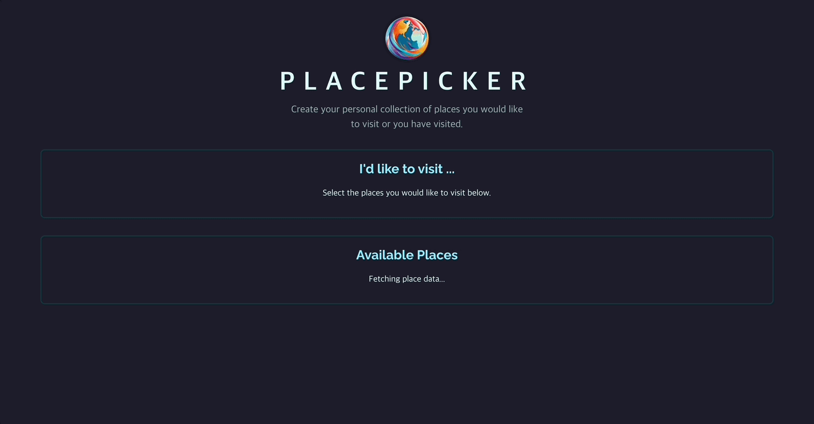

# Data Fetching & HTTP Requests

[📌 데이터베이스 연결/해지하는 방법](#-데이터베이스-연결해지하는-방법)<br>
[📌 초기 프로젝트 & 임시 백엔드 API 사용하기](#-초기-프로젝트--임시-백엔드-api-사용하기)<br>
[📌 리액트 앱 - 백엔드 앱 연결하기](#-리액트-앱---백엔드-앱-연결하기)<br>
<br>

## 📌 리액트 앱과 데이터베이스 연결/해지하는 방법

- 직접적으로는 하지 않는다. 직접하면 보안 상의 이슈가 있기 때문!
- 데이터베이스나 공유된 데이터를 담은 파일 시스템에 직접 접근하는 것보다 백엔드 서버와 소통하는 것이 좋다.
- 프론트와 백엔드를 연결하기 위해선 HTTP Request를 통해야 한다.
- HTTP 요청을 보낼 때 백엔드가 허용하거나 수락한 것만 보낼 수 있다. 백엔드가 특정 요청을 거부한다면 해당 요청은 불가능하다.

## 📌 초기 프로젝트 & 임시 백엔드 API 사용하기

1. `npm install`
2. `npm run dev`
3. backend/app.js

```javascript
import fs from "node:fs/promises";

import bodyParser from "body-parser";
import express from "express";

const app = express();

app.use(express.static("images"));
app.use(bodyParser.json());

// CORS

app.use((req, res, next) => {
  res.setHeader("Access-Control-Allow-Origin", "*"); // allow all domains
  res.setHeader("Access-Control-Allow-Methods", "GET, PUT");
  res.setHeader("Access-Control-Allow-Headers", "Content-Type");

  next();
});

app.get("/places", async (req, res) => {
  const fileContent = await fs.readFile("./data/places.json");

  const placesData = JSON.parse(fileContent);

  res.status(200).json({ places: placesData });
});

app.get("/user-places", async (req, res) => {
  const fileContent = await fs.readFile("./data/user-places.json");

  const places = JSON.parse(fileContent);

  res.status(200).json({ places });
});

app.put("/user-places", async (req, res) => {
  const places = req.body.places;

  await fs.writeFile("./data/user-places.json", JSON.stringify(places));

  res.status(200).json({ message: "User places updated!" });
});

// 404
app.use((req, res, next) => {
  if (req.method === "OPTIONS") {
    return next();
  }
  res.status(404).json({ message: "404 - Not Found" });
});

app.listen(3000);
```

🔗 [HTTP 개요](https://developer.mozilla.org/ko/docs/Web/HTTP/Overview)<br>
🔗 [GET 메서드](https://developer.mozilla.org/ko/docs/Web/HTTP/Methods/GET)<br>
🔗 [POST 메서드](https://developer.mozilla.org/ko/docs/Web/HTTP/Methods/POST)

<br>

## 📌 리액트 앱 - 백엔드 앱 연결하기

### 📖 앱의 데이터 Fetching을 위한 준비

`npm run dev`를 한 터미널 이외에 다른 터미널은 연 뒤 다음의 명령어 실행

1. `cd ./backend`
2. `node app.js` : 백엔드 서버 시작

이렇게 실행 중이 두 프로세스 모두 백엔드에 연결해야 한다.

#### 💎 Available Places를 Fetching 하기

- 리액트 코드 내에서 HTTP 요청을 백엔드 코드로 보내서 데이터 목록을 가져올 것이다.
  <br>

- localStorage는 동기적으로 데이터를 바로 받아올 수 있다. 하지만 백엔드를 이렇게 데이터를 받을 수 없다.
- 인터넷을 통해서(HTTP 요청) 오기 때문에 약간의 시간차가 발생한다. &rarr; 동기적으로는 안되고 비동기적으로 처리해야한다.

```jsx
// src/component/AvailablePlaces.jsx
import { useState } from "react";
import Places from "./Places.jsx";

const places = localStorage.getItem("places");

export default function AvailablePlaces({ onSelectPlace }) {
  //const [availablePlaces, setAvailablePlaces] = useState(places); // 로컬 사용하는 경우
  // 비동기적으로 사용한다 = 데이터를 가져오고 나서야 상태를 업데이트 하겠다. 라는 의미
  const [availablePlaces, setAvailablePlaces] = useState([]);

  return (
    <Places
      title="Available Places"
      places={availablePlaces}
      fallbackText="No places available."
      onSelectPlace={onSelectPlace}
    />
  );
}
```

<br>

### 📖 HTTP 요청을 보내기

```js
// backend/app.js
app.get("/places", async (req, res) => {
  const fileContent = await fs.readFile("./data/places.json");

  const placesData = JSON.parse(fileContent);

  res.status(200).json({ places: placesData });
});

// src/component/AvailablePlaces.jsx
import { useState } from "react";
import Places from "./Places.jsx";

export default function AvailablePlaces({ onSelectPlace }) {
  const [availablePlaces, setAvailablePlaces] = useState([]);

  // 1. then을 이용하는 방법 - await/async를 사용하는 방법도 있다.
  fetch("http://localhost:3000/places")
    .then((response) => {
      return response.json(); // json 형식의 데이터를 뽑아온다. => 이 메서드는 또다른 프로미스를 반환
    })
    .then((resData) => {
      setAvailablePlaces(resData.places);
    }); // 브라우저 제공 : HTTP 요청을 다른 서버들로 보낸다.
  // fetch를 프로미스를 반환. Promise가 response 객체를 감싼다.

  return (
    <Places
      title="Available Places"
      places={availablePlaces}
      fallbackText="No places available."
      onSelectPlace={onSelectPlace}
    />
  );
}
```

- 그러나 위처럼 코드를 작성하면 무한루프에 빠진다. &rarr; 컴포넌트 함수에 직접적으로 fetch를 써서 불러오면, 컴포넌트 함수가 실행될 때마다 계속 실행될 것이다.
- 따라서 useEffect를 사용해서 무한 루프를 방지할 수 있다.

<br>

### 📖 useEffect로 HTTP 요청(GET 요청) 전송하기

#### 💎 AvailablePlaces.jsx

```jsx
// src/components/AvailablePlaces.jsx
import { useState, useEffect } from "react";
import Places from "./Places.jsx";

export default function AvailablePlaces({ onSelectPlace }) {
  const [availablePlaces, setAvailablePlaces] = useState([]);

  useEffect(() => {
    fetch("http://localhost:3000/places")
      .then((response) => {
        return response.json();
      })
      .then((resData) => {
        setAvailablePlaces(resData.places);
      });
  }, []); // 컴포넌트가 실행된 이후에 실행한다. 의존성은 비어있어야 한다. 딱 한번 처음에 실행된다.

  return (
    <Places
      title="Available Places"
      places={availablePlaces}
      fallbackText="No places available."
      onSelectPlace={onSelectPlace}
    />
  );
}
```

#### 💎 이미지 처리하기

```json
// backend/data/places.json
[
  {
    "id": "p1",
    "title": "Forest Waterfall",
    "image": {
      "src": "forest-waterfall.jpg",
      "alt": "A tranquil forest with a cascading waterfall amidst greenery."
    },
    "lat": 44.5588,
    "lon": -80.344
  },...
]
```

- 이 데이터에서 보면 image의 src는 단순히 이미지 파일의 이름만을 담고있다.
- 이미지를 사용할 때 단순히 이미지 폴더로 직접 요청해서 보낼 수 없다.
- 왜냐하면 기본적으로 모든 백엔드 프로젝트 코드와 파일 구조는 이용자가 접근할 수 없기 때문이다.

```jsx
// src/components/Places.jsx
export default function Places({ title, places, fallbackText, onSelectPlace }) {
  console.log(places);
  return (
    <section className="places-category">
      <h2>{title}</h2>
      {places.length === 0 && <p className="fallback-text">{fallbackText}</p>}
      {places.length > 0 && (
        <ul className="places">
          {places.map((place) => (
            <li key={place.id} className="place-item">
              <button onClick={() => onSelectPlace(place)}>
                {/* src={place.img.src}에서 다음과 같이 변경 */}
                
                <h3>{place.title}</h3>
              </button>
            </li>
          ))}
        </ul>
      )}
    </section>
  );
}
```

- localhost:3000으로 백엔드를 가리키는 URL을 작성한 뒤 place.image.src로 파일이름을 지정하면 이미지가 정상적으로 파일 요청을 보내고 받을 것이다.

#### 💎 결과



<br>

### 📖 `async / await` 사용하기

#### 💎 AvailablePlaces.jsx

```jsx
import { useState, useEffect } from "react";
import Places from "./Places.jsx";

export default function AvailablePlaces({ onSelectPlace }) {
  const [availablePlaces, setAvailablePlaces] = useState([]);

  useEffect(() => {
    async function fetchPlaces() {
      const response = await fetch("http://localhost:3000/places");
      const resData = await response.json();
      setAvailablePlaces(resData.places);
    }

    fetchPlaces(); // 정의 후 생성한 함수 실행
  }, []);

  return (
    <Places
      title="Available Places"
      places={availablePlaces}
      fallbackText="No places available."
      onSelectPlace={onSelectPlace}
    />
  );
}
```

<br>

### 📖 로딩 State 다루기

- 어떤 이유로 인해 데이터를 패칭하는데 오래 걸린다면 사용자에게 좋은 경험을 주지 않는다. 따라서 오래 걸릴 경우를 대비해 로딩을 추가하여 사용자에게 프로그램이 동작하고 있음을 보여주자.

#### 💎 AvailablePlaces.jsx

```jsx
import { useState, useEffect } from "react";
import Places from "./Places.jsx";

export default function AvailablePlaces({ onSelectPlace }) {
  const [availablePlaces, setAvailablePlaces] = useState([]);
  const [isFetching, setIsFetching] = useState(false);

  useEffect(() => {
    setIsFetching(true);
    async function fetchPlaces() {
      const response = await fetch("http://localhost:3000/places");
      const resData = await response.json();
      setAvailablePlaces(resData.places);
      setIsFetching(false); // 데이터를 다 받아온 경우
    }

    fetchPlaces(); // 정의 후 생성한 함수 실행
  }, []);

  return (
    <Places
      title="Available Places"
      places={availablePlaces}
      isLoading={isFetching}
      loadingText="Fetching place data..."
      fallbackText="No places available."
      onSelectPlace={onSelectPlace}
    />
  );
}
```

#### 💎 Places.jsx

```jsx
export default function Places({
  title,
  places,
  fallbackText,
  onSelectPlace,
  isLoading,
  loadingText,
}) {
  console.log(places);
  return (
    <section className="places-category">
      <h2>{title}</h2>
      {/* 로딩과 관련된 조건 및 출력값 설정 */}
      {isLoading && <p className="fallback-text">{loadingText}</p>}
      {!isLoading && places.length === 0 && (
        <p className="fallback-text">{fallbackText}</p>
      )}
      {!isLoading && places.length > 0 && (
        <ul className="places">
          {places.map((place) => (
            <li key={place.id} className="place-item">
              <button onClick={() => onSelectPlace(place)}>
                
                <h3>{place.title}</h3>
              </button>
            </li>
          ))}
        </ul>
      )}
    </section>
  );
}
```

#### 💎 결과



- 로딩되는 동안 로딩 텍스트가 나온 것을 확인할 수 있다.

<br>

### 📖 HTTP 에러 다루기

- HTTP 요청을 보낼 때 실패하는 요인에는 여러가지가 있다. 네트워크 연결이 원활하지 않거나 백엔드랑 잘 연결되어있지 않거나 서버가 일시적으로 오프라인이거나 코드에 버그가 있거나.. 다양한 요소가 있다.
- 이러한 에러를 처리하기 위한 코드가 필요하다.

#### 💎 fetch가 실패하는 경우

1. 네트워크 연결이 충돌하는 경우
2. 요청을 보낼 때 백엔드에는 성공적으로 전달했지만 백엔드 자체에서 에러가 발생하는 경우

```jsx
// src/components/AvailablePlaces.jsx
import { useState, useEffect } from "react";
import Places from "./Places.jsx";
import Error from "./Error.jsx";

export default function AvailablePlaces({ onSelectPlace }) {
  const [availablePlaces, setAvailablePlaces] = useState([]);
  const [isFetching, setIsFetching] = useState(false);
  const [error, setError] = useState();

  useEffect(() => {
    setIsFetching(true); // fetchPlaces안에 작성해도 됨
    async function fetchPlaces() {
      try {
        const response = await fetch("http://localhost:3000/places");
        const resData = await response.json();

        if (!response.ok) {
          // 성공적인 응답(200,300 응답코드)
          // 실패 = 400, 500
          throw new Error("Failded to fetch places"); // 이렇게 하면 앱 충돌
        }

        setAvailablePlaces(resData.places);
      } catch (error) {
        // 에러가 발생할 경우 실행해야할 코드 -> 앱 충돌을 막고 대신에 실행할 코드
        // react에서 catch는 에러에 대한 UI 업데이트
        setError({
          message:
            error.message || "Could not fetch places, plz try again later.",
        });
      }

      setIsFetching(false); // 데이터를 다 받아온 경우 => 에러가 나든 안나든 로딩은 끝낼 거임<div className=""></div>
    }

    fetchPlaces();
  }, []);

  if (error) {
    return <Error title="An error occurred!" message={error.message} />;
  }

  return (
    <Places
      title="Available Places"
      places={availablePlaces}
      isLoading={isFetching}
      loadingText="Fetching place data..."
      fallbackText="No places available."
      onSelectPlace={onSelectPlace}
    />
  );
}


// src/components/Error.jsx
export default function Error({ title, message, onConfirm }) {
  return (
    <div className="error">
      <h2>{title}</h2>
      <p>{message}</p>
      {onConfirm && (
        <div id="confirmation-actions">
          <button onClick={onConfirm} className="button">
            Okay
          </button>
        </div>
      )}
    </div>
  );
}
```

- `try~catch`문과 에러를 다루는 상태를 이용하여 에러가 발생했을 때의 UI를 리턴하도록 한다.

#### 💎 결과



<br>

### 📖 Fetch된 데이터 변환

```jsx
import { useState, useEffect } from "react";
import Places from "./Places.jsx";
import Error from "./Error.jsx";
import { sortPlacesByDistance } from "../loc.js";

export default function AvailablePlaces({ onSelectPlace }) {
  const [availablePlaces, setAvailablePlaces] = useState([]);
  const [isFetching, setIsFetching] = useState(false);
  const [error, setError] = useState();

  useEffect(() => {
    setIsFetching(true);
    async function fetchPlaces() {
      try {
        const response = await fetch("http://localhost:3000/places");
        const resData = await response.json();

        if (!response.ok) {
          throw new Error("Failded to fetch places");
        }

        // 여기선 async, await을 사용하지 않고 콜백함수를 사용.
        // setIsFetching 상태 업데이트 함수 위치를 변경해야한다. => 시간차로 인해서 이 상태 업데이트 함수가 더 일찍 실행될 수 있다.
        navigator.geolocation.getCurrentPosition((position) => {
          const sortedPlaces = sortPlacesByDistance(
            resData.places,
            position.coords.latitude,
            position.coords.longitude
          );
          setAvailablePlaces(sortedPlaces);
          setIsFetching(false); // 분류 후 표시가 끝난 뒤에 로딩 종료
        });
      } catch (error) {
        setError({
          message:
            error.message || "Could not fetch places, plz try again later.",
        });

        setIsFetching(false); // 오류가 발생했다면 오류 상태 업데이트 후 로딩 종료
      }
    }

    fetchPlaces(); /
  }, []);

  if (error) {
    return <Error title="An error occurred!" message={error.message} />;
  }

  return (
    <Places
      title="Available Places"
      places={availablePlaces}
      isLoading={isFetching}
      loadingText="Fetching place data..."
      fallbackText="No places available."
      onSelectPlace={onSelectPlace}
    />
  );
}
```

- 사용자의 위치 정보를 받아온 뒤, 위치 정보와 가까운 것 부터 정렬하여 보여줄 것이다.
- HTTP 요청으로 받아온 데이터를 변환 후, `setAvailablePlaces` 상태 업데이트 함수 실행.
- 이떄 `navigator~`는 콜백함수를 사용하기 때문에 `setIsFetching(false)`를 이전에 작성한 것처럼 두면 안된다.

🔗 [이전 코드와 비교해보기](https://github.com/Imshyeon/Develop_Study/commit/5d9ef8ee4c5c42c3860f8c971b0259d4f88ffa57#diff-8a71e36b0da7f68dfd55b9b1257ce6de22510dda7a1a28a05aa2dacf44281520)

#### 💎 결과



<br>

### 📖 코드 추출 및 코드 구조 개선

#### 💎 src/http.js | helper 작성

```js
export async function fetchAvailablePlaces() {
  const response = await fetch("http://localhost:3000/places");
  const resData = await response.json();

  if (!response.ok) {
    throw new Error("Failded to fetch places");
  }

  return resData.places;
}
```

#### 💎 AvailablePlaces.jsx

```jsx
import { useState, useEffect } from "react";
import Places from "./Places.jsx";
import Error from "./Error.jsx";
import { sortPlacesByDistance } from "../loc.js";
import { fetchAvailablePlaces } from "../http.js";

export default function AvailablePlaces({ onSelectPlace }) {
  const [availablePlaces, setAvailablePlaces] = useState([]);
  const [isFetching, setIsFetching] = useState(false);
  const [error, setError] = useState();

  useEffect(() => {
    setIsFetching(true); // fetchPlaces안에 작성해도 됨
    async function fetchPlaces() {
      try {
        const places = await fetchAvailablePlaces();

        navigator.geolocation.getCurrentPosition((position) => {
          const sortedPlaces = sortPlacesByDistance(
            places,
            position.coords.latitude,
            position.coords.longitude
          );
          setAvailablePlaces(sortedPlaces);
          setIsFetching(false);
        });
      } catch (error) {
        setError({
          message:
            error.message || "Could not fetch places, plz try again later.",
        });

        setIsFetching(false);
      }
    }

    fetchPlaces();
  }, []);

  if (error) {
    return <Error title="An error occurred!" message={error.message} />;
  }

  return (
    <Places
      title="Available Places"
      places={availablePlaces}
      isLoading={isFetching}
      loadingText="Fetching place data..."
      fallbackText="No places available."
      onSelectPlace={onSelectPlace}
    />
  );
}
```

<br>

### 📖 POST 요청으로 데이터 전송하기 - PUT

#### 💎 backend/app.js

```js
app.get("/user-places", async (req, res) => {
  const fileContent = await fs.readFile("./data/user-places.json");

  const places = JSON.parse(fileContent);

  res.status(200).json({ places });
});

app.put("/user-places", async (req, res) => {
  const places = req.body.places;

  await fs.writeFile("./data/user-places.json", JSON.stringify(places));

  res.status(200).json({ message: "User places updated!" });
});
```

- PUT을 이용해서 `/user-places` endpoint에서 선택한 장소를 저장.
- GET을 이용해서 그 장소를 받아오도록 함.

#### 💎 http.js

```js
export async function updateUserPlaces(places) {
  const response = await fetch("http://localhost:3000/user-places", {
    method: "PUT",
    body: JSON.stringify({ places }),
    headers: {
      "Content-Type": "application/json", // 이 요청에 첨부될 데이터가 JSON 형식이다. -> 이렇게해야 성공적으로 백엔드에 추출
    },
  });
  const resData = await response.json();

  if (!response.of) {
    throw new Error("Failed to update user data.");
  }

  return resData.message; // 백엔드에서 put메서드에 res.status(200).json({message:'User places updated!'})라고 했기 때문
}
```

- `body: JSON.stringify({ places })`
  - 어떤 데이터가 요청 body에 첨부되어야 하는지 정의.
  - places->json으로 변경 후 전달.
  - body에 전달되는 것은 places키를 가진 객체이다(백엔드에서 그렇게 설정했음.) &rarr; `{places : places}`로 해야되지만 단축키로 `{places}`로만 전달해도 됨

#### 💎 App.jsx

```jsx
async function handleSelectPlace(selectedPlace) {
  setUserPlaces((prevPickedPlaces) => {
    if (!prevPickedPlaces) {
      prevPickedPlaces = [];
    }
    if (prevPickedPlaces.some((place) => place.id === selectedPlace.id)) {
      return prevPickedPlaces;
    }
    return [selectedPlace, ...prevPickedPlaces];
  });

  try {
    await updateUserPlaces([selectedPlace, ...userPlaces]); // 아직 상태 업데이트가 반영이 안될테니 선택한 장소와 이전 상태의 장소들을 전달.
  } catch (err) {}
}
```

#### 💎 결과


