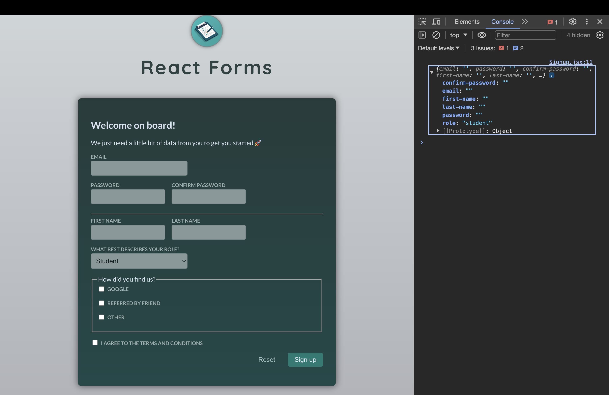
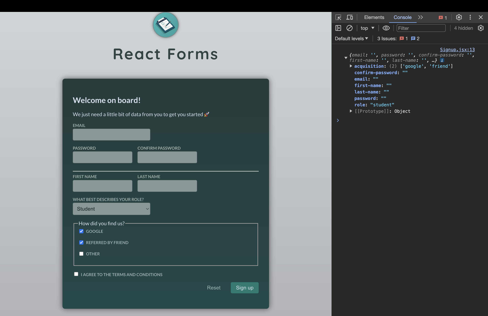
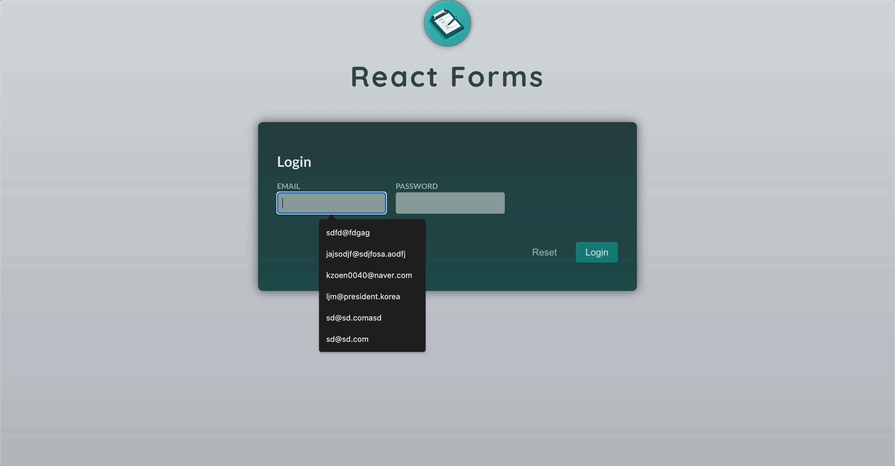

# Form 및 사용자 입력

[📌 Forms 소개](#-forms-소개)<br>
[📌 사용자 입력 수집 및 관리하기](#-사용자-입력-수집-및-관리하기)<br>
[📌 유효성 검사하기](#-유효성-검사하기)<br>
<br>

## 📌 Forms 소개

- 양식(입력창) 필드의 집합
- 내장된 HTML 요소 중 하나이다.

### 📖 Form의 역할

1. 사용자가 입력한 값을 추출하는 작업

   - 양방향 바인딩을 설정하여 상태를 통해 데이터를 관리 가능하다.
   - 값을 추출하기 위해 참조를 사용할 수도 있다.
   - 브라우저가 제공하는 함수들을 사용하여 사용자가 입력한 데이터를 추출하고 formData 객체를 통해 양식 필드로 옮길 수 있다.

   <br>

2. 사용자가 제공한 데이터를 검증하는 작업 &rarr; 만약 부정확한 입력창을 제시하면 사용자에게 검증 오류를 제시하기도 한다.
   - 키를 누를때마다 사용자가 입력한 것을 검증하고 그에 따른 에러 메시지를 계속 띄우는 방법 &rarr; 에러가 너무 일찍 나타나는 문제
   - 입력을 다 끝났을 때 검증을 실행 &rarr; 오류가 너무 오랫동안 보이는 문제
   - 양식 제출 시 검증을 실행 &rarr; 오류가 너무 늦게 나오는 문제

<br>

### 📖 Form 제출 다루기

#### 💎 Login.jsx

- 양식(form)안에 있는 버튼은 양식을 제출하는 용도로 사용된다. 즉, HTTP 요청이 발생하고 웹 사이트의 서버로 전송된다.
- 따라서 단순히 버튼을 눌렀을 때 그에 따른 함수를 동작시키는 것으로는 안된다.
- 해결하기
  - 방법 1 : 해당 버튼에 `type="button"` 설정
  - 방법 2 : form에 onSubmit을 설정한다. &rarr; 해당 이벤트가 실행될 때 기본 동작을 막기 위해 `event.preventDefault()`로 설정하여 기본 동작을 막는다.

<br>

## 📌 사용자 입력 수집 및 관리하기

### 📖 State & 일반 Handler 이용하기

#### 💎 Login.jsx

```jsx
import { useState } from "react";

export default function Login() {
  // const [enteredEmail, setEnteredEmail] = useState("");
  // const [enteredPW, setEnteredPW] = useState("");
  const [enteredValue, setEnteredValue] = useState({
    email: "",
    pw: "",
  });

  function handleSubmit(event) {
    event.preventDefault();
    console.log("User Email: ", enteredValue.email);
    console.log("User PW: ", enteredValue.pw);
  }

  function handleInputChange(identifier, value) {
    setEnteredValue((prevValues) => ({
      ...prevValues,
      [identifier]: value,
    }));
  }
  // function handlerEmailChange(event) {
  //   setEnteredEmail(event.target.value);
  // }
  // function handlerPWChange(event) {
  //   setEnteredPW(event.target.value);
  // }

  return (
    <form onSubmit={handleSubmit}>
      <h2>Login</h2>

      <div className="control-row">
        <div className="control no-margin">
          <label htmlFor="email">Email</label>
          <input
            id="email"
            type="email"
            name="email"
            onChange={(event) => handleInputChange("email", event.target.value)}
            value={enteredValue.email}
          />
        </div>

        <div className="control no-margin">
          <label htmlFor="password">Password</label>
          <input
            id="password"
            type="password"
            name="password"
            onChange={(event) => handleInputChange("pw", event.target.value)}
            value={enteredValue.pw}
          />
        </div>
      </div>

      <p className="form-actions">
        <button className="button button-flat">Reset</button>
        <button className="button">Login</button>
      </p>
    </form>
  );
}
```

#### 💎 결과


<br>

### 📖 Refs(참조)로 사용자 입력 수집하는 방법

#### 💎 Login.jsx

```jsx
import { useRef } from "react";

export default function Login() {
  const enteredEmail = useRef();
  const enteredPw = useRef();

  function handleSubmit(event) {
    event.preventDefault();

    const email = enteredEmail.current.value;
    const pw = enteredPw.current.value;
    console.log("User Email: ", email);
    console.log("User PW: ", pw);
  }

  return (
    <form onSubmit={handleSubmit}>
      <h2>Login</h2>

      <div className="control-row">
        <div className="control no-margin">
          <label htmlFor="email">Email</label>
          <input id="email" type="email" name="email" ref={enteredEmail} />
        </div>

        <div className="control no-margin">
          <label htmlFor="password">Password</label>
          <input
            id="password"
            type="password"
            name="password"
            ref={enteredPw}
          />
        </div>
      </div>

      <p className="form-actions">
        <button className="button button-flat">Reset</button>
        <button className="button">Login</button>
      </p>
    </form>
  );
}
```

<br>

### 📖 FormData & 네이티브 브라우저 API로 값 채취하기

```jsx
export default function Signup() {
  function handleSubmit(event) {
    event.preventDefault();

    // form에 입력된 각기 다른 값들을 쉽게 얻을 수 있도록 도와주는 객체 => event.targe === form
    // 이를 사용하기 위해선 input에 name 속성을 가져야한다.
    const fd = new FormData(event.target);
    const data = Object.fromEntries(fd.entries());
    // FormData의 엔트리를 부르는 것은 모든 입력창과 그에 속한 값들의 배열을 제공한다.
    // 그리고 그 배열에 있는 엔트리로부터 Object를 불러내면 모든 입력창과 핵심 값들을 가지고 있는 객체를 가질 수 있다.
    console.log(data);
  }

  return (
    <form onSubmit={handleSubmit}>
      <h2>Welcome on board!</h2>
      <p>We just need a little bit of data from you to get you started 🚀</p>

      <div className="control">
        <label htmlFor="email">Email</label>
        <input id="email" type="email" name="email" />
      </div>

      <div className="control-row">
        <div className="control">
          <label htmlFor="password">Password</label>
          <input id="password" type="password" name="password" />
        </div>

        <div className="control">
          <label htmlFor="confirm-password">Confirm Password</label>
          <input
            id="confirm-password"
            type="password"
            name="confirm-password"
          />
        </div>
      </div>

      <hr />

      <div className="control-row">
        <div className="control">
          <label htmlFor="first-name">First Name</label>
          <input type="text" id="first-name" name="first-name" />
        </div>

        <div className="control">
          <label htmlFor="last-name">Last Name</label>
          <input type="text" id="last-name" name="last-name" />
        </div>
      </div>

      <div className="control">
        <label htmlFor="phone">What best describes your role?</label>
        <select id="role" name="role">
          <option value="student">Student</option>
          <option value="teacher">Teacher</option>
          <option value="employee">Employee</option>
          <option value="founder">Founder</option>
          <option value="other">Other</option>
        </select>
      </div>

      <fieldset>
        <legend>How did you find us?</legend>
        <div className="control">
          <input
            type="checkbox"
            id="google"
            name="acquisition"
            value="google"
          />
          <label htmlFor="google">Google</label>
        </div>

        <div className="control">
          <input
            type="checkbox"
            id="friend"
            name="acquisition"
            value="friend"
          />
          <label htmlFor="friend">Referred by friend</label>
        </div>

        <div className="control">
          <input type="checkbox" id="other" name="acquisition" value="other" />
          <label htmlFor="other">Other</label>
        </div>
      </fieldset>

      <div className="control">
        <label htmlFor="terms-and-conditions">
          <input type="checkbox" id="terms-and-conditions" name="terms" />I
          agree to the terms and conditions
        </label>
      </div>

      <p className="form-actions">
        <button type="reset" className="button button-flat">
          Reset
        </button>
        <button type="submit" className="button">
          Sign up
        </button>
      </p>
    </form>
  );
}
```

#### 💎 결과



- 그러나 위의 결과를 보면, 체크박스로 구성된 `naem="acquisition"` 부분이 포함되지 않았음을 알 수 있다.
- 다양한 값이 있는 입력창은 `entries`나 `fromEntries`를 사용할 때는 빠져있다.

#### 💎 Signup에서 acquisition 입력 받아오기

```jsx
function handleSubmit(event) {
  event.preventDefault();

  const fd = new FormData(event.target);
  const acquisitionChannel = fd.getAll("acquisition"); // getAll
  const data = Object.fromEntries(fd.entries());
  data.acquisition = acquisitionChannel;
  console.log(data);
}
```

#### 💎 결과



<br>

### 📖 Form 초기화하기

#### 💎 방법 1 - Signup.jsx에서 reset 타입의 버튼 추가하기

```jsx
<button type="reset">Reset</button>
```

- 리셋 버튼의 유형 속성을 reset으로 설정했더니 입력창들이 버튼 누른 것만으로도 초기화된다.

#### 💎 방법 2 - Signup.jsx에서 프로그래밍적으로 리셋하기

```jsx
function handleSubmit(event) {
  event.preventDefault();

  // 버튼의 타입을 reset으로 설정하는 것과 같다.
  // => 참조를 이용할 때 email.current.value='' 라기 보다는 이렇게 사용하는게 낫다.
  event.target.reset();
}
```

<br>

## 📌 유효성 검사하기

### 📖 State로 매 키보드 입력마다 유효성 검사하기

#### 💎 Login.jsx

```jsx
export default function Login() {
  const emailIsInvalid =
    enteredValue.email !== "" && !enteredValue.email.includes("@");

  return (
    {/*...*/}
    <div className="control-error">
      {emailIsInvalid && <p>유효한 이메일 주소를 입력해주세요.</p>}
    </div>
    {/*...*/}
  );
}
```

#### 💎 결과


