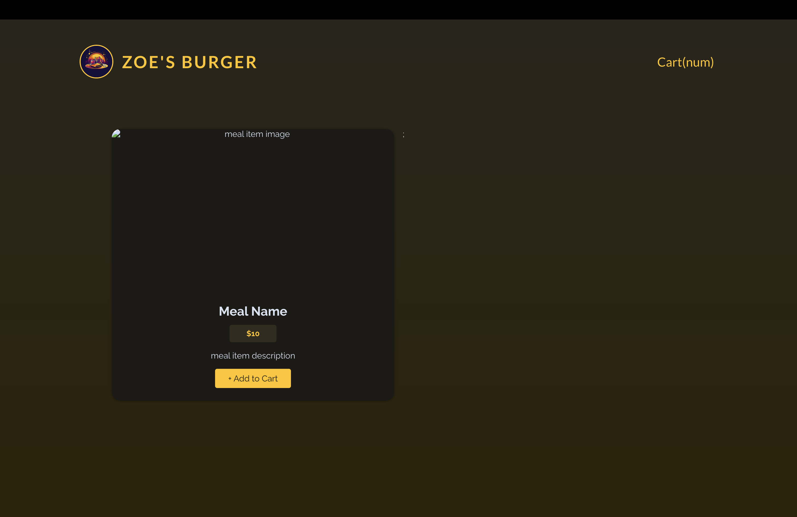

# 연습 프로젝트 : 음식 주문 앱에 Http 및 Form 적용하기

[📌 스스로 해결해보기](#-스스로-해결해보기)<br>
<br>

## 📌 스스로 해결해보기

### 📖 요구되는 동작 설명

#### 💎 동작 설명

1. 초기 화면에는 모든 products, 장바구니가 보인다.(dummy meal 데이터를 backend로 부터 Fetch하고 화면에 보여준다.(GET /meals))
2. 제품의 Add to Cart 버튼을 클릭하면 장바구니에 추가.
3. 장바구니 버튼(Cart)를 누르면 장바구니 안의 meal 데이터가 보여진다 &rarr; Close, Go to Checkout 버튼이 있다.
4. Go to Checkout 버튼을 누르면 Checkout 폼이 나오고 이 또한 모달로 보여진다. &rarr; Close, Submit Order 버튼이 있다.

#### 💎 조건

1. 유저는 장바구니에 제품을 추가 & 제거가 가능하다.
2. 로딩과 에러 state 다뤄야한다.
3. 유저 데이터와 함께 장바구니 데이터를 backend에 보내야한다.(POST /orders)

<br>

### 📖 설계

#### 💎 Header

```jsx
import titleImg from "../assets/logo.jpg";

export default function Header() {
  return (
    <>
      <header id="main-header">
        <h1 id="title">
          
          ZOE'S BURGER
        </h1>
        <button className="text-button">Cart(num)</button>
      </header>
    </>
  );
}
```

<br>

#### 💎 Meals

- 우선 App에는 Header와 Meals가 필요하다.
- Meals는 모든 meal item의 집합
- 따라서 MealItem 컴포넌트와 Meals 컴포넌트를 구성하는 것이 좋을 듯 하다.

```jsx
// Meals.jsx
import MealItem from "./MealItem";

export default function Meals() {
  return (
    <div id="meals">
      <MealItem />;
    </div>
  );
}

// MealItem.jsx
export default function MealItem() {
  return (
    <div className="meal-item">
      <article>
        
        <h3>Meal Name</h3>
        <div>
          <p className="meal-item-price">$10</p>
          <p className="meal-item-description">meal item description</p>
          <button className="meal-item-actions button">+ Add to Cart</button>
        </div>
      </article>
    </div>
  );
}
```



<br>

- meal에 대한 데이터를 백엔드로부터 받아와야 한다. &rarr; Meal에서 Fetch해서 받아온 뒤, 데이터 하나하나를 MealItem에 보내서 출력하는 방식을 사용하면 될 듯 하다.
