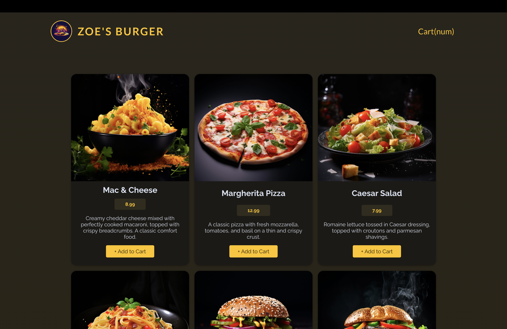

# 연습 프로젝트 : 음식 주문 앱에 Http 및 Form 적용하기

[📌 스스로 해결해보기](#-스스로-해결해보기)<br>
<br>

## 📌 스스로 해결해보기

### 📖 요구되는 동작 설명

#### 💎 동작 설명

1. 초기 화면에는 모든 products, 장바구니가 보인다.(dummy meal 데이터를 backend로 부터 Fetch하고 화면에 보여준다.(GET /meals))
2. 제품의 Add to Cart 버튼을 클릭하면 장바구니에 추가.
3. 장바구니 버튼(Cart)를 누르면 장바구니 안의 meal 데이터가 보여진다 &rarr; Close, Go to Checkout 버튼이 있다.
4. Go to Checkout 버튼을 누르면 Checkout 폼이 나오고 이 또한 모달로 보여진다. &rarr; Close, Submit Order 버튼이 있다.

#### 💎 조건

1. 유저는 장바구니에 제품을 추가 & 제거가 가능하다.
2. 로딩과 에러 state 다뤄야한다.
3. 유저 데이터와 함께 장바구니 데이터를 backend에 보내야한다.(POST /orders)

<br>

### 📖 설계

#### 💎 Header

```jsx
import titleImg from "../assets/logo.jpg";

export default function Header() {
  return (
    <>
      <header id="main-header">
        <h1 id="title">
          
          ZOE'S BURGER
        </h1>
        <button className="text-button">Cart(num)</button>
      </header>
    </>
  );
}
```

<br>

#### 💎 Meals

- 우선 App에는 Header와 Meals가 필요하다.
- Meals는 모든 meal item의 집합
- 따라서 MealItem 컴포넌트와 Meals 컴포넌트를 구성하는 것이 좋을 듯 하다.

```jsx
// Meals.jsx
import MealItem from "./MealItem";

export default function Meals() {
  return (
    <div id="meals">
      <MealItem />;
    </div>
  );
}

// MealItem.jsx
export default function MealItem() {
  return (
    <div className="meal-item">
      <article>
        
        <h3>Meal Name</h3>
        <div>
          <p className="meal-item-price">$10</p>
          <p className="meal-item-description">meal item description</p>
          <button className="meal-item-actions button">+ Add to Cart</button>
        </div>
      </article>
    </div>
  );
}
```


- meal에 대한 데이터를 백엔드로부터 받아와야 한다. &rarr; Meal에서 Fetch해서 받아온 뒤, 데이터 하나하나를 MealItem에 보내서 출력하는 방식을 사용하면 될 듯 하다.

```jsx
// Meal.jsx
import { useEffect, useState } from "react";
import MealItem from "./MealItem";

export default function Meals() {
  const [mealDatas, setMealDatas] = useState([]);

  useEffect(() => {
    async function fetchMeals() {
      const response = await fetch("http://localhost:3000/meals");
      const resData = await response.json();
      setMealDatas(resData);
    }

    fetchMeals();
  }, []);

  return (
    <div id="meals">
      {mealDatas.map((mealItem) => {
        // console.log(mealItem);
        return (
          <MealItem
            key={mealItem.id}
            image={mealItem.image}
            name={mealItem.name}
            price={mealItem.price}
            description={mealItem.description}
          />
        );
      })}
    </div>
  );
}

// MealItem.jsx
export default function MealItem({ image, name, price, description }) {
  return (
    <div className="meal-item">
      <article>
        
        <h3>{name}</h3>
        <div>
          <p className="meal-item-price">{price}</p>
          <p className="meal-item-description">{description}</p>
          <button className="meal-item-actions button">+ Add to Cart</button>
        </div>
      </article>
    </div>
  );
}
```



<br>

#### 💎 CartModal 및 상태 끌어올리기

```jsx
// Header.jsx
import { useContext, useRef } from "react";
import titleImg from "../assets/logo.jpg";
import CartModal from "./CartModal";
import { CartContext } from "../assets/context/cart-context";

export default function Header() {
  const dialog = useRef();
  const { items } = useContext(CartContext);

  function handleOpenCart() {
    console.log("cart");
    dialog.current.open();
  }
  return (
    <>
      <header id="main-header">
        <h1 id="title">
          
          ZOE'S BURGER
        </h1>
        <button className="text-button" onClick={handleOpenCart}>
          Cart(num)
        </button>
      </header>
      <CartModal ref={dialog} items={items} />
    </>
  );
}


// CartModal.jsx
import { forwardRef, useImperativeHandle, useRef } from "react";
import { createPortal } from "react-dom";

const CartModal = forwardRef(function CartModal({ items }, ref) {
  const dialog = useRef();

  useImperativeHandle(ref, () => {
    return {
      open() {
        dialog.current.showModal();
      },
    };
  });

  return createPortal(
    <dialog ref={dialog} className="modal cart">
      <h2>장바구니</h2>
      <ul>
        <li className="cart-item">
          <p>item name</p>
          <div className="cart-item-actions">
            <button>-</button>
            <p>1</p>
            <button>+</button>
          </div>
        </li>
      </ul>
      <h3 className="cart-total">$ Total</h3>
      <form method="dialog" className="modal-actions">
        <button className="text-button">Close</button>
        <button className="button">Go to Checkout</button>
      </form>
    </dialog>,
    document.getElementById("modal")
  );
});

export default CartModal;
```

<br>

```jsx
// App.jsx
import Error from "./components/Error";
import Header from "./components/Header";
import Meals from "./components/Meals";
import { CartContext } from "./assets/context/cart-context";
import { useState, useEffect, useContext } from "react";

function App() {
  const [mealDatas, setMealDatas] = useState([]);
  const [isFetching, setIsFetching] = useState(false);
  const [error, setError] = useState();

  const CartCtx = {
    items: mealDatas,
    onAddCart: handleAddCart,
  };

  useEffect(() => {
    setIsFetching(true);
    async function fetchMeals() {
      try {
        const response = await fetch("http://localhost:3000/meals");
        const resData = await response.json();

        if (!response.ok) {
          throw new Error("상품을 불러오는데 실패했습니다.");
        }
        setMealDatas(resData);
      } catch (error) {
        setError({
          message: error.message || "상품을 불러오는데 실패했습니다.",
        });
      }

      setIsFetching(false);
    }

    fetchMeals();
  }, []);

  if (error) {
    return (
      <Error title="상품을 불러오는데 실패했습니다." message={error.message} />
    );
  }

  function handleAddCart(itemId, itemInfo) {
    console.log(`Add to Cart button : ${itemId} - ${itemInfo}`);
  }

  return (
    <CartContext.Provider value={CartCtx}>
      <Header />
      <Meals isFetching={isFetching} error={error} />
    </CartContext.Provider>
  );
}

export default App;


// Meals.jsx
import { useContext } from "react";
import MealItem from "./MealItem";
import { CartContext } from "../assets/context/cart-context";

export default function Meals({ isFetching, error }) {
  const { items: mealDatas, onAddCart: handleAddCart } =
    useContext(CartContext);

  return (
    <div id="meals">
      {isFetching && <p>상품을 불러오는 중입니다.</p>}
      {!isFetching &&
        !error &&
        mealDatas.map((mealItem) => {
          return (
            <MealItem
              key={mealItem.id}
              id={mealItem.id}
              image={mealItem.image}
              name={mealItem.name}
              price={mealItem.price}
              description={mealItem.description}
              onAddCart={handleAddCart}
            />
          );
        })}
      ;
    </div>
  );
}
```

- Meals에서 데이터를 fetch했던 것을 App에서 진행하고, 해당 데이터를 Context API를 이용하기 위해 상태를 끌어올렸다.

```jsx
// context/cart-context.jsx
import { createContext } from "react";

export const CartContext = createContext({
  items: [],
  onAddCart: () => {},
});
```


<br>

#### 💎 useFetch - 커스텀 훅 사용하기

```js
// useFetch
import { useEffect, useState } from "react";

export default function useFetch() {
  const [mealDatas, setMealDatas] = useState([]);
  const [isFetching, setIsFetching] = useState(false);
  const [error, setError] = useState();

  useEffect(() => {
    setIsFetching(true);
    async function fetchMeals() {
      try {
        const response = await fetch("http://localhost:3000/meals");
        const resData = await response.json();

        if (!response.ok) {
          throw new Error("상품을 불러오는데 실패했습니다.");
        }
        setMealDatas(resData);
      } catch (error) {
        setError({
          message: error.message || "상품을 불러오는데 실패했습니다.",
        });
      }

      setIsFetching(false);
    }

    fetchMeals();
  }, []);

  return {
    isFetching,
    mealDatas,
    error,
  };
}
```

```jsx
// App.jsx
import Error from "./components/Error";
import Header from "./components/Header";
import Meals from "./components/Meals";
import { CartContext } from "./assets/context/cart-context";
import { useState } from "react";
import useFetch from "./store/useFetch";

function App() {
  const { mealDatas, error, isFetching } = useFetch();

  const CartCtx = {
    items: mealDatas,
    onAddCart: handleAddCart,
  };

  if (error) {
    return (
      <Error title="상품을 불러오는데 실패했습니다." message={error.message} />
    );
  }

  function handleAddCart(itemId, itemInfo) {
    console.log(`Add to Cart button : ${itemId} - ${itemInfo}`);
  }

  return (
    <CartContext.Provider value={CartCtx}>
      <Header />
      <Meals isFetching={isFetching} error={error} />
    </CartContext.Provider>
  );
}

export default App;
```

- App.jsx의 코드를 간략하게 만들기 위해서 커스텀 훅을 작성했다. 장바구니에 넣을 아이템을 관리할 상태를 추가해야하는데, fetch와 가져온 데이터를 관리하는 상태를 App 컴포넌트 안에서 모두 작성하기에는 가독성 측면과 프로젝트 관리에도 어려움이 있을 듯 했다.
