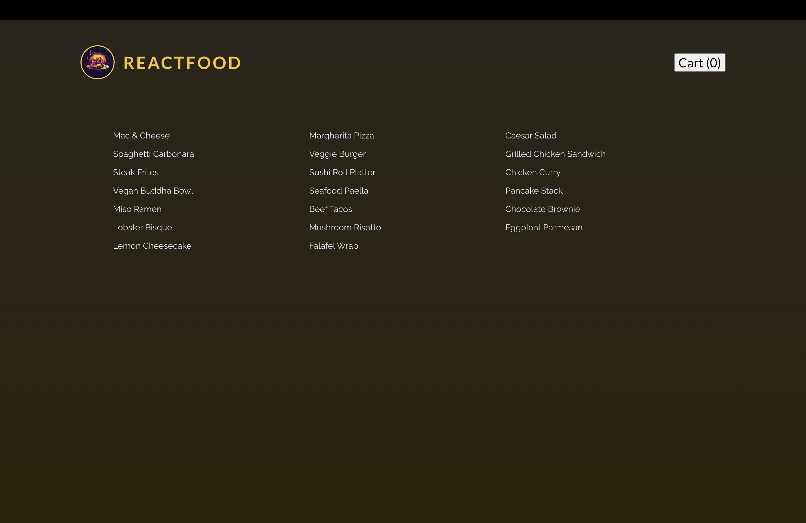
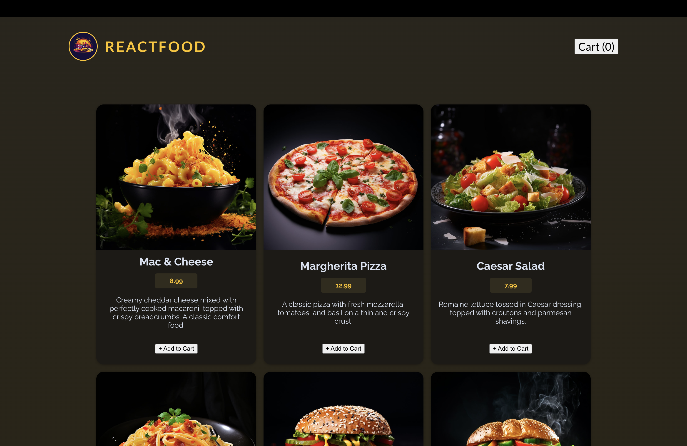
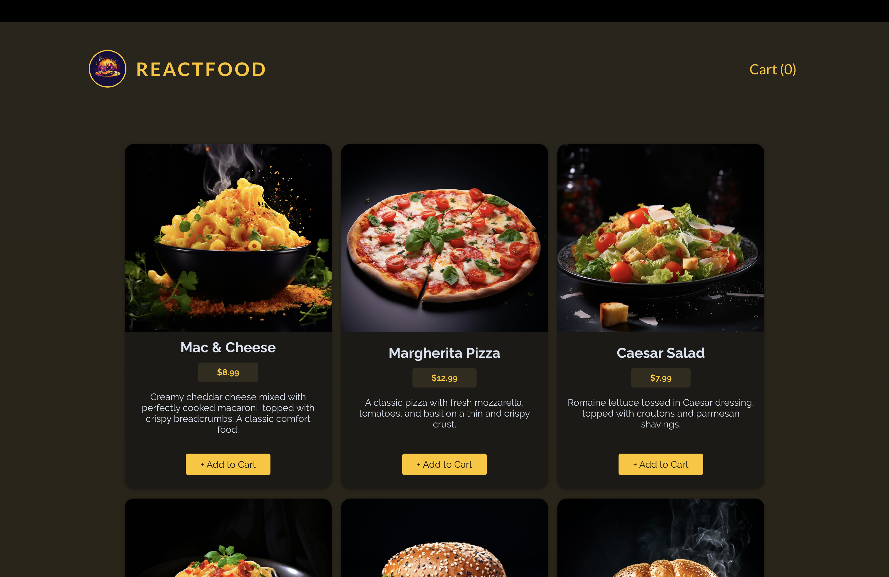
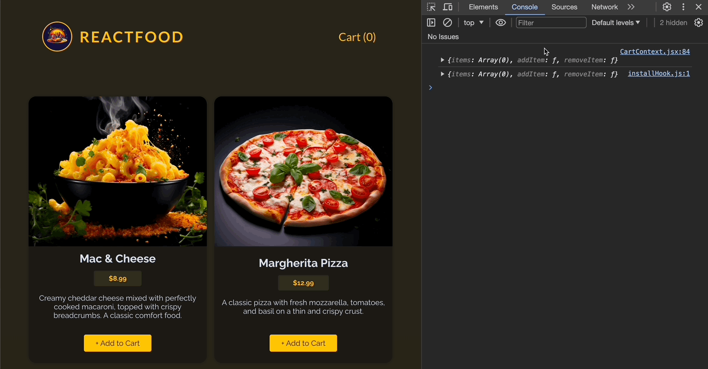
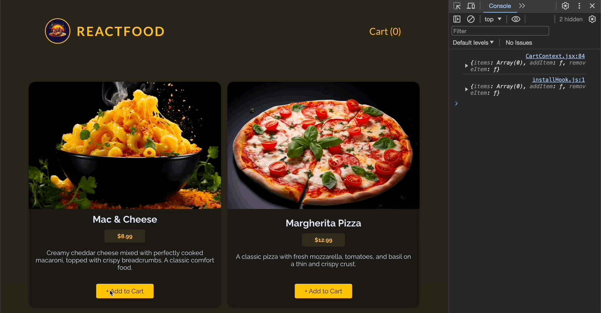
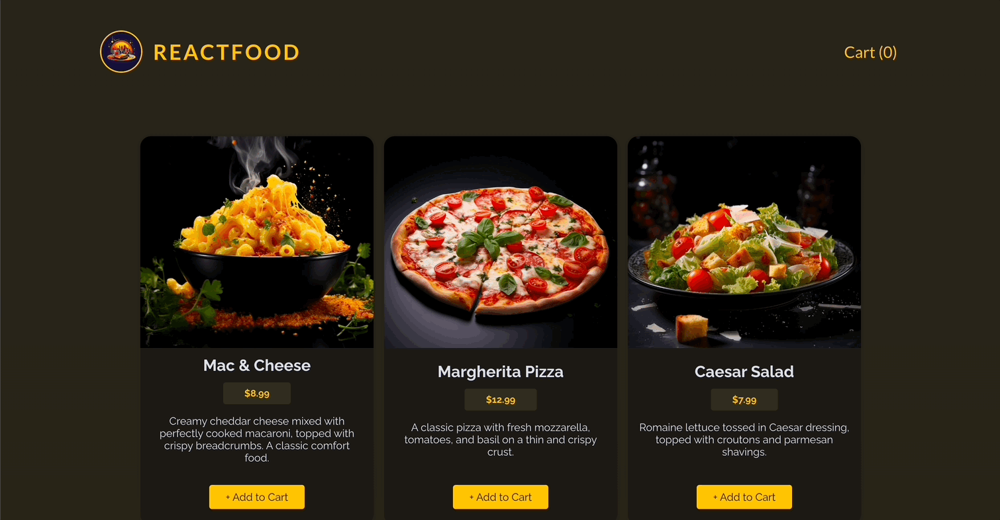
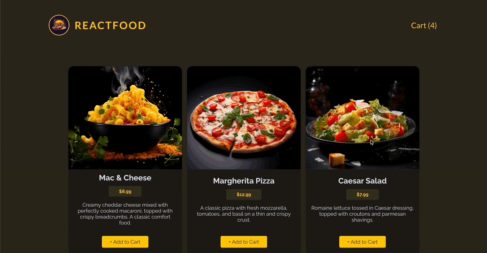
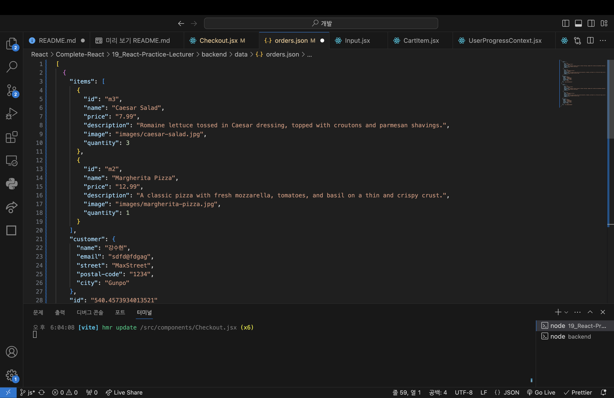

# 연습 프로젝트 : 음식 주문 앱에 Http 및 Form 적용하기 - 강사

[📌 Header](#-header)<br>
[📌 Meals](#-meals)<br>
[📌 커스텀 버튼 컴포넌트 생성하기](#-커스텀-버튼-컴포넌트-생성하기)<br>
[📌 Cart](#-cart)<br>
[📌 Modal 이용하기 - Cart](#-modal-이용하기---cart)<br>
[📌 Modal 이용하기 - Checkout](#-modal-이용하기---checkout)<br>
[📌 HTTP 에러와 로딩 다루기](#-http-에러와-로딩-다루기)<br>
<br>

## 📌 Header

#### 💎 Header.jsx

```jsx
import logoImg from "../assets/logo.jpg";

export default function Header() {
  return (
    <header id="main-header">
      <div id="title">
        
        <h1>ReactFood</h1>
      </div>
      <nav>
        <button>Cart (0)</button>
      </nav>
    </header>
  );
}
```

<br>

## 📌 Meals

### 📖 음식 데이터 Fetching하기

#### 💎 Meals.jsx

```jsx
import { useState, useEffect } from "react";

export default function Meals() {
  const [loadedMeals, setLoadedMeals] = useState([]);

  useEffect(() => {
    async function fetchMeals() {
      const response = await fetch("http://localhost:3000/meals");

      if (!response.ok) {
        //...
      }

      const meals = await response.json();
      setLoadedMeals(meals);
    }

    fetchMeals();
  }, []); // 외부 속성이나 상태 혹은 렌더링 도중 변화를 가져올 만한 값을 사용하지 않았기 때문에 의존성이 없다.
  // 외부 상태를 사용한 것은 setLoadedMeals인데 이는 리액트에서 자동으로 설정해준다.

  return (
    <ul id="meals">
      {loadedMeals.map((meal) => (
        <li key={meal.id}>{meal.name}</li>
      ))}
    </ul>
  );
}
```



<br>

### 📖 MealItem 컴포넌트 추가하기

#### 💎 MealItem.jsx

```jsx
export default function MealItem({ meal }) {
  return (
    <li className="meal-item" key={meal.id}>
      <article>
        
        <div>
          <h3>{meal.name}</h3>
          <p className="meal-item-price">{meal.price}</p>
          <p className="meal-item-description">{meal.description}</p>
        </div>
        <p className="meal-item-actions">
          <button>+ Add to Cart</button>
        </p>
      </article>
    </li>
  );
}
```

#### 💎 Meals.jsx

```jsx
return (
  <ul id="meals">
    {loadedMeals.map((meal) => (
      <MealItem key={meal.id} meal={meal} />
    ))}
  </ul>
);
```



<br>

### 📖 숫자를 통화 형식으로 변환 및 측정하기 - meal.price

#### 💎 src/utils/formatting.js

```js
export const currencyFormatter = new Intl.NumberFormat("en-US", {
  style: "currency",
  currency: "USD",
});
```

#### 💎 MealItem.jsx

```jsx
import { currencyFormatter } from "../util/formatting.js";

export default function MealItem({ meal }) {
  return (
    <li className="meal-item" key={meal.id}>
      <article>
        
        <div>
          <h3>{meal.name}</h3>
          <p className="meal-item-price">
            {currencyFormatter.format(meal.price)}
          </p>
          <p className="meal-item-description">{meal.description}</p>
        </div>
        <p className="meal-item-actions">
          <button>+ Add to Cart</button>
        </p>
      </article>
    </li>
  );
}
```

- 이러한 방식은 다른 형식의 숫자를 다룰 때 도움이 된다.

<br>

## 📌 커스텀 버튼 컴포넌트 생성하기

#### 💎 components/UI/Button.jsx

```jsx
export default function Button({ children, textOnly, className, ...props }) {
  const cssClasses = textOnly
    ? `text-button ${className}`
    : `button ${className}`;

  return (
    <button className={cssClasses} {...props}>
      {children}
    </button>
  );
}
```

#### 💎 Header.jsx

```jsx
import logoImg from "../assets/logo.jpg";
import Button from "./UI/Button";

export default function Header() {
  return (
    <header id="main-header">
      <div id="title">
        
        <h1>ReactFood</h1>
      </div>
      <nav>
        <Button textOnly>Cart (0)</Button>
      </nav>
    </header>
  );
}
```

- `textOnly`를 넣음으로써 리액트는 자동으로 해당 속성에 true를 전달.

#### 💎 MealItme.jsx

```jsx
import { currencyFormatter } from "../util/formatting.js";
import Button from "./UI/Button.jsx";

export default function MealItem({ meal }) {
  return (
    <li className="meal-item" key={meal.id}>
      <article>
        
        <div>
          <h3>{meal.name}</h3>
          <p className="meal-item-price">
            {currencyFormatter.format(meal.price)}
          </p>
          <p className="meal-item-description">{meal.description}</p>
        </div>
        <p className="meal-item-actions">
          <Button>+ Add to Cart</Button>
        </p>
      </article>
    </li>
  );
}
```

- `textOnly`를 추가하지 않음으로써 그냥 button 클래스가 입력되도록 함.



<br>

## 📌 Cart

### 📖 Cart 컨텍스트와 Reducer로 시작하기

- 장바구니 데이터를 앱에서 관리하면 App 컴포넌트가 너무 커진다. 그리고 관련된 속성을 prop drilling을 사용해야한다. &rarr; reducer, context 이용

#### 💎 src/store/CartContext.jsx

```jsx
import { createContext, useReducer } from "react";

const CartContext = createContext({
  items: [],
  addItem: (item) => {},
  removeItem: (id) => {},
});

function cartReducer(state, action) {
  // 업데이트된 상태를 반환.
  if (action.type === "ADD_ITEM") {
    // 상태를 업데이트해서 음식 메뉴 항목을 더함.
    const existingCartItemIndex = state.items.findIndex(
      (item) => item.id === action.item.id
    ); // 이미 상태 항목에 같은 아이디를 갖는 음식이 있다면 해당 음식의 인덱스를 저장. -> 차후에 해당 음식을 오버라이딩하는데 이용.

    const updatedItems = [...state.items]; // 이전 배열의 복사본

    if (existingCartItemIndex > -1) {
      // 없는 경우에는 -1을 리턴하기 때문에 해당 조건문은 해당 항목이 이미 배열에 있다는 의미이다.
      const existingItem = state.items[existingCartItemIndex];
      const updatedItem = {
        ...existingItem,
        quantity: existingItem.quantity + 1,
      };
      updatedItems[existingCartItemIndex] = updatedItem; // 기존의 상품을 오버라이딩.
    } else {
      updatedItems.push({ ...action.item, quantity: 1 });
    }

    return { ...state, items: updatedItems };
  }

  if (action.type === "REMOVE_ITEM") {
    // 상태에서 음식 메뉴 항목을 지움
    const existingCartItemIndex = state.items.findIndex(
      (item) => item.id === action.id
    ); // 이미 상태 항목에 같은 아이디를 갖는 음식이 있다면 해당 음식의 인덱스를 저장. -> 차후에 해당 음식을 지우는데 이용

    const existingCartItem = state.items[existingCartItemIndex];

    const updatedItems = [...state.items];

    if (existingCartItem.quantity === 1) {
      // 하나가 있다면 지웠을 때 장바구니에서 해당 음식이 지워져야함
      updatedItems.splice(existingCartItemIndex, 1);
    } else {
      const updatedItem = {
        ...existingCartItem,
        quantity: existingCartItem.quantity - 1,
      };
      updatedItems[existingCartItemIndex] = updatedItem; // 오버라이딩
    }
    return { ...state, items: updatedItems };
  }

  return state;
}

export function CartContextProvider({ children }) {
  const [cart, dispatchCartAction] = useReducer(cartReducer, { items: [] }); // 리듀서 함수, 초기 상태값

  const cartContext = {
    items: cart.items,
    addItem: addItem,
    removeItem,
  };

  function addItem(item) {
    dispatchCartAction({
      type: "ADD_ITEM",
      item: item, // item으로해도 된다.
    });
  }

  function removeItem(id) {
    dispatchCartAction({
      type: "REMOVE_ITEM",
      id,
    });
  }

  console.log(cartContext);

  return (
    <CartContext.Provider value={cartContext}>{children}</CartContext.Provider>
  );
}

export default CartContext;
```

- 우선 `useReducer`를 이용하여 더 복잡한 상태를 간단하게 다룰 수 있도록 한다. 이는 상태 관리 로직을 이 컴포넌트 함수 밖으로 내보내는 것이 쉬워진다.
- `useReducer`(리듀서 함수, 초기 상태값)을 전달하여 상태 업데이트를 간단히 할 수 있도록 한다.
- 리듀서 함수 `cartReduce`

  - 리듀서 함수는 state(상태)와 action(액션)을 입력받는다.
  - 리듀서 함수의 액션에는 타입이라는 것이 있는데, 우리가 진행하는 프로젝트의 경우 장바구니에 음식 항목을 추가/제거 하는 것이다. 따라서 타입의 이름을 각각 `ADD_ITEM, REMOVE_ITEM`이라고 명명했다.
  - `action.type === 'ADD_ITEM'` 인 경우

    1. 이미 상태에 존재하는 음식인지 검사한다. &rarr; `findIndex`를 통해 true(이미 존재한다면)값을 가진다면 해당 인덱스를 `existingCartItemIndex`에 저장한다.
    2. 이미 존재하는 음식을 `existingCartItem`라고 선언한다.
    3. 현재 상태에 있는 모든 음식 아이템들을 펼쳐 별도의 배열에 저장한다.(`updatedItems`)
    4. 이미 존재하고 있는지 아닌지를 검사하여 그 결과값에 대한 로직을 작성한다.

  - `action.type === 'REMOVE_ITEM'` 인 경우
    1. 위에서 진행했던 것 처럼 이미 상태에 존재하는 음식의 인덱스를 찾는다. 해당 액션의 경우, 이미 존재하는 음식 아이템만을 지우는 것이기 때문에 별도로 검사를 할 필요가 없다.
    2. 해당 음식의 양이 1개이면, 상태에서 해당 음식 아이템을 지워야한다. 그러나 해당 음식의 양이 1보다 크다면, 현재 음식의 양보다 -1씩 감소시켜야 한다.

- `CartContextProvider` 안에 `addItem,removeItem` 함수를 정의한다.
- 각 함수들은 타입(`ADD_ITEM, REMOVE_ITEM`)을 가지고 있고 리듀서 함수에서 정의한 것처럼 item자체를 전달하거나 item의 id를 전달한다.

#### 💎 App.jsx

```jsx
import Header from "./components/Header";
import Meals from "./components/Meals";
import { CartContextProvider } from "./store/CartContext";

function App() {
  return (
    <CartContextProvider>
      <Header />
      <Meals />
    </CartContextProvider>
  );
}

export default App;
```

#### 💎 MealItem.jsx

```jsx
import { currencyFormatter } from "../util/formatting.js";
import Button from "./UI/Button.jsx";
import CartContext from "../store/CartContext.jsx";
import { useContext } from "react";

export default function MealItem({ meal }) {
  const cartCtx = useContext(CartContext);

  function handleAddMealToCart() {
    cartCtx.addItem(meal);
  }

  return (
    <li className="meal-item" key={meal.id}>
      <article>
        
        <div>
          <h3>{meal.name}</h3>
          <p className="meal-item-price">
            {currencyFormatter.format(meal.price)}
          </p>
          <p className="meal-item-description">{meal.description}</p>
        </div>
        <p className="meal-item-actions">
          <Button onClick={handleAddMealToCart}>+ Add to Cart</Button>
        </p>
      </article>
    </li>
  );
}
```



#### 💎 Header에 전체 음식 수 표현하기

```jsx
import { useContext } from "react";
import logoImg from "../assets/logo.jpg";
import Button from "./UI/Button";
import CartContext from "../store/CartContext";

export default function Header() {
  const cartCtx = useContext(CartContext);

  // reduce는 배열을 하나의 값으로 줄여준다. 즉. 숫자 하나로 줄임.
  // reduce(( 파생시키려는 새로운 값, 배열 )=>{}, 초기값)
  const totalCartItems = cartCtx.items.reduce((totalNumberOfItems, item) => {
    return totalNumberOfItems + item.quantity; // toalNumberOfItems에 현재 item의 quentity 속성을 확인하여 더함.
  }, 0);

  return (
    <header id="main-header">
      <div id="title">
        
        <h1>ReactFood</h1>
      </div>
      <nav>
        <Button textOnly>Cart ({totalCartItems})</Button>
      </nav>
    </header>
  );
}
```



<br>

## 📌 Modal 이용하기 - Cart

### 📖 useEffect로 재사용 가능한 모달 컴포넌트 추가하기

#### 💎 components/UI/Modal.jsx

```jsx
import { createPortal } from "react-dom";
import { useEffect, useRef } from "react";

export default function Modal({ children, open, className = "" }) {
  const dialog = useRef();

  useEffect(() => {
    if (open) {
      dialog.current.showModal();
    }
  }, [open]);

  return createPortal(
    <dialog ref={dialog} className={`modal ${className}`}>
      {children}
    </dialog>,
    document.getElementById("modal")
  );
}
```

<br>

### 📖 새 컨텍스트로 모달에서 Cart 열기

#### 💎 store/UserProgressContext.jsx

```jsx
// 모달과 관련된 컨텍스트
import { createContext, useState } from "react";

const UserProgressContext = createContext({
  progress: "", // cart, checkout
  showCart: () => {},
  hideCart: () => {},
  showCheckout: () => {},
  hideCheckout: () => {},
});

export function UserProgressContextProvider({ children }) {
  const [userProgress, setUserProgress] = useState("");

  function showCart() {
    setUserProgress("cart");
  }

  function hideCart() {
    setUserProgress("");
  }

  function showCheckout() {
    setUserProgress("checkout");
  }

  function hideCheckout() {
    setUserProgress("");
  }

  const userProgressCtx = {
    progress: userProgress,
    showCart,
    hideCart,
    showCheckout,
    hideCheckout,
  };

  return (
    <UserProgressContext.Provider value={userProgressCtx}>
      {children}
    </UserProgressContext.Provider>
  );
}

export default UserProgressContext;
```

- 모달과 관련된 컨텍스트로 Cart, Checkout 모달을 표현하는데 사용할 것이다.

#### 💎 Cart.jsx

```jsx
import { useContext } from "react";
import Modal from "./UI/Modal";
import Button from "./UI/Button";
import CartContext from "../store/CartContext";
import { currencyFormatter } from "../util/formatting";
import UserProgressContext from "../store/UserProgressContext";

export default function Cart() {
  const cartCtx = useContext(CartContext);
  const userProgressCtx = useContext(UserProgressContext);

  const cartTotal = cartCtx.items.reduce((totalPrice, item) => {
    return totalPrice + item.quantity * item.price;
  }, 0);

  return (
    // open={open}으로만 하지 않고 컨텍스트를 이용해서 해당 콘텍스트가 cart 이면 Cart 모달을 open할 것임을 전달
    <Modal className="cart" open={userProgressCtx.progress === "cart"}>
      <h2>Your Cart</h2>
      <ul>
        {cartCtx.items.map((item) => (
          <li key={item.id}>
            {item.name} - {item.quantity} x{" "}
            {currencyFormatter.format(item.price)}
          </li>
        ))}
      </ul>
      <p className="cart-total">{currencyFormatter.format(cartTotal)}</p>
      <p className="modal-actions">
        <Button textOnly>Close</Button>
        <Button>Go to Checkout</Button>
      </p>
    </Modal>
  );
}
```

#### 💎 App.jsx

```jsx
import Header from "./components/Header";
import Meals from "./components/Meals";
import Cart from "./components/Cart";
import { CartContextProvider } from "./store/CartContext";
import { UserProgressContextProvider } from "./store/UserProgressContext";

function App() {
  return (
    <UserProgressContextProvider>
      <CartContextProvider>
        <Header />
        <Meals />
        <Cart />
      </CartContextProvider>
    </UserProgressContextProvider>
  );
}

export default App;
```

#### 💎 Header.jsx

```jsx
import { useContext } from "react";
import logoImg from "../assets/logo.jpg";
import Button from "./UI/Button";
import CartContext from "../store/CartContext";
import UserProgressContext from "../store/UserProgressContext";

export default function Header() {
  const cartCtx = useContext(CartContext);
  const userProgressCtx = useContext(UserProgressContext);

  // reduce는 배열을 하나의 값으로 줄여준다. 즉. 숫자 하나로 줄임.
  // reduce(( 파생시키려는 새로운 값, 배열 )=>{}, 초기값)
  const totalCartItems = cartCtx.items.reduce((totalNumberOfItems, item) => {
    return totalNumberOfItems + item.quantity;
  }, 0);

  function handleShowCart() {
    userProgressCtx.showCart();
  }

  return (
    <header id="main-header">
      <div id="title">
        
        <h1>ReactFood</h1>
      </div>
      <nav>
        <Button textOnly onClick={handleShowCart}>
          Cart ({totalCartItems})
        </Button>
      </nav>
    </header>
  );
}
```

- Cart 버튼을 눌렀을 때 콘텍스트의 `showCart()` 가 동작하도록 함


<br>

### 📖 모달에서 Cart 닫기

#### 💎 Cart.jsx

```jsx
import { useContext } from "react";
import Modal from "./UI/Modal";
import Button from "./UI/Button";
import CartContext from "../store/CartContext";
import { currencyFormatter } from "../util/formatting";
import UserProgressContext from "../store/UserProgressContext";

export default function Cart() {
  const cartCtx = useContext(CartContext);
  const userProgressCtx = useContext(UserProgressContext);

  const cartTotal = cartCtx.items.reduce((totalPrice, item) => {
    return totalPrice + item.quantity * item.price;
  }, 0);

  // close 함수 추가
  function handleCloseCart() {
    userProgressCtx.hideCart();
  }

  return (
    <Modal className="cart" open={userProgressCtx.progress === "cart"}>
      <h2>Your Cart</h2>
      <ul>
        {cartCtx.items.map((item) => (
          <li key={item.id}>
            {item.name} - {item.quantity} x{" "}
            {currencyFormatter.format(item.price)}
          </li>
        ))}
      </ul>
      <p className="cart-total">{currencyFormatter.format(cartTotal)}</p>
      <p className="modal-actions">
        <Button textOnly onClick={handleCloseCart}>
          Close
        </Button>
        <Button>Go to Checkout</Button>
      </p>
    </Modal>
  );
}
```

이렇게 해도 모달 닫기가 되지 않는 것을 알 수 있다. 이는 Modal.jsx에서 해당 모달을 닫기 위한 close함수가 적용되지 않았기 때문이다.

#### 💎 Modal.jsx

```jsx
import { createPortal } from "react-dom";
import { useEffect, useRef } from "react";

export default function Modal({ children, open, className = "" }) {
  const dialog = useRef();

  useEffect(() => {
    const modal = dialog.current; // 혹시나 다른 dialog를 참조할 수 있으므로 현재 dialog를 별도의 상수에 저장하여 컨트롤
    if (open) {
      modal.showModal();
    }

    // 모달 close에 관한 코드 작성 필요.
    return () => modal.close(); // cleanup은 시점상으로는 effect 함수보다 더 나중에 실행된다.
    // cleanup함수는 open값이 미래에 변하는 때에만 실행되기 때문이다.
  }, [open]);

  return createPortal(
    <dialog ref={dialog} className={`modal ${className}`}>
      {children}
    </dialog>,
    document.getElementById("modal")
  );
}
```


<br>

### 📖 CartItem 작성하기

#### 💎 CartItem.jsx

```jsx
import { currencyFormatter } from "../util/formatting";

export default function CartItem({
  name,
  quantity,
  price,
  onIncrease,
  onDecrease,
}) {
  return (
    <li className="cart-item" key={name}>
      <p>
        {name} - {quantity} X {currencyFormatter.format(price)}
      </p>
      <p className="cart-item-actions">
        <button onClick={onDecrease}>-</button>
        <span>{quantity}</span>
        <button onClick={onIncrease}>+</button>
      </p>
    </li>
  );
}
```

#### 💎 Cart.jsx

```jsx
import { useContext } from "react";
import Modal from "./UI/Modal";
import Button from "./UI/Button";
import CartContext from "../store/CartContext";
import { currencyFormatter } from "../util/formatting";
import UserProgressContext from "../store/UserProgressContext";
import CartItem from "./CartItem";

export default function Cart() {
  const cartCtx = useContext(CartContext);
  const userProgressCtx = useContext(UserProgressContext);

  const cartTotal = cartCtx.items.reduce((totalPrice, item) => {
    return totalPrice + item.quantity * item.price;
  }, 0);

  function handleCloseCart() {
    userProgressCtx.hideCart();
  }

  return (
    <Modal className="cart" open={userProgressCtx.progress === "cart"}>
      <h2>Your Cart</h2>
      <ul>
        {cartCtx.items.map((item) => (
          <CartItem
            key={item.id}
            {...item}
            onIncrease={() => cartCtx.addItem(item)}
            onDecrease={() => cartCtx.removeItem(item.id)}
          />
        ))}
      </ul>
      <p className="cart-total">{currencyFormatter.format(cartTotal)}</p>
      <p className="modal-actions">
        <Button textOnly onClick={handleCloseCart}>
          Close
        </Button>
        <Button>Go to Checkout</Button>
      </p>
    </Modal>
  );
}
```



<br>

## 📌 Modal 이용하기 - Checkout

### 📖 커스텀 입력 컴포넌트 추가 & 모달 보임 여부 관리

#### 💎 Checkout.jsx

```jsx
import { useContext } from "react";
import { currencyFormatter } from "../util/formatting";
import Modal from "./UI/Modal";
import Input from "./UI/Input";
import Button from "./UI/Button";
import CartContext from "../store/CartContext";
import UserProgressContext from "../store/UserProgressContext";

export default function Checkout({}) {
  const cartCtx = useContext(CartContext);
  const userProgressCtx = useContext(UserProgressContext);

  const cartTotal = cartCtx.items.reduce((totalPrice, item) => {
    totalPrice + item.quantity * item.price;
  }, 0);

  function handleCloseCheckout() {
    userProgressCtx.hideCheckout();
  }

  return (
    <Modal
      open={userProgressCtx.progress === "checkout"}
      onClose={handleCloseCheckout}
    >
      <form>
        <h2>Checkout</h2>
        <p>Total Amount: {currencyFormatter.format(cartTotal)}</p>
        <Input label="Full Name" id="full-name" type="text" />
        <Input label="E-mail Address" id="email" type="email" />
        <Input label="Street" id="street" type="text" />
        <div className="control-row">
          <Input label="Postal Code" id="postal-code" type="text" />
          <Input label="City" id="city" type="text" />
        </div>
        <p className="modal-actions">
          <Button type="button" onClick={handleCloseCheckout} textOnly>
            Close
          </Button>
          <Button>Submit Order</Button>
        </p>
      </form>
    </Modal>
  );
}
```

#### 💎 components/UI/Input.jsx

```jsx
export default function Input({ label, id, ...props }) {
  return (
    <p className="control">
      <label htmlFor={id}>{label}</label>
      <input id={id} name={id} {...props} required />
    </p>
  );
}
```

- 커스텀 Input을 설정.

#### 💎 App.jsx

```jsx
import Header from "./components/Header";
import Meals from "./components/Meals";
import Cart from "./components/Cart";
import Checkout from "./components/Checkout";
import { CartContextProvider } from "./store/CartContext";
import { UserProgressContextProvider } from "./store/UserProgressContext";

function App() {
  return (
    <UserProgressContextProvider>
      <CartContextProvider>
        <Header />
        <Meals />
        <Cart />
        <Checkout />
      </CartContextProvider>
    </UserProgressContextProvider>
  );
}

export default App;
```

- App에 Checkout 추가

#### 💎 (+) ESC 버튼을 통해서 모달 닫기

```jsx
// components/UI/Modal.jsx

import { createPortal } from "react-dom";
import { useEffect, useRef } from "react";

export default function Modal({ children, open, onClose, className = "" }) {
  const dialog = useRef();

  useEffect(() => {
    const modal = dialog.current;
    if (open) {
      modal.showModal();
    }

    return () => modal.close();
  }, [open]);

  return createPortal(
    <dialog ref={dialog} className={`modal ${className}`} onClose={onClose}>
      {children}
    </dialog>,
    document.getElementById("modal")
  );
}
```

- 우선 Modal에 onClose 속성을 이용하여 ESC 버튼에서 모달을 닫을 수 있게 설정.

```jsx
// Cart.jsx

import { useContext } from "react";
import Modal from "./UI/Modal";
import Button from "./UI/Button";
import CartContext from "../store/CartContext";
import { currencyFormatter } from "../util/formatting";
import UserProgressContext from "../store/UserProgressContext";
import CartItem from "./CartItem";

export default function Cart() {
  const cartCtx = useContext(CartContext);
  const userProgressCtx = useContext(UserProgressContext);

  const cartTotal = cartCtx.items.reduce((totalPrice, item) => {
    return totalPrice + item.quantity * item.price;
  }, 0);

  function handleCloseCart() {
    userProgressCtx.hideCart();
  }

  function handleGoToCheckout() {
    userProgressCtx.showCheckout();
  }

  return (
    // Modal에 onClose 속성을 전달하여 만약 컨텍스트의 progress 속성이 cart이면, handleCloseCart 함수를 실행하고
    // progress 속성이 cart가 아니면 해당 속성을 null로 설정. -> 무조건 모달이 닫힘을 방지하여 Checkout으로 넘어갈 수 있도록 함.
    <Modal
      className="cart"
      open={userProgressCtx.progress === "cart"}
      onClose={userProgressCtx.progress === "cart" ? handleCloseCart : null}
    >
      <h2>Your Cart</h2>
      <ul>
        {cartCtx.items.map((item) => (
          <CartItem
            key={item.id}
            {...item}
            onIncrease={() => cartCtx.addItem(item)}
            onDecrease={() => cartCtx.removeItem(item.id)}
          />
        ))}
      </ul>
      <p className="cart-total">{currencyFormatter.format(cartTotal)}</p>
      <p className="modal-actions">
        <Button textOnly onClick={handleCloseCart}>
          Close
        </Button>
        {cartCtx.items.length > 0 && (
          <Button onClick={handleGoToCheckout}>Go to Checkout</Button>
        )}
      </p>
    </Modal>
  );
}
```

<br>

### 📖 Form 제출하기

#### 💎 Checkout.jsx

```jsx
import { useContext } from "react";
import { currencyFormatter } from "../util/formatting";
import Modal from "./UI/Modal";
import Input from "./UI/Input";
import Button from "./UI/Button";
import CartContext from "../store/CartContext";
import UserProgressContext from "../store/UserProgressContext";

export default function Checkout({}) {
  const cartCtx = useContext(CartContext);
  const userProgressCtx = useContext(UserProgressContext);

  const cartTotal = cartCtx.items.reduce((totalPrice, item) => {
    totalPrice + item.quantity * item.price;
  }, 0);

  function handleCloseCheckout() {
    userProgressCtx.hideCheckout();
  }

  function handleSubmit(event) {
    event.preventDefault();
    const fd = new FormData(event.target); // 입력에 name이라는 속성이 있는데 다양한 Input 필드에서 이름에 따라 구분하고 값을 추출할 수있다.
    const customerData = Object.fromEntries(fd.entries()); // 객체를 받는다. { email : test@example.com }

    fetch("http://localhost:3000/orders", {
      method: "POST",
      headers: {
        "Content-Type": "application/json",
      },
      body: JSON.stringify({
        order: {
          items: cartCtx.items,
          customer: customerData,
        },
      }),
    });
  }

  return (
    <Modal
      open={userProgressCtx.progress === "checkout"}
      onClose={handleCloseCheckout}
    >
      <form onSubmit={handleSubmit}>
        <h2>Checkout</h2>
        <p>Total Amount: {currencyFormatter.format(cartTotal)}</p>
        <Input label="Full Name" id="name" type="text" />
        <Input label="E-mail Address" id="email" type="email" />
        <Input label="Street" id="street" type="text" />
        <div className="control-row">
          <Input label="Postal Code" id="postal-code" type="text" />
          <Input label="City" id="city" type="text" />
        </div>
        <p className="modal-actions">
          <Button type="button" onClick={handleCloseCheckout} textOnly>
            Close
          </Button>
          <Button>Submit Order</Button>
        </p>
      </form>
    </Modal>
  );
}
```





- 성공적으로 데이터가 전송되었다.

<br>

## 📌 HTTP 에러와 로딩 다루기

### 📖 커스텀 HTTP Hook 추가 & 일반적인 에러 방지
