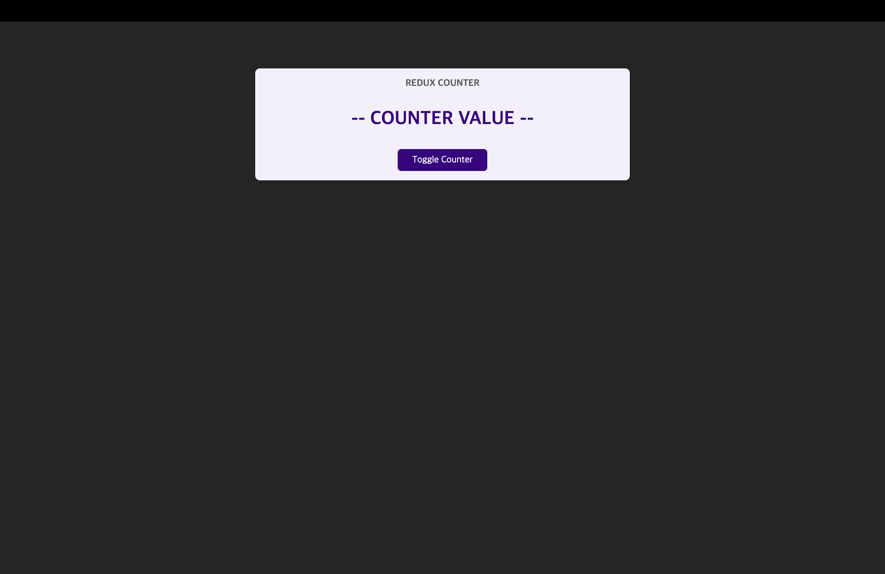
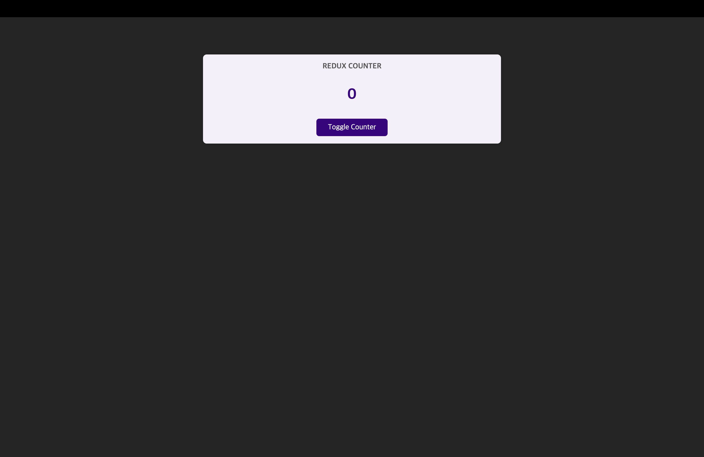
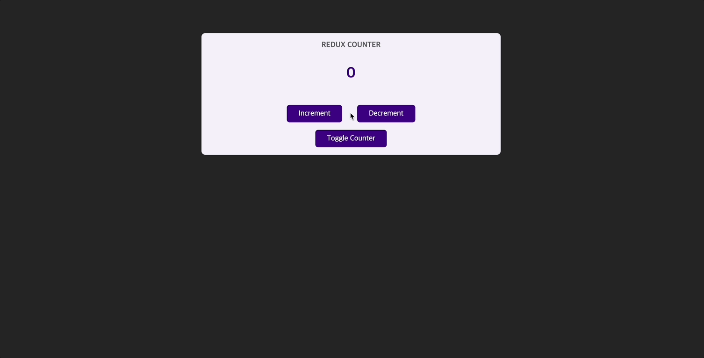
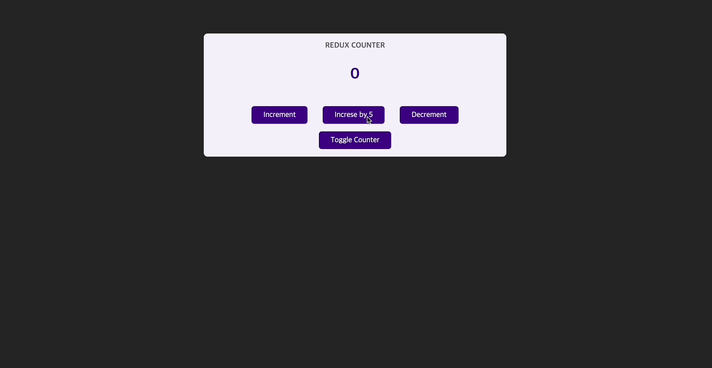
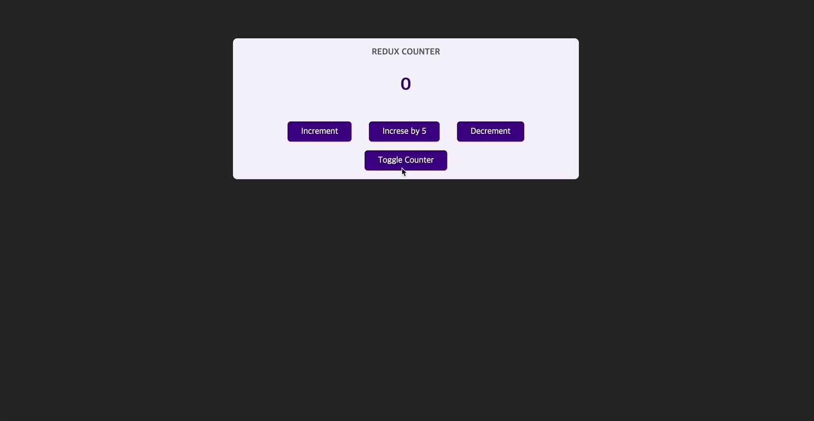

# Redux 알아보기

[📌 리덕스(Redux)](#-리덕스redux)<br>
[📌 프로젝트에 적용해보기](#-프로젝트에-적용해보기)<br>
[📌 리덕스 툴킷(Toolkit)](#-리덕스-툴킷toolkit)<br>
<br>

## 📌 리덕스(Redux)

- 리덕스는 크로스 컴포넌트 또는 웹 와이드 상태를 위한 상태 관리 시스템
- 리덕스는 우리가 상태를 다수의 컴포넌트나 심지어는 앱 전체에서 관리하도록 도와준다.

<br>

- 상태(State)

1. Local State : 데이터가 변경되어서 하나의 컴포넌트에 속하는 UI에 영향을 미치는 상태

   - ex1. 사용자 입력을 청취하고 useState를 이용해서 그 입력을 모든 키 입력과 함께 state 변수에 저장
   - ex2. 토글(클릭하면 보였다가 안보이게 되는)
   - useState/useReducer를 이용해서 컴포넌트 안에서 로컬 상태를 관리한다.

2. Cross-Component State : 다양한 컴포넌트에 영향을 미치는 상태

   - ex1. 모달 컴포넌트를 표시하고 감추는 것.
   - prop 체인 이나 prop drilling이 필요하다.

3. App-Wide State : 애플리케이션의 모든 컴포넌트에 영향을 미치는 상태
   - ex1. 사용자 인증(로그인/로그아웃의 따라 네비게이션을 변화)
   - prop 체인이나 prop drilling이 필요하다.

> Cross-Component State, App-Wide State는 모두 prop을 쉽게 처리하기 위해 Context API를 사용하거나 Redux를 사용해야 한다.

<br>

### 📖 리덕스 vs. 리액트의 컨텍스트

- 리액트 컨텍스트의 잠재적인 단점
  1. 리액트 컨텍스트를 사용하면 설정이 아주 복잡해질 수 있고 상태 관리가 복잡해질 수 있다.
     - 여러 개의 ContextProvider를 사용하거나 하나의 컨텍스트 Provider를 사용하더라도 해당 컨텍스트는 매우 매우 복잡해질 것이다.
  2. 성능 : 데이터가 자주 변경되는 경우에는 좋지 않다. 유동적인 상태 확산을 대체할 수는 없다.

<br>

### 📖 리덕스 작동 방식

- 어플리케이션에 있는 하나의 중앙 데이터 저장소 이다. &rarr; 전체 어플리케이션의 모든 상태를 저장
- 컴포넌트가 데이터 저장소를 구독(Subscription)을 하고 데이터가 변경될 때마다 저장소가 컴포넌트에게 알림을 준다. 그러면 컴포넌트는 필요한 데이터를 받게 된다.(리덕스의 일부 데이터를 받음)
- **컴포넌트는 절대로 저장된 데이터를 직접 조작하지 않는다.**
- 리듀서 함수를 이용하여 변형(저장소 내의 데이터를 변경, 업데이트)을 담당한다. &rarr; useReducer()가 아니다. 리듀서 함수는 일반적인 개념.
- 리듀서 함수와 컴포넌트를 연결하기 위해 Action(자바스크립트의 객체, 리듀서가 실행해야 할 작업을 설명)을 이용한다.
  - 컴포넌트는 액션을 트리거 &rarr; 리덕스는 액션을 리듀서로 전달하고 원하는 작업에 대한 설명(description)을 읽는다. &rarr; 해당 작업을 리듀서가 수행

> 컴포넌트가 액션을 발송(dispatch)하고 그 액션에는 수행해야 할 작업이 서술되어있다(하지만 그것을 직접 하지는 않는다.). 그리고 액션들을 리듀서로 전달해서 액션이 원하는 것을 리듀서가 실행한다. &rarr; 리듀서는 새로운 상태를 내보내고 그것잉 중앙 데이터 저장소의 기존 상태를 대체한다. &rarr; 데이터 저장소가 업데이트가 되면 구독 중이던 컴포넌트가 알림을 받고 컴포넌트는 UI를 업데이트하게 된다.

<br>

### 📖 핵심 리덕스 개념 탐색하기

1. redux-demo.js 생성
2. `npm init`
3. `npm install redux`

#### 💎 redux-demo.js 작성

```js
// 리듀서 함수
const redux = require("redux");

// 초기에 실행될 때 초기 상태값을 지정
const counterReducer = (state = { counter: 0 }, action) => {
  return {
    counter: state.counter + 1,
  };
};

const store = redux.createStore(counterReducer); // 저장소는 어떤 리듀서가 그 저장소를 변경하는지 알아야 한다.
```

- 리듀서 함수 : 표준 자바스크립트 함수이지만 리덕스 라이브러리에 의해 호출될 것이다.
  - 항상 2개의 입력(파라미터)를 받는다. 기존의 상태 + 발송된 액션
  - 항상 새로운 상태 객체를 리턴해야 한다.
  - &rarr; 리듀서 함수는 순수한 함수여야 한다.동일한 입력 값을 넣으면 동일한 출력을 내보내야 한다.

<br>

```js
// 구독자
const counterSubscriber = () => {
  const latestState = store.getState();
  console.log(latestState);
};

store.subscribe(counterSubscriber);
```

- 구독자
  - `store.getState()` : `createStore()`로 생성된 저장소에서 업데이트 된 이후의 최신 상태 스냅샷을 제공한다

<br>

```js
// 액션
store.dispatch({ type: "increment" });
```

- 액션

  - 액션을 발송하는 메서드. 액션은 자바스크립트 Object로 식별자 역할을 하는 type 프로퍼티를 가진다.

- `node redux-demo.js`를 터미널에 입력하여 실행 &rarr; { counter: 2 } (초기 값은 counter:1 )

<br>

### 📖 더 많은 리덕스 기본 사항

#### 💎 redux-demo.js - 1

```js
// 리듀서 함수
const redux = require("redux");

const counterReducer = (state = { counter: 0 }, action) => {
  if (action.type === "increment") {
    return {
      counter: state.counter + 1,
    };
  }

  return state;
};

const store = redux.createStore(counterReducer);

// 구독자
const counterSubscriber = () => {
  const latestState = store.getState();
  console.log(latestState);
};

store.subscribe(counterSubscriber);

// 액션
store.dispatch({ type: "increment" });
```

#### 💎 `node redux-demo.js`

- 결과 : { counter: 1 }

---

#### 💎 redux-demo.js - 2

```js
// 리듀서 함수
const redux = require("redux");

const counterReducer = (state = { counter: 0 }, action) => {
  if (action.type === "increment") {
    return {
      counter: state.counter + 1,
    };
  }

  if (action.type === "decrement") {
    return {
      counter: state.counter - 1,
    };
  }

  return state;
};

const store = redux.createStore(counterReducer);

// 구독자
const counterSubscriber = () => {
  const latestState = store.getState();
  console.log(latestState);
};

store.subscribe(counterSubscriber);

// 액션
store.dispatch({ type: "increment" });
store.dispatch({ type: "decrement" });
```

#### 💎 `node redux-demo.js`

- 결과

```bash
{ counter: 1 }
{ counter: 0 }
```

- 첫번째 결과 : 증가 액션 다음에 `store.subscribe()`에서 왔다.
- 두번째 결과 : 상태를 변경 &rarr; subscription을 트리거하여 결과가 나옴.

<br>

## 📌 프로젝트에 적용해보기

1. `npm install redux react-redux` : react-redux는 리액트 앱과 리덕스 저장소와 리듀서에 간단히 접속하게 함.
2. `npm start`
   

<br>

### 📖 리액트 용 리액스 store 만들기

#### 💎 src/store/index.jsx

```jsx
import { createStore } from "redux";

const counterReducer = (state = { counter: 0 }, action) => {
  if (action.type === "increment") {
    return {
      counter: state.counter + 1,
    };
  }

  if (action.type === "decrement") {
    return {
      counter: state.counter - 1,
    };
  }

  return state;
};

const store = createStore(counterReducer);

export default store;
```

<br>

### 📖 스토어 제공하기

- 앱 전체를 렌더링한 index.js에서 `react-redux`에서 `Provider` 컴포넌트를 import 할 수 있다.
- Provider를 import한다고 해서 현재 react-redux가 index.jsx에서 우리가 만든 store에 대해서 알지 못한다. 따라서 다음과 같이 작성하여 Provider의 store 속성에 우리가 만든 store를 전달한다.

```js
import React from "react";
import ReactDOM from "react-dom/client";
import { Provider } from "react-redux";

import "./index.css";
import App from "./App";
import store from "./store/index.jsx";

const root = ReactDOM.createRoot(document.getElementById("root"));
root.render(
  <Provider store={store}>
    <App />
  </Provider>
);
```

- 이제, App 컴포넌트와 하위 컴포넌트들은 해당 저장소에 접근할 수 있다.

<br>

### 📖 리액트 컴포넌트에서 리덕스 데이터 사용하기

#### 💎 Counter.js

```js
import classes from "./Counter.module.css";
import { useSelector } from "react-redux";

const Counter = () => {
  // 해당 함수를 react-redux가 수행. 이 컴포넌트에 필요로 하는 상태 부분을 받아온다.
  // useSelector를 사용할 때 react-redux는 이 컴포넌트를 위해 리덕스 저장소에 자동으로 구독을 설정함.
  // 이제 이 컴포넌트는 리덕스 저장소에서 데이터가 변경될 때마다 자동으로 업데이트되고 최신 카운터를 받는다.
  const counter = useSelector((state) => state.counter);

  const toggleCounterHandler = () => {};

  return (
    <main className={classes.counter}>
      <h1>Redux Counter</h1>
      <div className={classes.value}>{counter}</div>
      <button onClick={toggleCounterHandler}>Toggle Counter</button>
    </main>
  );
};

export default Counter;
```

- `useSelector` : react-redux 팀이 만든 커스텀 훅으로 저장소가 관리하는 상태 부분을 우리가 자동으로 선택할 수 있다.
  - `useStore`도 있으나 `useSelector`가 사용하기 더 편하다.
  - 만약 함수형 컴포넌트가 아닌 클래스 기반 컴포넌트를 사용한다면 `useSelector` 대신 `connect`를 사용할 수 있다.



<br>

### 📖 내부 컴포넌트에서 Action을 Dispatch하기

#### 💎 Counter.js

```js
import classes from "./Counter.module.css";
import { useSelector, useDispatch } from "react-redux";

const Counter = () => {
  const counter = useSelector((state) => state.counter);

  const dispatch = useDispatch();

  const incrementHandler = () => {
    dispatch({ type: "increment" });
  };

  const decrementHandler = () => {
    dispatch({ type: "decrement" });
  };

  const toggleCounterHandler = () => {};

  return (
    <main className={classes.counter}>
      <h1>Redux Counter</h1>
      <div className={classes.value}>{counter}</div>
      <div className="counter">
        <button onClick={incrementHandler}>Increment</button>
        <button onClick={decrementHandler}>Decrement</button>
      </div>
      <button onClick={toggleCounterHandler}>Toggle Counter</button>
    </main>
  );
};

export default Counter;
```

- `useDispatch` : 실행할 수 있는 dispatch function을 반환한다.
  - 반환된 `dispatch` 함수는 redux store에 대한 action을 보낸다.



<br>

### 📖 클래스 기반 컴포넌트가 있는 리덕스

```js
import { Component } from "react";
import classes from "./Counter.module.css";
import { connect } from "react-redux";

class Counter extends Component {
  incrementHandler() {
    this.props.increment();
  }

  decrementHandler() {
    this.props.decrement();
  }

  toggleCounterHandler() {}
  render() {
    return (
      <main className={classes.counter}>
        <h1>Redux Counter</h1>
        <div className={classes.value}>{this.props.counter}</div>
        <div className="counter">
          <button onClick={this.incrementHandler.bind(this)}>Increment</button>
          <button onClick={this.decrementHandler.bind(this)}>Decrement</button>
        </div>
        <button onClick={this.toggleCounterHandler.bind(this)}>
          Toggle Counter
        </button>
      </main>
    );
  }
}

// 리덕스 상태를 받는 함수 => useSelector와 비슷
const mapStateToProps = (state) => {
  return {
    counter: state.counter,
  };
};

const mapDispatchToProps = (dispatch) => {
  return {
    increment: () => dispatch({ type: "increment" }),
    decrement: () => dispatch({ type: "decrement" }),
  };
};

export default connect(mapStateToProps, mapDispatchToProps)(Counter);
// 커넥트가 실행되면 새로운 함수를 그 값으로 리턴한다.
```

- connect는 기본적으로 useSelector와 비슷하다.
- connect는 두 개의 함수를 파라미터로 받는다. 하나는 `mapStateToProps`이고 다른 하나는 `mapDispatchToProps`이다.
- props를 이용해서 해당 컴포넌트에 state, dispatch를 전달할 것이다.

<br>

### 📖 작업에 페이로드 연결하기

#### 💎 index.jsx

```jsx
import { createStore } from "redux";

const counterReducer = (state = { counter: 0 }, action) => {
  if (action.type === "increment") {
    return {
      counter: state.counter + 1,
    };
  }

  // 5씩 증가하기 위한 리듀서 함수 작성
  if (action.type === "increase") {
    return {
      counter: state.counter + action.amount,
    };
  }

  if (action.type === "decrement") {
    return {
      counter: state.counter - 1,
    };
  }

  return state;
};

const store = createStore(counterReducer);

export default store;
```

#### 💎 Counter.js

```js
import classes from "./Counter.module.css";
import { useSelector, useDispatch, connect } from "react-redux";

const Counter = () => {
  const counter = useSelector((state) => state.counter);

  const dispatch = useDispatch();

  const incrementHandler = () => {
    dispatch({ type: "increment" });
  };

  // 5씩 증가하기 위한 함수 작성 -> index.jsx에서 작성된 리듀서 함수와 같은 action 프로퍼티(amount)를 사용해야한다.
  const increseHandler = () => {
    dispatch({ type: "increase", amount: 5 });
  };

  const decrementHandler = () => {
    dispatch({ type: "decrement" });
  };

  const toggleCounterHandler = () => {};

  return (
    <main className={classes.counter}>
      <h1>Redux Counter</h1>
      <div className={classes.value}>{counter}</div>
      <div className="counter">
        <button onClick={incrementHandler}>Increment</button>
        {/* increaseHandler 연결 */}
        <button onClick={increseHandler}>Increse by 5</button>
        <button onClick={decrementHandler}>Decrement</button>
      </div>
      <button onClick={toggleCounterHandler}>Toggle Counter</button>
    </main>
  );
};

export default Counter;
```



<br>

### 📖 여러 State 속성 작업하기

#### 💎 index.jsx

```jsx
import { createStore } from "redux";

const initailState = { counter: 0, showCounter: true }; // 초기 상태

const counterReducer = (state = initailState, action) => {
  if (action.type === "increment") {
    return {
      counter: state.counter + 1,
      showCounter: state.showCounter,
    };
  }

  if (action.type === "increase") {
    return {
      counter: state.counter + action.amount,
      showCounter: state.showCounter,
    };
  }

  if (action.type === "decrement") {
    return {
      counter: state.counter - 1,
      showCounter: state.showCounter,
    };
  }

  // 토글 버튼을 위한 리듀서 함수 작성
  if (action.type === "toggle") {
    return {
      showCounter: !state.showCounter,
      counter: state.counter,
    };
  }

  return state;
};

const store = createStore(counterReducer);

export default store;
```

#### 💎 Counter.js

```js
import classes from "./Counter.module.css";
import { useSelector, useDispatch, connect } from "react-redux";

const Counter = () => {
  const counter = useSelector((state) => state.counter);
  const show = useSelector((state) => state.showCounter); // showCounter 상태 받아옴

  const dispatch = useDispatch();

  const incrementHandler = () => {
    dispatch({ type: "increment" });
  };

  const increseHandler = () => {
    dispatch({ type: "increase", amount: 5 });
  };

  const decrementHandler = () => {
    dispatch({ type: "decrement" });
  };

  // 토글 동작
  const toggleCounterHandler = () => {
    dispatch({ type: "toggle" });
  };

  return (
    <main className={classes.counter}>
      <h1>Redux Counter</h1>
      {show && <div className={classes.value}>{counter}</div>}
      <div className="counter">
        <button onClick={incrementHandler}>Increment</button>
        <button onClick={increseHandler}>Increse by 5</button>
        <button onClick={decrementHandler}>Decrement</button>
      </div>
      <button onClick={toggleCounterHandler}>Toggle Counter</button>
    </main>
  );
};

export default Counter;
```



🔗[레파지토리에서 보기](https://github.com/Imshyeon/Develop_Study/commit/f00308bb43e99af8891438803239ecf131b7b309#diff-8e801077a9efeacfe8d8c9705373827406d4e4b04bec6acd4102443527c59728)

<br>

### 📖 리덕스 State를 올바르게 사용하는 방법

```jsx
// index.jsx
const counterReducer = (state = initailState, action) => {
  if (action.type === "increment") {
    return {
      counter: state.counter + 1,
      showCounter: state.showCounter, // 꼭 이런식으로 계속해서 오버라이딩을 해줘야 한다.
    };
  }
  return state;
};
```

- 리덕스가 기존의 상태를 업데이트하려면 완전히 새로운 객체인 새 Snapshot을 항상 반환해야한다.
- 기존의 상태와 병합하지 않고 기존의 상태를 **'오버라이딩'**한다.

```jsx
// index.jsx
// 🚨 잘못된 방법 🚨
const counterReducer = (state = initailState, action) => {
  if (action.type === "increment") {
    state.counter++;
    return state;
  }
  return state;
};
```

- 위처럼 `state.counter++`처럼 **절대 기존의 state를 변형해서는 안된다!!**
- 리덕스로 작업할 때는 원본의 state를 절대 변경해서는 안된다.

> 항상 새로운 state 객체를 반환해서 재정의해야한다.

<br>

## 📌 리덕스 툴킷(Toolkit)

리덕스에서 관리해야 할 상태가 더 많아질 경우

1. 액션 타입에서 문제가 발생할 수 있다. &rarr; 어떠한 오타가 나면 리듀서가 처리하지 못한다.
2. 관리하는 데이터와 상태가 많을 수록 상태 객체도 점점 커진다. 즉, 많은 상태를 복사해서 계속해서 새로운 객체를 리턴해야하므로 리듀서의 함수 길이가 길어지고 관리하기가 힘들어 진다.
3. 위와 비슷하게 새로운 상태를 리턴하는 과정에서 실수를 할 가능성이 높아진다.

<br>

위와 같은 문제점을 해결하기 위해서 Redux toolkit을 사용한다.

🔗 [Redux Toolkit](https://redux-toolkit.js.org)

<br>

### 📖 State 슬라이스 추가하기

1. 설치하기 : `npm install @reduxjs/toolkit`
2. package.json에서 redux를 삭제해야한다. 왜냐하면 이미 redux toolkit에 포함되어있기 때문.
3. `npm start`

#### 💎 Counter.js

```js
import { createSlice } from "@reduxjs/toolkit";

const initailState = { counter: 0, showCounter: true };

// 전역 상태의 slice 미리 만들기
createSlice({
  name: "counter",
  initialState: initailState,
  reducers: {
    increment(state) {
      // 바로 상태를 변경할 수 있다. => 그러나 상태를 직접 변경하는 것처럼 보일 뿐이다.
      state.counter++;
    },
    decrement(state) {
      state.counter--;
    },
    increase(state, action) {
      state.counter = state.counter + action.amount;
    },
    toggleCounter(state) {
      state.showCounter = !state.showCounter;
    },
  },
});
```

- `createSlice`
  - immer라는 내부 패키지를 이용해서 자동으로 원래있던 상태를 복제. &rarr; 새로운 상태 객체를 생성하고 오버라이딩해준다.
  - 즉 보이기는 상태를 직접 변경하는 것처럼 보일 뿐 실제로 직접 변경하는 것은 아니다.
