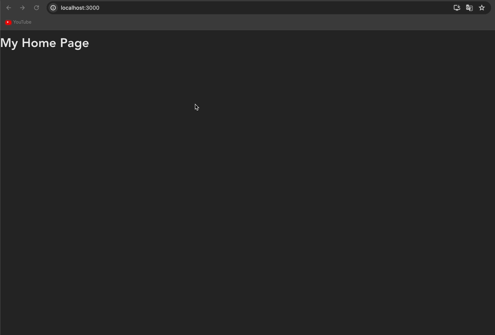
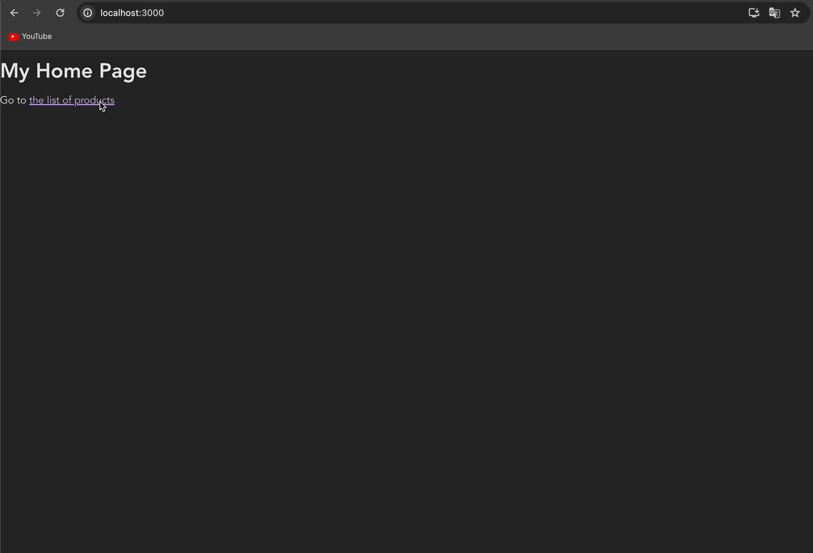
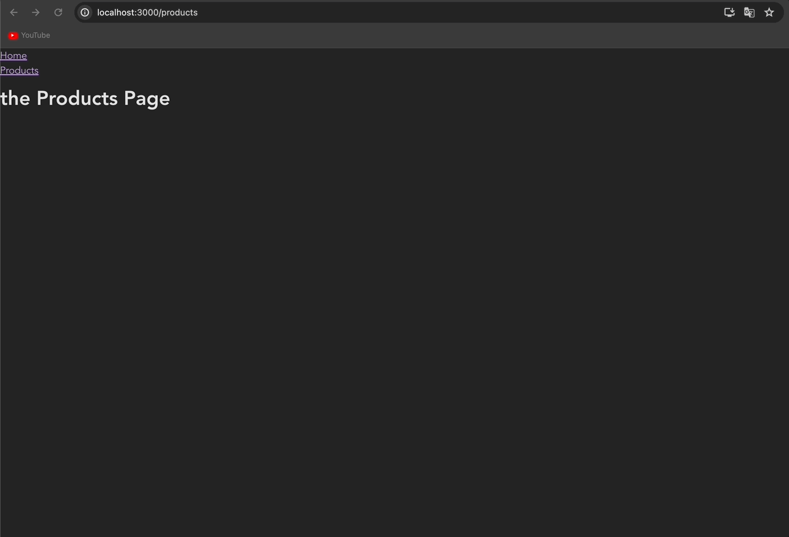
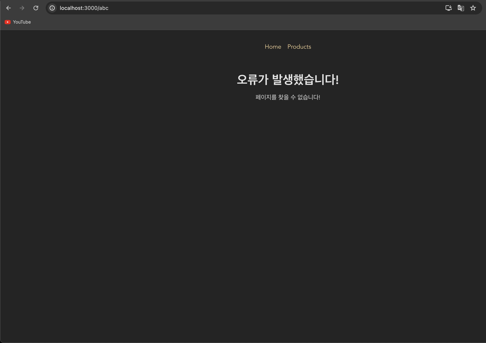
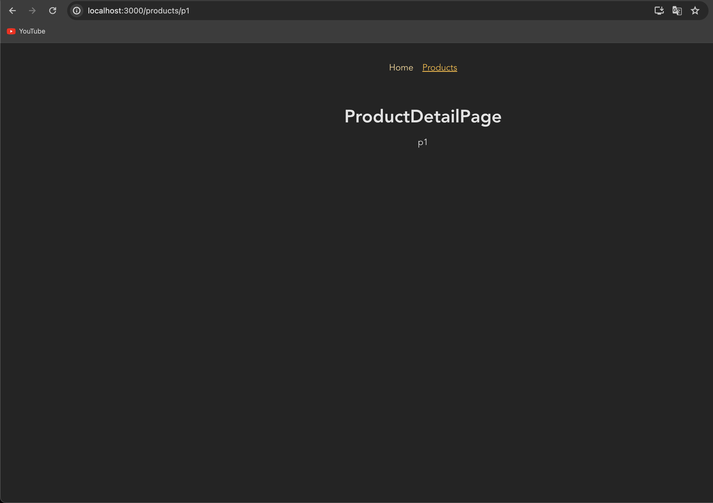
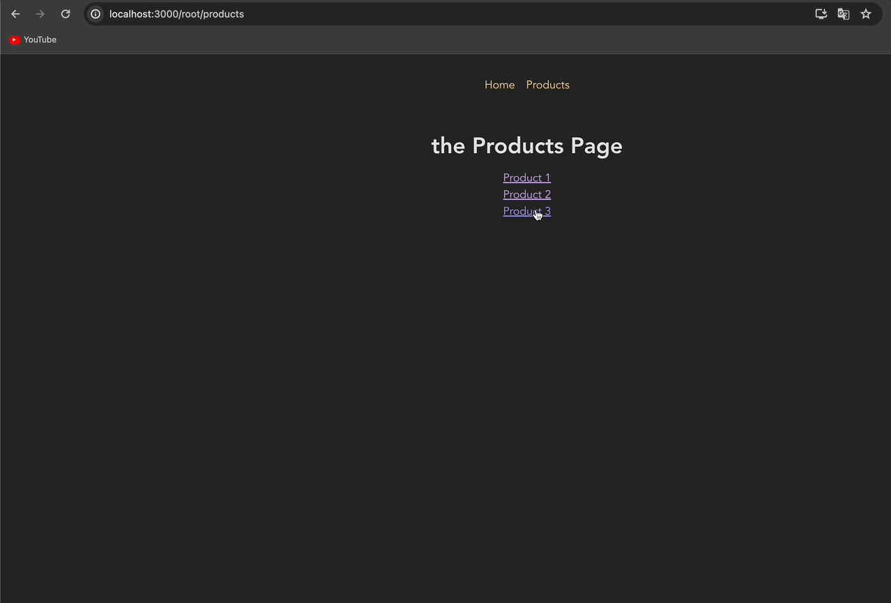

# 리액트 라우터가 있는 SPA 다중 페이지 구축하기 | Single-Page Application Routing

[📌 라우팅](#-라우팅)<br>
<br>

## 📌 라우팅

- 라우팅 : URL의 경로가 다르면, 다른 콘텐츠가 화면에 로딩된다. &rarr; 1.html / 2.html 처럼 다른 파일을 통해 라우팅을 구현했다.
  - 항상 새로운 컨텐츠를 가져와야 한다. 새로운 Http 요청을 전송하고 새로운 응답을 받는 과정에서 사용자의 흐름이 중단될 수 있다. &rarr; 사용자 경험에 부정적인 영향이 있을 수 있다.
- 지금까지 우리는 URL에 따라 페이지를 로딩하진 않았다. (SPAs : Single-Page Applications)
  - 최초 HTML 요청을 하나만 전송한다.

### 📖 프로젝트 셋업 & 리액트 라우터 설치하기

- `npm install react-router-dom`

  🔗 [React Router](https://reactrouter.com/en/main)

<br>

### 📖 라우트 정의하기

- `createBrowserRouter` : 이 어플리케이션에서 지원하려는 라우트를 정의한다. 해당 함수 안에 라우터 정의 객체로 된 배열을 넣고, 모든 객체들은 각각 하나의 라우트를 가리킨다.
  - `path` : 경로 지정
  - `element` : 요소를 정의 -> 해당 경로가 활성화되면 element에서 작성한 JSX코드가 연결
  - `createBrowserRouter`에서 리턴된 값을 변수나 상수에 저장.
  - &rarr;해당 router를 화면에 렌더링해야하거나 또는 그 router를 로딩해야하고 적절한 페이지에 렌더링해야함을 알리기 위해서 저장
- `RouterProvider` : 이 컴포넌트는 우리의 JSX 코드에서 사용할 수 있는 일반 컴포넌트
  - 이 컴포넌트는 router 프로퍼티가 있는데, 이는 위에서 저장한 상수 router를 사용한다.

```js
import { createBrowserRouter, RouterProvider } from "react-router-dom";
import HomePage from "./pages/Home";

const router = createBrowserRouter([
  { path: "/", element: <HomePage /> }, // 메인.
]);

function App() {
  return <RouterProvider router={router} />;
}

export default App;
```

<br>

### 📖 두번째 라우트 정의하기

```js
import { createBrowserRouter, RouterProvider } from "react-router-dom";
import HomePage from "./pages/Home";
import ProductsPage from "./pages/Products";

const router = createBrowserRouter([
  { path: "/", element: <HomePage /> },
  { path: "/products", element: <ProductsPage /> },
]);

function App() {
  return <RouterProvider router={router} />;
}

export default App;
```



<br>

### 📖 라우터 정의하는 다른 방법들

```js
import {
  createBrowserRouter,
  createRoutesFromElements,
  Route,
  RouterProvider,
} from "react-router-dom";
import HomePage from "./pages/Home";
import ProductsPage from "./pages/Products";

const routeDefinitions = createRoutesFromElements(
  <Route>
    <Route path="/" element={<HomePage />} />
    <Route path="/products" element={<ProductsPage />} />
  </Route>
);

// const router = createBrowserRouter([
//   { path: "/", element: <HomePage /> },
//   { path: "/products", element: <ProductsPage /> },
// ]);
const router = createBrowserRouter(routeDefinitions);

function App() {
  return <RouterProvider router={router} />;
}

export default App;
```

<br>

### 📖 Link로 페이지들 간에 이동하기

#### 💎 Home.js

```js
import { Link } from "react-router-dom";
function HomePage() {
  return (
    <>
      <h1>My Home Page</h1>
      <p>
        Go to <Link to="/products">the list of products</Link>
      </p>
    </>
  );
}

export default HomePage;
```

- Link 컴포넌트는 배후에서 앵커(`<a>`) 요소를 렌더링하게 되지만 기본적으로는 그 요소에 대한 클릭을 감시.
- 링크를 클릭했을 때, HTTP 요청을 전송하는 브라우저 기본 설정을 막는다.
- 그 대신에 단순히 라우트 정의를 확인하여 페이지를 업데이트하고 그에 맞는 콘텐츠를 로딩한다.
  &rarr; 그럼으로써 페이지를 로딩하는데 필요한 스크립트, html 다운을 방지. 상태와 컨텍스트의 초기화를 방지한다.



<br>

### 📖 레이아웃 및 중첩된 라우트

#### 💎 App.js

```js
import { createBrowserRouter, RouterProvider } from "react-router-dom";
import HomePage from "./pages/Home";
import ProductsPage from "./pages/Products";
import RootLayout from "./pages/Root";

const router = createBrowserRouter([
  {
    path: "/",
    element: <RootLayout />,
    children: [
      { path: "/", element: <HomePage /> },
      { path: "/products", element: <ProductsPage /> },
    ],
  },
]);

function App() {
  return <RouterProvider router={router} />;
}

export default App;
```

- 레이아웃 역할을 하는 루트 라우트를 여러 개 만들 수 있다. &rarr; django에서 base.html을 만든 느낌이라고 생각하면 된다.

#### 💎 components/MainNavigation.js

```js
import { Link } from "react-router-dom";

function MainNavigaton() {
  return (
    <header>
      <nav>
        <ul>
          <li>
            <Link to="/">Home</Link>
          </li>
          <li>
            <Link to="/products">Products</Link>
          </li>
        </ul>
      </nav>
    </header>
  );
}

export default MainNavigaton;
```

#### 💎 Root.js

```js
import MainNavigaton from "../components/MainNavigation";
import { Outlet } from "react-router-dom";
// Outlet : 이 컴포넌트는 자녀 라우트 요소들이 렌더링되어야 할 장소를 표시하는 역할을 한다.

function RootLayout() {
  return (
    <>
      <MainNavigaton />
      <Outlet />
    </>
  );
}
export default RootLayout;
```



<br>

### 📖 errorElement로 오류 페이지 표시하기

- 메인에서 존재하지 않는 페이지에 접근할 때 react-router-dom 패키지가 자동으로 오류를 생성해 에러 페이지로 이동

#### 💎 Error.js

```js
import MainNavigaton from "../components/MainNavigation";
function ErrorPage() {
  return (
    <>
      <MainNavigaton />
      <main>
        <h1>오류가 발생했습니다!</h1>
        <p>페이지를 찾을 수 없습니다!</p>
      </main>
    </>
  );
}
export default ErrorPage;
```

#### 💎 App.js

```js
import { createBrowserRouter, RouterProvider } from "react-router-dom";
import HomePage from "./pages/Home";
import ProductsPage from "./pages/Products";
import RootLayout from "./pages/Root";
import ErrorPage from "./pages/Error";

const router = createBrowserRouter([
  {
    path: "/",
    element: <RootLayout />,
    errorElement: <ErrorPage />, // 에러 페이지
    children: [
      { path: "/", element: <HomePage /> },
      { path: "/products", element: <ProductsPage /> },
    ],
  },
]);

function App() {
  return <RouterProvider router={router} />;
}

export default App;
```



<br>

### 📖 네비게이션 링크 사용하기

- 활성화된 링크를 강조하기
- `NavLink`는 `Link`와 똑같이 사용하지만 특수한 동작이 있다.
  - &rarr; 함수를 받는 `className` 프로퍼티를 추가하면 그 함수는 앵커 태그에 추가되어야 하는 CSS 클래스 네임을 리턴할 것이다.
  - 해당 함수는 자동적으로 객체를 받고, isActive 프로퍼티를 할당한다.(react-router-dom이 제공하는 프로퍼티이고 불리언이다.)
- 기본적으로 `NavLink`는 실제로 현재 활성인 라우트의 경로가 NavLink의 경로로 시작하는지 확인한다. 이 프로젝트에서는 '/' 라우트에서 동작하게 된다. &rarr; 이는 모든 라우트에서 활성화되는 것이다. 따라서 react-router-dom은 `end` 프로퍼티도 제공한다.
  <br>

- `end` : 현재 활성인 라우트의 URL 뒤가 해당 경로로 끝나면, 해당 링크를 활성화했음을 간주한다는 의미..

#### 💎 MainNavigation.js

```js
import { NavLink } from "react-router-dom";
import classes from "./MainNavigation.module.css";

function MainNavigaton() {
  return (
    <header className={classes.header}>
      <nav>
        <ul className={classes.list}>
          <li>
            <NavLink
              to="/"
              className={({ isActive }) =>
                isActive ? classes.active : undefined
              }
              style={({ isActive }) => ({
                textAlign: isActive ? "center" : "left",
              })}
              end
            >
              Home
            </NavLink>
          </li>
          <li>
            <NavLink
              to="/products"
              className={({ isActive }) =>
                isActive ? classes.active : undefined
              }
            >
              Products
            </NavLink>
          </li>
        </ul>
      </nav>
    </header>
  );
}

export default MainNavigaton;
```

- '/products' 에는 `end`를 넣을 필요가 없다. 왜냐하면 현재까지 '/products'로 끝나는 페이지가 더 없기 때문이다! &rarr; 유일한 페이지
- '/'는 `end`를 넣어야만 한다 왜냐하면 '/'는 대부분의 페이지에서 거의 다 쓰이고 있기 때문이다.

<br>

### 📖 프로그램적으로 페이지 이동(네비게이션)하기

#### 💎 Home.js

```js
import { Link, useNavigate } from "react-router-dom";
function HomePage() {
  const navigate = useNavigate();

  function navigateHandler() {
    navigate("/products");
  }

  return (
    <>
      <h1>My Home Page</h1>
      <p>
        Go to <Link to="/products">the list of products</Link>
      </p>
      <p>
        <button onClick={navigateHandler}>Navigate</button>
      </p>
    </>
  );
}

export default HomePage;
```

- `useNavigate`: 네비게이션 동작을 트리거할 수 있다. 즉, 코드 안에서 다른 라우트로 전환 가능.

<br>

### 📖 동적 라우트 정의하고 사용하기

- `:productId`와 같은 동적 세그먼트 추가
- :을 이용해 react-router-dom에게 해당 부분이 동적임을 알린다.

#### 💎 App.js

```js
import { createBrowserRouter, RouterProvider } from "react-router-dom";
import HomePage from "./pages/Home";
import ProductsPage from "./pages/Products";
import RootLayout from "./pages/Root";
import ErrorPage from "./pages/Error";
import ProductDetailPage from "./pages/ProductDetail";

const router = createBrowserRouter([
  {
    path: "/",
    element: <RootLayout />,
    errorElement: <ErrorPage />,
    children: [
      { path: "/", element: <HomePage /> },
      { path: "/products", element: <ProductsPage /> },
      { path: "/products/:productId", element: <ProductDetailPage /> },
    ],
  },
]);

function App() {
  return <RouterProvider router={router} />;
}

export default App;
```

#### 💎 ProductDetail.js

```js
import { useParams } from "react-router-dom";

function ProductDetailPage() {
  const params = useParams();
  // params 객체는 우리가 라우트 정의에서 프로퍼티로 정의한 모든 역동적인 경로 세그먼트가 담긴 간단한 자바스크립트 객체이다.

  return (
    <>
      <h1> ProductDetailPage </h1>
      <p>{params.productId}</p>
      {/* '/products/:productId' */}
    </>
  );
}

export default ProductDetailPage;
```



<br>

### 📖 동적 라우트에 링크 추가하기

#### 💎 Products.js

```js
import { Link } from "react-router-dom";

const PRODUCTS = [
  { id: "p1", title: "Product 1" },
  { id: "p2", title: "Product 2" },
  { id: "p3", title: "Product 3" },
];

function ProductsPage() {
  return (
    <>
      <h1>the Products Page</h1>
      <ul>
        {PRODUCTS.map((product) => (
          <li key={product.id}>
            <Link to={`/products/${product.id}`}>{product.title}</Link>
          </li>
        ))}
      </ul>
    </>
  );
}

export default ProductsPage;
```


<br>

### 📖 상대 경로와 절대 경로

- 경로가 '/'로 시작되면 절대 경로이다.

#### 💎 App.js

```js
import { createBrowserRouter, RouterProvider } from "react-router-dom";
import HomePage from "./pages/Home";
import ProductsPage from "./pages/Products";
import RootLayout from "./pages/Root";
import ErrorPage from "./pages/Error";
import ProductDetailPage from "./pages/ProductDetail";

const router = createBrowserRouter([
  {
    path: "/root",
    element: <RootLayout />,
    errorElement: <ErrorPage />,
    children: [
      { path: "", element: <HomePage /> },
      { path: "products", element: <ProductsPage /> },
      { path: "products/:productId", element: <ProductDetailPage /> },
    ],
  },
]);

function App() {
  return <RouterProvider router={router} />;
}

export default App;
```

- 위와 같이 작성하면 상대 경로가 된다. 즉 '/'가 없는 경로가 상대 경로이다.
- 위의 코드들은 래퍼 라우트('/root')의 경로 뒤에 상대경로가 첨부된다는 의미이다.
- 즉, 상대 경로를 사용한다면 자녀 라우트를 부모 라우트 경로 뒤에 첨부하게 된다.
- `/root`, `/root/products`, `/root/products/p1`로 접근이 가능하다.
- 이는 `Link`, `NavLink`의 to 프로퍼티에도 적용이 된다.

#### 💎 Products.js

- `Link` 컴포넌트를 사용할 때 특수한 relative 프로퍼티 추가할 수 있고 이것은 path 또는 route 중에 하나로 설정 가능하다.
- 해당 세그먼트를 현재 활성화된 라우트 겅로에 대해 상대적으로 추가하는지, 혹은 URL에서 현재 활성화된 경로에 대해 추가하는지 제어한다. &rarr; route/path는 같을 수도 있고 다를 수도 있다.

```js
import { Link } from "react-router-dom";

const PRODUCTS = [
  { id: "p1", title: "Product 1" },
  { id: "p2", title: "Product 2" },
  { id: "p3", title: "Product 3" },
];

function ProductsPage() {
  return (
    <>
      <h1>the Products Page</h1>
      <ul>
        {PRODUCTS.map((product) => (
          <li key={product.id}>
            <Link to={product.id}>{product.title}</Link>
          </li>
        ))}
      </ul>
    </>
  );
}

export default ProductsPage;
```

#### 💎 ProductDetail.js - relative 프로퍼티

```js
import { useParams, Link } from "react-router-dom";

function ProductDetailPage() {
  const params = useParams();
  // params 객체는 우리가 라우트 정의에서 프로퍼티로 정의한 모든 역동적인 경로 세그먼트가 담긴 간단한 자바스크립트 객체이다.

  return (
    <>
      <h1> ProductDetailPage </h1>
      <p>{params.productId}</p>
      {/* '/products/:productId' */}
      <p>
        <Link to="..">Back</Link>
      </p>
    </>
  );
}

export default ProductDetailPage;
```

- `/root/products/p1`에서 Back 버튼을 누르면 다시 `/root`로 돌아옴을 알 수 있다.
- 그 이유는, 해당 Link는 App.js에서 설정한 라우트에 의해서 상대적으로 정의되었기 때문이다.
- App.js에서 부모 라우트는 `/root`이고 자녀 라우트로 3개가 있는데, 이때 `products`와 `products/:productId`는 형제 라우트이다. 따라서 라우트를 기준으로 `<Link to="..">`을 하면 부모 라우트로 가는 것이다.
- 우리는 Back 버튼을 눌렀을 때 `/root/products/p1` &rarr; `/root/producst`로 가고 싶기 때문에 다음과 같이 설정한다.

```js
import { useParams, Link } from "react-router-dom";

function ProductDetailPage() {
  const params = useParams();

  return (
    <>
      <h1> ProductDetailPage </h1>
      <p>{params.productId}</p>
      <p>
        <Link to=".." relative="path">
          Back
        </Link>
      </p>
    </>
  );
}

export default ProductDetailPage;
```

- `relative="path"`를 함으로써 Back 버튼을 눌렀을 때 `/root/products/p1`&rarr;`/root/products`로 갈 수 있게 된다.


