# 연습 프로젝트 : 리액트 라우터

[📌 스스로 해결하기](#-스스로-해결하기)<br>
[📌 데이터 가져오기 & 제출하기](#-데이터-가져오기--제출하기)<br>
<br>

## 📌 스스로 해결하기

App.js의 설명대로 라우터 구성하기(가능하면 마지막 보너스 과제도 풀어보기!)

### 📖 1번 문제 : 5개의 더미 페이지 컴포넌트 생성

🔗 [레파지토리에서 보기](https://github.com/Imshyeon/Develop_Study/tree/ce7884c60540b6dc68281813ea0773f5fbc17518/React/Complete-React/23_React-Router-Practice/frontend/src/pages)

<br>

### 📖 2,3,4번 문제 : 각 페이지의 라우팅 설정하기, 네비게이션 설정 및 링크

#### 💎 App.js

```js
import { createBrowserRouter, RouterProvider } from "react-router-dom";

import RootPage from "./pages/RootPage";
import HomePage from "./pages/HomePage";
import EventsPage from "./pages/EventsPage";
import EventDetailPage from "./pages/EventDetailPage";
import NewEventPage from "./pages/NewEventPage";
import EditEventPage from "./pages/EditEventPage";

const router = createBrowserRouter([
  {
    path: "/",
    element: <RootPage />,
    errorElement: <p>Error</p>,
    children: [
      { index: true, element: <HomePage /> },
      { path: "events", element: <EventsPage /> },
      { path: "events/:id", element: <EventDetailPage /> },
      { path: "events/new", element: <NewEventPage /> },
      { path: "events/:id/edit", element: <EditEventPage /> },
    ],
  },
]);

function App() {
  return <RouterProvider router={router} />;
}

export default App;
```

#### 💎 RootPage.js

```js
import MainNavigation from "../components/MainNavigation";
import { Outlet } from "react-router-dom";

function RootPage() {
  return (
    <>
      <MainNavigation />
      <Outlet />
    </>
  );
}
export default RootPage;
```

- Outlet을 추가하지 않아서 표현이 안됐었다...! 😂

<br>

### 📖 5번 문제 : 네비게이션 클래스 네임을 이용해 활성화된 페이지 표현하기

#### 💎 MainNavigation.js

```js
import classes from "./MainNavigation.module.css";
import { NavLink } from "react-router-dom";

function MainNavigation() {
  return (
    <header className={classes.header}>
      <nav>
        <ul className={classes.list}>
          <li>
            <NavLink
              to="/"
              className={({ isActive }) =>
                isActive ? classes.active : undefined
              }
              end
            >
              Home
            </NavLink>
          </li>
          <li>
            <NavLink
              to="events"
              className={({ isActive }) =>
                isActive ? classes.active : undefined
              }
            >
              Events
            </NavLink>
          </li>
        </ul>
      </nav>
    </header>
  );
}

export default MainNavigation;
```

### 📖 6, 7번 문제 : EventsPage에 더미 이벤트 리스트 출력하기 - 각 이벤트 리스트는 EventDetailPage와 연결

#### 💎 EventsPage.js

```js
import { Link } from "react-router-dom";
const DUMMY_EVENTS = [
  {
    id: "event1",
    title: "Event Page 1",
  },
  {
    id: "event2",
    title: "Event Page 2",
  },
  {
    id: "event3",
    title: "Event Page 3",
  },
  {
    id: "event4",
    title: "Event Page 4",
  },
  {
    id: "event5",
    title: "Event Page 5",
  },
];
function EventsPage() {
  return (
    <>
      <h1>EventsPage</h1>
      <ul>
        {DUMMY_EVENTS.map((event) => (
          <li key={event.id}>
            <Link to={event.id}>{event.title}</Link>
          </li>
        ))}
      </ul>
    </>
  );
}

export default EventsPage;
```

#### 💎 EventDetailPage.js

```js
import { useParams } from "react-router-dom";
function EventDetailPage() {
  const params = useParams();

  return (
    <>
      <h1>EventDetailPage</h1>
      <p>{params.id}</p>
    </>
  );
}

export default EventDetailPage;
```

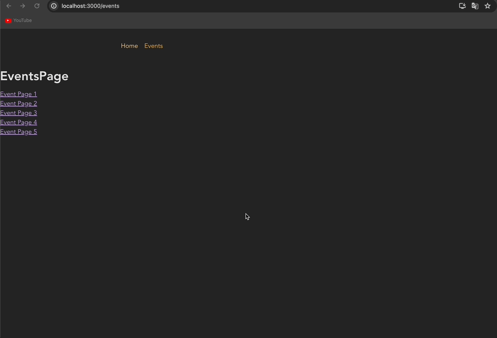

<br>

### 📖 BONUS

- Add another (nested) layout route that adds the `<EventNavigation>` component above all /events... page components

#### 💎 App.js

```js
import { createBrowserRouter, RouterProvider } from "react-router-dom";

import RootPage from "./pages/RootPage";
import HomePage from "./pages/HomePage";
import EventsPage from "./pages/EventsPage";
import EventDetailPage from "./pages/EventDetailPage";
import NewEventPage from "./pages/NewEventPage";
import EditEventPage from "./pages/EditEventPage";
import EventsNavigation from "./components/EventsNavigation";

const router = createBrowserRouter([
  {
    path: "/",
    element: <RootPage />,
    errorElement: <p>Error</p>,
    children: [
      { index: true, element: <HomePage /> },
      {
        path: "events",
        element: <EventsNavigation />,
        children: [
          { index: true, element: <EventsPage /> },
          { path: ":id", element: <EventDetailPage /> },
          { path: "new", element: <NewEventPage /> },
          { path: ":id/edit", element: <EditEventPage /> },
        ],
      },
    ],
  },
]);

function App() {
  return <RouterProvider router={router} />;
}

export default App;
```

#### 💎 EventsNavigaion.js

```js
import classes from "./EventsNavigation.module.css";
import { Outlet } from "react-router-dom";

function EventsNavigation() {
  return (
    <>
      <header className={classes.header}>
        <nav>
          <ul className={classes.list}>
            <li>
              <a href="/events">All Events</a>
            </li>
            <li>
              <a href="/events/new">New Event</a>
            </li>
          </ul>
        </nav>
      </header>
      <Outlet />
    </>
  );
}

export default EventsNavigation;
```

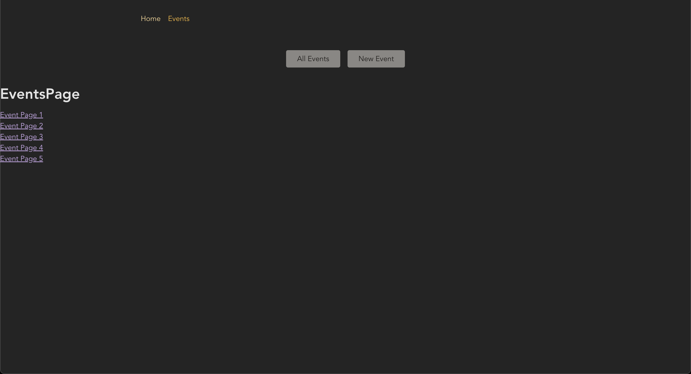

🔗 [레파지토리에서 보기](https://github.com/Imshyeon/Develop_Study/tree/ad3d76c815670066536bf0e2f012deec2f9866ba/React/Complete-React/23_React-Router-Practice/frontend/src)

<br>

---

<br>

## 📌 데이터 가져오기 & 제출하기

### 📖 `loader()`를 이용한 데이터 가져오기

#### 💎 기존에 사용하던 `useEffect, useState, fetch` 사용하기

```js
// pages/Events.js
import { useEffect, useState } from "react";

import EventsList from "../components/EventsList";

function EventsPage() {
  const [isLoading, setIsLoading] = useState(false);
  const [fetchedEvents, setFetchedEvents] = useState();
  const [error, setError] = useState();

  useEffect(() => {
    async function fetchEvents() {
      setIsLoading(true);
      const response = await fetch("http://localhost:8080/events");

      if (!response.ok) {
        setError("Fetching events failed.");
      } else {
        const resData = await response.json();
        setFetchedEvents(resData.events);
      }
      setIsLoading(false);
    }

    fetchEvents();
  }, []);
  return (
    <>
      <div style={{ textAlign: "center" }}>
        {isLoading && <p>Loading...</p>}
        {error && <p>{error}</p>}
      </div>
      {!isLoading && fetchedEvents && <EventsList events={fetchedEvents} />}
    </>
  );
}

export default EventsPage;
```

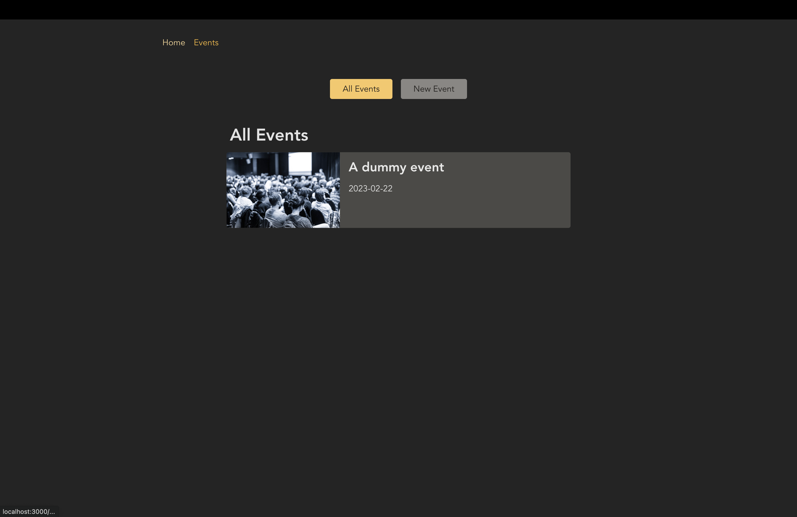

#### 💎 App.js

```js
import { createBrowserRouter, RouterProvider } from "react-router-dom";

import RootPage from "./pages/RootPage";
import HomePage from "./pages/HomePage";
import EventsPage from "./pages/Events";
import EventDetailPage from "./pages/EventDetailPage";
import NewEventPage from "./pages/NewEventPage";
import EditEventPage from "./pages/EditEventPage";
import EventsRootLayout from "./pages/EventRoot";

const router = createBrowserRouter([
  {
    path: "/",
    element: <RootPage />,
    errorElement: <p>Error</p>,
    children: [
      { index: true, element: <HomePage /> },
      {
        path: "events",
        element: <EventsRootLayout />,
        children: [
          {
            index: true,
            element: <EventsPage />,
            loader: async () => {
              const response = await fetch("http://localhost:8080/events");
              if (!response.ok) {
                // ...
              } else {
                const resData = await response.json();
                return resData.events; // EventsPage에 제공해 줄 것이다.
              }
            },
          },
          { path: ":id", element: <EventDetailPage /> },
          { path: "new", element: <NewEventPage /> },
          { path: ":id/edit", element: <EditEventPage /> },
        ],
      },
    ],
  },
]);

function App() {
  return <RouterProvider router={router} />;
}

export default App;
```

- 리액트 라우터 버전6 이상이면 리액트 라우터가 데이터를 가져오고, 상태를 관리하는 것을 도와준다.
- `loader`
  - 함수를 값으로 취하는 프로퍼티.
  - 로더를 사용하는 라우터를 방문하기 직전에 리액트 라우터는 항상 로더 함수를 실행한다.

#### 💎 Events.js

```js
import { useLoaderData } from "react-router-dom";
import EventsList from "../components/EventsList";

function EventsPage() {
  const events = useLoaderData(); // events는 resData.event가 된다.

  return <EventsList events={events} />;
}

export default EventsPage;
```

- `useLoaderData` : 가장 가까운 loader 데이터에 엑세스 하기 위해 실행할 수 있는 특수한 훅.
  - 사실 로더 함수에서 async, await을 사용했기 때문에 로더함수는 정확히 말하자면 프로미스를 리턴한다.
  - 그러나 리액트는 자동으로 프로미스로부터 resolving된 데이터를 받는다.

<br>

### 📖 `loader()` 데이터의 다양한 활용법

- `EventsList` 컴포넌트에서도 useLoaderData를 사용할 수 있다.

#### 💎 EventsList.js

```js
import classes from "./EventsList.module.css";
import { useLoaderData } from "react-router-dom";

function EventsList() {
  const events = useLoaderData();
  return (
    <div className={classes.events}>
      <h1>All Events</h1>
      <ul className={classes.list}>
        {events.map((event) => (
          <li key={event.id} className={classes.item}>
            <a href="...">
              
              <div className={classes.content}>
                <h2>{event.title}</h2>
                <time>{event.date}</time>
              </div>
            </a>
          </li>
        ))}
      </ul>
    </div>
  );
}

export default EventsList;
```

#### 💎 Events.js

```js
import EventsList from "../components/EventsList";

function EventsPage() {
  return <EventsList />;
}

export default EventsPage;
```

- `useLoaderData`는 로더가 정의된 라우트보다 더 높은 상위에서 사용할 수 없다.
- `useLoaderData`를 사용하기 위해서는 loader를 추가한 컴포넌트(라우트)와 같은 수준이거나 더 낮은 수준에 있는 컴포넌트에서 사용가능하다.

<br>

### 📖 `loader()` 코드를 저장해야하는 위치

- `loader()`로 인해 fetch가 간단해졌지만 App의 규모가 커졌다.
- 실제로 `loader()` 코드를 필요로 하는 컴포넌트 파일에 해당 코드를 넣는 것이 좋다. 즉, 여기서는 pages/Events가 있는 곳에 넣으면 된다.

#### 💎 Events.js

```js
import { useLoaderData } from "react-router-dom";
import EventsList from "../components/EventsList";

function EventsPage() {
  const events = useLoaderData(); // events는 resData.event가 된다.

  return <EventsList events={events} />;
}

export default EventsPage;

export async function loader() {
  const response = await fetch("http://localhost:8080/events");
  if (!response.ok) {
    // ...
  } else {
    const resData = await response.json();
    return resData.events;
  }
}
```

#### 💎 App.js

```js
import { createBrowserRouter, RouterProvider } from "react-router-dom";

import RootPage from "./pages/RootPage";
import HomePage from "./pages/HomePage";
import EventsPage, { loader as eventsLoader } from "./pages/Events";
import EventDetailPage from "./pages/EventDetailPage";
import NewEventPage from "./pages/NewEventPage";
import EditEventPage from "./pages/EditEventPage";
import EventsRootLayout from "./pages/EventRoot";

const router = createBrowserRouter([
  {
    path: "/",
    element: <RootPage />,
    errorElement: <p>Error</p>,
    children: [
      { index: true, element: <HomePage /> },
      {
        path: "events",
        element: <EventsRootLayout />,
        children: [
          {
            index: true,
            element: <EventsPage />,
            loader: eventsLoader,
          },
          { path: ":id", element: <EventDetailPage /> },
          { path: "new", element: <NewEventPage /> },
          { path: ":id/edit", element: <EditEventPage /> },
        ],
      },
    ],
  },
]);

function App() {
  return <RouterProvider router={router} />;
}

export default App;
```

- App이 더 간결해졌음을 볼 수 있다!

<br>

### 📖 `loader()` 함수가 실행되는 시기

- 어떤 페이지에 대한 loader는 해당 페이지로 이동하기 시작할 때 호출된다.
- 이런 방식은 해당 컴포넌트가 렌더링되고 있을 때 그와 관련된 데이터가 있다는 것을 확실히 할 수 있어서 좋다! 또한 로딩 중 상태를 관리할 필요가 없어서 좋다!
- 단점으로는 지연이 있을 수 있고 사용자는 아무것도 일어나지 않는 것처럼 보일 수 있다는 점이다.

<br>

### 📖 현재 네비게이션 상태를 UI에 반영하기

#### 💎 RootPage.js

```js
import MainNavigation from "../components/MainNavigation";
import { Outlet, useNavigation } from "react-router-dom";

function RootPage() {
  // useNavigation : 리액트 라우터가 제공해주는 훅.
  // 현재 전환이 진행 중인지, 데이터를 전달하는 중인지 또는 전환이 진행되고 있지 않는지를 알 수 있다.
  const navigation = useNavigation();

  return (
    <>
      <MainNavigation />
      <main>
        {navigation.state === "loading" && <p>Loading...</p>}
        <Outlet />
      </main>
    </>
  );
}
export default RootPage;
```

- loading indicator 는 우리가 전환할 목적지인 페이지에 추가되는 것이 아니고 전환이 시작되었을 때 이미 화면에 표시되어 있는 페이지, 컴포넌트에 추가된다.

<br>

### 📖 `loader()`에서 응답 리턴하기

#### 💎 Events.js

```js
import { useLoaderData } from "react-router-dom";
import EventsList from "../components/EventsList";

function EventsPage() {
  const data = useLoaderData();
  const events = data.events;

  return <EventsList events={events} />;
}

export default EventsPage;

export async function loader() {
  const response = await fetch("http://localhost:8080/events");
  if (!response.ok) {
    // ...
  } else {
    return response;
    // const resData = await response.json();
    // return resData.events; // 숫자,텍스트,객체 등 다 리턴할 수 있다.
  }
}
```

- `fetch`는 Response 객체의 프로미스를 리턴한다.
- Response는 최신 브라우저의 기능으로 응답 객체를 사용하여 자신만의 응답을 구축할 수 있다.
- 어찌되었든 fetch에서 Response의 프로미스를 받게되고 `useLoaderData`혹은 자동으로 프로미스에서 데이터를 추출해주기 때문에 위와같이 코드를 작성해도 된다.

<br>

### 📖 `loader()`로 가는 코드의 종류

- loader 안에 정의된 코드는 서버가 아닌 브라우저에서 실행된다. (클라이언트 쪽 코드이다.)
- loader 함수에서 어떤 브라우저 API든 사용할 수 있다. ex. `localStorage, Cookie, ...`
- loader 함수에서 useState같은 리액트 훅은 사용할 수 없다. 그 훅들은 오직 리액트 컴포넌트에서만 사용할 수 있기 때문이다. &rarr; loader 함수는 리액트 컴포넌트가 아니다.

---

### 📖 커스텀 오류를 이용한 오류 처리

#### 💎 Events.js | 1. 객체 리턴하기

```js
import { useLoaderData } from "react-router-dom";
import EventsList from "../components/EventsList";

function EventsPage() {
  const data = useLoaderData();
  if (data.isError) {
    return <p>{data.message}</p>;
  }
  const events = data.events;

  return <EventsList events={events} />;
}

export default EventsPage;

export async function loader() {
  const response = await fetch("http://localhost:8080/eventsss");
  if (!response.ok) {
    return { isError: true, message: "이벤트를 가져올 수 없습니다." };
  } else {
    return response;
  }
}
```

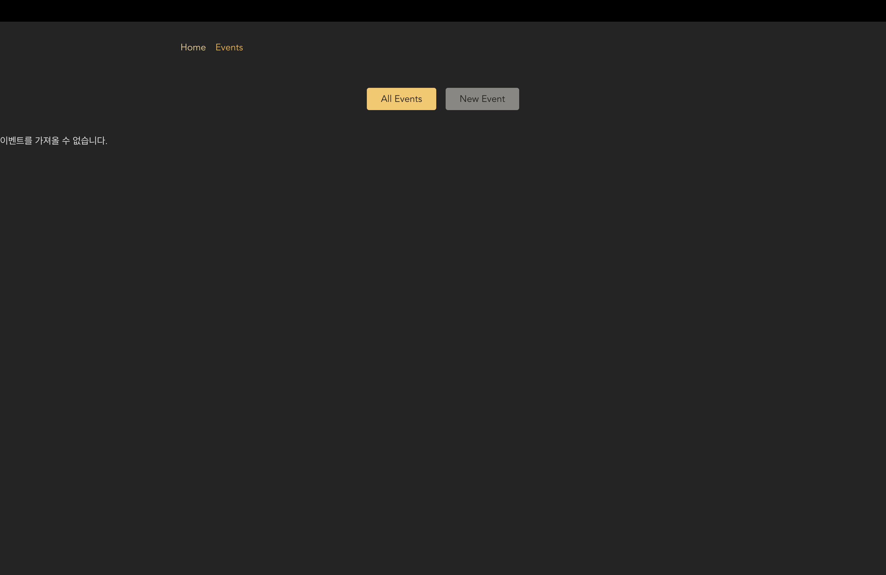

#### 💎 Events.js | 2. `errorElement` 이용하기

- errorElement : loader 뿐만 아니라 어떤 라우트 관련 코드에 오류가 발생할 때마다 화면에 표시된다.
- 오류가 발생하면 errorElement에 도달할 때까지 해당 오류는 bubble up 될 것이다.

```js
// Events.js
import { useLoaderData } from "react-router-dom";
import EventsList from "../components/EventsList";

function EventsPage() {
  const data = useLoaderData();
  if (data.isError) {
    return <p>{data.message}</p>;
  }
  const events = data.events;

  return <EventsList events={events} />;
}

export default EventsPage;

export async function loader() {
  const response = await fetch("http://localhost:8080/eventsss");
  if (!response.ok) {
    throw new Error({ message: "이벤트를 가져올 수 없습니다." });
  } else {
    return response;
  }
}


// Error.js
function ErrorPage() {
  return <h1>오류가 발생했습니다.</h1>;
}

export default ErrorPage;
```

<br>

- PageContent 추가

```js
// Events.js
import { useLoaderData } from "react-router-dom";
import EventsList from "../components/EventsList";

function EventsPage() {
  const data = useLoaderData();
  if (data.isError) {
    return <p>{data.message}</p>;
  }
  const events = data.events;

  return <EventsList events={events} />;
}

export default EventsPage;

export async function loader() {
  const response = await fetch("http://localhost:8080/eventsss");
  if (!response.ok) {
    throw new Response(
      JSON.stringify({ message: "이벤트를 가져올 수 없습니다." }),
      { status: 500 }
    );
  } else {
    return response;
  }
}


// Error.js
import MainNavigation from "../components/MainNavigation";
import PageContent from "../components/PageContent";
import { useRouteError } from "react-router-dom";

function ErrorPage() {
  const error = useRouteError();
  // error 객체는 Response를 throw하거나 또는 다른 종류의 객체 혹은 데이터를 throw하는지에 달려있다.

  let title = "오류가 발생했습니다";
  let message = "Something went wrong!";

  if (error.status === 500) {
    message = JSON.parse(error.data).message;
  }
  if (error.status === 404) {
    title = "Not Found";
    message = "리소스나 페이지를 찾을 수 없습니다.";
  }

  return (
    <>
      <MainNavigation />
      <PageContent title={title}>
        <p>{message}</p>
      </PageContent>
    </>
  );
}

export default ErrorPage;
```

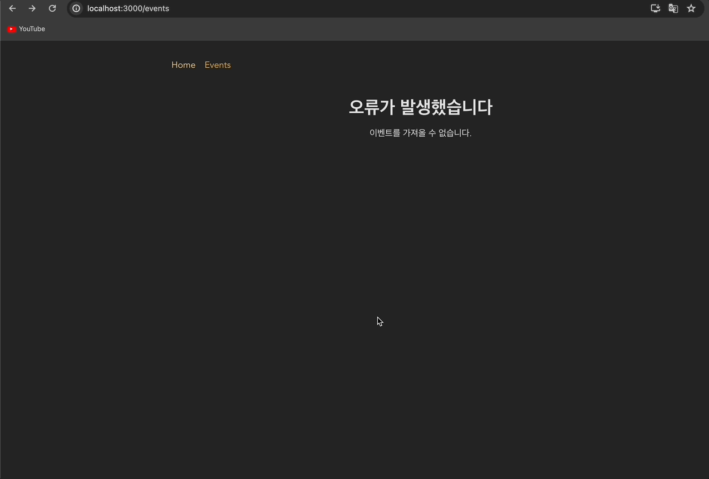

<br>

### 📖 `json()` 유틸리티 함수

#### 💎 Events.js

```js
import { useLoaderData, json } from "react-router-dom";
import EventsList from "../components/EventsList";

function EventsPage() {
  const data = useLoaderData();
  if (data.isError) {
    return <p>{data.message}</p>;
  }
  const events = data.events;

  return <EventsList events={events} />;
}

export default EventsPage;

export async function loader() {
  const response = await fetch("http://localhost:8080/events");
  if (!response.ok) {
    return json({ message: "이벤트를 가져올 수 없습니다." }, { status: 500 });
  } else {
    return response;
  }
}

// Error.js
function ErrorPage() {
  const error = useRouteError();

  let title = "오류가 발생했습니다";
  let message = "Something went wrong!";

  if (error.status === 500) {
    // message = JSON.parse(error.data).message;
    message = error.data.message;
  }
}
```

- `json()` : json 형식의 데이터가 포함된 `Response` 객체를 포함하는 함수이다.

---

### 📖 동적 라우트와 `loader()` - EventDetailPage

#### 💎 EventsList.js

```js
import classes from "./EventsList.module.css";
import { Link } from "react-router-dom";
// import { useLoaderData } from "react-router-dom";

function EventsList({ events }) {
  // const events = useLoaderData();
  return (
    <div className={classes.events}>
      <h1>All Events</h1>
      <ul className={classes.list}>
        {events.map((event) => (
          <li key={event.id} className={classes.item}>
            <Link to={event.id}>
              
              <div className={classes.content}>
                <h2>{event.title}</h2>
                <time>{event.date}</time>
              </div>
            </Link>
          </li>
        ))}
      </ul>
    </div>
  );
}

export default EventsList;
```

- `<a>`를 `Link`로 대체

#### 💎 EventDetailPage.js

```js
import { useLoaderData, json, useParams } from "react-router-dom";

import EventItem from "../components/EventItem";

function EventDetailPage() {
  // const params = useParams();
  const data = useLoaderData();

  return <EventItem event={data.event} />;
}

export default EventDetailPage;

export async function loader({ request, params }) {
  const id = params.id; // '/events/:id'
  const response = await fetch("http://localhost:8080/events/" + id);

  if (!response.ok) {
    throw json(
      { message: "이벤트 디테일에 대한 정보를 받아올 수 없습니다." },
      { status: 500 }
    );
  } else {
    return response;
  }
}
```

#### 💎 App.js

```js
import { createBrowserRouter, RouterProvider } from "react-router-dom";

import RootPage from "./pages/RootPage";
import HomePage from "./pages/HomePage";
import EventsPage, { loader as eventsLoader } from "./pages/Events";
import EventDetailPage, {
  loader as eventsDetailLoader,
} from "./pages/EventDetailPage";
import NewEventPage from "./pages/NewEventPage";
import EditEventPage from "./pages/EditEventPage";
import EventsRootLayout from "./pages/EventRoot";
import ErrorPage from "./pages/Error";

const router = createBrowserRouter([
  {
    path: "/",
    element: <RootPage />,
    errorElement: <ErrorPage />,
    children: [
      { index: true, element: <HomePage /> },
      {
        path: "events",
        element: <EventsRootLayout />,
        children: [
          {
            index: true,
            element: <EventsPage />,
            loader: eventsLoader,
          },
          {
            path: ":id",
            element: <EventDetailPage />,
            loader: eventsDetailLoader, // loader 함수 전달
          },
          { path: "new", element: <NewEventPage /> },
          { path: ":id/edit", element: <EditEventPage /> },
        ],
      },
    ],
  },
]);

function App() {
  return <RouterProvider router={router} />;
}

export default App;
```

- EventDetailPage에 대한 loader 함수 전달.

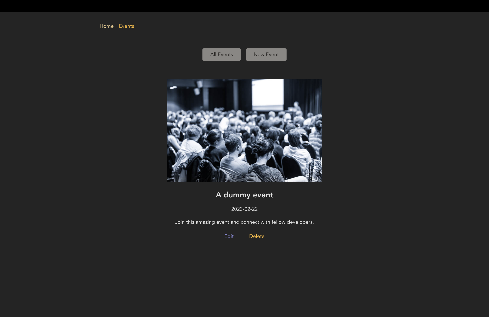

<br>

### 📖 `useRouteLoaderData` 훅 및 다른 라우트의 데이터에 엑세스하기

#### 💎 App.js

```js
import { createBrowserRouter, RouterProvider } from "react-router-dom";

import RootPage from "./pages/RootPage";
import HomePage from "./pages/HomePage";
import EventsPage, { loader as eventsLoader } from "./pages/Events";
import EventDetailPage, {
  loader as eventDetailLoader,
} from "./pages/EventDetailPage";
import NewEventPage from "./pages/NewEventPage";
import EditEventPage from "./pages/EditEventPage";
import EventsRootLayout from "./pages/EventRoot";
import ErrorPage from "./pages/Error";

const router = createBrowserRouter([
  {
    path: "/",
    element: <RootPage />,
    errorElement: <ErrorPage />,
    children: [
      { index: true, element: <HomePage /> },
      {
        path: "events",
        element: <EventsRootLayout />,
        children: [
          {
            index: true,
            element: <EventsPage />,
            loader: eventsLoader,
          },
          {
            path: ":id",
            id: "event-detail", // 부모라우트의 데이터를 이용하기 위함
            loader: eventDetailLoader, // 공통 loader
            children: [
              {
                index: true,
                element: <EventDetailPage />,
              },
              { path: "edit", element: <EditEventPage /> },
            ],
          },

          { path: "new", element: <NewEventPage /> },
        ],
      },
    ],
  },
]);

function App() {
  return <RouterProvider router={router} />;
}

export default App;
```

- 디테일 페이지에서 편집 페이지로 가기 위함이다. 이때, 편집 페이지에서 디테일 페이지의 데이터를 기반으로 작성하고 싶다 &rarr; 두 페이지의 부모 라우터('/events/:id')를 공유하고 그 아래에 자식 라우터를 설정함으로써 loader 함수 공유 &rarr; 로더 함수를 통해서 데이터를 받을 것이다.

#### 💎 EventDetailPage.js

```js
import { useRouteLoaderData, json, useParams } from "react-router-dom";

import EventItem from "../components/EventItem";

function EventDetailPage() {
  const data = useRouteLoaderData("event-detail");

  return <EventItem event={data.event} />;
}

export default EventDetailPage;

export async function loader({ request, params }) {
  const id = params.id; // '/events/:id'
  const response = await fetch("http://localhost:8080/events/" + id);

  if (!response.ok) {
    throw json(
      { message: "이벤트 디테일에 대한 정보를 받아올 수 없습니다." },
      { status: 500 }
    );
  } else {
    return response;
  }
}
```

- `useRouteLoaderData` : 부모의 데이터를 받기 위해 사용되는 훅. useLoaderData와 비슷하지만 부모 라우트에서 설정된 아이디값이 필요하다.
- 부모 라우터에서 설정된 로더 함수를 통해서 데이터를 받아오고 해당 데이터를 EventItem의 prop으로 전달할 것이기 때문에 `useRouterLoaderData` 훅을 사용

#### 💎 EditEventPage.js

```js
import { useRouteLoaderData } from "react-router-dom";
import EventForm from "../components/EventForm";

function EditEventPage() {
  const data = useRouteLoaderData("event-detail");
  const event = data.event;

  return <EventForm event={event} />;
}

export default EditEventPage;
```

#### 💎 EventForm.js

```js
import { useNavigate } from "react-router-dom";

import classes from "./EventForm.module.css";

function EventForm({ method, event }) {
  const navigate = useNavigate();
  function cancelHandler() {
    navigate("..");
  }

  return (
    <form className={classes.form}>
      <p>
        <label htmlFor="title">Title</label>
        <input
          id="title"
          type="text"
          name="title"
          required
          defaultValue={event ? event.title : ""}
        />
      </p>
      <p>
        <label htmlFor="image">Image</label>
        <input
          id="image"
          type="url"
          name="image"
          required
          defaultValue={event ? event.image : ""}
        />
      </p>
      <p>
        <label htmlFor="date">Date</label>
        <input
          id="date"
          type="date"
          name="date"
          required
          defaultValue={event ? event.date : ""}
        />
      </p>
      <p>
        <label htmlFor="description">Description</label>
        <textarea
          id="description"
          name="description"
          rows="5"
          required
          defaultValue={event ? event.description : ""}
        />
      </p>
      <div className={classes.actions}>
        <button type="button" onClick={cancelHandler}>
          Cancel
        </button>
        <button>Save</button>
      </div>
    </form>
  );
}

export default EventForm;
```

- EditEventPage에서 전달해준 데이터를 이용해서 디폴트값을 설정한다.

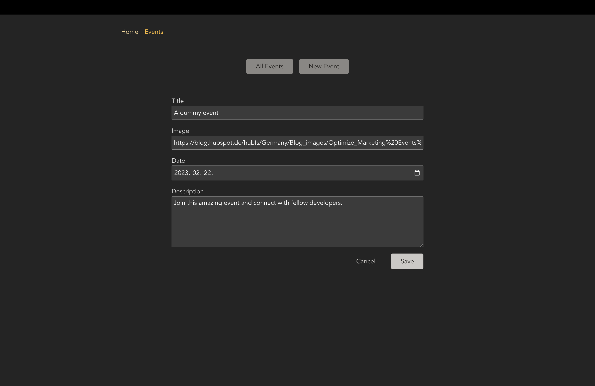

<br>

### 📖 데이터 제출 | `action() 사용하기`

### 💎 EventForm.js

```js
import { useNavigate, Form } from "react-router-dom";

import classes from "./EventForm.module.css";

function EventForm({ method, event }) {
  const navigate = useNavigate();
  function cancelHandler() {
    navigate("..");
  }

  return (
    <Form method="post" className={classes.form}>
      <p>
        <label htmlFor="title">Title</label>
        <input
          id="title"
          type="text"
          name="title"
          required
          defaultValue={event ? event.title : ""}
        />
      </p>
      <p>
        <label htmlFor="image">Image</label>
        <input
          id="image"
          type="url"
          name="image"
          required
          defaultValue={event ? event.image : ""}
        />
      </p>
      <p>
        <label htmlFor="date">Date</label>
        <input
          id="date"
          type="date"
          name="date"
          required
          defaultValue={event ? event.date : ""}
        />
      </p>
      <p>
        <label htmlFor="description">Description</label>
        <textarea
          id="description"
          name="description"
          rows="5"
          required
          defaultValue={event ? event.description : ""}
        />
      </p>
      <div className={classes.actions}>
        <button type="button" onClick={cancelHandler}>
          Cancel
        </button>
        <button>Save</button>
      </div>
    </Form>
  );
}

export default EventForm;
```

- `Form`은 백엔드로 요청하는 브라우저 기본값을 생략하게 만들고 대신에 전송되었을 요청들을 받아서 액션(action)에 준다. 이때, 각 input에 name 속성이 있어야한다.

#### 💎 NewEventPage.js

```js
import EventForm from "../components/EventForm";
import { json, redirect } from "react-router-dom";

function NewEventPage() {
  return <EventForm />;
}

export default NewEventPage;

export async function action({ request, params }) {
  const data = await request.formData();
  const eventData = {
    title: data.get("title"), // name을 넣는다.
    image: data.get("image"),
    date: data.get("date"),
    description: data.get("description"),
  };
  const response = await fetch("http://localhost:8080/events", {
    method: "POST",
    body: JSON.stringify(eventData),
    headers: {
      "Content-Type": "application/json",
    },
  });

  console.log(response);

  if (!response.ok) {
    throw json(
      { message: "데이터를 전송하는데 실패했습니다." },
      { status: 500 }
    );
  }

  return redirect("/events");
}
```

- `action()`로 로더 함수처럼 리액트 라우터에 의해서 실행되고 유용한 프로퍼티(request, params)들이 포함된 객체를 받는다.

#### 💎 App.js

```js
import { createBrowserRouter, RouterProvider } from "react-router-dom";

import RootPage from "./pages/RootPage";
import HomePage from "./pages/HomePage";
import EventsPage, { loader as eventsLoader } from "./pages/Events";
import EventDetailPage, {
  loader as eventDetailLoader,
} from "./pages/EventDetailPage";
import NewEventPage, { action as newEventAction } from "./pages/NewEventPage";
import EditEventPage from "./pages/EditEventPage";
import EventsRootLayout from "./pages/EventRoot";
import ErrorPage from "./pages/Error";

const router = createBrowserRouter([
  {
    path: "/",
    element: <RootPage />,
    errorElement: <ErrorPage />,
    children: [
      { index: true, element: <HomePage /> },
      {
        path: "events",
        element: <EventsRootLayout />,
        children: [
          {
            index: true,
            element: <EventsPage />,
            loader: eventsLoader,
          },
          {
            path: ":id",
            id: "event-detail", // 부모라우트의 데이터를 이용하기 위함
            loader: eventDetailLoader, // 공통 loader
            children: [
              {
                index: true,
                element: <EventDetailPage />,
              },
              { path: "edit", element: <EditEventPage /> },
            ],
          },

          { path: "new", element: <NewEventPage />, action: newEventAction },
        ],
      },
    ],
  },
]);

function App() {
  return <RouterProvider router={router} />;
}

export default App;
```

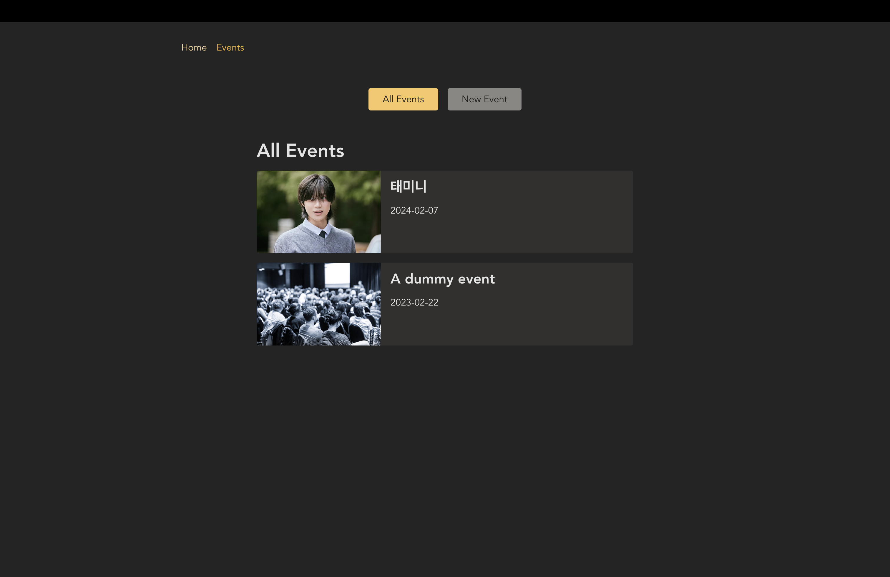

<br>

### 📖 프로그램적으로 데이터 제출하기(삭제하기) | `action()`을 트리거하는 또다른 방법

#### 💎 EventDetailPage.js

```js
import {
  useRouteLoaderData,
  json,
  useParams,
  redirect,
} from "react-router-dom";

import EventItem from "../components/EventItem";

function EventDetailPage() {
  // const params = useParams();
  const data = useRouteLoaderData("event-detail");
  // useRouteLoaderData : 부모의 데이터를 받기 위해 사용되는 훅. useLoaderData와 비슷하지만 부모 라우트에서 설정된 아이디값이 필요하다.

  return <EventItem event={data.event} />;
}

export default EventDetailPage;

export async function loader({ request, params }) {
  const id = params.id; // '/events/:id'
  const response = await fetch("http://localhost:8080/events/" + id);

  if (!response.ok) {
    throw json(
      { message: "이벤트 디테일에 대한 정보를 받아올 수 없습니다." },
      { status: 500 }
    );
  } else {
    return response;
  }
}

export async function action({ request, params }) {
  const id = params.id;
  const method = request.method;
  const response = await fetch("http://localhost:8080/events/" + id, {
    method: method,
  });

  if (!response.ok) {
    throw json(
      { message: "이벤트를 삭제하는데 실패했습니다." },
      { status: 500 }
    );
  }
  return redirect("/events");
}
```

- action 함수를 적고, 해당 액션의 method를 받아와서 동작하도록 하였다.

#### 💎 App.js

```js
import { createBrowserRouter, RouterProvider } from "react-router-dom";

import RootPage from "./pages/RootPage";
import HomePage from "./pages/HomePage";
import EventsPage, { loader as eventsLoader } from "./pages/Events";
import EventDetailPage, {
  loader as eventDetailLoader,
  action as deleteEventAction,
} from "./pages/EventDetailPage";
import NewEventPage, { action as newEventAction } from "./pages/NewEventPage";
import EditEventPage from "./pages/EditEventPage";
import EventsRootLayout from "./pages/EventRoot";
import ErrorPage from "./pages/Error";

const router = createBrowserRouter([
  {
    path: "/",
    element: <RootPage />,
    errorElement: <ErrorPage />,
    children: [
      { index: true, element: <HomePage /> },
      {
        path: "events",
        element: <EventsRootLayout />,
        children: [
          {
            index: true,
            element: <EventsPage />,
            loader: eventsLoader,
          },
          {
            path: ":id",
            id: "event-detail", // 부모라우트의 데이터를 이용하기 위함
            loader: eventDetailLoader, // 공통 loader
            children: [
              {
                index: true,
                element: <EventDetailPage />,
                action: deleteEventAction, // delete action 추가
              },
              { path: "edit", element: <EditEventPage /> },
            ],
          },

          { path: "new", element: <NewEventPage />, action: newEventAction },
        ],
      },
    ],
  },
]);

function App() {
  return <RouterProvider router={router} />;
}

export default App;
```

#### 💎 EventItem.js

```js
import classes from "./EventItem.module.css";
import { Link, useSubmit } from "react-router-dom";

function EventItem({ event }) {
  const submit = useSubmit(); //

  function startDeleteHandler() {
    const proceed = window.confirm("Are you sure?"); // 불리언값 리턴 받음
    if (proceed) {
      submit(null, { method: "delete" }); // submit( {제출하고자하는 데이터}, { method: , action: '/any-different-path'} )
      // 제출하고자하는 데이터는 formData로 자동으로 감싸지게 될 것이다.
      // 만일 액션이 다른 라우트 경로에서 정의된다면 action키를 다른 경로로 설정할 수 있다.
      // 해당 컴포넌트가 속한 라우트가 같거나 이 컴포넌트가 렌더링되는 라우트가 같은 라우트 내에서 정의되므로 따로 action 정의하지 않아도 된다.
    }
  }

  return (
    <article className={classes.event}>
      
      <h1>{event.title}</h1>
      <time>{event.date}</time>
      <p>{event.description}</p>
      <menu className={classes.actions}>
        <Link to="edit">Edit</Link>
        <button onClick={startDeleteHandler}>Delete</button>
      </menu>
    </article>
  );
}

export default EventItem;
```

- 버튼이 눌렸을 때 `startDeleteHandler` 함수가 동작한다.
- 사용자가 정말로 삭제를 원하는지 한번 더 물어본다 (proceed)
- proceed가 true 이면, 삭제 동작을 한다. 이때, useSubmit 훅을 사용한다.
- submit 함수에서 우리는 삭제만을 원하기 때문에 별도의 데이터를 전달하지 않고 null을 전달한다.
- submit 함수에서 메서드와 액션 키를 통해서 동작을 제어할 수 있다. 만일 action이 다른 라우트 경로에서 정의되었다면 다른 경로로 지정할 수 있으나 우리의 경우, EventItem과 action이 같은 라우트 내에 정의 되었다.

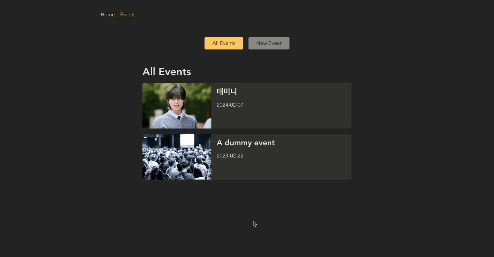

<br>

### 📖 폼의 제출 상태를 이용하여 UI 상태 업데이트 하기

#### 💎 EventForm.js

```js
import { useNavigate, Form, useNavigation } from "react-router-dom";

import classes from "./EventForm.module.css";

function EventForm({ method, event }) {
  const navigate = useNavigate();

  // navigation의 상태를 이용해서 해당 상태에 따른 UI 업데이트
  const navigation = useNavigation();
  const isSubmitting = navigation.state === "submitting";

  function cancelHandler() {
    navigate("..");
  }

  return (
    <Form method="post" className={classes.form}>
      <p>
        <label htmlFor="title">Title</label>
        <input
          id="title"
          type="text"
          name="title"
          required
          defaultValue={event ? event.title : ""}
        />
      </p>
      <p>
        <label htmlFor="image">Image</label>
        <input
          id="image"
          type="url"
          name="image"
          required
          defaultValue={event ? event.image : ""}
        />
      </p>
      <p>
        <label htmlFor="date">Date</label>
        <input
          id="date"
          type="date"
          name="date"
          required
          defaultValue={event ? event.date : ""}
        />
      </p>
      <p>
        <label htmlFor="description">Description</label>
        <textarea
          id="description"
          name="description"
          rows="5"
          required
          defaultValue={event ? event.description : ""}
        />
      </p>
      <div className={classes.actions}>
        {/* disabled={isSubmitting} */}
        <button type="button" onClick={cancelHandler} disabled={isSubmitting}>
          취소하기
        </button>
        <button disabled={isSubmitting}>
          {isSubmitting ? "저장 중..." : "저장하기"}
        </button>
      </div>
    </Form>
  );
}

export default EventForm;
```

- 작성한 폼을 제출 중(Save)이라면 버튼 disabled하고 '저장 중' 이라는 문구 띄우기

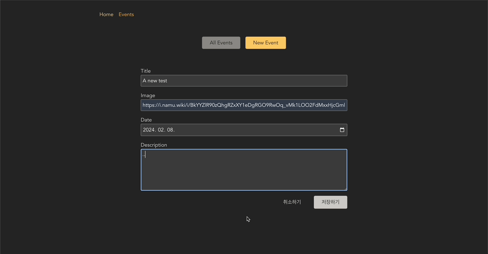

<br>

### 📖 사용자 입력을 검증하고 검증 요류 출력하기

#### 💎 NewEventPage.js

```js
import EventForm from "../components/EventForm";
import { json, redirect } from "react-router-dom";

function NewEventPage() {
  return <EventForm />;
}

export default NewEventPage;

export async function action({ request, params }) {
  const data = await request.formData();
  const eventData = {
    title: data.get("title"), // name을 넣는다.
    image: data.get("image"),
    date: data.get("date"),
    description: data.get("description"),
  };
  const response = await fetch("http://localhost:8080/events", {
    method: "POST",
    body: JSON.stringify(eventData),
    headers: {
      "Content-Type": "application/json",
    },
  });

  if (response.status === 422) {
    // backend의 검증 코드
    return response;
    // 리턴된 action 데이터도 페이지와 컴포넌트에서 사용할 수 있다.(로더와 마찬가지)
  }

  if (!response.ok) {
    throw json(
      { message: "데이터를 전송하는데 실패했습니다." },
      { status: 500 }
    );
  }

  return redirect("/events");
}
```

- 로더와 마찬가지로 리턴된 action 데이터도 페이지와 컴포넌트에서 사용할 수 있다.

#### 💎 EventForm.js

```js
import {
  useNavigate,
  Form,
  useNavigation,
  useActionData,
} from "react-router-dom";

import classes from "./EventForm.module.css";

function EventForm({ method, event }) {
  const data = useActionData(); // action에서 온 데이터를 받음.
  const navigate = useNavigate();

  const navigation = useNavigation();
  const isSubmitting = navigation.state === "submitting";

  function cancelHandler() {
    navigate("..");
  }

  return (
    <Form method="post" className={classes.form}>
      {/* action이 진행된 후 에러가 발생했을 때, 해당 에러에 대한 메시지 출력*/}
      {data && data.errors && (
        <ul>
          {Object.values(data.errors).map((error) => (
            <li key={error}>{error}</li>
          ))}
        </ul>
      )}
      <p>
        <label htmlFor="title">Title</label>
        <input
          id="title"
          type="text"
          name="title"
          required
          defaultValue={event ? event.title : ""}
        />
      </p>
      <p>
        <label htmlFor="image">Image</label>
        <input
          id="image"
          type="url"
          name="image"
          required
          defaultValue={event ? event.image : ""}
        />
      </p>
      <p>
        <label htmlFor="date">Date</label>
        <input
          id="date"
          type="date"
          name="date"
          required
          defaultValue={event ? event.date : ""}
        />
      </p>
      <p>
        <label htmlFor="description">Description</label>
        <textarea
          id="description"
          name="description"
          rows="5"
          required
          defaultValue={event ? event.description : ""}
        />
      </p>
      <div className={classes.actions}>
        <button type="button" onClick={cancelHandler} disabled={isSubmitting}>
          취소하기
        </button>
        <button disabled={isSubmitting}>
          {isSubmitting ? "저장 중..." : "저장하기"}
        </button>
      </div>
    </Form>
  );
}

export default EventForm;
```

- `useActionData` : action이 리턴한 데이터에 엑세스 할 수 있다.

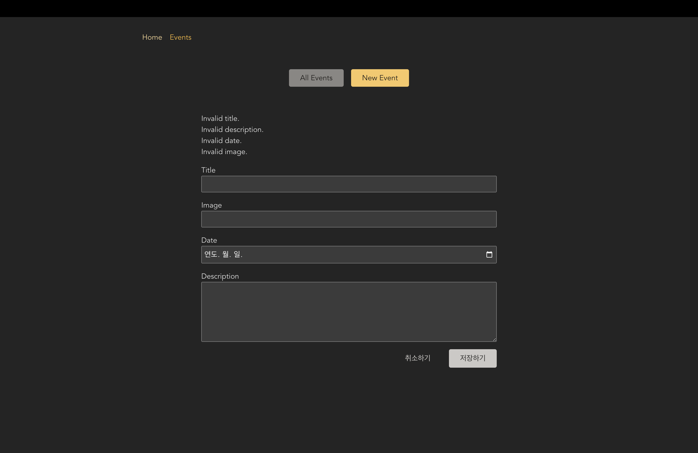
