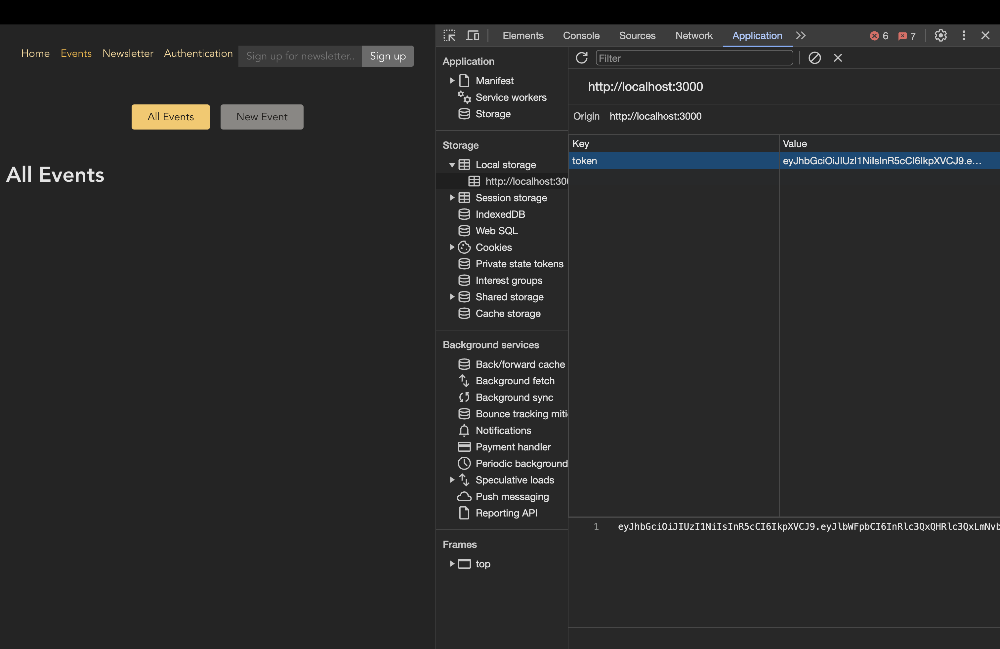
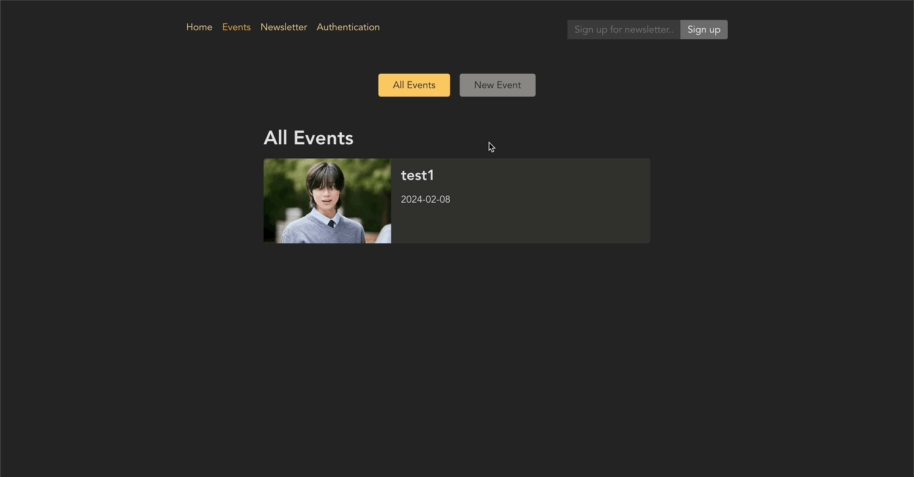
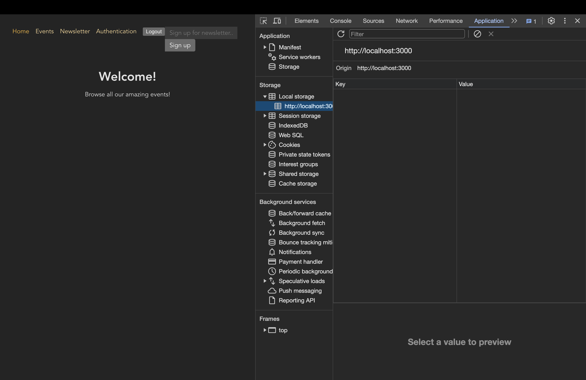
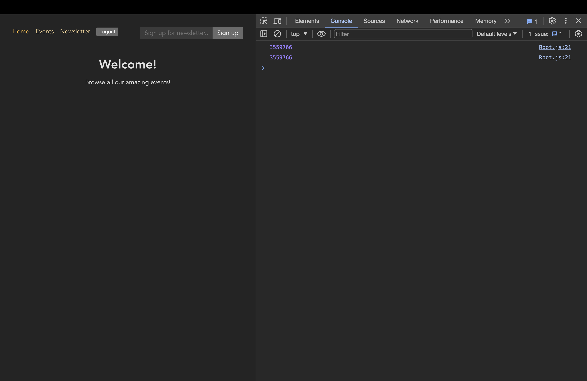

# 리액트 앱 인증(Authentication)

[📌 인증(Authentication)이란?](#-인증authentication이란)<br>
[📌 기본 설정](#-기본-설정)<br>
[📌 인증 작업 실행하기](#-인증-작업-실행하기)<br>
<br>

## 📌 인증(Authentication)이란?

- 프론트엔드의 앱이 백엔드로 접근하기 전에 반드시 인증을 받아야 한다.
- 프론트엔드에서 백엔드로 자격 증명 Request를 보내고, 만약 해당 자격 증명을 인증받았다면(올바른 형식의 이메일이나 input) 서버는 우리에게 보호된 리소스에 접근을 허가한다는 응답(Response)을 보내준다.

<br>

> **Server-Side Session(서버 측 세션)**

- 아주 대중적인 솔루션으로 프론트엔드와 백엔드가 분리되지 않은 풀스택 앱에서 자주 사용된다.
- 그러나 리액트는 분리되어 있어서 리액트에는 이상적이지 않다.
- 유저가 로그인하고 인증된 다음, 서버에 고유 식별자를 부여하는 방법이다. (Store unique identifier on server, send same identifier to client)
- 클라이언트는 이후 요청에서 해당 ID를 전송하며 보호된 리소스에 접근하려 한다.(Client sends identifier along with requests to protected resources)
- 서버는 이 클라이언트가 보호된 리소스에 접근할 권한이 있는지 확인할 수 있다.

<br>

> **Authentication Tokens(인증 토큰)**

- 사용자가 유효한 자격 증명을 전송한 뒤, 허가 토큰을 생성하지 저장하지는 않는다.
- 토큰은 기본적으로 알고리즘에 따라 생성된 스트링이다. 따라서 백엔드에서 이 토큰을 생성하고 그것을 다시 클라이언트에게 전송한다.
- 토큰을 생성한 백엔드만이 해당 토큰의 유효성을 확인하고 검증할 수 있다.
- 이후에 클라이언트가 다시 백엔드에 요청을 보낼 때 해당 토큰을 요청(Request)에 첨부하면 백엔드는 토큰을 살펴보고 검증하여 유효한 토큰이면 보호된 리소스에 대한 접근이 승인된다.

<br>

## 📌 기본 설정

### 📖 라우트 설정

🔗 [레파지토리에서 해당 코드 보기](https://github.com/Imshyeon/Develop_Study/commit/5806f7fbd60f0dace262d8e87ea03491a5fd2716)

<br>

### 📖 쿼리 매개변수 추가하기

#### 💎 AuthForm.js

```js
import { Form, Link, useSearchParams } from "react-router-dom";

import classes from "./AuthForm.module.css";

function AuthForm() {
  const [searchParams, setSearchParams] = useSearchParams();
  // [ 현재 설정된 쿼리 매개변수에 접근권을 주는 객체, 현재 설정된 쿼리 매개변수를 업데이트하게 해주는 함수 ]
  const isLogin = searchParams.get("mode") === "login"; // 가져오고싶은 쿼리 매개변수 비교. 만약 mode=login이면 로그인모드에 있는 것.

  return (
    <>
      <Form method="post" className={classes.form}>
        <h1>{isLogin ? "Log in" : "Create a new user"}</h1>
        <p>
          <label htmlFor="email">Email</label>
          <input id="email" type="email" name="email" required />
        </p>
        <p>
          <label htmlFor="image">Password</label>
          <input id="password" type="password" name="password" required />
        </p>
        <div className={classes.actions}>
          {/* 만약 이미 로그인 모드라면 signup모드로 갈 수 있게 해야한다. */}
          <Link to={`?mode=${isLogin ? "signup" : "login"}`}>
            {isLogin ? "Create new user" : "Login"}
          </Link>
          <button>Save</button>
        </div>
      </Form>
    </>
  );
}

export default AuthForm;
```

- url은 다음과 같아진다.
  - 현재 로그인 모드라면, 'http://localhost:3000/auth?mode=login'
  - 현재 signup 모드라면, 'http://localhost:3000/auth?mode=signup'

<br>

## 📌 인증 작업 실행하기

### 📖 인증 작업 실행하기

#### 💎 Authentication.js

```js
import { json, redirect } from "react-router-dom";
import AuthForm from "../components/AuthForm";

function AuthenticationPage() {
  return <AuthForm />;
}

export default AuthenticationPage;

export async function action({ request, params }) {
  const searchParams = new URL(request.url).searchParams;
  const mode = searchParams.get("mode") || "login"; // 모드

  if (mode !== "login" && mode !== "signup") {
    throw json({ message: "미지원 모드입니다." }, { status: 422 });
  }

  const data = await request.formData();
  const authData = {
    email: data.get("email"),
    password: data.get("password"),
  };

  const response = await fetch("http://localhost:8080/" + mode, {
    method: "POST",
    headers: {
      "Content-Type": "application/json",
    },
    body: JSON.stringify(authData),
  });

  if (response.status === 422 || response.status === 401) {
    // 오류 코드를 받으면
    return response;
  }

  if (!response.ok) {
    throw json({ message: "사용자 인증 불가합니다." }, { status: 500 });
  }

  // 백엔드에서 얻는 토큰 관리할 예정
  return redirect("/");
}
```

#### 💎 App.js

```js
import { RouterProvider, createBrowserRouter } from "react-router-dom";

import AuthenticationPage, {
  action as authAction,
} from "./pages/Authentication";

const router = createBrowserRouter([
  {
    path: "/",
    element: <RootLayout />,
    errorElement: <ErrorPage />,
    children: [
      { index: true, element: <HomePage /> },
      //...
      {
        path: "auth",
        element: <AuthenticationPage />,
        action: authAction, // 액션 추가
      },
    ],
  },
]);

function App() {
  return <RouterProvider router={router} />;
}

export default App;
```

<br>

### 📖 사용자 인풋 & 아웃풋 유효성 검증 오류 확인하기

#### 💎 AuthForm.js

```js
import {
  Form,
  Link,
  useActionData,
  useNavigation,
  useSearchParams,
} from "react-router-dom";

import classes from "./AuthForm.module.css";

function AuthForm() {
  const [searchParams, setSearchParams] = useSearchParams();
  // [ 현재 설정된 쿼리 매개변수에 접근권을 주는 객체, 현재 설정된 쿼리 매개변수를 업데이트하게 해주는 함수 ]
  const isLogin = searchParams.get("mode") === "login"; // 가져오고싶은 쿼리 매개변수 비교. 만약 mode=login이면 로그인모드에 있는 것.

  const data = useActionData(); // 이 액션 데이터는 사용자가 인증할 때 발생한 문제와 관련한 정보를 담고있다.(문제발생시 리턴하기 때문)

  const navigation = useNavigation();
  const isSubmitting = navigation.state === "submitting";

  return (
    <>
      <Form method="post" className={classes.form}>
        <h1>{isLogin ? "Log in" : "Create a new user"}</h1>
        {data && data.errors && (
          <ul>
            {Object.values(data.errors).map((err) => (
              <li key={err}>{err}</li>
            ))}
          </ul>
        )}
        {data && data.message && <p>{data.message}</p>}
        <p>
          <label htmlFor="email">Email</label>
          <input id="email" type="email" name="email" required />
        </p>
        <p>
          <label htmlFor="image">Password</label>
          <input id="password" type="password" name="password" required />
        </p>
        <div className={classes.actions}>
          {/* 만약 이미 로그인 모드라면 signup모드로 갈 수 있게 해야한다. */}
          <Link to={`?mode=${isLogin ? "signup" : "login"}`}>
            {isLogin ? "Create new user" : "Login"}
          </Link>
          <button disabled={isSubmitting}>
            {isSubmitting ? "Submitting..." : "Save"}
          </button>
        </div>
      </Form>
    </>
  );
}

export default AuthForm;
```


<br>

### 📖 Request에 인증 토큰 첨부하기

#### 💎 Authentication.js

```js
import { json, redirect } from "react-router-dom";
import AuthForm from "../components/AuthForm";

function AuthenticationPage() {
  return <AuthForm />;
}

export default AuthenticationPage;

export async function action({ request, params }) {
  const searchParams = new URL(request.url).searchParams;
  const mode = searchParams.get("mode") || "login"; // 모드

  if (mode !== "login" && mode !== "signup") {
    throw json({ message: "미지원 모드입니다." }, { status: 422 });
  }

  const data = await request.formData();
  const authData = {
    email: data.get("email"),
    password: data.get("password"),
  };

  const response = await fetch("http://localhost:8080/" + mode, {
    method: "POST",
    headers: {
      "Content-Type": "application/json",
    },
    body: JSON.stringify(authData),
  });

  if (response.status === 422 || response.status === 401) {
    return response;
  }

  if (!response.ok) {
    throw json({ message: "사용자 인증 불가합니다." }, { status: 500 });
  }

  // ===== backend에서 생성된 토큰을 받아와 로컬저장소에 저장 =====
  const resData = await response.json();
  const token = resData.token;
  // 메모리에 저장할 수도 있고 쿠키에 저장할 수 있다.
  localStorage.setItem("token", token); // 로컬저장소에 저장.

  return redirect("/");
}
```

- 백엔드에서 생성된 토큰을 받아와서 로컬 저장소에 token이라는 키 이름으로 저장.

#### 💎 utils/auth.js

```js
export function getAuthToken() {
  const token = localStorage.getItem("token");
  return token;
}
```

#### 💎 EventDetail.js

```js
// ...
import { getAuthToken } from "../util/auth";

function EventDetailPage() {
  //...
}

export default EventDetailPage;

async function loadEvent(id) {
  //...
}

async function loadEvents() {
  // ...
}

export async function loader({ request, params }) {
  // ...
}

export async function action({ params, request }) {
  const eventId = params.eventId;

  const token = getAuthToken();

  const response = await fetch("http://localhost:8080/events/" + eventId, {
    method: request.method,
    headers: {
      // 토큰에 대한 Request 헤더 추가
      Authorization: "Bearer " + token,
    },
  });

  if (!response.ok) {
    throw json(
      { message: "Could not delete event." },
      {
        status: 500,
      }
    );
  }
  return redirect("/events");
}
```

- 헤더에 토큰에 대한 내용을 덧붙여 백엔드에 요청을 할 수 있도록 함.
- 토큰을 이용해서 이벤트에 대한 내용을 삭제할 수 있게 되었다.



#### 💎 EventForm.js

```js
//...
import { getAuthToken } from "../util/auth";

function EventForm({ method, event }) {
  //...
}

export default EventForm;

export async function action({ request, params }) {
  const method = request.method;
  const data = await request.formData();

  const eventData = {
    title: data.get("title"),
    image: data.get("image"),
    date: data.get("date"),
    description: data.get("description"),
  };

  let url = "http://localhost:8080/events";

  if (method === "PATCH") {
    const eventId = params.eventId;
    url = "http://localhost:8080/events/" + eventId;
  }

  const token = getAuthToken();
  const response = await fetch(url, {
    method: method,
    headers: {
      "Content-Type": "application/json",
      // Authentication을 위해 토큰 헤더 추가
      Authorization: "Bearer " + token,
    },
    body: JSON.stringify(eventData),
  });

  if (response.status === 422) {
    return response;
  }

  if (!response.ok) {
    throw json({ message: "Could not save event." }, { status: 500 });
  }

  return redirect("/events");
}
```

- 토큰을 이용하여 새로운 이벤트를 추가 및 편집이 가능할 수 있게 되었다.
  

<br>

### 📖 사용자 로그아웃 추가하기

- 토큰 유무에 따라 UI를 업데이트 하는 것이 필요하다. &rarr; 토큰을 제거할 필요도 있다.
- 토큰을 제거하는 것은 로그아웃을 하면 없어지도록 하자!

#### 💎 pages/Logout.js

```js
import { redirect } from "react-router-dom";

export function action() {
  localStorage.removeItem("token");
  return redirect("/");
}
```

#### 💎 App.js

```js
//...
import { action as logoutAction } from "./pages/Logout";

const router = createBrowserRouter([
  {
    path: "/",
    element: <RootLayout />,
    errorElement: <ErrorPage />,
    children: [
      //...
      {
        path: "logout",
        action: logoutAction, // logout 액션 추가
      },
    ],
  },
]);

function App() {
  return <RouterProvider router={router} />;
}

export default App;
```

- 로그아웃을 위한 액션만을 추가한 뒤, App에 라우트 추가.

#### 💎 MainNavigation.js

```js
<li>
  <Form action="/logout" method="POST">
    <button>Logout</button>
  </Form>
</li>
```

- `Form`의 action을 통해 해당 버튼이 눌렸을 때 '/logout' 라우트로 이동을 하게 된다. &rarr; 토큰을 제거 &rarr; 홈화면으로 리다이렉트
  

<br>

### 📖 로그인/로그아웃 상태에 따라 UI 업데이트하기

#### 💎 auth.js

```js
export function tokenLoader() {
  return getAuthToken();
}
```

- 토큰을 읽는 로더 설정

#### 💎 App.js

```js
// ...
import { tokenLoader } from "./util/auth";

const router = createBrowserRouter([
  {
    path: "/",
    element: <RootLayout />,
    errorElement: <ErrorPage />,
    id: "root",
    loader: tokenLoader, // 로그아웃을 했는지 안했는지 알아 볼 수 있다.
    //...
  },
]);

function App() {
  return <RouterProvider router={router} />;
}

export default App;
```

- 전체 라우트에 auth.js에서 설정한 로더를 입력하고, id를 부여한다.

#### 💎 MainNavigation.js

```js
function MainNavigation() {
  const token = useRouteLoaderData("root");
  return (
    {
    !token && (
        <li>
        <NavLink
            to="/auth?mode=login"
            className={({ isActive }) => (isActive ? classes.active : undefined)}
        >
            Authentication
        </NavLink>
        </li>
    );
    }
    {
    token && (
        <li>
        <Form action="/logout" method="POST">
            <button>Logout</button>
        </Form>
        </li>
    );
    }
  )
}
```

#### 💎 EventsNavigation.js

```js
function EventsNavigation() {
  const token = useRouteLoaderData("root");
  return (
    {
    token && (
        <li>
        <NavLink
            to="/events/new"
            className={({ isActive }) => (isActive ? classes.active : undefined)}
        >
            New Event
        </NavLink>
        </li>
    );
    }
  )
}
```

#### 💎 EventItem.js

```js
function EventItem() {
  const token = useRouteLoaderData("root");
  return (
    {
    token && (
        <menu className={classes.actions}>
        <Link to="edit">Edit</Link>
        <button onClick={startDeleteHandler}>Delete</button>
        </menu>
    );
    }
  )
}
```


<br>

### 📖 라우트 보호 추가하기

- 현 상태에서 직접 라우트로 접근하면 로그아웃 상태임에도 접근이 가능하다. (ex. edit, new)
- 로그인 상태가 아니면 해당 라우트로 접근이 불가능하도록 만들어야한다.
- 로더를 사용하자!

#### 💎 auth.js

```js
export function checkAuthLoader() {
  const token = getAuthToken();

  if (!token) {
    return redirect("/auth");
  }
  return null;
}
```

#### 💎 App.js

```js
//...
import { tokenLoader, checkAuthLoader } from "./util/auth";

const router = createBrowserRouter([
  {
    path: "/",
    element: <RootLayout />,
    errorElement: <ErrorPage />,
    id: "root",
    loader: tokenLoader, // 로그아웃을 했는지 안했는지 알아 볼 수 있다.
    children: [
      { index: true, element: <HomePage /> },
      {
        path: "events",
        element: <EventsRootLayout />,
        children: [
          {
            index: true,
            element: <EventsPage />,
            loader: eventsLoader,
          },
          {
            path: ":eventId",
            id: "event-detail",
            loader: eventDetailLoader,
            children: [
              {
                index: true,
                element: <EventDetailPage />,
                action: deleteEventAction,
              },
              {
                path: "edit",
                element: <EditEventPage />,
                action: manipulateEventAction,
                loader: checkAuthLoader, // 라우트 접근 제한 로더
              },
            ],
          },
          {
            path: "new",
            element: <NewEventPage />,
            action: manipulateEventAction,
            loader: checkAuthLoader, // 라우트 접근 제한 로더
          },
        ],
      },
      //...
    ],
  },
]);

function App() {
  return <RouterProvider router={router} />;
}

export default App;
```

<br>

### 📖 자동 로그아웃 추가하기

- 현재 백엔드의 토큰은 1시간이면 만료된다. 따라서 한시간 뒤면 사용자를 로그아웃 & 기존의 토큰 삭제 해야한다.
- 현재 프로젝트는 유일한 루트 컴포넌트를 사용하고, 그 아래로 children 라우트를 가지고 있다.
- 따라서 어플리케이션이 시작되고 RootLayout이 렌더링 되면 타이머를 시작하도록 한다.

#### 💎 Root.js

```js
import { Outlet, useLoaderData, useSubmit } from "react-router-dom";

import MainNavigation from "../components/MainNavigation";
import { useEffect } from "react";

function RootLayout() {
  const token = useLoaderData();
  const submit = useSubmit();
  useEffect(() => {
    if (!token) {
      return;
    }

    const timer = setTimeout(() => {
      submit(null, { action: "/logout", method: "POST" });
    }, 1 * 60 * 60 * 1000); // 1000밀리초 * 60초 * 60분 * 1시간 = 1시간

    return () => {
      clearTimeout(timer);
    };
  }, [token, submit]);

  return (
    //...
  );
}

export default RootLayout;
```

<br>

### 📖 토큰 만료 관리하기

#### 💎 Authentication.js

```js
//...
export async function action({ request, params }) {
  //...

  // 토큰 만료 시간 저장할 필요가 있다.
  const expiration = new Date();
  expiration.setHours(expiration.getHours() + 1);
  localStorage.setItem("expiration", expiration.toISOString());

  return redirect("/");
}
```

- 토큰 만료 시간을 저장

#### 💎 auth.js

```js
// 토큰 만료시간 계산
export function getTokenDuration() {
  const storedExpirationDate = localStorage.getItem("expiration");
  const expirationDate = new Date(storedExpirationDate);
  const now = new Date();
  const duration = expirationDate.getTime() - now.getTime(); // 토큰 만료가 되었다면 음수가 나올 것이다.
  return duration;
}

export function getAuthToken() {
  const token = localStorage.getItem("token");

  if (!token) {
    return null;
  }

  const tokenDuration = getTokenDuration();
  if (tokenDuration < 0) {
    // 토큰이 만료되었다면
    return "EXPIRED";
  }

  return token;
}
```

- 토큰 만료시간을 계산하는 코드를 작성하고, 이미 토큰이 만료되었다면 "EXPIRED"라는 문자열을 리턴한다.

#### 💎 Root.js

```js
import { Outlet, useLoaderData, useSubmit } from "react-router-dom";

import MainNavigation from "../components/MainNavigation";
import { useEffect } from "react";
import { getTokenDuration } from "../util/auth";

function RootLayout() {
  const token = useLoaderData();
  const submit = useSubmit();
  useEffect(() => {
    if (!token) {
      return;
    }

    // 만약 토큰이 만료되었다면 로그아웃
    if (token === "EXPIRED") {
      submit(null, { action: "/logout", method: "POST" });
      return;
    }

    const tokenDuration = getTokenDuration(); // 토큰 만료시간을 받아와서 해당 시간을 타이머로 설정한다.
    console.log(tokenDuration);

    setTimeout(() => {
      submit(null, { action: "/logout", method: "POST" });
    }, tokenDuration);
  }, [token, submit]);

  return (
    //...
  );
}

export default RootLayout;
```

- 직접 한시간을 하드코딩한 것이 아니라, 토큰 만료시간을 받아와서 타이머로 설정한다.

#### 💎 Logout.js

```js
import { redirect } from "react-router-dom";

export function action() {
  localStorage.removeItem("token");
  localStorage.removeItem("expiration");
  return redirect("/");
}
```

- 로그아웃 시 토큰 만료 시간을 삭제.


