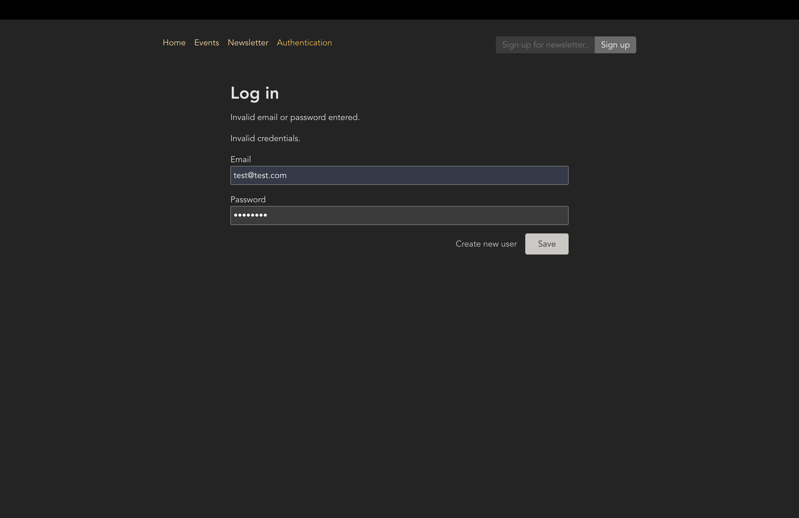

# 리액트 앱 인증(Authentication)

[📌 인증(Authentication)이란?](#-인증authentication이란)<br>
[📌 기본 설정](#-기본-설정)<br>
[📌 인증 작업 실행하기](#-인증-작업-실행하기)<br>
<br>

## 📌 인증(Authentication)이란?

- 프론트엔드의 앱이 백엔드로 접근하기 전에 반드시 인증을 받아야 한다.
- 프론트엔드에서 백엔드로 자격 증명 Request를 보내고, 만약 해당 자격 증명을 인증받았다면(올바른 형식의 이메일이나 input) 서버는 우리에게 보호된 리소스에 접근을 허가한다는 응답(Response)을 보내준다.

<br>

> **Server-Side Session(서버 측 세션)**

- 아주 대중적인 솔루션으로 프론트엔드와 백엔드가 분리되지 않은 풀스택 앱에서 자주 사용된다.
- 그러나 리액트는 분리되어 있어서 리액트에는 이상적이지 않다.
- 유저가 로그인하고 인증된 다음, 서버에 고유 식별자를 부여하는 방법이다. (Store unique identifier on server, send same identifier to client)
- 클라이언트는 이후 요청에서 해당 ID를 전송하며 보호된 리소스에 접근하려 한다.(Client sends identifier along with requests to protected resources)
- 서버는 이 클라이언트가 보호된 리소스에 접근할 권한이 있는지 확인할 수 있다.

<br>

> **Authentication Tokens(인증 토큰)**

- 사용자가 유효한 자격 증명을 전송한 뒤, 허가 토큰을 생성하지 저장하지는 않는다.
- 토큰은 기본적으로 알고리즘에 따라 생성된 스트링이다. 따라서 백엔드에서 이 토큰을 생성하고 그것을 다시 클라이언트에게 전송한다.
- 토큰을 생성한 백엔드만이 해당 토큰의 유효성을 확인하고 검증할 수 있다.
- 이후에 클라이언트가 다시 백엔드에 요청을 보낼 때 해당 토큰을 요청(Request)에 첨부하면 백엔드는 토큰을 살펴보고 검증하여 유효한 토큰이면 보호된 리소스에 대한 접근이 승인된다.

<br>

## 📌 기본 설정

### 📖 라우트 설정

🔗 [레파지토리에서 해당 코드 보기](https://github.com/Imshyeon/Develop_Study/commit/5806f7fbd60f0dace262d8e87ea03491a5fd2716)

<br>

### 📖 쿼리 매개변수 추가하기

#### 💎 AuthForm.js

```js
import { Form, Link, useSearchParams } from "react-router-dom";

import classes from "./AuthForm.module.css";

function AuthForm() {
  const [searchParams, setSearchParams] = useSearchParams();
  // [ 현재 설정된 쿼리 매개변수에 접근권을 주는 객체, 현재 설정된 쿼리 매개변수를 업데이트하게 해주는 함수 ]
  const isLogin = searchParams.get("mode") === "login"; // 가져오고싶은 쿼리 매개변수 비교. 만약 mode=login이면 로그인모드에 있는 것.

  return (
    <>
      <Form method="post" className={classes.form}>
        <h1>{isLogin ? "Log in" : "Create a new user"}</h1>
        <p>
          <label htmlFor="email">Email</label>
          <input id="email" type="email" name="email" required />
        </p>
        <p>
          <label htmlFor="image">Password</label>
          <input id="password" type="password" name="password" required />
        </p>
        <div className={classes.actions}>
          {/* 만약 이미 로그인 모드라면 signup모드로 갈 수 있게 해야한다. */}
          <Link to={`?mode=${isLogin ? "signup" : "login"}`}>
            {isLogin ? "Create new user" : "Login"}
          </Link>
          <button>Save</button>
        </div>
      </Form>
    </>
  );
}

export default AuthForm;
```

- url은 다음과 같아진다.
  - 현재 로그인 모드라면, 'http://localhost:3000/auth?mode=login'
  - 현재 signup 모드라면, 'http://localhost:3000/auth?mode=signup'

<br>

## 📌 인증 작업 실행하기

### 📖 인증 작업 실행하기

#### 💎 Authentication.js

```js
import { json, redirect } from "react-router-dom";
import AuthForm from "../components/AuthForm";

function AuthenticationPage() {
  return <AuthForm />;
}

export default AuthenticationPage;

export async function action({ request, params }) {
  const searchParams = new URL(request.url).searchParams;
  const mode = searchParams.get("mode") || "login"; // 모드

  if (mode !== "login" && mode !== "signup") {
    throw json({ message: "미지원 모드입니다." }, { status: 422 });
  }

  const data = await request.formData();
  const authData = {
    email: data.get("email"),
    password: data.get("password"),
  };

  const response = await fetch("http://localhost:8080/" + mode, {
    method: "POST",
    headers: {
      "Content-Type": "application/json",
    },
    body: JSON.stringify(authData),
  });

  if (response.status === 422 || response.status === 401) {
    // 오류 코드를 받으면
    return response;
  }

  if (!response.ok) {
    throw json({ message: "사용자 인증 불가합니다." }, { status: 500 });
  }

  // 백엔드에서 얻는 토큰 관리할 예정
  return redirect("/");
}
```

#### 💎 App.js

```js
import { RouterProvider, createBrowserRouter } from "react-router-dom";

import AuthenticationPage, {
  action as authAction,
} from "./pages/Authentication";

const router = createBrowserRouter([
  {
    path: "/",
    element: <RootLayout />,
    errorElement: <ErrorPage />,
    children: [
      { index: true, element: <HomePage /> },
      //...
      {
        path: "auth",
        element: <AuthenticationPage />,
        action: authAction, // 액션 추가
      },
    ],
  },
]);

function App() {
  return <RouterProvider router={router} />;
}

export default App;
```

<br>

### 📖 사용자 인풋 & 아웃풋 유효성 검증 오류 확인하기

#### 💎 AuthForm.js

```js
import {
  Form,
  Link,
  useActionData,
  useNavigation,
  useSearchParams,
} from "react-router-dom";

import classes from "./AuthForm.module.css";

function AuthForm() {
  const [searchParams, setSearchParams] = useSearchParams();
  // [ 현재 설정된 쿼리 매개변수에 접근권을 주는 객체, 현재 설정된 쿼리 매개변수를 업데이트하게 해주는 함수 ]
  const isLogin = searchParams.get("mode") === "login"; // 가져오고싶은 쿼리 매개변수 비교. 만약 mode=login이면 로그인모드에 있는 것.

  const data = useActionData(); // 이 액션 데이터는 사용자가 인증할 때 발생한 문제와 관련한 정보를 담고있다.(문제발생시 리턴하기 때문)

  const navigation = useNavigation();
  const isSubmitting = navigation.state === "submitting";

  return (
    <>
      <Form method="post" className={classes.form}>
        <h1>{isLogin ? "Log in" : "Create a new user"}</h1>
        {data && data.errors && (
          <ul>
            {Object.values(data.errors).map((err) => (
              <li key={err}>{err}</li>
            ))}
          </ul>
        )}
        {data && data.message && <p>{data.message}</p>}
        <p>
          <label htmlFor="email">Email</label>
          <input id="email" type="email" name="email" required />
        </p>
        <p>
          <label htmlFor="image">Password</label>
          <input id="password" type="password" name="password" required />
        </p>
        <div className={classes.actions}>
          {/* 만약 이미 로그인 모드라면 signup모드로 갈 수 있게 해야한다. */}
          <Link to={`?mode=${isLogin ? "signup" : "login"}`}>
            {isLogin ? "Create new user" : "Login"}
          </Link>
          <button disabled={isSubmitting}>
            {isSubmitting ? "Submitting..." : "Save"}
          </button>
        </div>
      </Form>
    </>
  );
}

export default AuthForm;
```


