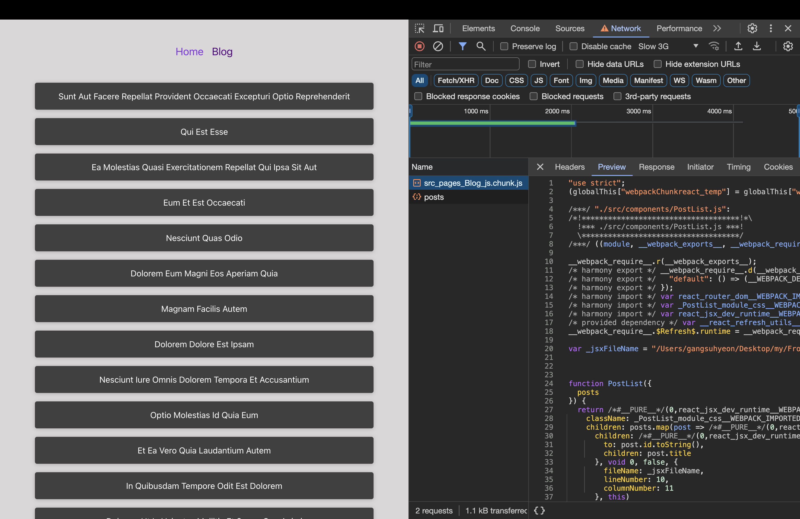
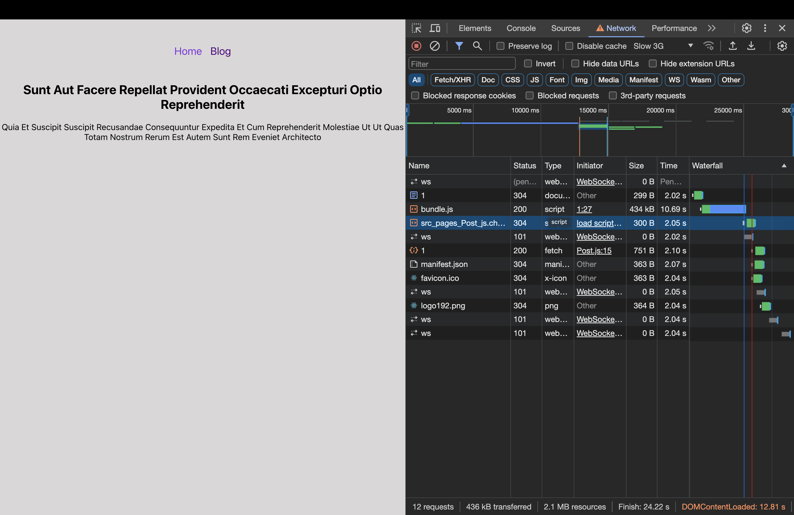
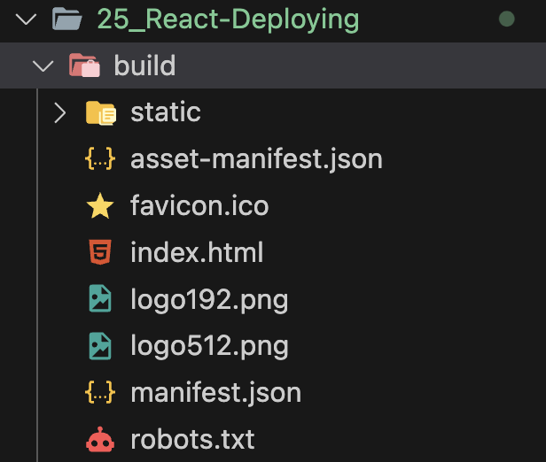
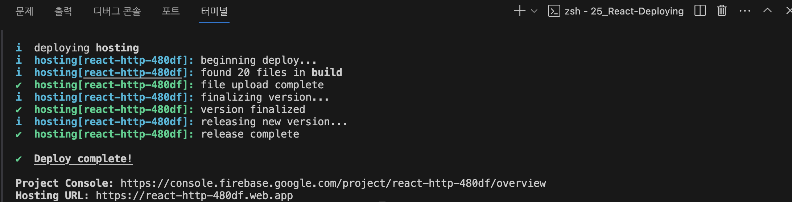

# 리액트 앱 배포하기

[📌 배포 과정](#-배포-과정)<br>
[📌 지연 로딩](#-지연-로딩)<br>
[📌 프로덕션용 코드 빌드하기](#-프로덕션용-코드-빌드하기)<br>
[📌 배포하기(서버에 업로드하기)](#-배포하기서버에-업로드하기)<br>
[📌 서버 측 라우팅 및 필요한 환경설정](#-서버-측-라우팅-및-필요한-환경설정)<br>
<br>

## 📌 배포 과정

- 어플리케이션을 배포/재배포할 때마다 거쳐야할 단계가 있다.

1. 코드 작성 후, 테스트를 거쳐야 한다.
2. 최적화가 가능한지 살펴본다. &rarr; 지연 로딩이 가능한가?
3. 프로덕션용 코드(앱)를 빌드한다.
4. 프로덕션 코드(완성된 코드)를 서버에 업로드한다.
5. 서버 또는 호스팅 제공자의 제품을 설정한다.

<br>

## 📌 지연 로딩

### 📖 지연 로딩 이해하기

- 코드를 최적화하기 위해 React Memo를 사용하는 등의 방법이 있다.
- 그러나 이번엔 지연 로딩을 이용할 것

> 지연 로딩 : 특정 코드를 필요할 때만 로딩하는 테크닉이다.

- 어떤 코드를 실행할 때 `import` 되는 것들이 있다. 예를 들어, `import {useLoaderData} from 'react-router-dom'` 을 임포트 해야한다면, 해당 코드를 실행하기 전에 react-router-dom에서 `useLoaderData`와 관련된 코드를 불러와야한다는 의미이다.
- 결국 import 문들은 여러 파일을 연결하는 것으로 최종 사용자에게 앱을 전달하려면 화면에 렌더링되기 전에 import 문들이 다 처리가 되어있어야 한다.
- 어플리케이션의 크기가 커질 수록 로딩하는 시간이 길어질 것이다. &rarr; 사용자 경험이 나빠진다.

> 결국, 지연 로딩을 도입해 특정 컴포넌트를 나중에 불러오는 것이다! 즉, 미리 불러오는 대신 필요할 때 불러와서 로딩되는 시간을 줄이는 것이다.

<br>

### 📖 지연 로딩 추가하기

- Blog.js에 적용
- 차후에 블로그 페이지를 방문할 때만 Blog가 로드될 것이다.

#### 💎 1. App에서 BlogPage 지연 로딩 하기

- App에서 BlogPage import를 제외한다.
- Blog에서 BlogPage 뿐만 아니라 로더 함수도 임포트한다.

```js
loader: () => import("./pages/Blog").then((module) => module.loader());
```

1. 우선, loader 함수부터 처리 &rarr; loader가 호출될 때에만 실행되도록 한다. 즉, 블로그 페이지에 접근할 때만 loader가 실행
   - `import()` 함수를 이용해서 동적으로 필요할 때만 임포트 한다. 이 함수는 Promise를 리턴한다.
   - `.then()` 키워드를 이용해서 로딩된 모듈(파일)을 받아 해당 모듈에 loader 함수를 적용한다.
   - 해당 loader 함수는 프로미스를 반환한다.

<br>

```js
// 1단계 - 유효한 리액트 컴포넌트가 아님.
const BlogPage = () => import("./pages/Blog"); // 이런 함수는 프로미스를 반환.

// 2단계 - lazy 이용하기
import { lazy } from "react";
const BlogPage = lazy(() => import("./pages/Blog"));

// 3단계 - Suspense 컴포넌트 이용하기
import { lazy, Suspense } from "react";

{
index: true,
element: (
    <Suspense fallback={<p>Loading...</p>}>
    <BlogPage />
    </Suspense>
),
loader: () =>
    import("./pages/Blog").then((module) => module.loader()),
},
```

2. 블로그 페이지 로딩하기
   1. 블로그 페이지 import 하기
      - 기본적으로 Blog는 블로그 페이지를 export한다.
      - 그러나 단순 임포트로만은 유효한 컴포넌트 함수가 될 수 없다.
      - 유효한 컴포넌트가 되기 위해선 JSX코드 같은 것들이 반환되어야 한다.
   2. `lazy()` 이용하기
      - `lazy()` : lazy는 동적으로 임포트하는 함수를 인자로 받는다.
      - 블로그가 유효한 컴포넌트가 된다.
   3. `Suspense` 컴포넌트로 블로그 컴포넌트를 감싼다.
      - `Suspense` 컴포넌트는 실제로 콘텐츠를 렌더링하기 전에 콘텐츠의 로딩을 기다리는데 사용할 수 있다.
      - 지연되는 블로그 컴포넌트를 감싸 폴백을 구현할 수 있다. &rarr; 해당 블로그 컴포넌트를 불러올 때까지 폴백을 보여준다.



- 해당 블로그의 script가 동적으로 다운로드되엇음을 볼 수 있다.

#### 💎 2. App에서 PostPage 지연 로딩 하기

```js
const PostPage = lazy(() => import("./pages/Post"));

{
path: ":id",
element: (
    <Suspense fallback={<p>Loading...</p>}>
    <PostPage />
    </Suspense>
),
loader: (meta) =>
    import("./pages/Post").then((module) => module.loader(meta)),
},
```

- 여기서는 Post의 loader가 params를 사용하므로, 로더에 `meta` 정보를 넘겨준다. 해당 메타정보는 params를 포함한다.



<br>

## 📌 프로덕션용 코드 빌드하기

- 현재 작성한 개발을 위한 코드는 가독성이 좋고 브라우저가 지원하지 않는 코드(ex. JSX 코드)도 몇 가지 포함하고 있다.
- 따라서, 서버에 업로드되기 전에 사용자가 쓸 수 있는 코드로 변환해야한다.

### 📖 프로덕션용 코드 빌드하기

1. 개발 서버 종료
2. `npm run build` &rarr; 스크립트 실행. 이 과정을 통해 업로드할 준비가 완료된 아주 최적화된 변환 코드 번들이 생성된다.
3. 위의 명령으로 인해 build 폴더 생성. &rarr; 해당 내용물을 서버에 배포하면 된다.
   
   - static 폴더 안에는 최적화된 자바스크립트 파일이 있다.
   - 이 파일에는 작성한 모든 코드와 리액트 라이브러리를 포함해 사용하는 모든 서드파티 패키지가 들어있다.
   - 가독성은 떨어지지만 매우 최적화된 코드!

<br>

## 📌 배포하기(서버에 업로드하기)

- 리액트 SPA는 **정적 웹사이트**이다. HTML, CSS, 자바스크립트 파일과 이미지 파일만으로 구성되고 서버에서 실행되어야 하는 코드가 없다.
- 모든 코드가 브라우저에서 파싱되고 유저(사용자)의 컴퓨터에서 실행될 것이다.
- 따라서 정적 웹사이트 호스트를 사용한다. &rarr; 여기선 Firebase 호스팅을 사용할 것

🔗 [firebase 호스팅](https://firebase.google.com/docs/hosting?hl=ko)

### 📖 Firebase를 이용해 배포하기

1. 구글에 로그인
2. 프로젝트 생성
3. 생성한 프로젝트의 빌드/호스팅 버튼 클릭
   1. 터미널에 `npm install -g firebase-tools` 실행 (맥은 앞에 `sudo` 키워드를 추가해야할 수도 있다.)
   2. `firebase login`
   3. `firebase init`
      - 단순 hoisting(Github Action사용하지 않음)
      - Use an existing project(현재 프로젝트 설정) : 이미 firebase에 프로젝트를 설정했음.
      - 생성한 프로젝트 선택(react-deployment-demo(프로젝트 이름))
      - 업로드할 파일 : 우리는 build 폴더 안에 있으므로 `build`라고 입력
      - SPA로 설정할 것인지 물어봄 : y (맞다)
      - 자동 빌드 또는 배포(Set up automatic builds and deploys with Github?) : n (아니오)
      - build/index.html을 오버라이드할 것인가 : n (아니오)
   4. .firebaserc, .firebase.json 생성됨
   5. `firebase deploy` 실행



➕ 추가 : 커스텀 도메인을 설정할 수 있다.
➕ 호스팅 중단하기 : `firebase hosting:disable`

<br>

## 📌 서버 측 라우팅 및 필요한 환경설정

- 배포 시, SPA로 설정할 지 물어보았다.
- 프로젝트 웹사이트는 여러 페이지 간에 이동이 가능하다. 즉 여러 라우트 간에 이동이 가능하다.
- 이 프로젝트는 서버에서 실행하는 코드가 없다.
- SPA로 설정할것인지 물어봤을 때, 예라고 했다면 어떠한 경로의 요청이 오건 index.html을 반환하도록 환경설정된다.
- URL 뒤에 어떤 경로가 붙건 언제나 index.html을 요청하고 항상 동일한 자바스크립트 파일을 사용한다.
