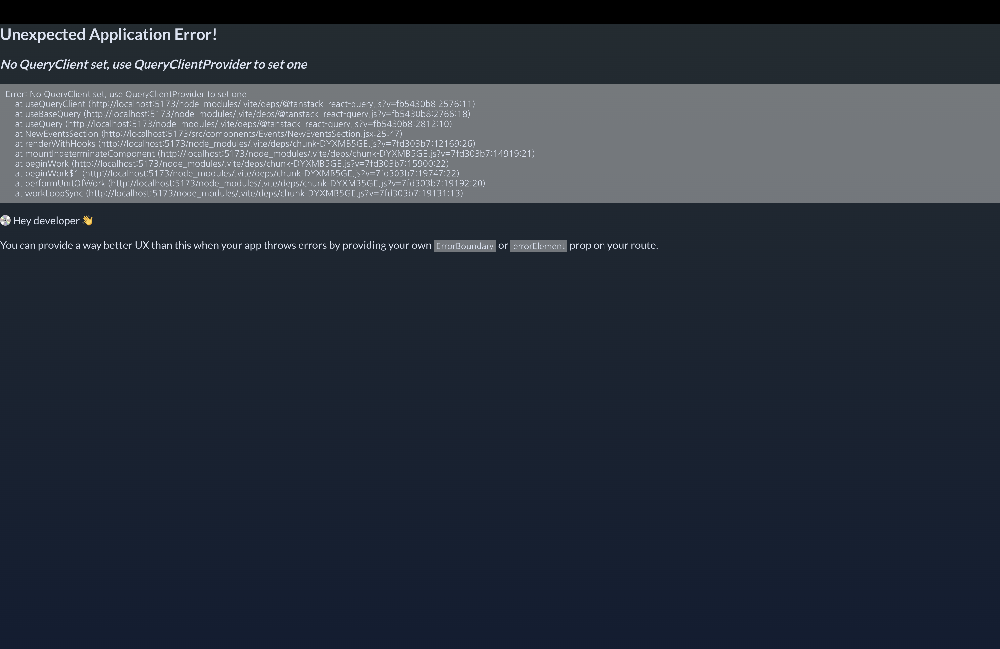
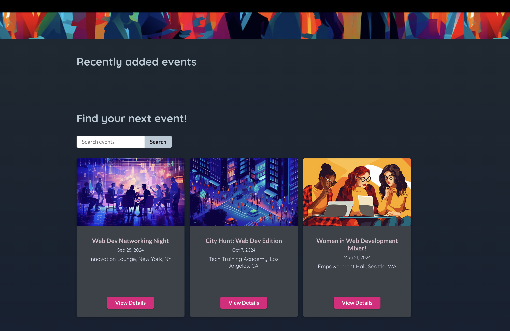

# 리액트 쿼리 | Data Fetching with Tanstack Query

[📌 프로젝트 시작하기](#-프로젝트-시작하기)<br>
[📌 리액트 쿼리](#-리액트-쿼리)<br>
<br>

## 📌 프로젝트 시작하기

🔗 [Tanstack Query Docs](https://tanstack.com/query/latest)

- Tanstack Query(리액트 쿼리의 새로운 명칭)은 매우 강력한 패키지이다. 위의 공식 문서 참고!

<br>

## 📌 리액트 쿼리

> Tanstack Query : HTTP 요청을 전송하고 프론트엔드 사용자 인터페이스를 백엔드 데이터와 동기화된 상태로 유지하는데 이용하는 라이브러리.

- useEffect, fetch를 이용하여 HTTP 요청을 전송하고 할 수도 있으나 Tanstack 쿼리는 코드가 더 간결해지고 개발자로써 작업을 수행할 수 있다.
- 또한 여러가지 고급 기능이 있으므로 복잡한 리액트 앱을 빌드하는데 도움이 된다!

### 📖 리액트 쿼리 : 소개 및 이점

#### 💎 NewEventSection.jsx

```jsx
import { useEffect, useState } from "react";

import LoadingIndicator from "../UI/LoadingIndicator.jsx";
import ErrorBlock from "../UI/ErrorBlock.jsx";
import EventItem from "./EventItem.jsx";

export default function NewEventsSection() {
  const [data, setData] = useState();
  const [error, setError] = useState();
  const [isLoading, setIsLoading] = useState(false);

  useEffect(() => {
    async function fetchEvents() {
      setIsLoading(true);
      const response = await fetch("http://localhost:3000/events");

      if (!response.ok) {
        const error = new Error("An error occurred while fetching the events");
        error.code = response.status;
        error.info = await response.json();
        throw error;
      }

      const { events } = await response.json();

      return events;
    }

    fetchEvents()
      .then((events) => {
        setData(events);
      })
      .catch((error) => {
        setError(error);
      })
      .finally(() => {
        setIsLoading(false);
      });
  }, []);

  let content;

  if (isLoading) {
    content = <LoadingIndicator />;
  }

  if (error) {
    content = (
      <ErrorBlock title="An error occurred" message="Failed to fetch events" />
    );
  }

  if (data) {
    content = (
      <ul className="events-list">
        {data.map((event) => (
          <li key={event.id}>
            <EventItem event={event} />
          </li>
        ))}
      </ul>
    );
  }

  return (
    <section className="content-section" id="new-events-section">
      <header>
        <h2>Recently added events</h2>
      </header>
      {content}
    </section>
  );
}
```

- 위처럼 `useEffect, fetch`를 이용해도 되지만 많은 양의 코드를 작성해야 한다.
- 또한 상태도 관리해야하며, HTTP 요청을 하는 모든 컴포넌트에서 위처럼 작성해야한다. 커스텀 훅을 빌드하여 재사용할 수 있으나 그럼에도 고급 기능(ex. 캐시 이용하기)을 사용하기에는 부족하다. &rarr; 디테일한 작업에는 투박하다.
- Tanstack 쿼리는 상태관리를 비롯해 코드는 간결하게 사용할 수 있고 고급기능(캐시처리, 자체적으로 처리되는 데이터 가져오기, 앱 효율적이게 만들기 등)을 이용할 수 있다.

<br>

### 📖 Tanstack 쿼리 설치 및 사용하기

- 설치 : `npm i @tanstack/react-query`

#### 💎 http.js에서 HTTP 요청을 위한 로직 작성하기

```js
export async function fetchEvents() {
  const response = await fetch("http://localhost:3000/events");

  if (!response.ok) {
    const error = new Error("An error occurred while fetching the events");
    error.code = response.status;
    error.info = await response.json();
    throw error;
  }

  const { events } = await response.json();

  return events;
}
```

#### 💎 NewEventsSection.jsx에서 Tanstack을 이용해 HTTP 요청을 관리하는 로직 만들기

```jsx
import { useQuery } from "@tanstack/react-query";
import { fetchEvents } from "../../util/http.js";

import LoadingIndicator from "../UI/LoadingIndicator.jsx";
import ErrorBlock from "../UI/ErrorBlock.jsx";
import EventItem from "./EventItem.jsx";

export default function NewEventsSection() {
  const { data, isPending, isError, error } = useQuery({
    queryKey: ["events"], // 모든 쿼리(전송하는 모든 GET HTTP 요청)에는 쿼리 키가 있다.
    queryFn: fetchEvents, // 해당 함수를 이용해 실제 요청을 전송할 때 실행할 코드를 정의.
  }); // 자체적으로 http 요청을 전송하고 해당 섹션에 필요한 이벤트 데이터를 가져오고 로딩 상태에 대한 정보를 제공한다.

  let content;

  if (isPending) {
    content = <LoadingIndicator />;
  }

  if (isError) {
    content = (
      <ErrorBlock
        title="An error occurred"
        message={error.info?.message || "Failed to fetch event."}
      />
    );
  }

  if (data) {
    content = (
      <ul className="events-list">
        {data.map((event) => (
          <li key={event.id}>
            <EventItem event={event} />
          </li>
        ))}
      </ul>
    );
  }

  return (
    <section className="content-section" id="new-events-section">
      <header>
        <h2>Recently added events</h2>
      </header>
      {content}
    </section>
  );
}
```

1. `QueryFn`

   - Tanstack 쿼리는 HTTP 요청을 전송하는 로직을 제공하지 않고 대신에 해당 요청을 관리하는 로직을 제공한다.
   - 즉 요청을 전달하는 코드는 직접 작성하면 된다.

2. `QueryKey`

   - 리액트 쿼리(Tanstack 쿼리)는 내부에서 쿼리 키를 이용해 요청으로 생성된 데이터를 캐시 처리한다. 그래서 나중에 동일한 요청을 전송하면 이전 요청의 응답을 재사용 가능하도록 하였다.
   - 데이터를 유저에게 더 빠르게 제공할 수 있도록 하였다.

3. `useQuery`로 부터 반환받는 객체에는
   - `data` 속성 : 실제 응답 데이터가 값으로 들어있다.
   - `isPending` : 요청이 여전히 실행 중인지, 응답을 받았는지에 대한 속성
   - `isError` : 오류 응답을 받은 경우 true. 요청에 대한 응답에 오류 상태 코드가 있는 경우 오류를 발행하도록 해야한다.
   - `error` : 발생한 오류에 대한 정보가 포함된 속성(ex. 에러 메시지)
   - `refetch` : 해당 함수를 수동으로 호출해 사용자가 버튼을 눌렀을 때 동일한 쿼리를 다시 전송할 수 있다.



- 리액트 쿼리와 `useQuery` 훅을 사용하려면 이러한 기능들을 사용할 컴포넌트를 Tanstack 쿼리가 제공하는 특수한 프로바이더 컴포넌트로 래핑해야한다.

<br>

#### 💎 App.jsx에서 리액트 쿼리를 사용하기 위해 QueryClient, QueryClientProvider 사용하기

```jsx
import { QueryClientProvider, QueryClient } from "@tanstack/react-query";

const queryClient = new QueryClient();

function App() {
  return (
    <QueryClientProvider client={queryClient}>
      <RouterProvider router={router} />
    </QueryClientProvider>
  );
}
```


- 이제, `useQuery` 훅을 이용해서 데이터를 받아오고 있다.

🔗 [레파지토리에서 보기](https://github.com/Imshyeon/Develop_Study/commit/d69de45725855e428359efa889727f204d9e5651)

<br>

### 📖 쿼리 동작 이해 및 구성 | 캐시 및 만료된 데이터

#### 💎 NewEventsSection.jsx

- 리액트 쿼리는 응답 데이터를 캐시 처리한다.
- 같은 요청에 대해서 미리 캐시를 통해 저장해 놓았다가 바로 사용자에게 제공한다. &rarr; 사용자 경험 개선
- 즉, 리액트 쿼리는 쿼리 키가 이미 이전에 사용되었음을 확인하고 해당 키의 데이터를 캐시 처리하여 빠르게 데이터를 제공한다.
- 이와 동시에 내부적으로 요청을 다시 전송해서 업데이트된 데이터가 있는지 확인한다. 따라서 업데이트된 데이터로 자체적으로 교체한다.

```jsx
const { data, isPending, isError, error } = useQuery({
  queryKey: ["events"],
  queryFn: fetchEvents,
  staleTime: 5000,
  gcTime: 30000,
});
```

- `staleTime` : 캐시에 데이터가 있을 때 업데이트된 데이터를 가져오기 위한 요청을 자체적으로 전송하기 전에 기다릴 시간을 설정한다.(기본값 0 : 데이터를 업데이트하기 위한 자체적인 요청을 항상 전송)
  - 만약 staleTime:5000 &rarr; 5000 밀리초 동안 기다린 후에 추가 요청을 보낸다.
- `gcTime` : garbage collection time &rarr; 데이터와 캐시를 얼마나 오랫동안 보관할 지를 제어한다. (기본값은 5분)

<br>

### 📖 동적 쿼리 함수 및 쿼리 키 | 검색 로직 -1

#### 💎 http.js

```js
export async function fetchEvents(searchTerm) {
  let url = "http://localhost:3000/events";
  if (searchTerm) {
    url += "?search=" + searchTerm;
    // 백엔드에서 검색을 위한 동적으로 해당 쿼리(?search=)는 useQuery에서 검색에 대한 쿼리동작이 구현되었을 때 사용되어야한다.
  }
  const response = await fetch(url);

  if (!response.ok) {
    const error = new Error("An error occurred while fetching the events");
    error.code = response.status;
    error.info = await response.json();
    throw error;
  }

  const { events } = await response.json();

  return events;
}
```

#### 💎 FindEventSection.jsx

```jsx
import { useRef, useState } from "react";
import { useQuery } from "@tanstack/react-query";
import { fetchEvents } from "../../util/http";
import LoadingIndicator from "../UI/LoadingIndicator";
import ErrorBlock from "../UI/ErrorBlock";
import EventItem from "./EventItem";

export default function FindEventSection() {
  const searchElement = useRef();
  const [searchTerm, setSearchTerm] = useState();

  const { data, isPending, isError, error } = useQuery({
    // searchTerm이 변경되면 다른 쿼리가 전송될 수 있도록 함.
    queryKey: ["events", { search: searchTerm }],
    queryFn: () => fetchEvents(searchTerm),
  });

  function handleSubmit(event) {
    event.preventDefault();
    setSearchTerm(searchElement.current.value);
  }

  let content = <p>Please enter a search term and to find events.</p>;

  if (isPending) {
    content = <LoadingIndicator />;
  }

  if (isError) {
    content = (
      <ErrorBlock
        title="An error occured"
        message={error.info?.message || "Failed to fetch event."}
      />
    );
  }

  if (data) {
    content = (
      <ul className="events-list">
        {data.map((event) => (
          <li key={event.id}>
            <EventItem event={event} />
          </li>
        ))}
      </ul>
    );
  }

  return (
    <section className="content-section" id="all-events-section">
      <header>
        <h2>Find your next event!</h2>
        <form onSubmit={handleSubmit} id="search-form">
          <input
            type="search"
            placeholder="Search events"
            ref={searchElement}
          />
          <button>Search</button>
        </form>
      </header>
      {content}
    </section>
  );
}
```



- Recently added Events에는 아무런 내용이 뜨지 않게 되었다.
- 개발자 Network 탭에서 'http://localhost:3000/events?search=[object%20Object]' 로 요청을 한 것이 확인 되었다.
- '?search=[object%20Object]'로 검색 로직이 잘못 동작되었다.

<br>

### 📖 쿼리 구성 객체 및 요청 취소 | 검색 로직 -2

- 위에서 잘못된 검색 로직이 동작된 이유는 NewEventsSection에 사용된 `useQuery` 훅에서 발생하였다.

```jsx
const { data, isPending, isError, error } = useQuery({
  queryKey: ["events"],
  queryFn: fetchEvents,
  staleTime: 5000,
});
```

- 해당 `useQuery` 훅은 여기에 정의한 쿼리 함수에 기본 데이터를 전달하고 있다.
- 리액트 쿼리는 쿼리 함수에 기본적으로 데이터를 전달하는데, 이때 전달되는 데이터는 쿼리에 사용된 쿼리 키와 signal 객체이다. 해당 signal은 요청을 취소할 때 필요하다.

#### 💎 http.js

```js
export async function fetchEvents({ signal, searchTerm }) {
  //...
}
```

- `signal` : 요청 전송이 취소되는 것을 파악할 수 있다. 예를 들어 사용자가 페이지를 벗어나면 리액트 쿼리는 전송 중인 요청을 취소하려 할 것이다.

#### 💎 FindEventSection.jsx

```jsx
const { data, isPending, isError, error } = useQuery({
  queryKey: ["events", { search: searchTerm }],
  queryFn: ({ signal }) => fetchEvents({ signal, searchTerm }),
});
```


- Recently added events에 데이터가 다시 표기가 된 것을 볼 수 있다.

<br>

### 📖 쿼리 활성화 및 비활성화 | 검색 로직 -3

- 유효한 결과가 나오는 이유는 검색어를 상태(State)로 관리하고 있기 때문이다. &rarr; FindEventSection은 상태가 바뀔 때마다 재실행된다.
- 그러나 가장 처음 웹페이지를 방문했을 때, 검색에는 모든 이벤트가 표시되어있다. 이는 의도한 바와는 다르다. &rarr; 검색어를 입력하지 않았을 경우 `useQuery`를 FindEventSection으로 전송하지 않도록 하는 것이 좋다. 즉, 검색어를 입력할 때까지 쿼리를 비활성화하는 것이다.

#### 💎 FindEventSection.jsx

```jsx
const { data, isLoading, isError, error } = useQuery({
  queryKey: ["events", { search: searchTerm }],
  queryFn: ({ signal }) => fetchEvents({ signal, searchTerm }),
  enabled: searchTerm !== undefined, // false: 비활성화, true: 활성화(기본값)
});

if (isLoading) {
  content = <LoadingIndicator />;
}
```

- `isLoading` : 쿼리가 비활성화됐다고 해서 enabled 속성이 true가 되지는 않는다.(`isPending`과는 다른 점)


<br>

### 📖 `useMutation`을 사용하여 데이터 변경 | 데이터 전송하기

- `useQuery`는 데이터를 가져올 때만 사용하고 이번엔 데이터를 전송하는 것이니까 `useMutation`를 사용한다.
- POST 요청을 전송할 때 요청 전송을 위한 로직을 직접 작성해서 `useQuery`를 이용할 수는 있다.
- 그러나 `useMutation`은 데이터를 변경하는 쿼리에 최적화 되어있다.
- `useMutation`은 `useQuery`와는 다르게 컴포넌트가 렌더링될 때 자동으로 요청을 보내지 않는다. 대신 요청을 언제 실행할 것인지를 차후에 반환할 `mutate` 함수로 지정해줘야 한다.

#### 💎 http.js

```js
export async function createNewEvent(eventData) {
  const response = await fetch("http://localhost:3000/events", {
    method: "POST",
    headers: {
      "Content-Type": "application/json",
    },
    body: JSON.stringify(eventData),
  });

  if (!response.ok) {
    const error = new Error("An error occurred while creating the event");
    error.code = response.status;
    error.info = await response.json();
    throw error;
  }

  const { event } = await response.json();

  return event;
}
```

#### 💎 NewEvent.jsx

```jsx
import { Link, useNavigate } from "react-router-dom";

import { useMutation } from "@tanstack/react-query";
import { createNewEvent } from "../../util/http.js";

import Modal from "../UI/Modal.jsx";
import EventForm from "./EventForm.jsx";
import ErrorBlock from "../UI/ErrorBlock.jsx";

export default function NewEvent() {
  const navigate = useNavigate();

  const { mutate, isPending, isError, error } = useMutation({
    mutationFn: createNewEvent, // mutationKey도 있으나 mutation 동작은 캐시 처리를 하지는 않는다.
  });

  function handleSubmit(formData) {
    mutate({ event: formData });
  }

  return (
    <Modal onClose={() => navigate("../")}>
      <EventForm onSubmit={handleSubmit}>
        {isPending && "Submitting..."}
        {!isPending && (
          <>
            <Link to="../" className="button-text">
              Cancel
            </Link>
            <button type="submit" className="button">
              Create
            </button>
          </>
        )}
      </EventForm>
      {isError && (
        <ErrorBlock
          title="Failed to create event"
          message={
            error.info?.message ||
            "Failed to create event. Plz check your inputs and try again later."
          }
        />
      )}
    </Modal>
  );
}
```

- `useMutation`에서 반환된 객체에는

1. `data` : 전송된 요청의 응답으로 반환된 데이터
2. `mutate` : 해당 훅을 사용하는 컴포넌트에서 어디서든 `mutate` 함수를 호출해 요청을 전송할 수 있다.
3. `isPending` : true/false
4. `isError` : `useQuery`에서와 같다.
5. `error` : 오류의 세부정보
