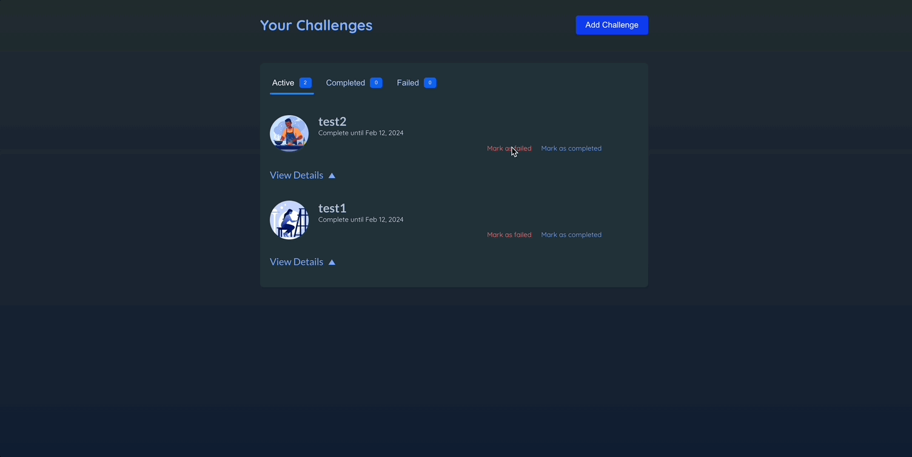
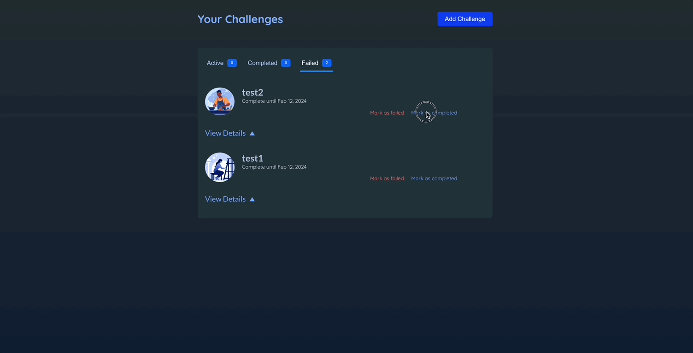
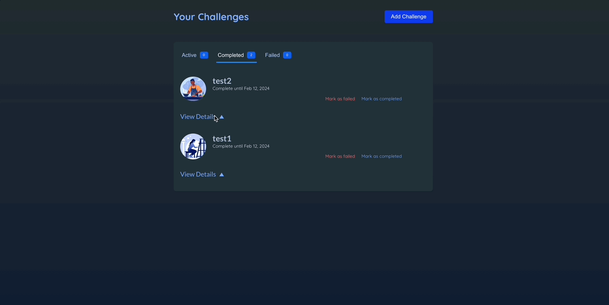
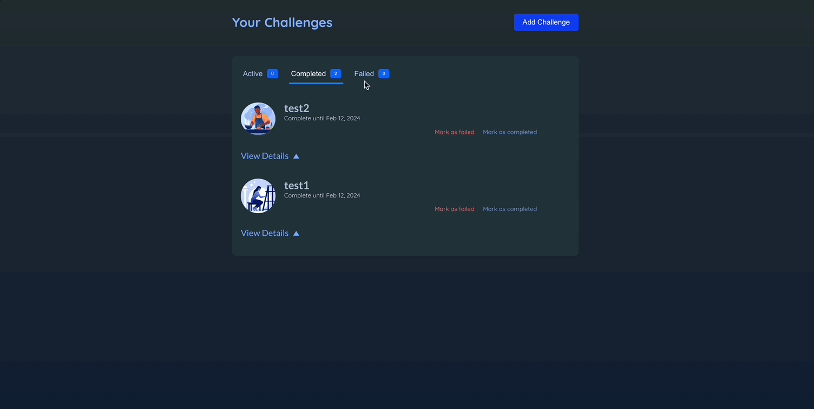

# 리액트 앱에 애니메이션 넣기

[📌 CSS 이용하기](#-css-이용하기)<br>
[📌 프레이머 모션](#-프레이머-모션)<br>
<br>

## 📌 CSS 이용하기

### 📖 CSS 트랜지션으로 애니메이션 넣기

- `challenge-item-details-icon`에 대한 애니메이션을 추가할 것이다.

#### 💎 참고 : ChanllengeItem.jsx

```jsx
{
  /* ... */
}
<div className={`challenge-item-details ${isExpanded ? "expanded" : ""}`}>
  <p>
    <button onClick={onViewDetails}>
      View Details <span className="challenge-item-details-icon">&#9650;</span>
    </button>
  </p>
  {/* ... */}
</div>;
```

#### 💎 index.css

```css
.challenge-item-details-icon {
  display: inline-block;
  font-size: 0.85rem;
  margin-left: 0.25rem;
  transition: transform 0.3s ease-out;
  /* 트랜스폼에 변화가 있다면 값변화에 애니메이션을 적용하겠다! */
  /* 지속시간 설정 */
  /* 애니메이션의 속도 조절 */
}

.challenge-item-details.expanded .challenge-item-details-icon {
  transform: rotate(180deg);
  /* 아이콘을 회전하겠다~ */
}
```

- CSS 트랜지션을 사용하려면 `transition` 프로퍼티를 추가하면 된다.
- 아이콘의 기본 규칙으로 추가할 것이다.


<br>

### 📖 CSS 애니메이션으로 애니메이션 넣기

- `@keyframes` 라는 특수한 구문으로 직접 애니메이션 작성

```css
.modal {
  top: 10%;
  border-radius: 6px;
  padding: 1.5rem;
  width: 30rem;
  max-width: 90%;
  z-index: 10;
  animation: slide-up-fade-in 0.3s ease-out forwards; /* 요소가 DOM에 추가될 때 CSS에 의해 자동으로 실행된다. */
  /* forwards: 지속시간이 끝나 애니메이션이 종료되면 최종 상태를 유지하라는 의미. */
}

@keyframes slide-up-fade-in {
  /* 요소가 DOM에 포함되지 않아도 초기 상태를 정의할 수 있고 최종 상태와 중간 상태도 정의할 수 있다. */
  /* from{} to{} 혹은 0%{} 100%{}로 표현할 수 있다. */
  0% {
    transform: translateY(30px);
    opacity: 0; /* 처음엔 보이지 않게 */
  }

  100% {
    transform: translateY(0);
    opacity: 1;
  }
}
```


🔗 [MDN animation](https://developer.mozilla.org/ko/docs/Web/CSS/animation)

<br>

## 📌 프레이머 모션

### 📖 프레이머 모션 소개

- CSS로 DOM에서 나타나게 하는 애니메이션을 적용할 수 있지만 사라지는 애니메이션은 어렵다.
- CSS로는 복잡한 애니메이션은 적용시키기 힘들다.

🔗 [Framer Motion](https://www.framer.com/motion/)

- 설치하기 : `npm install framer-motion`

### 📖 프레이머 모션 기초

🔗 [프레이머의 모션 기초 학습을 위한 레파지토리](https://github.com/Imshyeon/Develop_Study/tree/js/React/Complete-React/28_FramerMotion)

<br>

### 📖 조건 값 사이에 애니메이션 넣기

- `isExpaned`가 true이면 180도 회전, false이면 회전하지 않는다.

```jsx
export default function ChallengeItem() {
  return (
    <motion.span
      animate={{ rotate: isExpanded ? 180 : 0 }}
      className="challenge-item-details-icon"
    >
      &#9650;
    </motion.span>
  );
}
```


<br>

### 📖 진입 애니메이션 추가하기

#### 💎 Modal.jsx

```jsx
import { createPortal } from "react-dom";
import { motion } from "framer-motion";

export default function Modal({ title, children, onClose }) {
  return createPortal(
    <>
      <div className="backdrop" onClick={onClose} />
      <motion.dialog
        initial={{ opacity: 0, y: 30 }}
        animate={{ opacity: 1, y: 0 }}
        open
        className="modal"
      >
        <h2>{title}</h2>
        {children}
      </motion.dialog>
    </>,
    document.getElementById("modal")
  );
}
```

- `initial` 속성을 통해 해당 요소가 DOM에 추가된 직후 곧바로 재생될 애니메이션의 초기상태를 정의. &rarr; 시작 상태를 지정.


<br>

### 📖 요소가 사라지는/삭제되는 애니메이션 넣기

#### 💎 Modal.jsx

```jsx
import { createPortal } from "react-dom";
import { motion } from "framer-motion";

export default function Modal({ title, children, onClose }) {
  return createPortal(
    <>
      <div className="backdrop" onClick={onClose} />
      <motion.dialog
        initial={{ opacity: 0, y: 30 }}
        animate={{ opacity: 1, y: 0 }}
        exit={{ opacity: 0, y: 30 }} // 요소가 DOM에서 삭제될 때 적용하고 싶은 애니메이션 상태
        open
        className="modal"
      >
        <h2>{title}</h2>
        {children}
      </motion.dialog>
    </>,
    document.getElementById("modal")
  );
}
```

- `exit` : 요소가 DOM에서 삭제될 때 적용하고 싶은 애니메이션 상태

#### 💎 Header.jsx

```jsx
import { useState } from "react";
import { AnimatePresence } from "framer-motion";

import NewChallenge from "./NewChallenge.jsx";

export default function Header() {
  const [isCreatingNewChallenge, setIsCreatingNewChallenge] = useState();

  function handleStartAddNewChallenge() {
    setIsCreatingNewChallenge(true);
  }

  function handleDone() {
    setIsCreatingNewChallenge(false);
  }

  return (
    <>
      {/* 프레이머모션이 해당 코드를 실행할때 코드가 렌더링하는 요소(모달)이 즉시 삭제되는 것을 방지하고 exit 속성이 있는지 확인. */}
      {/* exit을 확인하면 exit 애니메이션부터 실행한 뒤, 삭제한다. */}
      <AnimatePresence>
        {isCreatingNewChallenge && <NewChallenge onDone={handleDone} />}
      </AnimatePresence>
      <header id="main-header">
        <h1>Your Challenges</h1>
        <button onClick={handleStartAddNewChallenge} className="button">
          Add Challenge
        </button>
      </header>
    </>
  );
}
```

- `AnimatePresence` : 어떤 요소에 애니메이션을 적용할때(요소를 사라지게하는 애니메이션) 조건에 따라 요소를 표시하거나 삭제하는 코드를 감싸는 래퍼로 쓰인다.
- 프레이머 모션이 해당 코드를 실행할때 코드가 렌더링하는 요소(모달)이 즉시 삭제되는 것을 방지하고 `exit` 속성이 있는지 확인.
- `exit`을 확인하면 `exit` 애니메이션부터 실행한 뒤, 삭제한다.


<br>

### 📖 마우스 오버 애니메이션으로 튀어나오는 듯한 효과 주기

#### 💎 Header.jsx

```jsx
import { useState } from "react";
import { AnimatePresence, motion } from "framer-motion";

import NewChallenge from "./NewChallenge.jsx";

export default function Header() {
  const [isCreatingNewChallenge, setIsCreatingNewChallenge] = useState();

  function handleStartAddNewChallenge() {
    setIsCreatingNewChallenge(true);
  }

  function handleDone() {
    setIsCreatingNewChallenge(false);
  }

  return (
    <>
      <AnimatePresence>
        {isCreatingNewChallenge && <NewChallenge onDone={handleDone} />}
      </AnimatePresence>
      <header id="main-header">
        <h1>Your Challenges</h1>
        <motion.button // 튀어나오는 모션
          whileHover={{ scale: 1.1 }}
          transition={{ type: "spring", stiffness: 500 }} // 튕김 애니메이션 추가
          onClick={handleStartAddNewChallenge}
          className="button"
        >
          Add Challenge
        </motion.button>
      </header>
    </>
  );
}
```

- `while~` : 사용자가 탭하거나 커서를 올릴때 등 특수한 상황에만 적용하는 애니메이션 상태를 정의.


<br>

### 📖 애니메이션 상태 재사용하기 - `variants`

#### 💎 Modal.jsx

```jsx
import { createPortal } from "react-dom";
import { motion } from "framer-motion";

export default function Modal({ title, children, onClose }) {
  // const hiddenAnimationState = { opacity: 0, y: 30 }; -> 방법 1 : 값을 지정해서 직접 설정하는 방법
  return createPortal(
    <>
      <div className="backdrop" onClick={onClose} />
      <motion.dialog
        variants={{
          hidden: { opacity: 0, y: 30 }, //원하는 키값 설정 가능
          visible: { opacity: 1, y: 0 },
        }} // 애니메이션 상태 재사용에 유용
        initial="hidden"
        animate="visible"
        exit="hidden"
        open
        className="modal"
      >
        <h2>{title}</h2>
        {children}
      </motion.dialog>
    </>,
    document.getElementById("modal")
  );
}
```

- 방법 1 : 상수를 이용해 별도로 애니메이션을 지정해서 직접 설정하는 방법
- 방법 2 : `variants` 를 이용. 원하는 키 값을 설정 가능하여 애니메이션 상태를 재사용하는데 유용하다.

<br>

### 📖 중첩 애니메이션과 배리언트 - `variants`

- 애니메이션 상태를 정의하고 재사용하는 것 뿐만 아니라 컴포넌트 트리 안 깊숙한 곳에서 애니메이션을 트리거하는데 쓰일 수도 있다.
- 조상 컴포넌트에서 애니메이션을 특정 베리언트로 설정하면 된다.

- 래퍼나 부모 컴포넌트에서 특정 애니메이션 상태를 배리언트로 설정하고 래핑된 컴포넌트 또는 자식 컴포넌트 안에서 동일한 배리언트를 쓸 수 있다.(일종의 상속..?)

#### 💎 NewChallenge.jsx

```jsx
import { useContext, useRef, useState } from "react";
import { motion } from "framer-motion";

import { ChallengesContext } from "../store/challenges-context.jsx";
import Modal from "./Modal.jsx";
import images from "../assets/images.js";

export default function NewChallenge({ onDone }) {
  // ...

  return (
    <Modal title="New Challenge" onClose={onDone}>
      <form id="new-challenge" onSubmit={handleSubmit}>
        {/* ... */}
        <ul id="new-challenge-images">
          {images.map((image) => (
            <motion.li
              variants={{
                hidden: { opacity: 0, scale: 0.5 }, // 부모 컴포넌트가 활성화될때 자동으로 함께 활성화
                visible: { opacity: 1, scale: 1 },
              }}
              // 자식 컴포넌트에서는 배리언트의 키를 사용하지 못한다..
              exit={{ opacity: 1, scale: 1 }} // 모달의 exit을 오버라이드
              transition={{ type: "spring" }}
              key={image.alt}
              onClick={() => handleSelectImage(image)}
              className={selectedImage === image ? "selected" : undefined}
            >
              
            </motion.li>
          ))}
        </ul>
        {/* ... */}
      </form>
    </Modal>
  );
}
```

- 자식 컴포넌트에서의 `variants`를 선언하여 부모의 키 값 애니메이션 동안, 자식은 어떤 동작을 할 지 선언.
- 모달이 닫히는데 딜레이가 발생 &rarr; 부모의 exit 속성 때문이다. 모달이 닫히면서 다시 사진이 `hidden` 상태로 변화하고 이미지가 다시 변화한 뒤에 그제서야 모달이 닫힌다.
- `exit`을 오버라이드 &rarr; 해당 컴포넌트 안에서만 적용된다. 이로써 이미지는 exit일때 부모 컴포넌트(modal)에서 지정한 exit 애니메이션과는 다르게 동작 &rarr; 모달 닫는데 딜레이가 사라질것
- 이때, 자식 컴포넌트에서는 부모에서 사용했던 키를 사용하지 못한다..!


<br>

### 📖 리스트 애니메이션에 스테거링 효과 주기

- 스테거링 : 리스트 항목이 애니메이션으로 나타나는 데 시차를 두는 것. 즉, 동시에 플레이 되는 것이 아니라 하나씩 플레이 되는 것.

1. 리스트 항목의 부모 요소로 간다
2. 모션 요소로 바꾼다.

#### 💎 NewChallenge.jsx

```jsx
import { useContext, useRef, useState } from "react";
import { motion } from "framer-motion";

import { ChallengesContext } from "../store/challenges-context.jsx";
import Modal from "./Modal.jsx";
import images from "../assets/images.js";

export default function NewChallenge({ onDone }) {
  // ...

  return (
    <Modal title="New Challenge" onClose={onDone}>
      <form id="new-challenge" onSubmit={handleSubmit}>
        {/* ... */}

        <motion.ul
          id="new-challenge-images"
          variants={{
            visible: { transition: { staggerChildren: 0.05 } },
          }}
        >
          {images.map((image) => (
            <motion.li
              variants={{
                hidden: { opacity: 0, scale: 0.5 },
                visible: { opacity: 1, scale: 1 },
              }}
              exit={{ opacity: 1, scale: 1 }}
              transition={{ type: "spring" }}
              key={image.alt}
              onClick={() => handleSelectImage(image)}
              className={selectedImage === image ? "selected" : undefined}
            >
              
            </motion.li>
          ))}
        </motion.ul>

        {/* ... */}
      </form>
    </Modal>
  );
}
```

- `staggerChildren` : 해당 옵션은 부모 요소에 속한 자식 요소가 애니메이션을 시작하는 시점의 차이를 조절하는데 쓰인다.
  - 기본값은 모두 동시에 시작하도록 설정
  - 해당 속성을 0이 아닌 값으로 설정하면 모든 자식 항목 사이에 그에 해당하는 시차가 생긴다.


<br>

### 📖 색상 애니메이션 추가 및 키 프레임으로 효과 주기

#### 💎 Header.jsx

```jsx
<motion.button
  whileHover={{ scale: 1.1, backgroundColor: "#8b11f0" }} // 색상 코드
  transition={{ type: "spring", stiffness: 500 }}
  onClick={handleStartAddNewChallenge}
  className="button"
>
  Add Challenge
</motion.button>
```

#### 💎 NewChallenge.jsx

```jsx
<motion.li
  variants={{
    hidden: { opacity: 0, scale: 0.5 },
    visible: { opacity: 1, scale: [0.8, 1.3, 1] }, // 크기가 80 -> 130 -> 100%로 변경
  }}
  exit={{ opacity: 1, scale: 1 }}
  transition={{ type: "spring" }}
  key={image.alt}
  onClick={() => handleSelectImage(image)}
  className={selectedImage === image ? "selected" : undefined}
>
  
</motion.li>
```

- 속성에 대한 값으로 배열을 넣으면 항목들이 애니메이션으로 표시될 때 프레이머 모션이 거치는 키 프레임의 배열을 생성하게 된다.


<br>

### 📖 명령적 접근법으로 애니메이션 구현하기 - useAnimate

- 사용자가 폼에 입력하지 않은 채로 제출하려할 때, 해당 입력창이 흔들리는 효과를 주자.

```jsx
import { useContext, useRef, useState } from "react";
import { motion, useAnimate, stagger } from "framer-motion";

import { ChallengesContext } from "../store/challenges-context.jsx";
import Modal from "./Modal.jsx";
import images from "../assets/images.js";

export default function NewChallenge({ onDone }) {
  //...

  const [scope, animate] = useAnimate();

  if (
    !challenge.title.trim() ||
    !challenge.description.trim() ||
    !challenge.deadline.trim() ||
    !challenge.image
  ) {
    animate(
      "input, textarea",
      { x: [-10, 0, 10, 0] },
      { type: "spring", duration: 0.2, delay: stagger(0.05) }
    );
    return;
  }
  //...

  return (
    <Modal title="New Challenge" onClose={onDone}>
      <form id="new-challenge" onSubmit={handleSubmit} ref={scope}>
        {/* ... */}
      </form>
    </Modal>
  );
}
```

- `useAnimate`는 배열에 두 개의 요소를 반환한다.

  - ref(animate함수에서 설정하는 선택자의 범위를 정해주는 JSX요소에 연결된다)
  - 함수

- `animate` 함수에는 총 세 개의 인수가 필요하다.

  1. 애니메이션화 되어야 하는 요소 타게팅 하기 위해 css 선택자..
  2. 애니메이션을 설명하는 객체를 입력
  3. 설정 객체. 애니메이션이 어떤 식으로 플레이되는지 설정 가능

- `form`에 해당 애니메이션 함수를 발생시키기 위해 scope 연결


<br>

### 📖 레이아웃 변화에 애니메이션 적용하기

#### 💎 ChallengeItem.jsx

```jsx
export default function ChallengeItem() {
  return <motion.li layout>{/* ... */}</motion.li>;
}
```

- `layout` : 모션 컴포넌트에 해당 속성을 추가하면 프레이머 모션이 해당 컴포넌트에 속한 레이아웃 변화에 자동으로 애니메이션을 적용함.



<br>

### 📖 여러 요소 애니메이션 조율하기

#### 💎 Challenges.jsx

```jsx
import { useContext, useState } from "react";
import { AnimatePresence, motion } from "framer-motion";

import { ChallengesContext } from "../store/challenges-context.jsx";
import ChallengeItem from "./ChallengeItem.jsx";
import ChallengeTabs from "./ChallengeTabs.jsx";

export default function Challenges() {
  const { challenges } = useContext(ChallengesContext);
  const [selectedType, setSelectedType] = useState("active");
  const [expanded, setExpanded] = useState(null);

  function handleSelectType(newType) {
    setSelectedType(newType);
  }

  function handleViewDetails(id) {
    setExpanded((prevId) => {
      if (prevId === id) {
        return null;
      }

      return id;
    });
  }

  const filteredChallenges = {
    active: challenges.filter((challenge) => challenge.status === "active"),
    completed: challenges.filter(
      (challenge) => challenge.status === "completed"
    ),
    failed: challenges.filter((challenge) => challenge.status === "failed"),
  };

  const displayedChallenges = filteredChallenges[selectedType];

  return (
    <div id="challenges">
      <ChallengeTabs
        challenges={filteredChallenges}
        onSelectType={handleSelectType}
        selectedType={selectedType}
      >
        {/* mode="sync"가 기본값 : 동시에 플레이 */}
        {/* mode="wait" : 첫번째 요소가 사라지기를 기다렸다가 나타나는 애니메이션 추가를 취해 wait 모션.. */}
        <AnimatePresence mode="wait">
          {displayedChallenges.length > 0 && (
            <motion.ol
              key="list" // 별개의 애니메이션을 알리기 위함. -> AnimatePresence안에 1개 이상의 요소가 있음
              exit={{ y: -30, opacity: 0 }}
              className="challenge-items"
            >
              <AnimatePresence>
                {displayedChallenges.map((challenge) => (
                  <ChallengeItem
                    key={challenge.id}
                    challenge={challenge}
                    onViewDetails={() => handleViewDetails(challenge.id)}
                    isExpanded={expanded === challenge.id}
                  />
                ))}
              </AnimatePresence>
            </motion.ol>
          )}

          {displayedChallenges.length === 0 && (
            <motion.p
              key="fallback"
              initial={{ opacity: 0, y: -20 }}
              animate={{ opacity: 1, y: 0 }}
              exit={{ opacity: 0, y: -20 }}
            >
              No challenges found.
            </motion.p>
          )}
        </AnimatePresence>
      </ChallengeTabs>
    </div>
  );
}
```

- 현재 `AnimatePresence` 안에 `motion.ol, motion.p`가 있다. 이 둘을 구분하기 위해 key 속성을 각각 부여하여 별개의 애니메이션임을 구분시켜준다.
- `AnimatePresence` 의 모드를 wait으로 설정함으로써 첫번째 요소가 사라진 뒤에 약간 기다렸다가 두번째 요소가 나타나도록 한다.



🔗 [해당 코드 레파지토리에서 보기](https://github.com/Imshyeon/Develop_Study/commit/ee7531e09a84e3472767f92b66f7723d09826c04)

<br>

### 📖 레이아웃 애니메이션과 다른 애니메이션 통합하기

- ChallengeItem의 `layout`으로 인해서 자동으로 애니메이션이 적용되고 있다. 이로 인해서 View Details 버튼을 눌렀을 때 애니메이션이 약간 울렁이는 듯한 모습이 보인다.

#### 💎 ChallengeItem.jsx

```jsx
import { useContext } from "react";
import { AnimatePresence, motion } from "framer-motion";

import { ChallengesContext } from "../store/challenges-context.jsx";

export default function ChallengeItem({
  challenge,
  onViewDetails,
  isExpanded,
}) {
  const { updateChallengeStatus } = useContext(ChallengesContext);

  const formattedDate = new Date(challenge.deadline).toLocaleDateString(
    "en-US",
    {
      day: "2-digit",
      month: "short",
      year: "numeric",
    }
  );

  function handleCancel() {
    updateChallengeStatus(challenge.id, "failed");
  }

  function handleComplete() {
    updateChallengeStatus(challenge.id, "completed");
  }

  return (
    <motion.li layout exit={{ y: -30, opacity: 0 }}>
      <article className="challenge-item">
        <header>
          
          <div className="challenge-item-meta">
            <h2>{challenge.title}</h2>
            <p>Complete until {formattedDate}</p>
            <p className="challenge-item-actions">
              <button onClick={handleCancel} className="btn-negative">
                Mark as failed
              </button>
              <button onClick={handleComplete}>Mark as completed</button>
            </p>
          </div>
        </header>
        <div className="challenge-item-details">
          <p>
            <button onClick={onViewDetails}>
              View Details{" "}
              <motion.span
                animate={{ rotate: isExpanded ? 180 : 0 }}
                className="challenge-item-details-icon"
              >
                &#9650;
              </motion.span>
            </button>
          </p>

          {/* 디테일 설명 애니메이션 추가 */}
          <AnimatePresence>
            {isExpanded && (
              <motion.div
                initial={{ height: 0, opacity: 0 }}
                animate={{ height: "auto", opacity: 1 }}
                exit={{ height: 0, opacity: 0 }}
              >
                <p className="challenge-item-description">
                  {challenge.description}
                </p>
              </motion.div>
            )}
          </AnimatePresence>
        </div>
      </article>
    </motion.li>
  );
}
```

- 디테일 설명이 나타날 때의 애니메이션을 기술함으로써 해결한다.



<br>

### 📖 공유된 요소에 애니메이션 적용하기

#### 💎 ChallengeTabs.jsx

```jsx
import { motion } from "framer-motion";

function Tab({ isSelected, onSelect, badgeCaption, children }) {
  return (
    <li>
      <button
        className={isSelected ? "selected" : undefined}
        onClick={onSelect}
      >
        {children}
        <Badge caption={badgeCaption}></Badge>
      </button>
      {isSelected && (
        <motion.div layoutId="tab-indicator" className="active-tab-indicator" /> // layoutId 추가
      )}
    </li>
  );
}
```

- `layoutId` : 모션 요소에 layoutId를 추가하면 프레이머 모션이 애니메이션 적용.
  - 페이지의 다른 위치에 있는 같은 layoutId를 지닌 다른 요소가 렌더링 되는 때를 자동으로 감지해서 애니메이션을 적용.



<br>

### 📖 키를 활용해 애니메이션 다시 트리거하기

- 항목에 변경이 있을 때마다 탭에 속한 항목을 표시해주는 숫자 배지에 애니메이션 적용하기

#### 💎 Badge.jsx

```jsx
import { motion } from "framer-motion";

export default function Badge({ caption }) {
  return (
    <motion.span
      animate={{ scale: [1, 1.2, 1] }}
      transition={{ duration: 0.3 }}
      className="badge"
    >
      {caption}
    </motion.span>
  );
}
```

- Badge에 적용할 애니메이션 기술
- 가장 처음에만 실행되고 그 다음부턴 실행이 되지 않음.

#### 💎 ChallengeTabs.jsx

```jsx
function Tab({ isSelected, onSelect, badgeCaption, children }) {
  return (
    <li>
      <button
        className={isSelected ? "selected" : undefined}
        onClick={onSelect}
      >
        {children}
        <Badge key={badgeCaption} caption={badgeCaption}></Badge>
      </button>
      {isSelected && (
        <motion.div layoutId="tab-indicator" className="active-tab-indicator" />
      )}
    </li>
  );
}
```

- Badge에 key 속성을 추가함으로써 리액트에게 해당 컴포넌트를 재실행하도록 함.


