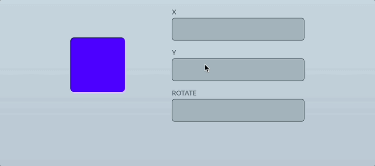
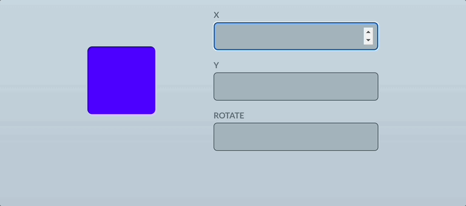
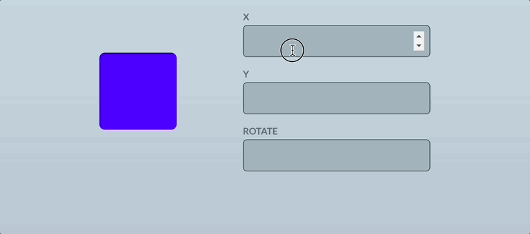

# Framer Motion 연습하기

[📌 프레이머 모션](#-프레이머-모션)<br>
<br>

## 📌 프레이머 모션

### 📖 프레이머 모션 기초

- `motion.~`을 이용해서 애니메이션을 적용
- `animate` 속성은 기본적으로 객체를 입력으로 받는데, 해당 중괄호 안에 재생할 애니메이션을 기술한다.
- `x` 가로축 이동. 위에서 설정한 x 상태값이 변화하면 가로축으로 이동한다.
  

<br>

- `transition` : 재생될 애니메이션을 설정할 때 사용한다.
  ```jsx
  import { motion } from "framer-motion";
  function App() {
    <motion.div
      id="box"
      animate={{ x: x }}
      transition={{
        duration: 0.3, //0.3초
        bounce: 0.5, // 튕김 정도 0~1 사이에서 설정
        type: "spring", // 재생될 애니메이션의 타입을 제어. spring은 기본으로 살짝 튕김을 줘서 자연스러운 느낌을 줌
      }}
    />;
  }
  ```
  

<br>

```jsx
import { motion } from "framer-motion";
function App() {
  <motion.div
    id="box"
    animate={{ x: x, y: y, rotate }}
    transition={{
      duration: 0.3, //0.3초
      bounce: 0.5, // 튕김 정도 0~1 사이에서 설정
      type: "spring", // 재생될 애니메이션의 타입을 제어. spring은 기본으로 살짝 튕김을 줘서 자연스러운 느낌을 줌
    }}
  />;
}
```


