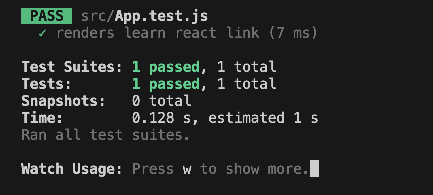
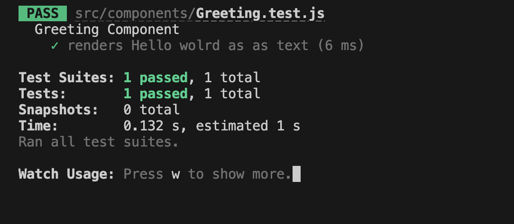
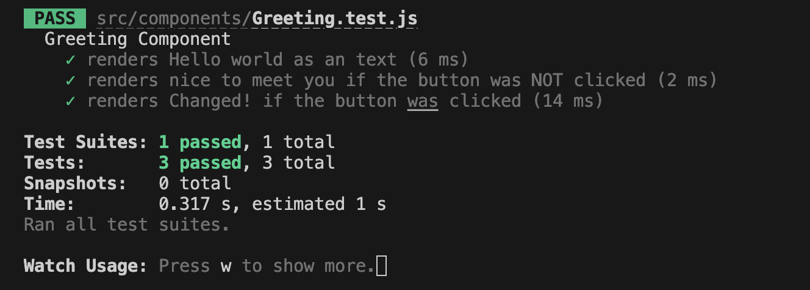
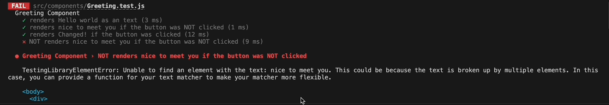
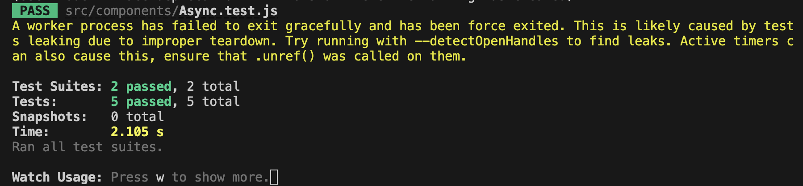

# 리액트 앱 테스트(유닛테스트)

[📌 테스트 소개](#-테스트-소개)<br>
[📌 테스트하기](#-테스트하기)<br>
<br>

## 📌 테스트 소개

- 수동적인 앱 테스팅은 오류 발생이 쉽다. 수동으로는 모든 조합과 시나리오를 테스트하기 어렵다.
- 자동화된 테스트도 해야한다. 추가적인 코드를 작성해서 해당 코드가 실행되면서 앱의 메인 코드를 테스트한다.
- 전체 앱을 자동으로 테스트하는 코드를 작성하므로 대부분의 시나리오에 대해 테스트를 할 수 있다.
- 매우 기술적이지만 모든 것을 상시적으로 테스트 할 수 있다. 수동적인 앱 테스트와 함께한다면 더 좋은 시너지를 낼 수 있다.

<br>

### 📖 다양한 종류의 테스트 이해하기

1. Unit 테스트(단위테스트) : 어플리케이션의 가장 작은 단위에 대한 테스트를 작성. 앱에서 사용하는 개별 함수들을 테스팅. 리액트 앱의 경우엔 앱의 다른 컴포넌트와 독립적으로 일부 컴포넌트를 테스팅.
   - 앱을 구성하는 모든 단위, 함수 및 컴포넌트를 테스트한다.
   - 가장 일반적이고 중요한 종류의 테스트이다.
2. Integration 테스트(통합테스트) : 여러 개의 구성요소와 조합을 테스트한다. 여러 구성요소와 함께 작동하는지를 본다.
   - 일반적으로 통합 테스트도 중요하다.
   - 단위 테스트보단 양적으로 적다.
3. End-to-End(e2e) 테스트(구간테스트) : 어플리케이션의 전체 워크플로우(시나리오)를 테스트한다.
   - 단위 및 통합 테스트가 잘 작동한다면 전체적으로 앱이 잘 동작한다는 것을 의미한다.
   - 따라서 단위테스트, 통합테스트보다는 양적으로 적다.

<br>

### 📖 테스트 대상 및 테스트 방법

- 무엇을 테스트할 것인가?

  - 앱을 구성하는 구성요소들을 테스트해야한다.
  - 작은 구성요소들을 테스트 해야한다.

- 어떻게 테스트 할 것인가?
  - 발생할 수 있는 성공및 오류 사례를 테스트한다.
  - 드물지만 가능한 시나리오와 결과도 테스트해야한다.

<br>

### 📖 기술 설정 및 관련 도구 이해하기

- 테스팅 코드를 실행하기 위한 도구가 필요하다. &rarr; 보통 jest를 사용한다.
- 리액트 앱에서는 컴포넌트를 렌더링하고 시뮬레이팅하는 방법이 필요하다. &rarr; 리액트 테스팅 라이브러리를 주로 사용한다.

<br>

## 📌 테스트하기

### 📖 첫번째 테스트 실행하기

#### 💎 App.test.js

```js
import { render, screen } from "@testing-library/react";
import App from "./App";

test("renders learn react link", () => {
  render(<App />); // App을 렌더링
  const linkElement = screen.getByText(/learn react/i); // 대소문자 상관없이 lear react가 있는지..
  expect(linkElement).toBeInTheDocument();
});
```

- 테스팅 코드를 포함하는 파일
- test 함수가 있다.

  - `test(테스트에 대한 설명 , 함수)`
    1. 첫번째 인자 : 테스트에 대한 설명으로 개발자가 설정할 수 있다. 테스트 출력에서 해당 테스트를 식별하는데 도움이 된다.
    2. 함수 : 실제 테스트와 코드를 포함한다. 테스트가 실행될 때 이 함수가 실행된다.

- 테스트 스크립트를 이용해서 미리 확인할 수 있다.
  - `npm test`
    

<br>

### 📖 첫번째 테스트 작성하기

- Arrange(준비) : 테스트하고자 하는 컴포넌트를 렌더링하길 원함. 추가적인 설정도 할 수있다.
- Act(실행) : 실제로 테스트하고자 하는 로직을 테스트 함.
- Assert(단언) : 브라우저 상에서 보이는 아웃풋을 검토. 예상과 같은지 본다.

```js
import Greeting from "./Greeting";
import { render, screen } from "@testing-library/react";
test("renders Hello wolrd as as text", () => {
  // Arrange
  render(<Greeting />); // 컴포넌트 엘리먼트 생성

  // Act
  // .. 여기선 없다.

  // Assert
  const helloWorldElement = screen.getByText("Hello world", { exact: true });
  expect(helloWorldElement).toBeInTheDocument(); // expect 함수의 결과에 matcher 함수들이있음..
});
```

- `screen` : 가상 DOM 또는 가상 화면에 엑세스할 수 있게 해주는 screen을 불러온다.
  - `get~` 함수가 에러를 발생시켜서 엘리먼터를 찾을 수 없다면 `find~` 함수가 프로미스를 반환.

<br>

### 📖 테스트 스위트(Test Suites)와 함께 테스트(Tests) 그룹화하기

#### 💎 Greeting.test.js

```js
import Greeting from "./Greeting";
import { render, screen } from "@testing-library/react";

describe("Greeting Component", () => {
  test("renders Hello wolrd as as text", () => {
    // Arrange
    render(<Greeting />); // 컴포넌트 엘리먼트 생성

    // Act
    // .. 여기선 없다.

    // Assert
    const helloWorldElement = screen.getByText("Hello world", { exact: true });
    expect(helloWorldElement).toBeInTheDocument(); // expect 함수의 결과에 matcher 함수들이있음..
  });
});
```

- 이렇게하면 하나의 suite에 하나의 test를 가진다.
- 여러개의 suite를 가질 수 있으며, suite 마다 테스트도 여러개 가질 수 있다.



<br>

### 📖 사용자 상호 작용 및 State 테스트하기

#### 💎 Greeting.js

```js
import { useState } from "react";

const Greeting = () => {
  const [changedText, setChangedText] = useState(false);

  const changeTextHandler = () => {
    setChangedText(true);
  };

  return (
    <div>
      <h2>Hello world</h2>
      {!changedText && <p>It's nice to meet you</p>}
      {changedText && <p>Changed!</p>}
      <button onClick={changeTextHandler}>Change Text</button>
    </div>
  );
};

export default Greeting;
```

#### 💎 Greeting.test.js

1. 버튼이 클릭되었을 때 예상한 대로 올바른 paragraph가 나오는지 테스트

```js
import Greeting from "./Greeting";
import userEvent from "@testing-library/user-event";
import { render, screen } from "@testing-library/react";

describe("Greeting Component", () => {
  test("renders Hello world as an text", () => {
    // Arrange
    render(<Greeting />); // 컴포넌트 엘리먼트 생성

    // Act
    // .. 여기선 없다.

    // Assert
    const helloWorldElement = screen.getByText("Hello world", { exact: true });
    expect(helloWorldElement).toBeInTheDocument(); // expect 함수의 결과에 matcher 함수들이있음..
  });

  // 버튼을 클릭하지 않았을 때 nice to meet you가 렌더링 되는지
  test("renders nice to meet you if the button was NOT clicked", () => {
    render(<Greeting />);

    const outputElement = screen.getByText("nice to meet you", {
      exact: false,
    });
    expect(outputElement).toBeInTheDocument();
  });

  // 버튼을 클릭했을 때 Changed!가 렌더링 되는지
  test("renders Changed! if the button was clicked", () => {
    // Arrange
    render(<Greeting />);

    // Act
    const buttonElement = screen.getByRole("button");
    userEvent.click(buttonElement);

    // Assert
    const outputElement = screen.getByText("Changed!");
    expect(outputElement).toBeInTheDocument();
  });
});
```

- `userEvent`는 실제 화면에서 사용자 이벤트를 작동시키도록 돕는 객체



<br>

2. 만약 코드 자체에서 뭔갈 놓쳤다면..?

#### 💎 Greeting.js

```js
import { useState } from "react";

const Greeting = () => {
  const [changedText, setChangedText] = useState(false);

  const changeTextHandler = () => {
    setChangedText(true);
  };

  return (
    <div>
      <h2>Hello world</h2>
      <p>It's nice to meet you</p>
      {changedText && <p>Changed!</p>}
      <button onClick={changeTextHandler}>Change Text</button>
    </div>
  );
};

export default Greeting;
```

- `!changedText`일때 nice to meet you가 렌더링 되도록 해야하는데 해당 조건을 넣는 것을 까먹어도 테스트는 통과가 된다..!
- 그러나 버튼을 눌렀을 때 nice to meet you 문단이 사라지고 Changed!가 나타나는지에 대한 테스트를 작성할 수도 있다!

#### 💎 Greeting.test.js

```js
import Greeting from "./Greeting";
import userEvent from "@testing-library/user-event";
import { render, screen } from "@testing-library/react";

describe("Greeting Component", () => {
  test("renders Hello world as an text", () => {
    // Arrange
    render(<Greeting />); // 컴포넌트 엘리먼트 생성

    // Act
    // .. 여기선 없다.

    // Assert
    const helloWorldElement = screen.getByText("Hello world", { exact: true });
    expect(helloWorldElement).toBeInTheDocument(); // expect 함수의 결과에 matcher 함수들이있음..
  });

  test("renders nice to meet you if the button was NOT clicked", () => {
    render(<Greeting />);

    const outputElement = screen.getByText("nice to meet you", {
      exact: false,
    });
    expect(outputElement).toBeInTheDocument();
  });

  test("renders Changed! if the button was clicked", () => {
    // Arrange
    render(<Greeting />);

    // Act
    const buttonElement = screen.getByRole("button");
    userEvent.click(buttonElement);

    // Assert
    const outputElement = screen.getByText("Changed!");
    expect(outputElement).toBeInTheDocument();
  });

  // 버튼을 클릭했을 때 nice to meet you가 보이지 않는지 테스트
  test("NOT renders nice to meet you if the button was NOT clicked", () => {
    render(<Greeting />);

    const buttonElement = screen.getByRole("button");
    userEvent.click(buttonElement);

    const outputElement = screen.queryByText("nice to meet you");
    // expect(outputElement).not.toBeInTheDocument();
    expect(outputElement).toBeNull(); //도 가능
  });
});
```

- `expect(outputElement).not.toBeInTheDocument()` 혹은 `expect(outputElement).toBeNull();`을 이용해서 확인.



<br>

### 📖 연결된 컴포넌트 테스트하기

#### 💎 Output.js

```js
const Output = (props) => {
  return <p>{props.children}</p>;
};

export default Output;
```

#### 💎 Greeting.js

```js
import { useState } from "react";
import Output from "./Output";

const Greeting = () => {
  const [changedText, setChangedText] = useState(false);

  const changeTextHandler = () => {
    setChangedText(true);
  };

  return (
    <div>
      <h2>Hello world</h2>
      {!changedText && <Output>It's nice to meet you</Output>}
      {changedText && <Output>Changed!</Output>}
      <button onClick={changeTextHandler}>Change Text</button>
    </div>
  );
};

export default Greeting;
```

#### 💎 Greeting.test.js

```js
import Greeting from "./Greeting";
import userEvent from "@testing-library/user-event";
import { render, screen } from "@testing-library/react";

describe("Greeting Component", () => {
  test("renders Hello world as an text", () => {
    // Arrange
    render(<Greeting />); // 컴포넌트 엘리먼트 생성

    // Act
    // .. 여기선 없다.

    // Assert
    const helloWorldElement = screen.getByText("Hello world", { exact: true });
    expect(helloWorldElement).toBeInTheDocument(); // expect 함수의 결과에 matcher 함수들이있음..
  });

  test("renders nice to meet you if the button was NOT clicked", () => {
    render(<Greeting />);

    const outputElement = screen.getByText("nice to meet you", {
      exact: false,
    });
    expect(outputElement).toBeInTheDocument();
  });

  test("renders Changed! if the button was clicked", () => {
    // Arrange
    render(<Greeting />);

    // Act
    const buttonElement = screen.getByRole("button");
    userEvent.click(buttonElement);

    // Assert
    const outputElement = screen.getByText("Changed!");
    expect(outputElement).toBeInTheDocument();
  });

  // 버튼을 클릭했을 때 nice to meet you가 보이지 않는지 테스트
  test("NOT renders nice to meet you if the button was NOT clicked", () => {
    render(<Greeting />);

    const buttonElement = screen.getByRole("button");
    userEvent.click(buttonElement);

    const outputElement = screen.queryByText("nice to meet you");
    // expect(outputElement).not.toBeInTheDocument();
    expect(outputElement).toBeNull(); //도 가능
  });
});
```

- `render(<Greeting />)` : 해당 컴포넌트에서 요구되는 컴포넌트 트리 전체를 렌더링하고 있음.

  - Greeting을 렌더링하면서 Output 컴포넌트같은 컴포넌트의 콘텐츠를 렌더링한다. &rarr; 통합 테스트(Integration Tests)

- Output이 더 복잡해진다면 테스트를 분리하는 것이 좋지만 여기서는 굳이 분리할 필요가 없다.

<br>

### 📖 비동기 코드 테스트하기

#### 💎 Async.js

```js
import { useEffect, useState } from "react";

const Async = () => {
  const [posts, setPosts] = useState([]);

  useEffect(() => {
    fetch("https://jsonplaceholder.typicode.com/posts")
      .then((response) => response.json())
      .then((data) => {
        setPosts(data);
      });
  }, []);

  return (
    <div>
      <ul>
        {posts.map((post) => (
          <li key={post.id}>{post.title}</li>
        ))}
      </ul>
    </div>
  );
};

export default Async;
```

#### 💎 Async.test.js

```js
import { render, screen } from "@testing-library/react";
import Async from "./Async";

describe("Async Component", () => {
  test("renders posts if request succeeds", async () => {
    render(<Async />);

    const listItemElements = await screen.findAllByRole("listitem", {}, {});
    expect(listItemElements).not.toHaveLength(0); // 빈 배열인지 아닌지 확인.
  });
});
```

- 처음엔 `getAllByRole`을 이용해서 리스트 아이템을 찾고, 빈 배열인지 아닌지 확인하려 했다.
- 그러나 Async 코드는 비동기 코드이므로 가장 초기에는 빈 배열로 세팅되어있다.

  > `getAllByRole`을 사용하면 `screen`의 아이템들을 즉시 가져온다. 따라서 프로미스를 사용하는 `findAllByRole` 이나 `find`를 이용한다.

- `findAllByRole / find`을 사용하면 프로미스를 반환한다. &rarr; 스크린을 여러 차례 실행.
  - `findAllByRole('요소', {exact.. }, {timeout...}) ` : 기본 타임아웃은 1초
  - 프로미스를 이용하므로 `async / await`을 사용한다.



<br>

### 📖 모의 작업
