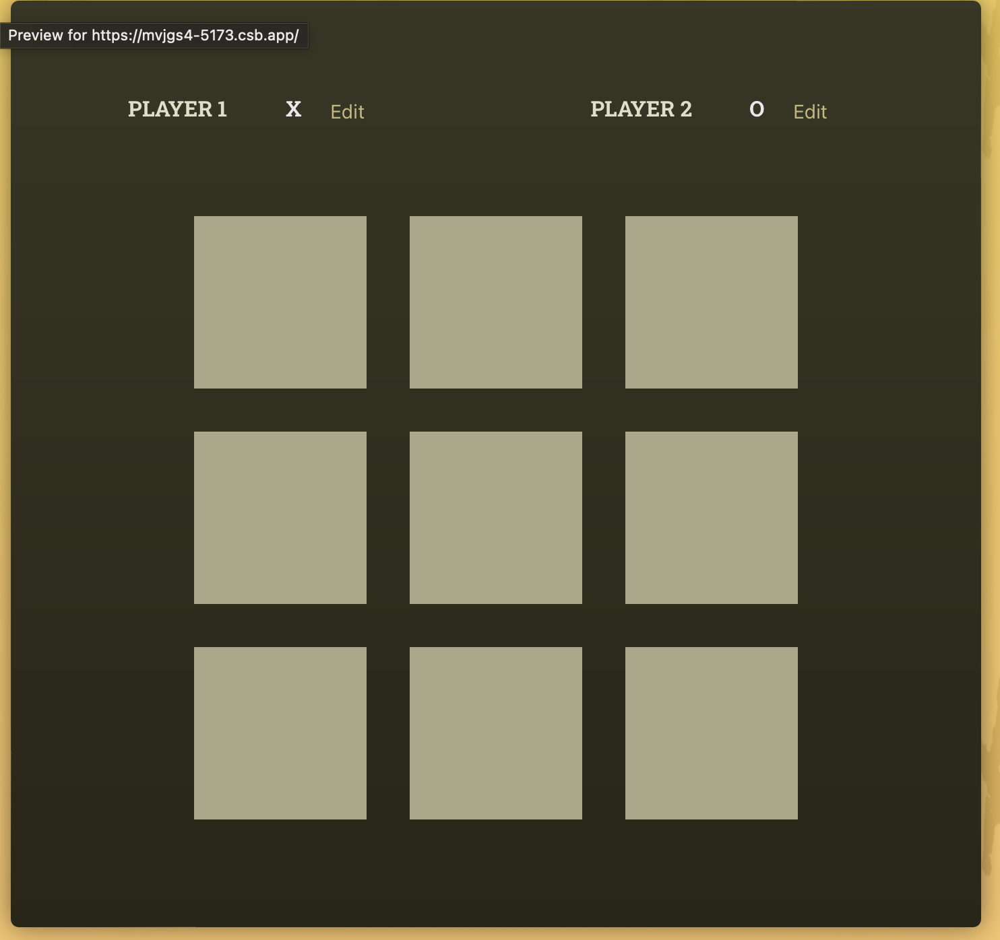
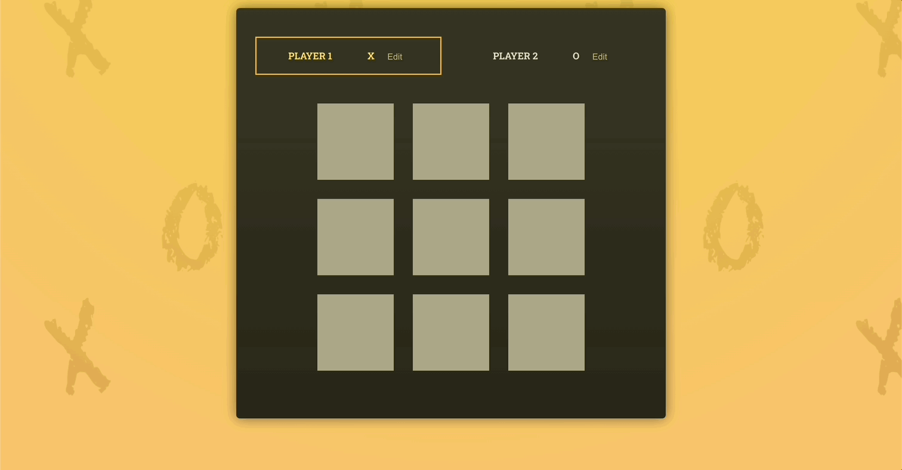

# React Essentials - Deep Dive

[📌 기타 세부사항](#-기타-세부사항)<br>
[📌 새로운 프로젝트 | Tic-Tac-Toe 게임](#-새로운-프로젝트--tic-tac-toe-게임)<br>
[📌 Player](#-player)<br>
[📌 Game Board](#-game-board)<br>
[📌 Player의 상태 업데이트](#-player의-상태-업데이트)<br>
<br>

## 📌 기타 세부사항

### 📖 모든 코드를 컴포넌트를 작성할 필요가 없다.

```html
<!-- index.html -->
<header>
  
  <h1>Tic-Tac-Toe</h1>
</header>
```

### 📖 이미지 저장소는 public/ vs. assets/

1. public/ 폴더
- 이미지를 public/ 폴더에 저장하고 index.html 또는 index.css 파일 내에 직접 참조할 수 있다.
- 어떤 파일이던지 public 폴더 안에 있다면 이는 **프로젝트 개발 서버 및 빌드 프로세스에 의해 공개적으로 제공된다.** &rarr; index.html 파일과 함께 사이트 방문자에게도 공유가 된다. 이 파일들은 브라우저 내에서 직접 방문할 수 있으며, 따라서 다른 파일에 의해 요청될 수도 있다.

2. src/assets/ 폴더
- src 또는 src/assets/ 와 같은 하위 폴더에 저장된 모든 파일은 공개적으로 제공되지 않는다. 웹사이트 방문자가 접근할 수도 없다.
- 대신 src/(및 하위폴더)에 저장된 파일은 코드 파일에서 사용할 수 있다. 코드 파일에 가져온 이미지는 빌드 프로세스에 의해 인식되어 최적화되며, 웹사이트에 제공되기 직전에 public/ 폴더에 삽입된다.

> 빌드 프로세스에 의해 처리되지 않는 이미지는 public/ 폴더를 사용해야하고 대체적으로 사용가능하다. (ex. index.html, favicon)

> 컴포넌트 내에서 사용되는 이미지는 일반적으로 src/ 폴더에 저장되야한다.

<br>

## 📌 새로운 프로젝트 | Tic-Tac-Toe 게임

## 📌 Player

### 📖 Player Component 틀 잡기

#### App.jsx
```jsx
// App.jsx
import Player from "./components/Player.jsx";

function App() {
  return (
    <main>
      <div id="game-container">
        <ol id="players">
          <Player name="Player 1" symbol="X" />
          <Player name="Player 2" symbol="O" />
        </ol>
        GAME BOARD
      </div>
      LOG
    </main>
  );
}

export default App;
```
<br>

#### Player.jsx

1. 직접 작성해본 코드
- 로직 설명
  1. Edit 버튼을 누르면 `handleClick()` 함수가 동작하여 `setIsEditing(!Editing)`을 실행 &rarr; 현재 상태의 반대로 상태를 업데이트.
  2. `buttonText`는 isEditing이 true이면 Save를, false이면 Edit을 출력.
  3. 만약 isEditing이 false이면 플레이어의 이름을 출력, 그렇지 않고 isEditing이 true이면 input 태그를 출력한다.

```jsx
// Player.jsx
import { useState } from "react";

export default function Player({ name, symbol }) {
  const [isEditing, setIsEditing] = useState(false); // 시작할 때에는 수정 중이 아니니까!

  let buttonText = isEditing ? "Save" : "Edit";
  function handleClick() {
    setIsEditing(!isEditing);
  }

  return (
    <li>
      <span className="player">
        {!isEditing && <span className="player-name">{name}</span>}
        {isEditing && <input type="text"></input>}
        <span className="playaer-symbol">{symbol}</span>
      </span>
      <button onClick={() => handleClick()}>{buttonText}</button>
    </li>
  );
}
```
<br>

2. 강사 코드
- 로직 설명
  1. Edit 버튼을 누르면 `handleEditClick` 함수가 실행되고 `setIsEditing(true)`가 실행되면서 헤당 Player 컴포넌트가 재실행된다.
  2. `playerName`을 변수로 설정하여 기본값은 플레이어의 이름을 출력한다.
  3. 만약 `isEdting`이 true이면 playerName을 input으로 업데이트한다.

```jsx
import { useState } from "react";

export default function Player({ name, symbol }) {
  const [isEditing, setIsEditing] = useState(false); // 시작할 때에는 수정 중이 아니니까!

  function handleEditClick() {
    setIsEditing(true);
  }

  let playerName = <span className="player-name">{name}</span>;
  if (isEditing) {
    playerName = <input type="text" required></input>;
  }

  return (
    <li>
      <span className="player">
        {playerName}
        <span className="playaer-symbol">{symbol}</span>
      </span>
      <button onClick={handleEditClick}>Edit</button>
    </li>
  );
}
```

<br>

### 📖 컴포넌트 인스턴스의 분리된 동작


위에서 코드를 작성하면 사진처럼 동작을 한다.
- 컴포넌트를 한 번 혹은 여러 번 사용할 때마다 리액트를 새로운 인스턴스(instance)를 생성한다.
- 두 플레이어 모두 App.jsx에서 동일한 플레이어 컴포넌트를 사용하지만 완전히 따로 동작한다는 의미이다.
> 즉, 완전히 분리된 인스턴스가 각각 생성되어 동일한 로직을 사용할지라도 사용하는 위치가 따로 분리된다.

<br>

### 📖 조건적 콘텐츠 & State(상태) 업데이트를 위한 차선책

```jsx
import { useState } from "react";

export default function Player({ name, symbol }) {
  const [isEditing, setIsEditing] = useState(false); // 시작할 때에는 수정 중이 아니니까!

  function handleEditClick() {
    setIsEditing(!isEditing);
    // setIsEditing(isEditing ? false : true); 와 동일한 코드
  }

  // let btnCaption = 'Edit'
  let playerName = <span className="player-name">{name}</span>;
  if (isEditing) {
    playerName = <input type="text" required value={name}></input>;
    // btnCaption = 'Save';
  }

  return (
    <li>
      <span className="player">
        {playerName}
        <span className="playaer-symbol">{symbol}</span>
      </span>
      <button onClick={handleEditClick}>{isEditing ? "Save" : "Edit"}</button>
    </li>
  );
}
```
- 이렇게 코드를 작성하면 `{playerName}`을 제외한 거의 모든 부분이 내가 처음에 작성한 코드와 비슷하다.

<br>

### 📖 옛 State(상태)를 기반으로 올바르게 상태 업데이트하기

- 만약 상태를 이전 값에 기반하여 변경하는 경우, 상태 업데이트 함수로 새로운 함수를 보내야 한다.
- `setIsEditing(()=>{})`에서 전달하는 함수를 리액트가 호출하여 자동적으로 현재 상태값을 가지게 되기 때문에 이런 식으로 함수를 이용한다.(즉, 상태 변경 전의 값이 입력되므로)

```jsx
// 이전
function handleEditClick() {
  setIsEditing(!isEditing);
}

// 이후
function handleEditClick() {
  setIsEditing((editing) => !editing);
}
```
- 이전 코드의 문제점 : 해당 작업을 수행하는 리액트가 상태에 대한 변화의 스케줄을 조율한다. 즉, 상태 변경이 즉각적으로 수행되는 것이 아니라 리액트가 미래에 수행하고자 상태 변경 스케줄을 조율하는 것이기 때문이다.
- 이후 코드로 작성하면, 예정된 변화가 리액트에 의해 수정 상태에서 자동으로 가장 최신 버전의 상태값을 가져오는데 해당 시점에서는 예정된 변경사항이 이미 실행된 때이다. 즉, 약간의 시간차를 둬서 함수를 실행한다.

<br>

### 📖 사용자 입력 & 양방향 바인딩

- player 1 의 이름을 수정하려고 해도 작성이 안된다. 그 이유는 다음과 같다.
```jsx
// Player.jsx
 if (isEditing) {
    playerName = <input type="text" required value={name}></input>;
  }
```
- `isEditing===true`일 때, playerName을 업데이트 하려고 하는데, 이때 `value={name}`을 사용했기 때문에 변경하려는 내용을 계속해서 덮어쓰게 된다.
- 특수한 기본값 속성(`defaultValue={name}`)을 설정하면 해당 문제가 해결된다. &rarr; 덮어쓰지 않도록 함.
- 그러나 우리는 다른 방법을 사용할 것! &rarr; 또다른 State를 사용하여 값이 변경될 때마다 컴포넌트 재실행하여 업데이트 되도록 함.

<br>

- 사용자가 입력 필드에 문자를 입력할 때마다 change 이벤트가 발생하여 함수가 실행되도록 한다.

```jsx
// Player.jsx

import { useState } from "react";

export default function Player({ initialName, symbol }) {
  const [playerName, setPlayerName] = useState(initialName);

  function handleChange(event) {
    setPlayerName(event.target.value);
  }

  let editablePlayerName = <span className="player-name">{playerName}</span>;
  if (isEditing) {
    editablePlayerName = (
      <input
        type="text"
        required
        defaultValue={playerName}
        onChange={handleChange}
      ></input>
    );
  }

  return (
    <li>
      <span className="player">
        {editablePlayerName}
      </span>
    </li>
  );
}
```
- 입력값의 변화에 반응하고 변경된 값을 다시 입력값에 전달하는 방식을 양방향 바인딩이라고 한다.
- `onChange={handleChange}`의 입력값(`event`)에서 값(`event.target.value`)을 빼내어 해당값을 다른 값(`value={playerName}`)으로 다시 전달한다.

🔗 [레파지토리에서 해당 코드 보기](https://github.com/Imshyeon/Develop_Study/blob/f937afb4127c906a1b1d7475e546b21318bc7a55/React/Complete-React/4_React-Essentials-Deep-Dive-2/src/components/Player.jsx)

<br>

## 📌 Game Board

### 📖 다차원 리스트 렌더링

#### GameBoard.jsx
```jsx
const initialGameBoard = [
  [null, null, null],
  [null, null, null],
  [null, null, null],
];

export default function GameBoard() {
  return (
    <ol id="game-board">
      {initialGameBoard.map((row, rowIndex) => (
        <li key={rowIndex}>
          <ol>
            {row.map((playerSymbol, colIndex) => (
              <li key={colIndex}>
                <button>{playerSymbol}</button>
              </li>
            ))}
          </ol>
        </li>
      ))}
    </ol>
  );
}
```
<br>

#### App.jsx
```jsx
import Player from "./components/Player.jsx";
import GameBoard from "./components/GameBoard.jsx";

function App() {
  return (
    <main>
      <div id="game-container">
        <ol id="players">
          <Player initialName="Player 1" symbol="X" />
          <Player initialName="Player 2" symbol="O" />
        </ol>
        <GameBoard />
      </div>
      LOG
    </main>
  );
}

export default App;
```
<br>

#### 결과



<br>

### 📖 불변의 객체 State(상태)로 업데이트하기

- 상태가 객체나 배열이라면 해당 상태를 업데이트할 떄 변경 불가능하게 하는 것이 좋다.
> 즉, 이전 상태를 하나 복제해서 새 객체 또는 배열로 저장해놓고 이 복제된 버전을 수정하는 방식을 채용하는 것이 좋다.
- 만약 상태가 객체 혹은 배열이라면 이는 자바스크립트 내의 참조값이고, 만약 바로 저장을 한다면 메모리 속의 기존 값을 바로 변경하게 된다. 이는 리액트의 상태 변경 스케줄보다 더 빨리 실행될 수 있다. &rarr; 버그나 부작용 발생 가능성 있음.

#### GameBoard.jsx
```jsx
import { useState } from "react";

const initialGameBoard = [
  [null, null, null],
  [null, null, null],
  [null, null, null],
];

export default function GameBoard() {
  const [gameBoard, setGameBoard] = useState(initialGameBoard);

  function handleSelectSquare(rowIndex, colIndex) {
    setGameBoard((prevGameBoard) => {
      const updatedBoard = [
        ...prevGameBoard.map((innerArray) => [...innerArray]),
      ];
      updatedBoard[rowIndex][colIndex] = "X";
      return updatedBoard;
    });
  }

  return (
    <ol id="game-board">
      {gameBoard.map((row, rowIndex) => (
        <li key={rowIndex}>
          <ol>
            {row.map((playerSymbol, colIndex) => (
              <li key={colIndex}>
                <button onClick={() => handleSelectSquare(rowIndex, colIndex)}>
                  {playerSymbol}
                </button>
              </li>
            ))}
          </ol>
        </li>
      ))}
    </ol>
  );
}
```

- state 등록 시, 가장 초기값은 initialGameBoard가 된다.
- 버튼이 클릭될 때마다 `handleSelectSquare`함수가 실행되고 해당 함수는 어떤 버튼이 눌렸는지 정보를 받아야하기 때문에, map 함수를 통해 얻은 `rowIndex, colIndex`를 전달한다.
- `handleSelectSquare` : 게임보드의 상태를 업데이트하는데 이전의 상태를 저장하면서 계속 업데이트를 하기 때문에 함수형 사용.
- 이때, 상태의 초기값이 배열이기 때문에 깊은 복사를 통해 이전 게임보드의 상태를 저장해 놓는다. (`const updatedBoard = ...`) 

<br>

### 📖 State(상태) 끌어올리기

🔗 [레파지토리에서 코드 보기](https://github.com/Imshyeon/Develop_Study/tree/2d861fc235002633fd59800fc9812d8dd95cada0/React/Complete-React/4_React-Essentials-Deep-Dive-2)

- App 컴포넌트에서는 어떤 플레이어가 진행 중인지 해당 정보를 두 컴포넌트 모두에게 속성(prop)을 통해 보낼 수 있다.

#### App.jsx

```jsx
import { useState } from "react";

function App() {
  const [activePlayer, setActivePlayer] = useState("X");

  function handleSelectSquare() {
    setActivePlayer((curActivePlayer) => (curActivePlayer === "X" ? "O" : "X"));
  }

  return (
    <main>
      <div id="game-container">
        <ol id="players" className="highlight-player">
          <Player
            initialName="Player 1"
            symbol="X"
            isActive={activePlayer === "X"}
          />
          <Player
            initialName="Player 2"
            symbol="O"
            isActive={activePlayer === "O"}
          />
        </ol>
        <GameBoard
          onSelectSquare={handleSelectSquare}
          activePlayerSymbol={activePlayer}
        />
      </div>
    </main>
  );
}
```
<br>

#### Player.jsx

```jsx
export default function Player({ initialName, symbol, isActive }) {
    return (
    <li className={isActive ? "active" : undefined}>
    </li>
  );
}
```
<br>

#### GameBoard.jsx

```jsx
export default function GameBoard({ onSelectSquare, activePlayerSymbol }) {
    function handleSelectSquare(rowIndex, colIndex) {
    setGameBoard((prevGameBoard) => {
      const updatedBoard = [
        ...prevGameBoard.map((innerArray) => [...innerArray]),
      ];
      updatedBoard[rowIndex][colIndex] = activePlayerSymbol;  // App에서 받아온 activePlayerSymbol
      return updatedBoard;
    });

    onSelectSquare(); // App에서 받아온 함수 실행
  }
}
```

- 이렇게 코드를 작성하면 기호가 O, X인 플레이어가 번갈아가면서 버튼을 클릭할 수 있게 된다.
- 각 플레이어가 선택한 버튼에 그들의 기호가 표시된다.

<br>

### 📖 교차 State 방지하기 & 계산된 값 권장 및 불필요한 State 관리

- Log를 출력하기 위해선 다음의 요소가 필요하다.
  1. 게임을 진행한 순서
  2. 어떤 사용자가 어떤 버튼을 눌렀는지에 대한 정보

- 두번째 요소의 경우 GameBoard.jsx의 State에서 이미 다루었다. 그러나 게임 진행 순서에 대해서는 다루지 않았다. 이를 위해서 App에서 State(상태) 끌어올리기를 한다면 비슷한 정보를 가지고 State를 두 번 쓴 경우가 되므로, 이는 리액트에서 추천하는 것이 아니다.

#### GameBoard.jsx 수정

```jsx
const initialGameBoard = [
  [null, null, null],
  [null, null, null],
  [null, null, null],
];

export default function GameBoard({ onSelectSquare }) {
  //   const [gameBoard, setGameBoard] = useState(initialGameBoard);

  //   function handleSelectSquare(rowIndex, colIndex) {
  //     setGameBoard((prevGameBoard) => {
  //       const updatedBoard = [
  //         ...prevGameBoard.map((innerArray) => [...innerArray]),
  //       ];
  //       updatedBoard[rowIndex][colIndex] = activePlayerSymbol;
  //       return updatedBoard;
  //     });

  //     onSelectSquare();
  //   }

  return (
    <ol id="game-board">
      {/* gameBoard.map()~는 향후 수정할 예정 */} 
      {gameBoard.map((row, rowIndex) => (
        <li key={rowIndex}>
          <ol>
            {row.map((playerSymbol, colIndex) => (
              <li key={colIndex}>
                <button onClick={onSelectSquare}>{playerSymbol}</button>
              </li>
            ))}
          </ol>
        </li>
      ))}
    </ol>
  );
}
```
<br>

#### App.jsx

```jsx
import { useState } from "react";

function App() {
  const [gameTurns, setGameTurns] = useState([]); // 또다른 State 끌어올리기.
  const [activePlayer, setActivePlayer] = useState("X");

  function handleSelectSquare(rowIndex, colIndex) {
    setActivePlayer((curActivePlayer) => (curActivePlayer === "X" ? "O" : "X"));
    setGameTurns((prevTurns) => {
      let currentPlayer = "X"; // 초기화
      if (prevTurns.length > 0 && prevTurns[0].player === "X") {
        currentPlayer = "O"; // 기호가 O인 플레이어가 게임을 할 차례. 가장 최근에 클릭한 버튼은 X 플레이어의 차례였기 때문.
      }
      const updatedTurns = [
        { square: { row: rowIndex, col: colIndex }, player: currentPlayer },
        ...prevTurns,
      ];
      return updatedTurns;
    });
  }
}
```

<br>

### 📖 Props(속성)에서 State(상태) 파생하기

#### App.jsx

```jsx
function App() {
  return(
    <GameBoard onSelectSquare={handleSelectSquare} turns={gameTurns}/> // turns라는 속성값을 전달
  )
}
```
<br>

#### GameBoard.jsx

```jsx
const initialGameBoard = [
  [null, null, null],
  [null, null, null],
  [null, null, null],
];

export default function GameBoard({ onSelectSquare, turns }) { // App에서부터 turns 속성값을 받아옴.
  let gameBoard = initialGameBoard; // 초기값 설정.

  // 진행된 turns이 있다면 gameBoard을 오버라이드 할 것이다.
  // 반대로 진행된 것이 없다면 gameBoard = initialGameBoard일 것.
  for (const turn of turns) {// turns가 있을때만 수행할 반복문
    const { square, player } = turn;
    const { row, col } = square;
    gameBoard[row][col] = player;
  }
  // ==== 이렇게하면 파생된 상태를 생성하게 되는 것임 ====

  return (
    <ol id="game-board">
      {gameBoard.map((row, rowIndex) => (
        <li key={rowIndex}>
          <ol>
            {row.map((playerSymbol, colIndex) => (
              <li key={colIndex}>
                <button onClick={() => onSelectSquare(rowIndex, colIndex)}>
                {/* App에서 handleSelectSquare() 함수를 받아오는데 이 함수는 rowIndex, colIndex를 필요로 함. */}
                  {playerSymbol}
                </button>
              </li>
            ))}
          </ol>
        </li>
      ))}
    </ol>
  );
}

```

- 제어하는 상태의 수는 최소화하되, 각 상태에서 가능한 많은 정보와 많은 값을 파생.
- 이렇게 코드를 작성하면 gameTurns에 대한 상태로 LOG와 GAME BOARD를 같이 진행할 수 있게 된다.
- 결과는 이전처럼 플레이어가 번갈아가면서 버튼을 선택할 수 있게 됨. + gameTurns로 로그를 작성할 수 있게 될 것이다.

<br>

### 📖 컴포넌트 간의 State(상태) 공유

```jsx
// App.jsx
<Log turns={gameTurns} />

// Lob.jsx
export default function Log({ turns }) {
  return (
    <ol id="log">
      {turns.map((turn) => {
        return (
          <li key={`${turn.square.row},${turn.square.col}`}>
            {turn.player} 플레이어가 {turn.square.row}, {turn.square.col}을
            선택했습니다.
          </li>
        );
      })}
    </ol>
  );
}
```

- 이제 gameTurns 상태 하나로 Log와 GameBoard를 모두 컨트롤할 수 있게 되었다.
<br>

#### 결과


<br>

## 📌 Player의 상태 업데이트

### 📖 상태 관리 간소화 및 불필요한 상태 분별

#### 수정 전의 App.jsx
```jsx
import { useState } from "react";

import Player from "./components/Player.jsx";
import GameBoard from "./components/GameBoard.jsx";
import Log from "./components/Log.jsx";

function App() {
  const [gameTurns, setGameTurns] = useState([]); // 또다른 State 끌어올리기.
  const [activePlayer, setActivePlayer] = useState("X");

  function handleSelectSquare(rowIndex, colIndex) {
    setActivePlayer((curActivePlayer) => (curActivePlayer === "X" ? "O" : "X"));
    setGameTurns((prevTurns) => {
      let currentPlayer = "X";
      if (prevTurns.length > 0 && prevTurns[0].player === "X") {
        currentPlayer = "O"; // 기호가 O인 플레이어가 게임을 할 차례. 가장 최근에 클릭한 버튼은 X 플레이어의 차례였기 때문.
      }
      const updatedTurns = [
        { square: { row: rowIndex, col: colIndex }, player: currentPlayer },
        ...prevTurns,
      ];
      console.log(updatedTurns);
      return updatedTurns;
    });
  }

  return (
    <main>
      <div id="game-container">
        <ol id="players" className="highlight-player">
          <Player
            initialName="Player 1"
            symbol="X"
            isActive={activePlayer === "X"}
          />
          <Player
            initialName="Player 2"
            symbol="O"
            isActive={activePlayer === "O"}
          />
        </ol>
        <GameBoard onSelectSquare={handleSelectSquare} turns={gameTurns} />
      </div>
      <Log turns={gameTurns} />
    </main>
  );
}

export default App;
```
- 현재 App.jsx를 보면, gameTurns 상태로 어떤 플레이어가 선택하는지 이미 정보를 알고 있다. 따라서 activePlayer 상태를 다음과 같이 수정할 수 있다.
- activePlayer 상태를 따로 만들지 않아도 파생된 상태를 만들 수 있다!
<br>

#### 수정 후 App.jsx

```jsx
function deriveActivePlayer(gameTurns) {
  let currentPlayer = "X";
  if (gameTurns.length > 0 && gameTurns[0].player === "X") {
    currentPlayer = "O"; // 기호가 O인 플레이어가 게임을 할 차례. 가장 최근에 클릭한 버튼은 X 플레이어의 차례였기 때문.
  }
  return currentPlayer;
}

function App() {
  const [gameTurns, setGameTurns] = useState([]); // 또다른 State 끌어올리기.

  const activePlayer = deriveActivePlayer(gameTurns);

  function handleSelectSquare(rowIndex, colIndex) {
    setGameTurns((prevTurns) => {
      const currentPlayer = deriveActivePlayer(prevTurns);

      const updatedTurns = [
        { square: { row: rowIndex, col: colIndex }, player: currentPlayer },
        ...prevTurns,
      ];
      console.log(updatedTurns);
      return updatedTurns;
    });
  }
}
```
- 이처럼 State는 최대한 적게 사용하고, 되도록이면 파생 상태로 사용하는 것이 좋다!