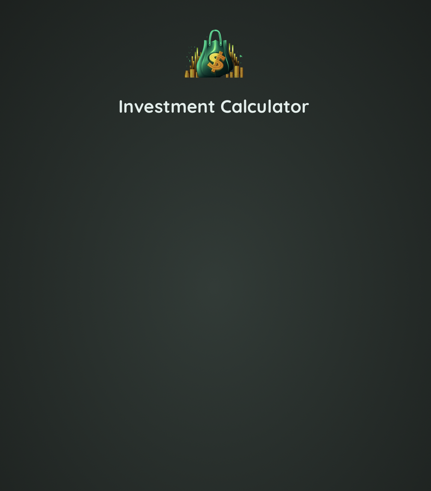
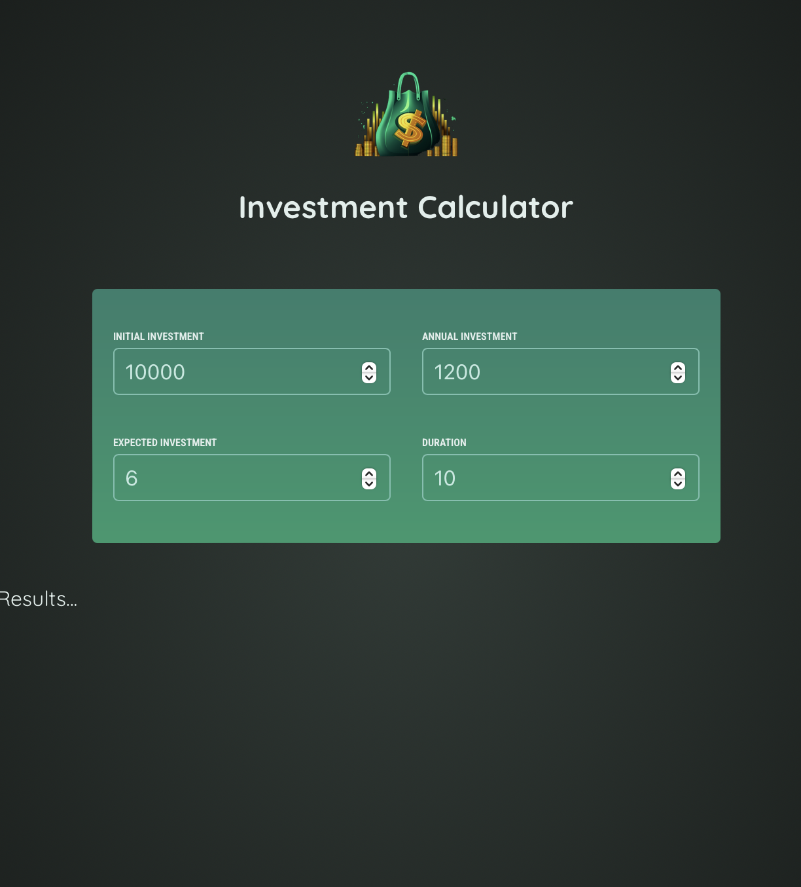
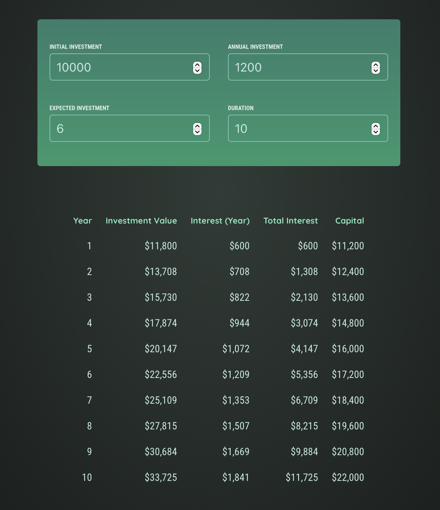
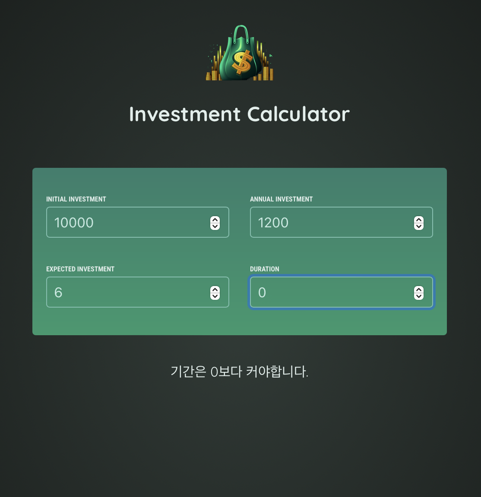

# 리액트 연습 프로젝트

[📌 Header](#-header)<br>
[📌 User Input(사용자 입력) 컴포넌트](#-user-input사용자-입력-컴포넌트)<br>
[📌 State(상태) 끌어올리기](#-state상태-끌어올리기)<br>
[📌 Results를 위한 데이터 도출하기](#-results를-위한-데이터-도출하기)<br>
[📌 조건적 콘텐츠 출력](#📌-조건적-콘텐츠-출력)<br>
<br>

## 📌 Header

#### Header.jsx

```jsx
import logo from "../asset/investment-calculator-logo.png";

export default function Header() {
  return (
    <header id="header">
      
      <h1>Investment Calculator</h1>
    </header>
  );
}
```
<br>

#### App.jsx

```jsx
import Header from "./components/Header.jsx";
function App() {
  return <Header />;
}

export default App;
```
<br>

#### 결과



<br>

## 📌 User Input(사용자 입력) 컴포넌트

#### UserInput.jsx

```jsx
export default function UserInput() {
  return (
    <section id="user-input">
      <div className="input-group">
        <p>
          <label htmlFor="initial-investment">Initial Investment</label>
          <input type="number" id="initial-investment" required />
        </p>
        <p>
          <label htmlFor="annual-investment">Annual Investment</label>
          <input type="number" id="annual-investment" required />
        </p>
      </div>
      <div className="input-group">
        <p>
          <label htmlFor="expected-investment">Expected Investment</label>
          <input type="number" id="expected-investment" required />
        </p>
        <p>
          <label htmlFor="duration">Duration</label>
          <input type="number" id="duration" required />
        </p>
      </div>
    </section>
  );
}
```
<br>

### 📖 이벤트 핸들링 & 양방향 바인딩

- 유저가 입력한 값을 얻고 저장하기 위해서는 해당 컴포넌트(UserInput)에서 몇가지 상태를 관리해야한다.

#### 초기 상태 입력

```jsx
import { useState } from "react";

export default function UserInput() {
  const [userInput, setUserInput] = useState({
    initialInvestment: 10000,   
    annualInvestment: 1200,
    expectedInvestment: 6,
    duration: 10,
  });
}
```
<br>

#### 값이 변경될 때마다 작동될 함수 = 상태 업데이트 함수

- 내가 직접 작성했을 때는 이부분을 놓쳤다. 이전 상태를 받아와야한다는 것을 알았지만, `...prevUserInput, [inputIdentifier]:newValue` 부분에 대한 코드 작성에 익숙치 않아서 해당 부분을 떠올리지 못했다.

```jsx
function handleInputChange(inputIdentifier, newValue) {
    setUserInput((prevUserInput) => {
      return {
        ...prevUserInput,
        [inputIdentifier]: newValue,
      };
    });
  }
```
<br>

### UserInput 최종 코드

```jsx
import { useState } from "react";

export default function UserInput() {
  const [userInput, setUserInput] = useState({
    initialInvestment: 10000,
    annualInvestment: 1200,
    expectedReturn: 6,
    duration: 10,
  });

  function handleInputChange(inputIdentifier, newValue) {
    setUserInput((prevUserInput) => {
      return {
        ...prevUserInput,
        [inputIdentifier]: newValue,
      };
    });
  }

  return (
    <section id="user-input">
      <div className="input-group">
        <p>
          <label htmlFor="initial-investment">Initial Investment</label>
          <input
            type="number"
            id="initial-investment"
            required
            value={userInput.initialInvestment}
            onChange={(e) =>
              handleInputChange("initialInvestment", +e.target.value)
            }
          />
        </p>
        <p>
          <label htmlFor="annual-investment">Annual Investment</label>
          <input
            type="number"
            id="annual-investment"
            required
            value={userInput.annualInvestment}
            onChange={(e) =>
              handleInputChange("annualInvestment", +e.target.value)
            }
          />
        </p>
      </div>
      <div className="input-group">
        <p>
          <label htmlFor="expected-investment">Expected Investment</label>
          <input
            type="number"
            id="expected-investment"
            required
            value={userInput.expectedReturn}
            onChange={(e) =>
              handleInputChange("expectedReturn", +e.target.value)
            }
          />
        </p>
        <p>
          <label htmlFor="duration">Duration</label>
          <input
            type="number"
            id="duration"
            required
            value={userInput.duration}
            onChange={(e) => handleInputChange("duration", +e.target.value)}
          />
        </p>
      </div>
    </section>
  );
}
```

- 강사는 UserInput.jsx에 모든 label, input들을 넣었다. 그리고 해당 input에 `value`와 `onChange` props를 추가했다.
- `value={userInput.~}`를 이용해서 업데이트된 상태를 반영할 수 있도록 했다.
- `onChange`에는 직접 inputIdentifier를 작성하고 화살표 함수를 이용해 이벤트 타겟의 값을 직접 전달했다.
<br>

#### App.jsx

```jsx
import Header from "./components/Header.jsx";
import UserInput from "./components/UserInput.jsx";

function App() {
  return (
    <>
      <Header />
      <UserInput />
    </>
  );
}

export default App;
```

<br>

## 📌 State(상태) 끌어올리기

### 📖 calculateInvestmentResults 함수 이용하기

- 해당 함수는 result 테이블에 출력해야하는 값을 리턴하므로 App.jsx에서 사용해야할다.
- 그러기 위해선 UserInput.jsx에서 작성한 상태를 끌어올려야한다.

#### 우선, Result.jsx를 작성한다.

```jsx
export default function Results({ userInput }) {
  console.log(userInput)
  return <p>Results...</p>;
}
// 우선 정말 간단하게 틀만 잡는다.
```
<br>

#### App.jsx로 상태 끌어올리기

```jsx
// App.jsx
import { useState } from "react"; // 상태 끌어올리기
import Header from "./components/Header.jsx";
import UserInput from "./components/UserInput.jsx";
import Results from "./components/Result.jsx";

function App() {
  // 상태 끌어올리기 - 상태 정의
  const [userInput, setUserInput] = useState({
    initialInvestment: 10000,
    annualInvestment: 1200,
    expectedReturn: 6,
    duration: 10,
  });

  // 상태 끌어올리기 - 상태 업데이트 함수
  function handleInputChange(inputIdentifier, newValue) {
    setUserInput((prevUserInput) => {
      return {
        ...prevUserInput,
        [inputIdentifier]: newValue,
      };
    });
  }

  return (
    <>
      <Header />
      {/* 상태 끌어올리기 - 상태 업데이트 함수, 상태를 UserInput에게 전달.*/}
      <UserInput onChange={handleInputChange} userInput={userInput} />
      {/* 상태 끌어올리기 - userInput을 통해서 결과를 계산 및 출력 */}
      <Results userInput={userInput}/>
    </>
  );
}

export default App;
```
<br>

#### UserInput.jsx

```jsx
// 상태 끌어올리기 - App으로부터 받은 onChange함수와 userInput 받아오기
export default function UserInput({ onChange, userInput }) {
  return (
    <section id="user-input">
      <div className="input-group">
        <p>
          <label htmlFor="initial-investment">Initial Investment</label>
          <input
            type="number"
            id="initial-investment"
            required
            value={userInput.initialInvestment}
            // onChange("initialInvestment", +e.target.value)로 함으로써 App에서 정의된 상태 업데이트 함수 동작
            onChange={(e) => onChange("initialInvestment", +e.target.value)}
          />
        </p>
        <p>
          <label htmlFor="annual-investment">Annual Investment</label>
          <input
            type="number"
            id="annual-investment"
            required
            value={userInput.annualInvestment}
            onChange={(e) => onChange("annualInvestment", +e.target.value)}
          />
        </p>
      </div>
      <div className="input-group">
        <p>
          <label htmlFor="expected-investment">Expected Investment</label>
          <input
            type="number"
            id="expected-investment"
            required
            value={userInput.expectedReturn}
            onChange={(e) => onChange("expectedReturn", +e.target.value)}
          />
        </p>
        <p>
          <label htmlFor="duration">Duration</label>
          <input
            type="number"
            id="duration"
            required
            value={userInput.duration}
            onChange={(e) => onChange("duration", +e.target.value)}
          />
        </p>
      </div>
    </section>
  );
}
```
<br>

#### 결과



<br>

## 📌 Results를 위한 데이터 도출하기

#### Result.jsx

```jsx
import { calculateInvestmentResults, formatter } from "../util/investment.js";

export default function Results({ userInput }) {
  // App으로부터 받아온 userInput을 가지고 계산 -> resultsData 배열 받아옴
  const resultsData = calculateInvestmentResults(userInput);
  // 초기 투자 금액 계산.
  const initialInvestment =
    resultsData[0].valueEndOfYear -
    resultsData[0].interest -
    resultsData[0].annualInvestment;

  return (
    <table id="result">
      <thead>
        <tr>
          <th>Year</th>
          <th>Investment Value</th>
          <th>Interest (Year)</th>
          <th>Total Interest</th>
          <th>Capital</th>
        </tr>
      </thead>
      <tbody>
        {/* resultsData 배열을 가지고 map함수 -> 배열 요소 하나씩 계산 후 출력 */}
        {resultsData.map((yearData) => {
          // 총 이자.
          const totalInterest =
            yearData.valueEndOfYear -
            yearData.annualInvestment * yearData.year -
            initialInvestment;
          // 투자한 총 금액
          const totalAmountInvested = yearData.valueEndOfYear - totalInterest;

          return (
            <tr key={yearData.year}>
              <td>{yearData.year}</td>
              <td>{formatter.format(yearData.valueEndOfYear)}</td>
              <td>{formatter.format(yearData.interest)}</td>
              <td>{formatter.format(totalInterest)}</td>
              <td>{formatter.format(totalAmountInvested)}</td>
            </tr>
          );
        })}
      </tbody>
    </table>
  );
}
```

#### 결과



<br>

## 📌 조건적 콘텐츠 출력

- 오류 메시지 출력하기

#### App.jsx

```jsx
function App() {
  // 조건적 콘텐츠 - 에러메시지 출력 (duration >= 1 이어야 함)
  const inputIsValid = userInput.duration >= 1;

  return (
    <>
    ...
      {/* 조건적 콘텐츠 출력 */}
      {!inputIsValid && <p className="center">기간은 0보다 커야합니다.</p>}
      {inputIsValid && <Results userInput={userInput} />}
    </>
  );
}
```
<br>

#### 결과

