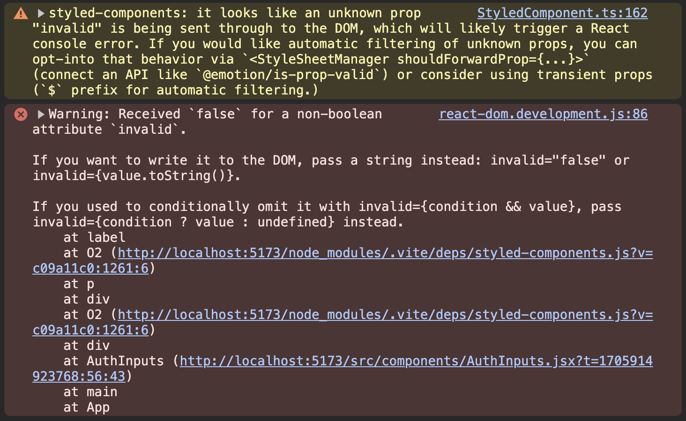

# Styling React Apps

[📌 바닐라 CSS 사용하기](#-바닐라-css-사용하기)<br>
[📌 Styled Components](#-styled-components)<br>
[📌 Tailwind CSS](#-tailwind-css)<br>
<br>

## 📌 바닐라 CSS 사용하기

### 📖 CSS 코드 여러 파일로 분리하기

1. `index.css`에서 Header와 관련된 코드를 따로 `Header.css`에 옮김
2. `Header.jsx`에서 `import './Header.css'`를 통해 CSS 파일 적용
   <br>

### 📖 바닐라 CSS로 리액트 앱 스타일링하기의 장단점

#### 장점

1. 바닐라 CSS를 단순히 CSS 파일에 CSS 규칙을 추가함으로써 그리고 그 CSS 파일을 개발자의 jsx 파일로 import 함으로써 사용.
2. 디자이너나 다른 개발자와 협업을 할 때 해당 파일을 전달하고/받을 수 있다. &rarr; 편리하게 작업 가능.
3. 특별한 관례가 없다.

#### 단점

1. CSS을 알거나 그것을 할 수 있는 동료가 필요하다.
2. 바닐라 CSS코드를 적을 때 컴포넌트로 스코핑 되어있지 않다. 즉, 다른 컴포넌트 간에 스타일 충돌 발생 가능성이 있다.

> CSS를 여러 개의 파일로 나누고 특정 컴포넌트의 파일에 import 해도 해당 파일의 CSS 규칙들은 그들이 속하는 컴포넌트에 스코핑되지 않는다.

<br>

### 📖 Inline(인라인) 스타일로 리액트 앱 스타일링하기

- 만약 CSS를 스코핑하고 싶다면? &rarr; 인라인 스타일로 바꾸기(솔루션 1)
- Inline Style : css파일에서 css 스타일을 정의하는 것 대신에 jsx로 직접 적용한다.

```jsx
<p
  style={{
    color: "red",
    textAlign: "left",
  }}
>
  Styling..
</p>
```

### 📖 Inline 스타일의 장단점

#### 장점

1. 쉽게 추가가 가능하고 개발자가 인라인 스타일로 더하는 것이 단지 개발자가 추가하는 요소에만 영향을 미치고 다른 요소에는 적용되지 않는다.
2. 동적(조건부적)으로 스타일링하기 쉽다.

#### 단점

1. CSS를 알아야한다.
2. 모든 요소를 개별적으로 스타일해야 한다.
3. css, jsx코드에 구분이 없다.

<br>

### 📖 동적 및 조건적 Inline 스타일

```jsx
// AuthInputs.jsx
const emailNotValid = submitted && !enteredEmail.includes("@");

// 방법 1. 동적
return (
          <input
            type="email"
            style={{
                backgroundColor: emailNotvalid? '#fed2d2' : '#d1d5db'
            }}
            onChange={(event) => handleInputChange('email', event.target.value)}
          />
)

// 방법 2-1. 조건부적
return (
          <input
            type="email"
            {/* 조건부 클래스를 적용하지 않으려면 삼항연산자를 사용하고 클래스 이름으로 undefined를 추가한다. */}
            className={emailNotValid ? 'invalid' : undefined}
            onChange={(event) => handleInputChange('email', event.target.value)}
          />
)

// 방법 2-2. 조건부적
return(
    {/* css파일에는 .label.invalid로 수정 */}
    <label className={`label ${emailNotValid ? "invalid" : ""}`}>Email</label>
)
```

<br>

### 📖 CSS 모듈로 CSS 규칙 스코핑하기

- CSS 모듈은 최종적으로 리액트 프로젝트에서 사용되는 빌드 프로세스에 의해 구현되고 꼭 적용되어야 하는 접근 방식이며 이는 **기본 브라우저나 자바스크립트 기능이 아니다!**
- CSS 모듈은 빌드 도구가 css 클래스 이름을 변환하고 파일 당 고유한 것으로 보장되는 클래스 이름만을 사용한 방식이다.

```css
/* Header.module.css */
.paragraph {
  /* ... */
}
```

```jsx
// Header.jsx
import classes from "./Header.module.css";

<p className={classes.paragraph}>Style..</p>;
```

- `.module.css` : 기본 빌드 프로세스에 대한 신호로 볼 수 있다.
- 브라우저에서 검사를 통해 보면 해당 p태그에 클래스 이름이 변한 것을 볼 수 있다. `paragraph`도 포함되어있으나 그 외에 다른 문자/숫자가 표시되어있다. &rarr; 자동적으로 빌드 툴에 의해 생성됨.

> `paragraph` 클래스 이름은 해당 컴포넌트 파일 및 해당 컴포넌트(Header)에 대해 고유한 클래스가 되는 것이다. 다른 컴포넌트에 `paragraph` 클래스를 적용해도 헤더에 적용한 것처럼은 되지 않는다.

- 해당 방법은 조건부적으로도 적용할 수 있다.
  <br>

### 📖 CSS 모듈의 장단점

#### 장점

1. css코드와 jsx코드가 독립되어 있다.
2. 다른 사람이 작성해서 공유를 하는 등의 이점이 있다.
3. 컴포넌트 스코프가 가능하다.

#### 단점

1. css를 알아야 한다.
2. 프로젝트에 상대적으로 작고 많은 css 파일을 갖게 될 수 있다.

<br>

## 📌 Styled Components

### 📖 설치하기

#### 로컬에서 적용하는 경우

`npm install styled-components`

#### CodeSandbox를 사용하는 경우

1. Dependencies로 이동
2. styled-components 추가

#### Styled-Components 적용하기

```jsx
// AuthInputs.jsx
import { styled } from "styled-components";

const ControlContainer = styled.div`
  display: flex;
  flex-direction: column;
  gap: 0.5rem;
  margin-bottom: 1.5rem;
`;

// ...
return <ControlContainer></ControlContainer>;
```

- `div`를 개별 컴포넌트로 만들고 어떤 스타일이든 개발자가 적용하고 싶은 스타일을 가지는 컴포넌트로 만듦.
- 템플릿 리터럴을 입력을 받음. 템플릿 리터럴이 `div`에 적용하고 싶은 모든 스타일을 포함.
- 백틱 안의 스타일이 적용된 `div`를 자동적으로 반환하는 리액트 컴포넌트(`ControlContainer`).

🔗 [관련된 자바스크립트 문법 - tagged templates](https://developer.mozilla.org/en-US/docs/Web/JavaScript/Reference/Template_literals#tagged_templates)

<br>

### 📖 Styled Components로 유동적 컴포넌트 생성하기

#### AuthInputs.jsx

```jsx
const Label = styled.label`
  display: block;
  margin-bottom: 0.5rem;
  font-size: 0.75rem;
  font-weight: 700;
  letter-spacing: 0.1em;
  text-transform: uppercase;
  color: #6b7280;
`;

return (
  <Label className={`label ${emailNotValid ? "invalid" : ""}`}>Email</Label>
);
```

- `styled.label`은 시스템 내부에서 내장 레이블(`<label>`)을 생성하고 개발자가 설정하는 모든 속성(`className`)을 전달한다.
- `input`도 생성해보자.

```jsx
const Input = styled.input`
  width: 100%;
  padding: 0.75rem 1rem;
  line-height: 1.5;
  background-color: #d1d5db;
  color: #374151;
  border: 1px solid transparent;
  border-radius: 0.25rem;
  box-shadow: 0 1px 3px 0 rgba(0, 0, 0, 0.1), 0 1px 2px 0 rgba(0, 0, 0, 0.06);
`;

return (
  <ControlContainer>
    <p>
      <Label className={`label ${emailNotValid ? "invalid" : ""}`}>Email</Label>
      <Input
        type="email"
        className={emailNotValid ? "invalid" : undefined}
        onChange={(event) => handleInputChange("email", event.target.value)}
      />
    </p>
    <p>
      <Label className={`label ${emailNotValid ? "invalid" : ""}`}>
        Password
      </Label>
      <Input
        type="password"
        className={passwordNotValid ? "invalid" : undefined}
        onChange={(event) => handleInputChange("password", event.target.value)}
      />
    </p>
  </ControlContainer>
);
```

<br>

### 📖 Styled Components로 동적 및 조건적 스타일링

아래처럼 Styled Components와 바닐라 CSS를 혼합할 수도 있다.

```jsx
<Label className={`label ${emailNotValid ? "invalid" : ""}`}>
```

그러나 일반적으로 리액트 프로젝트에서는 모든 것에 대해. 사용할 단일한 솔루션을 사용한다.

#### AuthInput.jsx

```jsx
const Label = styled.label`
  display: block;
  margin-bottom: 0.5rem;
  font-size: 0.75rem;
  font-weight: 700;
  letter-spacing: 0.1em;
  text-transform: uppercase;
  color: ${({ invalid }) => (invalid ? "#f87171" : "#6b7280")};
`;

return <Label invalid={emailNotValid}>Email</Label>;
```

- `Label`에 `invalid`속성 추가 &rarr; `true`/`false`로 레이블 컴포넌트의 `invalid` 속성에 값을 전달
- 개발자가 설정한 `invalid`속성을 이용하여 동적으로 스타일 변경
  - styled-components에 대해 함수를 전달할 수 있다.
  - `styled.label`에 삽입하는 값들은 최종적으로 styled components 패키지에 의해 정의된 `label` 함수에서 수집되어 실행되고, 이 함수는 styled components 패키지에서 처리된다.
  - styled components 패키지는 작성한 함수를 실행하여 스타일링 규칙에서 이 위치에 사용해야 할 값을 동적으로 도출해낸다.
    > styled components 패키지는 사용자에게 props(속성)을 제공 &rarr; 동적으로 실행하기 위한 함수의 input값으로써 속성 객체를 주고 실행할 것이다.
    > 해당 속성을 정의된 styled 컴포넌트에 설정된 모든 속성을 포함(ex. `invalid`)
    > <br>

#### 경고 해결하기



- 이 경고는 invalid 속성이 내장 속성이라서 발생하는 것이다.
- 이를 해결하기 위해 styled component 스타일링 코드에서만 사용하고 싶은 속성에는 `$`기호를 사용한다.
  <br>

#### 최종 AuthInputs.jsx

```jsx
import { useState } from "react";
import { styled } from "styled-components";

const ControlContainer = styled.div`
  display: flex;
  flex-direction: column;
  gap: 0.5rem;
  margin-bottom: 1.5rem;
`;

const Label = styled.label`
  display: block;
  margin-bottom: 0.5rem;
  font-size: 0.75rem;
  font-weight: 700;
  letter-spacing: 0.1em;
  text-transform: uppercase;
  color: ${({ $invalid }) => ($invalid ? "#f87171" : "#6b7280")};
`;

const Input = styled.input`
  width: 100%;
  padding: 0.75rem 1rem;
  line-height: 1.5;
  background-color: ${({ $invalid }) => ($invalid ? "#fed2d2" : "#d1d5db")};
  color: ${({ $invalid }) => ($invalid ? "#ef4444" : "#374151")};
  border: 1px solid ${({ $invalid }) => ($invalid ? "#f73f3f" : "transparent")};
  border-radius: 0.25rem;
  box-shadow: 0 1px 3px 0 rgba(0, 0, 0, 0.1), 0 1px 2px 0 rgba(0, 0, 0, 0.06);
`;

export default function AuthInputs() {
  const [enteredEmail, setEnteredEmail] = useState("");
  const [enteredPassword, setEnteredPassword] = useState("");
  const [submitted, setSubmitted] = useState(false);

  function handleInputChange(identifier, value) {
    if (identifier === "email") {
      setEnteredEmail(value);
    } else {
      setEnteredPassword(value);
    }
  }

  function handleLogin() {
    setSubmitted(true);
  }

  const emailNotValid = submitted && !enteredEmail.includes("@");
  const passwordNotValid = submitted && enteredPassword.trim().length < 6;

  return (
    <div id="auth-inputs">
      <ControlContainer>
        <p>
          <Label $invalid={emailNotValid}>Email</Label>
          <Input
            type="email"
            $invalid={emailNotValid}
            onChange={(event) => handleInputChange("email", event.target.value)}
          />
        </p>
        <p>
          <Label $invalid={passwordNotValid}>Password</Label>
          <Input
            type="password"
            $invalid={passwordNotValid}
            onChange={(event) =>
              handleInputChange("password", event.target.value)
            }
          />
        </p>
      </ControlContainer>
      <div className="actions">
        <button type="button" className="text-button">
          Create a new account
        </button>
        <button className="button" onClick={handleLogin}>
          Sign In
        </button>
      </div>
    </div>
  );
}
```

<br>

### 📖 Styled Component 가상 선택자, 중첩 규칙 & 미디어 쿼리

#### Header.jsx

```jsx
import { styled } from "styled-components";

import logo from "../assets/logo.png";
// import "./Header.css";

const StyledHeader = styled.header`
  display: flex;
  flex-direction: column;
  align-items: center;
  justify-content: center;
  margin-top: 2rem;
  margin-bottom: 2rem;

  & img {
    object-fit: contain;
    margin-bottom: 2rem;
    width: 11rem;
    height: 11rem;
  }

  & h1 {
    font-size: 1.5rem;
    font-weight: 600;
    letter-spacing: 0.4em;
    text-align: center;
    text-transform: uppercase;
    color: #9a3412;
    font-family: "Pacifico", cursive;
    margin: 0;
  }

  & p {
    text-align: center;
    color: #a39191;
    margin: 0;
  }

  @media (min-width: 768px) {
    & {
      margin-bottom: 4rem;
    }

    & h1 {
      font-size: 2.25rem;
    }
  }
`;

export default function Header() {
  return (
    <StyledHeader>
      
      <h1>ReactArt</h1>
      <p>A community of artists and art-lovers.</p>
    </StyledHeader>
  );
}
```

- styled.header의 `&` : styled component에 `&`이하의 규칙들이 헤더 내의 어느 요소(img, h1, p)에나 영향을 미친다는 것을 보여준다.
- 미디어쿼리 안에 `&`도 header를 대신한다.

다음과 같이 미디어쿼리를 작성할 수 있다.

```jsx
const StyledHeader = styled.header`
  @media (min-width: 768px) {
    margin-bottom: 4rem;

    & h1 {
      font-size: 2.25rem;
    }
  }
`;
```

<br>

#### AuthInput.jsx

```jsx
const Button = styled.button`
  padding: 1rem 2rem;
  font-weight: 600;
  text-transform: uppercase;
  border-radius: 0.25rem;
  color: #1f2937;
  background-color: #f0b322;
  border-radius: 6px;
  border: none;

  &:hover {
    background-color: #f0920e;
  }
`;

return <Button onClick={handleLogin}>Sign In</Button>;
```

- button 안의 hover도 `&`를 이용해서 적용할 수 있다. 단, 중간에 띄어쓰기는 없어야 함.

<br>

### 📖 재사용 가능 컴포넌트 생성 및 컴포넌트 조합

- 동일한 스타일을 가진 동일한 컴포넌트가 필요할 때가 있다.
- 예를 들어, button, input, label을 재사용한다고 가정해보자.

#### Button.jsx

1. Button.jsx 작성

```jsx
import { styled } from "styled-components";

const Button = styled.button`
  padding: 1rem 2rem;
  font-weight: 600;
  text-transform: uppercase;
  border-radius: 0.25rem;
  color: #1f2937;
  background-color: #f0b322;
  border-radius: 6px;
  border: none;

  &:hover {
    background-color: #f0920e;
  }
`;

export default Button;
```

2. AuthInputs.jsx에서 import하기

```jsx
import Button from "./Button.jsx";
```

<br>

#### Input.jsx

1. Input.jsx 작성

```jsx
import { styled } from "styled-components";

const Label = styled.label`
  display: block;
  margin-bottom: 0.5rem;
  font-size: 0.75rem;
  font-weight: 700;
  letter-spacing: 0.1em;
  text-transform: uppercase;
  color: ${({ $invalid }) => ($invalid ? "#f87171" : "#6b7280")};
`;

const Input = styled.input`
  width: 100%;
  padding: 0.75rem 1rem;
  line-height: 1.5;
  background-color: ${({ $invalid }) => ($invalid ? "#fed2d2" : "#d1d5db")};
  color: ${({ $invalid }) => ($invalid ? "#ef4444" : "#374151")};
  border: 1px solid ${({ $invalid }) => ($invalid ? "#f73f3f" : "transparent")};
  border-radius: 0.25rem;
  box-shadow: 0 1px 3px 0 rgba(0, 0, 0, 0.1), 0 1px 2px 0 rgba(0, 0, 0, 0.06);
`;

export default function CustomInput({ label, invalid, ...props }) {
  return (
    <p>
      <Label $invalid={invalid}>{label}</Label>
      <Input $invalid={invalid} {...props} />
    </p>
  );
}
```

2. AuthInputs.jsx에서 import 및 컴포넌트 수정

```jsx
import Input from "./Input.jsx"; // CustomInput -> Input으로 부르겠다.

  return (
    <div id="auth-inputs">
      <ControlContainer>
        <Input
          type="email"
          label="Email"
          invalid={emailNotValid}
          onChange={(event) => handleInputChange("email", event.target.value)}
        />
        <Input
          type="password"
          label="Password"
          invalid={passwordNotValid}
          onChange={(event) =>
            handleInputChange("password", event.target.value)
          }
        />
      </ControlContainer>
  )
```

<br>

### 📖 Styled Component 장단점

#### 장점

1. 간단하게 애플리케이션에 추가할 수 있다.
2. 스타일 함수를 가지고 리액트처럼 계속 생각하면 된다!(리액트를 사용하듯이..)
3. 스타일이 자동적으로 범위가 지정된다. (스타일 스코프) &rarr; css 규칙이나 스타일 충돌이 발생하지 않는다.

#### 단점

1. css를 알아야 한다.
2. 리액트와 css 코드 사이에서 명확한 분리가 없다.
3. 비교적 작은 wrapper 컴포넌트가 많이 생기는 경향이 있다.

🔗 [레파지토리에서 해당 코드 보기](https://github.com/Imshyeon/Develop_Study/tree/afe34fcb6ab9a7e10d4fffae3e8b5fa2a38041a8/React/Complete-React/6_React-Component-Styling)

<br>

## 📌 Tailwind CSS

### 📖 설치하기

1. (Vite를 사용하는 경우)`npm install -D tailwindcss postcss autoprefixer` &rarr;`npx tailwindcss init -p`
2. `tailwind.config.js` content 수정하기

```javascript
content: [
    "./index.html",
    "./src/**/*.{js,ts,jsx,tsx}",
  ],
```

3. index.css 작성

```css
@tailwind base;
@tailwind components;
@tailwind utilities;
```

4. `npm run dev`

<br>

#### Header.jsx에 tailwind.css 적용하기

```jsx
import logo from "../assets/logo.png";

export default function Header() {
  return (
    <header className="flex flex-col items-center mt-8 mb-16">
      
      <h1 className="text-4xl font-semibold tracking-widest text-center uppercase text-amber-800">
        ReactArt
      </h1>
      <p>A community of artists and art-lovers.</p>
    </header>
  );
}
```

<br>

### 📖 리액트 프로젝트에서 Tailwind CSS 추가 및 사용법

#### index.css

```css
@tailwind base;
@tailwind components;
@tailwind utilities;

body {
  /* Taken from SVGBackgrounds.com */
  background-color: #ffaa00;
  background-image: url("data:image/svg+xml,%3Csvg xmlns='http://www.w3.org/2000/svg' width='100%25' height='100%25' viewBox='0 0 1600 800'%3E%3Cg %3E%3Cpath fill='%23ffb100' d='M486 705.8c-109.3-21.8-223.4-32.2-335.3-19.4C99.5 692.1 49 703 0 719.8V800h843.8c-115.9-33.2-230.8-68.1-347.6-92.2C492.8 707.1 489.4 706.5 486 705.8z'/%3E%3Cpath fill='%23ffb800' d='M1600 0H0v719.8c49-16.8 99.5-27.8 150.7-33.5c111.9-12.7 226-2.4 335.3 19.4c3.4 0.7 6.8 1.4 10.2 2c116.8 24 231.7 59 347.6 92.2H1600V0z'/%3E%3Cpath fill='%23ffbe00' d='M478.4 581c3.2 0.8 6.4 1.7 9.5 2.5c196.2 52.5 388.7 133.5 593.5 176.6c174.2 36.6 349.5 29.2 518.6-10.2V0H0v574.9c52.3-17.6 106.5-27.7 161.1-30.9C268.4 537.4 375.7 554.2 478.4 581z'/%3E%3Cpath fill='%23ffc500' d='M0 0v429.4c55.6-18.4 113.5-27.3 171.4-27.7c102.8-0.8 203.2 22.7 299.3 54.5c3 1 5.9 2 8.9 3c183.6 62 365.7 146.1 562.4 192.1c186.7 43.7 376.3 34.4 557.9-12.6V0H0z'/%3E%3Cpath fill='%23ffcc00' d='M181.8 259.4c98.2 6 191.9 35.2 281.3 72.1c2.8 1.1 5.5 2.3 8.3 3.4c171 71.6 342.7 158.5 531.3 207.7c198.8 51.8 403.4 40.8 597.3-14.8V0H0v283.2C59 263.6 120.6 255.7 181.8 259.4z'/%3E%3Cpath fill='%23ffd914' d='M1600 0H0v136.3c62.3-20.9 127.7-27.5 192.2-19.2c93.6 12.1 180.5 47.7 263.3 89.6c2.6 1.3 5.1 2.6 7.7 3.9c158.4 81.1 319.7 170.9 500.3 223.2c210.5 61 430.8 49 636.6-16.6V0z'/%3E%3Cpath fill='%23ffe529' d='M454.9 86.3C600.7 177 751.6 269.3 924.1 325c208.6 67.4 431.3 60.8 637.9-5.3c12.8-4.1 25.4-8.4 38.1-12.9V0H288.1c56 21.3 108.7 50.6 159.7 82C450.2 83.4 452.5 84.9 454.9 86.3z'/%3E%3Cpath fill='%23ffef3d' d='M1600 0H498c118.1 85.8 243.5 164.5 386.8 216.2c191.8 69.2 400 74.7 595 21.1c40.8-11.2 81.1-25.2 120.3-41.7V0z'/%3E%3Cpath fill='%23fff852' d='M1397.5 154.8c47.2-10.6 93.6-25.3 138.6-43.8c21.7-8.9 43-18.8 63.9-29.5V0H643.4c62.9 41.7 129.7 78.2 202.1 107.4C1020.4 178.1 1214.2 196.1 1397.5 154.8z'/%3E%3Cpath fill='%23ffff66' d='M1315.3 72.4c75.3-12.6 148.9-37.1 216.8-72.4h-723C966.8 71 1144.7 101 1315.3 72.4z'/%3E%3C/g%3E%3C/svg%3E");
  background-attachment: fixed;
  background-size: cover;
}
```

&rarr; 배경 이미지 설정
<br>

#### font 커스텀

1. tailwind.config.js에서 theme/extend/fontFamily 설정. `font-title`로 불러올 수 있도록 title이라는 키 값을 가지고 폰트 설정(폰트는 index.html에서 구글폰트로 불러왔다.)

```javascript
/** @type {import('tailwindcss').Config} */
module.exports = {
  content: ["./index.html", "./src/**/*.{js,ts,jsx,tsx}"],
  theme: {
    extend: {
      fontFamily: {
        title: ['"Pacifico"', "cursive"], //"Pacifico"는 구글 폰트에서 받아온 이름.
      },
    },
  },
  plugins: [],
};
```

2. Header.jsx

```jsx
export default function Header() {
  return (
    <h1 className="text-4xl font-semibold tracking-widest text-center uppercase text-amber-800 font-title">
      ReactArt
    </h1>
  );
}
```

<br>

### 📖 Tailwind: 미디어쿼리 & 가상 선택자

🔗 [Tailwind | Responsive Design](https://tailwindcss.com/docs/responsive-design)

```css
/* Header.css */
@media (min-width: 768px) {
  header {
    margin-bottom: 4rem;
  }

  header h1 {
    font-size: 2.25rem;
  }
}
```

#### Header.jsx

```jsx
export default function Header() {
  return (
    <header className="flex flex-col items-center mt-8 mb-8 md:mb-16">
      <h1 className="text-xl md:text-4xl font-semibold tracking-widest text-center uppercase text-amber-800 font-title">
        ReactArt
      </h1>
    </header>
  );
}
```

- `md:mb-16` : 중간 크기(768px)의 화면 이상에서만 mb-16 적용 &rarr; default로는 margin-bottom이 2rem이도록 지정.(`mb-8`)

<br>

#### Button.jsx | hover 적용하기

```jsx
export default function Button({ children, ...props }) {
  return (
    <button
      className="px-4 py-2 font-semibold uppercase rounded text-stone-900 bg-amber-400 hover:bg-amber-500"
      {...props}
    >
      {children}
    </button>
  );
}
```

- `hover:bg-amber-500` : 버튼 위로 마우스를 올렸을 때 background-color 변경

<br>

### 📖 Tailwind의 동적 및 조건적 스타일링

#### Input.jsx

```jsx
export default function Input({ label, invalid, ...props }) {
  let labelClasses = "block mb-2 text-xs font-bold tracking-wide uppercase";
  let inputClasses = "w-full px-3 py-2 leading-tight border rounded shadow";

  if (invalid) {
    labelClasses += " text-red-400";
    inputClasses += " text-red-500 bg-red-100 border-red-300";
  } else {
    labelClasses += " text-stone-300";
    inputClasses += " text-gray-700 bg-stone-300";
  }

  return (
    <p>
      <label className={labelClasses}>{label}</label>
      <input className={inputClasses} {...props} />
    </p>
  );
}
```

<br>

### 📖 Tailwind CSS로 데모 앱 옮기기

#### AuthInput.jsx

```jsx
import { useState } from "react";

import Button from "./Button.jsx";
import Input from "./Input.jsx";

export default function AuthInputs() {
  const [enteredEmail, setEnteredEmail] = useState("");
  const [enteredPassword, setEnteredPassword] = useState("");
  const [submitted, setSubmitted] = useState(false);

  function handleInputChange(identifier, value) {
    if (identifier === "email") {
      setEnteredEmail(value);
    } else {
      setEnteredPassword(value);
    }
  }

  function handleLogin() {
    setSubmitted(true);
  }

  const emailNotValid = submitted && !enteredEmail.includes("@");
  const passwordNotValid = submitted && enteredPassword.trim().length < 6;

  return (
    <div
      id="auth-inputs"
      className="w-full max-w-sm p-8 mx-auto rounded shadow-md bg-gradient-to-b from-stone-900 to-stone-800"
    >
      <div className="flex flex-col gap-2 mb-6">
        <Input
          type="email"
          label="Email"
          invalid={emailNotValid}
          onChange={(event) => handleInputChange("email", event.target.value)}
        />
        <Input
          type="password"
          label="Password"
          invalid={passwordNotValid}
          onChange={(event) =>
            handleInputChange("password", event.target.value)
          }
        />
      </div>
      <div className="flex justify-end gap-4">
        <button type="button" className="text-amber-400 hover:text-amber-500">
          Create a new account
        </button>
        <Button onClick={handleLogin}>Sign In</Button>
      </div>
    </div>
  );
}
```

<br>

### 📖 Tailwind CSS 장단점

#### 장점

1. CSS 몰라도 사용할 수 있다.
2. 리액트나 웹 앱을 일반적으로 꽤 빠르게 개발할 수 있다.
3. 스타일 충돌을 회피할 수 있다.
4. 높은 수준의 개인 커스텀 설정, 맞춤화 혹은 추가 기능을 가진다.
   <br>

#### 단점

1. 최소한 몇 개의 요소들에 대해 상대적으로 킨 클래스 이름 값을 가진다.
2. 어떤 스타일 변화도 jsx코드의 편집을 요구한다. 따라서 서식 코드와 jsx 코드 사이에 강한 분리가 있지 않다.
3. input, button 요소들 같은 상대적으로 작은 wrapper 요소들이 만들어 지고 대량의 복사-붙여놓기를 할 수 있다.
