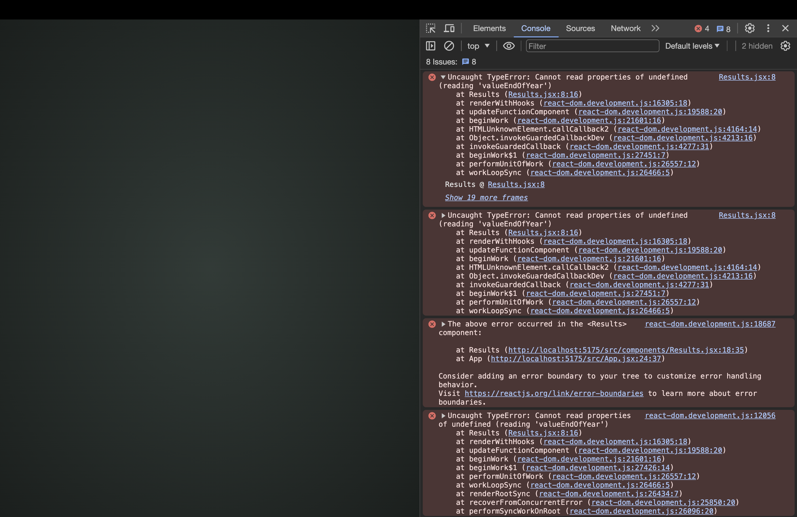
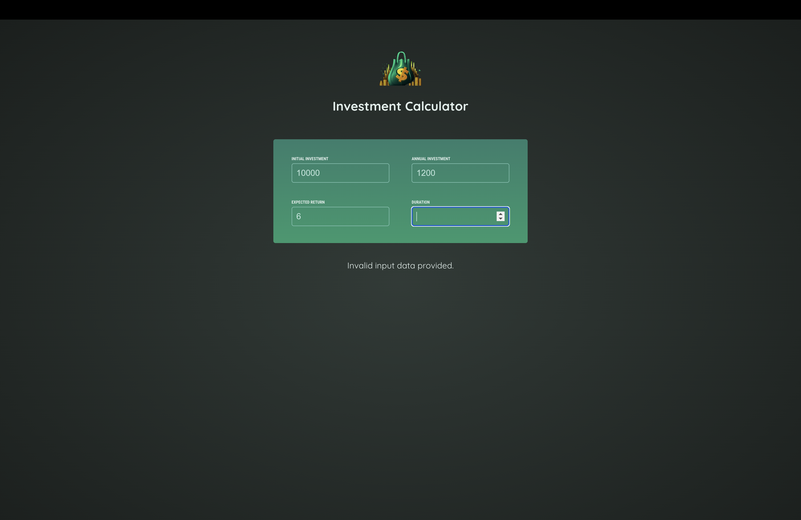
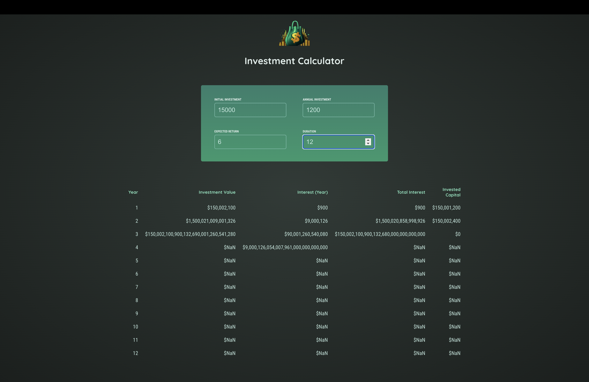
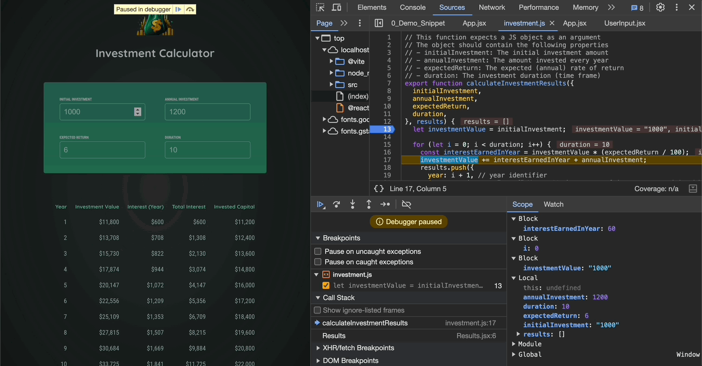
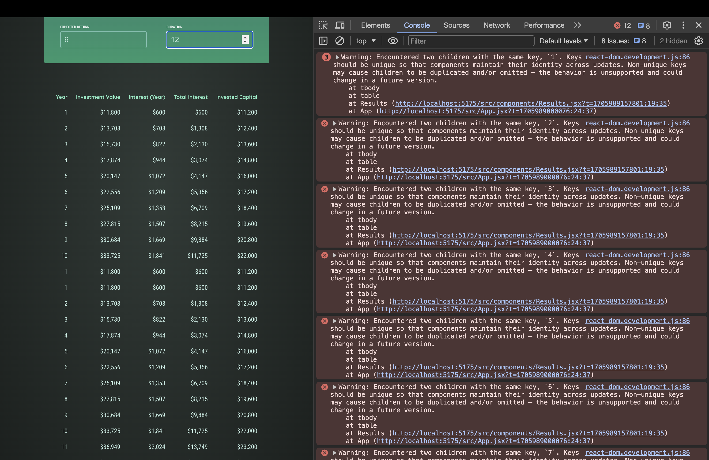
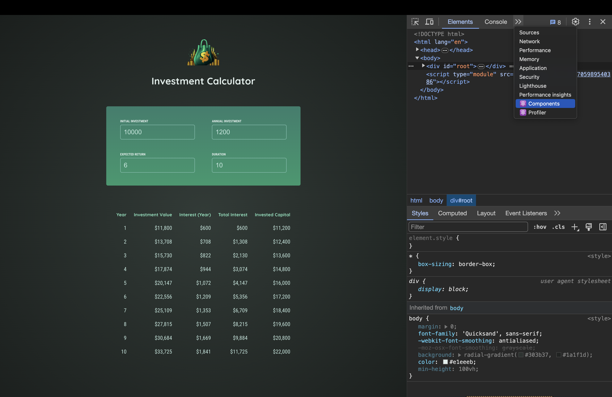

# Debugging React Apps

[📌 리액트 오류 메시지 이해하기](#-리액트-오류-메시지-이해하기)<br>
[📌 코드 흐름 및 경고 분석](#-코드-흐름-및-경고-분석)<br>
[📌 리액트의 Strict Mode(엄격모드) 이해하기](#-리액트의-strict-mode엄격모드-이해하기)<br>
[📌 리액트 DevTools 사용하기](#-리액트-devtools-사용하기)<br>
<br>

## 📌 리액트 오류 메시지 이해하기

프로젝트의 input에 0이나 음수 값을 입력하면 다음과 같은 오류 화면이 뜬다.



- 이는 오른쪽의 콘솔창에서도 나왔듯이 Results.jsx코드에서 발생한 것으로 속성값에 접근할 수 없어서 발생한 오류이다.

```jsx
// Results.jsx

export default function Results({ input }) {
  const results = [];
  calculateInvestmentResults(input, results);
  const initialInvestment =
    results[0].valueEndOfYear -
    results[0].interest -
    results[0].annualInvestment;
  // ...
}
```

- 즉, results[0]를 읽지 못해서, results[0]가 undefined라서 발생한 오류이다.
- results와 관련된 코드를 살펴보면 초기에 results는 빈 배열로 정의된 뒤, `calculateInvestmentResults`함수의 인수로 전달된다.

```jsx
// calculateInvestmentResults

export function calculateInvestmentResults(
  { initialInvestment, annualInvestment, expectedReturn, duration },
  results
) {
  // results
  let investmentValue = initialInvestment;

  for (let i = 0; i < duration; i++) {
    const interestEarnedInYear = investmentValue * (expectedReturn / 100);
    investmentValue += interestEarnedInYear + annualInvestment;
    results.push({
      // results에 값들이 Push 된다.
      year: i + 1, // year identifier
      interest: interestEarnedInYear, // the amount of interest earned in this year
      valueEndOfYear: investmentValue, // investment value at end of year
      annualInvestment: annualInvestment, // investment added in this year
    });
  }
}
```

- results와 관련된 코드들을 보면, 일단 results는 위의 Results.jsx에서 전달 받고 for문을 통해 results 배열에 값이 추가된다. &rarr; 하지만 `results.push()`는 for문에서 발생!
- for문의 조건을 통해서 알 수 있는 것은 다음과 같다. &rarr; 만약 duraition이 i보다 작은 경우 results는 빈 객체가 되고 따라서 Results.jsx에서 `results[0]`가 `undefined`라는 것을 알 수 있다.

<br>

#### 문제 해결하기 - Results.jsx

```jsx
export default function Results({ input }) {
  const results = [];
  calculateInvestmentResults(input, results);

  if (results.length === 0) {
    // results가 빈 객체라면..
    return <p>Invalid input data provided.</p>;
  }

  const initialInvestment =
    results[0].valueEndOfYear -
    results[0].interest -
    results[0].annualInvestment;
  //...
}
```

- results가 빈 객체일 때 알 수 없는 데이터가 제공되었다는 안내 메시지를 출력한다. return을 했기 때문에 아래의 다른 코드들은 실행되지 않는다.

<br>

#### 결과



<br>

## 📌 코드 흐름 및 경고 분석



- 오류 메시지가 뜬 것이 없다. 그러나 분명히 오류가 있어 보인다.
- 초기에 계산이 잘 되는 것을 봤을 때 `calculateInvestmentResults()`에 오류는 없는 것으로 보인다.
- result 테이블도 잘 출력이 된다.
- 해당 오류는 값을 수정할 때만 오류가 발생한다. &rarr; UserInput와 관련이 었어보인다.

#### 중단점을 이용해 판단


- 중단점으로 본 결과 문자열로 값이 들어오는 것을 볼 수 있다.



- util/investment.js에서 17번째 줄에서 `investmentValue`는 문자열이고 `interestEarnedInYear,annualInvestmen`는 숫자인 것을 알 수 있다.
- 만약 `"1000"+200`을 하면 결과는 `"1000200"`이 될 것이다.
- 이처럼 investmentValue가 문자열이라서 위와 같은 오류가 발생한 것이다.

<br>

#### 문제 해결하기 - App.jsx

```jsx
function App() {
  function handleChange(inputIdentifier, newValue) {
    setUserInput((prevUserInput) => {
      return {
        ...prevUserInput,
        [inputIdentifier]: +newValue, // 새로 입력하는 값을 문자열->숫자로 변환
      };
    });
  }
}
```

<br>

## 📌 리액트의 Strict Mode(엄격모드) 이해하기

- 엄격모드에 대한 예시를 들기 위해 Results.jsx의 results 배열 선언 부분을 아래와 같이 수정한다.

```jsx
import { calculateInvestmentResults, formatter } from "../util/investment.js";

const results = [];

export default function Results({ input }) {}
```



- 에러 메시지를 보면, 두 개의 children이 같은 키를 가진다고 말하고 있다.

<br>

### 📖 Strict Mode 사용하기

#### index.jsx

```jsx
import { StrictMode } from "react"; // strict mode는 리액트에서 import하는 컴포넌트이므로 index.jsx에 작성.
import ReactDOM from "react-dom/client";

import App from "./App.jsx";
import "./index.css";

ReactDOM.createRoot(document.getElementById("root")).render(
  <StrictMode>
    <App />
  </StrictMode>
);
// 혹은 더 깉은 곳에서 엄격모드를 사용할 수 있다.

// App.jsx
function App() {
  return (
    <>
      <Header />
      <UserInput userInput={userInput} onChange={handleChange} />
      <StrictMode>
        <Results input={userInput} />
      </StrictMode>
    </>
  );
}
```

- 엄격 모드는 시스템 내부에서 앱 내부의 문제들을 잡아주는 일을 몇 가지 한다.
  - 모든 컴포넌트 함수를 두 번씩 실행한다. &rarr; 개발 단계에서만 함. &rarr; 즉각적으로 문제가 있음을 볼 수 있다.

<br>

#### 문제 해결하기

```jsx
import { calculateInvestmentResults, formatter } from "../util/investment.js";

const results = [];

export default function Results({ input }) {}
```

- 다시 Result.jsx로 돌아와서 위의 코드를 보면, results배열을 App 밖에 선언했다.
- 이는 results는 한번만 생성되고 상태가 바뀔 때마다 업데이트 되는 것이 아니라 계속해서 덧붙여진다는 것을 의미한다.(results 배열은 리셋이 안되니까)

<br>

## 📌 리액트 DevTools 사용하기

1. 구글에 react devtool 검색 &rarr; chrome web store에서 확장프로그램 추가.



- 개발자 툴에 새로운 페이지 2개 생성
