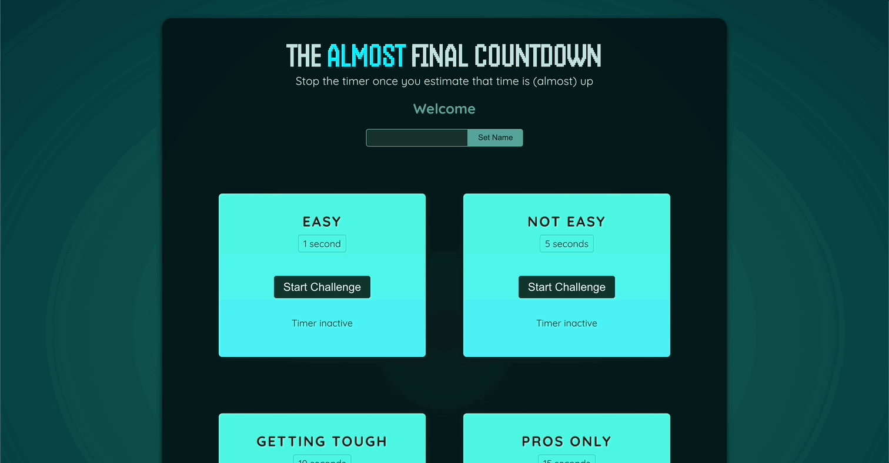
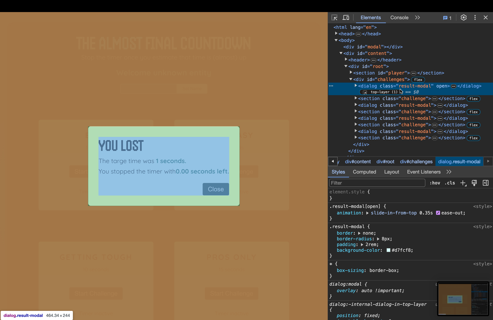
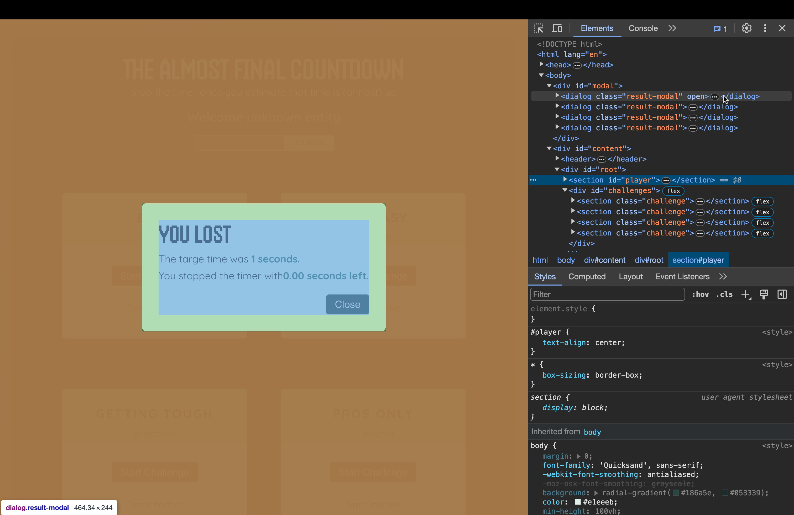

# Refs(참조) & Portals(포탈) 활용하기

[📌 복습](#-복습)<br>
[📌 Refs(참조)](#-refs참조)<br>
[📌 Portals](#-portals)<br>
<br>

## 📌 복습

### 📖 State(상태)를 사용한 사용자 입력 관리(양방향 바인딩)

#### Player.jsx

1. 혼자서 작성해보기

```jsx
import { useState } from "react";

export default function Player() {
  const [playerName, setPlayerName] = useState("");

  function handlerChangeUserName(e) {
    const userName = e.target.previousSibling.value;
    console.log(userName);
    setPlayerName(userName);
  }

  return (
    <section id="player">
      <h2>Welcome {playerName ? playerName : "unknown entity"}</h2>
      <p>
        <input type="text" />
        <button onClick={handlerChangeUserName}>Set Name</button>
      </p>
    </section>
  );
}
```

<br>

2. 강사 코드

```jsx
import { useState } from "react";

export default function Player() {
  const [enteredPlayerName, setenteredPlayerName] = useState("");
  const [submitted, setSubmitted] = useState(false);

  function handlerChange(e) {
    setSubmitted(false);
    setenteredPlayerName(e.target.value);
  }

  function handleClick() {
    setSubmitted(true);
  }

  return (
    <section id="player">
      <h2>Welcome {submitted ? enteredPlayerName : "unknown entity"}</h2>
      <p>
        <input type="text" onChange={handlerChange} value={enteredPlayerName} />
        <button onClick={handleClick}>Set Name</button>
      </p>
    </section>
  );
}
```

<br>

## 📌 Refs(참조)

### 📖 Refs(참조)로 HTML 요소 연결 및 접근

- 리액트의 Refs(참조)는 값이다. **_상태(state)가 결국엔 값인 것 처럼!_**
- 또다른 내장 훅 함수이며 다른 훅 함수와 마찬가지로 **컴포넌트 함수나 커스텀 훅 내에서만 호출 가능하다.**
- 다양하게 참조를 사용할 수 있는 방법이 있으나 가장 많이 사용하는 것은 지금 데모 앱에서 진행하는 것으로 JSX 요소들과 연결하는 것!

```jsx
import { useState, useRef } from "react";

export default function Player() {
  const playerName = useRef();

  const [enteredPlayerName, setenteredPlayerName] = useState("");

  function handleClick() {
    setenteredPlayerName(playerName.current.value);
  }

  return (
    <section id="player">
      <h2>Welcome {enteredPlayerName ?? "unknown entity"}</h2>
      {/* enteredPlayerName ? enteredPlayerName : 'unknown entity'   와 같은 문법이다. */}
      <p>
        <input ref={playerName} type="text" /> {/* ref 연결 */}
        <button onClick={handleClick}>Set Name</button>
      </p>
    </section>
  );
}
```

> 리액트는 참조 값을 input(여기선 `playerName`)으로 사용하고 이 input 컴포넌트는 결국 ref와 연결되어있다. 즉, `playerName`을 통해서 input 요소에 접근한다.

- `useRef`로부터 받는 참조 값들은 항상 자바스크립트 객체이며 항상 `current` 속성을 가진다. &rarr; `current` 속성값이 실제 참조값을 가진다.(input 요소) &rarr; 그래서 `player.current.value`를 사용한 것.
- 버튼을 클릭했을 때 플레이어의 이름을 업데이트하는 상태 업데이트 함수에 `player.current.value`를 넣으면 input 요소에 입력한 값이 상태 업데이트 함수에 전달된다.

<br>

### 📖Refs(참조)로 DOM 제어

```jsx
// Player.jsx

export default function Player() {
  const playerName = useRef();

  function handleClick() {
    setenteredPlayerName(playerName.current.value);
    playerName.current.value = "";
    // 이것은 리액트에서 주로 사용하는 선언형 방식의 코드 작성이 아니다. 그럼에도 이런 식으로 작성할 수 있다.
  }
}
```

- 리액트에서 주로 사용하는 방식의 코드 작성법은 아니지만, 그럼에도 코드의 길이 등을 줄여주기 때문에 이렇게도 작성할 수 있다는 것을 알고있자.

**하지만 Refs로 모든 요소를 저장하고 수정한다는(javascript 방식) 생각은 하지말자!**

<br>

### 📖 Refs(참조) vs. State(상태) 값

🔗 [React | refs vs. state](https://react.dev/learn/referencing-values-with-refs#differences-between-refs-and-state)

```jsx
import { useState, useRef } from "react";

export default function Player() {
  const playerName = useRef();

  const [enteredPlayerName, setenteredPlayerName] = useState("");

  function handleClick() {
    setenteredPlayerName(playerName.current.value);
    playerName.current.value = ""; // 이것은 리액트에서 주로 사용하는 선언형 방식의 코드 작성이 아니다. 그럼에도 이런 식으로 작성할 수 있다.
  }

  return (
    <section id="player">
      <h2>Welcome {enteredPlayerName ?? "unknown entity"}</h2>
      {/* enteredPlayerName ? enteredPlayerName : 'unknown entity'   와 같은 문법이다. */}
      <p>
        <input ref={playerName} type="text" />
        <button onClick={handleClick}>Set Name</button>
      </p>
    </section>
  );
}
```

- 이 코드의 경우 input 요소가 선언이 되기 전까지는 `playerName.current.value`를 정의할 수 없다. 즉, 초기 렌더링 시에는 `playerName.current.value`가 undefined!
- 그보다 더 중요한 차이는 참조(refs)는 참조가 바뀔 때마다 컴포넌트 함수가 재실행되지 않는다는 것이다.
- 상태를 업데이트하면 컴포넌트 함수는 재실행되는 것과는 반대이다.

> 1. 상태 값들은 컴포넌트들의 재실행을 야기한다. 따라서 상태는 UI에 영향을 줄 수 있는 값들이 있을 때만 사용해야 한다. 시스템 내부에 보이지 않는 쪽에서만 다루는 값들이나 UI에 직접적인 영향을 끼치지 않는 값들은 상태 값을 사용하지 않는다.
> 2. 참조는 컴포넌트들이 다시 실행되게 하지 않는다. 참조는 DOM 요소에 직접적인 접근이 필요할 때 사용된다.

<br>

### 📖 타이머 설정 & State(상태) 관리

#### TimerChallenge.jsx

```jsx
import { useState } from "react";

export default function TimerChallenge({ title, targetTime }) {
  const [timerStarted, setTimerStarted] = useState(false);
  const [timerExpired, setTimerExpired] = useState(false);

  function handleStart() {
    setTimerStarted(true);

    setTimeout(() => {
      setTimerExpired(true);
    }, targetTime * 1000);
  }

  return (
    <section className="challenge">
      <h2>{title}</h2>
      {timerExpired && <p>You Lost!</p>}
      <p className="challenge-time">
        {targetTime} second{targetTime > 1 ? "s" : ""}
      </p>
      <p>
        <button onClick={handleStart}>
          {timerStarted ? "Stop" : "Start"} Challenge
        </button>
      </p>
      <p className={timerStarted ? "active" : undefined}>
        {timerStarted ? "Time is running..." : "Timer inactive"}
      </p>
    </section>
  );
}
```

#### 결과



<br>

### 📖 "DOM 요소 연결" 외 Refs(참조) 활용법

#### 변수를 이용해서 timer 종료하기

```jsx
// TimerChallenge.jsx
export default function TimerChallenge({ title, targetTime }) {
  let timer;

  function handleStart() {
    setTimerStarted(true);

    timer = setTimeout(() => {
      setTimerExpired(true);
    }, targetTime * 1000);
  }

  function handleStop() {
    // timer를 어떻게 이 함수 내에서 멈출 수 있도록 할 것인가..
    clearTimeout(timer);
  }
}
```

- 변수(`let timer`)를 컴포넌트 안에서 선언했으므로 timer 시작 버튼을 누름과 동시에 중지 버튼을 눌러도 `handleStop()`이 제대로 동작하지 않는다. &rarr; State함수로 인해서 컴포넌트가 재실행되고 이때 timer 변수 역시 재실행되므로 중지 버튼을 눌러도 동작하지 않는다.
- 이를 해결하기 위해서 변수를 컴포넌트 밖으로 선언.

```jsx
// TimerChallenge.jsx
let timer;

export default function TimerChallenge({ title, targetTime }) {
  function handleStart() {
    setTimerStarted(true);

    timer = setTimeout(() => {
      setTimerExpired(true);
    }, targetTime * 1000);
  }

  function handleStop() {
    // timer를 어떻게 이 함수 내에서 멈출 수 있도록 할 것인가..
    clearTimeout(timer);
  }
}
```

- 이렇게 하면 하나의 타이머를 눌렀을 때는 제대로 중지 버튼이 된다.
- 그러나 1초 타이머와 5초 타이머를 동시에 누른다면 둘 중 하나의 타이머는 중지 버튼이 동작하지 않는다.
- 왜냐하면 첫번째 타이머 start &rarr; 두번째 타이머 start &rarr; 두번째 타이머 stop &rarr; 찻번째 타이머 stop 순으로 진행이 된다면, 변수는 timer 하나로만 선언이 되므로 두번째 타이머 start 버튼을 눌렀을 때 변수의 값이 덮어씌워지므로 첫번째 타이머의 중지버튼은 동작하지 않는다.

> 변수를 등록하는 것만으로는 타이머 중지 동작의 해결 방법이 될 수 없다. &rarr; 참조(refs)를 사용해야한다.

- 참조는 html 요소와 연결하는 것 뿐만 아니라 **참조를 어떤 종류의 값이든 제어하기 위해 사용할 수도 있다.**

```jsx
export default function TimerChallenge({ title, targetTime }) {
  const [timerStarted, setTimerStarted] = useState(false);
  const [timerExpired, setTimerExpired] = useState(false);

  const timer = useRef();

  function handleStart() {
    setTimerStarted(true);

    timer.current = setTimeout(() => {
      setTimerExpired(true);
    }, targetTime * 1000);
  }

  function handleStop() {
    // timer를 어떻게 이 함수 내에서 멈출 수 있도록 할 것인가..
    clearTimeout(timer.current);
  }
}
```

- `const timer = useRef();`
  - 컴포넌트 안에서 정의되었기 때문에 특정 컴포넌트 인스턴스에만 할당이 될 것이다. 다른 컴포넌트의 참조와는 독립적으로 존재할 것.
  - 변수가 컴포넌트 함수에 정의되는 것과는 다르게 해당 컴포넌트가 재실행될 때 이 참조는 초기화되거나 지워지지 않는다.

<br>

---

<br>

### 📖 Modal Component 추가하기

#### Modal 작성하기

```jsx
// ResultModal.jsx

export default function ResultModal({ result, targetTime }) {
  return (
    <dialog className="result-modal" open>
      <h2>You {result}</h2>
      <p>
        The targe time was <strong>{targetTime} seconds.</strong>
      </p>
      <p>
        You stopped the timer with <strong>X seconds left.</strong>
      </p>
      {/* 네이티브 html에 내장되어있고 최신 브라우저들의 지원을 받음. */}
      <form method="dialog">
        <button>Cloase</button>
      </form>
    </dialog>
  );
}

// TimerChallenge.jsx
export default function TimerChallenge(){
  return(
    {timerExpired && <ResultModal targetTime={targetTime} result="lost"/>}
  );
}
```

- `dialog`는 내장된 태그. `open`을 사용해야지 보여진다.

🔗 [MDN | Dialog](https://developer.mozilla.org/ko/docs/Web/HTML/Element/dialog)

- 그러나 `open`을 사용하면 모달 뒤의 요소가 어둡게 보여지는 backdrop 요소가 보이지 않게 된다.

<br>

### 📖 커스텀 컴포넌트로 Refs(참조) 전달 | Backdrop 적용하기

#### ResultModal.jsx

```jsx
import { forwardRef } from "react";

const ResultModal = forwardRef(function ResultModal(
  { result, targetTime },
  ref
) {
  return (
    <dialog ref={ref} className="result-modal">
      <h2>You {result}</h2>
      <p>
        The targe time was <strong>{targetTime} seconds.</strong>
      </p>
      <p>
        You stopped the timer with <strong>X seconds left.</strong>
      </p>
      {/* 네이티브 html에 내장되어있고 최신 브라우저들의 지원을 받음. */}
      <form method="dialog">
        <button>Close</button>
      </form>
    </dialog>
  );
});

export default ResultModal;
```

- `forwardRef`
  - 만약 참조를 한 컴포넌트에서 다른 컴포넌트로 전달하고 그리고 참조를 전달받은 컴포넌트에서 사용하고 싶다면 이 함수를 사용해야한다.
  - 참조를 컴포넌트에서 컴포넌트로 전달하여 참조가 그 다른 컴포넌트에서 사용될 수 있도록 함.
  - forwardRef({prop}, ref)

<br>

#### TimerChallenge.jsx

```jsx
import { useRef, useState } from "react";
import ResultModal from "./ResultModal";

export default function TimerChallenge({ title, targetTime }) {
  const [timerStarted, setTimerStarted] = useState(false);
  const [timerExpired, setTimerExpired] = useState(false);

  const timer = useRef();
  const dialog = useRef(); // dialog를 위한 ref

  function handleStart() {
    setTimerStarted(true);

    timer.current = setTimeout(() => {
      setTimerExpired(true);
      dialog.current.showModal(); // built-in dialog는 showModal 메소드를 가지고 있다. 표준 브라우저 기능중 하나다.
    }, targetTime * 1000);
  }

  function handleStop() {
    clearTimeout(timer.current);
  }

  return (
    <>
      {/* showModal 메서드를 사용했기 때문에 이런 식으로 작성해도 된다. */}
      {/* ResultModal.jsx에서 forwardRef의 ref로 인자 이름을 설정했기 때문에 여기서도 똑같이 설정해야 한다. */}
      <ResultModal ref={dialog} targetTime={targetTime} result="lost" />
      <section className="challenge">
        <h2>{title}</h2>
        <p className="challenge-time">
          {targetTime} second{targetTime > 1 ? "s" : ""}
        </p>
        <p>
          <button onClick={timerStarted ? handleStop : handleStart}>
            {timerStarted ? "Stop" : "Start"} Challenge
          </button>
        </p>
        <p className={timerStarted ? "active" : undefined}>
          {timerStarted ? "Time is running..." : "Timer inactive"}
        </p>
      </section>
    </>
  );
}
```

<br>

### 📖 useImperativeHandle 훅으로 컴포넌트 API 노출하기

- 다른 개발자들과 일할 때 `dialog, showModal`등을 이용하는 것은 서로의 코드를 완전히 이해해야하는 단계를 거칠 필요가 있다. &rarr; little bit tricky
- 따라서 ResultModal 컴포넌트를 자신의 함수를 노출하도록 구축하여 그 컴포넌트의 외부에서 ref의 도움으로 호출될 수 있도록 하자.

#### ResultModal.jsx

```jsx
import { forwardRef, useImperativeHandle, useRef } from "react";

const ResultModal = forwardRef(function ResultModal(
  { result, targetTime },
  ref
) {
  const dialog = useRef();
  // dialog에 접근하는 또다른 ref가 필요하다. 왜냐하면 이제 dialog요소를 분리해야하기 때문.
  // ResultModal 컴포넌트 내에서 사용되며 다른 외부 컴포넌트로부터 분리됨

  useImperativeHandle(ref, () => {
    return {
      // 메서드 이름은 개발자 맘
      open() {
        dialog.current.showModal();
        // 해당 메서드가 호출됐을 때 ResultModal에서 선언된 dialog의 showModal 메서드가 호출된다.
      },
    };
  });

  return (
    //   ref={dialog}로 설정하여 ResultModal에서 설정한 dialog ref를 전달.
    <dialog ref={dialog} className="result-modal">
      <h2>You {result}</h2>
      <p>
        The targe time was <strong>{targetTime} seconds.</strong>
      </p>
      <p>
        You stopped the timer with <strong>X seconds left.</strong>
      </p>
      <form method="dialog">
        <button>Close</button>
      </form>
    </dialog>
  );
});

export default ResultModal;
```

- useImperativeHandle

  - 객체를 반환하고 해당 객체는 속성과 메서드를 모아놓는다.
  - 그 속성과 메서드들은 이 컴포넌트나 다른 컴포넌트에 노출되어야 하는 것들이다.
  - 해당 훅을 이 컴포넌트 함수에서 호출하여 속성과 메서드를 정의 & 이 컴포넌트 바깥으로 접근할 수 있어야 한다. &rarr; 한 다리 거쳐서 전달해주는 느낌이라고 생각하자!
  - `useImperativeHandle(ref, ()=>{})` => forwardRef와 같이 작업되어야 한다..!

- useImperativeHandle을 사용했을 때, 해당 훅에서 정의된 속성이나 메서드를 컴포넌트와 연결하기 위해서 한번 더 `useRef`훅을 사용한다.
- 따라서 `const dialog = useRef();`를 사용한 것이다.

<br>

#### TimerChallenge.jsx

```jsx
function handleStart() {
  setTimerStarted(true);

  timer.current = setTimeout(() => {
    setTimerExpired(true);
    dialog.current.open(); // useImperativeHandle에서 선언한 함수 open()을 사용.
  }, targetTime * 1000);
}
```

- ResultModal.jsx에서 사용된 `useImperativeHandle`에서 선언한 함수 `open()`을 사용한다.

<br>

### 📖 컴포넌트 간의 State(상태) 공유 | Modal에 남은 시간 및 게임 결과 공유하기

#### 남은 시간 표현을 위해 State 수정

```jsx
// TimerChallenge.jsx
import { useRef, useState } from "react";
import ResultModal from "./ResultModal";

export default function TimerChallenge({ title, targetTime }) {
  // ============== 수정된 부분 ==============
  const [timeRemaining, setTimeRemaining] = useState(targetTime * 1000);
  const timer = useRef();
  const dialog = useRef();

  const timerIsActive = timeRemaining > 0 && timeRemaining < targetTime * 1000;

  if (timeRemaining <= 0) {
    clearInterval(timer.current);
    setTimeRemaining(targetTime * 1000);
    // 사실 이런 식으로 상태 업데이트 함수를 컴포넌트에서 바로 호출하는 것은 위험하다. 대신 우린 if문을 사용하긴 했다..!
    dialog.current.open(); // 이 함수는 타이머가 자동으로 멈췄을 때 동작하는 것 -> 졌을 때 상황
  }

  function handleStart() {
    timer.current = setInterval(() => {
      setTimeRemaining((prevTimeRemaing) => prevTimeRemaing - 10); // timeRemaing을 10밀리초마다 업데이트
    }, 10);
  }

  function handleStop() {
    dialog.current.open(); // 이 함수는 우리가 타이머를 수동으로 멈췄을 때 동작하는 것 -> 이겼을 때 상황
    clearInterval(timer.current);
  }
  // ======================================

  return (
    <>
      <ResultModal ref={dialog} targetTime={targetTime} result="lost" />
      <section className="challenge">
        <h2>{title}</h2>
        <p className="challenge-time">
          {targetTime} second{targetTime > 1 ? "s" : ""}
        </p>
        <p>
          <button onClick={timerIsActive ? handleStop : handleStart}>
            {" "}
            {/* 수정 */}
            {timerIsActive ? "Stop" : "Start"} Challenge {/* 수정 */}
          </button>
        </p>
        <p className={timerIsActive ? "active" : undefined}>
          {" "}
          {/* 수정 */}
          {timerIsActive ? "Time is running..." : "Timer inactive"} {/* 수정 */}
        </p>
      </section>
    </>
  );
}
```

<br>

#### 게임 결과 공유하기

```jsx
// TimerChallenge.jsx
import { useRef, useState } from "react";
import ResultModal from "./ResultModal";

export default function TimerChallenge({ title, targetTime }) {
  const [timeRemaining, setTimeRemaining] = useState(targetTime * 1000);
  const timer = useRef();
  const dialog = useRef();

  const timerIsActive = timeRemaining > 0 && timeRemaining < targetTime * 1000;

  // ============== 수정된 부분 ==============
  if (timeRemaining <= 0) {
    clearInterval(timer.current);
    dialog.current.open();
  }

  function handleReset() {
    setTimeRemaining(targetTime * 1000);
  }
  // ======================================

  function handleStart() {
    timer.current = setInterval(() => {
      setTimeRemaining((prevTimeRemaing) => prevTimeRemaing - 10);
    }, 10);
  }

  function handleStop() {
    dialog.current.open();
    clearInterval(timer.current);
  }

  return (
    <>
      <ResultModal
        ref={dialog}
        targetTime={targetTime}
        remainingTime={timeRemaining} // remainingTime 수정
        onReset={handleReset} // onReset 수정
      />
      <section className="challenge">
        <h2>{title}</h2>
        <p className="challenge-time">
          {targetTime} second{targetTime > 1 ? "s" : ""}
        </p>
        <p>
          <button onClick={timerIsActive ? handleStop : handleStart}>
            {timerIsActive ? "Stop" : "Start"} Challenge
          </button>
        </p>
        <p className={timerIsActive ? "active" : undefined}>
          {timerIsActive ? "Time is running..." : "Timer inactive"}
        </p>
      </section>
    </>
  );
}
```

<br>

```jsx
// ResultModal.jsx
import { forwardRef, useImperativeHandle, useRef } from "react";

const ResultModal = forwardRef(function ResultModal(
  { targetTime, remainingTime, onReset }, // 수정 : remainingTime, onReset 추가
  ref
) {
  const dialog = useRef();

  // ============== 수정된 부분 ==============
  const userLost = remainingTime <= 0;
  const formattedRemainingTime = (remainingTime / 1000).toFixed(2); // 소수점 두자리 수 까지 표현
  const score = Math.round((1 - remainingTime / (targetTime * 1000)) * 100); // 0~100사이의 숫자 생성. remaining(ms 단위), targetTime(s 단위)
  // ======================================

  useImperativeHandle(ref, () => {
    return {
      open() {
        dialog.current.showModal();
      },
    };
  });

  return (
    <dialog ref={dialog} className="result-modal">
      {userLost && <h2>You Lost</h2>} {/* 추가 */}
      {!userLost && <h2>Your score:{score}</h2>} {/* 추가 */}
      <p>
        The targe time was <strong>{targetTime} seconds.</strong>{" "}
        {/* targetTime 추가 */}
      </p>
      <p>
        You stopped the timer with
        <strong>{formattedRemainingTime} seconds left.</strong> {/* formattedRemainingTime 추가 */}
      </p>
      <form method="dialog" onSubmit={onReset}>
        {" "}
        {/* onReset 추가 */}
        <button>Close</button>
      </form>
    </dialog>
  );
});

export default ResultModal;
```

<br>

#### 결과


#### (+) ESC 키로 Modal 닫기

```jsx
// ResultModal.jsx
return (
  <dialog ref={dialog} className="result-modal" onClose={onReset}></dialog>
);
```

- `<dialog>` 요소에 내장된 `onClose`속성을 추가. 해당 값에 `onReset`을 바인딩한다.

<br>

## 📌 Portals



- 사진을 봤을 때, Modal은 `<section>`과 동일한 `<div>`내에서 정의되고 있다. &rarr; TimerChallenge에서 그렇게 설정되어있으니까.
- 하지만 Modal은 페이지 제일 위에 보여지는 오버레이 요소이기 때문에 바로 `body`밑이나 `<div id="modal">` 바로 밑에 위치하는 것이 맞다.

#### ResultModal.jsx

```jsx
import { forwardRef, useImperativeHandle, useRef } from "react";
import { createPortal } from "react-dom"; // 추가

const ResultModal = forwardRef(function ResultModal(
  { targetTime, remainingTime, onReset },
  ref
) {
  const dialog = useRef();

  const userLost = remainingTime <= 0;
  const formattedRemainingTime = (remainingTime / 1000).toFixed(2);
  const score = Math.round((1 - remainingTime / (targetTime * 1000)) * 100);

  useImperativeHandle(ref, () => {
    return {
      open() {
        dialog.current.showModal();
      },
    };
  });

  // 추가 createPortal( jsx코드, 옮겨질 html 요소)
  return createPortal(
    <dialog ref={dialog} className="result-modal" onClose={onReset}>
      {userLost && <h2>You Lost</h2>}
      {!userLost && <h2>Your score:{score}</h2>}
      <p>
        The targe time was <strong>{targetTime} seconds.</strong>
      </p>
      <p>
        You stopped the timer with
        <strong>{formattedRemainingTime} seconds left.</strong>
      </p>
      <form method="dialog" onSubmit={onReset}>
        <button>Close</button>
      </form>
    </dialog>,
    document.getElementById("modal") // modal이라는 id를 지닌 html요소로 이동하겠다.
  );
});

export default ResultModal;
```

1. react 와 react-dom 라이브러리의 차이

- react 라이브러리 : 모든 환경에서 작동 가능한 함수와 기능만 노출한다. &rarr; ex. 리액트 네이티브로 네이티브 어플을 만들 때 사용 가능.
- react-dom 라이브러리 : 몇 가지 함수와 기능은 리액트가 DOM과 상호작용하도록 한다. 즉, 브라우저에 렌더링된 웹사이트와 상호작용한다.

2. Portal : 컴포넌트에 렌더링이 될 HTML 코드를 DOM 내에 다른 곳으로 옮기는 것이다.

- `createPortal( jsx코드, 옮겨질 html 요소 )`
- 옮겨질 html 요소는 index.html에 있어야 한다.

<br>

#### 결과



- `<div id="modal">`안에 4개의 요소가 있는 이유는 우리가 만든 챌린지(1초, 5초, 10초, 15초)의 수가 4개이기 때문이다. &rarr; 1초의 챌린지 모달만 open됨.
