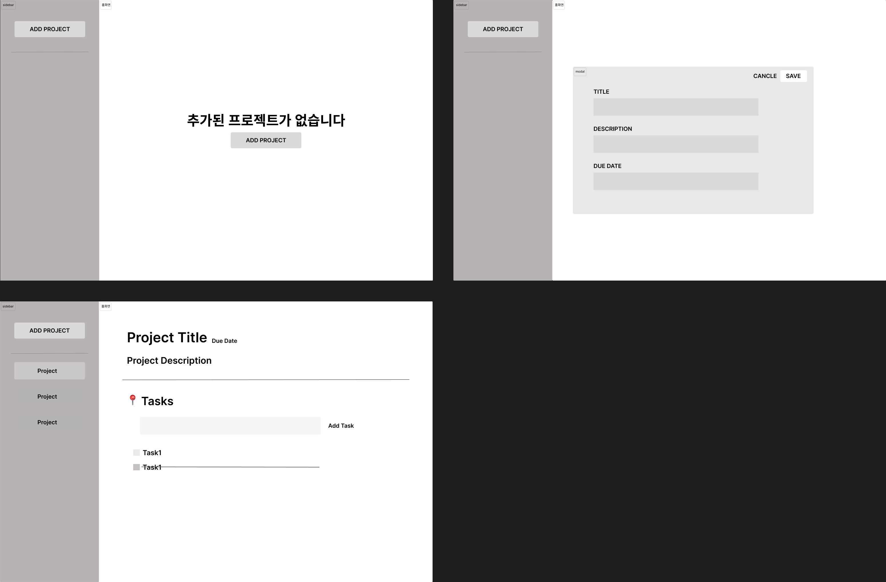
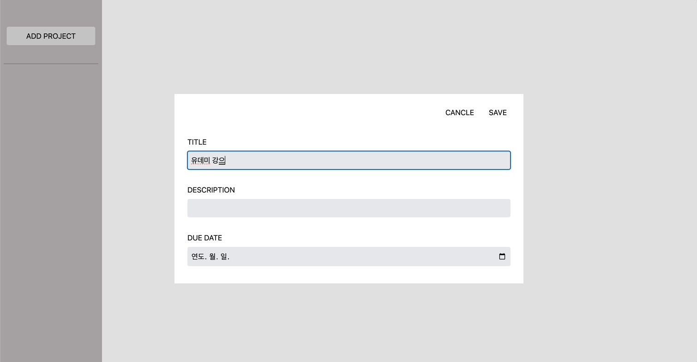
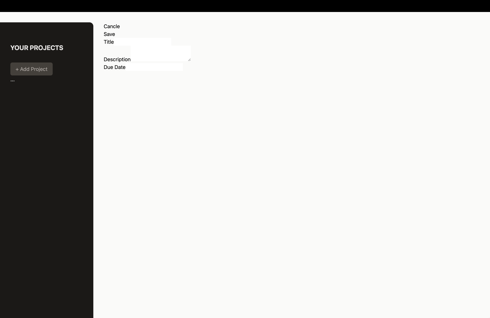
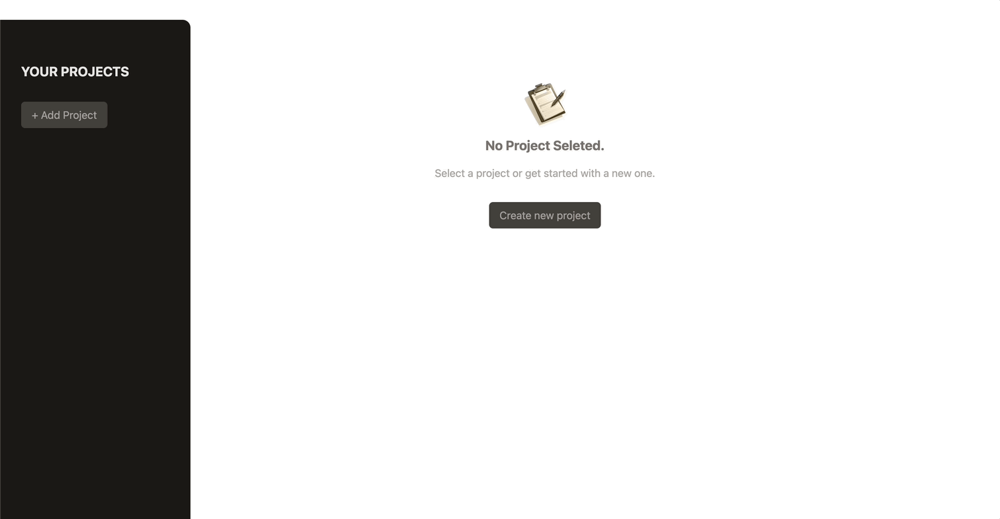

# React Practice | 프로젝트 관리 앱

[📌 스스로 만들어보기](#-스스로-만들어보기)<br>
[📌 강사 코드](#-강사-코드)<br>
<br>

## 📌 스스로 만들어보기

### 📖 동작

1. (아무런 프로젝트가 없었을 때) 사이드바의 Add Project나 홈의 Create new project 버튼이 나온다.
2. 해당 버튼을 누르면 TITLE, DESCRIPTION, DUE DATE(calendar)를 입력할 수 있고 Cancel과 Save 버튼을 통해서 입력을 취소할 수도, 저장할 수도 있다.
3. 프로젝트를 입력했다면, 홈화면과 사이드 바에 해당 내용을 출력한다.
4. 사이드바를 통해서 해당 프로젝트에 접속 &rarr; 홈화면에서 타이틀과 설명, 기한을 표시한다.
5. 해당 프로젝트를 진행하기 위한 Tasks들을 표시. &rarr; 입력할 수 있는 input과 Add Task버튼을 통해서 해야할 일을 추가할 수 있고, 완료(Clear)도 가능하다.


<br>

### 📖 디자인 설계

🔗 [디자인 설계 링크 | Figma](https://www.figma.com/file/MGt7yF2K36JISS4ejQI0mp/%ED%94%84%EB%A1%9C%EC%A0%9D%ED%8A%B8-%EA%B4%80%EB%A6%AC-%EC%95%B1?type=design&node-id=0%3A1&mode=design&t=0gxvwboR6l3gwGfG-1)


<br>

### 📖 완성



🔗 [레파지토리에서 코드 보기](https://github.com/Imshyeon/Develop_Study/tree/76f42affc2a437240623e68cc1fe1160e98d1579/React/Complete-React/9_React-Practice)

<br>

## 📌 강사 코드

### 📖 ProjectSidebar 컴포넌트 추가히기

#### App.jsx

```jsx
import ProjectSidebar from "./components/ProjectSidebar";

function App() {
  return (
    <main>
      <ProjectSidebar />
    </main>
  );
}
export default App;
```

#### ProjectSidebar.jsx

```jsx
export default function ProjectSidebar() {
  return (
    <aside>
      <h2>Your Projects</h2>
      <div>
        <button>+ Add Project</button>
      </div>
      <ul>...</ul>
    </aside>
  );
}
```

<br>

### 📖 Tailwind CSS로 사이드바 & 버튼 스타일링하기

```jsx
// App.jsx
import ProjectSidebar from "./components/ProjectSidebar";

function App() {
    return (
        // h-screen : 화면 세로 길이를 전부 차지
        <main className="h-screen my-8">
            <ProjectSidebar/>
        </main>
    )
}
export default App;

// ProjectSidebar.jsx
export default function ProjectSidebar() {
  return (
    <aside className="w-1/3 px-8 py-16 bg-stone-900 text-stone-50 md:w-72 rounded-r-xl">
      <h2 className="mb-8 font-bold uppercase md:text-xl text-stone-200">
        Your Projects
      </h2>
      <div>
        <button className="px-4 py-2 text-xs md:text-base rounded-md bg-stone-700 text-stone-400 hover:bg-stone-600 hover:text-stone-100">
          + Add Project
        </button>
      </div>
      <ul>...</ul>
    </aside>
  );
}
```

<br>

### 📖 NewProject 컴포넌트와 재사용 가능한 Input 컴포넌트 추가하기

#### NewProject.jsx

```jsx
import Input from "./Input";
export default function NewProject() {
  return (
    <div>
      <menu>
        <li>
          <button>Cancle</button>
        </li>
        <li>
          <button>Save</button>
        </li>
      </menu>
      <div>
        <Input label="Title" />
        <Input label="Description" textarea />
        <Input label="Due Date" />
      </div>
    </div>
  );
}
```

#### Input.jsx

```jsx
export default function Input({ label, textarea, ...props }) {
  return (
    <p>
      <label htmlFor={label}>{label}</label>
      {textarea ? (
        <textarea id={label} {...props} />
      ) : (
        <input id={label} {...props} />
      )}
    </p>
  );
}
```

#### App.jsx

```jsx
import ProjectSidebar from "./components/ProjectSidebar";
import NewProject from "./components/NewProject";

function App() {
  return (
    // h-screen : 화면 세로 길이를 전부 차지
    <main className="h-screen my-8 flex gap-8">
      <ProjectSidebar />
      <NewProject />
    </main>
  );
}
export default App;
```

#### 결과



<br>

### 📖 Tailwind CSS로 버튼과 입력 항목 스타일링

```jsx
// NewProject.jsx
import Input from "./Input";
export default function NewProject() {
    return (
      <div className="w-[35rem] mt-16">
        <menu className="flex items-center justify-end gap-4 my-4">
          <li>
            <button className="text-stone-800 hover:text-stone-950">Cancle</button>
          </li>
          <li>
            <button className="px-6 py-2 rounded-md bg-stone-800 text-stone-50 hover:bg-stone-950">Save</button>
          </li>
        </menu>
        <div>
          <Input label="Title"/>
          <Input label="Description" textarea/>
          <Input label="Due Date"/>
        </div>
      </div>
    );
}

// Input.jsx
export default function Input({ label, textarea, ...props }) {
  const classes =
    "w-full p-1 border-b-2 rounded-sm border-stone-300 bg-stone-200 text-stone-600 focus:outline-none focus:border-stone-600";

  return (
    <p className="flex flex-col gap-1 my-4">
      <label
        className="text-sm font-bold uppercase text-stone-500"
        htmlFor={label}
      >
        {label}
      </label>
      {textarea ? (
        <textarea className={classes} id={label} {...props} />
      ) : (
        <input className={classes} id={label} {...props} />
      )}
    </p>
  );
}
```

- `focus:outline-none focus:border-stone-600` : 입력하려고 눌렀을 때 기존의 outline은 지우고 대신 border color 변경
- 위의 방법처럼 기존의 아웃라인을 지우고 싶었으나 빨리 프로젝트를 끝내고 싶어서 추가하진 못했다..ㅎㅎ..

<br>

### 📖 JSX와 Tailwind CSS 스타일을 위한 컴포넌트 분리 (재사용 가능성 향상)

#### Button.jsx

```jsx
export default function Button({ children, ...props }) {
  return (
    <button
      {...props}
      className="px-4 py-2 text-xs md:text-base rounded-md bg-stone-700 text-stone-400 hover:bg-stone-600 hover:text-stone-100"
    >
      {children}
    </button>
  );
}
```

#### NoProjectSelected.jsx

```jsx
import noProjectImage from "../assets/no-projects.png";
import Button from "./Button";

export default function NoProjectSelected() {
  return (
    <div className="mt-24 text-center w-2/3">
      
      <h2 className="text-xl font-bold text-stone-500 my-4">
        No Project Seleted.
      </h2>
      <p className="text-stone-400 mb-4">
        Select a project or get started with a new one.
      </p>
      <p className="mt-8">
        <Button>Create new project</Button>
      </p>
    </div>
  );
}
```

#### ProjectSidebar.jsx

```jsx
import Button from "./Button";
export default function ProjectSidebar() {
  return (
    <aside className="w-1/3 px-8 py-16 bg-stone-900 text-stone-50 md:w-72 rounded-r-xl">
      <h2 className="mb-8 font-bold uppercase md:text-xl text-stone-200">
        Your Projects
      </h2>
      <div>
        <Button>+ Add Project</Button> {/* Button 대체 */}
      </div>
      <ul>...</ul>
    </aside>
  );
}
```

<br>

### 📖 컴포넌트 간 교환을 위한 State 관리법

#### App.jsx

```jsx
import { useState } from "react";
import ProjectSidebar from "./components/ProjectSidebar";
import NewProject from "./components/NewProject";
import NoProjectSelected from "./components/NoProjectSelected";

function App() {
  const [projectsState, setProjectsState] = useState({
    selectedProjectId: undefined, // 아무것도 안하고 있다. 라는 신호
    projects: [],
  });

  function handleStartAddProject() {
    setProjectsState((prevState) => {
      return {
        ...prevState,
        selectedProjectId: null, // 우리가 새로운 프로젝트를 추가한다는 신호
      };
    });
  }

  let content;
  if (projectsState.selectedProjectId === null) {
    // 새로운 프로젝트를 추가한다는 버튼을 누르면
    content = <NewProject />;
  } else if (projectsState.selectedProjectId === undefined) {
    content = <NoProjectSelected onStartAddProject={handleStartAddProject} />;
  }

  return (
    // h-screen : 화면 세로 길이를 전부 차지
    <main className="h-screen my-8 flex gap-8">
      <ProjectSidebar onStartAddProject={handleStartAddProject} />
      {content}
    </main>
  );
}
export default App;
```

- 강사는 새로운 프로젝트를 넣을 것인지 아닌지에 대한 신호와 프로젝트 배열을 관리하는 State를 설정했다.
  > 나는 프로젝트와 관련된 신호를 따로 넣진 않았다. 강사 코드를 보면서 해당 신호(signal)을 주고 받는다면 로직을 짜고 코드를 작성하는데 더 편하게 할 수 있을 것이란 것을 깨달았다!!
  > 🚨 앞으로 신호를 주고받아서 상태를 업데이트하는 방법에 대해서도 생각해보자! 🚨

#### ProjectSidebar.jsx, NoProjectSelected.jsx

```jsx
// ProjectSidebar.jsx
import Button from "./Button";
export default function ProjectSidebar({onStartAddProject}) {
  return (
    <aside className="w-1/3 px-8 py-16 bg-stone-900 text-stone-50 md:w-72 rounded-r-xl">
      <h2 className="mb-8 font-bold uppercase md:text-xl text-stone-200">
        Your Projects
      </h2>
      <div>
        <Button onClick={onStartAddProject}>+ Add Project</Button>
      </div>
      <ul>...</ul>
    </aside>
  );
}

// NoProjectSelected.jsx
import noProjectImage from '../assets/no-projects.png'
import Button from './Button'

export default function NoProjectSelected({ onStartAddProject }) {
  return (
    <div className="mt-24 text-center w-2/3">
      
      <h2 className="text-xl font-bold text-stone-500 my-4">
        No Project Seleted.
      </h2>
      <p className="text-stone-400 mb-4">
        Select a project or get started with a new one.
      </p>
      <p className="mt-8">
        <Button onClick={onStartAddProject}>Create new project</Button>
      </p>
    </div>
  );
}
```

- 강사는 앞서 버튼에 대한 커스텀 컴포넌트를 작성했고, `chilren`외에도 다른 속성들이 넘어올 것을 대비해 `...props`를 추가했다.
- 이렇게 함으로써 `onClick` 동작이 간단하게 진행된 것 같다.
  > 앞으로 `...props`에 대한 적극적인 활용을 해보자! 솔직히 해당 속성을 사용하려고 생각해보긴 했지만 어떻게 써야할지 감이 안와서 쓰지 못했다..!

<br>

### 📖 Refs(참조)와 전달된 Refs(참조)로 사용자 입력 받아오기

#### NewProject.jsx

```jsx
import { useRef } from "react";
import Input from "./Input";
export default function NewProject({ onAdd }) {
  const title = useRef();
  const description = useRef();
  const dueDate = useRef();

  function handleSave() {
    const enteredTitle = title.current.value;
    const enteredDescription = description.current.value;
    const enteredDueDate = dueDate.current.value;

    // validation

    onAdd({
      title: enteredTitle,
      description: enteredDescription,
      dueDate: enteredDueDate,
    });
  }

  return (
    <div className="w-[35rem] mt-16">
      <menu className="flex items-center justify-end gap-4 my-4">
        <li>
          <button className="text-stone-800 hover:text-stone-950">
            Cancle
          </button>
        </li>
        <li>
          <button
            className="px-6 py-2 rounded-md bg-stone-800 text-stone-50 hover:bg-stone-950"
            onClick={handleSave}
          >
            Save
          </button>
        </li>
      </menu>
      <div>
        <Input type="text" ref={title} label="Title" />
        <Input ref={description} label="Description" textarea />
        <Input type="date" ref={dueDate} label="Due Date" />
      </div>
    </div>
  );
}
```

- `useRef()`를 이용해 입력받을 정보들을 각각 참조한다.

#### Input.jsx

```jsx
import { forwardRef } from "react";

// 외부에서 들어오는 ref를 사용하기 위해 forwardRef를 사용.
const Input = forwardRef(function Input({ label, textarea, ...props }, ref) {
  const classes =
    "w-full p-1 border-b-2 rounded-sm border-stone-300 bg-stone-200 text-stone-600 focus:outline-none focus:border-stone-600";
  //focus:outline-none focus:border-stone-600 => 입력하려고 눌렀을 때 기존의 outline은 지우고 대신 border color 변경

  return (
    <p className="flex flex-col gap-1 my-4">
      <label
        className="text-sm font-bold uppercase text-stone-500"
        htmlFor={label}
      >
        {label}
      </label>
      {textarea ? (
        <textarea ref={ref} className={classes} id={label} {...props} />
      ) : (
        <input ref={ref} className={classes} id={label} {...props} />
      )}
    </p>
  );
});

export default Input;
```

- 위에서 정의한 ref 데이터를 사용하기 위해서는 Input.jsx에서 `forwardRef()`를 사용해야 한다.
- Input에서 데이터의 값을 전달 받기 때문!

#### App.jsx

```jsx
import { useState } from "react";
import ProjectSidebar from "./components/ProjectSidebar";
import NewProject from "./components/NewProject";
import NoProjectSelected from "./components/NoProjectSelected";

function App() {
  const [projectsState, setProjectsState] = useState({
    selectedProjectId: undefined, // 아무것도 안하고 있다. 라는 신호
    projects: [],
  });

  function handleStartAddProject() {
    setProjectsState((prevState) => {
      return {
        ...prevState,
        selectedProjectId: null, // 우리가 새로운 프로젝트를 추가한다는 신호
      };
    });
  }

  function handleAddProject(projectData) {
    setProjectsState((prevState) => {
      const newProject = {
        ...projectData,
        id: Math.random(),
      };
      return {
        ...prevState,
        projects: [...prevState.projects, newProject],
      };
    });
  }

  console.log(projectsState);

  let content;
  if (projectsState.selectedProjectId === null) {
    // 새로운 프로젝트를 추가한다는 버튼을 누르면
    content = <NewProject onAdd={handleAddProject} />;
  } else if (projectsState.selectedProjectId === undefined) {
    content = <NoProjectSelected onStartAddProject={handleStartAddProject} />;
  }

  return (
    // h-screen : 화면 세로 길이를 전부 차지
    <main className="h-screen my-8 flex gap-8">
      <ProjectSidebar onStartAddProject={handleStartAddProject} />
      {content}
    </main>
  );
}
export default App;
```

- NewProject.jsx를 통해서 `projectsState`를 업데이트 해야한다.
- `NewProject`의 `onAdd` 속성을 통해 `handleAddProject` 함수를 전달한다.
- NewProject.jsx에서 봤듯이 Save 버튼이 눌리면 `handleSave`함수가 동작하여 `projectsState`를 업데이트한다.

<br>

### 📖 프로젝트 생성 핸들링 & UI 업데이트

#### App.jsx

```jsx
function App() {
  function handleAddProject(projectData) {
    setProjectsState((prevState) => {
      const projectId = Math.random(); // projectId 상수를 따로 설정하여
      const newProject = {
        ...projectData,
        id: projectId, // id에 입력
      };
      return {
        ...prevState,
        selectedProjectId: undefined, // Save 버튼을 누르면 창이 닫히도록 설정.
        projects: [...prevState.projects, newProject],
      };
    });
  }

  let content;
  if (projectsState.selectedProjectId === null) {
    content = <NewProject onAdd={handleAddProject} />;
  } else if (projectsState.selectedProjectId === undefined) {
    content = <NoProjectSelected onStartAddProject={handleStartAddProject} />;
  }

  return (
    <main className="h-screen my-8 flex gap-8">
      <ProjectSidebar
        onStartAddProject={handleStartAddProject}
        projects={projectsState.projects} // sidebar에 projectsState.projects 정보를 전달.
      />
      {content}
    </main>
  );
}
export default App;
```

#### ProjectSidebar.jsx

```jsx
import Button from "./Button";
export default function ProjectSidebar({ onStartAddProject, projects }) {
  // projects 상수를 통해 프로젝트 정보를 받아온다.
  return (
    <aside className="w-1/3 px-8 py-16 bg-stone-900 text-stone-50 md:w-72 rounded-r-xl">
      <h2 className="mb-8 font-bold uppercase md:text-xl text-stone-200">
        Your Projects
      </h2>
      <div>
        <Button onClick={onStartAddProject}>+ Add Project</Button>
      </div>
      <ul className="mt-8">
        {/* map을 이용해서 프로젝트 하나씩 타이틀을 버튼을 출력할 수 있도록 함.*/}
        {projects.map((project) => (
          <li key={project.id}>
            <button className="w-full text-left px-2 py-1 rounded-sm my-1 text-stone-400 hover:text-stone-200 hover:bg-stone-800">
              {project.title}
            </button>
          </li>
        ))}
      </ul>
    </aside>
  );
}
```

<br>

### 📖 사용자 입력 유효성 검사 & `useImperativeHandle`로 에러 모달 띄우기.

#### Modal.jsx

```jsx
import { useRef, forwardRef, useImperativeHandle } from "react";
import { createPortal } from "react-dom";
import Button from "./Button.jsx";

const Modal = forwardRef(function Modal({ children, buttonCaption }, ref) {
  const dialog = useRef();

  // 외부에서 오는 참조 ref가 useImperativeHandle에 전달.
  useImperativeHandle(ref, () => {
    return {
      open() {
        dialog.current.showModal();
      },
    };
  });

  return createPortal(
    <dialog
      ref={dialog}
      className="backdrop:bg-stone-900/90 p-4 roudned-md shadow-md"
    >
      {children}
      <form method="dialog" className="mt-4 text-right">
        <Button>{buttonCaption}</Button>
      </form>
    </dialog>,
    document.getElementById("modal-root")
  );
});
export default Modal;
```

#### NewProject.jsx

```jsx
import { useRef } from "react";
import Input from "./Input.jsx";
import Modal from "./Modal.jsx";

export default function NewProject({ onAdd }) {
  const modal = useRef();

  function handleSave() {
    ...

    // validation
    if (
      enteredTitle.trim() === "" ||
      enteredDescription.trim() === "" ||
      enteredDueDate.trim() === ""
    ) {
      //show the error modal
      modal.current.open();
      return; // 유효하지 않은 입력값을 받은 경우이기 때문에 return;
    }

    ...
  }

  return (
    <>
      <Modal ref={modal} buttonCaption="Okay">
        <h2 className="text-xl font-bold text-stone-700 my-4">Invalid Input</h2>
        <p className="text-stone-600 mb-4">
          Opps... looks like you forgot to enter a value
        </p>
        <p className="text-stone-600 mb-4">
          Plz make sure you provide a valid value for every input field.
        </p>
      </Modal>
      ...
    </>
  );
}
```

#### 결과



#### 취소 버튼 동작시키기

```jsx
// App.jsx
function App() {
  function handleCancleAddProject() {
    setProjectsState((prevState) => {
      return {
        ...prevState,
        selectedProjectId: undefined, // 취소한다..!
      };
    });
  }

  let content;
  if (projectsState.selectedProjectId === null) {
    content = (
      <NewProject onAdd={handleAddProject} onCancle={handleCancleAddProject} />
    );
  } else if (projectsState.selectedProjectId === undefined) {
    content = <NoProjectSelected onStartAddProject={handleStartAddProject} />;
  }
}

// NewProject.jsx --> onCancle 연결
export default function NewProject({ onAdd, onCancle }) {
  return (
    <div className="w-[35rem] mt-16">
      <menu className="flex items-center justify-end gap-4 my-4">
        <li>
          <button
            className="text-stone-800 hover:text-stone-950"
            onClick={onCancle}
          >
            Cancle
          </button>
        </li>
      </menu>
    </div>
  );
}
```

<br>

### 📖 SelectedProject.jsx 구현 및 프로젝트 정보 보기

#### SelectedProject.jsx

```jsx
export default function SelectedProject({ project }) {
  const formattedDate = new Date(project.dueDate).toLocaleDateString("ko-KR", {
    year: "numeric",
    month: "short",
    day: "numeric",
  });

  return (
    <div className="w-[35rem] mt-16">
      <header className="pb-4 mb-4 border-b-2 border-stone-300">
        <div className="flex items-center justify-between">
          <h1 className="text-3xl font-bold text-stone-600 mb-2">
            {project.title}
          </h1>
          <button className="text-stone-600 hover:text-stone-950">
            Delete
          </button>
        </div>
        <p className="mb-4 text-stone-400">{formattedDate}</p>
        <p className="text-stone-600 whitespace-pre-wrap">
          {project.description}
        </p>
        {/* whitespace-pre-wrap: 상세 내용란에 줄 바꿈이 제거되지 않고 유지될 수 있게 함. */}
      </header>
      TASKS
    </div>
  );
}
```

#### App.jsx

```jsx
import { useState } from "react";
import ProjectSidebar from "./components/ProjectSidebar";
import NewProject from "./components/NewProject";
import NoProjectSelected from "./components/NoProjectSelected";
import SelectedProject from "./components/SelectedProject"; // 추가

function App() {
  const [projectsState, setProjectsState] = useState({
    selectedProjectId: undefined,
    projects: [],
  });

  //========================= 추가 =========================
  function handleSelectProject(id) {
    setProjectsState((prevState) => {
      return {
        ...prevState,
        selectedProjectId: id,
      };
    });
  }
  //=======================================================

  function handleStartAddProject() {
    setProjectsState((prevState) => {
      return {
        ...prevState,
        selectedProjectId: null,
      };
    });
  }

  function handleCancleAddProject() {
    setProjectsState((prevState) => {
      return {
        ...prevState,
        selectedProjectId: undefined,
      };
    });
  }

  function handleAddProject(projectData) {
    setProjectsState((prevState) => {
      const projectId = Math.random();
      const newProject = {
        ...projectData,
        id: projectId,
      };
      return {
        ...prevState,
        selectedProjectId: undefined,
        projects: [...prevState.projects, newProject],
      };
    });
  }

  //========================= 추가 =========================
  const selectedProject = projectsState.projects.find(
    (project) => project.id === projectsState.selectedProjectId
  );

  let content = <SelectedProject project={selectedProject} />;
  //=======================================================

  if (projectsState.selectedProjectId === null) {
    content = (
      <NewProject onAdd={handleAddProject} onCancle={handleCancleAddProject} />
    );
  } else if (projectsState.selectedProjectId === undefined) {
    content = <NoProjectSelected onStartAddProject={handleStartAddProject} />;
  }

  return (
    <main className="h-screen my-8 flex gap-8">
      <ProjectSidebar
        onStartAddProject={handleStartAddProject}
        projects={projectsState.projects}
        onSelectProject={handleSelectProject} // 추가
      />
      {content}
    </main>
  );
}
export default App;
```

#### ProjectsSidebar.jsx

```jsx
import Button from "./Button";
export default function ProjectSidebar({
  onStartAddProject,
  projects,
  onSelectProject,
  selectedProjectId,
}) {
  return (
    <aside className="w-1/3 px-8 py-16 bg-stone-900 text-stone-50 md:w-72 rounded-r-xl">
      <h2 className="mb-8 font-bold uppercase md:text-xl text-stone-200">
        Your Projects
      </h2>
      <div>
        <Button onClick={onStartAddProject}>+ Add Project</Button>
      </div>
      <ul className="mt-8">
        {projects.map((project) => {
          let cssClasses =
            "w-full text-left px-2 py-1 rounded-sm my-1 hover:text-stone-200 hover:bg-stone-800";
          if (project.id === selectedProjectId) {
            cssClasses += " bg-stone-800 text-stone-200";
          } else {
            cssClasses += " text-stone-400";
          }
          return (
            <li key={project.id}>
              <button
                onClick={() => onSelectProject(project.id)}
                className={cssClasses}
              >
                {project.title}
              </button>
            </li>
          );
        })}
      </ul>
    </aside>
  );
}
```

#### 로직 설명

1. 프로젝트를 생성한다 &rarr; 프로젝트의 타이틀, 설명, 마감날짜 + **id** 가 부여되어 생성된다.
2. 사이드바에서 한 프로젝트를 선택한다
   1. App.jsx에서 `handleSelectProject` 함수가 `onSelectProject` 속성을 통해 ProjectSidebar.jsx에 전달된다. ✚ **_참고: App.jsx에서 프로젝트에 대한 정보도 함께 전달된다.(projectsState.projects)_**
   2. ProjectSidebar.jsx에서 전달받은 projects 데이터를 map 함수를 통해서 사이드바에 모두 표시한다. 이때, 버튼도 같이 표시가 되는데 해당 버튼은 해당 프로젝트의 아이디를 `()=>onSelectProject(project.id)` 전달하도록 되어있다.
   3. onSelectProject 속성을 통해서 App.jsx에서 정의한 `handleSelectProject`함수가 실행이 되고 해당 함수에 사이드바에서 클릭한 프로젝트의 고유 아이디가 매개변수도 들어가게 된다.
   4. projectsState에서 `selectedProjectId` 속성을 전달받은 id로 업데이트한다.
3. App.jsx에서 map, find 함수를 이용해 `selectedProjectId`와 일치하는 `project.id`가 있는지 projectsState에서 한 프로젝트씩 뽑아 검사한다.
4. 일치하는 프로젝트가 있을 시, SelectedProject 컴포넌트에 해당 프로젝트 데이터를 전달하여 화면에 출력한다.

#### 참고로 데이터는 다음처럼 구성되어있다.

```
projectsState {
    selectProjectId : undefined / null / 혹은 id
    projects : [
        {
            title:
            description:
            dueDate:
            id
        },
        {...},{...}
    ]
}
```

<br>

### 📖 프로젝트 삭제 핸들링