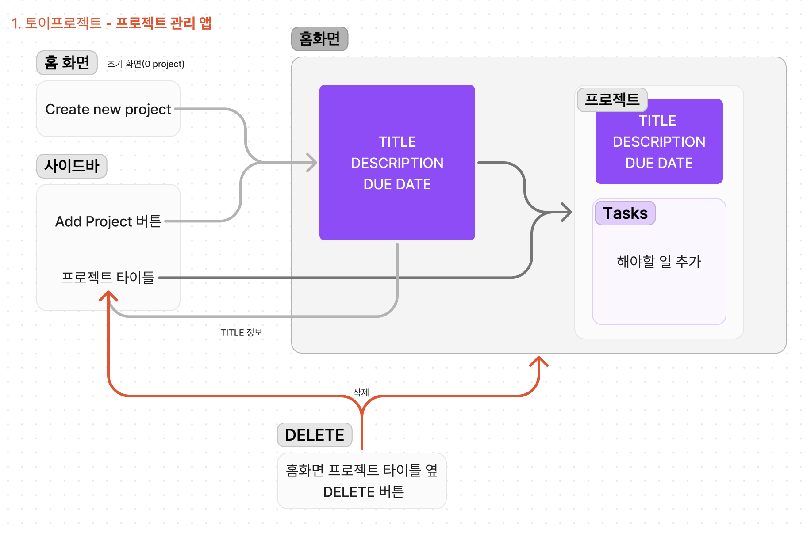

# React Practice | 프로젝트 관리 앱

[📌 스스로 만들어보기](#-스스로-만들어보기) 
 

## 📌 스스로 만들어보기

### 📖 동작
1. (아무런 프로젝트가 없었을 때) 사이드바의 Add Project나 홈의 Create new project 버튼이 나온다.
2. 해당 버튼을 누르면 TITLE, DESCRIPTION, DUE DATE(calendar)를 입력할 수 있고 Cancel과 Save 버튼을 통해서 입력을 취소할 수도, 저장할 수도 있다.
3. 프로젝트를 입력했다면, 홈화면과 사이드 바에 해당 내용을 출력한다.
4. 사이드바를 통해서 해당 프로젝트에 접속 &rarr; 홈화면에서 타이틀과 설명, 기한을 표시한다.
5. 해당 프로젝트를 진행하기 위한 Tasks들을 표시. &rarr; 입력할 수 있는 input과 Add Task버튼을 통해서 해야할 일을 추가할 수 있고, 완료(Clear)도 가능하다.

 

### 📖 디자인 설계

🔗 [디자인 설계 링크 | Figma](https://www.figma.com/file/MGt7yF2K36JISS4ejQI0mp/%ED%94%84%EB%A1%9C%EC%A0%9D%ED%8A%B8-%EA%B4%80%EB%A6%AC-%EC%95%B1?type=design&node-id=0%3A1&mode=design&t=0gxvwboR6l3gwGfG-1)

 

### 📖 완성

