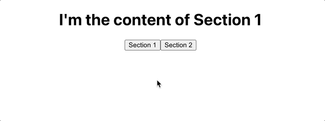
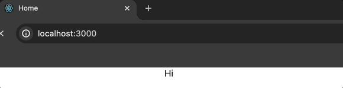
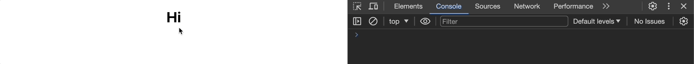

# 👩‍💻 실전형 리액트 Hooks 10개

> 노마드코더의 강의 '실전형 리액트 Hooks 10개'를 수강하면서 작성하였습니다!

> 커스텀 훅 제작에 대한 이해를 높이고 npm 업로드 방식에 대해서 공부하기 위해서 시작했습니다.

[📌 Introduction](#-introduction)<br>
[📌 `useState`](#-usestate)<br>
[📌 `useEffect`](#-useeffect)<br>
<br>

## 📌 Introduction

### 📖 `useState` 이용

- `useInput`
- `useTabs`

<br>

### 📖 `useEffect` 이용

- `useTitle`
- `useClick`
- `useConfirm`
- `usePreventLeave`
- `useHover`
- `usePageLeave`
- `useFadeIn`
- `useNetwork`
- `useScroll`
- `useFullScreen`
- `useNotification`
- `useAxios`

<br>

## 📌 `useState`

### 📖 `useInput`

```js
import { useState } from "react";

const useInput = (initialValue, validator) => {
  const [value, setValue] = useState(initialValue);
  const onChange = (event) => {
    const {
      target: { value },
    } = event;
    let willUpdate = true;

    if (typeof validator === "function") {
      willUpdate = validator(value); // true/false를 리턴해서 willUpdate를 업데이트.
    }
    if (willUpdate) {
      // willUpdate가 true이라면 업데이트
      setValue(value);
    }
  };
  return { value, onChange };
};

export default function App() {
  const maxLength = (value) => value.length <= 10; // true/false 리턴.
  const name = useInput("Mr.", maxLength);
  return (
    <div className="App">
      <h1>Hello</h1>
      <input placeholder="Name" {...name} />
    </div>
  );
}
```

1. App

   - `<input {...name}>` : `{...name}`은 name 안에 있는 `value, onChange`를 펼쳐놓는 역할을 한다. 따라서 다음과 같은 코드가 된다. `<input value={name.value} onChange={name.onChage}>`
   - `maxLength`라는 검증 함수를 생성한 `useInput` 훅에 전달할 것이고 해당 함수는 입력하는 값의 길이가 10개 이하인지 아닌지를 검사하여 참/거짓을 리턴한다.

2. useInput

   - 초기값(`initialValue`), 검증함수(`validator`)를 받아온다.
   - useState를 이용해서 받아온 초기값으로 `value`를 초기화한다.
   - input이 변화(입력시작)하면 해당 이벤트의 타겟 값을 추출하여 `value`를 업데이트한다.
   - 검증함수를 통해 willUpdate를 true/false로 업데이트 하고 만약, 해당 willUpdate가 참이라면 `value`를 업데이트한다.

   

<br>

### 📖 `useTabs`

#### 💎 useTabs.js

```js
import { useState } from "react";

const useTabs = (initialTab, allTabs) => {
  const [currentIndex, setCurrentIndex] = useState(initialTab);

  if (!allTabs || !Array.isArray(allTabs)) {
    return; // allTabs이 없거나 allTabs가 배열이 아니면 그냥 반환. -> 오류 검증
  }

  return {
    currentItem: allTabs[currentIndex],
    changeItem: setCurrentIndex,
  };
};

export default useTabs;
```

#### 💎 App.js

```js
import "./App.css";
import useTabs from "./customHooks/useTabs";

const content = [
  {
    tab: "Section 1",
    content: "I'm the content of Section 1",
  },
  {
    tab: "Section 2",
    content: "I'm the content of Section 2",
  },
];

export default function App() {
  const { currentItem, changeItem } = useTabs(0, content);
  return (
    <div className="App">
      <h1>{currentItem.content}</h1>
      {content.map((section, idx) => (
        <button onClick={() => changeItem(idx)}>{section.tab}</button>
      ))}
    </div>
  );
}
```

- 각 콘텐츠의 버튼을 누르면 `useTabs` 훅에서 받아온 `changeItem`(`setCurrentIndex`) 함수가 실행되어 `currentIndex`를 업데이트하게 되고 이에 따라서 섹션 내용이 바뀌게 된다.



<br>

## 📌 `useEffect`

### 📖 `useTitle`

#### 💎 useTitle.js

```js
import { useState, useEffect } from "react";

const useTitle = (initialTitle) => {
  const [title, setTitle] = useState(initialTitle);
  const updateTitle = () => {
    const htmlTitle = document.querySelector("title");
    htmlTitle.textContent = title;
  };
  useEffect(updateTitle, [title]);

  return setTitle;
};

export default useTitle;
```

#### 💎 App.js

```js
import "./App.css";
import useTitle from "./customHooks/useTitle";

export default function App() {
  const titleUpdater = useTitle("Loading...");
  setTimeout(() => titleUpdater("Home"), 5000);
  return (
    <div className="App">
      <div>Hi</div>
    </div>
  );
}
```



<br>

### 📖 `useClick`

#### 💎 useClick.js

```js
import { useEffect, useRef } from "react";

const useClick = (onClick) => {
  const element = useRef();

  useEffect(() => {
    const el = element.current;
    if (el) {
      el.addEventListener("click", onClick);
    }

    return () => {
      if (el) {
        el.removeEventListener("click", onClick);
      }
    };
  }, [onClick]);

  return element;
};

export default useClick;
```

#### 💎 App.js

```js
import "./App.css";
import useClick from "./customHooks/useClick";
import { useCallback } from "react";

export default function App() {
  const sayHello = useCallback(() => {
    console.log("hello");
  }, []);
  const title = useClick(sayHello);
  return (
    <div className="App">
      <h1 ref={title}>Hi</h1>
    </div>
  );
}
```



<br>

### 📖 `useConfirm` & `usePreventLeave`

#### 💎 useConfirm.js

```js
const useConfirm = (message = "", callback, rejection) => {
  if (!callback || typeof callback !== "function") {
    return;
  }
  if (!rejection || typeof rejection !== "function") {
    return;
  }
  const confirmAction = () => {
    if (window.confirm(message)) {
      callback();
    } else {
      rejection();
    }
  };

  return confirmAction;
};

export default useConfirm;
```

#### 💎 App.js

```js
import "./App.css";
import useConfirm from "./customHooks/useConfirm.js";

export default function App() {
  const deleteWorld = () => {
    console.log("deleting the world...");
  };
  const abort = () => console.log("abort...");
  const confirmDelete = useConfirm("Are you sure", deleteWorld, abort);
  return (
    <div className="App">
      <button onClick={confirmDelete}>Delete the world</button>
    </div>
  );
}
```

---

#### 💎 usePreventLeave.js

```js
const usePreventLeave = () => {
  const listener = (event) => {
    event.preventDefault();
    event.returnValue = "";
  };
  const enablePrevent = () => {
    window.addEventListener("beforeunload", listener);
  };
  const disablePrevent = () => {
    window.removeEventListener("beforeunload", listener);
  };

  return {
    enablePrevent,
    disablePrevent,
  };
};

export default usePreventLeave;
```

#### 💎 App.js

```js
import "./App.css";
import usePreventLeave from "./customHooks/usePreventLeave";

export default function App() {
  const { enablePrevent, disablePrevent } = usePreventLeave();

  return (
    <div className="App">
      <button onCLick={enablePrevent}>protect</button>
      <button onCLick={disablePrevent}>unProtect</button>
    </div>
  );
}
```

<br>

### 📖 `useBeforeLeave`

#### 💎 useBeforeLeave.js

```js
import { useEffect, useCallback } from "react";

const useBeforeLeave = (onBefore) => {
  const handle = useCallback(() => {
    onBefore();
  }, [onBefore]);
  useEffect(() => {
    document.addEventListener("mouseleave", handle);

    return () => {
      document.removeEventListener("mouseleave", handle);
    };
  }, [handle]);
};
export default useBeforeLeave;
```

#### 💎 App.js

```js
import "./App.css";
import useBeforeLeave from "./customHooks/useBeforeLeave";
import { useCallback } from "react";

export default function App() {
  const begForLife = useCallback(() => {
    console.log("Plz don't leave");
  }, []);
  useBeforeLeave(begForLife);
  return (
    <div className="App">
      <h1>Hello</h1>
    </div>
  );
}
```
