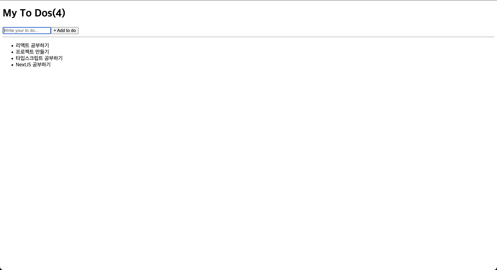
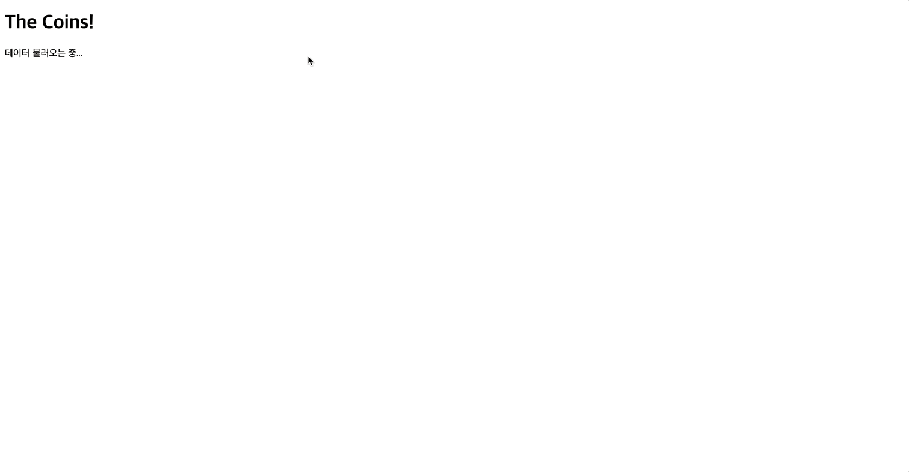
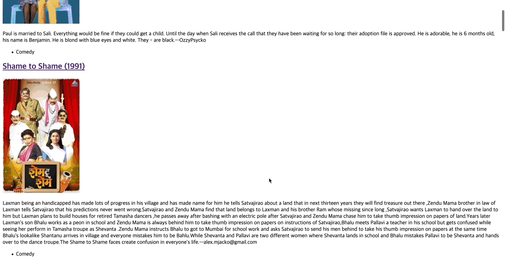

# ReactJS로 영화 웹 서비스 만들기

> 노마드코더의 강의를 통해서 그동안 배웠던 리액트에 대한 복습을 위해서 진행한 프로젝트입니다! 차후에 노마드코더의 또다른 리액트 강의를 통해서 Hook에 대한 지식을 더 강화할 예정입니다~

[📌 Introduction](#-introduction)<br>
[📌 The Basic of React](#-the-basic-of-react)<br>
[📌 State](#-state)<br>
[📌 Props](#-props)<br>
[📌 Create React App 사용하기](#-create-react-app-사용하기)<br>
[📌 Effect](#-effect)<br>
<br>

## 📌 Introduction

- 리액트는 페이스북에서 만들어졌고 현재도 많이 쓰이는 라이브러리 중 하나이다!
- 따라서 리액트에 대한 커뮤니티가 활성화되어있다. 그말인 즉슨 튜토리얼, 오류, 사용법 기타 등등이 잘 소개되어있다.
- 차후에 React Native를 배워서 모바일 앱 개발도 배울 수 있다!


<br>

## 📌 The Basic of React

### 📖 리액트 엘리먼트 만들기

```html
<!DOCTYPE html>
<html lang="en">
  <head>
    <meta charset="UTF-8" />
    <meta name="viewport" content="width=device-width, initial-scale=1.0" />
    <title>ReactJS로 영화 웹 서비스 만들기</title>
  </head>
  <body>
    <div id="root"></div>
  </body>
  <script src="https://unpkg.com/react@18/umd/react.development.js"></script>
  <script src="https://unpkg.com/react-dom@18/umd/react-dom.development.js"></script>
  <script>
    const root = document.getElementById("root");
    const span = React.createElement("span");
    ReactDOM.createRoot(root).render(span);
  </script>
</html>
```


<br>

### 📖 Events in React

```html
<!DOCTYPE html>
<html lang="en">
  <head>
    <meta charset="UTF-8" />
    <meta name="viewport" content="width=device-width, initial-scale=1.0" />
    <title>ReactJS로 영화 웹 서비스 만들기</title>
  </head>
  <body>
    <div id="root"></div>
  </body>
  <script src="https://unpkg.com/react@18/umd/react.development.js"></script>
  <script src="https://unpkg.com/react-dom@18/umd/react-dom.development.js"></script>
  <script>
    const root = document.getElementById("root");
    const h3 = React.createElement(
      "h3",
      {
        key: "h3",
        onMouseEnter: () => console.log("onMouse"),
      },
      "Hello I am a span"
    );
    const button = React.createElement(
      "button",
      {
        key: "btn",
        onClick: () => console.log("click"),
      },
      "Click me"
    );
    const container = React.createElement("div", null, [h3, button]);
    ReactDOM.createRoot(root).render(container);
  </script>
</html>
```


<br>

### 📖 JSX 도입하기

- index.html에서 요소를 추가하고 DOM에 적용하는 방식을 계속 사용하기에는 오히려 복잡한 느낌이 든다!
- JSX 코드를 이용해서 더 쉽게 작성해보자.
- JSX : 자바스크립트를 확장한 문법. 리액트 요소를 만들도록 도와주는데, HTML의 문법과 매우 비슷하다.
- Babel을 이용해 JSX로 적은 코드를 브라우저가 이해할 수 있는 형태로 바꿔줘야 한다.

```html
<!DOCTYPE html>
<html lang="en">
  <head>
    <meta charset="UTF-8" />
    <meta name="viewport" content="width=device-width, initial-scale=1.0" />
    <title>ReactJS로 영화 웹 서비스 만들기</title>
  </head>
  <body>
    <div id="root"></div>
  </body>
  <script src="https://unpkg.com/react@18/umd/react.development.js"></script>
  <script src="https://unpkg.com/react-dom@18/umd/react-dom.development.js"></script>
  <script src="https://unpkg.com/@babel/standalone/babel.min.js"></script>
  <script type="text/babel">
    const root = document.getElementById("root");
    const Title = () => {
      return (
        <h3 id="title" key="h3" onMouseEnter={() => console.log("onMouse")}>
          Hello I am a span
        </h3>
      );
    };
    const Button = () => {
      return (
        <button key="button" onClick={() => console.log("click")}>
          Click me
        </button>
      );
    };
    const Container = () => {
      return (
        <div>
          <Title />
          <Button />
        </div>
      );
    };
    ReactDOM.createRoot(root).render(<Container />);
  </script>
</html>
```

<br>

## 📌 State

### 📖 State를 이용해서 counter 업데이트하기

```html
<!DOCTYPE html>
<html lang="en">
  <head>
    <meta charset="UTF-8" />
    <meta name="viewport" content="width=device-width, initial-scale=1.0" />
    <title>ReactJS로 영화 웹 서비스 만들기</title>
  </head>
  <body>
    <div id="root"></div>
  </body>
  <script src="https://unpkg.com/react@18/umd/react.development.js"></script>
  <script src="https://unpkg.com/react-dom@18/umd/react-dom.development.js"></script>
  <script src="https://unpkg.com/@babel/standalone/babel.min.js"></script>
  <script type="text/babel">
    const root = document.getElementById("root");

    function App() {
      const [counter, setCounter] = React.useState(0);

      function handleClick() {
        setCounter((prevCounter) => prevCounter + 1);
      }
      return (
        <div>
          <h3>Total Clicks: {counter}</h3>
          <button onClick={handleClick}>Click me</button>
        </div>
      );
    }

    ReactDOM.createRoot(root).render(<App />);
  </script>
</html>
```

- React를 사용하면 counter 수가 바뀌는 부분만 업데이트 된다!

<br>

### 📖 State를 이용해 컨버터 만들기

```html
<!DOCTYPE html>
<html lang="en">
  <head>
    <meta charset="UTF-8" />
    <meta name="viewport" content="width=device-width, initial-scale=1.0" />
    <title>ReactJS로 영화 웹 서비스 만들기</title>
  </head>
  <body>
    <div id="root"></div>
  </body>
  <script src="https://unpkg.com/react@18/umd/react.development.js"></script>
  <script src="https://unpkg.com/react-dom@18/umd/react-dom.development.js"></script>
  <script src="https://unpkg.com/@babel/standalone/babel.min.js"></script>
  <script type="text/babel">
    const root = document.getElementById("root");

    function MinutesToHours() {
      const [amount, setAmount] = React.useState(0);
      const [fliped, setFliped] = React.useState(false);

      function handleChangeInput(event) {
        setAmount(event.target.value);
      }

      function reset() {
        setAmount(0);
      }

      function onFlip() {
        reset();
        setFliped((prevState) => !prevState);
      }

      return (
        <div>
          <h3>Minutes to Hours</h3>
          <div>
            <label htmlFor="minutes">Minutes</label>
            <input
              id="minutes"
              type="number"
              placeholder="Minutes"
              value={fliped ? amount * 60 : amount}
              onChange={handleChangeInput}
              disabled={fliped}
            />
          </div>
          <div>
            <label htmlFor="hours">Hours</label>
            <input
              id="hours"
              type="number"
              placeholder="Hours"
              value={fliped ? amount : Math.round(amount / 60)}
              onChange={handleChangeInput}
              disabled={!fliped}
            />
          </div>
          <button onClick={reset}>Reset</button>
          <button onClick={onFlip}>Flip</button>
        </div>
      );
    }

    function KmToMiles() {
      const [amount, setAmount] = React.useState(0);
      const [fliped, setFliped] = React.useState(false);
      function handleChangeInput(event) {
        setAmount(event.target.value);
      }
      function reset() {
        setAmount(0);
      }

      function onFlip() {
        reset();
        setFliped((prevState) => !prevState);
      }

      return (
        <div>
          <h3>km 2 m </h3>
          <div>
            <label htmlFor="km">Km</label>
            <input
              id="km"
              type="number"
              placeholder="Km"
              value={fliped ? amount * 1.609 : amount}
              onChange={handleChangeInput}
              disabled={fliped}
            />
          </div>
          <div>
            <label htmlFor="hours">Miles</label>
            <input
              id="miles"
              type="number"
              placeholder="Miles"
              value={fliped ? amount : amount / 1.609}
              onChange={handleChangeInput}
              disabled={!fliped}
            />
          </div>
          <button onClick={reset}>Reset</button>
          <button onClick={onFlip}>Flip</button>
        </div>
      );
    }

    function App() {
      const [index, setIndex] = React.useState("xx");

      function onSelect(event) {
        setIndex(event.target.value);
      }
      return (
        <div>
          <h1>Super Converter</h1>
          <select value={index} onChange={onSelect}>
            <option value="xx"> Select Your Units </option>
            <option value="0"> Minutes & Hours </option>
            <option value="1"> Km & Miles </option>
          </select>
          <hr />
          {index === "xx" ? <h3>Plz select your units</h3> : null}
          {index === "0" ? <MinutesToHours /> : null}
          {index === "1" ? <KmToMiles /> : null}
        </div>
      );
    }

    ReactDOM.createRoot(root).render(<App />);
  </script>
</html>
```

<br>

## 📌 Props

### 📖 props를 이용해서 같은 스타일의 버튼 적용하기

```html
<!DOCTYPE html>
<html lang="en">
  <head>
    <meta charset="UTF-8" />
    <meta name="viewport" content="width=device-width, initial-scale=1.0" />
    <title>ReactJS로 영화 웹 서비스 만들기</title>
  </head>
  <body>
    <div id="root"></div>
  </body>
  <script src="https://unpkg.com/react@18/umd/react.development.js"></script>
  <script src="https://unpkg.com/react-dom@18/umd/react-dom.development.js"></script>
  <script src="https://unpkg.com/@babel/standalone/babel.min.js"></script>
  <script type="text/babel">
    function Btn({ children, changeValue }) {
      return (
        <button
          onClick={changeValue}
          style={{
            backgroundColor: "tomato",
            color: "white",
            padding: "10px 20px",
            border: 0,
            borderRadius: 10,
          }}
        >
          {children}
        </button>
      );
    }
    const MemorizedBtn = React.memo(Btn);
    function App() {
      const [value, setValue] = React.useState("Save Changes");
      const changeValue = () => setValue("Revert Changes");
      return (
        <div>
          <MemorizedBtn changeValue={changeValue}>{value}</MemorizedBtn>
          <MemorizedBtn>Confirm</MemorizedBtn>
        </div>
      );
    }

    const root = document.getElementById("root");
    ReactDOM.createRoot(root).render(<App />);
  </script>
</html>
```

- `memo`를 이용해 처음 렌더링 된 것에서 어떠한 변화도 없었다면 재렌더링(재실행) 되지 않도록 하였다!

<br>

## 📌 Create React App 사용하기

🔗 [create react app 정식 문서 바로가기](https://create-react-app.dev/docs/getting-started)

### 📖 설치하기

- `npx create-react-app my-app`
- `npm i prop-types`

<br>

## 📌 Effect

```js
import Button from "./Button";
import styles from "./App.module.css";

import { useState, useEffect } from "react";

function App() {
  const [counter, setCounter] = useState(0);
  const [keyword, setKeyword] = useState("");

  const onClick = () => setCounter((prevCounter) => prevCounter + 1);
  const onChange = (event) => {
    setKeyword(event.target.value);
  };

  useEffect(() => {
    console.log("CALL THE API..");
  }, []);
  useEffect(() => {
    if (keyword !== "") {
      console.log("SEARCH FOR", keyword);
    }
  }, [keyword]);

  console.log("I run all the time.");

  return (
    <div>
      <input
        value={keyword}
        onChange={onChange}
        type="text"
        placeholder="Search here..."
      />
      <h1 className={styles.title}>{counter}</h1>
      <Button onClick={onClick} text={"Continue"} />
    </div>
  );
}

export default App;
```

<br>

## 📌 Practice Movie App

### 📖 To Do List

```js
import { useState } from "react";

function App() {
  const [toDos, setToDos] = useState([]);

  function onSubmit(event) {
    event.preventDefault();
    const fd = new FormData(event.target);
    const data = Object.fromEntries(fd.entries());

    setToDos((prevTodos) => {
      return [...prevTodos, data];
    });

    event.target.reset();
  }
  console.log(toDos);
  return (
    <div>
      <h1>My To Dos({toDos.length})</h1>
      <form onSubmit={onSubmit}>
        <input type="text" name="todo" placeholder="Write your to do..." />
        <button type="submit">+ Add to do</button>
      </form>
      <hr />
      <ul>
        {toDos.map((todo, idx) => (
          <li key={`${todo.todo}-${idx}`}>{todo.todo}</li>
        ))}
      </ul>
    </div>
  );
}

export default App;
```



<br>

### 📖 Coin Tracker

```js
// import Todo from "./Todo";

import { useEffect, useState } from "react";

function App() {
  const [loading, setLoading] = useState(false);
  const [coins, setCoins] = useState([]);

  useEffect(() => {
    setLoading(true);
    async function fetchCoinData() {
      const response = await fetch("https://api.coinpaprika.com/v1/tickers");
      if (!response.ok) {
        throw new Error("데이터를 가져올 수 없습니다.");
      }
      const resData = await response.json();
      return resData;
    }

    try {
      fetchCoinData().then((data) => {
        setCoins(data);
        setLoading(false);
      });
    } catch (error) {
      console.log(error);
    }
  }, []);

  return (
    <div>
      <h1>The Coins!{!loading && `(${coins.length})`}</h1>

      {loading && <p>데이터 불러오는 중...</p>}
      {!loading && (
        <>
          <select>
            {coins.map((coin) => (
              <option key={coin.id}>
                {coin.name}({coin.symbol}) : ${coin.quotes["USD"].price} USD
              </option>
            ))}
          </select>
        </>
      )}
    </div>
  );
}

export default App;
```



<br>

### 📖 Movie app - 1 | 데이터 가져오기

#### 💎 App.js

```js
// import Todo from "./Todo";
// import Coin from "./Coin";

import { useState, useEffect } from "react";
import Movie from "./Movie";

function App() {
  const [loading, setLoading] = useState(false);
  const [movies, setMovies] = useState([]);
  useEffect(() => {
    setLoading(true);
    async function fetchMovies() {
      const response = await fetch(
        "https://yts.mx/api/v2/list_movies.json?minimum_rating=8.5?sort_by=year"
      );
      if (!response.ok) {
        throw new Error("데이터를 가져오는데 실패했습니다.");
      }
      const resData = await response.json();
      return resData.data.movies;
    }

    try {
      fetchMovies().then((movies) => {
        setMovies(movies);
        setLoading(false);
      });
    } catch (error) {
      console.log(error);
    }
  }, []);

  return (
    <div>
      {loading && <p>데이터를 가져오는 중...</p>}
      <div>
        {!loading &&
          movies &&
          movies.map((movie) => (
            <Movie
              key={movie.id}
              title={movie.title_long}
              coverImg={movie.medium_cover_image}
              summary={movie.summary}
              genres={movie.genres}
            />
          ))}
      </div>
    </div>
  );
}

export default App;
```

#### 💎 Movie.js

```js
import PropTypes from "prop-types";

export default function Movie({ title, coverImg, summary, genres }) {
  return (
    <div>
      <h2>{title}</h2>
      
      <p>{summary}</p>
      <ul>
        {genres.map((genre) => (
          <li key={genre}>{genre}</li>
        ))}
      </ul>
    </div>
  );
}

Movie.propTypes = {
  title: PropTypes.string.isRequired,
  coverImg: PropTypes.string.isRequired,
  summary: PropTypes.string.isRequired,
  genres: PropTypes.arrayOf(PropTypes.string).isRequired,
};
```


<br>

### 📖 React Router 사용하기

- 설치 : `npm install react-router-dom`

#### 💎 App.js

```js
import { createBrowserRouter, RouterProvider } from "react-router-dom";
import Home from "./routes/Home";
import Detail from "./routes/Detail";
import Root from "./routes/Root";

const router = createBrowserRouter([
  {
    path: "/",
    element: <Root />,
    children: [
      {
        index: true,
        element: <Home />,
      },
      {
        path: "movie/:id",
        element: <Detail />,
      },
    ],
  },
]);

function App() {
  return <RouterProvider router={router} />;
}

export default App;
```

#### 💎 Root.js

```js
import { Outlet, Link } from "react-router-dom";
export default function Root() {
  return (
    <>
      <header>
        <nav>
          <ul>
            <li>
              <Link to="/">Home</Link>
            </li>
          </ul>
        </nav>
      </header>
      <Outlet />
    </>
  );
}
```

#### 💎 Home.js

```js
import { useState, useEffect } from "react";
import Movie from "../components/Movie";

export default function Home() {
  const [loading, setLoading] = useState(false);
  const [movies, setMovies] = useState([]);
  useEffect(() => {
    setLoading(true);
    async function fetchMovies() {
      const response = await fetch(
        "https://yts.mx/api/v2/list_movies.json?minimum_rating=9?sort_by=year"
      );
      if (!response.ok) {
        throw new Error("데이터를 가져오는데 실패했습니다.");
      }
      const resData = await response.json();
      console.log(resData.data.movies);
      return resData.data.movies;
    }

    try {
      fetchMovies().then((movies) => {
        setMovies(movies);
        setLoading(false);
      });
    } catch (error) {
      console.log(error);
    }
  }, []);

  return (
    <div>
      {loading && <p>데이터를 가져오는 중...</p>}
      <div>
        {!loading &&
          movies &&
          movies.map((movie) => (
            <Movie
              key={movie.id}
              id={movie.id}
              title={movie.title_long}
              coverImg={movie.medium_cover_image}
              summary={movie.summary}
              genres={movie.genres}
            />
          ))}
      </div>
    </div>
  );
}
```

#### 💎 Detail.js

```js
import { useEffect, useState } from "react";
import { useParams } from "react-router-dom";

export default function Detail() {
  const [loading, setLoading] = useState(false);
  const [movieDetail, setMovieDetail] = useState([]);
  const { id } = useParams();

  async function fetchMovieDetail(id) {
    console.log(id);
    const response = await fetch(
      `https://yts.mx/api/v2/movie_details.json?movie_id=${id}`
    );
    if (!response.ok) {
      throw new Error("해당 영화 정보를 불러오는데 실패했습니다.");
    }
    const resData = await response.json();

    return resData;
  }

  useEffect(() => {
    try {
      setLoading(true);
      fetchMovieDetail(id).then((resData) => {
        const movieDetailData = resData.data.movie;
        setMovieDetail(movieDetailData);
        setLoading(false);
      });
    } catch (error) {
      console.log(error);
    }
  }, [id]);

  console.log(movieDetail);
  return (
    <div>
      {loading && <p>데이터를 불러오는 중입니다.</p>}
      {!loading && <p>{movieDetail.title}</p>}
    </div>
  );
}
```


