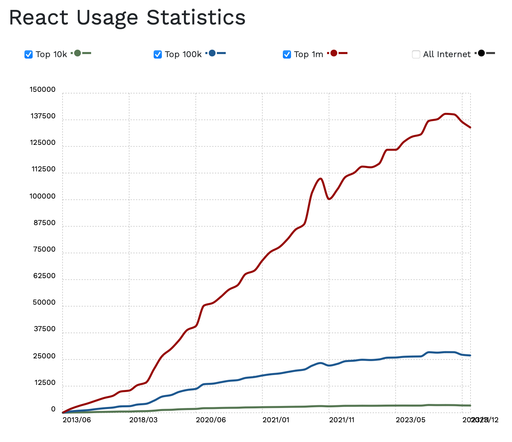
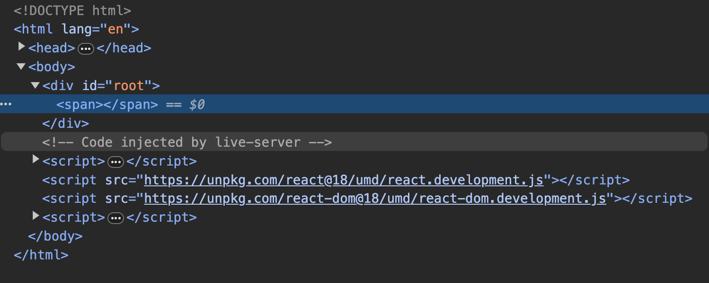
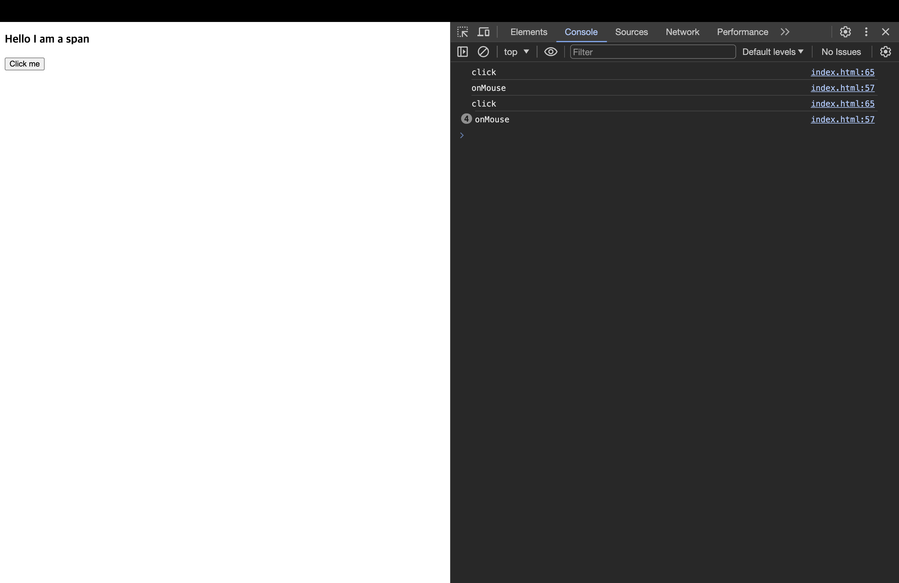

# ReactJS로 영화 웹 서비스 만들기

> 노마드코더의 강의를 통해서 그동안 배웠던 리액트에 대한 복습을 위해서 진행한 프로젝트입니다! 차후에 노마드코더의 또다른 리액트 강의를 통해서 Hook에 대한 지식을 더 강화할 예정입니다~

[📌 Introduction](#-introduction)<br>
[📌 The Basic of React](#-the-basic-of-react)<br>
[📌 State](#-state)<br>
<br>

## 📌 Introduction

- 리액트는 페이스북에서 만들어졌고 현재도 많이 쓰이는 라이브러리 중 하나이다!
- 따라서 리액트에 대한 커뮤니티가 활성화되어있다. 그말인 즉슨 튜토리얼, 오류, 사용법 기타 등등이 잘 소개되어있다.
- 차후에 React Native를 배워서 모바일 앱 개발도 배울 수 있다!



<br>

## 📌 The Basic of React

### 📖 리액트 엘리먼트 만들기

```html
<!DOCTYPE html>
<html lang="en">
  <head>
    <meta charset="UTF-8" />
    <meta name="viewport" content="width=device-width, initial-scale=1.0" />
    <title>ReactJS로 영화 웹 서비스 만들기</title>
  </head>
  <body>
    <div id="root"></div>
  </body>
  <script src="https://unpkg.com/react@18/umd/react.development.js"></script>
  <script src="https://unpkg.com/react-dom@18/umd/react-dom.development.js"></script>
  <script>
    const root = document.getElementById("root");
    const span = React.createElement("span");
    ReactDOM.createRoot(root).render(span);
  </script>
</html>
```



<br>

### 📖 Events in React

```html
<!DOCTYPE html>
<html lang="en">
  <head>
    <meta charset="UTF-8" />
    <meta name="viewport" content="width=device-width, initial-scale=1.0" />
    <title>ReactJS로 영화 웹 서비스 만들기</title>
  </head>
  <body>
    <div id="root"></div>
  </body>
  <script src="https://unpkg.com/react@18/umd/react.development.js"></script>
  <script src="https://unpkg.com/react-dom@18/umd/react-dom.development.js"></script>
  <script>
    const root = document.getElementById("root");
    const h3 = React.createElement(
      "h3",
      {
        key: "h3",
        onMouseEnter: () => console.log("onMouse"),
      },
      "Hello I am a span"
    );
    const button = React.createElement(
      "button",
      {
        key: "btn",
        onClick: () => console.log("click"),
      },
      "Click me"
    );
    const container = React.createElement("div", null, [h3, button]);
    ReactDOM.createRoot(root).render(container);
  </script>
</html>
```



<br>

### 📖 JSX 도입하기

- index.html에서 요소를 추가하고 DOM에 적용하는 방식을 계속 사용하기에는 오히려 복잡한 느낌이 든다!
- JSX 코드를 이용해서 더 쉽게 작성해보자.
- JSX : 자바스크립트를 확장한 문법. 리액트 요소를 만들도록 도와주는데, HTML의 문법과 매우 비슷하다.
- Babel을 이용해 JSX로 적은 코드를 브라우저가 이해할 수 있는 형태로 바꿔줘야 한다.

```html
<!DOCTYPE html>
<html lang="en">
  <head>
    <meta charset="UTF-8" />
    <meta name="viewport" content="width=device-width, initial-scale=1.0" />
    <title>ReactJS로 영화 웹 서비스 만들기</title>
  </head>
  <body>
    <div id="root"></div>
  </body>
  <script src="https://unpkg.com/react@18/umd/react.development.js"></script>
  <script src="https://unpkg.com/react-dom@18/umd/react-dom.development.js"></script>
  <script src="https://unpkg.com/@babel/standalone/babel.min.js"></script>
  <script type="text/babel">
    const root = document.getElementById("root");
    const Title = () => {
      return (
        <h3 id="title" key="h3" onMouseEnter={() => console.log("onMouse")}>
          Hello I am a span
        </h3>
      );
    };
    const Button = () => {
      return (
        <button key="button" onClick={() => console.log("click")}>
          Click me
        </button>
      );
    };
    const Container = () => {
      return (
        <div>
          <Title />
          <Button />
        </div>
      );
    };
    ReactDOM.createRoot(root).render(<Container />);
  </script>
</html>
```

<br>

## 📌 State

### 📖 State를 이용해서 counter 업데이트하기

```html
<!DOCTYPE html>
<html lang="en">
  <head>
    <meta charset="UTF-8" />
    <meta name="viewport" content="width=device-width, initial-scale=1.0" />
    <title>ReactJS로 영화 웹 서비스 만들기</title>
  </head>
  <body>
    <div id="root"></div>
  </body>
  <script src="https://unpkg.com/react@18/umd/react.development.js"></script>
  <script src="https://unpkg.com/react-dom@18/umd/react-dom.development.js"></script>
  <script src="https://unpkg.com/@babel/standalone/babel.min.js"></script>
  <script type="text/babel">
    const root = document.getElementById("root");

    function App() {
      const [counter, setCounter] = React.useState(0);

      function handleClick() {
        setCounter((prevCounter) => prevCounter + 1);
      }
      return (
        <div>
          <h3>Total Clicks: {counter}</h3>
          <button onClick={handleClick}>Click me</button>
        </div>
      );
    }

    ReactDOM.createRoot(root).render(<App />);
  </script>
</html>
```

- React를 사용하면 counter 수가 바뀌는 부분만 업데이트 된다!
