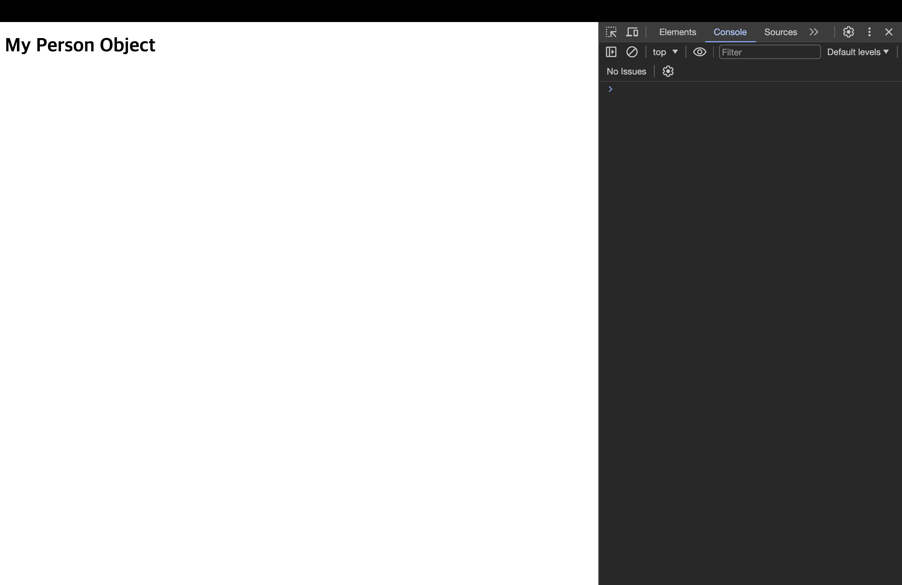
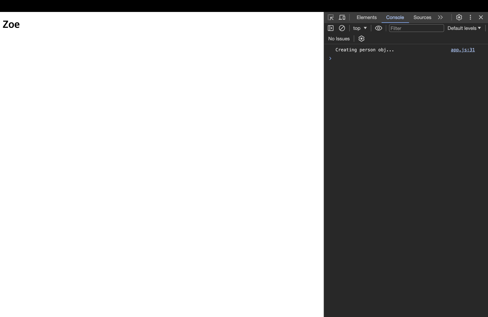

# 데코레이터

[📌 데코레이터](#-데코레이터)<br>
<br>

## 📌 데코레이터

### 📖 소개

- 데코레이터는 메타 프로그래밍에 아주 유용하다. 이 말인 즉슨 데코레이터의 주 사용처가 페이지의 최종 사용자에게 직접 영향을 주는 곳이 아니라는 의미이다.
- 데코레이터는 코드 작성에 특화된 장치로서 다른 개발자들이 사용하기 쉽게 만드는 것이 목적이다.
- 클래스나 클래스의 메서드가 올바르게 사용되었는지 확인하는 작업이나 내부적인 변환 작업 등을 수행하는 데 사용된다.

<br>

### 📖 첫 번째 클래스 데코레이터

1. tsconfig.json 에서 `"experimentalDecorators": true`로 세팅.
2. 데코레이터 작성

```ts
// 데코레이터는 결국 함수.
function Logger(constructor: Function) {
  console.log("Logging...");
  console.log(constructor);
}

@Logger
class Person {
  name = "Max";
  constructor() {
    console.log("Creating person obj...");
  }
}

const pers = new Person();
console.log(pers);

// Logging...
// class Person {
//     constructor() {
//         this.name = "Max";
//         console.log("Creating person obj...");
//     }
// }
// Creating person obj...
// Person {name: 'Max'}
```

> `@` : 이 기호 바로 뒤에는 반드시 함수를 지정해야한다. 실행하는게 아니라 지정하면 해당 함수가 데코레이터가 된다.

- 데코레이터에서 출력한 로그, 즉 생성자 함수를 출력하는 로그가 Person 객체와 관련된 코드보다 먼저 실행되었다. &rarr; 데코레이터는 클래스가 인스턴스화될 때가 아니라 정의될 때 실행된다.
- 클래스의 인스턴스화하는 코드를 삭제해도 로그는 출력될 것이다.
  > 데코레이터는 자바스크립트가 클래스 정의와 생성자 함수 정의를 만난 시점에 실행된다.

<br>

### 📖 데코레이터 팩토리 작업하기

- 데코레이터 팩토리는 데코레이터 함수를 반환하는데, 이를 데코레이터로 추가할 때 원하는 값을 설정할 수 있다.

```ts
// ===== 첫 번째 클래스 데코레이터 =====
// 데코레이터는 결국 함수.
function Logger(logString: string) {
  return function (constructor: Function) {
    console.log(logString);
    console.log(constructor);
  };
}

@Logger("LOGGING - PERSON")
class Person {
  name = "Max";
  constructor() {
    console.log("Creating person obj...");
  }
}

const pers = new Person();
console.log(pers);

// LOGGING - PERSON
// class Person {
//     constructor() {
//         this.name = "Max";
//         console.log("Creating person obj...");
//     }
// }
// Creating person obj...
// Person {name: 'Max'}
```

- 데코레이터 함수가 실행될 때 사용할 값을 팩토리 함수를 통해 커스터마이징이 가능하다.
- 팩토리를 사용하면 값을 전달해 내부에서 반환되는 데코레이터 함수에서 사용할 수 있다.

<br>

### 📖 더 유용한 데코레이터 만들기

```ts
function WithTemplate(template: string, hookId: string) {
  return function (_: Function) {
    // _ : 인자가 들어오는 것을 알지만 필요치 않다.
    const hookEl = document.getElementById(hookId);
    if (hookEl) {
      hookEl.innerHTML = template;
    }
  };
}

@WithTemplate("<h1>My Person Object</h1>", "app")
class Person {
  name = "Max";
  constructor() {
    console.log("Creating person obj...");
  }
}
```



<br>

```ts
function WithTemplate(template: string, hookId: string) {
  return function (constructor: any) {
    const hookEl = document.getElementById(hookId);
    const p = new constructor();
    if (hookEl) {
      hookEl.innerHTML = template;
      hookEl.querySelector("h1")!.textContent = p.name;
    }
  };
}

@WithTemplate("<h1>My Person Object</h1>", "app")
class Person {
  name = "Zoe";
  constructor() {
    console.log("Creating person obj...");
  }
}
```



- 데코레이터는 개발자가 클래스 같은 데 추가해 사용하는 도구에 불과하다. 따라서 개발자들이 특정 클래스에서 화면에 무언가를 렌더링하고자 할 때 편리하게 사용할 수 있는 유틸리티를 제공한 것. &rarr; 앵귤러와 비슷!

<br>

### 📖 여러 데코레이터 추가하기

- 데코레이터를 사용할 수 있는 곳이라면 어디든지 1개 이상의 데코레이터를 추가할 수 있다.

```ts
function Logger(logString: string) {
  console.log("LOGGER FACTORY");
  return function (constructor: Function) {
    console.log(logString);
    console.log(constructor);
  };
}

function WithTemplate(template: string, hookId: string) {
  console.log("TEMPLATE FACTORY");
  return function (constructor: any) {
    console.log("Rendering Template");
    const hookEl = document.getElementById(hookId);
    const p = new constructor();
    if (hookEl) {
      hookEl.innerHTML = template;
      hookEl.querySelector("h1")!.textContent = p.name;
    }
  };
}

@Logger("LOGGING - PERSON")
@WithTemplate("<h1>My Person Object</h1>", "app")
class Person {
  name = "Zoe";
  constructor() {
    console.log("Creating person obj...");
  }
}

// LOGGER FACTORY
// TEMPLATE FACTORY
// Rendering Template
// Creating person obj...
// LOGGING - PERSON
// class Person {
//     constructor() {
//         this.name = "Zoe";
//         console.log("Creating person obj...");
//     }
// }
```

> 데코레이터 실행 순서가 상향식(Bottom-Up)이라는 것을 알 수 있다. 밑에 있는 데코레이터가 먼저 실행되고 위의 것이 나중에 실행되었다.

- 데코레이터 팩토리는 하향식(Top-Down)식으로 이뤄진다. &rarr; `@`가 있어도 해당 부분에서 실행되는 것은 결국 함수니깐!

<br>

### 📖 속성(property) 데코레이터에 대해 알아보기

```ts
function Log(target: any, propertyName: string | Symbol) {
  console.log("Property decorator!");
  console.log(target, propertyName);
}

class Product {
  @Log
  title: string;
  private _price: number;

  set price(val: number) {
    if (val > 0) {
      this._price = val;
    } else {
      throw new Error("옳지 않은 갑 - positive 여야한다.");
    }
  }

  constructor(t: string, p: number) {
    this.title = t;
    this._price = p;
  }

  getPriceWithTax(tax: number) {
    return this._price * (1 + tax);
  }
}

// Property decorator!
// {getPriceWithTax: ƒ}
//     constructor: class Product
//     getPriceWithTax: ƒ getPriceWithTax(tax)
//     set price: ƒ price(val)
//     [[Prototype]]: Object
// 'title'
```

- 출력된 값(target, propertyName)은 각각 객체의 프로토타입과 프로퍼티 이름이다.
  - 프로토 타입에는 `title`과 `_price`는 없지만 `getPriceWithTax, set`와 같은 메서드가 들어있다. 프로토타입에는 메서드를 포함하기 때문.
  - 프로퍼티 이름은 title로 현재 우리가 작업 중이다.

> `Product`를 인스턴스화하는 곳은 없기 때문에 데코레이터는 자바스크립트에 클래스 정의가 등록되는 시점에 실행된다.

- 즉, 자바스크립트에 이 프로퍼티를 클래스의 일부, 생성자 함수의 일부로 정의한 시점에 실행된다.

```ts
// 만약 이렇게 한다면
class Product {
  title: string;
  @Log
  private _price: number;
}

// 출력되는 프로퍼티 네임은 '_price'다!
```

<br>

### 📖 접근자 & 매개변수 데코레이터

```ts
function Log2(target: any, name: string, descriptor: PropertyDescriptor) {
  console.log("Accessor decorator!");
  console.log(target);
  console.log(name);
  console.log(descriptor);
}

function Log3(
  target: any,
  name: string | Symbol,
  descriptor: PropertyDescriptor
) {
  console.log("Method decorator!");
  console.log(target);
  console.log(name);
  console.log(descriptor);
}

function Log4(target: any, name: string | Symbol, position: number) {
  console.log("Parameter decorator!");
  console.log(target);
  console.log(name);
  console.log(position);
}

class Product {
  @Log
  title: string;
  private _price: number;

  @Log2
  set price(val: number) {
    if (val > 0) {
      this._price = val;
    } else {
      throw new Error("옳지 않은 갑 - positive 여야한다.");
    }
  }

  constructor(t: string, p: number) {
    this.title = t;
    this._price = p;
  }

  @Log3
  getPriceWithTax(@Log4 tax: number) {
    return this._price * (1 + tax);
  }
}

// Accessor decorator!
// {getPriceWithTax: ƒ} -> 프로토타입
//  price
// {get: undefined, enumerable: false, configurable: true, set: ƒ}

// Parameter decorator!
// {getPriceWithTax: ƒ}
// getPriceWithTax
// 0

// Method decorator!
// {getPriceWithTax: ƒ}
// getPriceWithTax
// {writable: true, enumerable: false, configurable: true, value: ƒ}
```

1. Accessor decorator

   - 프로토타입과 접근자 이름인 price(`set price()`), 프로퍼티 설명자가 출력되었다.
   - 프로퍼티 설명자는 다음과 같이 출력되어있다.

2. Parameter decorator(매개변수)
   - 프로토타입과 메서드의 이름(getPriceWithTax)이 출력되었고, 해당 매개변수의 인덱스가 나왔다.
   - 인덱스는 0부터 시작하므로 첫번째 매개변수의 번호인 '0'이 출력되었다.

```ts
// 접근자 데코레이터(Accessor Decorator)
// {get: undefined, enumerable: false, configurable: true, set: ƒ}
//      configurable: true
//      enumerable: false
//      get: undefined
//      set: ƒ price(val)
//      [[Prototype]]: Object

// 메서드 데코레이터
// {writable: true, enumerable: false, configurable: true, value: ƒ}
//    configurable: true
//    enumerable: false
//    value: ƒ getPriceWithTax(tax)
//    writable: true
//    [[Prototype]]: Object
```

- Accessor Decorator에서 getter는 작성하지 않아서 `undefined`, setter는 `set price`로 작성했으니 정보가 나와있다.

<br>

### 📖 데코레이터는 언제 실행하는가

- 프로퍼티 데코레이터, 메서드 데코레이트, 접근자 데코레이터, 매개변수 데코레이터든 클래스를 정의하는 시점에 실행된다.
- 데코레이터는 메서드를 호출할 때나 포로퍼티를 사용할 때처럼 런타임에 실행되는 것이 아니다.
- 데코레이터를 사용하면 클래스가 정의될 때 배후에서 부가적인 설정 작업을 진행할 수 있다.

> 데코레이터 자체는 클래스가 정의될 때나 메서드 등이 등록될 때 실행되는 함수일 뿐이다.

<br>

### 📖 클래스 데코레이터에서 클래스 반환 및 변경

- 클래스 정의 시점이 아닌 인스턴스 되는 시점에서 동작하도록 변경!

```ts
function WithTemplate(template: string, hookId: string) {
  console.log("TEMPLATE FACTORY");
  return function <T extends { new (...args: any[]): { name: string } }>(
    originalConstructor: T
  ) {
    return class extends originalConstructor {
      constructor(...args: any[]) {
        // ...args => ..._도 된다.
        super(); // 기존 클래스의 동작 보존
        console.log("Rendering Template");
        const hookEl = document.getElementById(hookId);
        if (hookEl) {
          hookEl.innerHTML = template;
          hookEl.querySelector("h1")!.textContent = this.name;
        }
      }
    };
  };
}

@Logger("LOGGING - PERSON")
@WithTemplate("<h1>My Person Object</h1>", "app")
class Person {
  name = "Zoe";
  constructor() {
    console.log("Creating person obj...");
  }
}

const pers = new Person();
console.log(pers);
```

- 기존 생성자 함수를 바탕으로 하고있다. 그래서 기존 클래스, 즉 기존 생성자 함수의 모든 프로퍼티가 그대로 보존된다. &rarr; 꼭 해야하는 것은 아니다! 해당 프로퍼티를 계속 가져가고 싶어서 extends함.
- 위처럼 하면 새로운 생성자 함수로 대체하여 기존에 있던 로직 뿐만 아니라 새로운 로직도 함께 수행.
- 이렇게 하면 실제로 객체의 인스턴스가 생성될 때만 템플릿이 DOM에 렌더링된다. 그러면 클래스가 정의되자마자 데코레이터 함수가 실행되어 템플릿을 렌더링하는 것을 방지할 수 있다.

- 만약 Person을 인스턴스하지 않았다면(`const pers = new Person()`을 하지 않았다면) 렌더링이 되지 않는다.
