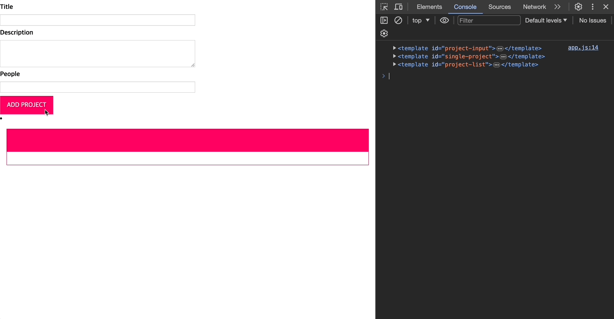
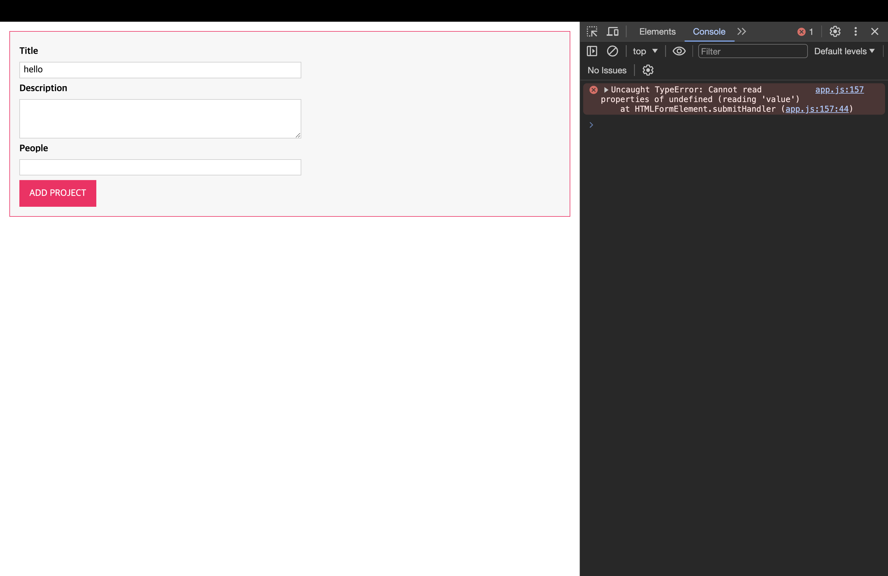
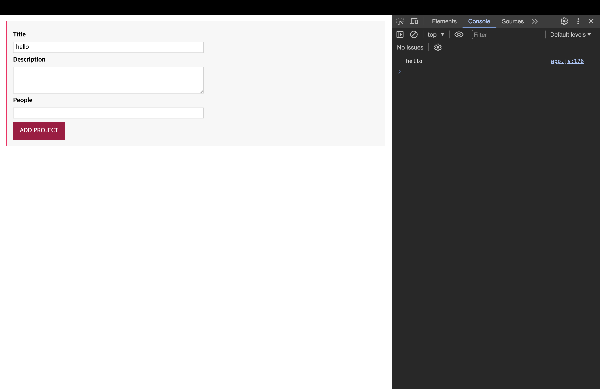
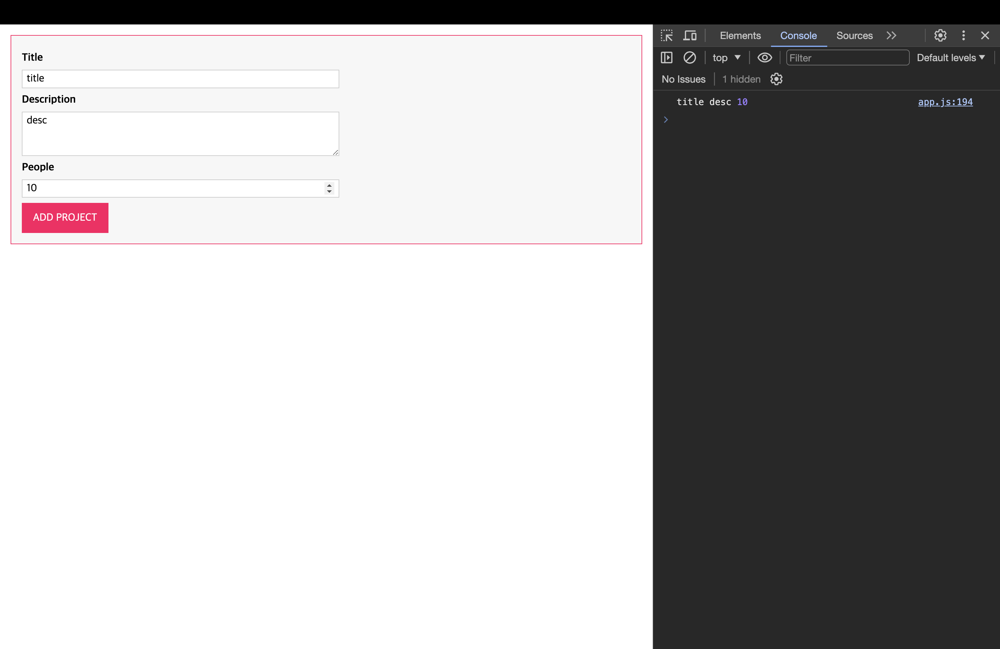
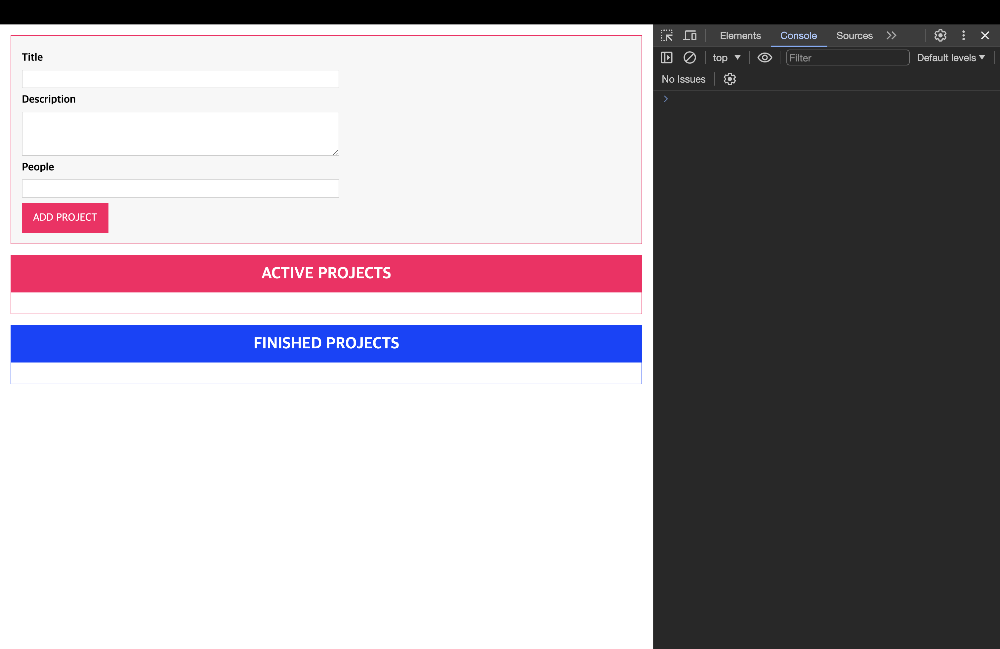
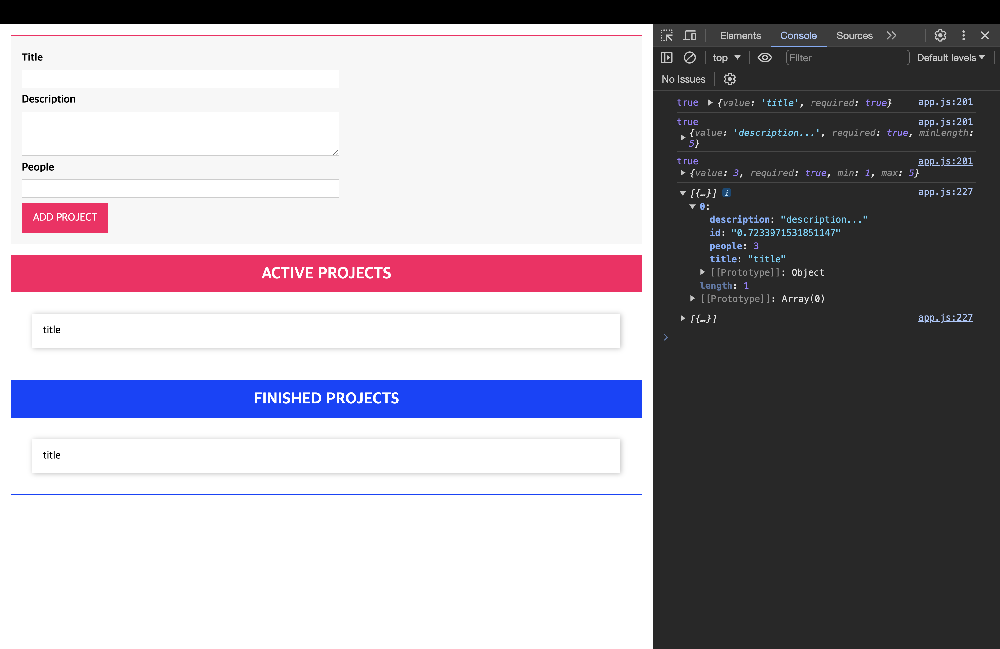
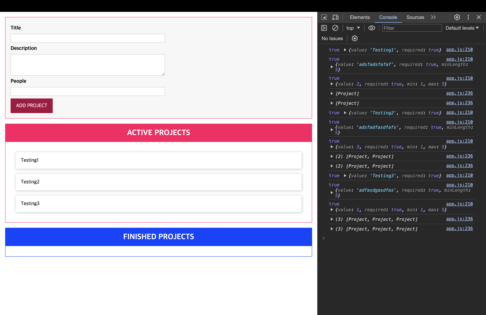
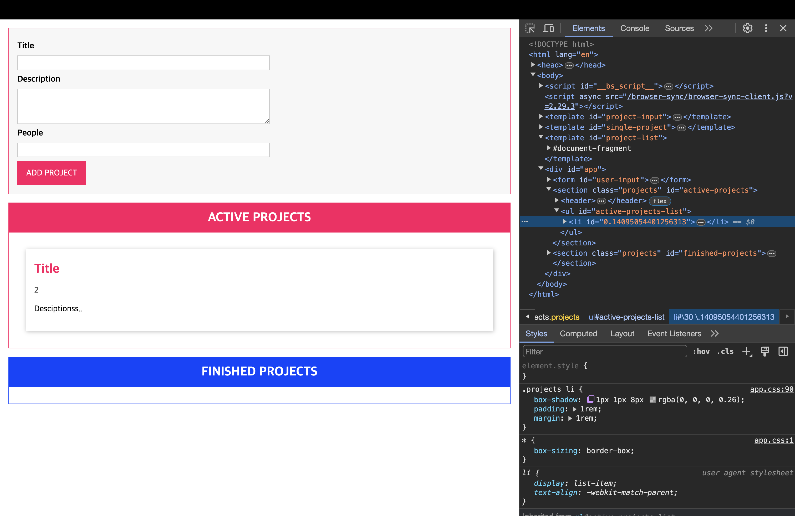
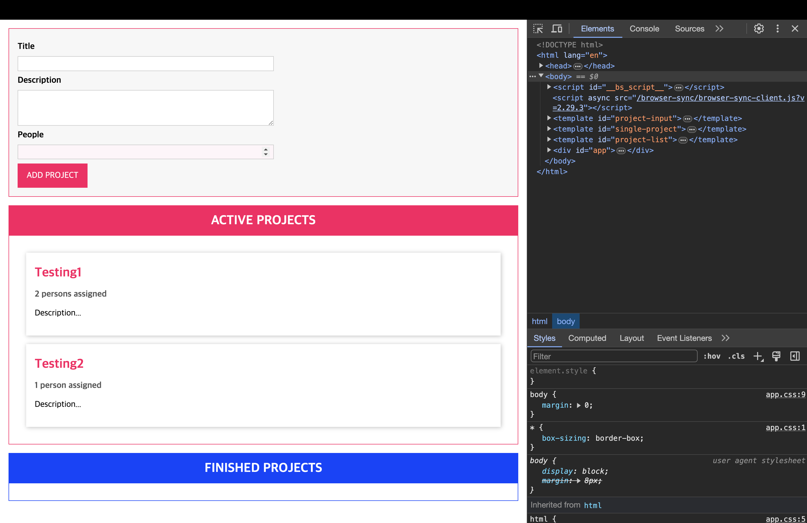

# Practice - Drag & Drop 프로젝트

[📌 스스로 해보기](#-스스로-해보기)<br>
[📌 강사 코드](#-강사-코드)<br>
<br>

## 📌 스스로 해보기

- `template`는 기본 HTML 태그로, 이 태그를 쓰면 즉시 로딩되지 않는(즉각적으로 보이지 않는) HTML 코드를 지정할 수 있다. 즉, 즉각적으로 렌더링되지 않는다는 의미.

### 📖 Template 출력하기

```ts
const app = document.getElementById("app") as HTMLDivElement;

function printTemplate(hookId: string) {
  return function (constructor: any) {
    const hookEl = document.getElementById(hookId);
    const template = new constructor();
    const { projectInput, singleProject, projectList } = template;
    console.log(projectInput, singleProject, projectList);

    const projectInputEl = projectInput.content.cloneNode(
      true
    ) as DocumentFragment;
    const singleProjectEl = singleProject.content.cloneNode(
      true
    ) as DocumentFragment;
    const projectListEl = projectList.content.cloneNode(
      true
    ) as DocumentFragment;

    if (hookEl) {
      hookEl.appendChild(projectInputEl);
      hookEl.appendChild(singleProjectEl);
      hookEl.appendChild(projectListEl);
    }
  };
}

@printTemplate("app")
class indexTemplate {
  projectInput: HTMLTemplateElement;
  singleProject: HTMLTemplateElement;
  projectList: HTMLTemplateElement;

  constructor() {
    this.projectInput = document.getElementById(
      "project-input"
    ) as HTMLTemplateElement;
    this.singleProject = document.getElementById(
      "single-project"
    ) as HTMLTemplateElement;
    this.projectList = document.getElementById(
      "project-list"
    ) as HTMLTemplateElement;
  }
}
```

- 데코레이터 팩토리를 이용해서 template을 출력
- hookId('app')을 받아와서 id가 app인 `<div>` 안에 템플릿 삽입

<br>

### 📖 버튼 눌렀을 때 Validation

```ts
const submitBtn = document.querySelector("form button");
submitBtn?.addEventListener("click", (e) => {
  e.preventDefault();
  const titleEl = document.getElementById("title") as HTMLInputElement;
  const descEl = document.getElementById("description") as HTMLInputElement;
  const peopleEl = document.getElementById("people") as HTMLInputElement;

  const title = titleEl.value;
  const desc = descEl.value;
  const people = +peopleEl.value;

  const form = new FormSubmit(title, desc, people);
  if (!validationFn(form)) {
    throw new Error("잘못된 값이 입력되었습니다. 다시 시도해 주세요.");
  }
  console.log(form);
});

// ==== validation ====
interface ValidateConfig {
  [property: string]: {
    [validatableProp: string]: string[];
  };
}
const registeredValidators: ValidateConfig = {};

function isRequired(target: any, propName: string) {
  registeredValidators[target.constructor.name] = {
    ...registeredValidators[target.constructor.name],
    [propName]: ["required"],
  };
}

function isString(target: any, propName: string) {
  registeredValidators[target.constructor.name] = {
    ...registeredValidators[target.constructor.name],
    [propName]: [
      ...registeredValidators[target.constructor.name][propName],
      "string",
    ],
  };
}

function isNumber(target: any, propName: string) {
  registeredValidators[target.constructor.name] = {
    ...registeredValidators[target.constructor.name],
    [propName]: [
      ...registeredValidators[target.constructor.name][propName],
      "positive",
    ],
  };
}

function validationFn(createdForm: any) {
  const validateConfig = registeredValidators[createdForm.constructor.name];
  if (!validateConfig) {
    return true;
  }

  let isValid = true;
  for (const prop in validateConfig) {
    console.log(createdForm[prop]);
    for (const validator of validateConfig[prop]) {
      switch (validator) {
        case "required":
          isValid = isValid && !!createdForm[prop];
          break;
        case "positive":
          isValid = isValid && createdForm[prop] > 0;
          break;
        case "string":
          isValid = isValid && typeof createdForm[prop] === "string";
          break;
      }
    }
  }
  return isValid;
}
// ==== validation ====

class FormSubmit {
  @isString
  @isRequired
  title: string;

  @isString
  @isRequired
  desc: string;

  @isNumber
  @isRequired
  people: number;

  constructor(title: string, desc: string, people: number) {
    this.title = title;
    this.desc = desc;
    this.people = people;
  }
}
```

- `FormSubmit` 클래스 안에 title, desc, people을 각각 받아온 뒤, 데코레이터를 이용해서 validation 진행
- 인터페이스를 이용해서 기본 validationConfig를 작성. `registeredValidators`을 이용해서 초기화 진행
- 폼은 안에 값이 채워져야하고 title, description은 string. people은 number 타입을 가질 수 있도록 검증
- `['required', 'positive/string']`와 같은 형식으로 중복으로 데코레이터를 적용해서 삽입할 필요가 있으므로 다음과 같이 데코레이터 작성

  ```ts
  function isNumber(target: any, propName: string) {
    registeredValidators[target.constructor.name] = {
      ...registeredValidators[target.constructor.name],
      [propName]: [
        ...registeredValidators[target.constructor.name][propName], // 'required'를 위함
        "positive",
      ],
    };
  }
  ```

  

    <br>

## 📌 강사 코드

### 📖 DOM 요소 선택 및 OOP 렌더링

```ts
class ProjectInput {
  templateElement: HTMLTemplateElement;
  hostElement: HTMLDivElement;
  element: HTMLFormElement;

  constructor() {
    this.templateElement = document.getElementById(
      "project-input"
    )! as HTMLTemplateElement;
    this.hostElement = document.getElementById("app")! as HTMLDivElement;

    const importedNode = document.importNode(
      this.templateElement.content,
      true
    ); // 위에서 한 cloneNode와 비슷..
    this.element = importedNode.firstElementChild as HTMLFormElement;
    this.attach();
  }

  private attach() {
    this.hostElement.insertAdjacentElement("afterbegin", this.element);
  }
}

const prjInput = new ProjectInput();
```

<br>

### 📖 DOM 요소와 상호 작용

```ts
class ProjectInput {
  templateElement: HTMLTemplateElement;
  hostElement: HTMLDivElement;
  element: HTMLFormElement;
  titleInputElement: HTMLInputElement;
  descriptionInputElement: HTMLInputElement;
  peopleInputElement: HTMLInputElement;

  constructor() {
    this.templateElement = document.getElementById(
      "project-input"
    )! as HTMLTemplateElement;
    this.hostElement = document.getElementById("app")! as HTMLDivElement;

    const importedNode = document.importNode(
      this.templateElement.content,
      true
    ); // 위에서 한 cloneNode와 비슷..
    this.element = importedNode.firstElementChild as HTMLFormElement;

    this.element.id = "user-input";

    this.titleInputElement = this.element.querySelector(
      "#title"
    ) as HTMLInputElement;
    this.descriptionInputElement = this.element.querySelector(
      "#description"
    ) as HTMLInputElement;
    this.peopleInputElement = this.element.querySelector(
      "#people"
    ) as HTMLInputElement;

    this.configure;
    this.attach();
  }

  private submitHandler(event: Event) {
    event.preventDefault();
    console.log(this.titleInputElement.value);
  }

  private configure() {
    this.element.addEventListener("submit", this.submitHandler);
  }

  private attach() {
    this.hostElement.insertAdjacentElement("afterbegin", this.element);
  }
}

const prjInput = new ProjectInput();
```



<br>

### 📖 `Autobind` 데코레이터 생성 및 사용하기

- `submitHandler`에서 this에 대한 bind를 진행해야하는데, 이 작업을 데코레이터를 통해서 자동적으로 바인딩할 수 있도록 구현할 것이다!

```ts
// autobind decorator
function autobind(_: any, _2: string, desciptor: PropertyDescriptor) {
  const originalMethod = desciptor.value;
  const adjDescriptor: PropertyDescriptor = {
    configurable: true,
    get() {
      const boundFn = originalMethod.bind(this);
      return boundFn;
    },
  };
  return adjDescriptor;
}

// ProjectInput Class
class ProjectInput {
  templateElement: HTMLTemplateElement;
  hostElement: HTMLDivElement;
  element: HTMLFormElement;
  titleInputElement: HTMLInputElement;
  descriptionInputElement: HTMLInputElement;
  peopleInputElement: HTMLInputElement;

  constructor() {
    this.templateElement = document.getElementById(
      "project-input"
    )! as HTMLTemplateElement;
    this.hostElement = document.getElementById("app")! as HTMLDivElement;

    const importedNode = document.importNode(
      this.templateElement.content,
      true
    ); // 위에서 한 cloneNode와 비슷..
    this.element = importedNode.firstElementChild as HTMLFormElement;

    this.element.id = "user-input";

    this.titleInputElement = this.element.querySelector(
      "#title"
    ) as HTMLInputElement;
    this.descriptionInputElement = this.element.querySelector(
      "#description"
    ) as HTMLInputElement;
    this.peopleInputElement = this.element.querySelector(
      "#people"
    ) as HTMLInputElement;

    this.configure();
    this.attach();
  }

  @autobind
  private submitHandler(event: Event) {
    event.preventDefault();
    console.log(this.titleInputElement.value);
  }

  private configure() {
    this.element.addEventListener("submit", this.submitHandler);
  }

  private attach() {
    this.hostElement.insertAdjacentElement("afterbegin", this.element);
  }
}

const prjInput = new ProjectInput();
```



<br>

### 📖 사용자 입력 가지오기

```ts
// autobind decorator
function autobind(_: any, _2: string, desciptor: PropertyDescriptor) {
  const originalMethod = desciptor.value;
  const adjDescriptor: PropertyDescriptor = {
    configurable: true,
    get() {
      const boundFn = originalMethod.bind(this);
      return boundFn;
    },
  };
  return adjDescriptor;
}

// ProjectInput Class
class ProjectInput {
  templateElement: HTMLTemplateElement;
  hostElement: HTMLDivElement;
  element: HTMLFormElement;
  titleInputElement: HTMLInputElement;
  descriptionInputElement: HTMLInputElement;
  peopleInputElement: HTMLInputElement;

  constructor() {
    this.templateElement = document.getElementById(
      "project-input"
    )! as HTMLTemplateElement;
    this.hostElement = document.getElementById("app")! as HTMLDivElement;

    const importedNode = document.importNode(
      this.templateElement.content,
      true
    ); // 위에서 한 cloneNode와 비슷..
    this.element = importedNode.firstElementChild as HTMLFormElement;

    this.element.id = "user-input";

    this.titleInputElement = this.element.querySelector(
      "#title"
    ) as HTMLInputElement;
    this.descriptionInputElement = this.element.querySelector(
      "#description"
    ) as HTMLInputElement;
    this.peopleInputElement = this.element.querySelector(
      "#people"
    ) as HTMLInputElement;

    this.configure();
    this.attach();
  }

  private gatherUserInput(): [string, string, number] | undefined {
    const enteredTitle = this.titleInputElement.value;
    const enteredDesciption = this.descriptionInputElement.value;
    const enteredPeople = this.peopleInputElement.value;

    if (
      enteredTitle.trim().length === 0 ||
      enteredDesciption.trim().length === 0 ||
      enteredTitle.trim().length === 0
    ) {
      alert("데이터를 입력해 주세요.");
      return;
    } else {
      return [enteredTitle, enteredDesciption, +enteredPeople];
    }
  }

  @autobind
  private submitHandler(event: Event) {
    event.preventDefault();
    const userInput = this.gatherUserInput();
    if (Array.isArray(userInput)) {
      // 타입스크립트엣헌 튜플이나 자바스크립트에선 튜플이 없으므로 Array
      const [title, desc, people] = userInput;
      console.log(title, desc, people);
      this.clearInput();
    }
  }

  private clearInput() {
    this.titleInputElement.value = "";
    this.descriptionInputElement.value = "";
    this.peopleInputElement.value = "";
  }

  private configure() {
    this.element.addEventListener("submit", this.submitHandler);
  }

  private attach() {
    this.hostElement.insertAdjacentElement("afterbegin", this.element);
  }
}

const prjInput = new ProjectInput();
```

- `this.clearInput()` 적용 전
  

- `this.clearInput()` 적용 후
  

<br>

### 📖 재사용 가능한 검증 기능 생성

```ts
// Validation
interface Validatable {
  value: string | number;
  required?: boolean;
  minLength?: number;
  maxLength?: number;
  min?: number;
  max?: number;
}

function validate(validatableInput: Validatable) {
  let isValid = true;
  if (validatableInput.required) {
    isValid = isValid && validatableInput.value.toString().trim().length !== 0;
  }
  if (
    validatableInput.minLength != null &&
    typeof validatableInput.value === "string"
  ) {
    isValid =
      isValid && validatableInput.value.length >= validatableInput.minLength;
  }
  if (
    validatableInput.maxLength != null &&
    typeof validatableInput.value === "string"
  ) {
    isValid =
      isValid && validatableInput.value.length <= validatableInput.maxLength;
  }
  if (
    validatableInput.min != null &&
    typeof validatableInput.value === "number"
  ) {
    isValid = isValid && validatableInput.value >= validatableInput.min;
  }
  if (
    validatableInput.max != null &&
    typeof validatableInput.value === "number"
  ) {
    isValid = isValid && validatableInput.value <= validatableInput.max;
  }
  console.log(isValid, validatableInput);
  return isValid;
}

// autobind decorator
function autobind(_: any, _2: string, desciptor: PropertyDescriptor) {
  const originalMethod = desciptor.value;
  const adjDescriptor: PropertyDescriptor = {
    configurable: true,
    get() {
      const boundFn = originalMethod.bind(this);
      return boundFn;
    },
  };
  return adjDescriptor;
}

// ProjectInput Class
class ProjectInput {
  templateElement: HTMLTemplateElement;
  hostElement: HTMLDivElement;
  element: HTMLFormElement;
  titleInputElement: HTMLInputElement;
  descriptionInputElement: HTMLInputElement;
  peopleInputElement: HTMLInputElement;

  constructor() {
    this.templateElement = document.getElementById(
      "project-input"
    )! as HTMLTemplateElement;
    this.hostElement = document.getElementById("app")! as HTMLDivElement;

    const importedNode = document.importNode(
      this.templateElement.content,
      true
    ); // 위에서 한 cloneNode와 비슷..
    this.element = importedNode.firstElementChild as HTMLFormElement;

    this.element.id = "user-input";

    this.titleInputElement = this.element.querySelector(
      "#title"
    ) as HTMLInputElement;
    this.descriptionInputElement = this.element.querySelector(
      "#description"
    ) as HTMLInputElement;
    this.peopleInputElement = this.element.querySelector(
      "#people"
    ) as HTMLInputElement;

    this.configure();
    this.attach();
  }

  private gatherUserInput(): [string, string, number] | undefined {
    const enteredTitle = this.titleInputElement.value;
    const enteredDesciption = this.descriptionInputElement.value;
    const enteredPeople = this.peopleInputElement.value;

    const titleValidatable: Validatable = {
      value: enteredTitle,
      required: true,
    };
    const desciptionValidatable: Validatable = {
      value: enteredDesciption,
      required: true,
      minLength: 5,
    };

    const peopleValidatable: Validatable = {
      value: +enteredPeople,
      required: true,
      min: 1,
      max: 5,
    };

    if (
      !validate(titleValidatable) ||
      !validate(desciptionValidatable) ||
      !validate(peopleValidatable)
    ) {
      alert("데이터를 입력해 주세요.");
      return;
    } else {
      return [enteredTitle, enteredDesciption, +enteredPeople];
    }
  }

  @autobind
  private submitHandler(event: Event) {
    event.preventDefault();
    const userInput = this.gatherUserInput();
    if (Array.isArray(userInput)) {
      // 타입스크립트엣헌 튜플이나 자바스크립트에선 튜플이 없으므로 Array
      const [title, desc, people] = userInput;
      console.log(title, desc, people);
      this.clearInput();
    }
  }

  private clearInput() {
    this.titleInputElement.value = "";
    this.descriptionInputElement.value = "";
    this.peopleInputElement.value = "";
  }

  private configure() {
    this.element.addEventListener("submit", this.submitHandler);
  }

  private attach() {
    this.hostElement.insertAdjacentElement("afterbegin", this.element);
  }
}

const prjInput = new ProjectInput();
```

- validation 추가

<br>

### 📖 렌더링 프로젝트 목록

```ts
// ProjectList Class
class ProjectList {
  templateElement: HTMLTemplateElement;
  hostElement: HTMLDivElement;
  element: HTMLElement;

  constructor(private type: "active" | "finished") {
    this.templateElement = document.getElementById(
      "project-list"
    )! as HTMLTemplateElement;
    this.hostElement = document.getElementById("app")! as HTMLDivElement;

    const importedNode = document.importNode(
      this.templateElement.content,
      true
    ); // 위에서 한 cloneNode와 비슷..
    this.element = importedNode.firstElementChild as HTMLElement;
    this.element.id = `${type}-projects`;

    this.attach();
    this.renderContent();
  }

  private renderContent() {
    const listId = `${this.type}-projects-list`;
    this.element.querySelector("ul")!.id = listId;
    this.element.querySelector("h2")!.textContent =
      this.type.toUpperCase() + " PROJECTS";
  }

  private attach() {
    this.hostElement.insertAdjacentElement("beforeend", this.element);
  }
}

const activePrjList = new ProjectList("active");
const finishedPrjList = new ProjectList("finished");
```



<br>

### 📖 싱글톤으로 애플리케이션 상태 관리하기

#### 💎 ProjectState 초기 작성 및 submitHandler에 적용하기

- 앱의 상태를 관리하는 클래스

```ts
// Project State Management
class ProjectState {
  private projects: any[] = [];
  private static instance: ProjectState;

  private constructor() {}

  static getInstance() {
    if (this.instance) {
      return this.instance;
    }
    this.instance = new ProjectState();
    return this.instance;
  }

  addProject(title: string, description: string, numOfPeople: number) {
    const newProject = {
      id: Math.random().toString(),
      title: title,
      description: description,
      people: numOfPeople,
    };
    this.projects.push(newProject);
  }
}

const projectState = ProjectState.getInstance(); // 앱 전체에서 하나의 타입으로 된 객체만 갖게 될 것이다.
```

- `getInstance`를 통해서 앱 전체에서 하나의 타입으로 된 객체만 가질 수 있도록 하였다.

```ts
// ProjectInput class
@autobind
  private submitHandler(event: Event) {
    event.preventDefault();
    const userInput = this.gatherUserInput();
    if (Array.isArray(userInput)) {
      // 타입스크립트엣헌 튜플이나 자바스크립트에선 튜플이 없으므로 Array
      const [title, desc, people] = userInput;
      projectState.addProject(title, desc, people);
      this.clearInput();
    }
  }
```

- `ProjectInput` 클래스 안에 `submitHandler` 메서드에서 `projectState.addProject()`를 통해 생성한 프로젝트를 추가.

<br>

#### 💎 ProjectState 개선 및 ProjectList 클래스를 통해 렌더링하기

```ts
// ProjectState
// Project State Management
class ProjectState {
  private listeners: any[] = [];
  private projects: any[] = [];
  private static instance: ProjectState;

  private constructor() {}

  static getInstance() {
    if (this.instance) {
      return this.instance;
    }
    this.instance = new ProjectState();
    return this.instance;
  }

  addListener(listenerFn: Function) {
    this.listeners.push(listenerFn);
  }

  addProject(title: string, description: string, numOfPeople: number) {
    const newProject = {
      id: Math.random().toString(),
      title: title,
      description: description,
      people: numOfPeople,
    };
    this.projects.push(newProject);
    for (const listenerFn of this.listeners) {
      listenerFn(this.projects.slice()); // slice : 원본 대신 사본을 통해서 동작.
    }
  }
}

const projectState = ProjectState.getInstance(); // 앱 전체에서 하나의 타입으로 된 객체만 갖게 될 것이다.
```

- listener를 통해서 렌더링을 할 수 있도록 addListener와 listeners 생성

```ts
// ProjectList Class
class ProjectList {
  templateElement: HTMLTemplateElement;
  hostElement: HTMLDivElement;
  element: HTMLElement;
  assignedProjects: any[]; // 추가

  constructor(private type: "active" | "finished") {
    this.templateElement = document.getElementById(
      "project-list"
    )! as HTMLTemplateElement;
    this.hostElement = document.getElementById("app")! as HTMLDivElement;
    this.assignedProjects = []; // 초기화

    const importedNode = document.importNode(
      this.templateElement.content,
      true
    );
    this.element = importedNode.firstElementChild as HTMLElement;
    this.element.id = `${type}-projects`;

    // Listener에 대한 함수 작성
    projectState.addListener((projects: any[]) => {
      console.log(projects);
      this.assignedProjects = projects;
      this.renderProjects();
    });

    this.attach();
    this.renderContent();
  }

  // 생성한 프로젝트를 렌더링을 하기 위한 함수 작성
  private renderProjects() {
    const listEl = document.getElementById(
      `${this.type}-projects-list`
    )! as HTMLUListElement;
    for (const prjItem of this.assignedProjects) {
      const listItem = document.createElement("li");
      listItem.textContent = prjItem.title;
      listEl?.appendChild(listItem);
    }
  }

  private renderContent() {
    const listId = `${this.type}-projects-list`;
    this.element.querySelector("ul")!.id = listId;
    this.element.querySelector("h2")!.textContent =
      this.type.toUpperCase() + " PROJECTS";
  }

  private attach() {
    this.hostElement.insertAdjacentElement("beforeend", this.element);
  }
}
```

#### 💎 결과



<br>

### 📖 더 많은 클래스 및 사용자 정의 타입

#### 💎 Project의 타입을 관리하기 위한 클래스 및 Listener 타입 작성.

```ts
// Project Type
enum ProjectStatus {
  Active,
  Finished,
}

class Project {
  constructor(
    public id: string,
    public title: string,
    public description: string,
    public people: number,
    public status: ProjectStatus
  ) {}
}

type Listener = (items: Project[]) => void;
```

#### 💎 Project 클래스, Listener 타입 적용

- ProjectState

```ts
class ProjectState {
  private listeners: Listener[] = []; // Listener 적용
  private projects: Project[] = []; // Project 적용
  private static instance: ProjectState;

  private constructor() {}

  static getInstance() {
    if (this.instance) {
      return this.instance;
    }
    this.instance = new ProjectState();
    return this.instance;
  }

  addListener(listenerFn: Listener) {
    // Listener 타입 적용
    this.listeners.push(listenerFn);
  }

  addProject(title: string, description: string, numOfPeople: number) {
    // Project 클래스를 이용해서 newProject 생성
    const newProject = new Project(
      Math.random().toString(),
      title,
      description,
      numOfPeople,
      ProjectStatus.Active
    );
    this.projects.push(newProject);
    for (const listenerFn of this.listeners) {
      listenerFn(this.projects.slice());
    }
  }
}
```

- ProjectList

```ts
class ProjectList {
  templateElement: HTMLTemplateElement;
  hostElement: HTMLDivElement;
  element: HTMLElement;
  assignedProjects: Project[]; // Project 클래스 적용

  constructor(private type: "active" | "finished") {
    this.templateElement = document.getElementById(
      "project-list"
    )! as HTMLTemplateElement;
    this.hostElement = document.getElementById("app")! as HTMLDivElement;
    this.assignedProjects = [];

    const importedNode = document.importNode(
      this.templateElement.content,
      true
    );
    this.element = importedNode.firstElementChild as HTMLElement;
    this.element.id = `${type}-projects`;

    projectState.addListener((projects: Project[]) => {
      // Project 클래스 적용
      console.log(projects);
      this.assignedProjects = projects;
      this.renderProjects();
    });

    this.attach();
    this.renderContent();
  }

  private renderProjects() {
    const listEl = document.getElementById(
      `${this.type}-projects-list`
    )! as HTMLUListElement;
    for (const prjItem of this.assignedProjects) {
      const listItem = document.createElement("li");
      listItem.textContent = prjItem.title;
      listEl?.appendChild(listItem);
    }
  }

  private renderContent() {
    const listId = `${this.type}-projects-list`;
    this.element.querySelector("ul")!.id = listId;
    this.element.querySelector("h2")!.textContent =
      this.type.toUpperCase() + " PROJECTS";
  }

  private attach() {
    this.hostElement.insertAdjacentElement("beforeend", this.element);
  }
}
```

#### 💎 결과


<br>

### 📖 열거형으로 프로젝트 필터링하기

해결해야할 문제들..

1. 프로젝트가 Active, Finished 둘 다 표현됨.
2. 중복으로 표시되는 프로젝트 아이템들이 있다.

#### 💎 1번 문제 해결

```ts
class ProjectList {
  templateElement: HTMLTemplateElement;
  hostElement: HTMLDivElement;
  element: HTMLElement;
  assignedProjects: Project[];

  constructor(private type: "active" | "finished") {
    this.templateElement = document.getElementById(
      "project-list"
    )! as HTMLTemplateElement;
    this.hostElement = document.getElementById("app")! as HTMLDivElement;
    this.assignedProjects = [];

    const importedNode = document.importNode(
      this.templateElement.content,
      true
    );
    this.element = importedNode.firstElementChild as HTMLElement;
    this.element.id = `${type}-projects`;

    projectState.addListener((projects: Project[]) => {
      console.log(projects);
      // filter 함수를 이용해서 type이 active/finished 일 때를 구분하여 표현할 수 있도록 함.
      const relevantProjects = projects.filter((prj) => {
        if (this.type === "active") {
          return prj.status === ProjectStatus.Active;
        } else {
          return prj.status === ProjectStatus.Finished;
        }
      });
      this.assignedProjects = relevantProjects;
      this.renderProjects();
    });

    this.attach();
    this.renderContent();
  }
  private renderProjects() {
    const listEl = document.getElementById(
      `${this.type}-projects-list`
    )! as HTMLUListElement;
    for (const prjItem of this.assignedProjects) {
      const listItem = document.createElement("li");
      listItem.textContent = prjItem.title;
      listEl?.appendChild(listItem);
    }
  }

  private renderContent() {
    const listId = `${this.type}-projects-list`;
    this.element.querySelector("ul")!.id = listId;
    this.element.querySelector("h2")!.textContent =
      this.type.toUpperCase() + " PROJECTS";
  }

  private attach() {
    this.hostElement.insertAdjacentElement("beforeend", this.element);
  }
}
```

#### 💎 2번 문제 해결

```ts
// ProjectList의 메서드
private renderProjects() {
    const listEl = document.getElementById(
      `${this.type}-projects-list`
    )! as HTMLUListElement;
    listEl.innerHTML = ""; // 아예 초기화 해서 추가할 때마다 표현하는 방식
    for (const prjItem of this.assignedProjects) {
      const listItem = document.createElement("li");
      listItem.textContent = prjItem.title;
      listEl.appendChild(listItem);
    }
  }
```

#### 💎 결과



<br>

### 📖 상속 & 제네릭 추가하기

#### 💎 Base 클래스 작성하기

- Base Component 클래스

```ts
// Componenet Base Class
abstract class Component<T extends HTMLElement, U extends HTMLElement> {
  templateElement: HTMLTemplateElement;
  hostElement: T;
  element: U;

  constructor(
    templateId: string,
    hostId: string,
    insertAtStart: boolean,
    newElementId?: string
  ) {
    this.templateElement = document.getElementById(
      templateId
    )! as HTMLTemplateElement;
    this.hostElement = document.getElementById(hostId)! as T;

    const importedNode = document.importNode(
      this.templateElement.content,
      true
    );
    this.element = importedNode.firstElementChild as U;
    if (newElementId) {
      this.element.id = newElementId;
    }

    this.attach(insertAtStart);
  }

  private attach(insertAtBeginning: boolean) {
    this.hostElement.insertAdjacentElement(
      insertAtBeginning ? "afterbegin" : "beforeend",
      this.element
    );
  }

  abstract configures?(): void;
  abstract renderContent(): void;
}
```

- Base State 클래스

```ts
type Listener<T> = (items: T[]) => void;

class State<T> {
  protected listeners: Listener<T>[] = []; // 외부에선 선언이 불가하나 상속 받으면 사용가능.

  addListener(listenerFn: Listener<T>) {
    this.listeners.push(listenerFn);
  }
}
```

#### 💎 Base 클래스 적용하기

- ProjectList : Component 상속

```ts
// ProjectList Class
class ProjectList extends Component<HTMLDivElement, HTMLElement> {
  assignedProjects: Project[];

  constructor(private type: "active" | "finished") {
    super("project-list", "app", false, `${type}-projects`);
    this.assignedProjects = []; // 초기화
    this.configures();
    this.renderContent();
  }

  configures() {
    projectState.addListener((projects: Project[]) => {
      console.log(projects);
      const relevantProjects = projects.filter((prj) => {
        if (this.type === "active") {
          return prj.status === ProjectStatus.Active;
        } else {
          return prj.status === ProjectStatus.Finished;
        }
      });
      this.assignedProjects = relevantProjects;
      this.renderProjects();
    });
  }

  renderContent() {
    const listId = `${this.type}-projects-list`;
    this.element.querySelector("ul")!.id = listId;
    this.element.querySelector("h2")!.textContent =
      this.type.toUpperCase() + " PROJECTS";
  }

  private renderProjects() {
    const listEl = document.getElementById(
      `${this.type}-projects-list`
    )! as HTMLUListElement;
    listEl.innerHTML = ""; // 아예 초기화 해서 추가할 때마다 표현하는 방식
    for (const prjItem of this.assignedProjects) {
      const listItem = document.createElement("li");
      listItem.textContent = prjItem.title;
      listEl.appendChild(listItem);
    }
  }
}
```

- ProjectInput : Component 상속

```ts
// ProjectInput Class
class ProjectInput extends Component<HTMLDivElement, HTMLFormElement> {
  titleInputElement: HTMLInputElement;
  descriptionInputElement: HTMLInputElement;
  peopleInputElement: HTMLInputElement;

  constructor() {
    super("project-input", "app", true, "user-input");

    this.titleInputElement = this.element.querySelector(
      "#title"
    ) as HTMLInputElement;
    this.descriptionInputElement = this.element.querySelector(
      "#description"
    ) as HTMLInputElement;
    this.peopleInputElement = this.element.querySelector(
      "#people"
    ) as HTMLInputElement;

    this.configures();
  }

  configures() {
    this.element.addEventListener("submit", this.submitHandler);
  }

  renderContent() {}

  private gatherUserInput(): [string, string, number] | undefined {
    const enteredTitle = this.titleInputElement.value;
    const enteredDesciption = this.descriptionInputElement.value;
    const enteredPeople = this.peopleInputElement.value;

    const titleValidatable: Validatable = {
      value: enteredTitle,
      required: true,
    };
    const desciptionValidatable: Validatable = {
      value: enteredDesciption,
      required: true,
      minLength: 5,
    };

    const peopleValidatable: Validatable = {
      value: +enteredPeople,
      required: true,
      min: 1,
      max: 5,
    };

    if (
      !validate(titleValidatable) ||
      !validate(desciptionValidatable) ||
      !validate(peopleValidatable)
    ) {
      alert("데이터를 입력해 주세요.");
      return;
    } else {
      return [enteredTitle, enteredDesciption, +enteredPeople];
    }
  }

  @autobind
  private submitHandler(event: Event) {
    event.preventDefault();
    const userInput = this.gatherUserInput();
    if (Array.isArray(userInput)) {
      // 타입스크립트엣헌 튜플이나 자바스크립트에선 튜플이 없으므로 Array
      const [title, desc, people] = userInput;
      projectState.addProject(title, desc, people);
      this.clearInput();
    }
  }

  private clearInput() {
    this.titleInputElement.value = "";
    this.descriptionInputElement.value = "";
    this.peopleInputElement.value = "";
  }
}
```

- ProjectState : State 클래스 상속

```ts
class ProjectState extends State<Project> {
  private projects: Project[] = [];
  private static instance: ProjectState;

  private constructor() {
    super();
  }

  static getInstance() {
    if (this.instance) {
      return this.instance;
    }
    this.instance = new ProjectState();
    return this.instance;
  }

  addProject(title: string, description: string, numOfPeople: number) {
    const newProject = new Project(
      Math.random().toString(),
      title,
      description,
      numOfPeople,
      ProjectStatus.Active
    );
    this.projects.push(newProject);
    for (const listenerFn of this.listeners) {
      listenerFn(this.projects.slice());
    }
  }
}
```

<br>

### 📖 클래스로 프로젝트 항목 렌더링

#### 💎 ProjectItem

```ts
// ProjectItem Class
class ProjectItem extends Component<HTMLUListElement, HTMLLIElement> {
  private project: Project;

  constructor(hostId: string, project: Project) {
    super("single-project", hostId, false, project.id);
    this.project = project;

    this.configures();
    this.renderContent();
  }

  configures() {}
  renderContent() {
    this.element.querySelector("h2")!.textContent = this.project.title;
    this.element.querySelector("h3")!.textContent =
      this.project.people.toString();
    this.element.querySelector("p")!.textContent = this.project.description;
  }
}
```

#### 💎 ProjectItem 적용하기

```ts
// ProjectList Class
class ProjectList extends Component<HTMLDivElement, HTMLElement> {
  assignedProjects: Project[];

  constructor(private type: "active" | "finished") {
    super("project-list", "app", false, `${type}-projects`);
    this.assignedProjects = [];
    this.configures();
    this.renderContent();
  }

  configures() {
    projectState.addListener((projects: Project[]) => {
      console.log(projects);
      const relevantProjects = projects.filter((prj) => {
        if (this.type === "active") {
          return prj.status === ProjectStatus.Active;
        } else {
          return prj.status === ProjectStatus.Finished;
        }
      });
      this.assignedProjects = relevantProjects;
      this.renderProjects();
    });
  }

  renderContent() {
    const listId = `${this.type}-projects-list`;
    this.element.querySelector("ul")!.id = listId;
    this.element.querySelector("h2")!.textContent =
      this.type.toUpperCase() + " PROJECTS";
  }

  private renderProjects() {
    const listEl = document.getElementById(
      `${this.type}-projects-list`
    )! as HTMLUListElement;
    listEl.innerHTML = "";
    // ProjectItem 적용
    for (const prjItem of this.assignedProjects) {
      new ProjectItem(this.element.querySelector("ul")!.id, prjItem);
    }
  }
}
```



<br>

### 📖 게터 사용하기

```ts
// ProjectItem Class
class ProjectItem extends Component<HTMLUListElement, HTMLLIElement> {
  private project: Project;

  get persons() {
    if (this.project.people === 1) {
      return "1 person";
    } else {
      return `${this.project.people} persons`;
    }
  }

  constructor(hostId: string, project: Project) {
    super("single-project", hostId, false, project.id);
    this.project = project;

    this.configures();
    this.renderContent();
  }

  configures() {}
  renderContent() {
    this.element.querySelector("h2")!.textContent = this.project.title;
    this.element.querySelector("h3")!.textContent = this.persons + " assigned"; // getter 적용
    this.element.querySelector("p")!.textContent = this.project.description;
  }
}
```


