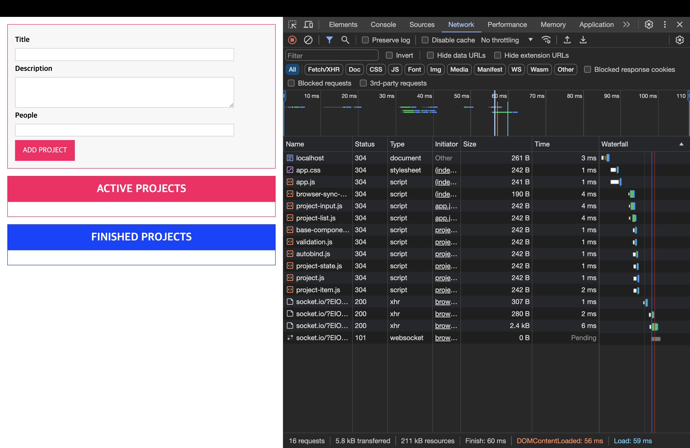
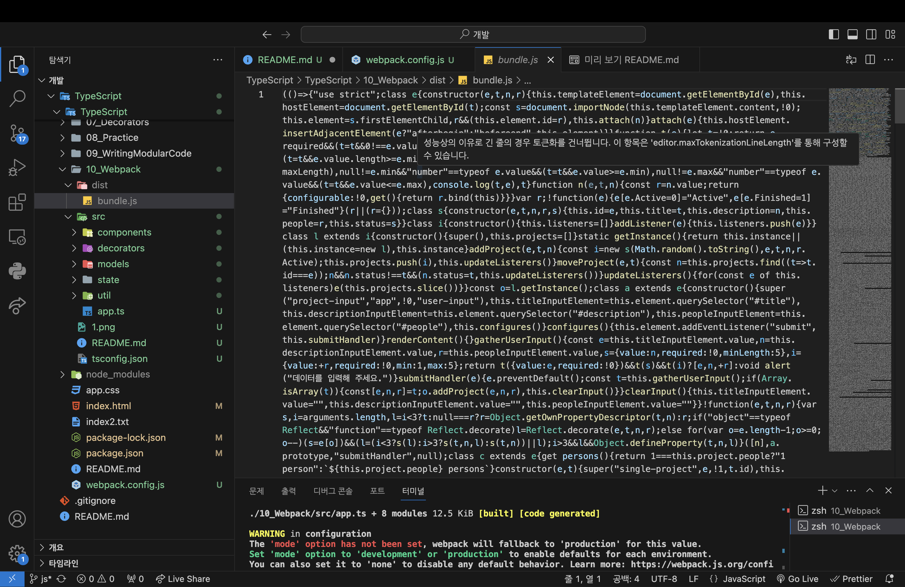
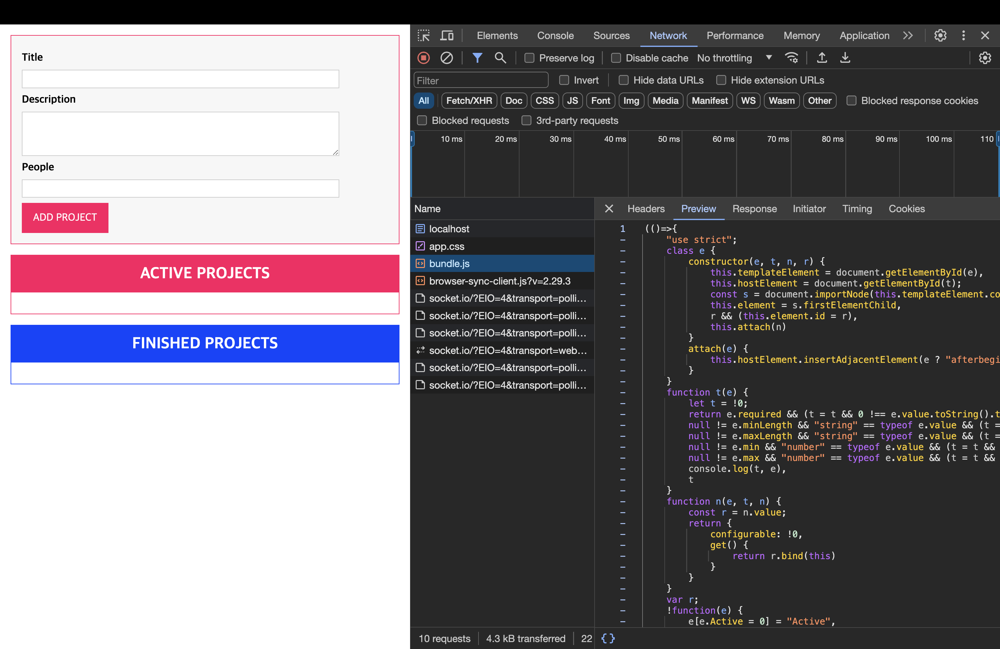

# TypeScript와 함께 Webpack 사용하기

[📌 Webpack](#-webpack)<br>
<br>

## 📌 Webpack

### 📖 Webpack이란 무엇이며 왜 필요한가



- 파일 다운로드가 빨리 된다고 해도 서버에서 파일을 준비하는데 시간이 소요괸다.
- 웹에서 배포했다면, 요청이 많아졌을 때 지연 시간이 길어지고 프로젝트가 느려질 수 있다.
- 그래서 웹팩이 등장한다. 웹팩은 파일을 다 같이 번들링하는 도구이다.

> 웹팩 : 번들링 도구. Build Orchestration 도구

- 코드 번들링으로 여러 개의 파일로 코드를 분할해서 HTTP 요청을 줄이도록 도와주는 도구이다.
- 웹팩은 이 파일들을 모두 가져와서 번들링할 뿐만 아니라 그밖에 다른 기능도 수행한다.
  - 코드를 최적화해서 빌드 단계, 빌드 도구를 더 추가하도록 도와줌.
- 짧게 줄인 코드를 최적화해서 코드를 적게 배포 &rarr; 사용자들이 다운로드할 코드도 줄어듦.

<br>

### 📖 Webpack 설치하기 & 중요 종속성

- 설치 : `npm install --save-dev webpack webpack-cli webpack-dev-server typescript ts-loader`

#### 💎 package.json

```json
{
  "name": "typescript",
  "version": "1.0.0",
  "description": "",
  "main": "app.js",
  "scripts": {
    "test": "echo \"Error: no test specified\" && exit 1",
    "start": "lite-server"
  },
  "author": "",
  "license": "ISC",
  "devDependencies": {
    "lite-server": "^2.6.1",
    "ts-loader": "^9.5.1", // 웹팩에게 코드 타입을 자바스크립트로 변환하는 방법을 알려주는 패키지. 웹팩이 번들링과 변환 둘다 가능케 함.
    "typescript": "^5.4.2",
    "webpack": "^5.90.3", // 코드 번들링을 위한 특정한 기능 플러그인과 코드 변환을 돕는다.
    "webpack-cli": "^5.1.4", // 웹팩 명령을 프로젝트에서 실행
    "webpack-dev-server": "^5.0.3" // 빌트인 개발 서버를 마련하고 내부에서 웹팩을 가동하여 파일의 변경 내역을 감시하고 자동으로 웹팩을 트리거하여 무언가 변경되면 다시 컴파일해서 페이지도 제공 가능.
  }
}
```

<br>

### 📖 입력 & 출력 구성 추가하기

#### 💎 webpack.config.js

```js
const path = require("path");

module.exports = {
  entry: "./src/app.ts",
  output: {
    filename: "bundle.js", // bundle.[contenthash].js
    path: path.resolve(__dirname, "dist"), // dist 폴더에 절대 경로를 구축. 웹팩이 이걸 사용해서 출력을 저장.
  },
};
```

- 전체 프로젝트가 시작되는 파일이 뭔지 -> 엔트리포인트
- 엔트리 포인트로 가서 해당 파일의 임포트를 살펴본 뒤, 해당 파일로 이동
- 웹팩이 제대로 기능하게 하려면 임포트의 확장자를 제거해야한다.

<br>

### 📖 ts-loader 패키지로 TypeScript 지원 추가하기

#### 💎 webpack.config.js

```js
const path = require("path");

module.exports = {
  entry: "./10_Webpack/src/app.ts",
  output: {
    filename: "bundle.js",
    path: path.resolve(__dirname, "10_Webpack/dist"),
  },
  devtools: "inline-source-map", // 웹팩에게 추출해야하는 소스 맵이 생성될 것이라고 알려주고 웹팩이 제대로 번들을 구현하도록 구성하여 번들링이 완료될 때 탁월한 개발 경험을 제공
  module: {
    rules: [
      {
        test: /\.ts$/, // 웹팩이 파일을 찾을 때마다 규칙이 적용되는 파일인지 확인하는 작업을 수행 -> '.ts'로 끝나는 파일을 확인
        use: "ts-loader", // 웹팩에서 찾은 파일은 전부 다 타입스크립트 로더로 처리한다.
        exclude: /node_modules/, // 웹팩이 노드 모듈을 찾는 시도를 하지 않도록 함.
      },
    ],
  },
  resolve: {
    extensions: [".ts", ".js"],
  }, // 찾아낸 임포트에 어떤 파일 확장자를 추가할지 전달
};
```

#### 💎 tsconfig.json

```json
{
  "compilerOptions": {
    /* Language and Environment */
    "target": "es2016",
    "experimentalDecorators": true,
    /* Modules */
    "module": "ES2015",
    /* Emit */
    "sourceMap": true, // 코드 디버깅 시 도움이 되고 웹페이지 지원이 가능하다.
    "outDir": "./dist",
    "esModuleInterop": true,
    "forceConsistentCasingInFileNames": true,
    /* Type Checking */
    "strict": true,
    "skipLibCheck": true
  }
}
```

#### 💎 package.json

```json
{
  "name": "typescript",
  "version": "1.0.0",
  "description": "",
  "main": "app.js",
  "scripts": {
    "test": "echo \"Error: no test specified\" && exit 1",
    "start": "lite-server",
    "build": "webpack"
  },
  "author": "",
  "license": "ISC",
  "devDependencies": {
    "lite-server": "^2.6.1",
    "ts-loader": "^9.5.1",
    "typescript": "^5.4.2",
    "webpack": "^5.90.3",
    "webpack-cli": "^5.1.4",
    "webpack-dev-server": "^5.0.3"
  }
}
```

#### 💎 실행

`npm run build`


#### 💎 index.html

```html
<script type="module" src="10_Webpack/dist/bundle.js"></script>
```


