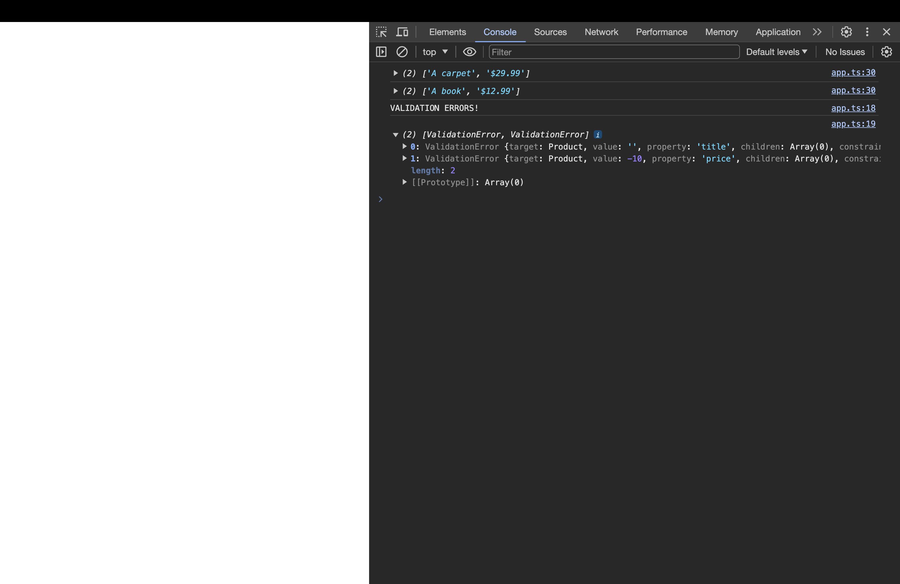

# 서드파티 라이브러리 및 TypeScript

[📌 서드파티 라이브러리](#-서드파티-라이브러리)<br>
<br>

## 📌 서드파티 라이브러리

### 📖 Lodash

- 자바스크립트 라이브러리이다.
- 설치 : `npm i --save lodash`
- 타입스크립트는 lodash 메서드가 무엇을 내보내는지 알지 못한다.

#### 💎 Lodash Type

- `npm install --save @types/lodash`

🔗 [Types/Lodash Github 페이지](https://github.com/DefinitelyTyped/DefinitelyTyped/tree/master/types/lodash)에 가면 `d.ts`파일이 보인다. 이는 선언파일로 실제 로직은 없다.

```ts
// shuffle.d.ts
import { shuffle } from "./index";
export = shuffle;
```

- 결과적으로 이러한 파일은 일반 자바스크립트를 타입스크립트로 바꿔준다.
- 이렇게 타입 변환 패키지를 사용하면 바닐라 자바스크립트 패키지도 사용할 수 있다.

<br>

### 📖 `declare` 사용하기

- 타입을 설치할 수 없는 패키지를 타입스크립트에서 사용하는 방법에 대해서 알아보자.

```html
<!DOCTYPE html>
<html lang="en">
  <head>
    <meta charset="UTF-8" />
    <meta name="viewport" content="width=device-width, initial-scale=1.0" />
    <title>TypeScript</title>
    <script src="11_Libraries/dist/bundle.js" defer></script>
  </head>
  <body>
    <script>
      var GLOBAL = "THIS IS SET";
    </script>
  </body>
</html>
```

```ts
import _ from "lodash";

declare var GLOBAL: any;

console.log(_.shuffle([1, 2, 3]));
console.log(GLOBAL); // THIS IS SET
```

- `declare` 키워드를 사용하면 패키지(일반적으로 전역변수)를 타입스크립트에게 알릴 수 있다.

<br>

### 📖 [class-transformer](https://github.com/typestack/class-transformer)

#### 💎 product.model.ts

```ts
export class Product {
  title: string;
  price: number;

  constructor(t: string, p: number) {
    this.title = t;
    this.price = p;
  }

  getInformation() {
    return [this.title, `$${this.price}`];
  }
}
```

#### 💎 app.ts &rarr; class-transformer 적용 전

```ts
// app.ts
import { Product } from "./product.model";

const products = [
  { title: "A carpet", price: 29.99 },
  { title: "A book", price: 12.99 },
];

const loadedProducts = products.map((prod) => {
  return new Product(prod.title, prod.price);
});

for (const prod of loadedProducts) {
  console.log(prod.getInformation());
}
```

- 이렇게 별도의 데이터가지고 클래스에 적용시키기에는 로직이 복잡해질 수 있다. 이때, [class-transformer](https://github.com/typestack/class-transformer)를 사용한다.
- 설치 : `npm install class-transformer --save`, `npm install reflect-metadata --save`

#### 💎 app.ts &rarr; class-transformer 적용 후

```ts
// app.ts
import "reflect-metadata";
import { plainToClass } from "class-transformer";
import { Product } from "./product.model";

const products = [
  { title: "A carpet", price: 29.99 },
  { title: "A book", price: 12.99 },
];

// const loadedProducts = products.map((prod) => {
//   return new Product(prod.title, prod.price);
// });
const loadedProducts = plainToClass(Product, products); // plainToClass(변환하려는 클래스, 변환하려는 데이터)

for (const prod of loadedProducts) {
  console.log(prod.getInformation());
}
```

- 이 class-transformer는 주로 타입스크립트용으로 개발되긴 했지만 바닐라 자바스크립트에서도 작동한다.

<br>

### 📖 [class-validator](https://github.com/typestack/class-validator)

- 타입스크립트 데코레이터라는 개념에 기반한다.
- 이 패키지를 사용하면 클래스의 데코레이터를 이용해 유효성 검사 규칙을 추가할 수 있다. 그리고 클래스를 인스턴스화할 때 데코레이터를 이용하여 설정한 규칙의 유효성을 검사할 수 있다.

- 설치 : `npm install class-validator --save`

#### 💎 product.model.ts

```ts
import { IsNotEmpty, IsNumber, IsPositive } from "class-validator";

export class Product {
  @IsNotEmpty()
  title: string;
  @IsNumber()
  @IsPositive()
  price: number;

  constructor(t: string, p: number) {
    this.title = t;
    this.price = p;
  }

  getInformation() {
    return [this.title, `$${this.price}`];
  }
}
```

#### 💎 app.ts

```ts
import "reflect-metadata";
import { plainToClass } from "class-transformer";
import { Product } from "./product.model";
import { validate } from "class-validator";

const products = [
  { title: "A carpet", price: 29.99 },
  { title: "A book", price: 12.99 },
];

const newProd = new Product("", -10);
validate(newProd).then((errors) => {
  if (errors.length > 0) {
    console.log("VALIDATION ERRORS!");
    console.log(errors);
  } else {
    console.log(newProd.getInformation());
  }
});

// const loadedProducts = products.map((prod) => {
//   return new Product(prod.title, prod.price);
// });
const loadedProducts = plainToClass(Product, products); // plainToClass(변환하려는 클래스, 변환하려는 데이터)

for (const prod of loadedProducts) {
  console.log(prod.getInformation());
}
```


