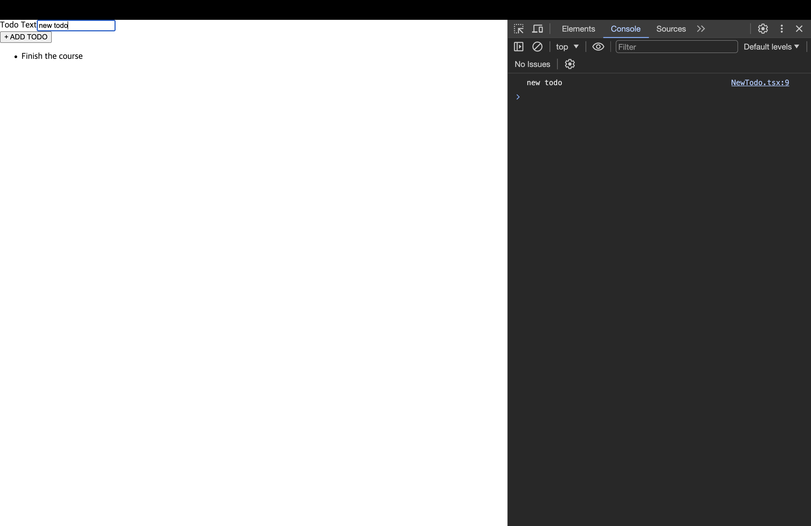

# TypeScript와 React

[📌 TypeScript와 React 함께 사용하기](#-typescript와-react-함께-사용하기)<br>
<br>

## 📌 TypeScript와 React 함께 사용하기

🔗 [React-TypeScript CheatSheets](https://github.com/typescript-cheatsheets/react#reacttypescript-cheatsheets)

### 📖 React + TypeScript 프로젝트 설정하기

- 설치 : `sudo npm install -g create-react-app`
- 시작하기 : `create-react-app my-app --template typescript`

<br>

### 📖 Props으로 작성하기 & Props의 타입

#### 💎 App.tsx

```tsx
import React from "react";
import TodoList from "./components/TodoList";

function App() {
  const todos = [{ id: "t1", text: "Finish the course" }];
  return (
    <div className="App">
      <TodoList items={todos} />
    </div>
  );
}

export default App;
```

#### 💎 TodoList.tsx

```tsx
import React from "react";

interface TodoListProps {
  items: { id: string; text: string }[];
}

// const TodoList: React.FC<TodoListProps> = (props) => {
//   return (
//     <ul>
//       {props.items.map((todo) => (
//         <li key={todo.id}>{todo.text}</li>
//       ))}
//     </ul>
//   );
// };

// export default TodoList;

export default function TodoList({ items }: TodoListProps) {
  return (
    <ul>
      {items.map((todo) => (
        <li key={todo.id}>{todo.text}</li>
      ))}
    </ul>
  );
}
```

<br>

### 📖 ref로 사용자 입력 받기

```tsx
import { FormEvent, useRef } from "react";

export default function NewTodo() {
  const textInputRef = useRef<HTMLInputElement>(null);

  function todoSubmitHandler(event: FormEvent) {
    event.preventDefault();
    const enteredText = textInputRef.current!.value;
    console.log(enteredText);
  }
  return (
    <form onSubmit={todoSubmitHandler}>
      <div>
        <label htmlFor="todo-text">Todo Text</label>
        <input type="text" id="todo-text" ref={textInputRef} />
      </div>
      <button type="submit">+ ADD TODO</button>
    </form>
  );
}
```



<br>

### 📖 Cross-Component 커뮤니케이션

#### 💎 App.tsx

```tsx
import React from "react";
import TodoList from "./components/TodoList";
import NewTodo from "./components/NewTodo";

function App() {
  const todos = [{ id: "t1", text: "Finish the course" }];

  const todoAddHandler = (text: string) => {
    console.log(text);
  };

  return (
    <div className="App">
      <NewTodo onAddTodo={todoAddHandler} />
      <TodoList items={todos} />
    </div>
  );
}

export default App;
```

#### 💎 NewTodo.tsx

```tsx
import { FormEvent, useRef } from "react";

type NewTodoProps = {
  onAddTodo: (text: string) => void;
};

export default function NewTodo({ onAddTodo }: NewTodoProps) {
  const textInputRef = useRef<HTMLInputElement>(null);

  function todoSubmitHandler(event: FormEvent) {
    event.preventDefault();
    const enteredText = textInputRef.current!.value;
    onAddTodo(enteredText);
  }
  return (
    <form onSubmit={todoSubmitHandler}>
      <div>
        <label htmlFor="todo-text">Todo Text</label>
        <input type="text" id="todo-text" ref={textInputRef} />
      </div>
      <button type="submit">+ ADD TODO</button>
    </form>
  );
}
```
